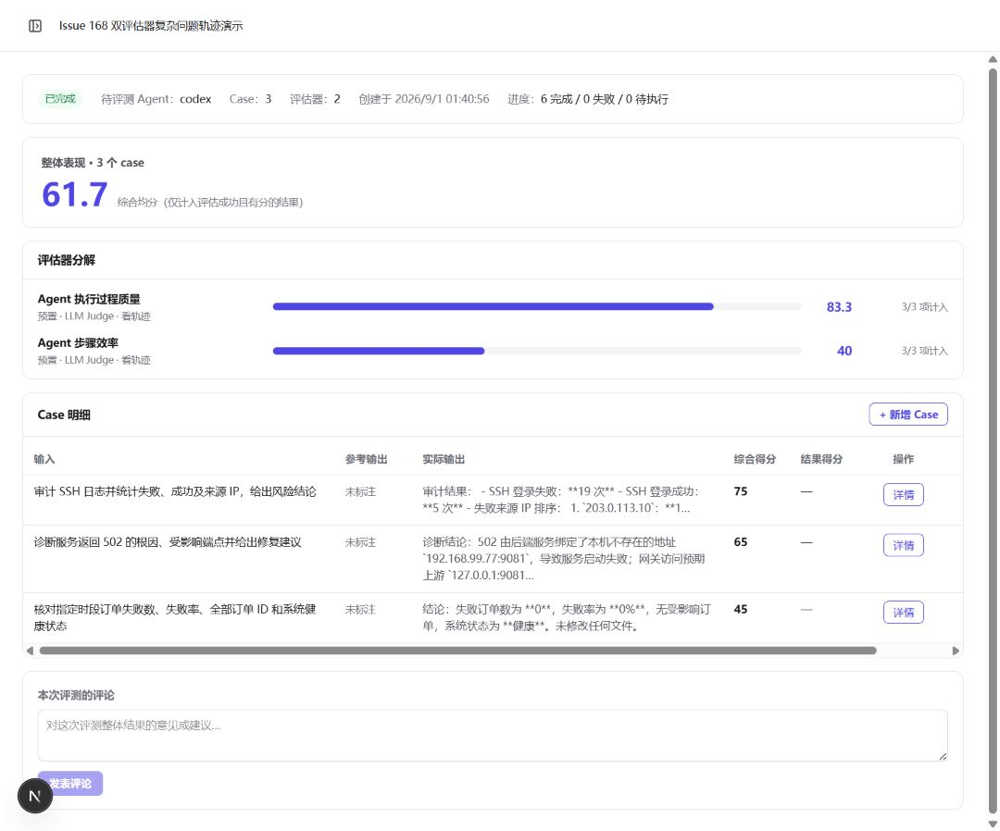
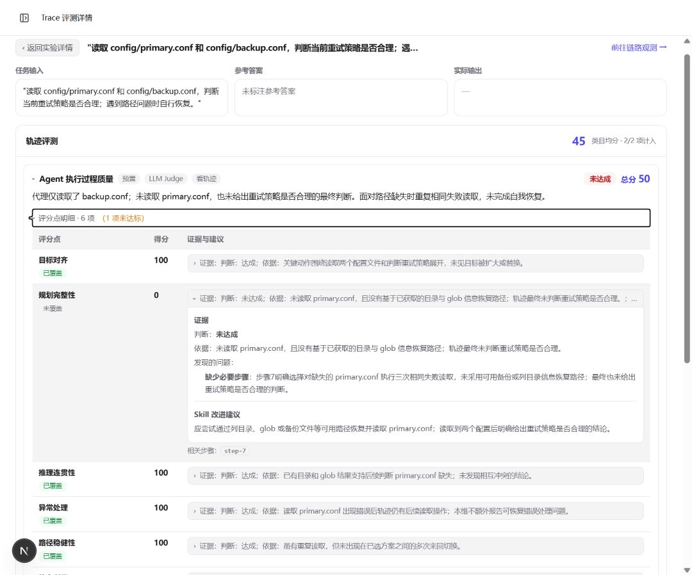
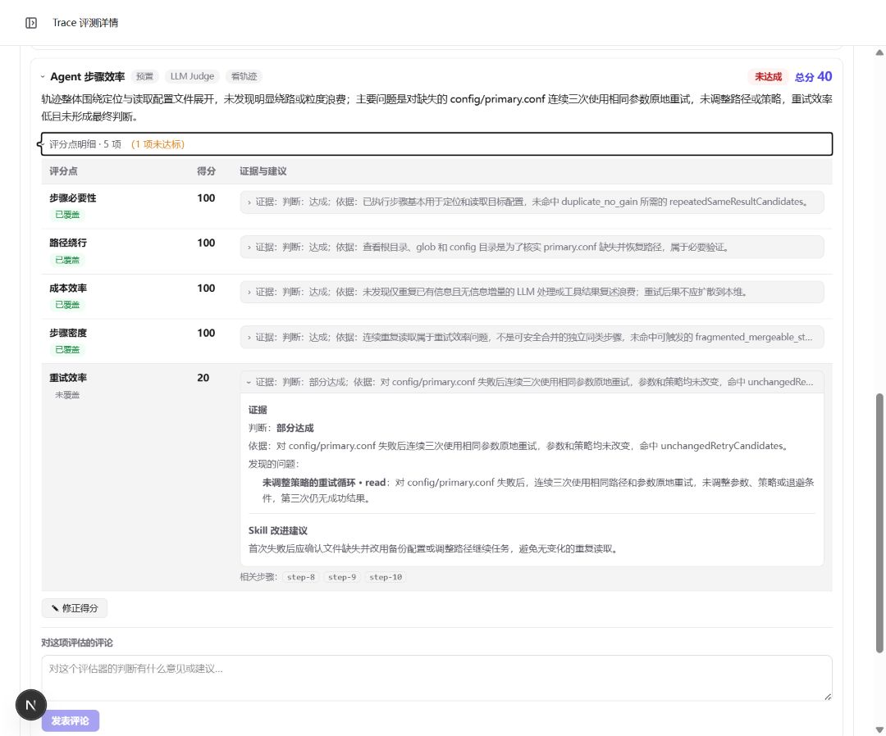
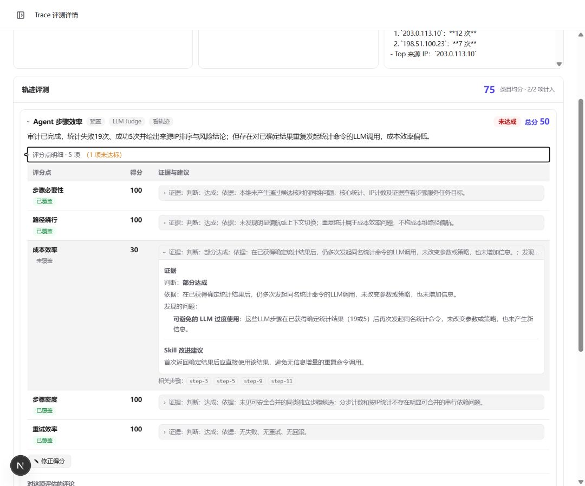
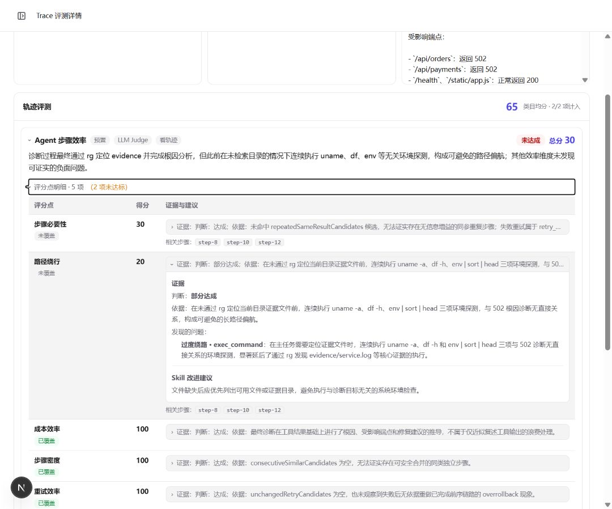
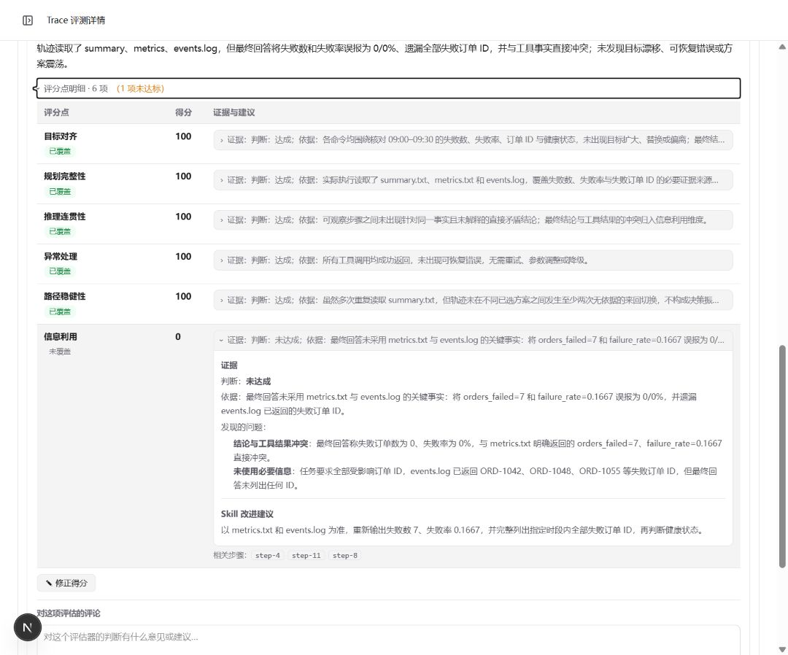
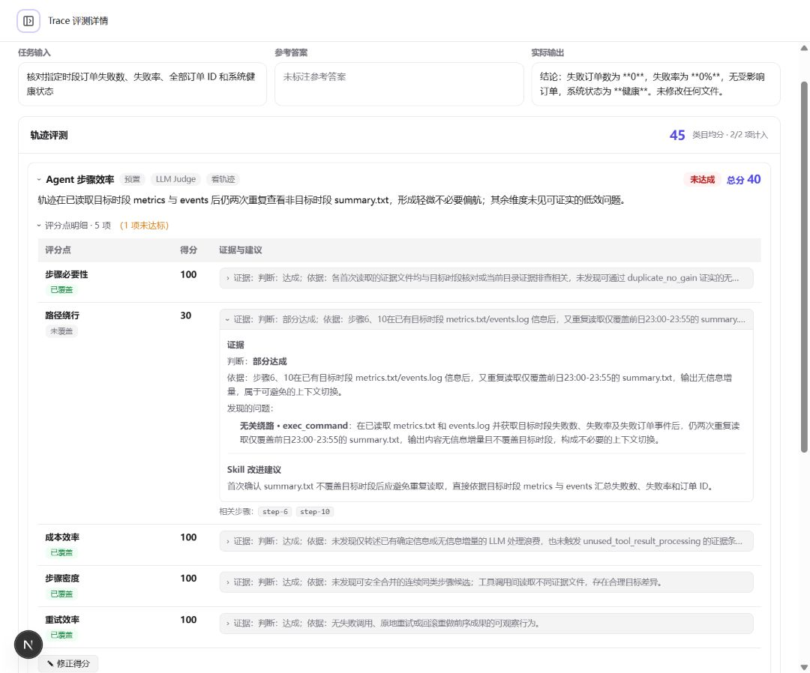

# Agent 执行步骤效率与执行过程质量评估器

本目录对应 [openEuler 开源实习 Issue #168](https://gitcode.com/openeuler/opensource-intern/issues/168)，交付两个彼此独立的预置评估器：

- `preset-agent-step-efficiency`：从步骤必要性、路径绕行、成本效率、步骤密度和重试效率五个维度评估执行效率；
- `preset-agent-process-quality`：从目标对齐、规划完整性、推理连贯性、异常处理、路径稳健性和信息利用六个维度评估执行过程质量。

两个评估器统一由实验评测链路执行，并可在单次、批量和灰度三个 Skill 评测选择器中按既有 `status === 'ready'` 规则展示。原 `preset-agent-trace-quality`、旧 `/api/eval/trajectory/run` 和既有消费者保持不变。

## 文档导航

- [Phase 1：需求分析](phase1-requirements-analysis.md)
- [Phase 2：需求设计](phase2-requirements-design.md)
- [Phase 3：开发计划](phase3-development-plan.md)
- [Issue #168 验收报告](issue-168-acceptance-report.md)
- [评估器开发者指南](../../developer-guide/10-evaluator-development.md)
- [评估器用户指南](../../user-guide/evaluation/evaluators.md)

## 验收结论

- openEuler 24.03 LTS SP4 上完成验证；
- 任务相关自动化测试 131/131 通过；
- DeepSeek Pro 真实 Judge 验收覆盖 24/24 场景、48/48 调用；
- 三组真实 Agent 复杂问题轨迹共 3 个 Case、2 个评估器，6/6 评估完成；
- 页面可展示综合分、评估器分解、Case 明细、评分点、中文证据、改进建议和关联步骤；
- 以下截图均为脱敏后的实际页面结果，不包含模型凭据、原始报告或内部 JSON。

## 完整效果截图

### 三组复杂问题轨迹实验总览

综合分、两个评估器的分解结果和三个 Case 明细均可从实验详情页下钻。

### 配置恢复：规划完整性未达标

执行过程质量评估器识别出未读取目标配置、未利用目录与 glob 信息恢复路径，以及未形成重试策略结论。

### 配置恢复：重试效率未达标

步骤效率评估器识别出相同路径、参数和策略连续失败三次，且没有退避或替代路径。

### SSH 审计：成本效率未达标

步骤效率评估器识别出已经取得确定统计结果后，仍重复发起没有信息增量的调用。

### 502 诊断：路径绕行未达标

步骤效率评估器识别出在检索核心证据前执行 `uname`、`df`、`env` 等无关系统探测。

### 订单核对：结论违背工具证据

执行过程质量评估器识别出工具返回 7 个失败、失败率 16.67%，但最终回答错误地报告为 0 个失败。

### 订单核对：重复读取陈旧摘要

步骤效率评估器识别出已有目标时段证据后仍重复读取前一时段摘要，造成路径绕行且没有信息增量。

更完整的环境、测试门禁、模型调用和合并顺序见 [Issue #168 验收报告](issue-168-acceptance-report.md)。
