# Benchmark 统一接入设计

本目录集中维护 Benchmark 从数据集接入、Agent 执行、官方评测到结果展示的设计。最后核对日期为 2026-09-15。

## 1. 当前实现范围

当前代码已完成一条可运行的 Benchmark 主链路：

```mermaid
flowchart LR
    A[管理员导入数据集] --> B[统一四步实验向导]
    B --> C[冻结 Case 与运行配置]
    C --> D[客户端控制通道下发 Agent 任务]
    D --> E[独立 Git 工作区执行]
    E --> F[上传 Manifest 声明的 Submission]
    F --> G[独立 Evaluator Controller]
    G --> H[官方 Case 容器与 Harness]
    H --> I[证据与 Raw Result 回传]
    I --> J[Adapter 归一化]
    J --> K[实验聚合、趋势与 Artifact 查看]
```



实现包含：

- `benchmark.yaml` 唯一 Manifest、构建期 Catalog 和五方法 `AbstractBenchmarkAdapter`；
- Dataset Loader、系统共享只读数据集和声明式 Presentation；
- 统一实验 API、单 Case 串行调度、持久化 Outbox、watchdog 和重启恢复；
- 通过现有常驻客户端的 `RUN_BENCHMARK_CASE` 控制指令执行任务，不要求客户端开放入站端口；
- 通用 Workspace、Agent Runtime、Artifact Collector 能力组合；
- 独立 Evaluator Controller、统一文件 Entrypoint、Docker Case 容器和官方 Harness；
- 完整 Submission/Evidence、进度、Raw Result、确定性归一化和持久化 continuation；
- Benchmark 数据集、实验向导、Case 详情、Artifact 查看下载、Case 重跑、Official Harness 重评和同基线趋势。

当前生产接入实例是 `SWE-bench Verified`。公共框架不解释其 Patch、测试名单和 Resolved 语义；正式成绩仍以 x86_64 Linux 和官方镜像为准。

## 2. 文档阅读顺序

| 顺序 | 文档 | 说明 |
|-|-|-|
| 1 | [数据集接入与展示](dataset-onboarding-and-presentation.md) | Manifest、Dataset Loader、管理员导入和公开展示边界 |
| 2 | [Agent 执行前服务端](agent-pre-execution.md) | 实验创建、Case 拆分、任务信封和控制通道下发 |
| 3 | [执行器](executor.md) | 工作区准备、Agent Runtime、Artifact 收集与回调 |
| 4 | [提交校验与评测下发](evaluation-dispatch.md) | Patch 校验、EvaluationJob 冻结和评测 Outbox |
| 5 | [评测服务](evaluator.md) | Controller、统一文件协议、官方 Harness 和证据回传 |
| 6 | [结果处理](result-processing.md) | Raw Result、归一化、固定分母聚合与查询 |
| 7 | [前端接入](frontend-development-plan.md) | 统一向导、详情、Artifact、重试/重评和趋势 |

## 3. 代码落点

```text
packages/benchmark-protocol/       跨进程协议、Schema 与错误契约
benchmarks/<key>/                  单个 Benchmark 的 Manifest、Adapter、Loader、Evaluator
generated/benchmark-catalog/       构建期生成的三端 Catalog
src/lib/benchmark/                 平台编排、调度、回调、聚合与运行时配置
src/app/api/benchmark/v1/          执行器和 Evaluator 的机器间 API
src/app/api/experiments/           浏览器使用的统一实验 API
services/executor/                 由常驻客户端加载的通用执行器 Runner
services/evaluator/                独立部署的 Evaluator Controller
src/components/eval/               实验向导、详情、趋势和 Artifact 交互
scripts/benchmark/                 Catalog 与数据集工具
scripts/start-evaluator.sh          Evaluator 部署入口
scripts/evaluator-doctor.sh         Evaluator Doctor 与 Gold Smoke
```

## 4. 稳定边界

- 浏览器继续使用 `/api/experiments` 和既有实验详情路由；`/api/benchmark/v1/*` 只承载机器间协议和 Benchmark 专用只读结果。
- Agent 只接收 Public Case 和完整任务说明；Gold Patch、测试补丁和测试名单只保留在平台与 Evaluator 边界内。
- 执行客户端复用安装时保存的 `insightBaseUrl` 上传 Artifact 和回调，不新增第二套部署地址。
- Evaluator 配置从 `data/config/benchmark-evaluator.env` 原子热加载；默认使用 Bearer Token，`none` 仅适用于双向网络已隔离的环境。
- 同一实验当前按 Case 串行；Case 重跑创建新 Run，Official Harness 单项重评复用最新有效 Patch。
- 聚合只读取重试图叶子，并以冻结的 `expectedCaseCount` 作为分母，避免失败或历史尝试被静默忽略。

## 5. 扩展新 Benchmark

新增 Benchmark 原则上只新增 `benchmarks/<key>/` 接入包：

```text
benchmarks/<key>/
├── benchmark.yaml
├── adapter/index.ts
├── dataset/index.ts              # 特殊数据格式才需要
├── evaluator/
│   ├── evaluator.yaml
│   └── entrypoint
├── schemas/
│   ├── case.schema.json
│   └── result.schema.json
└── smoke/
```

Adapter 实现五个业务 hook：Case 拆分、Agent Task 构造、提交物校验、EvaluationJob 构造和结果归一化；Evaluator 实现统一文件协议，独立依赖放入实例 Dockerfile。`adapterKey` 与 `evaluatorKey` 不要求相等。只有现有通用能力无法表达需求时，才扩展执行器能力；不要在平台调度器、Runner 或 Controller 中增加具体 Benchmark 分支。这是统一开发规范，不是零代码、纯配置接入。

详细扩展约束见[开发者指南](../../developer-guide/07-conventions-and-extension.md)。
