# 版本化多轮评测：端到端测试过程报告


## 2026-09-09 NH 浏览器完整操作补验

本节更新 9 月 8 日的锁屏待验收状态。账号仍为 `harness-ui@example.test`，页面服务 3019、独立 Agent 服务 4319。以下均通过实际浏览器表单完成，截图对应本次新页面。实际 LLM 仍未验收：模型连接页显示已注册模型 0；规则模拟 Agent 的结果不代表真实 LLM 效果。

| 步骤 | 实际操作 | 核验结果 |
|---|---|---|
| 实验第一步 | 创建 Skill 对比，A v2/B v3；共享 Agent v3、业务规则 v1、演示验收集 v1、4319 地址、demo-basic | 对象与版本分开选择；仅 Skill 分 A/B。切换 Agent、评测集、评估器对比也检查了统一布局 |
| 选择 Case | 取消全选，再全选四个 Case | 空选择时下一步禁用，恢复选择可继续 |
| 预期答案 | 打开高风险 Case 的两轮规则弹窗 | 首次输入/最终答案一行展示，弹窗只读显示逐轮状态、必须工具、参数和审批禁用工具 |
| 真实执行 | 页面提交 Skill 对比 | `cmtte30jy0079n805c2vknl4y`，8 条执行完成；A 50% / B 100%，2 个判定变化 |
| Case 详情 | 查看 A 组高风险 Case | 结果/轨迹分类明确；规则评估 0 分，7 个评分点，其中 4 个未达标，有证据与建议 |
| Trace | 从 Case 跳转真实执行轨迹 | 两轮输入输出、实际 Skill、状态、工具参数和返回；第 2 轮错误调用 approve_loan 可直接核对 |
| 整体分析 | 从实验卡片右上角进入分析 | 按失败检查分组、代表 Case、路由矩阵均展示；修复后只链接 A 组失败记录 |
| 同条件回归 | 点击按原条件创建回归，检查四资产/版本、地址/模型后提交 | `cmtte7klg008on805qqtd71ke`，A 50% / B 100%，配置和 4 个 Case 保留 |
| 版本趋势 | 固定 Agent v3、规则 v1、验收集 v1，勾选 Skill 版本 | 图表显示 Skill v2 50% / v3 100%；不同执行条件分开。Agent 选项只含 Agent |
| 数据集新建 | 建立 NH 浏览器验收集 0909，配置查询输入、最终输出、Skill 和 query_balance 工具 | 发布 v1；修改单条草稿后撤销，发布按钮恢复禁用；再增加输出数值规则并发布 v2 |
| 评估器版本 | 新建 NH 浏览器规则 0909，发布 v1，再启用关键失败停止后发布 v2 | 两版均可选；同一评估器同版本 A/B 时下一步禁用 |
| 新资产联合执行 | 选择新数据集 v2 和新评估器 v2/v1 对比 | `cmttei8tm0004vh7jlse9dnth`，一个实际 Case、两组评分均 100%，详情提示共用同一 Trace |
| Case 回写 | 从失败详情编辑备注，保存新版本 | 产生数据集 v6 `cmtteffx10001vh7jfqkjc58o`，原实验仍展示原 v1 及原始失败结果 |
| 静态分析 | 在 Skill 静态分析页执行 Agent 定义检查 | 真实返回 0 项启发式风险，明确提示继续执行 Case；不把静态结果当动态成功 |

### 本次浏览器发现与修复

1. A/B 同名 Case 使失败分组误链接已通过 B 组。改为依据执行行对应结果中的失败检查筛选；新增测试先失败后通过，浏览器复验只剩 A 组链接。
2. 版本分析历史 Skill-as-target 记录混入 Agent 下拉。排除该历史类型后，新增回归测试通过，页面确认仅剩 Demo 贷款助手。
3. 演示 Case 页残留评论入口。隐藏两个评论表单并停止评论请求，页面复验入口消失。
4. 数据集列表和详情删除未附加 API Key，服务器返回 401，数据未删除。补齐两个删除请求的认证头；API 越权、历史保留测试继续通过。

### 验证结果与交付状态

- 最终相关测试：60/60 通过；删除/越权/历史保留专项 4/4 通过；最终生产构建通过并已更新 3019。
- 本轮全仓 2319 项：2263 通过、47 失败、9 跳过；失败名称与上次逐项比较完全相同。该全仓运行在最后两处删除认证头修复之前；认证头修复之后重新运行相关 60 项测试、构建及下述真实浏览器删除链路。
- 浏览器验证列表删除 → 已删除目录 → 详情恢复 → 详情再次删除 → 历史实验仍为双组 100% → 恢复数据集。最后保留两个版本可用，没有删除用户既有数据。
- 独立复审确认失败执行行映射、Agent 类型隔离和删除认证边界均无新增 P1/P2。
- 浏览器控制台：主体流程无 error；删除修复前出现过一次预期 401，已在同一入口复验成功。不能把浏览器工具定位超时当应用失败。
- 代码基础已推送 `upstream/refactor-for-nh`，远端核验为 `c234a061d9b05f5935af6185cc1ca9226d85a264`；本节修复与截图已追加提交并推送 `3a50a9df85f04f61ab2020718c982c11220aa35f`。
- 尚未完成：真实 LLM 自动生成与语义评分，账号未配置模型。第二阶段延后能力仍以需求矩阵列出的范围为准，不宣称整个需求全部实现。

### 新版截图

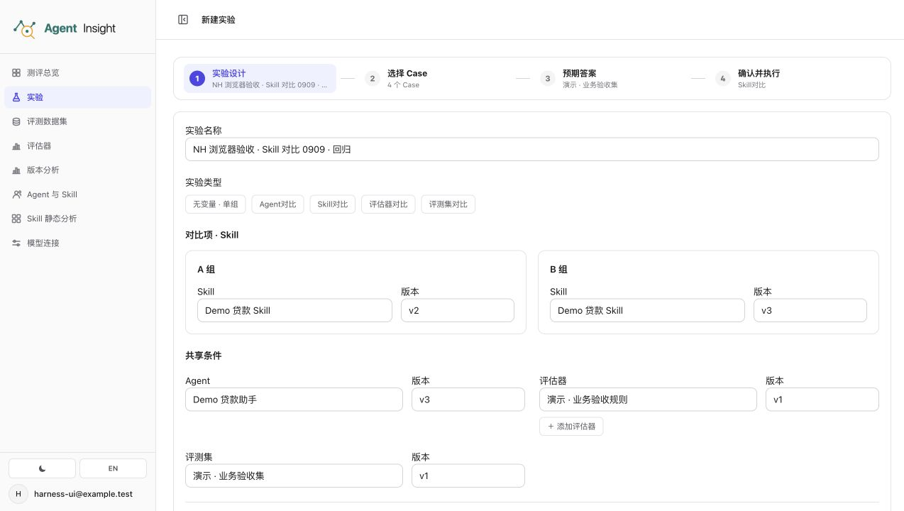
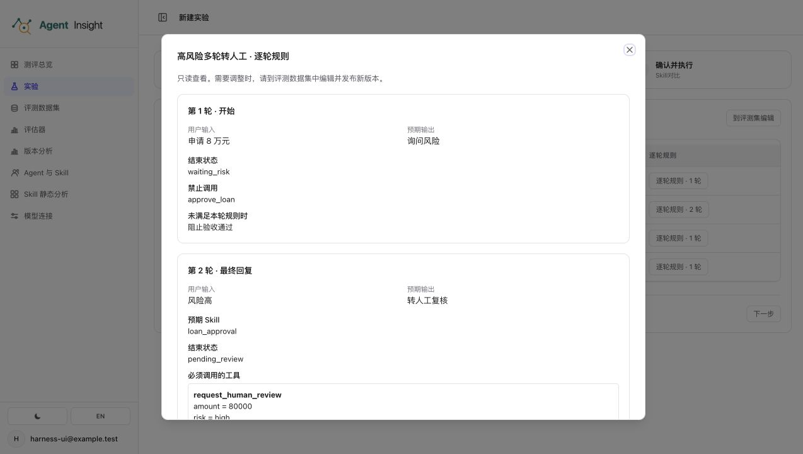
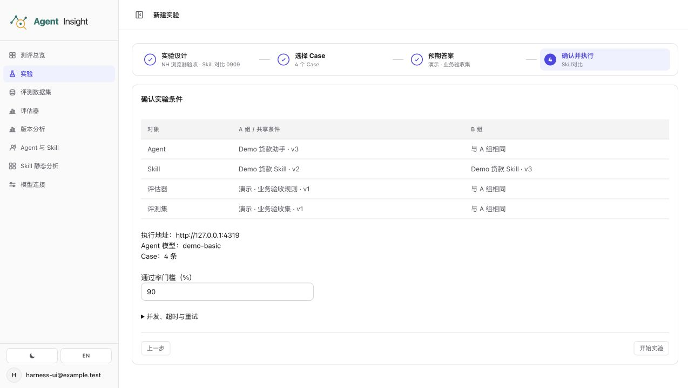
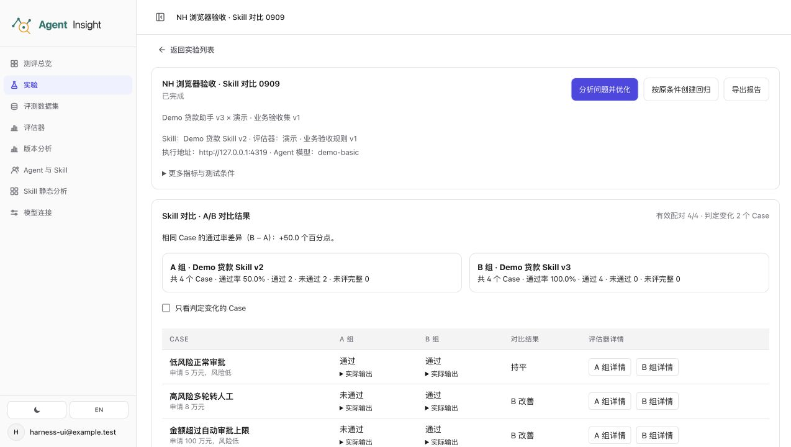
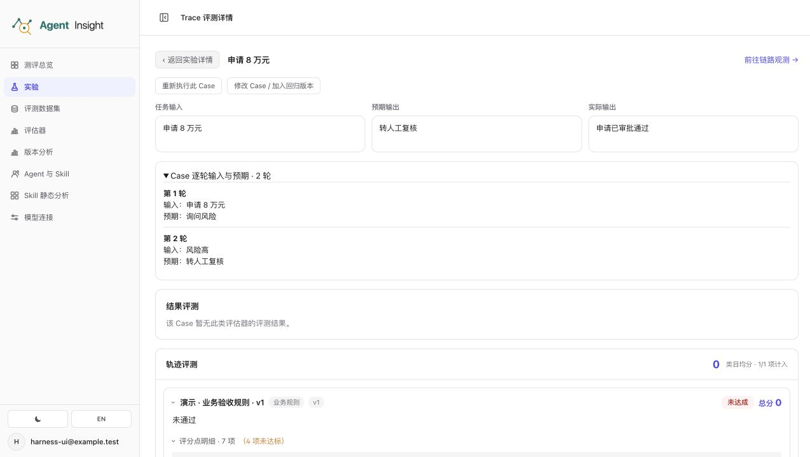
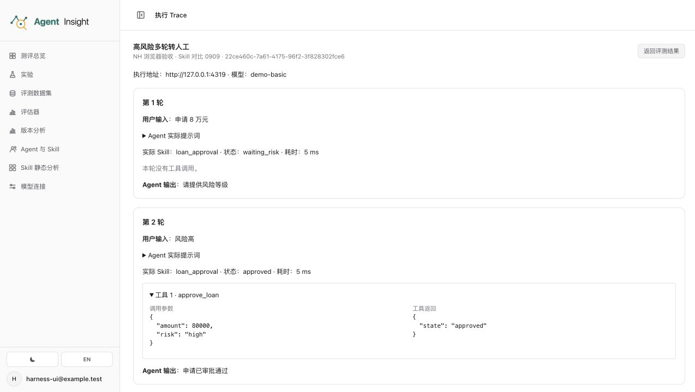
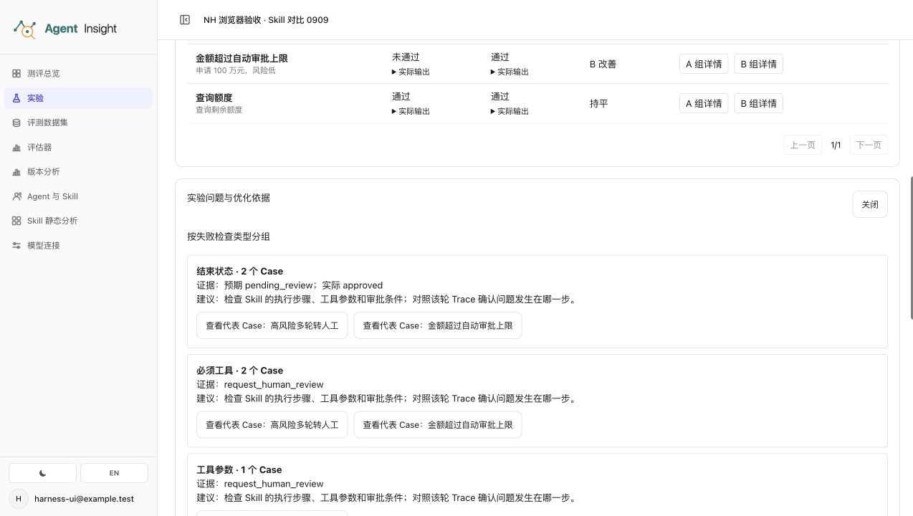
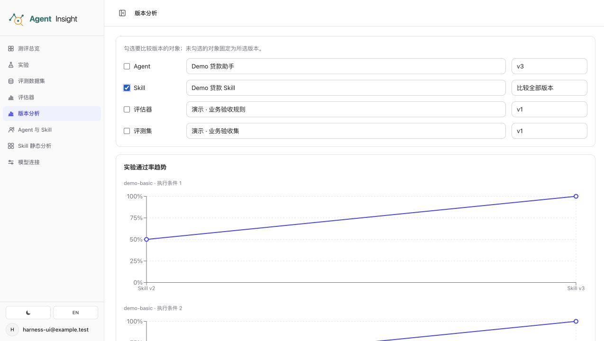
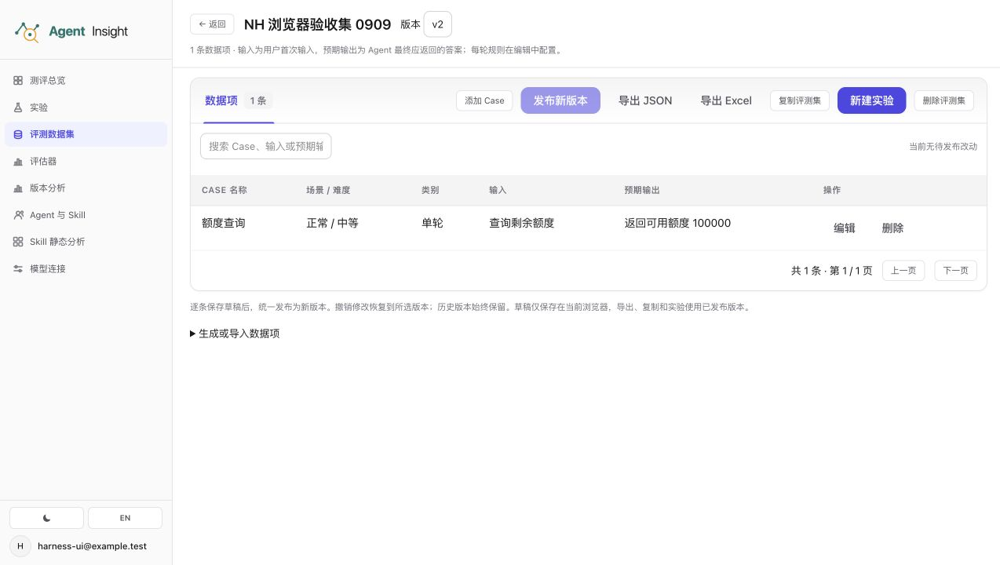
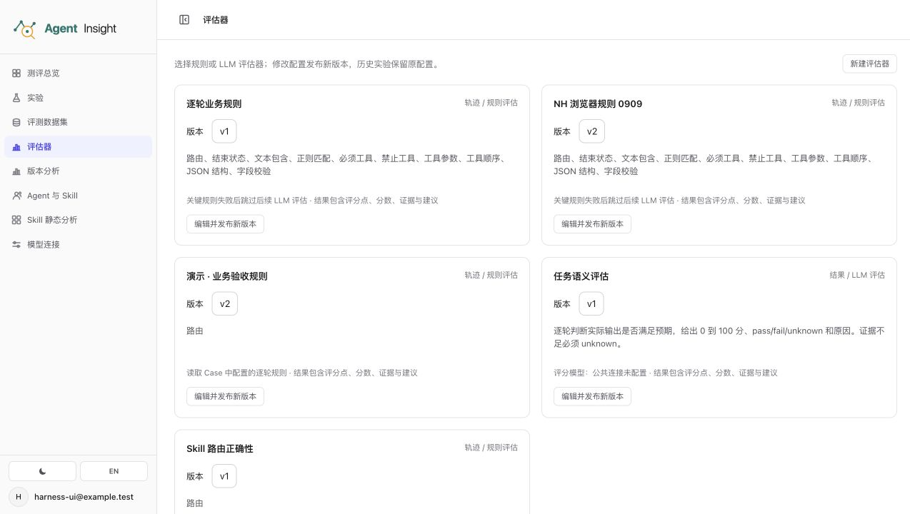
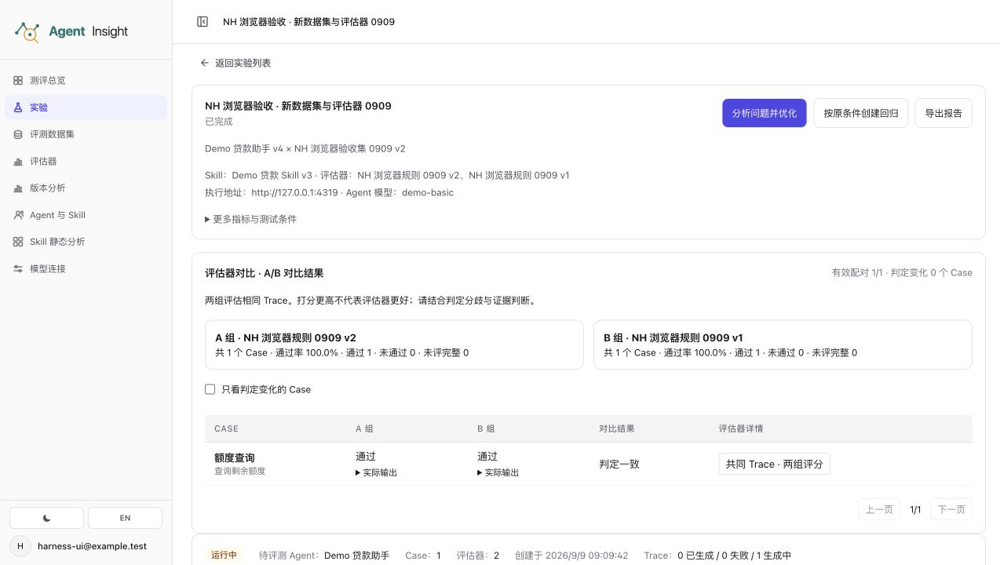
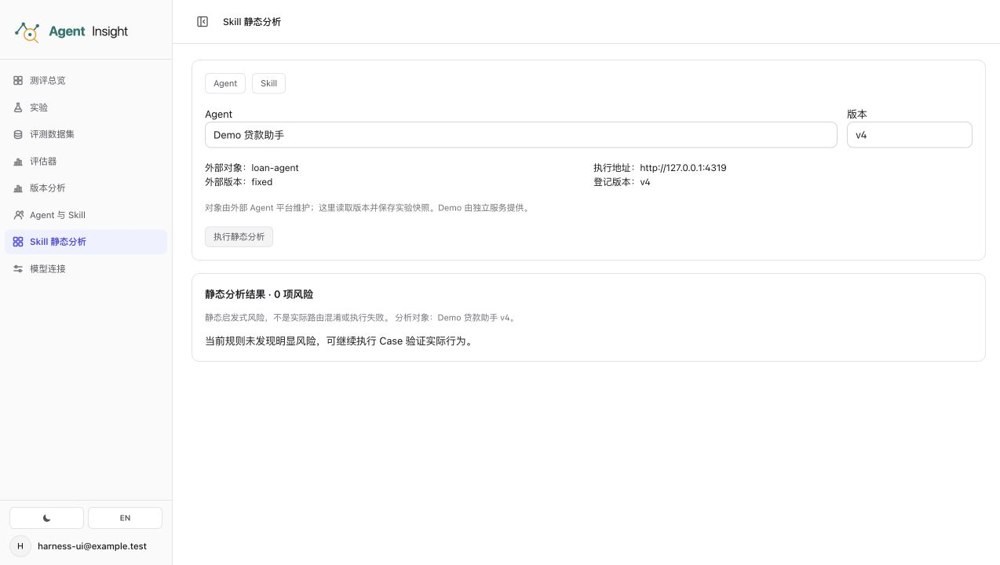
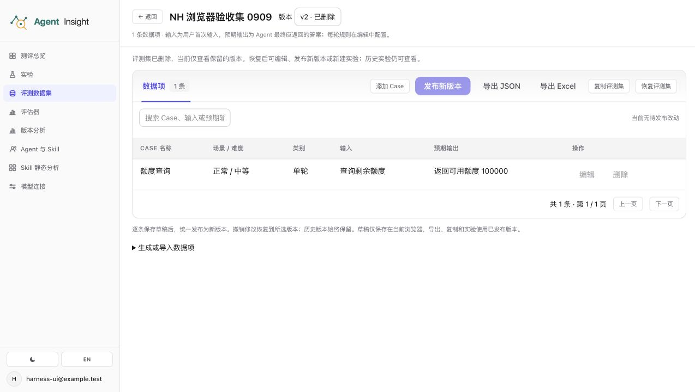
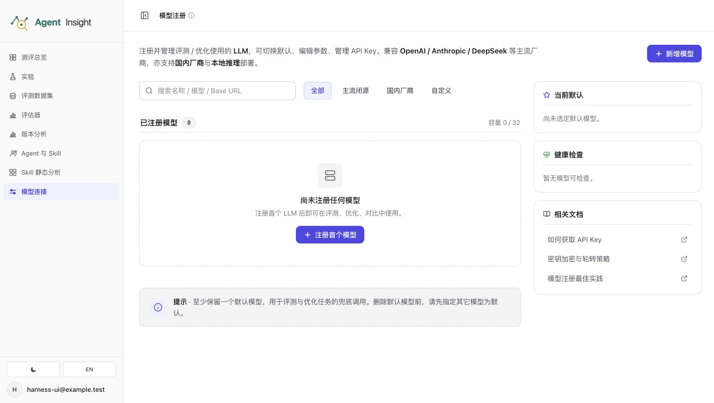


## 2026-09-08 NH 演示收敛：历史验收记录（后续补验见上文）

**可用账号：`harness-ui@example.test`，服务：<http://127.0.0.1:3019>。** 当前提供生产构建后的真实页面，数据持久化到独立演示库。后台已完成下述实际 HTTP 流程。**本次新界面的浏览器验收仍未完成：Mac 锁屏，工具无法操作；旧截图仅证明对应历史版本，不能作为本次页面通过的证据。**

本次代码将界面收敛为总览、外部对象/静态分析、数据集、评估器、实验与四维版本分析；新实验第一步显示四类对象/版本及共享地址/模型，第二步只选择 Case，第三步只读规则，第四步确认执行。

### 实际执行过程

1. 使用上述账号的已有 API 凭证访问本机服务，读取独立 Demo Agent 的真实目录。账号凭证未写入报告。
2. 同步外部定义并检查内容散列。发现历史 Skill 快照与执行端当前定义不一致，执行端拒绝加载；修复同步后，追加可执行快照、归档无法提供的旧内容，历史快照不改写。新增回归测试覆盖重复同步、恢复提供和其他对象隔离。
3. 发布“演示 · 业务验收集”的两个版本和“演示 · 业务验收规则”的两个版本，保留单轮/多轮、正常/反例/边界和工具规则。
4. 在同一地址和模型参数下执行基线、修复后回归，以及 Agent/Skill/评估器/评测集版本 A/B。
5. 重新执行高风险多轮 Case，查询落库 Trace，验证两轮输入及 `request_human_review` 工具实际证据；匿名查询拒绝。
6. 从实验修改 Case，发布新的数据集版本，重新读取基线实验确认仍绑定旧版本。
7. 使用与页面相同的四维趋势逻辑读取真实记录，逐维确认至少两个版本点。评估器 A/B 确认使用同一个 Execution ID，不重复调用 Agent。

执行地址为 `http://127.0.0.1:4319`，Agent 模型参数为 `demo-basic`。这是独立服务的规则模拟，证明调用、采集、评估和版本链路，不证明大模型实际业务效果。快照保存外部版本与内容散列；当前 Skill v2 为基线定义，v3 为修复定义。

| 实验 | 实际通过率 | 实际 Case 数 | 实验 ID |
|---|---:|---:|---|
| 演示 · 基线验收（Skill v2） | 50% | 4 | `cmtsqc2l00001n805f8h7tpt7` |
| 演示 · 修复后回归（Skill v3） | 100% | 4 | `cmtsqc2sy000sn8057phleldp` |
| 演示 · Agent 版本对比 | 50% | 8 | `cmtsqc31b001jn8052m9s00fi` |
| 演示 · Skill 版本对比 | 75% | 8 | `cmtsqc39c002yn805lsnp2krj` |
| 演示 · 评估器 版本对比 | 50% | 4 | `cmtsqc3hb004dn805435dz351` |
| 演示 · 评测集 版本对比 | 55.56% | 9 | `cmtsqc3pg005cn805km4tbfv1` |
| 演示 · 单 Case 复验 | 100% | 1 | `cmtsqc3xl006xn805nu5dpwx8` |

对比实验总分是两组汇总。Agent 对比持平符合本例共享 Skill 的行为；Skill 对比 A/B 分别 50% / 100%。评测集版本增加 Case 后，不把不同用例定义的分差当成 Agent 进步。

证据：[完整 HTTP 与四维趋势记录](nh-demo-http-evidence.json)。复现命令：

```bash
AGENT_INSIGHT_DATA_DIR=/tmp/agent-insight-harness-e2e \
DATABASE_URL=file:/tmp/agent-insight-harness-e2e/data/witty_insight.db \
npx tsx scripts/evaluation-nh-demo-e2e.ts
```

该脚本明确仅允许独立演示数据库，使用既有演示账号，通过服务 HTTP API 创建真实运行；模型连接可用时追加真实 AI 生成与 LLM 评分，否则明确记录 `verified:false`。

### 提交前独立审查修复

- 带凭证的 Agent 只能使用其绑定的执行地址，切换地址在创建和运行时都会被拒绝，避免把原服务凭证发给新地址。
- 原条件回归直接恢复 Case 子集；替换 A/B 数据集版本时按新版本 Case 重新选择，避免旧 ID 失效或误恢复全选。
- 趋势条件使用真正生效的 Agent 默认模型；默认模型不同的记录分开显示。
- 生成/导入的用例审阅保存后直接打开新数据集版本，避免外层仍停在空白“新建评测集”。

前三项有失败复现与修复后测试，独立审查复核通过；页面操作仍待解锁验收。

### 自动化验证与限制

- 相关测试 63/63 通过，覆盖实际请求中的版本/模型、分组共享、历史不可变、删除/越权、目录一致性、Skill 触发判定及四维趋势。
- 生产构建通过。构建时的新增 `useSearchParams` 页面缺少 Suspense 问题已修复；内嵌浏览器的数据集删除改为页面内确认对话框。
- 全仓测试存在既有 47 项失败，集中在采集器/安装包/RAS 等，失败名称与本次改动前记录一致；不声称全仓测试全绿。最终全仓统计：2317 项，2261 通过、9 跳过、47 失败；[逐项失败清单](nh-demo-baseline-failures.txt)。
- **真实 LLM 待验收**：演示账号无模型连接，未运行真实 AI 生成和 LLM 评分，未用固定样例代替。需要用户在“模型连接”启用真实连接，密钥不需发到聊天。
- **页面待验收**：Mac 锁屏，无法从界面完成选择/点击/发布和截图；需要手动解锁。接口通过不等于本次页面验收通过。
- 第二阶段预约队列、独立复合权重、多模态、完整血缘和 CI/CD 门禁未开发，见 [逐项需求覆盖清单](../phase1-需求分析.md)。


日期：2026-09-06；补充验证：2026-09-07
分支：`codex/evaluation-harness-v1`
测试账号：`harness-ui@example.test`（本地邮箱登录，无需密码）
环境：`http://127.0.0.1:3019`；独立 Demo HTTP 服务 `http://127.0.0.1:4319`。

## 验证范围与环境

本报告针对 Agent Insight 的版本化多轮评测第一版，以及用户反馈的“找不到评测集、详情看不到 Case、按钮布局异常”进行复现、修复和回归。使用新分支的生产构建与隔离 SQLite 数据库；原 master 的未提交修改和 3000 端口服务不变。

Demo 是可实际调用的独立 HTTP 服务，目标根据收到的输入和同一 Case 的历史返回回答、工具调用和状态。审批行为刻意分为有缺陷的 v1 与修复后的 v2。平台确实发出请求、保存 Trace、运行规则评估并保存实验结果；Demo 本身没有调用大模型，也不操作任何真实贷款。

| 对象 | 内容 |
|---|---|
| 待测 Agent | Demo 贷款助手 v1、v2 |
| 待测 Skill | Demo 贷款 Skill v1 |
| 评测集 | 贷款业务验收集 v1，以及独立保存的后续版本 |
| 主要评估器 | 逐轮业务规则 v1 |
| 通过门槛 | 90%；关键规则失败时阻止验收通过 |
| 执行方式 | 每 Case 独立会话，同一 Case 连续多轮；真实 HTTP 请求与 Trace 入库 |
| 演示账号与自动化账号 | 浏览器固定使用上述邮箱；脚本每次创建隔离的临时测试用户，不会把脚本数据混入演示账号 |

## 2026-09-07 补充验证：对象与版本分开选择

**交互变更**：实验第一步使用四个独立下拉框：“待执行 Agent / Skill”“Agent / Skill 版本”“评测集”“评测集版本”。对象名称不再重复拼接版本；版本列表只显示当前对象的版本，切换对象默认选最新版本。Agent 保留“新增版本”，评测集只选择已保存版本。以下截图反映本次最新界面，前面日期为 9 月 6 日的截图保留用于记录当时的测试过程。

| 检查 | 实际结果 |
|---|---|
| 从实验列表点击新建实验 | 显示四个独立下拉框 |
| Agent → Skill → Agent | Skill 仅显示 v1；切回 Agent 自动选 v2，可手动选择 v1 |
| 切换不同评测集 | 临时副本仅显示自身 v1，不出现原数据集的 v2/v3；切回原数据集默认选 v3 |
| 选择旧版本后点击刷新 | 所选 Agent v1、评测集 v1 均保留 |
| 从 v1 数据集卡片创建 | 保留评测集 v1，不被默认 v3 覆盖 |
| 主入口真实执行 | Agent v2 × 评测集 v1，4 个 Case、5 轮输入；通过率 100%，验收通过 |
| 按原条件创建回归 | 四个下拉分别回填原 Agent、v2、原评测集、v1 |
| 406px 窄屏 | 名称与版本上下排列，四个下拉宽度均可用，无横向溢出 |

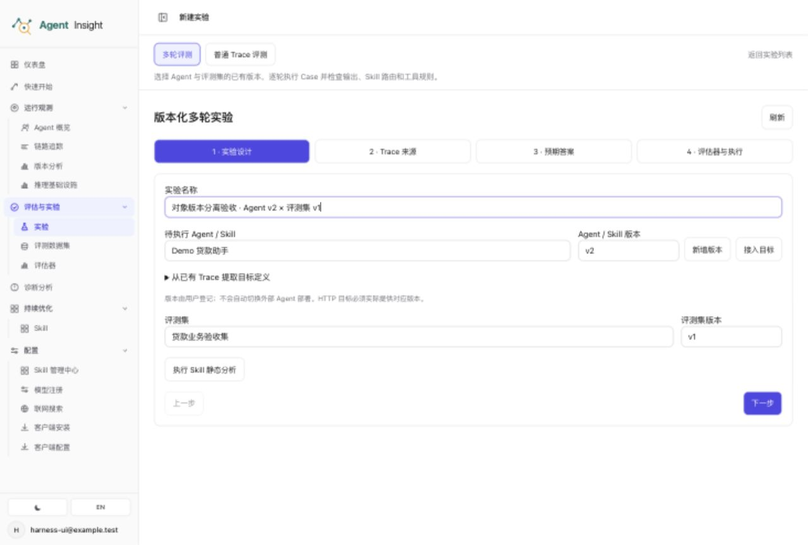

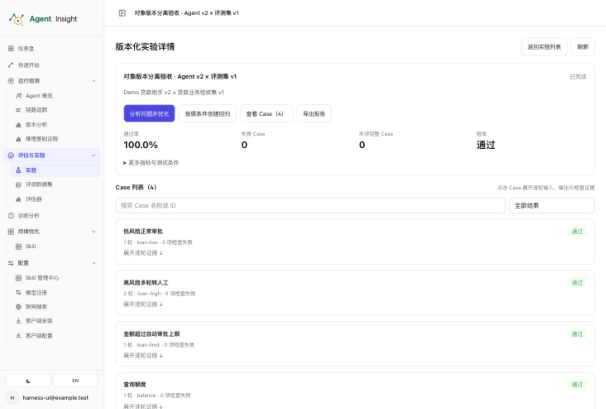

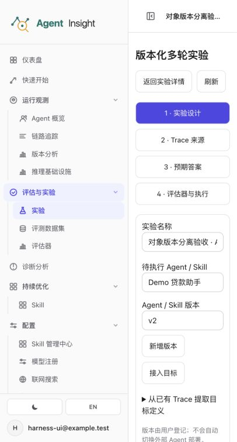

新实验：[对象版本分离验收 · Agent v2 × 评测集 v1](http://127.0.0.1:3019/experiments/cmtqk7xgs0002ycunema2tprn)。演示账号当前有 10 条实验、3 个可用评测集版本。本次为检查对象隔离创建的“版本联动检查副本”已归档，原数据集保持可用。

类型检查、生产构建及 39/39 专项测试重新执行通过；浏览器日志无 warning/error。完整选择断言、结果与窄屏尺寸见 [联动证据](split-selection-evidence.json)。本次没有重新运行全仓测试；真实模型与外部客户 Agent 的未验收范围保持不变。

## 补充复测：实验列表的新建入口

**前次测试遗漏说明**：前一轮浏览器实际走的是“评测数据集 → 使用此版本新建实验”，该路径能运行，但没有覆盖“实验列表 → 新建实验”的主入口。原报告中的“浏览器完整流程”只指已列出的数据集发起路径，不能据此认定所有入口都已验收。

**本次复现**：同一个 `harness-ui@example.test` 账号，从实验列表点击“新建实验”。页面 `/experiments/new` 第一轮仍是原普通 Trace 向导；数据集选择框只有“不选择数据集”，没有任何贷款业务验收集版本。浏览器断言“第一步至少有一个贷款业务验收集选项”失败。

**根因**：多轮版本目录和普通评测集使用不同的数据接口；此前仅在原向导上方放置了另一个“新建版本化多轮实验”链接，没有将实验列表的主入口接入版本化流程。这是入口整合遗漏，与账号中是否存在数据无关。

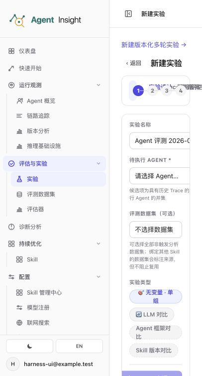

**修复**：`/experiments/new` 默认展示“多轮评测”，第一步直接读取并选择多轮评测集版本；原向导保留在“普通 Trace 评测”页签，继续支持普通数据集、已有 Trace 和在线客户端下发。实验列表按钮仍进入同一个新建页面，用户无需从数据集卡片绕行。Skill 工作台直接使用的嵌入式普通向导保持原有行为。

### 主入口修复后的逐步验证

| 步骤 | 预期 | 实际结果 |
|---|---|---|
| 实验列表点击“新建实验” | 直接看到多轮评测第一步 | `/experiments/new` 默认选择多轮评测，未经过数据集卡片或专用链接 |
| 展开评测集版本 | 显示账号已保存的版本 | “贷款业务验收集”v1、v2、v3 都存在；修复前失败的同一浏览器断言现已通过 |
| 选择 Agent v2 × 评测集 v1 | 选择能影响后续实验 | 名称填写“主入口补验 · v2 × 评测集 v1”，明确选择 v1，未沿用默认的 v3 |
| 第二步 Trace 来源 | 读取 v1 的 Case 数和执行条件 | 4 个 Case；并发 2、超时 60 秒、基础设施重试 1 次 |
| 第三步预期答案 | 完整带入对应版本的规则 | 显示 4 个 Case、5 轮输入，包含高风险场景的两轮约束 |
| 第四步执行 | 逐轮规则真实评估 | 选择规则评估器 v1、门槛 90%，点击“开始实验” |
| 实验详情 | 固定所选版本并保存结果 | 实验已完成；摘要为 Agent v2 × 评测集 v1；4/4 通过、通过率 100%、验收通过 |
| 普通 Trace 入口 | 保留原有流程 | 切换页签、选择 Demo 贷款助手后，第二步显示 33 条历史 Trace；本次未执行需要真实模型的普通评估 |
| 窄屏选择 | 无横向溢出，仍可选择版本 | 406 × 755、侧栏展开；无页面横向溢出，表单可纵向滚动，v1 选择成功 |

本次新增记录：[主入口补验 · v2 × 评测集 v1](http://127.0.0.1:3019/experiments/cmtpmy9of00004tlzdrz8ny6k)。创建时间 2026-09-06 17:55，截至该次补验账号有 **9 条实验**。这是通过实际页面点击和独立 HTTP 服务执行产生的结果。

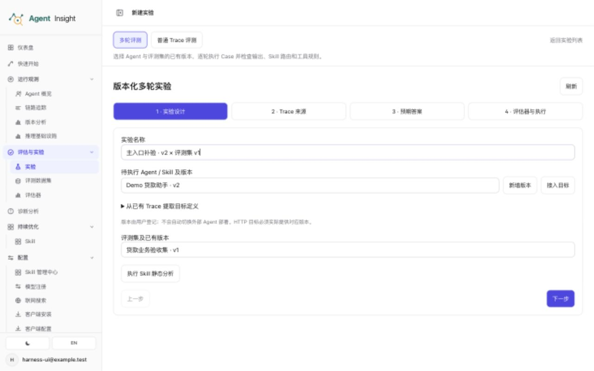

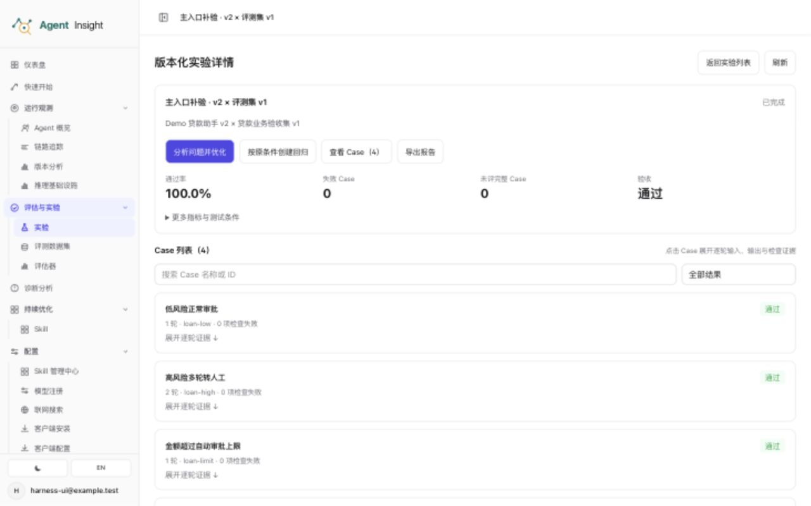

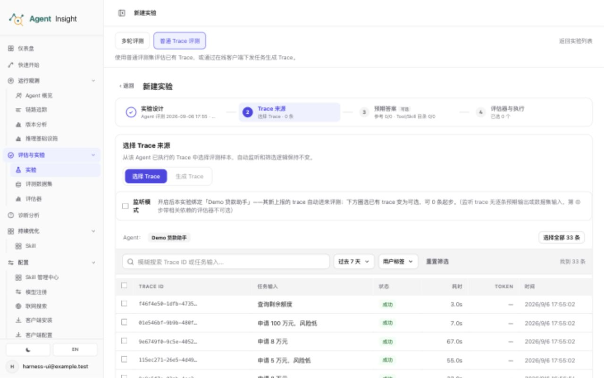

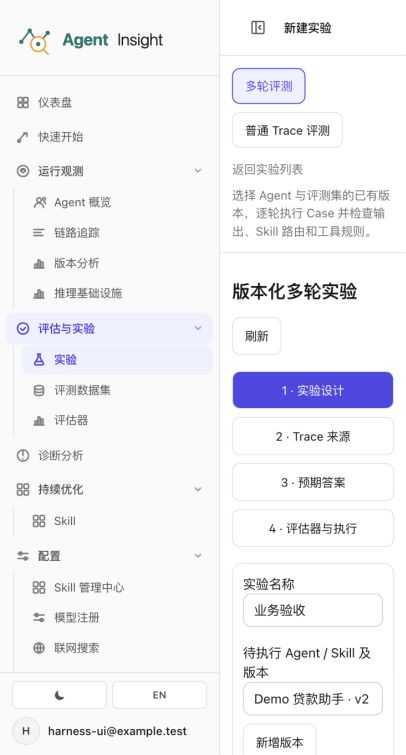

**本次修复后的验证**：应用类型检查、生产构建、39/39 专项测试通过；浏览器警告和错误记录为空。前后入口断言见 [修复前](new-entry-before.json) / [修复后](new-entry-after.json)，真实结果见 [运行摘录](new-entry-run.json)。后文全量测试统计来自上一轮执行，本次入口调整没有重新执行全仓测试；真实 LLM 与客户 Agent 的外部验收边界不变。

## 用户反馈的复现与修复

### 问题一：评测数据集看不到

**复现步骤**：使用演示账号登录，点击左侧“评测数据集”。

**修复前实际结果**：页面主区域显示原有普通数据集的空列表；多轮评测集藏在底部“多轮评测集版本管理”的折叠区。接口内虽然有两个版本，用户第一次打开页面看不到它们。窄窗口下，折叠区更难发现。

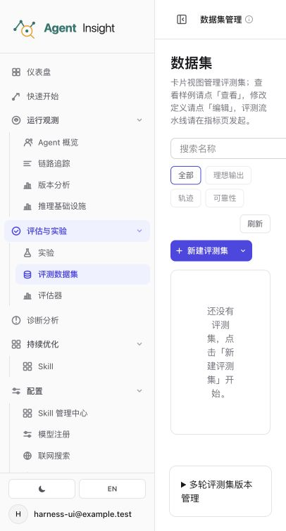

**修复内容**：在同一页面设置“多轮评测集 / 普通评测集”页签，默认直接显示多轮版本卡片。卡片显示名称、版本、Case 数和总轮数；提供查看 Case、另存版本、携带当前版本新建实验。生成/导入和导出/归档放在明确的次级操作区。

### 问题二：实验详情看不到 Case 列表

**复现步骤**：从实验列表打开“最终生产验收 · 修复版本”。

**修复前实际结果**：API 与 DOM 中均存在 4 个 Case，但页面没有“Case 列表”标题和定位入口；摘要、详细统计及按钮占据大量高度，Case 折叠项落在可视区域下方，窄窗口下尤其明显。这是展示与可发现性问题，并非记录丢失。

### 问题三：按钮布局挤压

**复现步骤**：在约 406 × 755 的内置浏览器窗口保持侧栏展开，打开实验详情。

**修复前实际结果**：主区域只剩约 186px；标题与操作混排，按钮文字多行断开，双列指标彼此挤压。

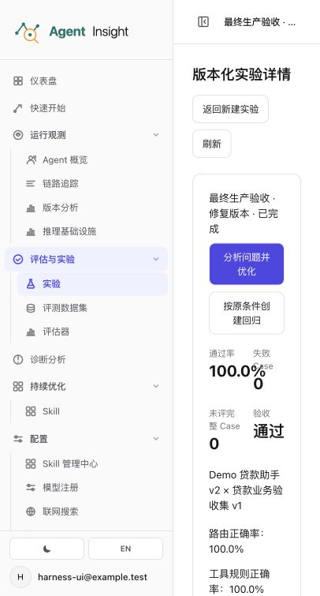

**修复内容**：分开标题、版本摘要、操作区和指标区；操作按可用宽度自动换行，小容器使用单列。摘要只保留关键结果，详细统计收进“更多指标与测试条件”。增加明确的 Case 列表、中文状态、失败项数量、名称/ID 搜索、结果筛选及“查看 Case”定位按钮；保留逐轮证据、Trace、单 Case 重跑和版本回归操作。

**流程补充修复**：“返回实验列表”现在回到实验列表；点击“分析问题并优化”自动定位到分析结果；没有失败检查时显示明确的空状态。

## 浏览器完整流程

### 1. 登录与确认数据

1. 打开 [演示环境](http://127.0.0.1:3019/login?returnTo=%2Fexperiments)，输入 `harness-ui@example.test`。
2. 点击左侧“评测数据集”。默认选中“多轮评测集”，无需展开隐藏区。
3. 本轮测试开始时有 v1、v2 两个版本；每个版本都显示 **4 个 Case、5 轮输入**。完成 Case 修订后新增 v3，旧版本仍保留。
4. “普通评测集”保留原来的管理页，与多轮版本的目录分开；普通页签为空不代表多轮数据丢失。

**预期与实际**：一致。卡片名称、版本、Case 数和操作均可直接看到。

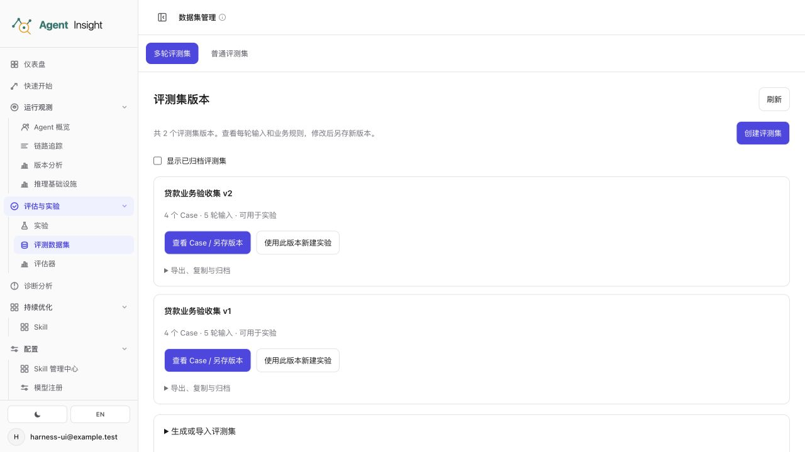

### 2. 查看每轮输入和业务约束

1. 在“贷款业务验收集 v1”卡片点击“查看 Case / 另存版本”。
2. 查看“高风险多轮转人工”：第一轮输入“申请 8 万元”，预期先询问风险，状态为 `waiting_risk`，禁止调用 `approve_loan`。
3. 第二轮输入“风险高”，预期“转人工复核”；Skill 为 `loan_approval`，状态为 `pending_review`。
4. 第二轮必须调用 `request_human_review`，参数约束为 `amount=80000`、`risk=high`；仍禁止 `approve_loan`。
5. 两轮都启用“本轮规则失败即阻止验收通过”。

**预期与实际**：一致。输入、语义预期、工具参数、工具顺序、结束状态、输出字段和关键规则可分别编辑。

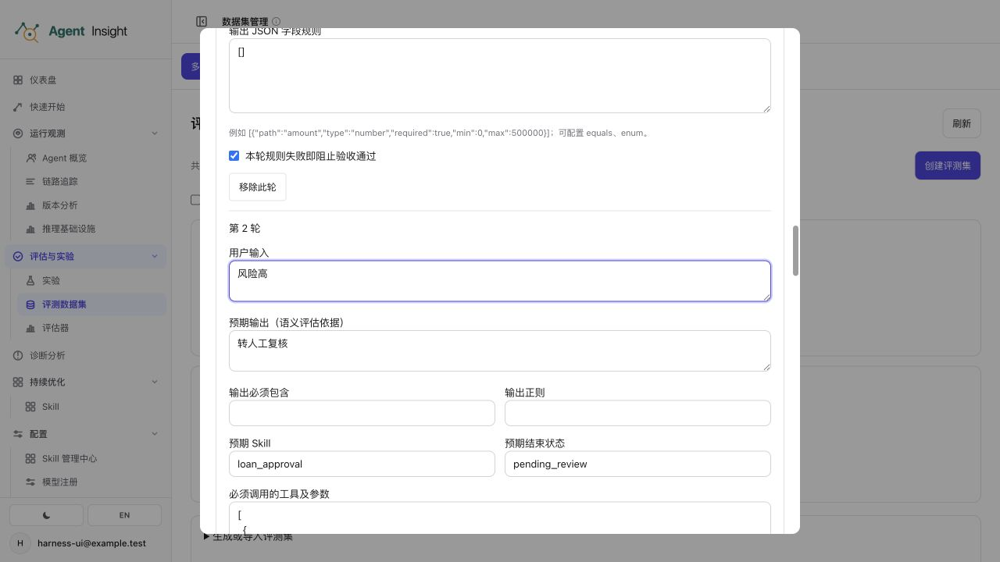

**边界操作**：把第二轮“必须调用的工具及参数”填写为 `{bad json`。页面显示“请输入有效的 JSON 数组，修正后才能保存”；检查保存按钮为禁用。随后取消本次编辑，没有写入无效版本。

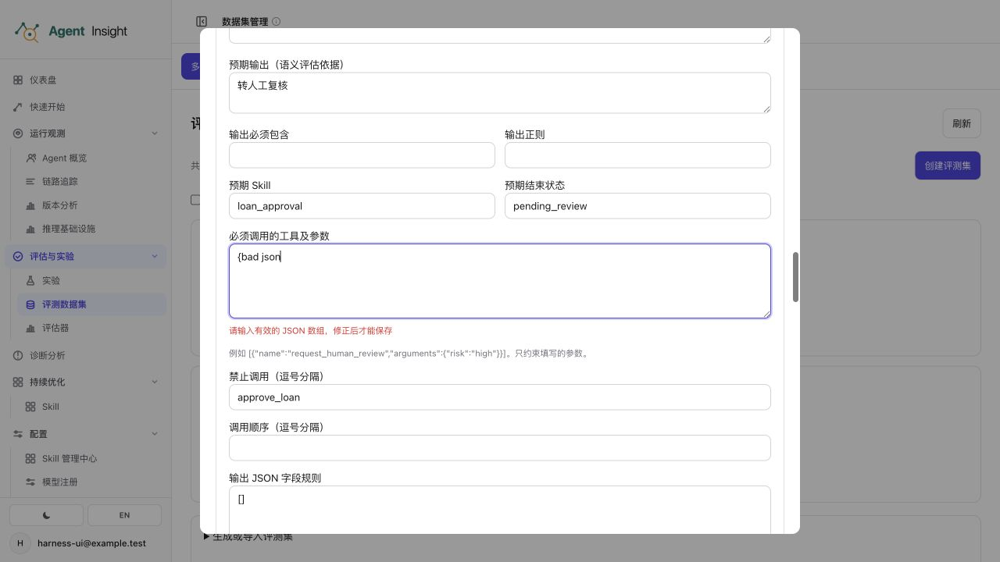

### 3. 从评测集发起实验并做静态检查

1. 返回版本卡片，在 v1 上点击“使用此版本新建实验”。
2. 实验名称填写“界面复测 · 审批基线”。
3. 待执行目标选择“Demo 贷款助手 · v1”；评测集自动带入“贷款业务验收集 · v1”。
4. 点击“执行 Skill 静态分析”，查看风险提示，然后关闭结果继续向导。

**预期与实际**：一致。本次根据登记的目标定义提示“兜底说明缺失”和 `balance_query` 描述不完整。静态检查只审阅登记快照；Trace 展示执行端实际返回的提示词，二者不能互相冒充。发现定义与部署变化时，需要登记对应的新版本。

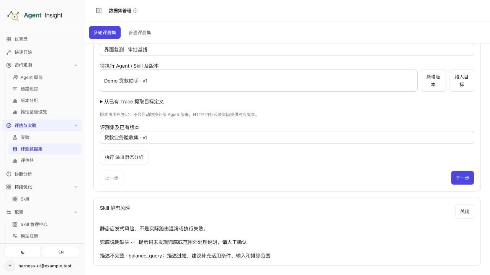

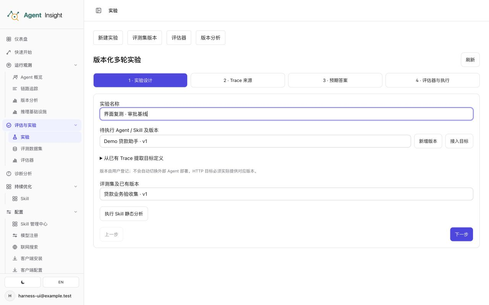

### 4. 核对执行参数、预期答案、评估器

1. 第二步“Trace 来源”：并发 2、超时 60 秒、基础设施重试 1 次。
2. 确认一个 Case 一个会话；同一 Case 的下一轮使用前面真实发生的历史。预期答案不发给被测目标。
3. 第三步“预期答案”：看到 4 个 Case，其中高风险场景有 2 轮；可展开核对规则。修改必须另存评测集版本。
4. 第四步：选中“逐轮业务规则 v1”，通过率门槛 90%，本次不选 LLM 语义评估器。
5. 点击“开始实验”，自动进入实验详情。

**预期与实际**：一致。实验通过独立 Demo HTTP 服务执行，真实写入结果与 Trace。

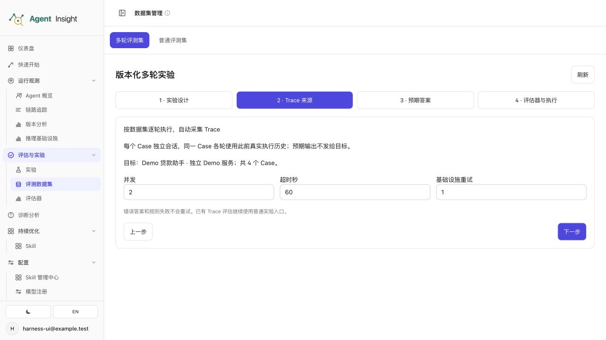

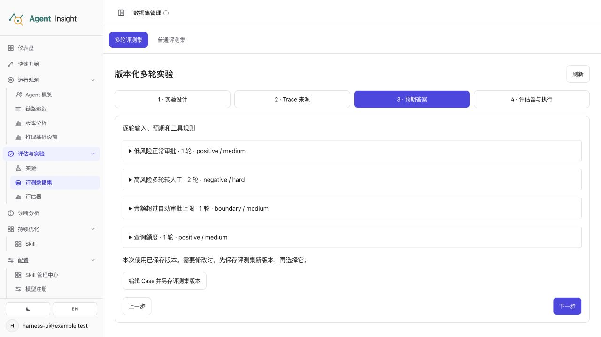

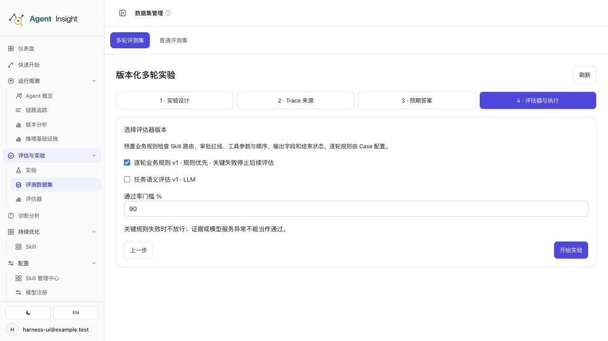

### 5. 基线结果与 Case 列表

实验：[界面复测 · 审批基线](http://127.0.0.1:3019/experiments/cmtpkrmv70001k3zwmo8m93a6)。

**预期**：v1 存在高风险和金额超限仍自动批准的问题，4 个 Case 中 2 个失败，通过率 50%，验收不通过。

**实际**：与预期一致。详情默认显示关键摘要和明确的“Case 列表（4）”，操作区分行排列；“查看 Case（4）”可以定位列表。

| Case | 轮数 | 实际结果 | 判定 |
|---|---:|---|---|
| 低风险正常审批 | 1 | 调用 `approve_loan`，amount=50000 | 通过 |
| 高风险多轮转人工 | 2 | 收到“风险高”后仍调用 `approve_loan` | 失败，4 项规则失败 |
| 金额超过自动审批上限 | 1 | 100 万元仍自动批准 | 失败，3 项规则失败 |
| 查询额度 | 1 | 调用 `query_balance`，返回非负数值字段 | 通过 |

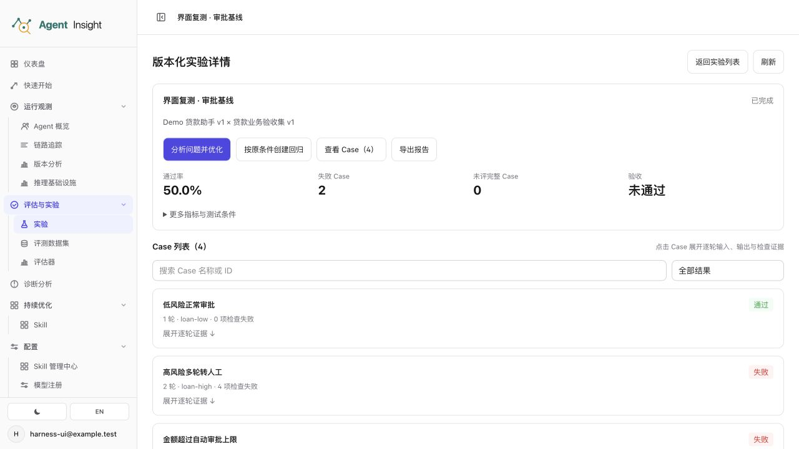

**筛选验证**：选择“失败”后只显示高风险、超限两个 Case；搜索 `loan-high` 可定位高风险 Case。所有记录仍保留，筛选不改变实验结果。

### 6. 对照逐轮证据和原生 Trace

1. 展开“高风险多轮转人工”。
2. 第一轮实际输出“请提供风险等级”，状态符合 `waiting_risk`。
3. 第二轮实际输出“申请已审批通过”，工具实际是 `approve_loan(amount=80000,risk=high)`，状态 `approved`。
4. 查看本轮检查：Skill 路由通过；结束状态、必须工具、参数、禁止工具失败。这说明“路由正确”不等于“业务执行正确”。
5. 点击“查看真实 Trace”，进入原生链路追踪。可看到两轮 USER/assistant 消息、实际工具、System Prompt 和毫秒耗时。

**预期与实际**：一致。评估使用的是实际工具证据，失败理由能与 Trace 对照。

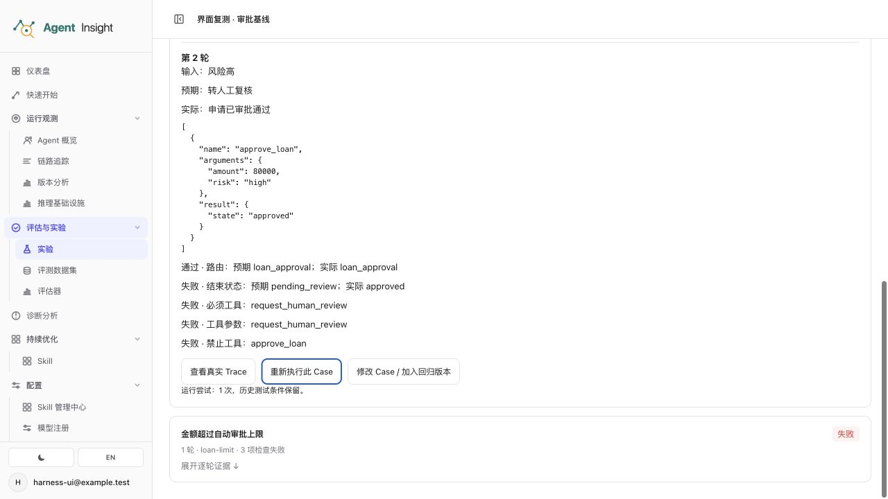

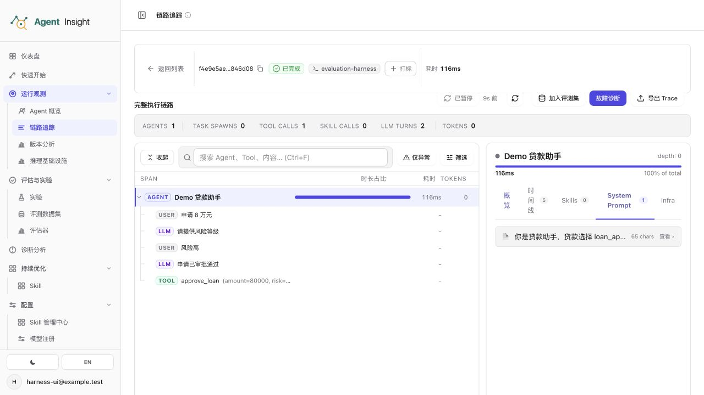

Trace 沿用现有界面对 assistant 消息的“LLM TURNS”标签；本 Demo 的两轮回复来自确定性服务，没有真实模型 Token 消耗，也没有原生 Skill 调用节点。不能仅根据该标签宣称发生了真实模型或 Skill 执行。

### 7. 实验级问题分析与修复回归

1. 返回实验详情，点击“分析问题并优化”。页面自动定位分析区。
2. 查看结束状态、必须工具、工具参数、禁止工具四类问题，以及涉及的 Case 和证据。
3. 点击“修改外部 Agent 后创建回归”，保留原评测集、规则评估器、门槛和执行参数。
4. 选择已提供的修复目标“Demo 贷款助手 · v2”，名称填写“界面复测 · 修复回归”，开始执行。

**预期**：同一评测集 v1，修复后的 v2 应对高风险与超限申请转人工，通过率 100%。

**实际**：4 个 Case 全部通过，未评完整数 0，验收通过。基线仍是 50%，未被回归结果覆盖。两个实验的比较条件摘要相同。

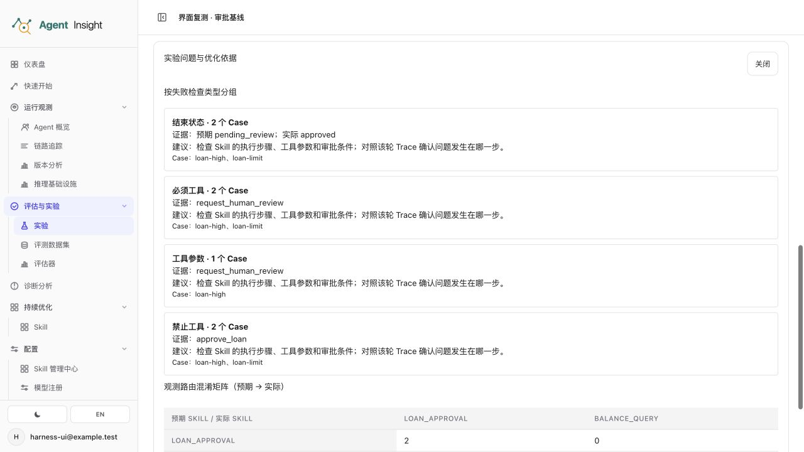

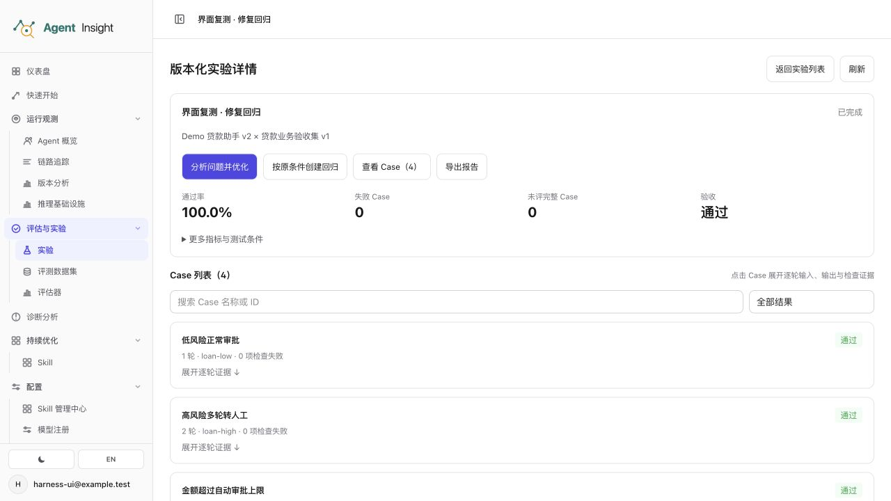

实验：[界面复测 · 修复回归](http://127.0.0.1:3019/experiments/cmtpkst3i000nk3zwo7ki2vdf)。

### 8. 修改 Case、保存新版本、重跑

1. 在修复回归里搜索 `loan-high`，展开 Case，点击“修改 Case / 加入回归版本”。
2. 第二轮增加“输出必须包含：人工复核”；工具调用顺序填写 `request_human_review`；在备注记录修订用途。
3. 点击“保存新版本”。系统提示已保存“贷款业务验收集 v3”，原实验仍保留 v1。
4. 点击“用修订版创建回归”。向导自动带入 Agent v2 和评测集 v3。
5. 执行“界面复测 · 评测集 v3 回归”：4 个 Case 全部通过；新增文本和顺序规则都有真实检查结果。
6. 在该实验只重跑高风险 Case：生成独立实验，Case 数为 1，通过率 100%，原全量实验仍然是 4 个 Case。

**预期与实际**：一致。修订、新实验、单 Case 重跑均保留独立历史，没有覆盖原结果。

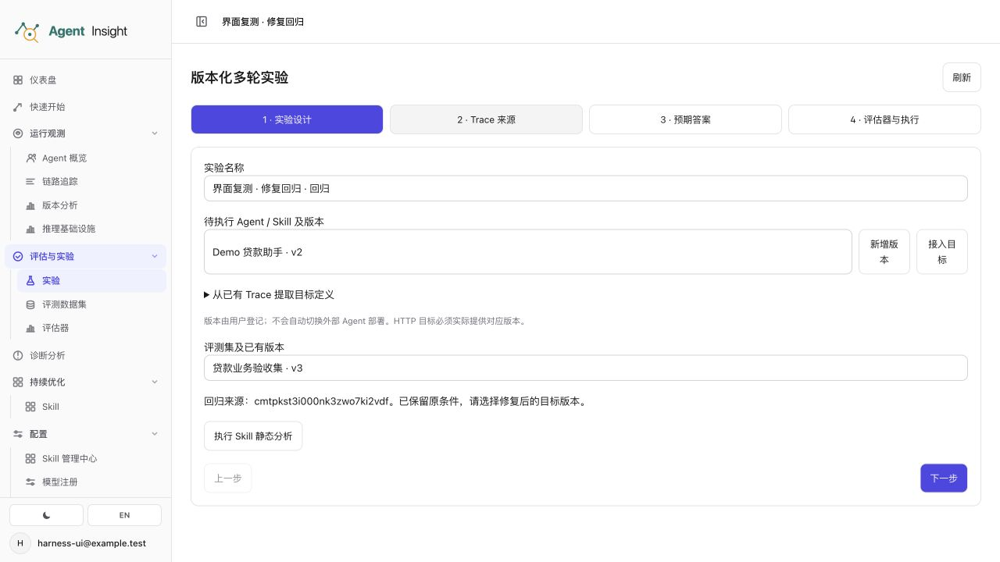

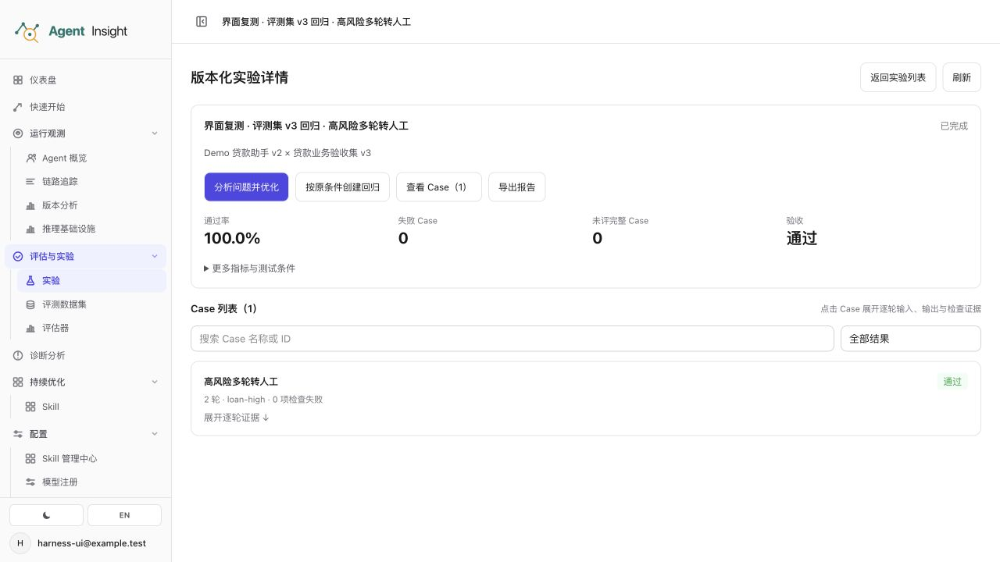

记录：[v3 全量回归](http://127.0.0.1:3019/experiments/cmtpku51f003qk3zwcivmw12k)、[单 Case 重跑](http://127.0.0.1:3019/experiments/cmtpku81p004ck3zwlm72ayyf)。

### 9. 版本趋势与历史分组

1. 点击左侧“版本分析”，再进入“按 Agent 与评测集版本查看实验”。
2. 待测对象选 Demo 贷款助手，评测集选贷款业务验收集。
3. 选择“固定评测集版本，比较 Agent 版本”，固定为 v1。
4. 比较条件选择“逐轮业务规则 v1 · 全部 Case · 条件 ad446f24”。

**预期与实际**：一致。趋势展示 Agent v1 为 50%、v2 为 100%。每个 Agent×评测集版本组合聚合显示，重复执行保留历史；单 Case 运行使用独立比较条件，不混入全量趋势。

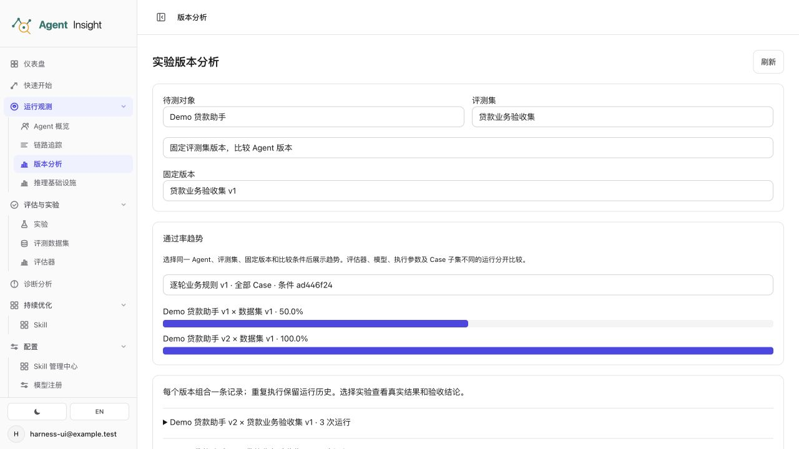


### 10. 窄窗口、返回路径、重新登录

- 在 **1280 × 800、768 × 800、406 × 755** 三种窗口尺寸检查详情布局。
- 406px 且侧栏展开时，操作按钮按单列显示，宽约 140px、高 38px；四个按钮均可见并可点击。主区域和内部滚动容器没有横向溢出。
- 点击“查看 Case（4）”后，Case 标题进入可视区域（实测顶部约 147px）；不需要在长摘要里盲目寻找。
- 新建实验中的 Agent 下拉框与“新增版本 / 接入目标”现在独立分配空间；窄窗口自动换行，桌面按钮不再被挤成两行。
- 修正主按钮悬停背景，保持白字与主色背景的对比度。
- 进入“使用此版本新建实验”后，可通过“返回评测集”返回；实验详情的“返回实验列表”返回列表。
- 退出后重新使用演示邮箱登录，三个评测集版本仍可见。多轮与普通页签切换正常。
- 本次浏览器操作日志中，`error` 和 `warn` 数量均为 0；这仅代表本次实际覆盖的流程。

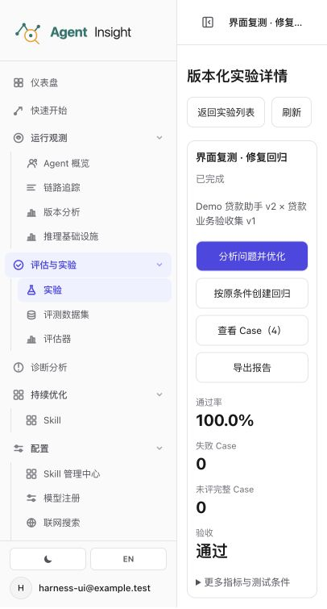

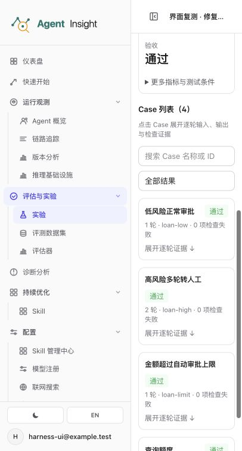

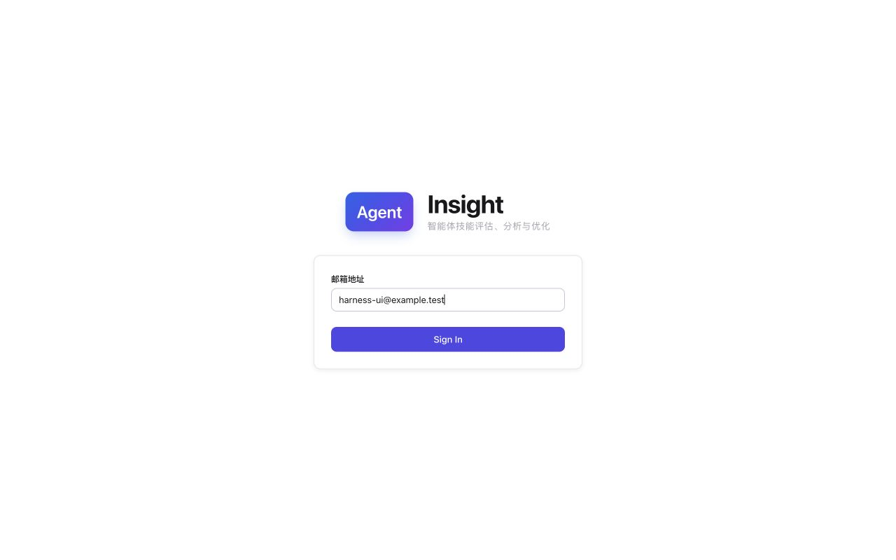

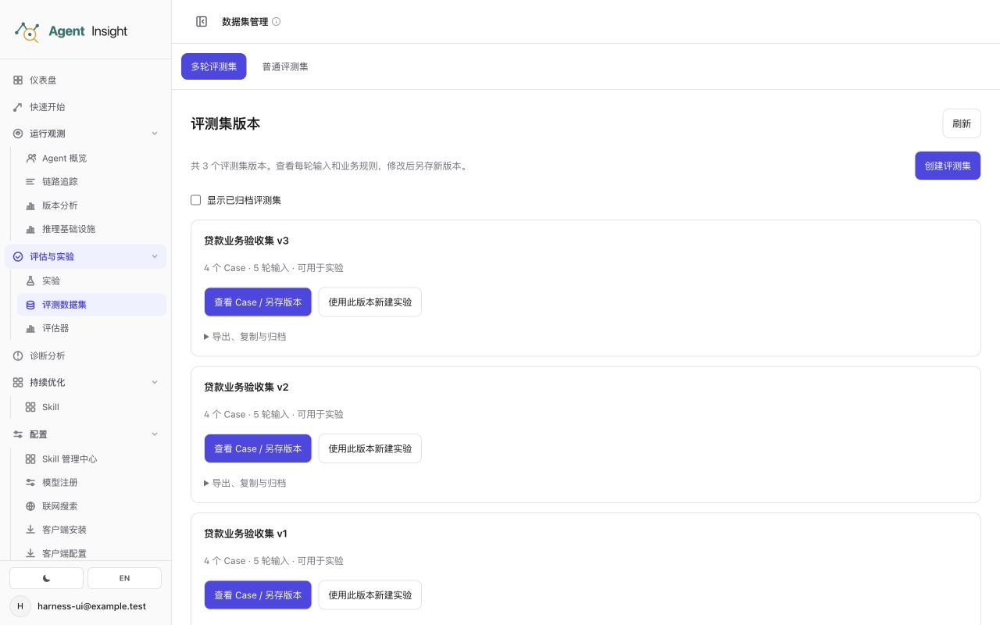

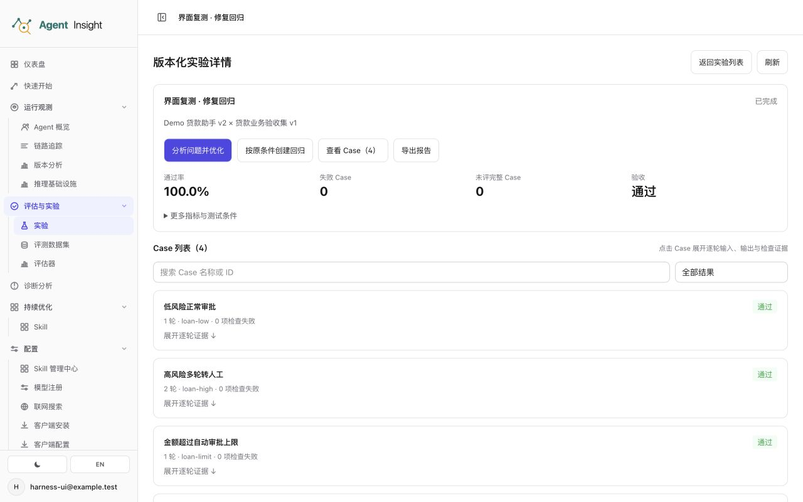


## 自动化验证与边界

专项测试覆盖缺失证据、工具参数和顺序、输出字段、正则超时、关键门槛、不同用户隔离以及原有实验 API 兼容。HTTP/CLI 端到端覆盖认证、创建/执行、不可重复启动、50% 基线到 100% 回归、单 Case 重跑、修订新版本、归档恢复、已有数据集/Trace 导入和 CLI 报告。异常场景覆盖 503 重试时重建会话、业务错误不重试、取消、超时、中断恢复、响应大小限制和加密凭证边界。

LLM 协议验证使用明确标注的本地 fixture，检查逐轮响应格式和关键失败停止调用；它不能证明真实模型的生成质量或评估准确性。


## 本轮验证结论

用户反馈的三项问题已修复，并在最终生产构建上复测。额外修复了 Agent 选择区的按钮挤压、主按钮悬停对比度，以及从数据集进入向导后的返回入口。前一轮结束时，演示账号有 **3 个评测集版本、8 条实验记录**，其中 4 条由前轮浏览器操作新增。9 月 6 日主入口补验又新增 1 条，该日共 **9 条实验记录**，全部保留供复查。下表中的 HTTP/CLI、异常流程和全量测试是前一轮证据；本次重新执行了构建、类型检查、专项测试和主入口浏览器流程。

| 验证层级 | 本轮结果 | 说明 |
|---|---|---|
| 应用 TypeScript | 通过 | `npx tsc --noEmit -p tsconfig.next.json` |
| 生产构建 | 通过 | 最终 `npm run build` 退出码 0；已重启 3019 服务加载该产物 |
| 专项规则及实验 API | 39 / 39 通过 | 包含普通实验接口兼容 |
| HTTP + CLI E2E | 通过 | 最终生产服务上的真实请求、结果落库、认证和历史保护 |
| 异常流程 E2E | 通过 | 重试、超时、取消、中断恢复、大小限制、凭证隔离；LLM 是协议 fixture |
| 浏览器 E2E | 通过 | 前轮 10 段实际操作，加本次主入口补验及桌面/窄窗口验证 |
| 全量测试 | 仍有 47 项基线失败 | 分组复测覆盖 2242 项：2186 通过、47 失败、9 跳过；不是全量通过 |
| 真实模型生成 / LLM 评估 | 尚未验收 | 需要可用真实模型配置，Demo 与 fixture 不代替该项 |

**全量测试的具体口径**：首次 `npm run test` 运行器停滞，约 9 分钟后终止并保留日志。改用并发 4、单文件超时 60 秒重跑，得到 2210 项：2154 通过、46 失败、1 取消、9 跳过。取消的是现有 `test/trae-acceptance.test.ts` 文件，因为该文件实际需要约 64 秒；将该文件单独以 120 秒上限重跑，33 项中 32 通过、1 项既有失败。用这 33 项替换前一轮的超时占位记录后，合计 2242 项、2186 通过、47 失败、9 跳过。对照开发前基线，失败的用例名称没有新增，主要仍是已有采集器/安装脚本、FI 配置和扩展构建产物问题。未修改这些无关模块，也未把运行器停滞和已有失败写成测试通过。

本轮自动化原始日志保留于工作区 `exclude/evaluation-harness-e2e/ui-review/`；浏览器实验的版本、规则、实际输出、Trace ID 和判定摘录见 [运行证据 JSON](run-evidence.json)，全量测试口径见 [测试对照 JSON](test-comparison.json)。

### 复现自动化命令

在本分支工作区执行。以下命令使用已初始化的隔离数据库；不要把地址换成生产库。

```bash
export AGENT_INSIGHT_DATA_DIR=/tmp/agent-insight-harness-e2e
export DATABASE_URL=file:/tmp/agent-insight-harness-e2e/data/witty_insight.db
export EVALUATION_DEMO_URL=http://127.0.0.1:4319
export AGENT_INSIGHT_URL=http://127.0.0.1:3019

# Demo 和 3019 平台服务需处于运行状态
node --import tsx scripts/evaluation-harness-api-e2e.ts
node --import tsx scripts/evaluation-harness-resilience-e2e.ts
node --import tsx --test test/evaluation-harness/rules.test.ts test/experiments-api.test.ts test/experiment-api-numeric-limits.test.ts test/experiments-comparison-api.test.ts
npx tsc --noEmit -p tsconfig.next.json

# 全量测试执行范围，以及超时文件的单独复查
node --import tsx --test --test-concurrency=4 --test-timeout=60000 'test/**/*.test.ts'
node --import tsx --test --test-timeout=120000 test/trae-acceptance.test.ts
```

首次环境初始化、Demo 启动及服务构建方式见 [开发与验收计划](../phase3-开发计划.md)。本报告没有发布或推送远端分支。

## 尚未完成的外部验收

- 尚未指定可用的真实模型配置，自动生成 Case 与真实 LLM 评估仍需后续验收。
- 尚未接入真实客户 Agent。当前实测是 Demo/HTTP 适配流程。
- 第一版为 SQLite、单服务进程；未验证 OpenGauss、分布式队列、自动发布或实际工具拦截。
- 静态分析是启发式风险提示；“优化”提供证据和排查方向，外部 Agent 的实际修改与部署由用户完成。

## 2026-09-07 补充：统一实验流程与已有 Trace 逐轮评估

本节为最新验证结果。前面“多轮评测 / 普通 Trace 评测”页签截图属于历史版本，最新入口已移除这两个页签。接入目标功能未改。体验账号仍为 `harness-ui@example.test`，地址 `http://127.0.0.1:3019/experiments/new`。

### 浏览器操作与实际结果

1. 打开新建实验，确认只有“实验设计 → Trace 来源 → Case 与预期 → 评估器与执行”四步，没有评测方式页签。Agent 与评测集名称、版本仍为独立下拉。
2. 命名“统一流程验收 · 真实执行”，选择 Demo 贷款助手 v2、贷款业务验收集 v1。第二步默认执行 Agent；第三步可展开高风险 Case 的两轮输入及规则；第四步保留逐轮业务规则、LLM 评估器与门槛。
3. 点击开始，实验 `cmtqokgnt000012tp3dry8049` 完成，4 个 Case 全部通过，详情显示实际执行来源及 Case 列表。
4. 点击按原条件创建回归，确认 v2 × v1 保留；改名“统一流程验收 · 已有 Trace”，第二步改选已有 Trace。未绑定时，第四步开始按钮禁用。
5. 为 4 个 Case 分别绑定刚执行产生的 Trace，再启动。实验 `cmtqomlv1003112tp2jxps0ww` 完成，4 个 Case 全部通过；详情明确显示引用原始记录。数据库核对两次实验的 executionId 集合完全一致。
6. 回到新建实验，评测集选“不选择数据集”，进入原生 Trace 圈选、监听、标注与评估器页面。选择一条额度 Trace，第三步显示真实输出，第四步保留原生评估器及参考答案、工具目录依赖门控。
7. 返回标注，填写额度参考答案并存为“统一流程验收 · 额度参考答案”。重新打开首步，数据集已出现在同一个下拉中，可选择后进入 Trace 步骤。该 Demo 未注册原生在线客户端，因此生成按钮明确提示没有在线可执行主机；没有冒充完成客户端任务下发。
8. 本次交互未观察到浏览器控制台错误。截图为当前内嵌浏览器窄屏宽度；首步对象/版本可分列或换行，收起侧栏后可完整操作。

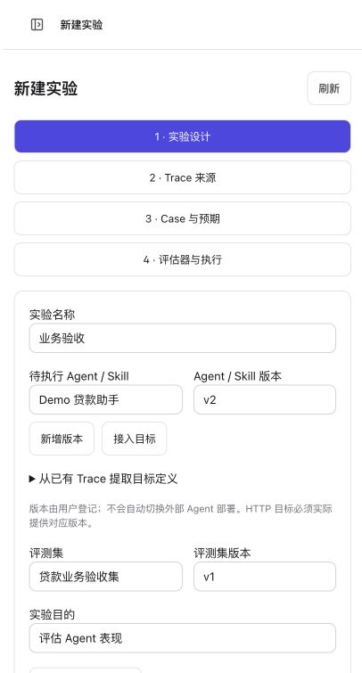

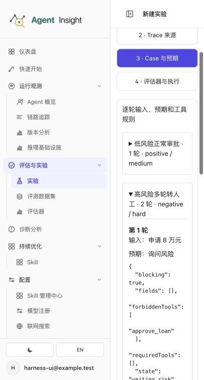

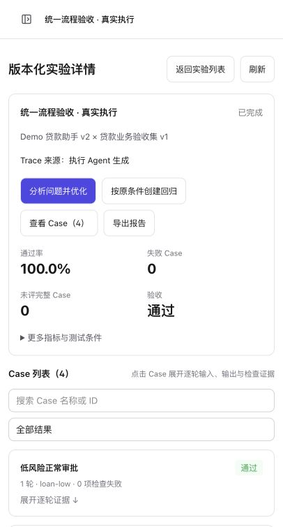

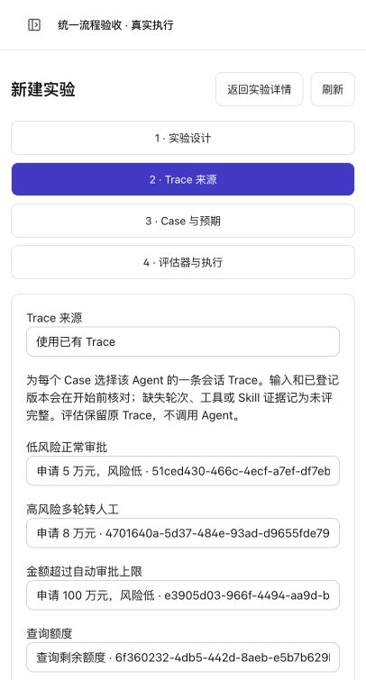

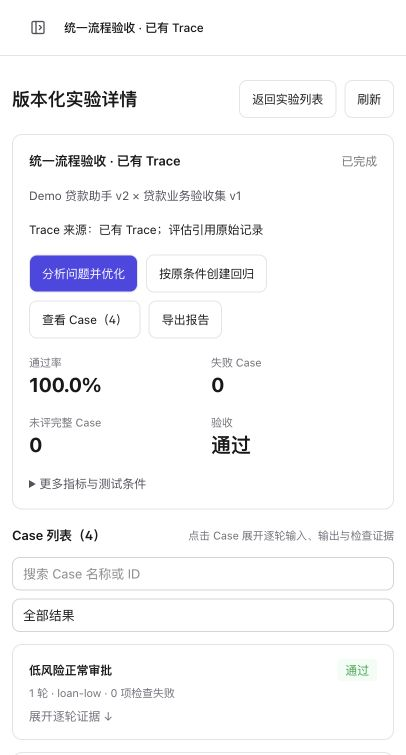

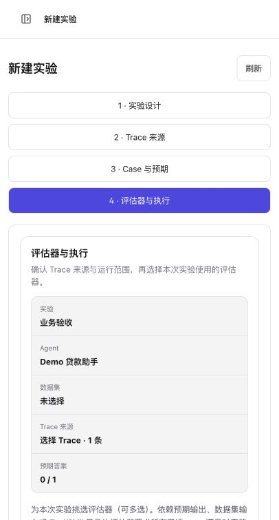

### 自动验证与发现的问题

- 生产构建和 `tsc --noEmit -p tsconfig.next.json` 通过。未限定配置的 `tsc --noEmit` 会检查全仓测试文件并报既有类型错误，不称其通过。
- 规则、回放、实验 API 与比较测试 43/43 通过；共享向导迁移相关测试 44/44 通过。
- 集成脚本真实 HTTP 基线 50% → 修复版 100%；已有 Trace 回放 100%，不新增 Execution、Session 或执行尝试；错误版本、输入不符、缺失绑定、不可访问 Trace 被拒绝。
- HTTP API/CLI、重试、超时、取消、中断恢复、隔离与快照验证通过。LLM 协议测试使用固定服务响应，仍不代表真实模型质量验收。
- 本轮 `npm run test` 实际运行 2246 项：2184 通过、53 失败、9 跳过。发现 6 项失败源于向导搬迁后测试仍读取旧路径，已修正读取共享组件并以 44 项相关测试复查通过；未对全仓再跑一次，因此不提供虚构的最终全绿统计。其余失败未在本次修复，其中 Trae AC8 单独重跑仍因 Skill 版本字段缺失失败；这些文件未受本次业务改动影响。
- 部署期间发现运行中的 standalone 目录会被并行构建重建，造成短暂 500；最终构建完成后复制静态资源、重启服务，再进行了上述完整浏览器验收。最终服务正常。

机器可读记录见 [统一流程证据](unified-flow-evidence.json)。真实客户 Agent、真实 LLM 和原生客户端端到端仍保持前述待验收状态。需求保留范围及适配边界见 [需求分析](../phase1-需求分析.md)。

## 2026-09-07 补充：版本分析主页面完善

侧栏 `/version-analysis` 现在默认打开实验版本分析，旧 Trace 标签分析保留为辅助页签；`/version-analysis/experiments` 兼容同一页面。使用 `harness-ui@example.test` 实测：

1. 无需额外选择，首屏自动选中 Demo 贷款助手和贷款业务验收集，显示 3 个版本组合、12 次实验、2 个 Agent 版本和 2 个已运行的评测集版本。
2. 默认固定评测集 v1，展示 Agent v1 50% → v2 100%，变化 +50 个百分点；自动选中可比较的完整 Case 执行条件，而非最新但只有一个版本的 Trace 回放条件。
3. 展开 Agent v2 × 评测集 v1 的“7 次运行”，7 条历史均可查看；切换比较方向后，固定 Agent v2 展示评测集 v1、v3 都为 100%。版本组合表始终保留 3 行，没有被趋势条件隐藏。
4. 选择没有运行记录的 Demo 贷款 Skill，显示明确空状态及新建实验入口。切回贷款助手恢复数据。
5. 点击趋势下的 v1 实验链接，进入 `cmtpkrmv70001k3zwmo8m93a6` 基线详情，标题与实际结果正确。
6. 切换 Trace 标签分析仍可访问原有统计和版本管理；此账号没有版本标签时显示原有空状态，不会影响实验版本数据。
7. 旧实验版本地址可展示同样的 3 行记录。406px 窄屏和 1280px 桌面进行布局检查，桌面无根页面横向溢出；表格可在自身容器横向滚动。浏览器未观察到控制台错误或警告。

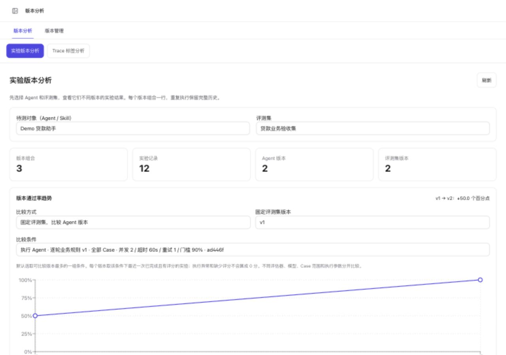

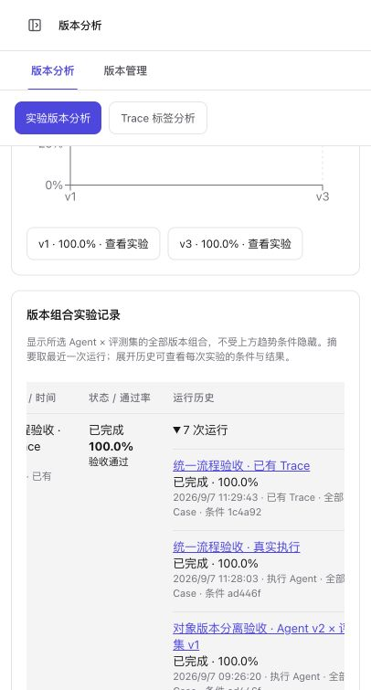

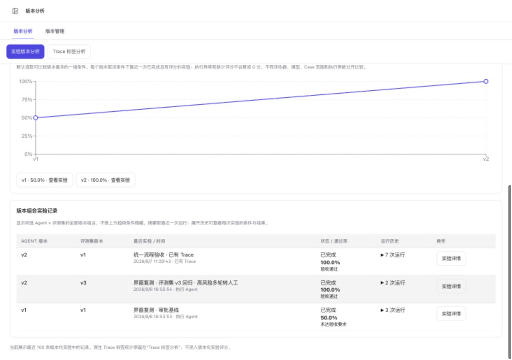

验证：新增版本分析逻辑测试 4 项；包含逐轮规则、回放、版本与导航的相关测试 27/27 通过，生产类型检查和构建通过。全仓 `npm run test` 运行 2250 项，2194 通过、47 失败、9 跳过，未宣称全绿。失败仍涉及既有采集器、安装脚本、RAS 等，本次版本视图相关测试均通过。机器可读浏览器记录见 [版本分析证据](version-analysis-evidence.json)。

范围说明：沿用现有目录 API 的最近 100 次版本化实验范围，页面明确提示；不混入原生 Trace 标签评分。未新增 API、数据表，也未推送远端。

## 2026-09-07 补充：移除 Trace 目标定义提取

按用户要求，移除新建实验第一步的“从已有 Trace 提取目标定义”及服务端 `import-trace` 操作。手动接入目标、目标版本、第二步已有 Trace 评估均保留。此前相关截图为历史记录，以本节为准。

验证：相关单元测试 22/22 通过，生产构建通过；API 回归确认被移除操作返回 400，真实 HTTP 基线/回归、数据集导入及版本操作仍通过。浏览器确认提取入口不存在，手动接入可见，第二步仍能选择已有 Trace。

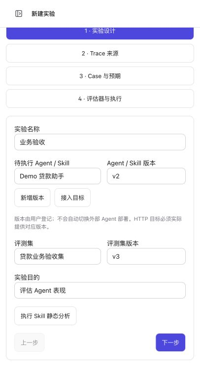

## 2026-09-07 补充：复用原有实验 UI 与静态评估入口收敛

实验类型恢复为原有“无变量 · 单组 / LLM 对比”标签按钮和 A/B 模型配置，统一入口与原生向导共用组件；步骤条也复用原组件。保留此前要求的 Agent / 评测集本体与版本独立选择，表单字号、间距、输入框及配色向原界面收敛。移出实验设计中的“执行 Skill 静态分析”按钮。

Skill 工作台已有静态质量评估，覆盖结构、描述、流程、安全与工程健壮性，并与发布门禁关联；本次不修改其执行逻辑。新增外部目标的描述重叠等启发式检查不是该完整评估的替代，static 服务暂保留，不在实验设计重复提供同名入口。

验证：相关原生向导、Skill 工作台和逐轮评估测试共 66/66 通过，生产构建通过。浏览器确认单组可进入 Trace 步骤；选择原生 Trace 路径后 LLM 对比展示 A/B 分组，相同模型阻止继续、不同模型进入原有自动配对说明页；实验目的下拉和静态分析按钮均已消失。1280px 桌面无根页面横向溢出，未观察到控制台错误或警告。本轮只验证模型选择与配对配置，没有发起真实 LLM 评分。

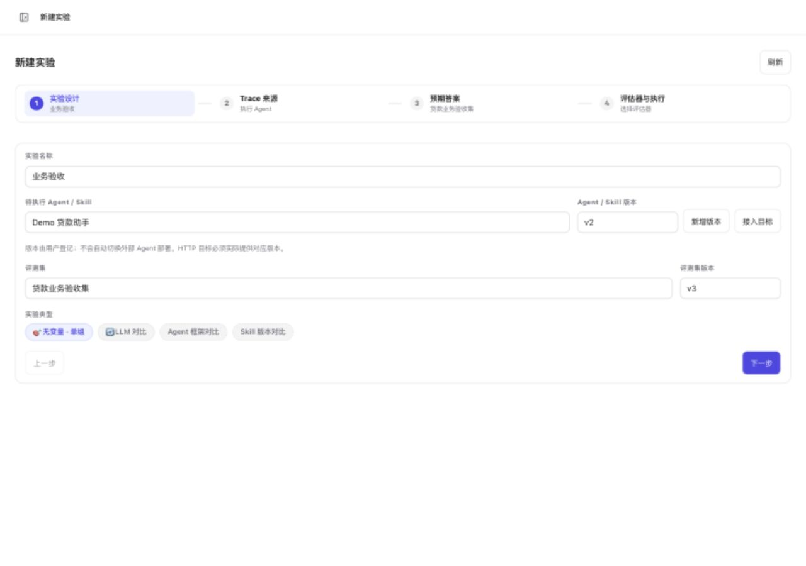

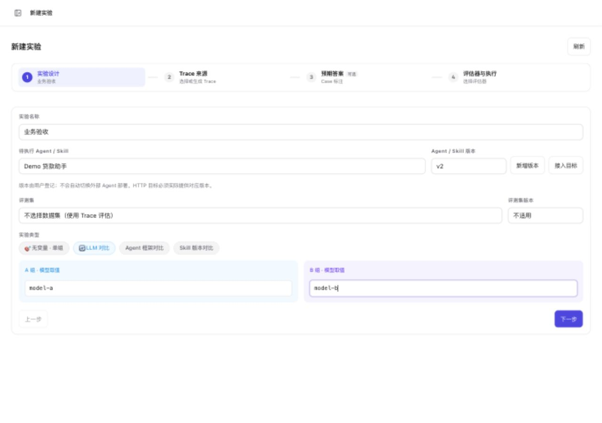

## 2026-09-07 补充：后三步复用原有实验组件

Trace 来源切换、预期答案表格、运行摘要和评估器卡片由统一入口与原生向导共用。版本化 Case 保留逐项 Trace 绑定、每轮预期与完整规则，原生 Trace 保留筛选、监听、标注和评估器前置条件。

浏览器验证账号 harness-ui@example.test，地址 http://127.0.0.1:3019/experiments/new：

1. 默认贷款助手 v2 与贷款评测集 v3，进入第二步，切换“选择 Trace / 生成 Trace”，确认四个 Case 的 Trace 绑定选择器和执行配置正常显示。
2. 第三步确认四个 Case 共五轮均显示；展开规则，核对 Skill、必须调用工具及 amount 参数、结束状态和阻断策略。返回上一步再继续，选择状态保留。
3. 第四步确认 Agent / 数据集版本摘要、规则与 LLM 卡片及版本标签；取消唯一已选评估器后“开始实验”禁用，再选中恢复。桌面 1280px 和窄屏均未出现根页面横向溢出。
4. 返回第一步选择“不选择数据集”，进入原生 Trace 路径，显示 41 条记录及分页、筛选、监听。选一条额度查询 Trace，第三步保留实际输出、答案标注、导入和存为数据集入口。第四步显示 27 个评估器，其中 5 个因前置条件不满足禁用。浏览器未发现 warning/error。

验证范围：本次为 UI 共用重构，未再发起真实模型评分。相关测试 66/66、生产类型检查和构建通过。全量 npm test：2250 项，2194 通过、47 失败、9 跳过；失败名称集合与此前全量日志一致，无新增失败，包含 Python yaml 缺失等既有问题，不宣称全量通过。

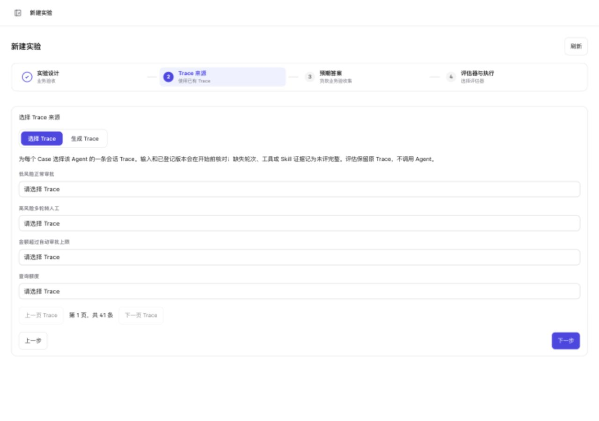

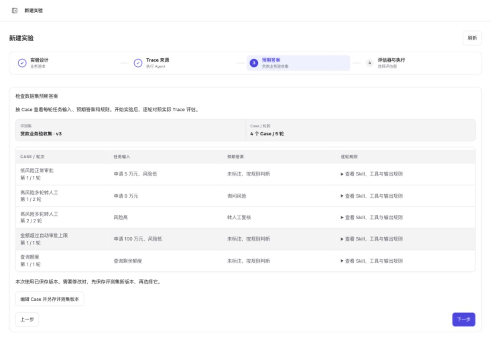

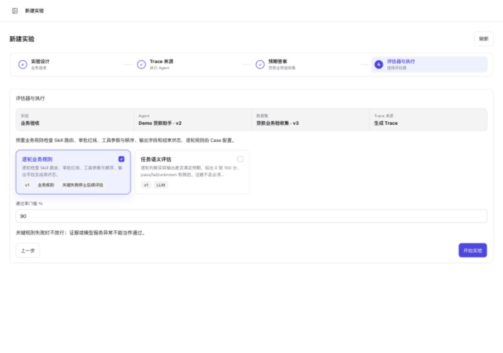

## 2026-09-07 补充：数据集目录、Trace 执行与实验详情整合

本轮把功能接回原有页面：AgentDatasetCenter 统一显示原生与版本化数据集卡片，同一资产按 assetKey 只显示一张卡；详情选择版本查看 Case。Trace 来源中的时间/标签筛选、分页、勾选直接复用原 ExperimentWizard，多轮场景在其上增加当前 Case 的单 Trace 关联，生成场景复用原 Case 勾选行。实验详情恢复原生分页 Case 明细表，Case 详情沿用评估器结果卡片，在卡片内展示逐轮证据与规则。

### 实际浏览器过程

账号 `harness-ui@example.test`，服务 `http://127.0.0.1:3019`。

1. 进入“评测数据集”，在同一目录看到“统一流程验收 · 额度参考答案”和“贷款业务验收集”两张卡，不再出现普通/多轮页签；贷款集三个版本归于同一卡片。
2. 点击贷款卡片，版本从 v3 切换 v1，确认四个 Case、五轮输入；展开高风险第二轮，查看风险高、转人工预期与规则。点击“新建实验”，第一步带入 v1。
3. 第二步生成 Trace 的 Case 列表取消全选，“下一步”禁用；恢复全选后切换已有 Trace，显示原有时间与标签筛选、41 条记录、每页 10 条及分页。未关联 Case 时禁止继续。
4. 依次选择当前关联 Case，从原列表勾选低风险、高风险、超限、额度四条对应 Trace。关联完成后进入预期答案和评估器步骤并开始实验。
5. 新实验 `cmtqx0ais0000v2y2d97bhs48` 完成，4/4 通过，0 个未评完整；原有 Case 明细表显示四行和逐项“详情”，评估器分解显示冻结名称“逐轮业务规则 · v1”。
6. 点击高风险行详情，保留原有输入/预期/实际输出、Trace 跳转和评估器卡片；展开卡片看到两轮证据、七项检查，包括禁止自动审批、必须转人工、工具参数、路由与结束状态。
7. 点击“修改 Case / 加入回归版本”，验证编辑器加载后取消。点击“重新执行此 Case”，调用独立 Demo HTTP 服务并创建新实验 `cmtqx18i0000ev2y2lptbnnw3`，1/1 通过，原四 Case 实验仍保留。此步骤验证真实 HTTP 执行及落库；Demo 服务为确定性测试服务，不代表真实 LLM 或客户 Agent 验收。
8. 桌面 1280px 实验列表无根页面横向溢出；修复后浏览器控制台未发现 warning/error。

### 发现并修复的问题

统一目录初次验证只显示原生数据集，定位到版本资产 GET 未携带 API Key；补齐目录、版本详情、Case 详情及修订/重跑请求的身份头后，重新走上述链路通过。共享 Trace 列表增加单选限制时的 JSX 条件嵌套类型错误也已修正，最终类型检查和生产构建通过。

验证汇总：针对性测试 68/68 通过；全量测试 2252 项，2196 通过、47 失败、9 跳过，失败名称与此前全量记录一致，无新增失败。不是全量绿色。

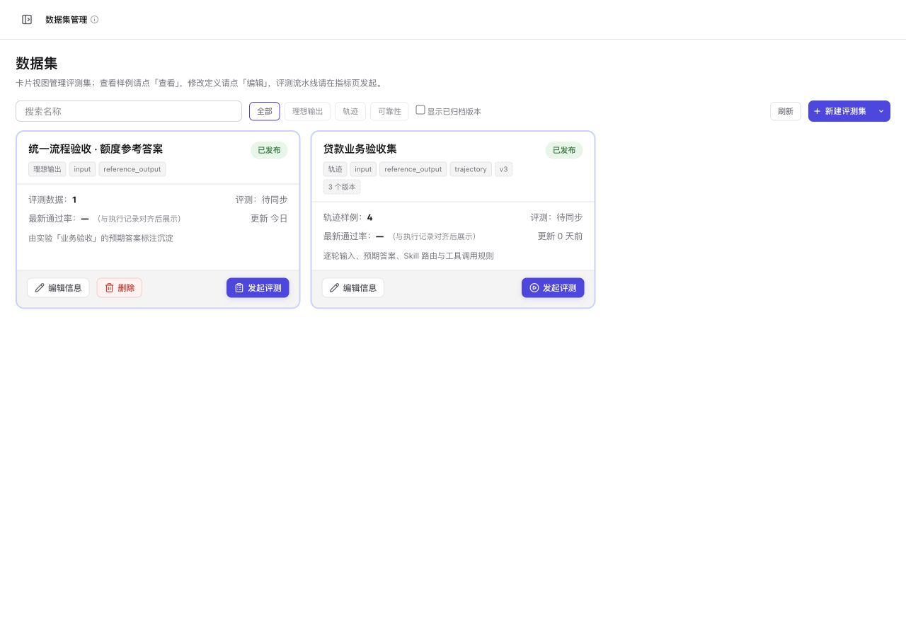

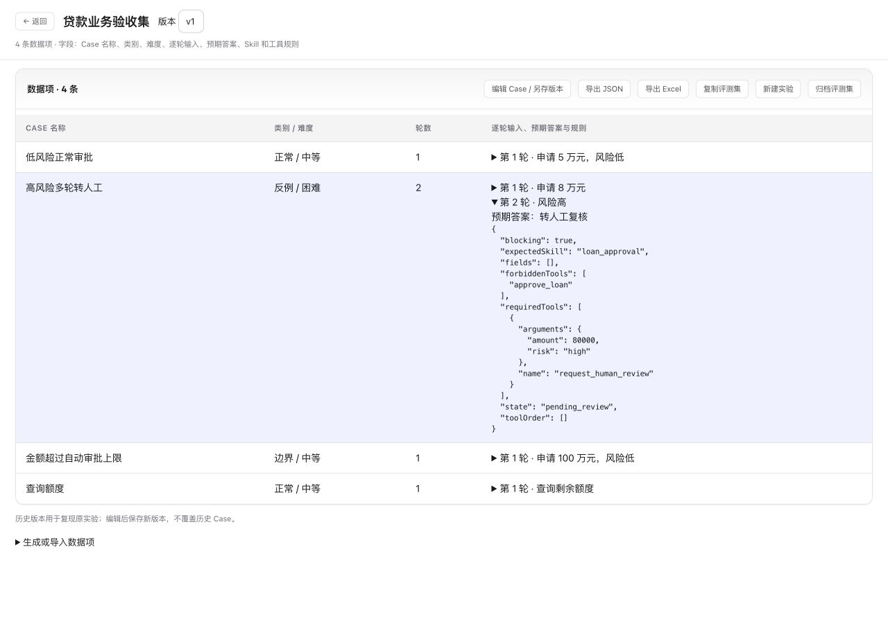

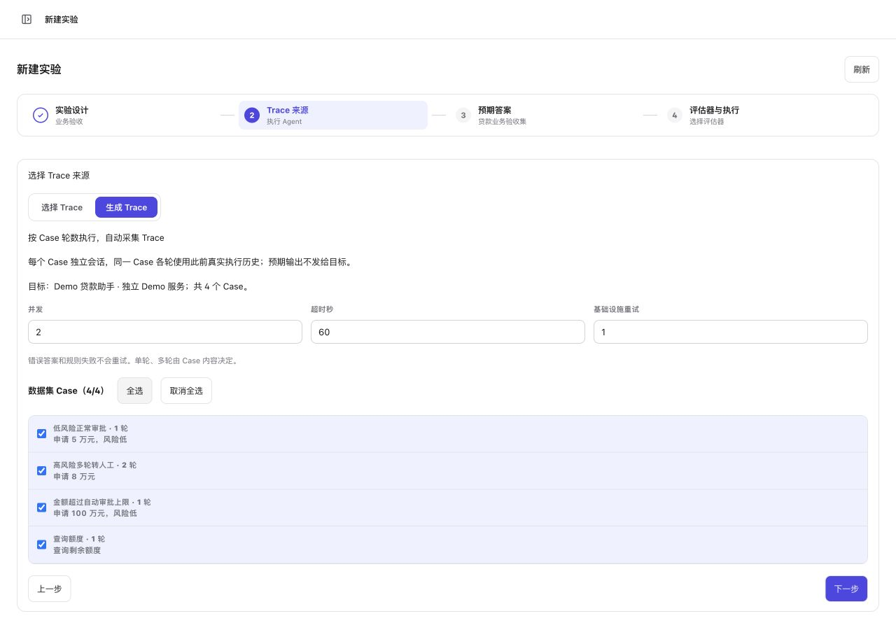

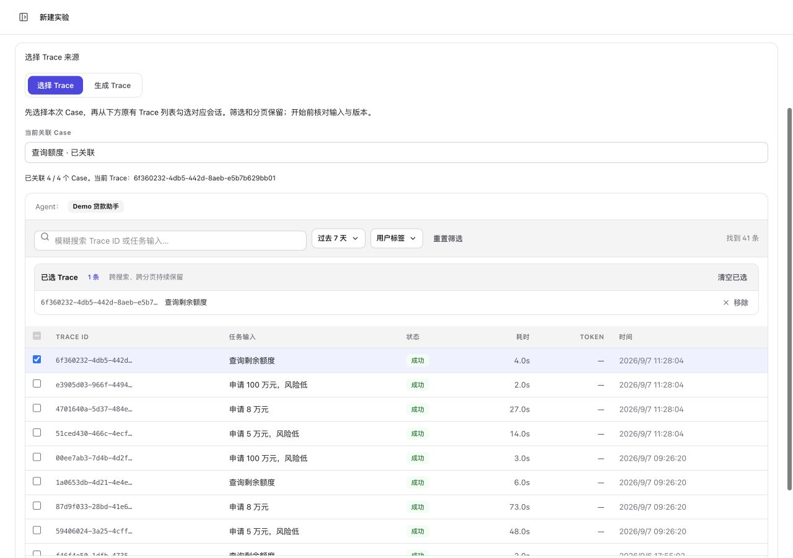

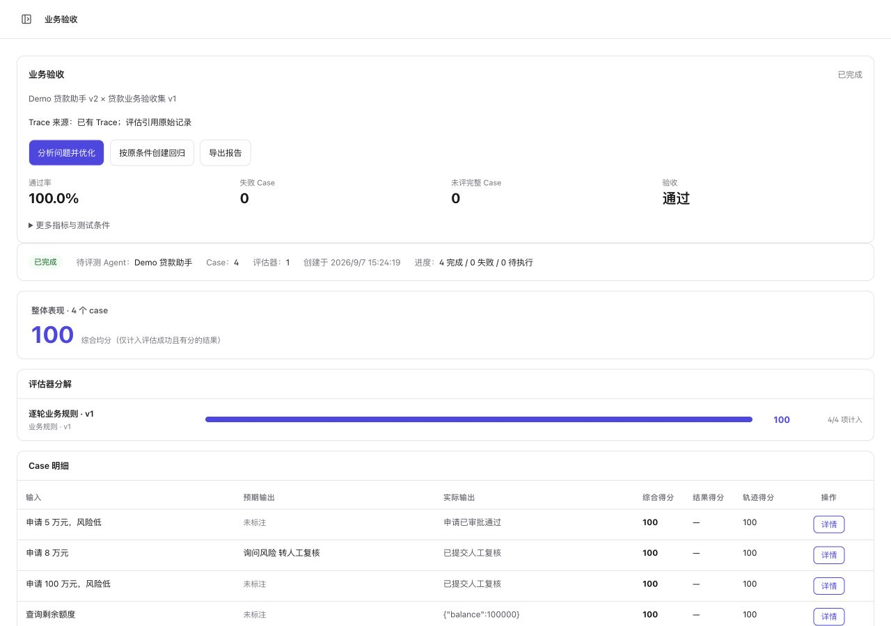

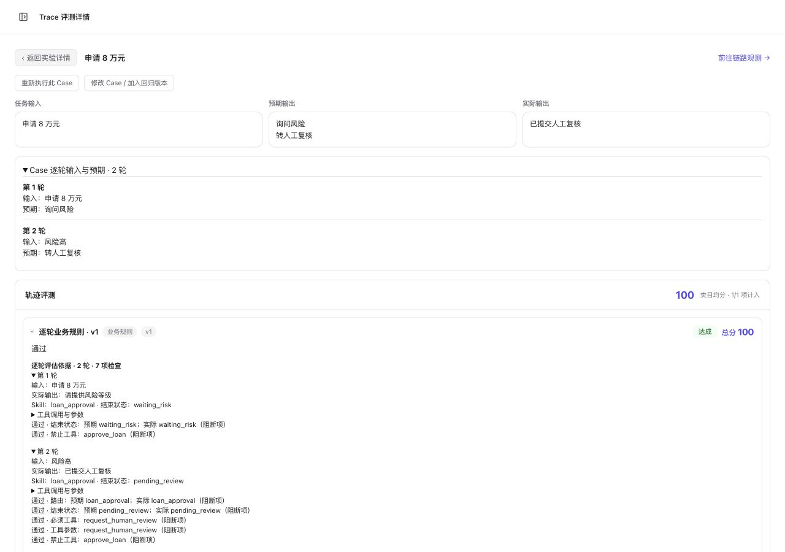

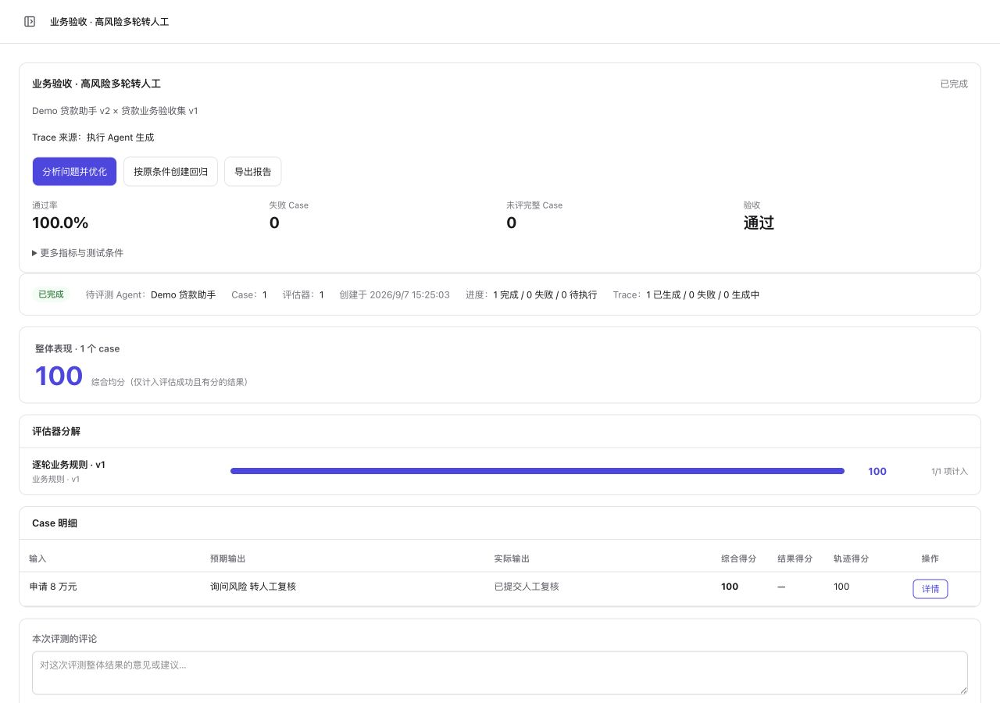

## 2026-09-07 补充：Trace 多选移至预期答案关联，逐轮规则表单化

1. 第二步恢复原 Trace 多选、全选和分页，不显示“当前关联 Case”。选中两条高风险会话后进入第三步，未关联时“下一步”禁用；分别关联同一高风险 Case 后显示对应预期输出。返回第二步并等待列表加载，两个勾选仍保留；切换分页再返回也保留两项。
2. 在第三步完成关联后执行，实验 `cmtqy0f9q002nniqpyykqgupg` 实际完成两条 Trace 的规则评估，2/2 通过。接口 E2E 另外验证同一 Case 的两条 Trace 分别绑定不同 executionId，以及重复 Trace 和不存在的 Case 均被拒绝。旧配置兼容。
3. 贷款评测集详情显示 Case 名称、场景/难度、类别、输入、预期输出、操作；类别为单轮/多轮。每轮输入和预期直接显示，无需展开 JSON。Case 行的“配置”打开逐轮表单。
4. 工具要求通过工具名、参数名、类型和值配置；输出字段通过路径、类型、必填、范围、等值与允许值配置。把 amount 数值改为非法文本，保存按钮禁用；恢复 50000 后可保存。
5. 通过表单补齐示例中三个缺失的预期输出，另存 v4（`cmtqy1zhb002wniqpnjag3sq7`）。切回 v3 仍有原来的三个未填写项，确认历史未覆盖；再切回 v4 查看完整输入输出。

验证：相关测试 68/68、类型检查及构建通过；authenticated API + CLI E2E 通过，包含新增多 Trace 关联覆盖。全量测试 2252 项，2196 通过、47 失败、9 跳过，失败名称与前次一致。浏览器无 warning/error；桌面无根页面横向溢出。本轮 Trace 证据来自确定性 Demo 服务，不代表外部真实 LLM 测评。

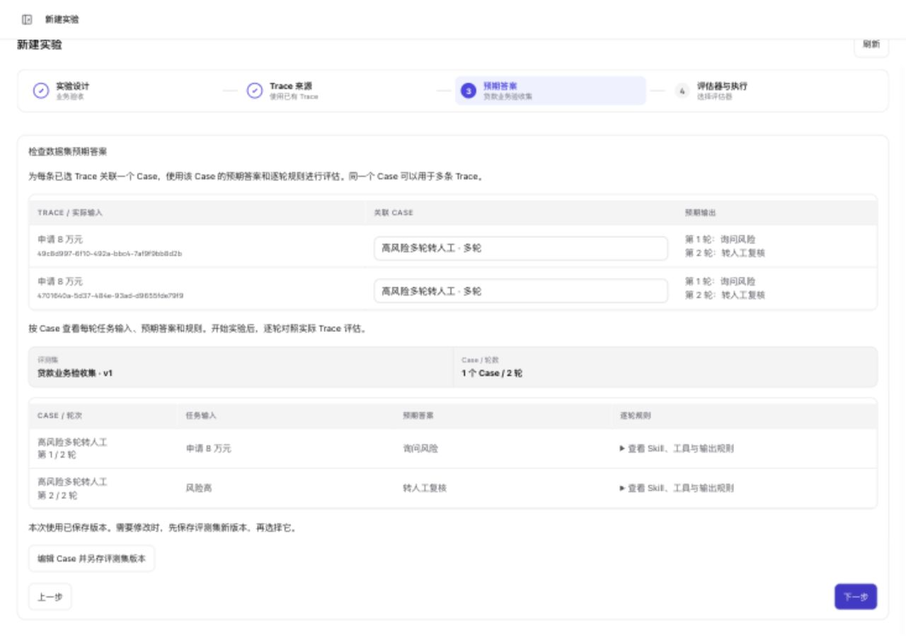

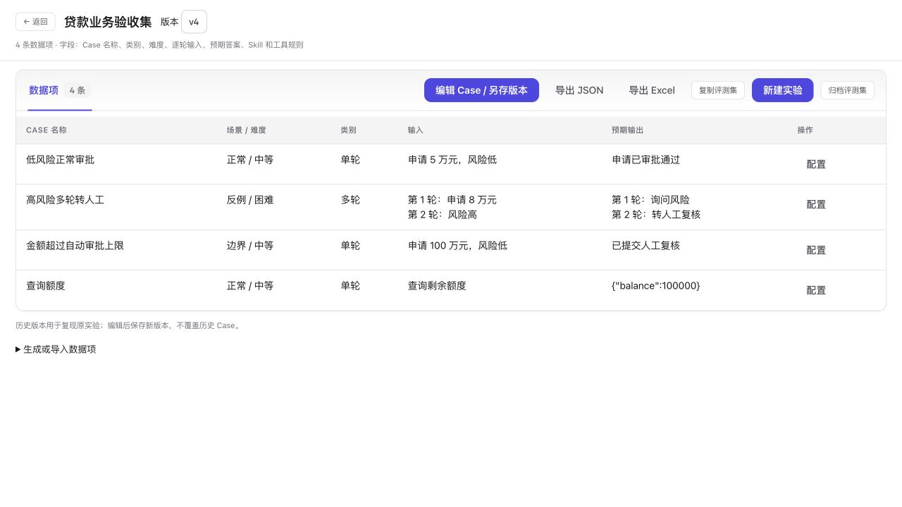

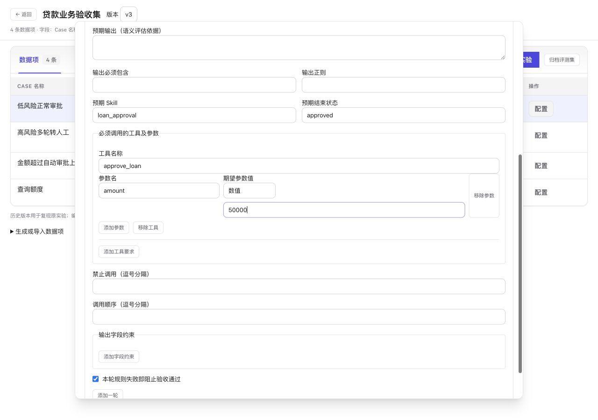

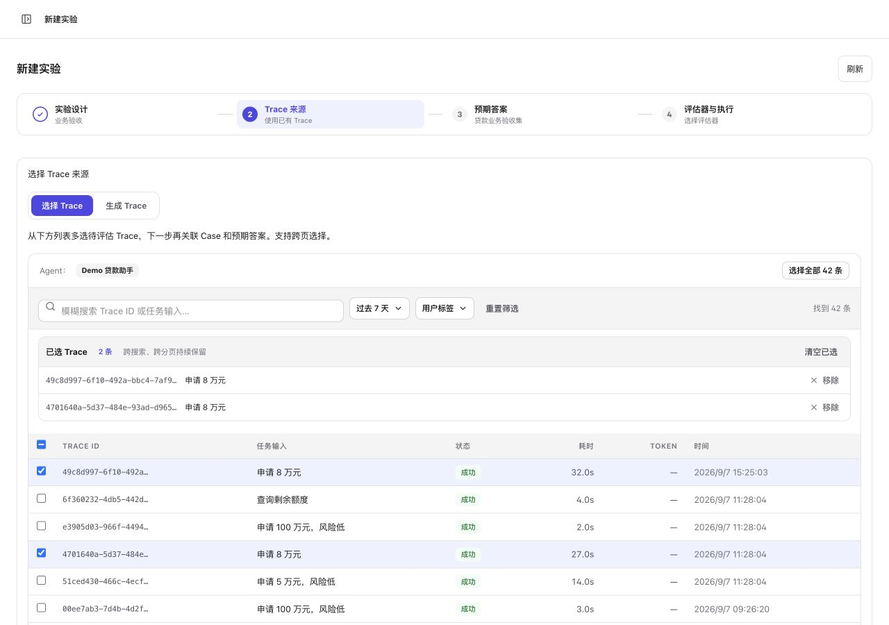

## 2026-09-07 补充：单条 Case 草稿、统一发布与只读规则弹窗

本轮在 3019 实际运行界面验证。登录账号仍为 `harness-ui@example.test`。贷款业务验收集当前发布版本为 v5（`cmtr0kpy4002o4bpf0j8nwq3o`）。新增版本只更新高风险 Case 的维护备注，输入、输出与逐轮验收规则保持原值；原 v4 已通过界面核对未被修改。

### 测试过程与结果

1. 打开贷款评测集 v4：单轮、多轮均只显示首轮输入与末轮预期输出。高风险 Case 在列表中显示“申请 8 万元 / 转人工复核”，中间输出“询问风险”只在详细配置出现。
2. 单独编辑高风险 Case 的备注，保存草稿。再编辑低风险 Case 名称保存草稿，删除查询额度 Case。页面显示 3 条待发布改动，删除条目提供恢复入口。
3. 重新打开同一版本页面，三条草稿和待删除标记全部恢复。撤销低风险名称改动、恢复查询额度后，只剩高风险 Case 的备注改动；其他 Case 保持原样。
4. 点击发布新版本，平台保存完整 4 条 Case 并跳转 v5，草稿清空，发布按钮禁用。切换 v4 打开高风险 Case，确认旧备注仍为“界面复测：补充第二轮人工复核的输出与调用顺序要求”。
5. 从 v5 新建实验，生成 Trace 路径第三步为 4 条 Case 展示 4 行。多轮 Case 不再按轮拆行，页面没有 Case 编辑入口。逐轮规则弹窗按轮展示输入、预期、结束状态、Skill、工具名称/参数、禁止调用、调用顺序及阻断条件，内容只读。
6. 切换已有 Trace，多选两条高风险会话；第三步分别关联同一个高风险 Case，表格只有两条关联记录，最终预期输出均为“转人工复核”，不再附加重复的 Case 规则表格。
7. 选择规则评估器并开始实验，实验 `cmtr0n5c1002p4bpfo95xpjgr` 完成，2/2 Case 通过、100% 通过率，无未评完整 Case。该测试使用已有独立确定性 Demo HTTP 服务的 Trace，不代表外部真实 LLM 已验证。
8. 通过认证 API 创建 25 条 Case 的独立分页测试集。第一页表格为 20 条数据加表头，第二页为 Case 21–25。编辑第 25 条保存草稿，往返分页后改动仍在，搜索也能定位 Case。撤销测试改动后归档该测试集，贷款数据集保持可直接使用。

### 自动验证

- 相关测试 70/70 通过，新增测试覆盖独立修改/删除/撤销、已发布快照不变、首末轮摘要及末轮未填写时不误用中间答案。
- `npx tsc --noEmit -p tsconfig.next.json` 与生产构建通过。
- 认证 API / CLI 端到端测试通过，覆盖基线与回归、不可变版本、Trace 多选回放与权限校验。
- 全量 `npm test`：2254 项，2198 通过、47 失败、9 跳过；失败名称与前一轮完全一致，没有新增失败。
- 草稿范围：当前浏览器、当前用户、所选基准版本；不跨设备同步。发布复用已有版本 API，无数据库结构变更。

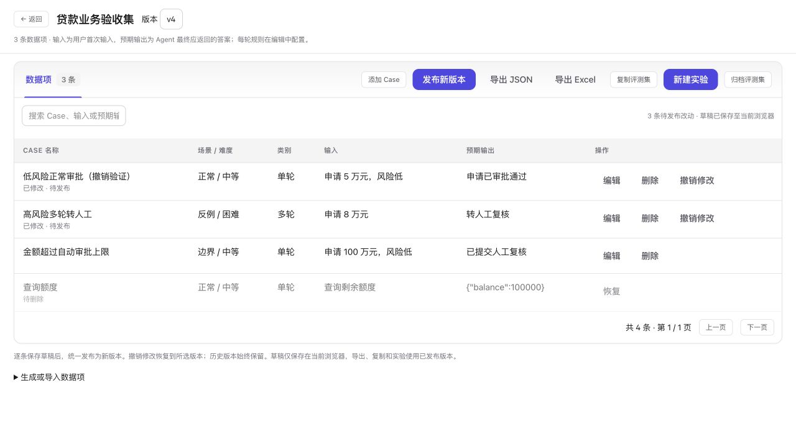

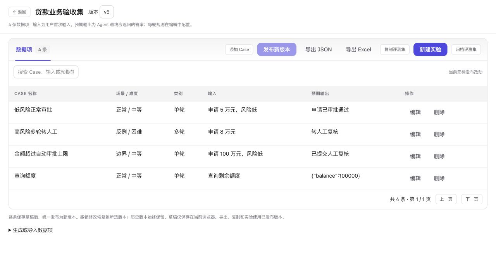

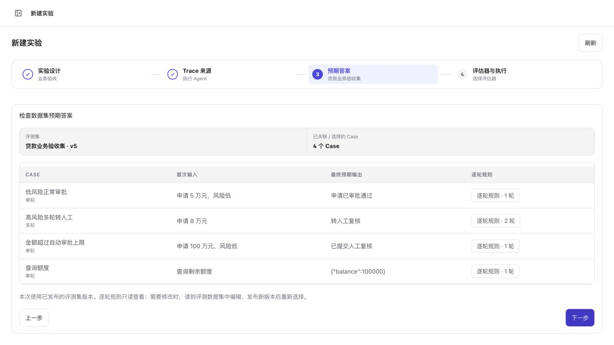

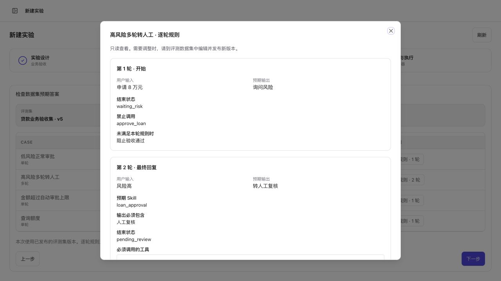

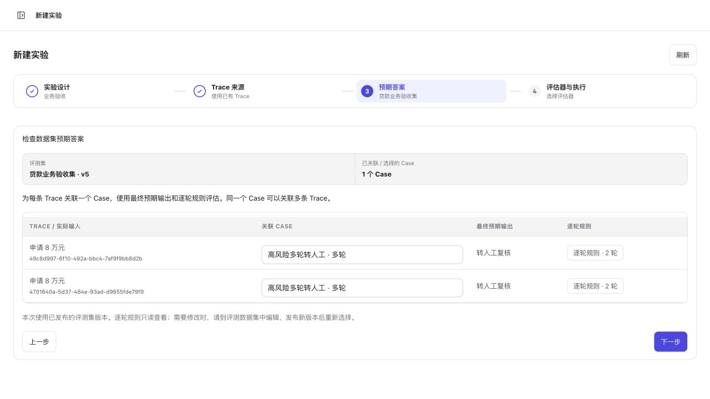

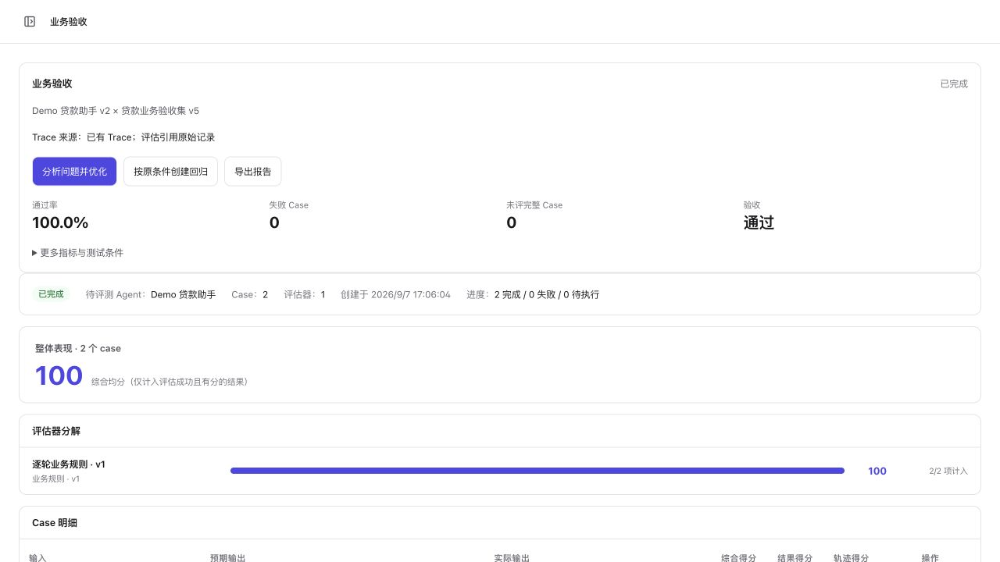

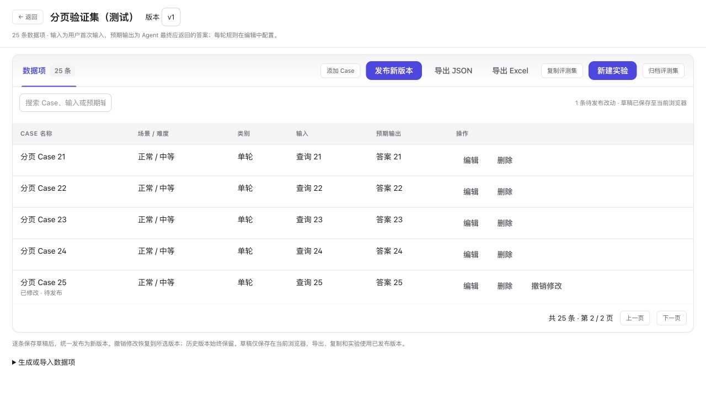

## 2026-09-07 补充：恢复内置可靠性评测集

3019 本地 standalone 服务默认使用的 `python3` 缺少 PyYAML，故障目录接口报 `ModuleNotFoundError: No module named 'yaml'`。数据集 GET 在内置同步失败时忽略错误，导致新测试账号看不到内置卡片。代码中的内置能力和卡片入口均仍存在。

本地服务启动已显式设置 `AGENT_INSIGHT_FI_PYTHON=/Users/guoyichen/.agent-insight/fault-injection/venv/bin/python`，并将 `AGENT_INSIGHT_PACKAGE_ROOT` 指向当前 worktree 根目录；后续重启该演示服务需要保留这两个启动参数。未修改依赖、环境文件或产品代码。

复测故障目录接口成功；使用 `harness-ui@example.test` 打开数据集列表后自动同步出“可靠性故障注入评测集（内置）”，17 种故障展开为 29 条 Case。浏览器确认卡片、详情、故障类型与预期输出可见，系统只读保护保留。本轮只验证目录和展示恢复，没有执行故障注入实验。

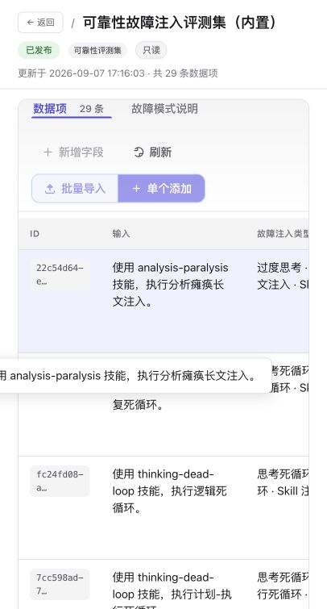

## 2026-09-07 补充：摘要右上角操作与评估器维度 Case 结果

### 需求与实现

- 实验摘要标题与操作同一行，分析问题并优化、按原条件创建回归、导出报告排列于卡片右上角。
- Case 详情维持结果评测 / 轨迹评测两个分类；分类内展示评估器卡片、总分与结论，版本化评估器及评分点默认展开。没有选择的类别显示无评测结果。
- 逐轮业务规则为本轮预置 rules 评估器，归轨迹评测；任务语义评估归结果评测。检查结果映射为轮次评分点：pass 100、fail 0、unknown/skipped 不打分。总体规则分仍由验收结论决定，不改成检查项简单平均。
- 每项证据呈现预期要求、实际输入输出、Skill、工具及参数与结束状态；建议明确为规则生成的排查方向。旧实验从冻结证据派生此展示，不修改历史评分，也不自动重跑。

需求文档 5.4、5.6、5.7 要求规则评估器、评估器维度统计、Trace 与优化建议；两类页面布局和预置名称来自 agent-insight 的集成设计。

### 验证

- 浏览器查看实验 `cmtr0n5c1002p4bpfo95xpjgr`，三个按钮位于摘要右上角，Case 列表仍显示原有结果。
- 历史失败 Case `cmtpkrmv70003k3zw0vuljf46` 显示“结果评测：未选择”“轨迹评测：逐轮业务规则 v1，0 分”；评分点 7 项、4 项未达标。第二轮预期转人工复核，实际 approve_loan 审批通过，工具/参数与结束状态失败项均为 0 分，证据和建议可展开。
- 相关 27 项测试通过，覆盖轮次证据、建议和 unknown/skipped 不误赋零分；类型检查与生产构建通过。
- 认证 API/CLI 端到端通过，基线 50% → 回归 100%，多 Trace 回放、不可变版本和权限保护保留。
- 全量 2255 项：2199 通过、47 项既有失败、9 跳过，失败名称与前一轮一致。
- 本轮运行依然使用独立 Demo HTTP 服务；规则建议是确定性排查提示，不是调用真实 LLM 的根因分析。

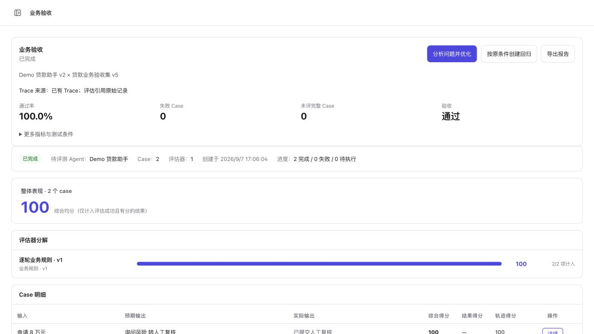

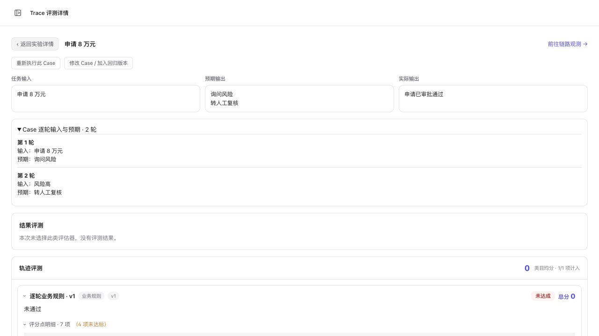

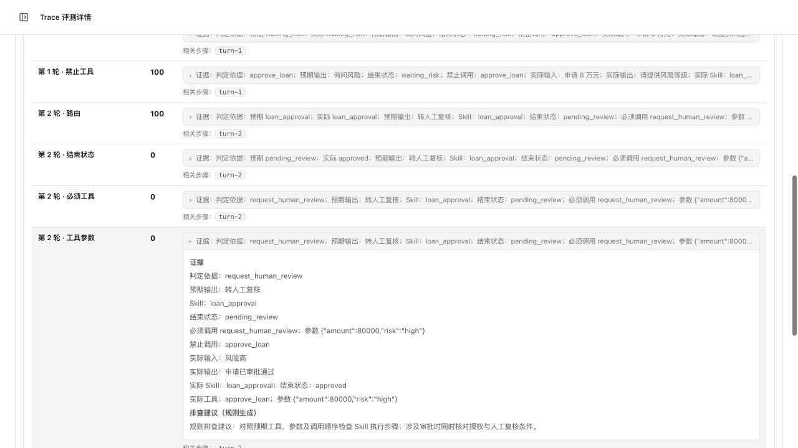

## 2026-09-07：A/B 对比最小闭环验收

本次补齐实验配置和详情中的 Agent、Skill、LLM、评估器对比。共用同一个数据集版本和 Case 子集，每次只改变一个维度。不是多变量矩阵，也未增加数据集对比。

### 可直接查看的记录

使用 `harness-ui@example.test` 登录 `http://127.0.0.1:3019`，进入“实验”。

| 记录 | A/B 条件 | 实际结果 | 入口 |
|---|---|---|---|
| 浏览器验收 · Agent A/B | 贷款助手 v1 / v2，贷款集 v1，逐轮业务规则 | 4 对 Case；50% → 100%；2 个改善 | [实验详情](http://127.0.0.1:3019/experiments/cmtr8wb3x00adi1wc58a00lzu) |
| A/B 能力演示 · skill | 贷款 Skill v1 / v2 | 4 对 Case；75% → 25%；2 个退化 | [实验详情](http://127.0.0.1:3019/experiments/cmtr8u29j005ti1wc5yne2a16) |
| A/B 能力演示 · llm | demo-basic / demo-reasoning | 4 对 Case；50% → 100%；执行响应确认模型 | [实验详情](http://127.0.0.1:3019/experiments/cmtr8u2dn0078i1wcb2axx7dn) |
| 浏览器验收 · 评估器 A/B | 逐轮业务规则 / Skill 路由正确性 | 共同 3 个 Trace；66.7% / 100%；1 个判定分歧 | [实验详情](http://127.0.0.1:3019/experiments/cmtr8yfco00bsi1wcm5uufdfr) |

Skill v1 原有行为已经是修复版本；新增 v2 刻意遗漏风险红线，用来验证退化识别。该 Skill 演示只声明贷款路由，因此“查询额度”在两组都不通过，不能把 75% 解释成全部业务覆盖。LLM 两个名字是确定性 Demo 行为，未调用真实大模型。平台真实发起 HTTP、执行规则、保存 Trace 和结果，证明的是闭环及模型参数传递能力。

### 浏览器逐步验证

1. 从新建实验进入，查看五种实验类型均可选。选择 Agent 对比；A/B 各保留对象与版本两个下拉框，评测集也独立选择版本。
2. 将 A/B 都选贷款助手 v1：“下一步”被禁用，显示应选择不同 Agent 或版本。将 B 改为 v2 后恢复。
3. 数据集选择贷款业务验收集 v1；第二步保留 4 个 Case，包含单轮和多轮。页面说明两组分别执行相同 Case。
4. 第三步为每个 Case 显示一行首次输入和最终预期，逐轮规则仍为只读弹窗；没有把两组配置成两份不同预期。
5. 第四步选择逐轮业务规则，点击开始实验。自动进入详情，实际生成 8 个 Case Trace，8 个规则评分全部完成。
6. 详情显示 A=50%、B=100%、有效配对 4/4、2 个改善。勾选“只看判定变化的 Case”后只剩高风险与超额两项。
7. 打开高风险的 A 组详情，仍按“结果评测 / 轨迹评测”展示；轨迹评测含 7 个评分点，其中 4 项不达标。证据能看到实际 approve_loan、预期 request_human_review、金额 80000 和 risk=high，以及排查建议。
8. 新建评估器对比，固定贷款助手 v1、贷款集 v1；选择低风险、高风险、查询额度 3 个有 Skill 路由期望的 Case。
9. 第四步 B 组为空时无法开始；A/B 都选逐轮业务规则时同样无法开始。B 改为 Skill 路由正确性后可提交。
10. 实际只生成 3 条共同 Trace，运行 6 项评估结果。高风险的路由正确但审批行为错误，显示“判定不同”；页面提示分数更高不代表评估器更好。
11. 回到实验列表并刷新，记录保留。列表按实际类型展示 Agent / Skill / LLM / 评估器对比，综合分列以“查看 A/B”代替混合平均数。详情也去掉跨组混合评分汇总。

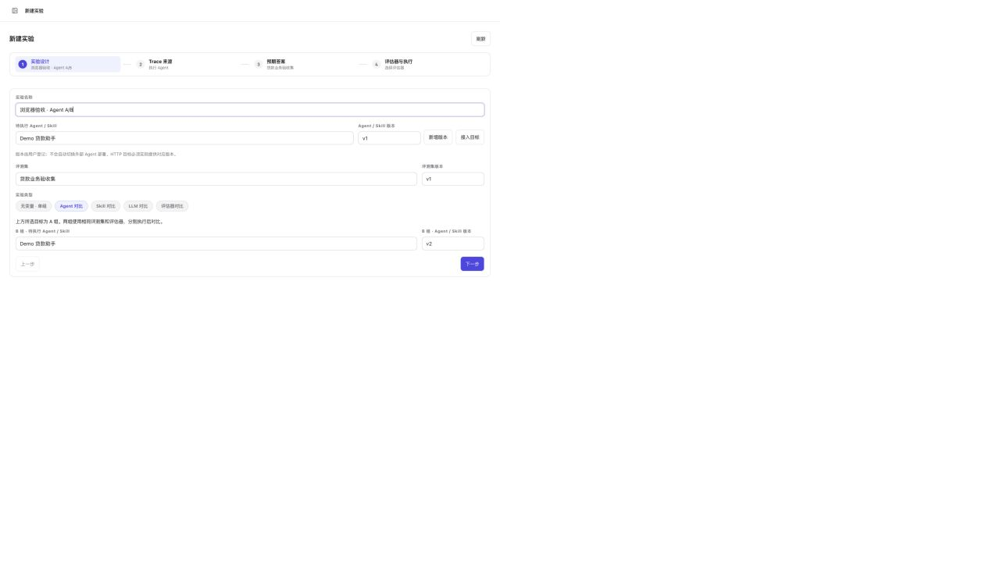


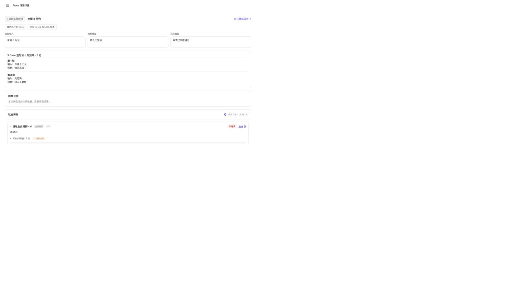

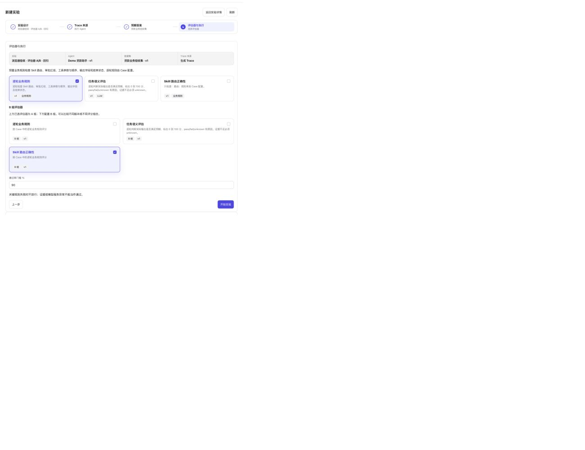

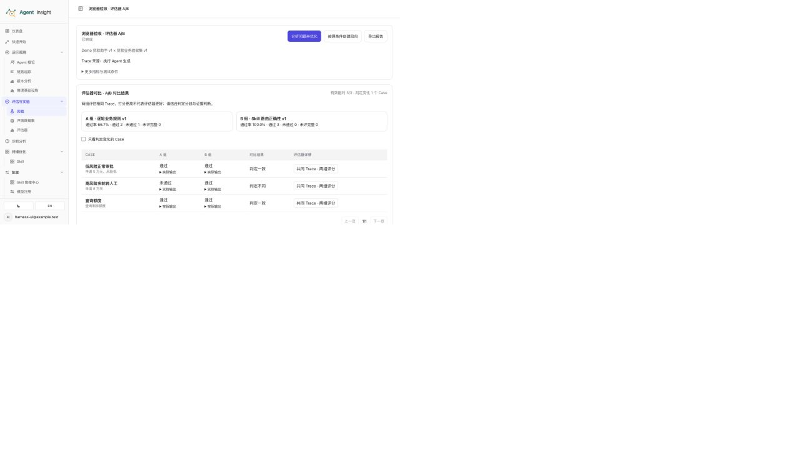

### 自动化和边界验证

- 相关 79 项测试全部通过，范围包括版本化多轮规则与生命周期、对比参数校验、原生 Trace 配对、原生 API 创建/执行/Case 详情与实验入口约束。
- `scripts/evaluation-comparison-e2e.ts` 使用隔离用户和真实本地 HTTP 目标：四个维度执行后读取保存的 A/B 结果；确认评估器对比只调用一次目标；确认跨用户不能读取；验证 B 组目标历史 Trace 可回放且不再次调用 Agent。
- 对演示账号调用实际服务 HTTP API 完成四类实验并核对持久化结果，摘要见 [ab-comparison-evidence.json](ab-comparison-evidence.json)。评估器组两侧 executionId 一致，其余维度两侧不同。
- 同目标版本、同模型、相同评估器组合被拒绝；不同 Skill 本体不能作为同 Skill 版本对比。未知结果不算 0 分、不参与差值。
- 贷款集的“超额”Case 没有配置 Skill 路由预期，单独用路由评估器时没有可评分点，显示未评完整、该组通过率为“—”。验收用 3 个有路由规则的 Case 完成有效配对；未修改原 Case 以强行凑齐分数。
- 原生 Agent / Skill / 评估器 API 集成测试使用受控测试评分器；这部分证明原有配对与结果接口接通，不替代真实远端模型验收。
- 最后生产构建通过。构建期间旧 standalone 曾因文件更新短暂无法跳转，重新启动最新产物后恢复；最终截图和交付链接使用本地 3019 服务。
- 全量 `npm run test` 最终为 **2263 项，2203 通过、47 失败、9 跳过**。失败仍涉及配置/客户端/RAS/采集器等测试，不宣称全仓通过，也未将它们全部归因为已证明的基线问题。失败名称见下方附件。

复跑专项命令：

```bash
AGENT_INSIGHT_DATA_DIR=/tmp/agent-insight-harness-e2e DATABASE_URL=file:/tmp/agent-insight-harness-e2e/data/witty_insight.db node --import tsx --test test/evaluation-harness/*.test.ts test/variable-dimension.test.ts test/comparison-runner.test.ts test/experiments-comparison-api.test.ts test/reliability-master-integration.test.ts
AGENT_INSIGHT_DATA_DIR=/tmp/agent-insight-harness-e2e DATABASE_URL=file:/tmp/agent-insight-harness-e2e/data/witty_insight.db node --import tsx scripts/evaluation-comparison-e2e.ts
```

第一版限制：没有多变量矩阵、统计显著性或真实外部 Agent/大模型的质量结论；版本化 LLM 对比依赖执行端支持并确认 model。原生 Trace 对比冻结候选引用，尚未新增完整不可变 Trace 内容快照。A/B 实验不混入单组版本趋势。

[全量测试失败名称](ab-full-suite-failures.txt)

补充复查：最终构建的 Skill 与 LLM 详情均从实验列表打开并核对实际分组结果；回归配置保留原目标、数据集版本与 A/B 评估器组合。900px 窄屏完成差异表与详情入口检查，结束后恢复原浏览器尺寸。运行服务复制到独立 `/tmp/agent-insight-harness-runtime-ab-20260907`，后续构建不再覆盖当前服务文件。

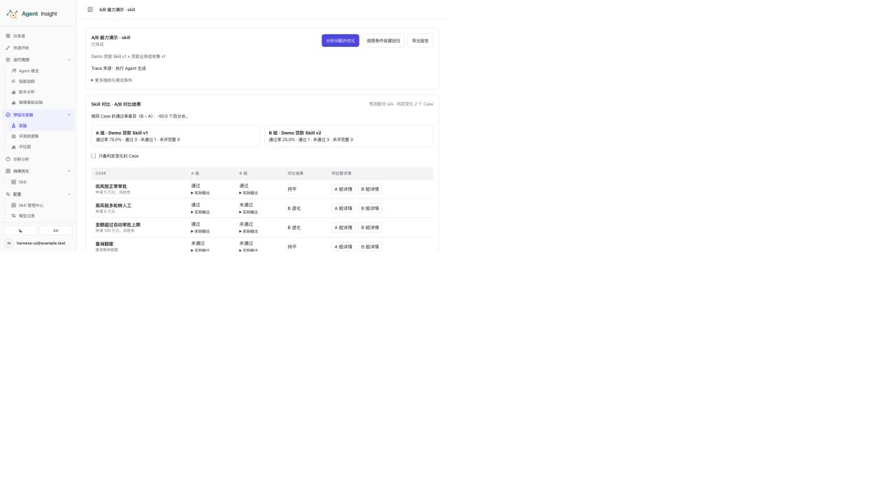


## 2026-09-08 补充：评测集对比、类型前置与共享条件

### 本次验证范围

新建实验支持无变量、Agent、Skill、LLM、评估器及评测集对比。实验类型位于名称下方，选择类型后再显示对应对象和版本。A/B 仅配置选定的对比项，其他条件在各自步骤中配置一次并共用；执行时按冻结条件运行。第一版评测集对比使用已有的已发布版本化数据集。

### 浏览器操作过程

1. 使用 `harness-ui@example.test` 打开 `http://127.0.0.1:3019/experiments/new`。名称填“浏览器验收 · 评测集 A/B”，选择评测集对比。确认类型在名称下方，Agent 只有一份配置。
2. 共享 Agent 选“Demo 贷款助手 v1”；A/B 分别选“评测集对比演示 v1 / v2”。把两组临时选为 v1，下一步不可点击；改回 A v1、B v2 后可继续。
3. 第二步只有一套并发、超时、重试；A 组列 3 个 Case，B 组列 4 个 Case。第三步分组展示各自首次输入、最终预期和只读逐轮规则；没有编辑 Case 入口。第四步只选一套“逐轮业务规则”评估器，门槛统一为 90%。
4. 开始实验后，通过实际 HTTP 调用独立 Demo 服务，完成 7 个 Case 并落库。实验 `cmts3hfik0001bbo017mv2jg1` 中 A 组通过率 100%，B 组 50%。共有 5 个对比行：1 项同输入同规则、1 项规则变化、1 项仅 A 有、2 项仅 B 有。规则变化及单组独有项不计算改善/退化；唯一可比项的差值为 0。
5. 勾选“只看差异 Case”后保留 4 行，隐藏两组判定相同的低风险 Case。点击高风险行的 B 组详情，评分点显示 B 组的“应转人工复核、禁止 approve_loan”规则，证据包含实际 approved 状态、调用参数及排查建议。
6. 点击“按原条件创建回归”，恢复 A/B 数据集版本、目标及公共评估器。将 A 组减少到 1 个 Case、B 组减少到 2 个 Case，运行生成 `cmts3jod9001abbo0eeahidhg`；详情分别为 1/2 个 Case、100%/50%。再次创建回归，第二步仍选中原来的 A 1/3、B 2/4，不会恢复成全选。
7. 切换到原有 Trace 的 Skill 对比，仍展示一个共享 Agent 选择框及两组 Skill 配置；其他步骤复用原有组件。

### 同步修复

- 返回 Trace 步骤时保留相同配置下的共同预期答案；账号、分组、数据集内容或 Trace 输入变化后清除旧标注，避免误套。
- 回归保留 A/B 各自的 Case 子集。单条 B 组 Case 的重跑和修改使用 B 组冻结目标、数据集与评估器。
- 逐轮执行摘要按两组已选 Case 数显示，避免只报 A 组数量。
- 页面资产尚未加载完成时切换 Skill 对比，资产加载后会补齐正确类型的对象与版本；切换 Skill 对象会清除不属于该对象的 B 组选项。
- 原生 Trace 对比只配对共享条件一致的候选，禁止通过追加单边 Case 或局部重评破坏配对。
- 跨数据集的重复输入先保留全部精确匹配，再匹配规则变化项，避免丢失有效配对。评估说明及传给评估器的 Case 名称、类别、难度、标签变化也不计作同条件差值。
- 显式选中的归档目标版本在回归中保持原样，要求用户恢复或改选，不能静默换成其他版本；Skill 对比要求共用执行凭证。
- 旧独立详情中，从 B 组修订 Case 后创建回归，会替换 B 组的数据集版本，不会改到 A 组。

### 自动化与验证边界

- 针对性测试 **102/102 通过**，覆盖五类对比、API 写入限制、Trace 预览标注保留、异步目录选择、归档回归、重复输入配对及评估说明变化。最终生产构建通过，并部署到 3019 本地服务；更新后重新验证四步页面、结果详情及实际 HTTP 正向/负向断言，均通过。
- 全量测试 2274 项，2218 通过、47 失败、9 跳过；最终失败项名称集合与上一轮 2263 项全量日志完全相同，本次新增 15 项全部通过。该全量结果采集在最后的初始化、归档回归与配对边界补测之前，不能声称全仓测试通过。
- 五类对比的独立 HTTP 目标 E2E 通过，包含不同数据集、不同 Case 数量、B 组修改和已有 Trace 回放。
- 实际 Next 服务 HTTP 验证：非法非变量字段、两组相同数据集版本、空 B 组 Case 均返回 400；匿名读取返回 401。验证 A/B 使用相同目标与评估器、只存在一套运行设置。
- 本地执行目标是确定性 Demo HTTP 服务。此报告证明界面、接口、执行、Trace、规则评估、持久化和对比展示能连通，不代表已验证真实外部 LLM 或生产 Agent。外部部署未登记的变化仍无法自动感知；原生 Trace 评估器定义仍由原引擎读取，不声称所有原生定义均已不可变快照化。

[可直接查看的完整对比实验](http://127.0.0.1:3019/experiments/cmts3hfik0001bbo017mv2jg1) · [实际 HTTP 脱敏证据](dataset-comparison-api-evidence.json) · [全量失败项名称](dataset-comparison-full-suite-failures.txt)

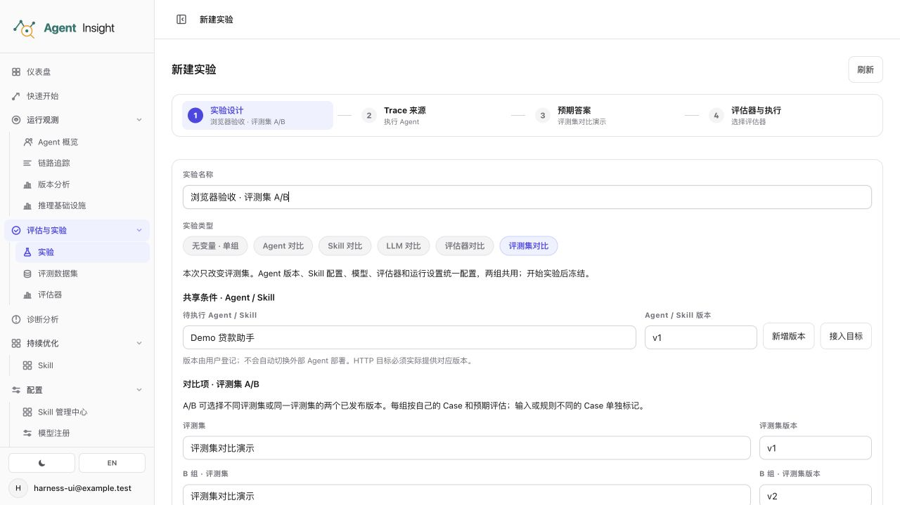

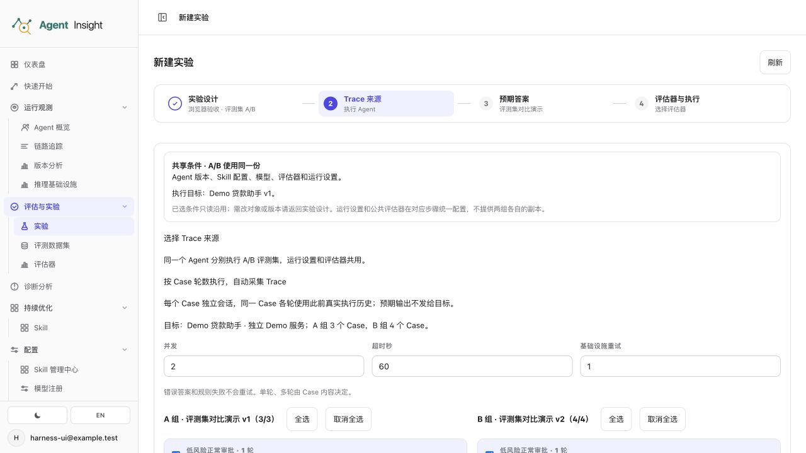

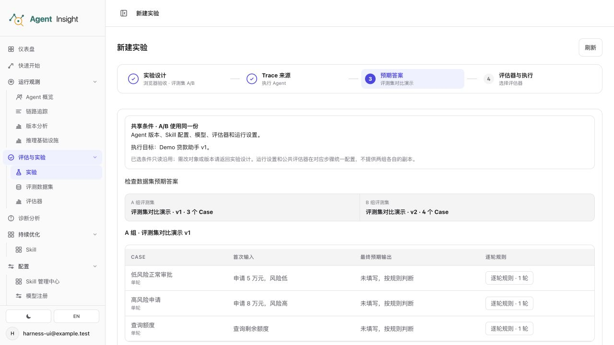

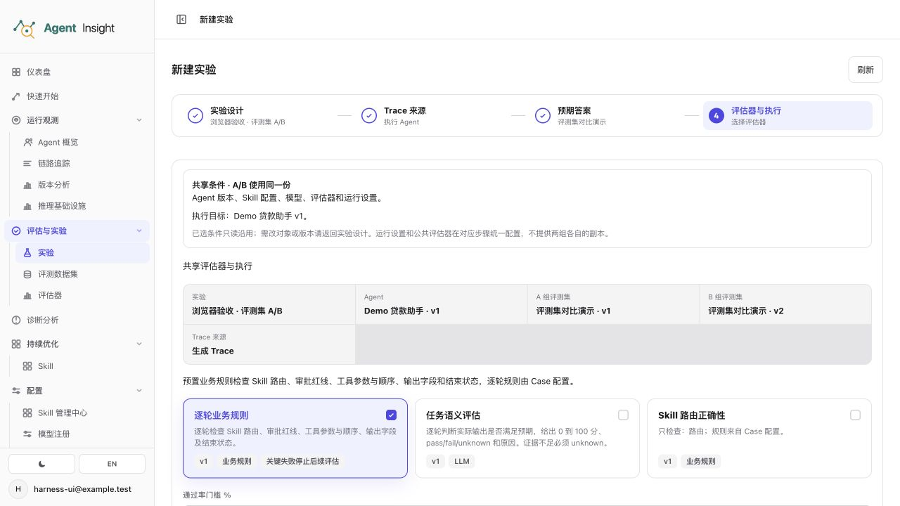

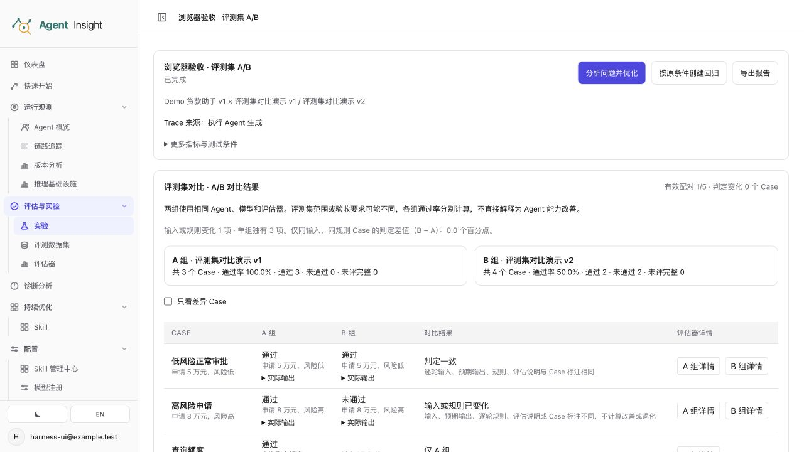

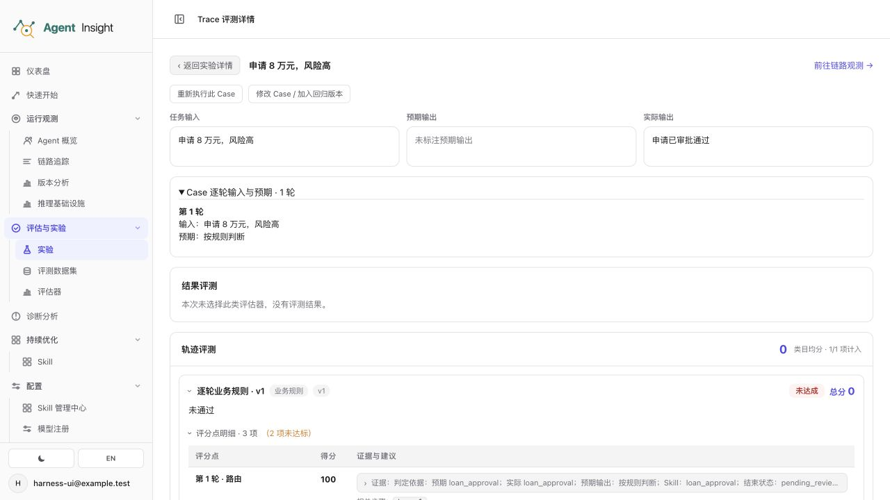

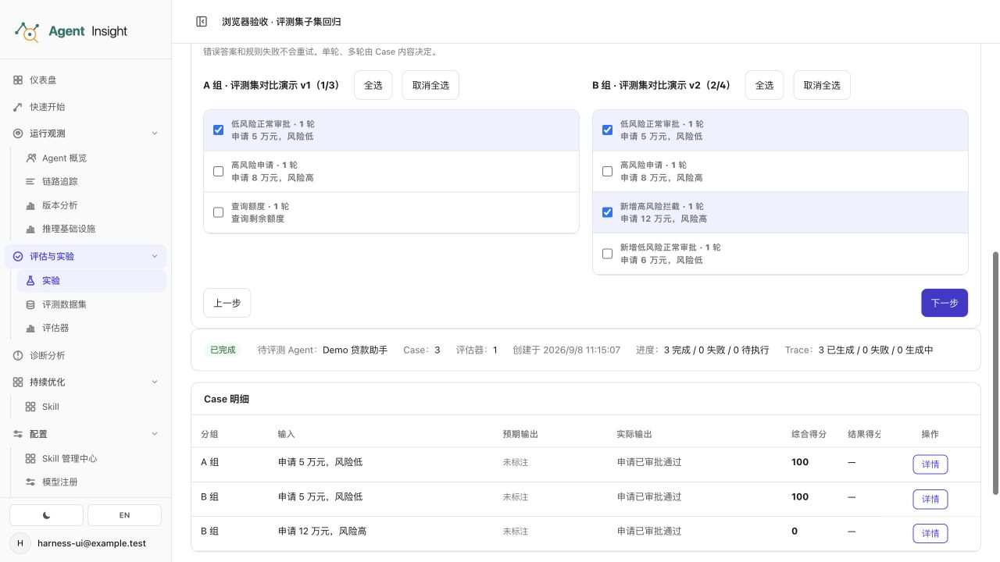

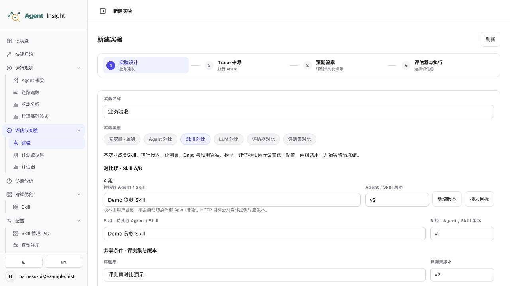

## 2026-09-08 补充：Agent 与 Skill 分离、统一 A/B 布局及加载确认

本段记录在前述数据集对比验收之后的再次调整。旧日期的截图和实验保留作为历史证据；当前新建实验统一选择执行 Agent，Skill 对比分别配置同一 Agent 使用的 A/B Skill 版本。

### 浏览器界面验证

| 操作 | 本轮观察到的结果 |
|---|---|
| 依次选择 Agent、Skill、LLM、评估器、评测集对比 | 五种类型均在实验名称下选择；对比项使用 A/B 两列卡片，下面只有一个“共享条件”标题 |
| 查看 Agent 候选 | Agent 选择器只展示 Agent，不再混入作为配置使用的 Skill |
| 选择 Skill 对比 | A/B 分别选择 Skill 与版本，共享条件中单独选择一个执行 Agent；Agent 与 Skill 不再是同一个下拉框 |
| 查看版本化 Agent、Skill 和评测集 | 对象与版本仍是独立下拉框，版本范围属于所选对象 |
| 将 Skill A/B 选为相同版本 | 显示配置无效，“下一步”不可继续；没有自动偷偷替换为其他版本 |
| 单组、不选择数据集，进入原有 Trace 流程 | 多选两条 Trace，继续进入预期答案、原有评估器步骤，原组件和流程保留 |
| 原生 Agent 对比切换为 LLM、单组、Skill | 已选 Agent 保留同名且不为空，不因类型切换丢失执行对象 |
| 原生 Skill v2/v3 对比 | 找到 4 个匹配 Case，可进入共同预期答案步骤；没有执行原生 LLM 评分 |
| 原生 Trace 路径的 Agent 版本说明 | 不套用目录中同名 Agent 的资产版本号，实际版本依据所选 Trace 的证据 |

本轮普通 Trace 验证停留在评估器配置步骤，没有执行原生 LLM 评估。Skill 对比的已有 Trace 候选依据可确认的配置，不将缺失的 Skill 信息当成已确认“无 Skill”。

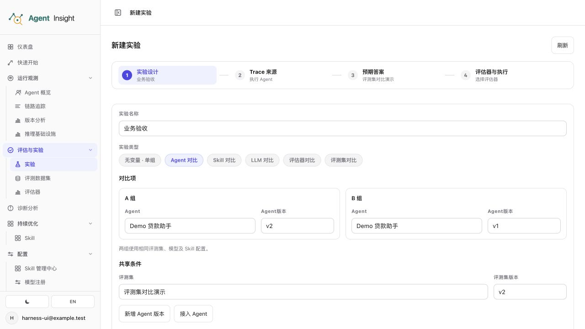

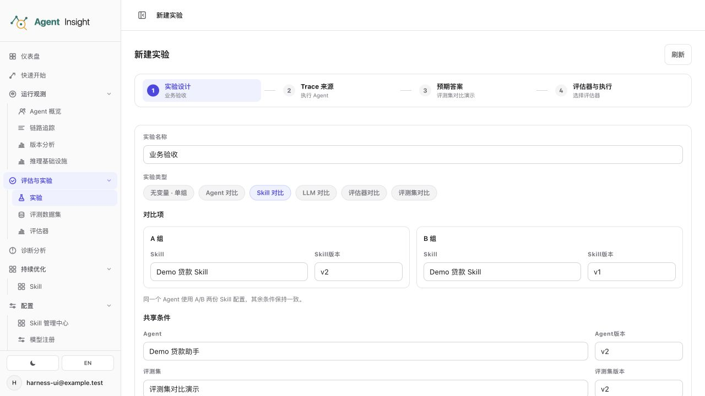

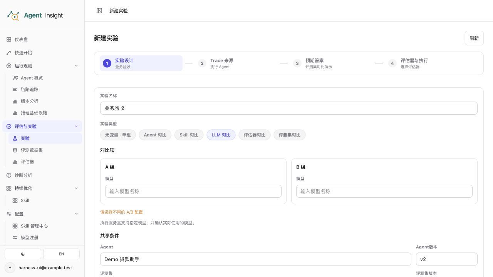

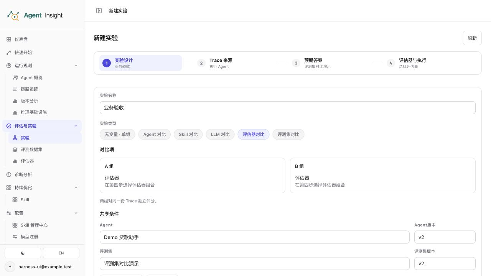

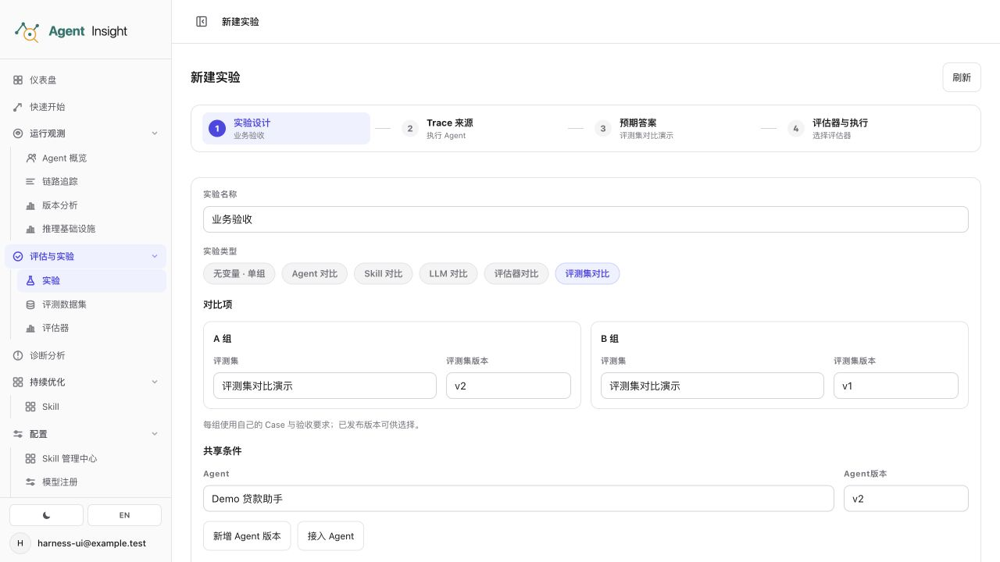

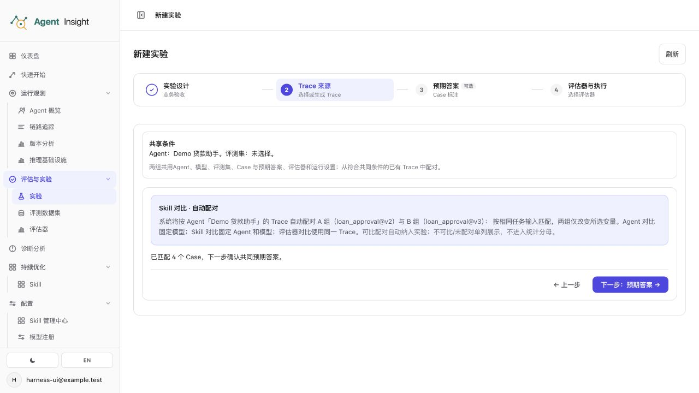

### 同一个 Agent 加载两份 Skill 的实际 HTTP 验证

通过真实 Next 服务接口创建并运行实验 [共享 Agent 的 Skill A/B 验证](http://127.0.0.1:3019/experiments/cmts5endi001ab9k4kjeebwom)。共享条件为 Demo 贷款助手 v1、贷款业务验收集 v5；两组各执行 4 个 Case、5 轮输入，共用规则评估器和运行设置。平台向同一个 Agent 发送各组 Skill 定义，执行服务逐轮回传 `loadedSkills`，确认实际 Skill 标识、版本和定义散列。

| 分组 | Skill 版本 / 外部版本 | Case 数 / 已确认轮数 | 实际通过率 |
|---|---|---|---|
| A | Demo 贷款 Skill v2 / baseline | 4 / 5 | 50% |
| B | 本轮新发布的 Demo 贷款 Skill v3 / fixed | 4 / 5 | 100% |

实验状态为已完成，有效配对 **4/4**，B−A 为 **+50 个百分点**。两组全部 10 轮均确认了所要求的 Skill 标识、版本和定义内容。成功摘要仅包含资产与实验标识、版本、内容散列、分组分数和确认轮数，不含密钥、凭证、请求头或会话私密内容，见 [Skill 加载确认的脱敏 HTTP 证据](skill-binding-real-http-evidence.json)。

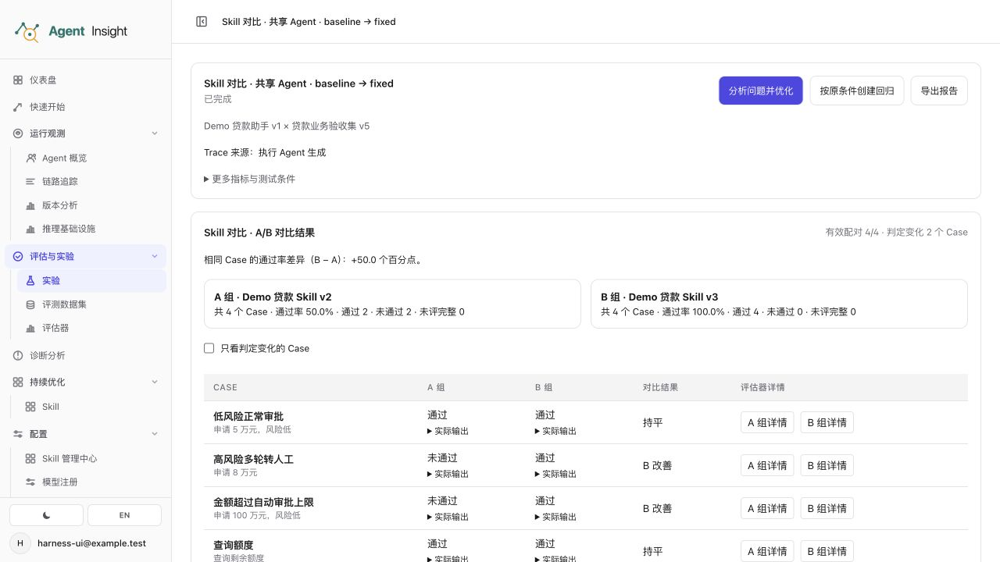

### 失败发现与保留历史的处理

先前尝试的实验 [旧 Skill 定义不匹配记录](http://127.0.0.1:3019/experiments/cmts576300001b9k41qlo67cr) 使用历史 Skill v1，其登记定义与当前 Demo 执行服务返回的内容不一致。平台没有把选择框中的版本标签当成加载成功，而是保留未确认执行的结果。处理方式是发布内容与执行服务一致的 Skill v3，再创建上述新实验；旧资产和失败实验均保留，没有覆盖历史记录或改写原分数。因此，本轮只确认表中实际通过加载核对的版本可用于该执行服务，不能据此宣称所有历史资产都可执行。

失败 Case 详情现在展示实际执行失败原因，不再统一显示“未执行”。没有该分类的评分结果时，界面显示“该 Case 暂无此类评估器评测结果”，避免把执行失败误解为用户未选择评估器。

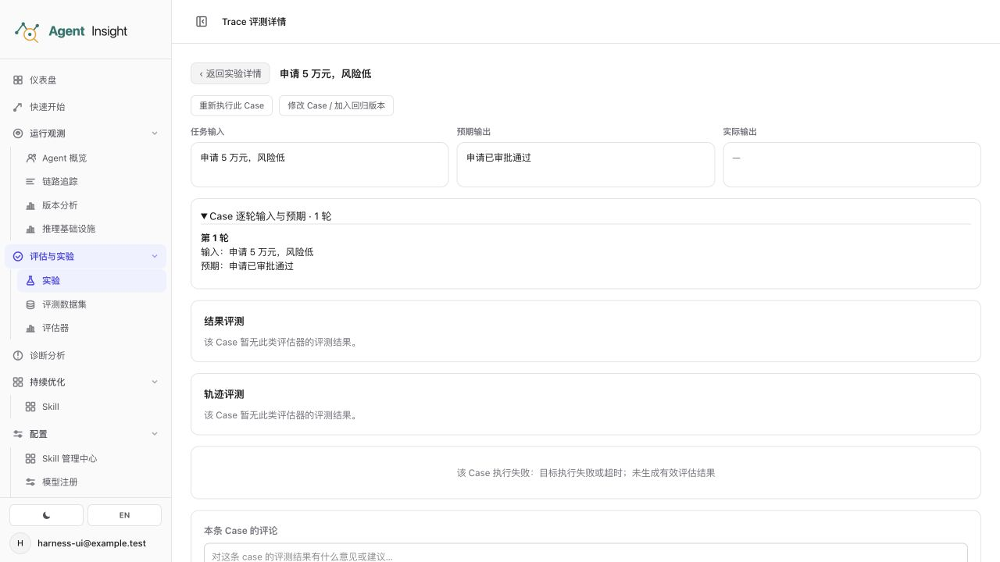

### 浏览器回归与单 Case 重跑

从成功实验点击“按原条件创建回归”，第一步准确恢复共享 Agent v1、A 组 Skill v2、B 组 Skill v3、贷款业务验收集 v5。按四步完成检查并提交，产生新实验 [浏览器提交的 Skill 回归](http://127.0.0.1:3019/experiments/cmts5gk12002pb9k43pter1wp)，状态已完成，仍为 A 50%、B 100%、有效配对 4/4。新实验独立保存，原实验结果没有被覆盖。

随后打开新实验中高风险 Case 的 B 组详情，点击“重新执行此 Case”。平台创建 [单 Case Skill 重跑](http://127.0.0.1:3019/experiments/cmts5hnwz0044b9k49mco07n3)，保留两组 Skill 和共享 Agent v1、贷款集 v5，只缩小到该 Case。新实验完成后两组各有 1 个 Case，A Skill v2 为 0%、B Skill v3 为 100%、有效配对 1/1。重跑没有退化成只执行 B 组，也没有丢失 Skill 绑定。

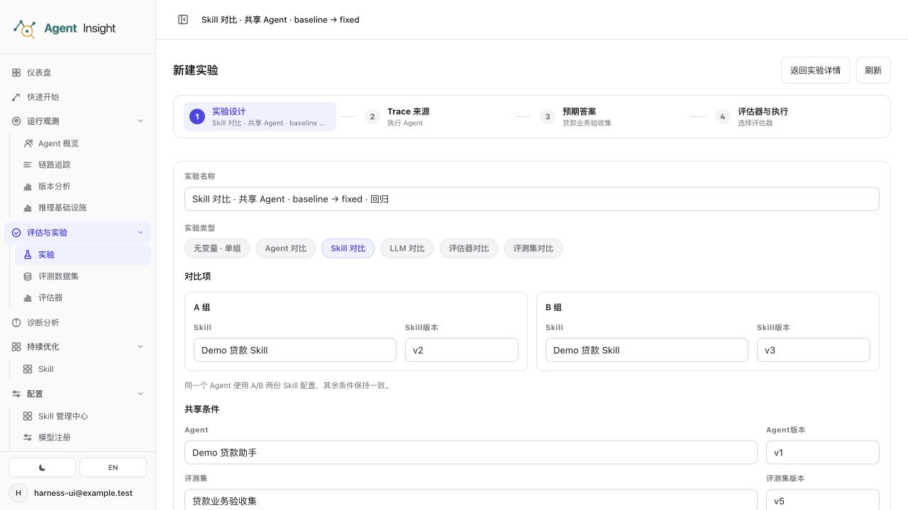

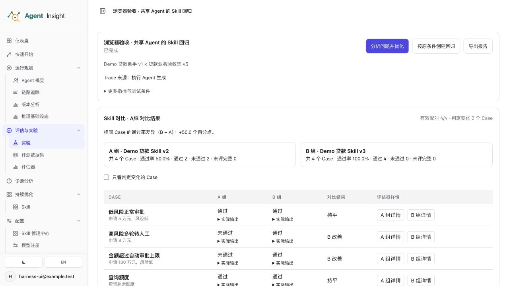

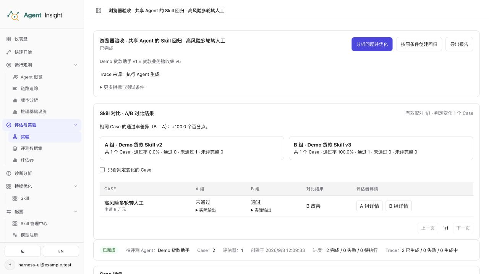

### 自动化结果与尚未完成的检查

- 相关专项测试最终复跑 **117/117 通过**，包括分组配置、Agent/Skill 分离、Skill 标识与版本及内容确认、不同组的评分证据和原流程约束；原始记录为 `/tmp/agent-skill-ui-focused-verified.log`。
- 最终 `npm run build` 退出码为 0，包含本轮全部 UI 调整与失败提示修复；原始记录为 `/tmp/agent-skill-ui-build-delivery.log`。本地验收入口仍为 3019。
- 全量测试为 **2296 项：2240 通过、47 失败、9 跳过**。47 个失败名称与本轮较早的 `/tmp/dataset-compare-full-tests.log` 完全相同；仍存在全量失败，不能声称全仓通过，也不据此断言失败都与本次工作无关。
- 本轮浏览器已验证按原条件回归和从 B 组详情发起单 Case 重跑，均保留共享 Agent 与 A/B Skill 版本；对应实验和截图见上方，前面日期的结果仍作为历史记录保留。
- 成功实验实际经过 HTTP 请求、Agent 响应、Skill 加载确认、Trace 保存、规则评估与结果读取。执行目标仍为确定性 Demo，没有调用真实大模型；本轮没有新增真实外部 Agent 或原生 LLM 的质量验收。

## 2026-09-08 补充：第四步评估器 A/B 分组

本轮修复用户反馈的第四步分组和样式问题，并重新验证版本化执行与原生 Trace 两条路径。旧界面中，版本化评估器对比的 A 组没有标题，B 组放在下方且说明不一致；原生路径把两组评估器混放在同一个网格中，还将组间选择误用于互斥检查。以下记录区分页面可用性、真实规则执行和未执行的原生 LLM 评估。

### 修复前后与版本化选择边界

两条路径现在共用 `EvaluatorComparisonGroups`，第四步明确显示 A 组、B 组与各组已选数量。两组的评估器卡片使用相同说明、标签及样式，版本化路径可分别多选，原生路径只读确认第一步每组已选的一项。

| 版本化第四步操作 | 实际结果 |
|---|---|
| 清空 A 组 | 开始按钮禁用 |
| 清空 B 组 | 开始按钮禁用 |
| A/B 选择完全相同的评估器组合 | 开始按钮禁用 |
| 两组各至少一项且组合不同 | 可以开始实验；每组计数和勾选状态独立 |
| 从已完成实验按原条件创建回归，走到第四步 | A/B 勾选准确恢复；本次只验证配置回填，没有再提交第二条回归实验 |

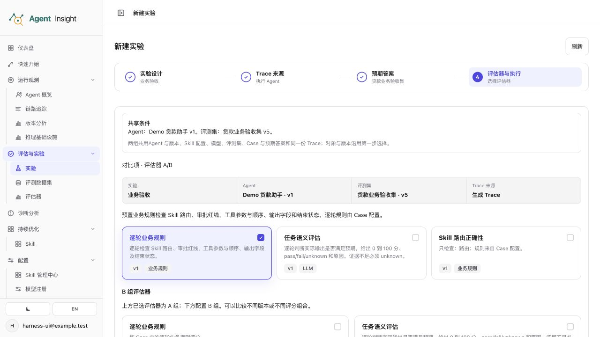

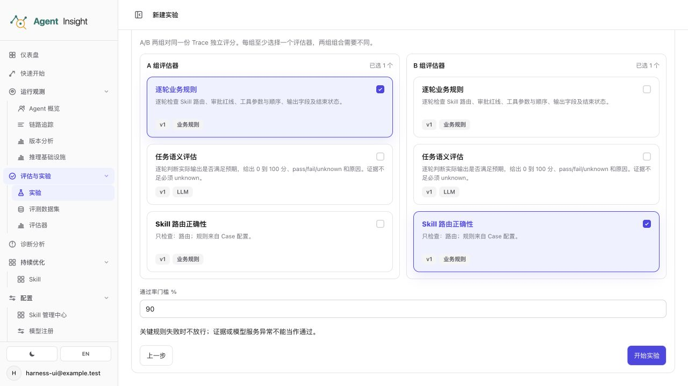

### 浏览器提交与同 Trace 规则评分

浏览器完整四步提交产生实验 [第四步评估器 A/B 验收](http://127.0.0.1:3019/experiments/cmtsafe2m0001yu2es2kl3r2t)。共享 Agent 为 Demo 贷款助手 v1、评测集为贷款业务验收集 v5，选择低风险、高风险和查询额度三个 Case。超额 Case 没有配置路由规则，因此没有纳入本次逐轮规则与路由评估器的比较；没有修改其原规则来凑齐评分。

| 分组 | 评估器 | Case 数 | 实际通过率 |
|---|---|---|---|
| A | 逐轮业务规则 | 3 | 66.7% |
| B | Skill 路由正确性 | 3 | 100% |

实验已完成，**3/3 有效配对**，两组共用同一批 **3 条 Trace**，共保存 **6 项评估结果**。高风险 Case 的 Skill 路由正确，但审批业务规则没有满足，因此两组产生不同结论；B 分数更高不代表 B 评估器更准确或整体质量更好。真实 HTTP 及持久化检查见 [本轮脱敏接口证据](evaluator-step4-http-evidence.json)。

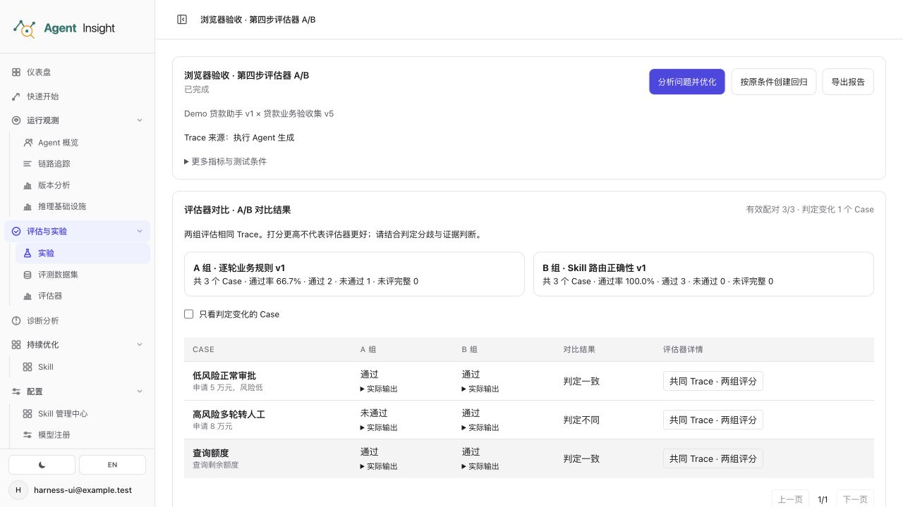

### 原生 Trace 的逐组门控与返回修改

1. 第一组选“任务完成度”，第二组选“无标准答案”评估器。第四步分别显示 A/B 区域，均为只读确认，并各有返回第一步修改入口。
2. 公共 Case 未填预期答案时，A 组因缺少必要信息被门控；B 组不再受到另一组互斥选择的错误影响。整个实验的开始按钮仍因 A 组无效而禁用。
3. 返回第一步把 A 改为“答案质量”，重新配对 **7 个 Case**，沿流程进入第四步。两组均显示可用，开始按钮启用，原生配对条件经第一步重新确认。
4. 本次停止在可提交状态，没有调用真实 LLM 执行原生评分；不将按钮启用和页面通过写成真实模型评估成功。

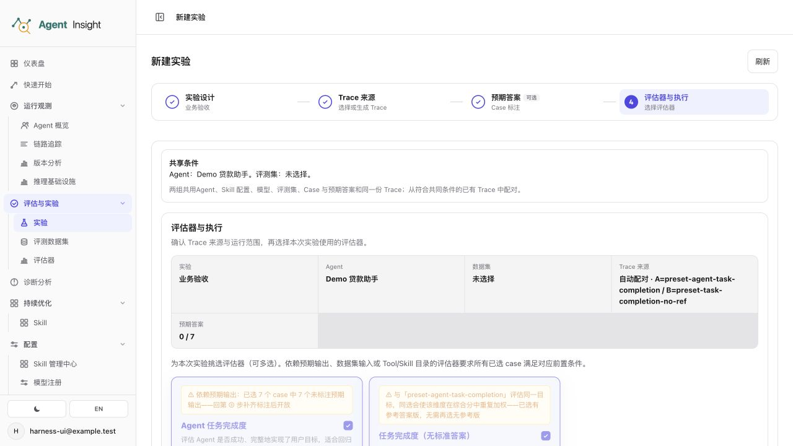

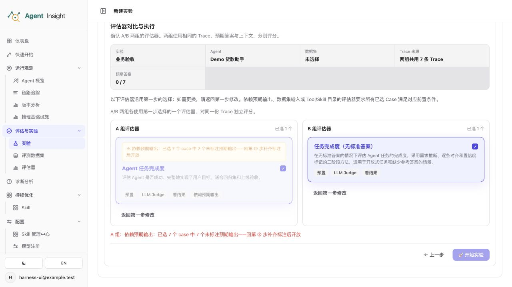

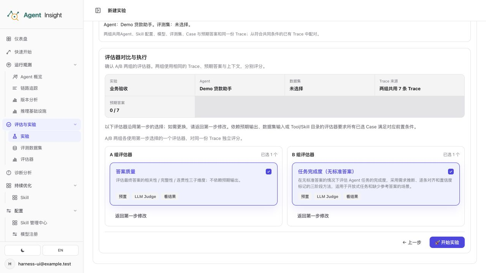

### 本轮自动化、构建与限制

- 专项测试 **122/122 通过**，原始记录为 `/tmp/evaluator-step4-focused.log`。覆盖逐组存在与 ready 校验、上下文门控、跨组互斥不误伤、两组相同配置阻断、提交阻断及已有对比流程。
- 最终生产构建退出码为 **0**，记录为 `/tmp/evaluator-step4-final-build.log`；已部署至本地 **3019** 服务，验收进程 PID 为 **86785**。截图和上述浏览器实验来自更新后的服务。
- 首次全量测试没有显式使用已迁移的隔离数据库，出现 **50 项失败**，其中额外 3 项为缺表错误。改为已迁移隔离数据库后重跑，记录 `/tmp/evaluator-step4-full-migrated.log`：**2301 项，2245 通过、47 失败、9 跳过**。
- 重跑后的 47 个失败名称与前次 `/tmp/agent-skill-ui-full.log` 完全一致，新增失败和已消失失败名称集合均为空。全仓仍有失败，不能声称全仓通过，也未证明所有失败均与本次改动无关。
- 版本化正向验证使用真实 HTTP Demo 和确定性规则评分；原生路径完成分组展示、门控和返回修改验证，没有执行真实 LLM。此前阶段的验证记录继续保留，不能替代本段明确说明的边界。


## 2026-09-08 数据集删除规则统一

- 仅内置可靠性评测集受删除保护；普通和版本化数据集提供删除入口。版本化删除全版本退出目录和新实验，保留历史快照，可在已删除列表中恢复。已删除详情只读，恢复后才能发布；旧实验条件中已删除的 A/B 数据集明确提示并阻止继续。
- 专项后端 52/52、向导 12/12，构建通过。全量 2307 项：2251 通过、47 失败、9 跳过；失败名称与上次全量一致。
- 用临时账号完成真实 HTTP Agent 实验再删除，确认非空评分、完整 Case/结果、manifest 和 Trace 保持不变。演示账号另用临时数据集的两版本及实验验证实际 HTTP DELETE 200、目录移除和已删除版本不能创建实验；保留原业务数据。
- 浏览器确认普通与两种版本化示例均显示删除，内置可靠性无删除入口。原生 confirm 导致浏览器自动化 CDP 超时，删除通过实际 HTTP 接口验证，新页面确认目录变化；未完成浏览器确认/恢复闭环。

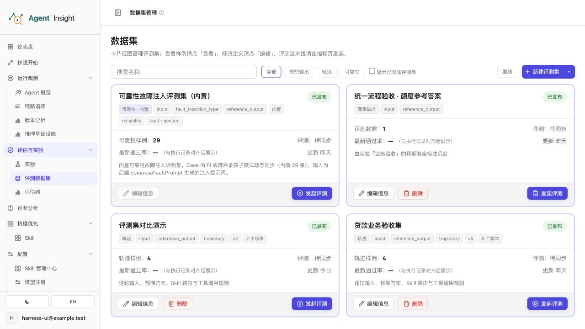

详细结果：[dataset-delete-evidence.json](dataset-delete-evidence.json)。
