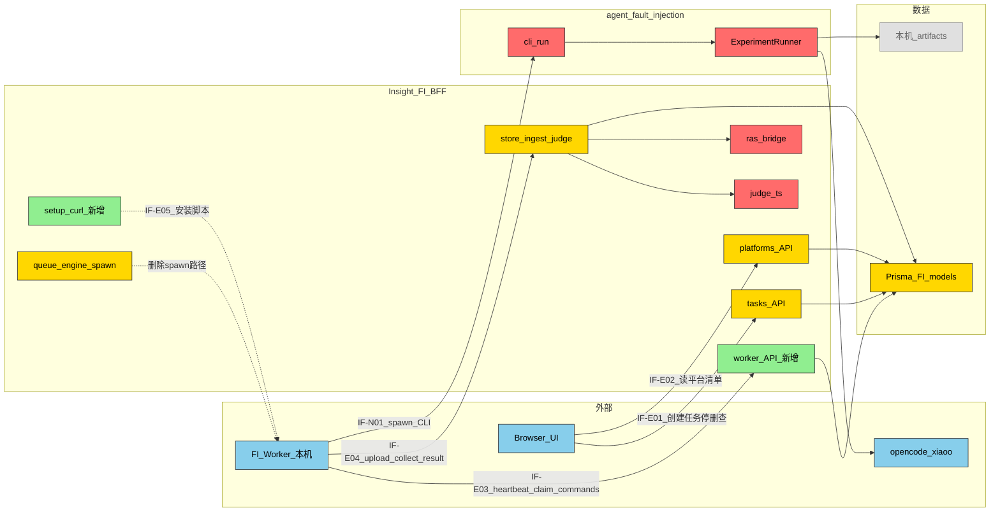
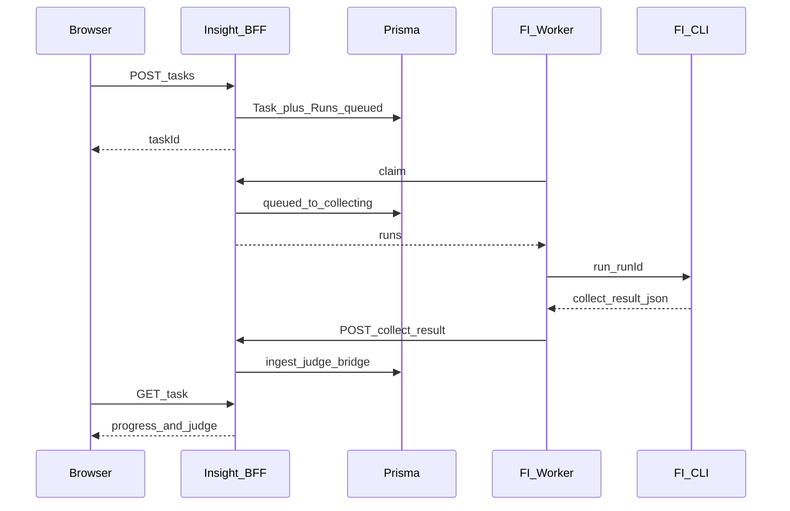
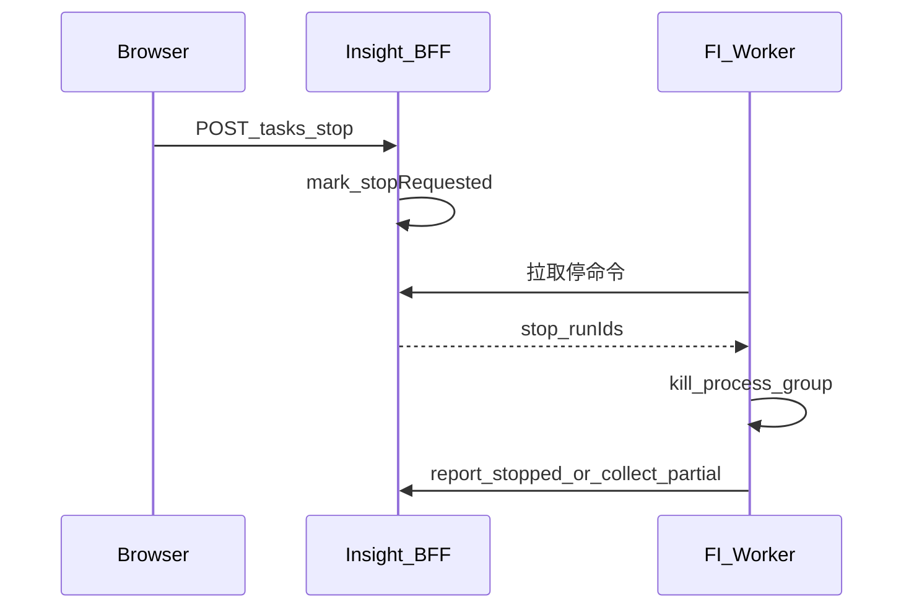
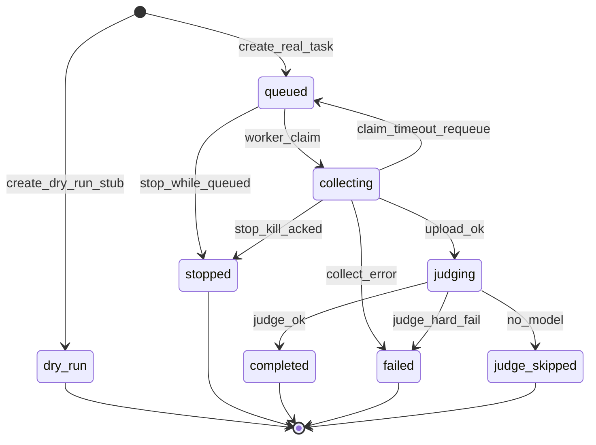

# Phase2：FI 服务端/客户端分离 — 需求设计

> 设计主文档（FI 读者入口同步）：[`docs/agent-fault-injection/designs/server-client-split.md`](../../agent-fault-injection/designs/server-client-split.md)  
> 需求输入：[`phase1-requirements-analysis.md`](./phase1-requirements-analysis.md)  
> 现状对照：[`ras-fi-insight-relationship.md`](../../agent-fault-injection/designs/ras-fi-insight-relationship.md)（Insight · RAS · FI 关系；旧「同机 spawn」已废弃）

## §1 设计概要

### 1.1 实现思路

将今日「Next 进程内队列 + `spawn` Python CLI」拆成：

1. **Insight Server（远程）**：Task/Run CRUD、排队元数据、Stop 意图、平台清单缓存、接收 `collect-result`、服务端 Judge、RAS bridge、UI。
2. **FI Worker（用户本机常驻）**：heartbeat / claim / 本地并发、调用现有 `python -m agent_fault_injection.cli run --run-id`、上传结果、响应 stop。
3. **安装器**：扩展 `install-fault-injection` + 新增 `/api/fault-injection/setup` curl 脚本，写入 `~/.agent-insight/fault-injection/config.json` 并启动 Worker。

控制流：UI 只写库；Worker 主动拉活。

### 1.1.1 数据存储对齐 agent-insight

| 层 | 位置 | 职责 |
|----|------|------|
| 权威业务数据 | 服务端 Prisma（默认 `~/.agent-insight/data/witty_insight.db`） | Task/Run/Session/Judge/`RasAnomalyEvent`；UI 只读此层 |
| 本机运行目录 | `~/.agent-insight/fault-injection/`（与 `ras/` 并列） | Worker config、workspace、artifacts；**不是**展示真源 |
| 旁路上报 | `POST .../collect-result` → `ingestCollectAndJudge` | 与现 Insight bridge 一致，不另起文件库 |

服务端不得假设能打开 `Run.artifactDir` 指向的本机路径。

### 1.2 设计决策

|编号|决策项|类别|内容|理由|
|-|-|-|-|-|
|D-001|彻底去掉服务端 spawn|架构|Next 不再调用 `queue.ts`→`engine.runCollector`；开发亦须本机 Worker（可与 Next 同机两进程）|与 Insight「远程服务 + 本机能力」及 agent-ras 一致；保留 spawn 会双路径漂移|
|D-002|短轮询 claim + DB 原子认领|技术|Worker `POST claim`；`status=queued` 条件更新为 `collecting` 并绑定 `workerId`；默认轮询间隔见配置|与现有 ingest HTTP/fail-open 风格一致；MVP 不引入 WS；SQLite/Prisma 条件更新足够防双领|
|D-003|Node Worker 包装 Python CLI|变更点|`scripts/fi-worker.js`（或等价）负责协议与进程；注入语义仍在 `agent_fault_injection/`|复用已验证 CLI；安装器与 `install-ras.js` 同为 Node；避免重写注入引擎|
|D-004|Workspace 仅本机解析|数据|服务端 **禁止** `os.homedir()` 展开并写入跨主机绝对路径；Task 存逻辑值（空 / 相对 / `~` 标记 / 用户显式绝对路径原文）；Worker 用本机 `workspaceBase` 解析后再传 CLI|现网 UI 留空时服务端写入服务器家目录，远程分离后主路径必错|
|D-005|Dry-run 留服务端零进程 stub|变更点|`dryRun:true` / `AGENT_INSIGHT_FI_DRY_RUN=1` 仍走现有 `buildStubCollectPayload` + `ingestCollectAndJudge`，**不**经 Worker、**不** spawn|满足 D-001；保留廉价联调/E2E；真实采集一律 Worker|

排除方案：

- **服务端保留 opt-in spawn**：双路径增加维护成本，易在远程部署误开。
- **浏览器直连本机 Worker**：破坏远程 UI、CORS/TLS 复杂，否决。
- **无常驻进程、仅按需拉起**：无法及时 claim/stop；FI 需要实验进程生命周期，不同于 RAS inproc。

## §2 架构设计

### 2.1 架构变更

#### 2.1.1 变更总览



#### 2.1.2 模块变更

|模块|变更|职责|接口|依赖|约束|
|-|-|-|-|-|-|
|`src/app/api/fault-injection/tasks*`|修改|只建库/改状态；dry-run 可同步 stub|IF-E01|Prisma、stub|真实路径禁止 `enqueue`/`runCollector`；workspace 不写服务端 homedir|
|`.../task/[taskId]/rerun`|修改|重排队为 `queued`，由 Worker claim|IF-E01|Prisma|删除同步 `runCollector`|
|`.../health`|修改|预检改「Worker online + inventory」|—|Worker 表|禁止再依赖服务端 `which` 冒充用户本机|
|`.../faults`|修改或保护|故障 catalog：**优先**服务端包内静态/Python（Insight 部署含 `agent_fault_injection/`）；失败则明确 502|—|包内 registry|不依赖用户本机 Python|
|`src/app/api/fault-injection/worker/*`|新增|heartbeat / claim / commands；顺带 claim 超时 sweep|IF-E03|Prisma Worker+Run|仅 apiKey 对应用户|
|`src/app/api/fault-injection/setup`|新增|curl 安装脚本|IF-E05|与 ingest setup 同风格|key 经 query，文档警示泄露|
|`src/app/api/fault-injection/platforms*`|修改|读 Worker inventory 缓存|IF-E02|FaultInjectionWorker|无在线 Worker → 503/空+引导，禁假目录|
|`src/lib/fault-injection/store.ts`|修改|暴露 ingest+judge；改 Task 聚合含 queued|IF-E04|judge / ras-bridge|见 §5.3|
|`src/lib/fault-injection/queue.ts`|删除或掏空|Next 侧队列泵|—|—|禁止残留 spawn 调用|
|`src/lib/fault-injection/engine.ts`|修改|Next **仅保留** `buildStubCollectPayload` + faults 列表所需最小面；`runCollector`/进程组杀 **迁出唯一归属** `scripts/fi-worker.js`（或 `src/lib/fault-injection/worker-runtime.ts` 只被 Worker 入口引用，不被 API import）|—|—|禁止双份 kill/artifact 逻辑|
|`scripts/install-fault-injection.js`|修改|解析 npm 包根 / 仓根；pip；写 config；`--start`；打印常驻说明|CLI|包内 `agent_fault_injection/`|MVP：前台/后台进程 + 文档 keep-alive；systemd user unit 作增强项|
|`scripts/fi-worker.js`|新增|轮询 + CLI 参数拼装 + 上传 + 本机 kill|IF-E03/E04|config.json|唯一进程管理实现|
|`agent_fault_injection` CLI/Runner|保护|注入与采集语义不变|IF-N01|platforms|claim 回包带齐 CLI 参数；`--run-id` 仅产物 ID|
|`judge.ts` / `ras-bridge.ts`|保护|评判与观测桥接不变|内部|—|仍仅服务端|

### 2.2 模块详情

#### 2.2.1 Insight FI BFF（任务与 Worker API）

- 负责职责：用户任务生命周期元数据、Worker 注册与认领、结果入库触发 Judge。
- 功能性设计：
  1. `POST /tasks`：写 Task + N 条 Run，`status=queued`（FR：任务下发在服务端）。
  2. `POST /worker/claim`：原子认领；`POST /worker/heartbeat`：续命 + inventory；**二者均须先执行服务端 claim 超时 sweep**（FR：本机能力、平台清单）。
  3. `POST /runs/:runId/collect-result`：ingest + judge + bridge（FR：数据显示与评判在服务端）。
  4. `POST /tasks/stop`：body 仍为 **`taskIds: string[]`**（兼容现网）；对目标 Task 下未终态 Run 置 `stopRequested=true`；已 `queued` 的直接标 `stopped`（不必等 Worker）；已 `collecting` 的保持 `collecting`+`stopRequested` 直至 Worker kill 后上报或超时（FR：可停止）。
  5. Dry-run：服务端 stub 入库，Task/Run 状态走现网 `dry_run`（D-005）。
- 非功能设计：
  1. 用户隔离：claim/upload 校验 `user`（NFR：安全）。
  2. claim 超时回收：**调度点固定为**每次 `heartbeat` 与 `claim` 入口的服务端 sweep（不依赖 Worker config 里的定时器单独跑）；规则见 §4.2（NFR：可靠性）。
- 风险与缓解：
  1. SQLite 并发写 → 单语句 `updateMany` where `status=queued`（见 §4.1）；单用户并行度默认小。
  2. Worker 失踪 → UI 显示「无在线 Worker」+ sweep 回收。

#### 2.2.2 FI Worker（本机）

- 负责职责：安装后的常驻编排器；不实现注入语义细节。
- 功能性设计：
  1. 循环：heartbeat → claim → 对每个 run 调 CLI → 上传 collect-result。
  2. 并行拉取 `commands`（或附带在 heartbeat/claim 响应）处理 stop。
  3. 本机探测 agents/models，经 heartbeat 上报。
- 非功能设计：
  1. 进程组杀与现 `killCollector` 行为对齐（NFR：可停止）。
  2. 网络失败 fail-open 重试上传，避免丢本地已写出的 collect-result（NFR：可靠性）。
- 风险与缓解：
  1. 用户未保持 Worker 运行 → UI 强提示 + health 展示 lastSeen。
  2. Python/依赖缺失 → install `--check` 与启动自检失败即退出非 0。

#### 2.2.3 安装器（curl + CLI）

- 负责职责：把 Worker + Python 包装到本机并写入 Insight 连接信息。
- 功能性设计：
  1. `curl -fsSL "$HOST/api/fault-injection/setup?key=..." | bash`。
  2. `npx agent-insight install-fault-injection [--check] [--start]`。
  3. 配置落盘 `~/.agent-insight/fault-injection/config.json`。
- 风险与缓解：远程无 monorepo 时从 **npm 包内 `agent_fault_injection/`** `pip install -e`（与 package.json `files` 已含该目录一致）；dev 用仓根路径。

### 2.3 功能影响

```text
- Agent Insight / 故障注入
  - 本机安装 FI Worker [新增]
  - 创建注入任务 [改：仅入队元数据，本机执行]
  - 选择 Agent/Model [改：依赖 Worker inventory]
  - 查看进度与轨迹 [保持服务端]
  - 停止任务 [改：服务端意图 + Worker 杀进程]
  - 服务端 Judge / 可靠性桥接 [保持]
```

|功能|变更|变更点|对应需求|
|-|-|-|-|
|本机安装|增|curl/CLI 安装 Worker|目标安装体验|
|任务执行|改|由 Worker claim 执行|服务端/客户端分离|
|平台枚举|改|heartbeat 缓存|远程服务可用|
|Stop|改|stopRequested + Worker kill|可用性|
|同机 spawn|删|移除 Next spawn|拓扑对齐|

## §3 核心流程

### 3.1 创建任务到结果展示



### 3.2 停止任务



### 3.3 Run 状态机



## §4 算法设计

### 4.1 原子 Claim

**目标**：多 Worker / 并发 claim 时同一 Run 只被一个 Worker 持有。

**核心逻辑**（禁止「先 SELECT 再按 runId 更新」的 TOCTOU 双领）：

```
REPEAT up to limit:
  -- 伪代码：在单事务内用「条件更新一行」表达租约
  candidate = 选一条 status=queued AND user=? AND stopRequested=false
               ORDER BY queuedAt ASC（实现可用 raw SQL UPDATE…RETURNING 或
               循环：updateMany where id=具体 id AND status=queued，count==1 才算领到）
  IF 领到:
    SET status=collecting, workerId=?, claimedAt=now()
    将该 Run 的执行参数加入响应
  ELSE break
```

Prisma/SQLite 落地：**必须**以 `updateMany({ where: { id, status: 'queued', user }, data: { status: 'collecting', … }})` 且 `count===1` 为成功判据；失败则换下一条。不得在无条件更新的窗口依赖先读后写。

**输入**：`workerId`、`user`（由 apiKey 解析）、`limit`

**输出**：认领成功的 Run 列表。每条 **必须** 含与现网 `runCollector` 等价的 CLI 参数：`runId, platform, agent, fault, submode?, prompt, model?, workspaceLogical, timeoutSeconds?, …`。Worker 在本机解析 `workspaceLogical` 后调用：

`python -m agent_fault_injection.cli run --run-id … --platform … --agent … --fault … --prompt … --workspace <resolved> …`

（`--run-id` **不是**唯一入参。）

**复杂度分析**：每轮最多 O(limit) 次条件更新；limit 受 `maxParallel` 约束。

**边界条件与异常处理**：

- `queued` 且 `stopRequested`：sweep/claim 直接标 `stopped`，不执行。
- Worker 持有中崩溃：见 §4.2。

### 4.2 Claim 超时 Sweep（服务端）

**目标**：避免 `collecting` 租约泄漏。

**触发**：每次 `POST /worker/heartbeat` 与 `POST /worker/claim` **开头**执行（同 user 范围即可）；不另建 MVP cron。

**规则**：

```
IF run.status=collecting
   AND (worker 不存在 OR worker.lastSeenAt < now - claimTimeoutSec
        OR claimedAt < now - claimTimeoutSec):
  IF stopRequested: status=stopped
  ELSE: status=queued, workerId=null, claimedAt=null  -- 允许其他 Worker 重试
```

`claimTimeoutSec` 为 **服务端**配置（环境变量 / 设置），Worker config 可镜像同名仅作展示，**回收以服务端为准**。

## §5 数据模型

### 5.1 FaultInjectionWorker（新增）

**描述**：每用户可有多个本机 Worker；inventory 供 UI 平台下拉。

**字段（契约）**：

|字段|类型|说明|
|-|-|-|
|workerId|String @unique|`fi-worker-<hostname>-<hex>`|
|user|String|apiKey 对应用户|
|hostname|String?|展示|
|version|String?|Worker/包版本|
|lastSeenAt|DateTime|心跳|
|inventoryJson|String|platforms/agents/models 快照|
|busySlots|Int?|可选|
|createdAt / updatedAt|DateTime|—|

### 5.2 FaultInjectionRun（扩展）

|字段|变更|说明|
|-|-|-|
|workerId|增|认领者|
|stopRequested|增 Boolean default false|Stop 意图|
|queuedAt|增 DateTime?|创建入队时间|
|claimedAt|增 DateTime?|认领时间|
|status|改语义|创建即为 `queued`；由 Worker 推进|

### 5.3 FaultInjectionTask.status 与 workspace

**Workspace 落库契约（D-004）**

| UI 输入 | 服务端写入 `Task.workspace` | Worker 行为 |
|-|-|-|
| 空 / 省略 / `~` 前缀| 固定逻辑标记 `__default__`（或空串），**禁止** `path.join(os.homedir(), …)` | 解析为 `config.workspaceBase`（本机） |
| 相对路径 | 原文保存 | `path.resolve(workspaceBase, relative)` |
| 绝对路径 | 原文保存（视为**用户本机**路径） | 原样传 CLI；不存在则失败并上报 |

存量：曾由服务端 homedir 写出的绝对路径，迁移脚本无法可靠映射到用户机 → 标 `__default__` 或任务详情提示「请编辑 workspace / 重新排队」。

**Task 聚合（须改 `refreshTaskProgress`，不能只扩枚举）**

| 条件 | Task.status |
|-|-|
| 任意 Run `collecting`/`judging` | `running` |
| 全部 Run ∈ 终态且含 `stopped`，且无失败优先策略冲突 | `stopped`（与现 stop 语义对齐） |
| 全部 `dry_run` | `dry_run` |
| 全部成功类终态（`completed`/`judge_skipped`/`dry_run` 按现逻辑） | `completed` 或 `dry_run` |
| 存在 `failed` | `failed`（保持现优先级） |
| 全部仍为 `queued`（尚无 claim） | **`queued`**（新增；现网写死 `running` 必须改掉） |

### 5.4 Stop 与 collect-result 竞态（硬规则）

1. Stop：对 `queued` → 立即 `stopped`；对 `collecting` → 只设 `stopRequested=true`，**暂不**改 `status`（避免与上传竞态）。
2. Worker 见 stop：杀进程组；若已有 partial `collect-result`，允许 `POST collect-result` 带 `stopped:true` / 非零 error；服务端将 Run 置 `stopped`（可保留已写入的 interactions，**不**跑成功态 Judge 绿灯）。
3. 若 upload 时 Run 已是 `stopped` 且无 partial 标志：返回 **409**，Worker 丢弃重传。
4. 若 kill 后无产物：Worker `POST` 进度/终态接口将 Run 标 `stopped`（可走 collect-result 空失败体或轻量 `POST .../status`）；MVP 允许复用 collect-result 含 `error=stopped by user`。

## §6 接口设计

### 6.1 外部接口

|名称|变更|描述|请求方式|请求参数|返回参数|错误码|
|-|-|-|-|-|-|-|
|IF-E01 POST /api/fault-injection/tasks|改|创建任务，只落库|POST|既有 body；不再触发 spawn|task|401/400|
|IF-E01b POST .../tasks/stop|改|stop 意图 / queued 立即 stopped|POST|**`taskIds: string[]`**（现网契约）|ok|401/404|
|IF-E02 GET .../platforms/:p/agents\|models|改|读 inventory 缓存|GET|platform|list|401；无 Worker：503 + message|
|IF-E03a POST .../worker/heartbeat|增|续命+inventory+**sweep**|POST|workerId, inventory, version|ok|401|
|IF-E03b POST .../worker/claim|增|sweep + 原子认领|POST|workerId, limit|runs[]（含完整 CLI 字段）|401|
|IF-E03c GET .../worker/commands|增|stop 等命令|GET|workerId|commands[]|401|
|IF-E04 POST .../runs/:runId/collect-result|增|上传采集结果并 judge（stopped/partial 见 §5.4）|POST|collect-result 兼容体|run|401/409|
|IF-E04b POST .../runs/:runId/progress|增（可选）|阶段进度|POST|message, percent?|ok|401|
|IF-E05 GET .../setup|增|返回 bash 安装脚本|GET|key=|text/x-shellscript|400|

鉴权：浏览器 session 或 `x-witty-api-key`（Worker 必须 apiKey）。

### 6.2 内部接口

|名称|变更|描述|调用方|提供方|请求参数|返回参数|
|-|-|-|-|-|-|-|
|IF-N01 CLI run（全参数）|复用|本机注入采集|Worker|agent_fault_injection|claim 回包字段 → argv|collect-result 路径|
|IF-R01 ingestCollectAndJudge|改签名可抽|入库+评判|collect-result / dry-run stub|store.ts|payload|run|
|IF-R02 maybeBridgeRasAnomaly|复用|观测桥接|store|ras-bridge|—|—|
|IF-R03 buildStubCollectPayload|复用|dry-run 零进程|tasks API|engine 残留最小面|task 元数据|stub payload|

### 6.3 配置接口

|名称|变更|描述|类型|默认值|取值范围|
|-|-|-|-|-|-|
|insightBaseUrl|增|Worker 连接的 Insight|string|安装时写入|URL|
|apiKey|增|用户密钥|string|安装时写入|—|
|workerId|增|Worker 标识|string|安装生成|—|
|maxParallel|增|本机并行 Run 数|number|`[[PH:fi_worker_max_parallel | rec:2 | why:对齐现网 AGENT_INSIGHT_FI_MAX_PARALLEL 默认]]`|≥1|
|pollIntervalMs|增|claim/heartbeat 周期|number|`[[PH:fi_poll_ms | rec:2000 | why:与现 UI 轮询量级同级、平衡及时性与负载]]`|≥500|
|AGENT_INSIGHT_FI_CLAIM_TIMEOUT_SEC|增|**服务端** collecting 回收阈值|number|`[[PH:fi_claim_timeout_sec | rec:300 | why:覆盖单次注入常见超时量级并留余量]]`|≥60|
|artifactsDir / workspaceBase|既有|**本机**产物与默认 workspace|path|`~/.agent-insight/fault-injection/...`|仅 Worker 展开 ~|

## §7 DFx 设计

### 7.1 可用性 / 可靠性

|故障/风险场景|触发|应对策略|取舍/决策|
|-|-|-|-|
|无 Worker / 离线|heartbeat 过期|UI 横幅 + health；任务保持 queued|不自动在服务端执行|
|Worker 中途崩溃|claim 后无进展|heartbeat/claim 入口 sweep 回 queued|优先可重试|
|上传失败|网络闪断|本地保留 artifact，指数退避重传|不丢已采集数据|
|Stop 延迟|轮询间隔|queued 立即 stopped；collecting 最多约一个 pollInterval|MVP 不用 WS|
|双 Worker 抢同一 Run|并发 claim|updateMany count===1|标准租约|
|跨机 workspace|服务端 homedir 旧逻辑|D-004 逻辑标记 + Worker 解析|主路径|
|用户注销后 Worker 停|无 daemon|安装结束打印「需保持 `fi-worker` 运行」；可选 nohup/后台；systemd 增强|MVP 不强制系统服务|

### 7.2 性能

|指标|目标值|模块分解|分解假设|备注|
|-|-|-|-|-|
|claim API P95|`[[PH:fi_claim_p95 | rec:≤200ms | why:元数据事务，应远快于注入本身]]`|Prisma 条件更新|单租户小并行|注入时长不计入|
|heartbeat 频率|见 pollIntervalMs|Worker|—|服务端只写一行 Worker|

**优化措施**：inventory 仅心跳携带；collect-result 体复用现压缩/大小实践，过大则后续再议分片（本设计不分片）。

### 7.3 安全性

|高风险项|类型|风险分析|应对策略|
|-|-|-|-|
|setup URL 含 apiKey|授权认证|与 ingest setup 同等泄露面|HTTPS、短时指引、文档警示、可轮换 key|
|Worker 越权 claim|授权认证|伪造 runId|始终按 apiKey→user 过滤；upload 校验 run.user|
|本机执行任意 prompt|依赖安全|注入实验本就跑本地 Agent|仅用户自己的 Worker；文档说明风险|

### 7.4 其他（可维护 / 可用 / 可测）

|目标|类型|应对策略|取舍/决策|
|-|-|-|-|
|单路径执行|可维护性|删除服务端 spawn，避免双实现|开发多一步启 Worker|
|安装心智对齐 RAS|易用性|curl + npx 双入口；UI 复制命令|Worker 需常驻，文案说清|
|E2E|可测试性|golden path：Next + Worker 双进程|废弃「仅 Next」E2E|
|版本漂移|可升级性|heartbeat 带 version；UI 可提示升级|MVP 可只展示|

## §8 附件

### 8.1 与 agent-ras 对照

| | agent-ras | FI（本设计） |
|--|-----------|--------------|
|安装 | install-ras / setup 勾选 | install-fault-injection + `/api/fault-injection/setup` |
|本机形态 | inproc 嵌入（可不常驻守护） | **常驻 Worker** |
|上报 | fail-open push 事件 | claim + collect-result + heartbeat |
|服务端 | 配置 / 观测 | 任务 / Judge / 观测 |
|不做 | 注入编排 | 检测与恢复 |

### 8.2 迁移

1. 发布前：文档与 UI 标明「需安装 FI Worker」。
2. DB：migration 加 Worker 表与 Run 字段；存量 `collecting` 且无 `workerId` 的 Run → 一次性标 `failed`（error=`legacy_server_spawn_obsolete`）或提供「重新排队」把 status 置 `queued`。
3. 删除/掏空 Next 侧 `enqueueFaultInjectionRuns` 调用点（tasks / rerun）。
4. E2E 改为双进程；`install-fault-injection --check` 纳入验收。

### 8.3 冻结区（本迭代禁止改语义）

- 故障 catalog 与 injection_method 含义（`fault-inject.md`）。
- Judge 二维 outcome×containment 契约。
- RAS bridge 的 `source=fault_injection` 与 dry-run 不写观测。

### 8.4 实现落点预告（非本阶段编码）

见开发计划 phase3（待设计确认后撰写）。关键路径：`src/lib/fault-injection/*`、`src/app/api/fault-injection/**`、`scripts/install-fault-injection.js`、`scripts/fi-worker.js`、`prisma/schema.prisma`。

### 8.5 评审修订记录（2026-08-05）

对照 [`review/design-feasibility-review.md`](./review/design-feasibility-review.md) **conditionally passed** 结论，已纳入：

- D-004 Workspace 本机解析；D-005 服务端 dry-run stub
- Claim 单语句租约 + 服务端 sweep 触发点（§4.1 / §4.2）
- Stop 竞态硬规则（§5.4）；`taskIds[]`；状态机含 `dry_run`；Task `queued` 聚合
- 模块表补 rerun / health / faults；IF-N01 全参数；engine 单一归属
- 安装常驻 MVP 预期（文档 keep-alive，systemd 增强）
