# Agent Insight 接入 Goal Plus：全流程与状态流设计

- 状态：详细设计
- 关联文档：[需求分析](phase1-requirements-analysis.md) · [接口与数据设计](phase2-requirements-design.md) · [开发计划](phase3-development-plan.md)
- 交互原型：[集成后高保真页面](agent-insight-goal-plus-hifi.html)
- 最后更新：2026-09-03

## 1. 阅读说明

本文专门回答“Agent Insight 修改后如何完整观察 Goal Plus”这一问题。图中的边界和颜色含义如下：

- **Goal Plus 边界**：仍负责目标拆解、候选运行、选择和结果固化，不承担观测平台职责。
- **Agent Insight 本地边界**：负责显式挂载、只读解析、被动导入、检查点、缓冲和上传。
- **Agent Insight 服务端边界**：负责幂等入库、关联、完整性计算和聚合查询。
- **Native trace**：Codex/Pi 原生执行事件；保留宿主自己的父子调用树。
- **Semantic snapshot**：来自 `.gp` 的 goal/run/candidate/selection 等权威状态快照。
- **Composite view**：查询时拼装出的 Goal Plus 编排视图，不制造新的伪 Execution 树。

## 2. 系统上下文与职责边界

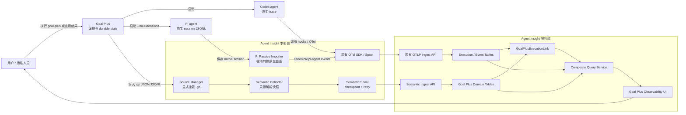

关键约束：Agent Insight **不注入** Goal Plus worker、不修改 `.gp`、不把 Goal Plus 伪装成第三种 agent framework；Goal Plus 只是编排覆盖层。

## 3. 部署拓扑与信任边界

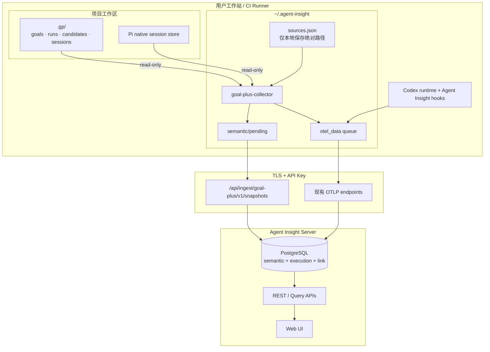

信任边界规则：

1. `.gp` 绝对路径不得上传；服务端只保存 `source_id`、可选标签和不可逆 workspace fingerprint。
2. collector 按现有 API key 隔离本地缓冲；文件内容按 `metadata-only`、`bounded`、`full` 策略裁剪。
3. 本地文件权限、符号链接和路径穿越必须在打开文件前校验；只允许读取已 attach 根目录及声明的 Pi session 文件。
4. 服务端不根据时间窗口猜测关联；证据不足时保留 `unresolved`。

## 4. 端到端主流程

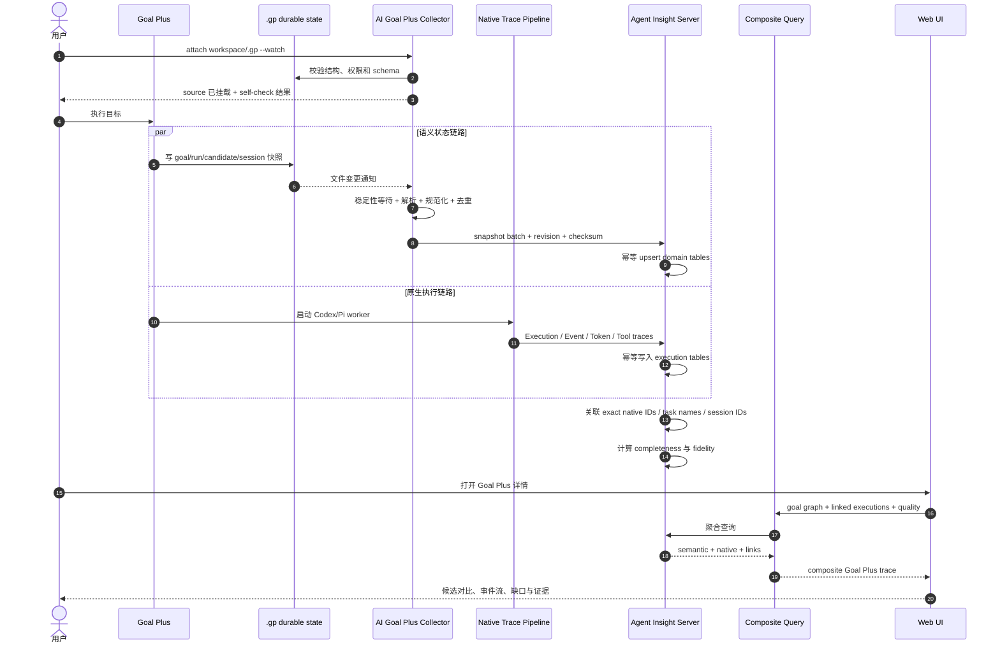

## 5. Source 挂载、扫描与监听流程

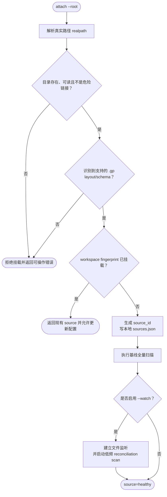

监听器只负责低延迟提示；周期 reconciliation scan 才是漏事件、编辑器原子替换和 collector 重启后的最终兜底。

## 6. Semantic snapshot 采集与幂等流程

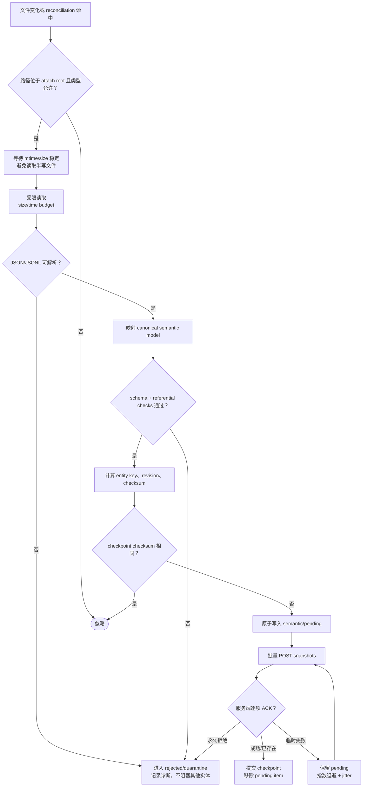

幂等键建议为 `tenant_id + source_id + entity_type + source_entity_id + revision`。同 revision 但 checksum 不同必须标记 source conflict，不能静默覆盖。

## 7. Codex 原生 trace 与关联流程

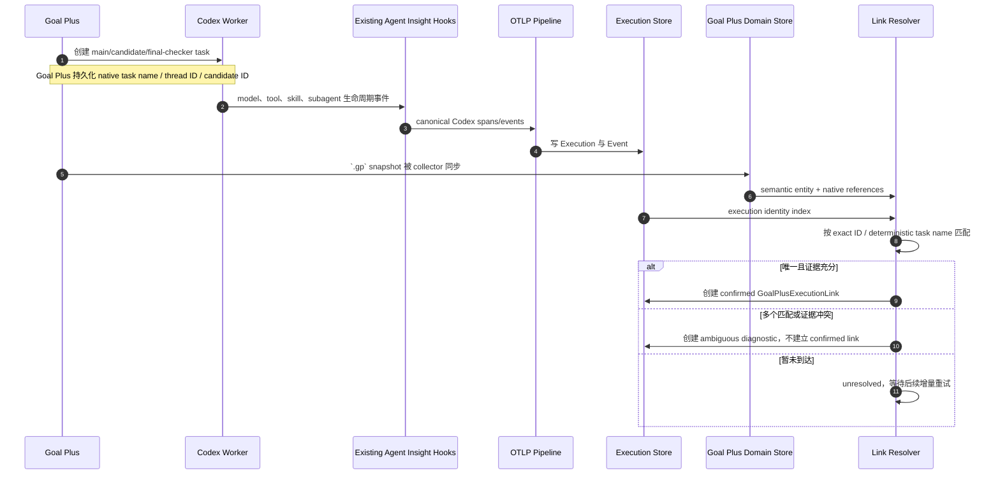

Codex 路径复用现有 hooks，Goal Plus 不需要额外注入 SDK。关联是服务端组合关系，不修改原生 Execution 的 `parent_execution_id`。

## 8. Pi `--no-extensions` 被动导入流程

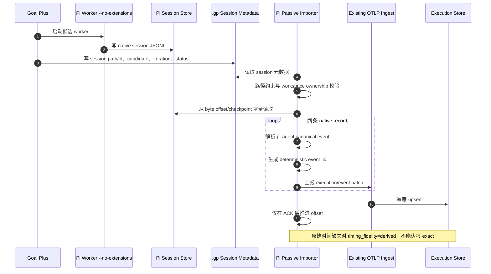

该流程保留 Goal Plus 对 worker 的隔离意图：不加载 extension、不修改启动参数，只消费 worker 已经保存的原生会话。

## 9. 关联判定流程

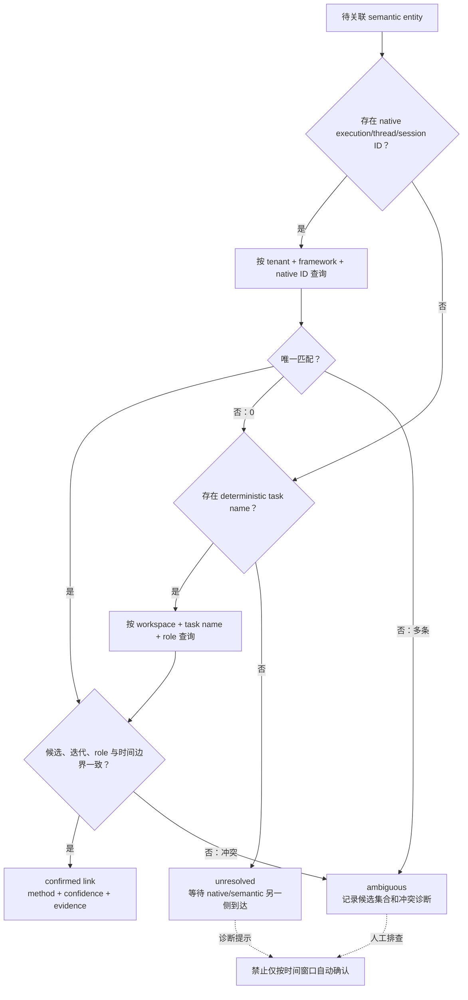

建议的证据优先级：native ID/session ID > Goal Plus 生成的 deterministic task name > 明确写入的 workspace/role/candidate 复合键。时间只能用于冲突校验和展示，不能独立生成 confirmed link。

## 10. 完整性与时间保真度状态机

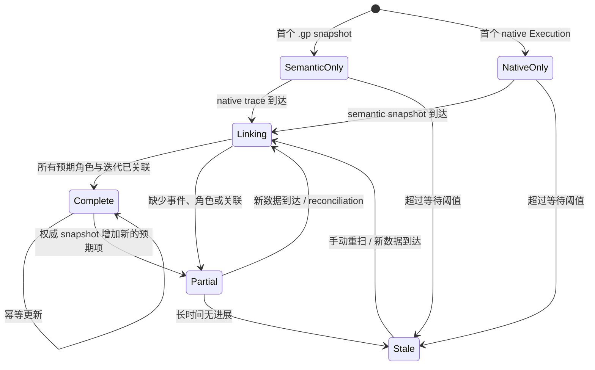

完整性计算不能只看“是否有 trace”。每个 Goal 需要分别计算：

```text
semantic_coverage = observed_semantic_entities / expected_semantic_entities
native_coverage   = linked_native_executions / expected_native_executions
event_coverage    = observed_required_event_categories / required_event_categories
link_coverage     = confirmed_links / expected_links

overall_completeness = weighted_min_or_policy(
  semantic_coverage,
  native_coverage,
  event_coverage,
  link_coverage
)
```

UI 同时显示独立的 fidelity：

| 维度 | 值 | 解释 |
|-|-|-|
| 时间 | `exact` / `mixed` / `derived` | native 记录是否带可靠时间；不得由完整性百分比掩盖 |
| 内容 | `full` / `bounded` / `metadata-only` | 由采集策略决定，不等同于数据缺失 |
| 关联 | `confirmed` / `ambiguous` / `unresolved` | 是否存在可审计证据 |
| 顺序 | `native` / `reconstructed` | 事件顺序来自原生序号还是导入时重建 |

## 11. 查询与界面渲染流程

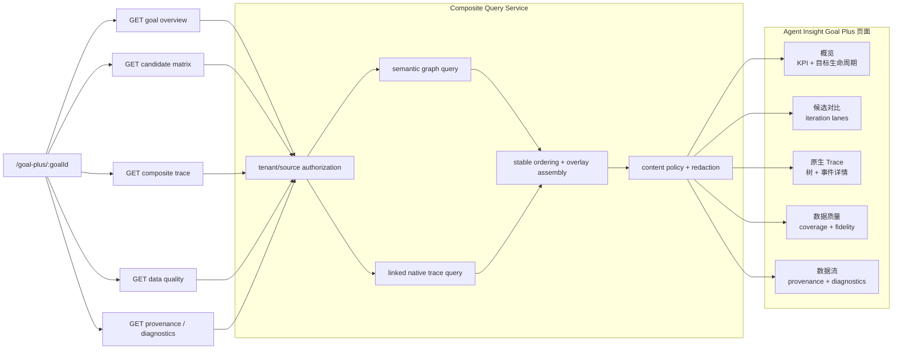

页面遵循渐进展开：默认先回答“Goal 是否成功、选了谁、为何选择、数据是否完整”；只有进入“原生 Trace”才展示模型调用、工具和 subagent 的细节。

## 12. 故障、重试与恢复流程

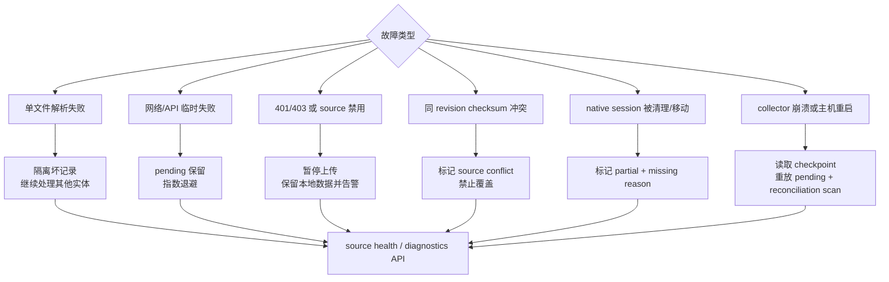

恢复设计遵循 at-least-once 上传和服务端幂等：checkpoint 只能在服务端 ACK 后推进；任何进程终止点都允许安全重放。

## 13. 页面交互状态流

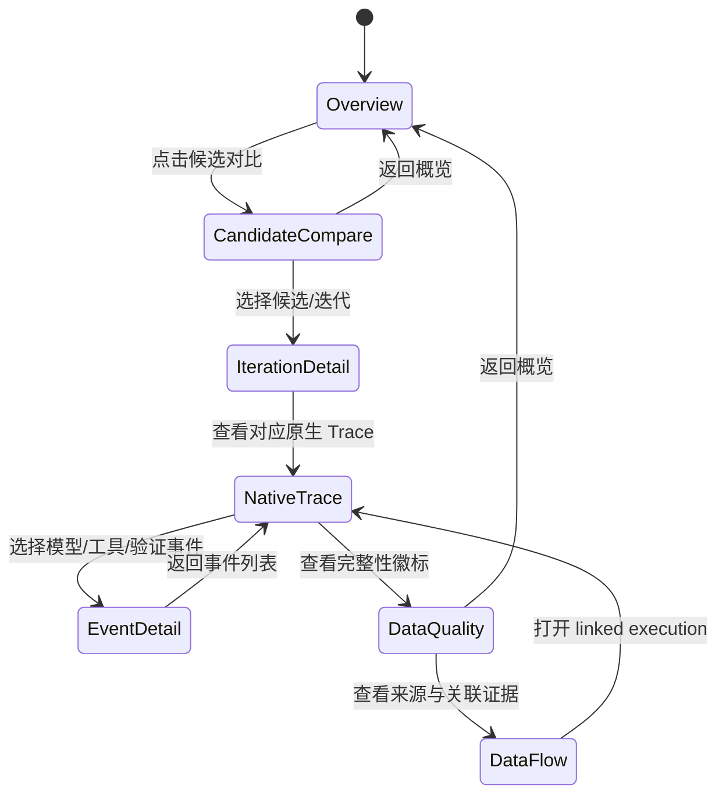

高保真原型实现了上述主路径中的标签切换、候选/迭代选择、Trace 节点选择和明暗主题切换；生产实现再接入真实 API、URL 路由和分页。

## 14. 开发完成后的端到端验收流

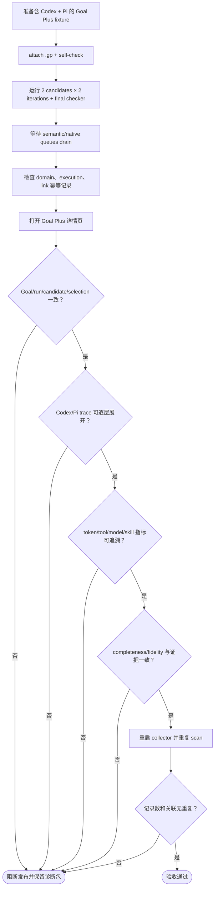

验收结论只有在语义链路、两种 native trace、关联证据、恢复幂等和 UI 解释性同时通过时，才能声明 Agent Insight “完整采集”本次 Goal Plus 执行。

## 15. 结论

该集成可以做到完整且可审计，但“完整”必须定义为两条链路的组合：

1. `.gp` 提供 Goal Plus 的编排语义真相；
2. Codex hooks 和 Pi passive importer 提供 agent 的原生执行真相；
3. link resolver 用强证据把两者连接起来；
4. completeness 与 fidelity 明确暴露缺口，不用推断数据冒充原生事实。

只采 `.gp` 无法还原所有模型、工具和 token 事件；只采 OTLP 又无法解释候选、迭代、选择和 promotion。以上双链路方案是 Agent Insight 接入 Goal Plus 后形成完整观测面的必要条件。
