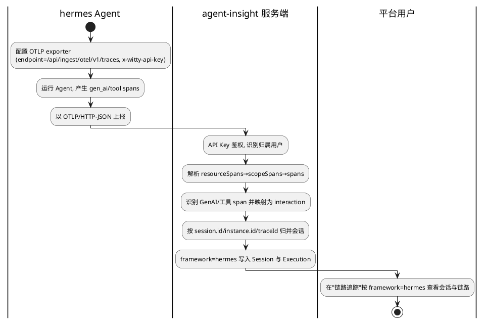

# Hermes 平台适配（OTel / OTLP 接入）— 需求分析规格（IR）
版本：v0.3
最后更新：2026-06-03 06:16:08

> 文档类型：Phase1 需求分析规格（IR）
> 关联项目：agent-insight
> 复杂度评估：**Medium**
> 版本：v0.2（已纳入 Phase1 评审修订）
> base_commit：c47829a（master_0530）
> 变更类型：新增能力（feature）
> 更新时间：2026-06-02
> 状态：评审条件通过 → 已修订

---

## §1 基本信息

### 1.1 项目背景

需求价值：agent-insight 的核心定位是「框架无关」的 Agent 观测/评测/Skill 优化工程底座，北向兼容多 Agent 运行时是其差异化竞争力；新增 hermes 适配可扩大可服务的 Agent 生态、兑现 README 中已对外宣称的「兼容 OpenCode、Hermes、OpenClaw」能力承诺。

需求描述：使运行在 **hermes** 平台上的 Agent 能够通过**标准 OpenTelemetry（OTel/OTLP）协议**将运行链路数据上报到 agent-insight，被正确解析、归并为会话并在观测看板呈现，框架标识为 `hermes`。本需求**是**「让 hermes 数据成为平台的一等观测对象」，**不是**为 hermes 编写专用侵入式插件（区别于 OpenCode 的插件模式），也**不**改变现有 OpenCode/Claude/OpenClaw 的接入行为。

### 1.2 结构化信息

|维度|内容|
|-|-|
|Who|hermes 平台的 Agent 开发者 / 运维者（数据生产侧）；agent-insight 平台使用者（观测/评测消费侧）|
|When|在 hermes Agent 运行时（产生 trace）与运行后（在 agent-insight 看板查看链路、发起评测）|
|What|hermes 以标准 OTLP 协议上报运行数据，平台正确接收、解析、按会话归并并标记 framework=hermes，呈现于链路追踪；数据天然可进入「从 Trace」评测流程|
|Why|兑现「框架无关、多平台兼容」的产品定位，降低新平台接入成本（走标准协议而非定制插件）|
|Where|hermes 运行环境（OTLP exporter 指向 agent-insight 端点）；agent-insight 自托管服务端（Next.js + Prisma/SQLite）|
|How Much|复用现有 `/api/ingest/otel/v1/traces`（HTTP/JSON）；上报鉴权沿用 `x-witty-api-key`；解析需兼容 GenAI 语义约定，对自定义属性提供映射兜底|
|How|hermes 侧配置 OTLP exporter（endpoint + api-key header）→ 运行 → 平台自动入库 → 用户在看板按 framework=hermes 检索查看|

---

## §2 核心能力

### 2.1 场景分析

**主成功场景**



|编号|路径|类别|触发|步骤|
|-|-|-|-|-|
|S-001|主成功|业务|hermes 上报有效 OTLP/JSON trace|exporter 配置→运行产生 span→上报→鉴权→解析→归并会话→入库→看板呈现 framework=hermes|
|S-002|扩展|业务|hermes 多次/分批上报同一会话的 span|平台按会话标识增量归并，去重（同 spanId 不重复），按时间戳排序，聚合 token/延迟|
|S-003|扩展|业务|hermes 会话含多 Agent / 子 Agent 调用|平台据 span 父子关系（parentSpanId）保留链路层级，正确归属主/子 Agent|
|S-004|备选|业务|hermes 未携带 `session.id`，仅有 `service.instance.id` 或 `traceId`|平台按既定优先级 session.id→instance.id→traceId 选择会话归并键|
|S-005|异常|业务|hermes 以 protobuf/gRPC 上报|平台明确返回不支持状态（当前 415）并给出可操作指引（改用 http/json），不静默丢弃|
|S-006|异常|安全|上报缺失或非法 API Key|平台拒绝并返回 401，数据不写入，不污染他人数据（确定性单一结果）|
|S-007|异常|业务|span 不含 GenAI/工具语义（非 LLM/工具调用）|平台跳过该 span，不产生噪声会话，不报错中断整批处理|
|S-008|异常|业务|hermes span 使用自定义属性命名（非标准 gen_ai.*）|平台经映射适配层尽力解析；无法识别字段时降级保留原始信息而非整条丢弃|
|S-009|异常|业务|上报体为畸形 JSON（缺 `resourceSpans`、截断、非法结构）|平台返回确定性 4xx（非 5xx），不写入部分损坏数据，错误信息可定位|
|S-010|异常|业务|单次上报体量超限（超大批量 span / 超大字段）|平台以确定性策略处理（拒绝并提示分批 / 截断超大字段并标注），不导致服务异常或内存膨胀|
|S-011|扩展|业务|hermes 多 Agent 运行（主 Agent + ≥1 子 Agent）上报|平台将该运行拆分为多条 Execution 记录并组成 agent 树（主 Agent 为根、子 Agent 挂其下），写入 parent/root/isSubagent 等身份字段，与 opencode 行为对齐；子 Agent 可在看板独立筛选、下钻、评测|
|S-012|扩展|业务|hermes（主 Agent 或子 Agent）调用/加载 skill|平台从 OTLP 数据抽取 skill 名与版本（含子 Agent 加载的 skill），写入 invokedSkills，使其进入评测/A-B/优化全链路|
|S-013|扩展|业务|hermes 某 agent 身份（主或子 Agent）首次被观测到|平台自动将其注册到 RegisteredAgent（platform=hermes，区分 main/subagent），使其在 Agent 注册表与相关筛选中可见|

### 2.2 业务规则

|编号|描述|原因|影响范围|
|-|-|-|-|
|BR-001|hermes 运行数据的 framework 标识必须可稳定区分为 `hermes`，不得与 opencode/claude/openclaw 混淆|多框架数据需可独立检索、统计、评测|观测看板、评测、统计|
|BR-002|同一会话内同一 spanId 的 interaction 必须去重；多批上报必须增量合并而非覆盖|OTLP 天然分批、可重试，需保证幂等|会话归并、token/延迟聚合|
|BR-003|缺失或非法 API Key 的上报，**必须拒绝并返回 401**，数据不得写入；禁止归入匿名或其他用户名下（确定性单一结果）|多租户数据隔离与安全，避免越权写入|鉴权、数据归属|
|BR-004|不支持的传输/编码（如 protobuf、gRPC）必须显式拒绝并返回可操作指引，禁止静默成功|避免用户误以为接入成功却查不到数据|接入体验、可诊断性|
|BR-006|畸形或超限上报体必须返回确定性 4xx，且不得写入部分损坏数据（要么整批成功、要么明确失败）|保证数据一致性与可诊断性|解析、入库|
|BR-005|新增 hermes 适配不得破坏现有 OpenCode/Claude/OpenClaw 的接入与解析行为（向后兼容）|存量框架接入不可回退|全部既有接入链路|
|BR-007|hermes 多 Agent 运行必须建模为多条 Execution 并组成树（parentExecutionId/rootExecutionId/isSubagent 等），语义与 opencode 对齐，不得塌缩为单条扁平记录|子 Agent 级别可观测/可评测是平台核心能力|入库、观测、评测、Agent 注册|
|BR-008|hermes 的 agent 身份（含子 Agent）首次被观测到时必须自动注册到 RegisteredAgent（platform=hermes，agentType 区分 main/subagent），同一 (platform,name,user) 不重复注册|Agent 注册表与筛选需识别 hermes agent|Agent 注册、筛选|
|BR-009|skill 调用的抽取必须覆盖主 Agent 与子 Agent 加载的 skill，并尽力带出版本；抽取结果写入 invokedSkills 供下游消费|Skill 为一等公民，评测/A-B/优化依赖 invokedSkills|Skill 抽取、评测、A-B、优化|

### 2.3 数据约束

|编号|类别|名称|描述|
|-|-|-|-|
|DC-001|String|framework|会话/执行记录的框架标识，hermes 场景取值为 `hermes`（来源于 OTLP `service.name` 或等价约定）|
|DC-002|String|会话归并键(taskId)|按 `session.id` → `service.instance.id` → `traceId` 优先级取值，非空，作为会话唯一归并依据|
|DC-003|Object|interaction|单次交互记录，至少含 spanId、parentSpanId、type(llm/tool)、model、usage(input/output/total tokens)、latency、timestamp|
|DC-004|String|apiKey|上报鉴权凭据，经 `x-witty-api-key` 头传入，用于解析归属用户|
|DC-005|Object|agent 身份|agent 树身份字段：agentName、agentType(main/subagent)、subagentType、agentSessionId、parentExecutionId、rootExecutionId、isSubagent；来源于 OTLP agent 身份语义契约|
|DC-006|Object|skill 调用|skill 标识：name(必填)、version(可空)；来源：工具型 span/属性约定（含子 Agent 加载场景）|
|DC-007|约定|OTLP agent/skill 语义契约|hermes 在 OTLP 中标识 agent 身份与 skill 调用的属性约定（如 agent 名/类型、skill 名/版本所在的 resource/span 属性键），需在设计阶段据真实样本定稿|

---

## §3 需求列表

### 3.1 功能性需求

|编号|类别|名称|描述|优先级|
|-|-|-|-|-|
|FR-001|接入|hermes OTLP/JSON 接入|hermes 可通过标准 OTLP/HTTP-JSON 将 trace 上报至平台并被成功接收与鉴权，最终在链路追踪看板以 framework=hermes 呈现|P0|
|FR-002|解析|GenAI/工具 span 解析与会话归并|平台正确解析 hermes 上报的 gen_ai/llm/tool span，映射为内部 interaction，按会话标识增量归并、去重、时序排序，并聚合 token 与延迟|P0|
|FR-003|标识|framework 稳定标记为 hermes|hermes 数据在 Session/Execution 中被稳定标记为 hermes，可在看板按框架检索与统计，且不与其他框架混淆|P0|
|FR-004|兼容|自定义属性映射兜底|当 hermes span 未严格遵循 GenAI 语义约定时，提供映射适配层尽力识别关键字段，无法识别时降级保留原始信息|P1|
|FR-005|多Agent|子 Agent 链路层级还原|当 hermes 会话含多/子 Agent 时，依据 span 父子关系还原链路层级与主/子 Agent 归属（链路图展示层）|P1|
|FR-006|接入引导|hermes 接入引导|在安装指导页/框架选择器中新增 hermes 选项，向用户提供 hermes 侧 OTLP exporter 的配置指引（endpoint 与 api-key）|P1|
|FR-007|可诊断|不支持编码的显式反馈|对 protobuf/gRPC 等暂不支持的上报，返回明确状态与改用 http/json 的指引|P2|
|FR-009|健壮性|畸形/超限上报处理|对畸形 JSON、缺失 resourceSpans、截断或超限上报体，返回确定性 4xx 并保证不写入部分损坏数据；超大字段按既定上限截断并标注|P1|
|FR-008|评测承接|hermes 会话可作为评测对象|hermes 上报形成的 Execution/会话（含子 Agent 维度）可进入「从 Trace」评测流程；主 Agent 与子 Agent 均可作为评测对象|P2|
|FR-010|多Agent|子 Agent 多 Execution 树建模|hermes 多 Agent 运行拆分为多条 Execution，写入 parentExecutionId/rootExecutionId/agentSessionId/subagentType/subagentName/isSubagent，组成与 opencode 对齐的 agent 树，支撑子 Agent 级筛选/下钻/聚合|P0|
|FR-011|注册|agent 自动注册|hermes 的主/子 Agent 身份首次被观测到时自动注册到 RegisteredAgent（platform=hermes，区分 main/subagent），可在 Agent 注册表与筛选中可见|P1|
|FR-012|Skill|skill 全链路一等解析|针对 hermes OTLP 形状专用解析 skill 调用，带出 skill 名与版本，覆盖子 Agent 加载的 skill，写入 invokedSkills 并打通评测/A-B/优化全链路|P0|
|FR-013|约定|OTLP agent/skill 语义契约|定义并对外说明 hermes 在 OTLP 中标识 agent 身份与 skill 调用的属性契约（agent 名/类型、skill 名/版本所在 span/resource 属性），作为 FR-010/011/012 解析依据|P0|

### 3.2 非功能性需求

|编号|类别|名称|描述|优先级|
|-|-|-|-|-|
|NFR-001|兼容性|存量框架零回退|hermes 适配上线后，OpenCode/Claude/OpenClaw 的接入、解析、看板呈现行为保持不变（既有用例全部通过）|P0|
|NFR-002|可靠性|上报幂等与容错|分批/重试上报，同 spanId 去重率 100%（最终 interaction 无重复）；单条异常 span 不导致整批 trace 处理失败（异常 span 跳过率 100%、其余正常入库）|P0|
|NFR-003|安全性|多租户数据隔离|hermes 数据按 API Key 正确归属用户；非法/缺失 Key 写入他人数据的发生率为 0（按 BR-003 拒绝）|P0|
|NFR-004|可扩展性|协议演进可扩展|架构需为未来支持 protobuf/gRPC OTLP 预留扩展点；新增一种编码不需改动核心解析/归并逻辑（仅新增解码适配）|P1|
|NFR-005|可维护性|新增框架低成本|hermes 适配尽量复用现有 OTLP 通路。可核验代理指标：再接入「下一个 OTLP 框架」≈ 新增 1 条 framework 常量 + 1 张映射表条目 + 1 个 skill extractor + 1 个 toOpencodeShape 适配，**0 处既有框架分支改动**（F4 据此核验）|P1|
|NFR-006|可观测性|接入可自检|对每次上报输出可定位的结构化日志（含会话归并键、命中 span 数、跳过原因、鉴权结果）；用户据此可自助判断「是否成功/为何未呈现」（具体日志字段待 Phase2 确认）|P2|
|NFR-007|一致性|子 Agent 建模与 opencode 等价|对语义等价的多 Agent 运行，hermes 产出的 agent 树结构（层级、parent/root 关系、main/subagent 归属）应与 opencode 等价，避免双口径|P1|

---

## §4 验收方案

### 4.1 验收准则

|编号|关联能力|维度|描述|验收标准|
|-|-|-|-|-|
|AC-001|S-001, FR-001|功能|hermes OTLP/JSON 端到端接入|hermes 以 http/json 上报有效 trace 后，链路追踪看板可检索到 framework=hermes 的会话，关键字段（model/token/延迟）非空且合理|
|AC-002|S-002, BR-002, NFR-002|功能|会话增量归并与幂等|对同一会话分 N 批上报（含重复 spanId），最终会话内 interaction 无重复、按时间排序，token/延迟聚合正确|
|AC-003|S-003, FR-005|功能|子 Agent 层级还原|含父子 span 的 hermes 会话，每个 interaction 的 parentSpanId 链与上报一致；子 Agent interaction 挂载于其父 span 之下；还原层级深度 = 上报层级深度；主/子 Agent 归属与上报一致|
|AC-004|S-005/S-006/S-007, BR-003/BR-004|功能|异常路径处理|protobuf/gRPC 上报返回 415 且含改用 http/json 指引；缺失/非法 Key 返回 401 且不写入任何数据；非 GenAI span 被 100% 跳过且不中断整批|
|AC-005|BR-005, NFR-001|兼容|存量框架不回退|hermes 上线后，OpenCode/Claude/OpenClaw 既有接入回归用例全部通过|
|AC-006|FR-006|功能|接入引导可用|框架选择器出现 hermes 选项；选择后输出含 endpoint + x-witty-api-key 的可复制配置；按该配置上报一次后，看板在 ≤1 次刷新内出现对应 framework=hermes 会话|
|AC-007|NFR-003|安全|数据隔离|不同用户 API Key 上报的 hermes 数据互不可见、互不污染|
|AC-008|S-008, FR-004|功能|自定义属性映射兜底|上报含非标准 gen_ai.* 命名的 span，关键字段（model/token/tool 名）经映射被识别填充；未识别字段降级保留原始信息（原始属性可见）而非整条丢弃|
|AC-009|S-009/S-010, BR-006, FR-009|健壮性|畸形/超限上报|畸形/缺 resourceSpans/截断上报体返回确定性 4xx（非 5xx）且无部分写入；超大字段被按上限截断并标注，服务不崩溃|
|AC-010|FR-008|功能|评测承接|hermes 入库的 Execution（主 Agent 与子 Agent）在「从 Trace」评测入口均可被检索、选中并成功发起评测|
|AC-011|S-011, FR-010, BR-007, NFR-007|功能|子 Agent 多 Execution 树|含 1 主 + M 子 Agent 的 hermes 运行上报后，生成 1+M 条 Execution；子 Agent 行 isSubagent=true 且 parentExecutionId/rootExecutionId 链与运行结构一致；可按 rootExecutionId 聚合、可在看板筛选/下钻子 Agent；与等价 opencode 运行的树结构一致|
|AC-012|S-013, FR-011, BR-008|功能|agent 自动注册|hermes 主/子 Agent 首次上报后自动出现在 RegisteredAgent（platform=hermes，agentType 正确）；重复上报不产生重复注册|
|AC-013|S-012, FR-012, BR-009|功能|skill 全链路解析|hermes 主 Agent 与子 Agent 加载的 skill 均被抽取入 invokedSkills（带版本，若上报含版本）；该会话在 Skill 诊断/路由评测中显示「实际调用 skill」非空；可进入 A-B/优化|

### 4.2 测试用例

|编号|关联准则|前置条件|操作步骤|预期结果（量化指标/判断条件）|
|-|-|-|-|-|
|TC-001|AC-001|平台运行、已获取有效 API Key|hermes 配置 http/json exporter 指向 traces 端点并运行一次含 LLM 调用的任务|看板出现 1 条 framework=hermes 会话，含 model、token>0、latency>0|
|TC-002|AC-002|同 TC-001|将同一会话 spans 拆为 3 批（其中 1 批含重复 spanId）依次上报|最终会话 interaction 数=去重后实际数；按 timestamp 升序；token/延迟为各 interaction 之和|
|TC-003|AC-003|hermes 任务含 1 主 Agent + ≥1 子 Agent（已知层级深度 D）|上报含 parentSpanId 关联的 spans|还原链路深度 = D；每个子 interaction 的 parentSpanId 与上报一致；主/子 Agent 归属与上报一致|
|TC-004|AC-004|平台运行|分别以 protobuf 上报 / 缺失 API Key 上报 / 上报纯非 GenAI span|protobuf 返回 415 且含改用 http/json 指引；缺 Key 返回 401 且无任何写入；非 GenAI span 被跳过、其余 span 正常入库|
|TC-005|AC-005|OpenCode/Claude/OpenClaw 既有接入用例|执行存量框架回归用例|全部通过，无行为差异|
|TC-006|AC-007|两个不同用户各自 API Key|两用户分别上报 hermes 数据|用户 A 看板不可见用户 B 的 hermes 会话，反之亦然|
|TC-007|AC-008|平台运行|上报 span 的关键字段采用非标准命名（如自定义 model/token/tool 属性键）|model/token/tool 名经映射被识别；未识别字段原样保留可见；该 span 不被整条丢弃|
|TC-008|AC-009|平台运行|分别上报：缺 resourceSpans 的 JSON / 截断 JSON / 含超大字段的 span|前两者返回 4xx 且无写入；超大字段被截断并标注，服务无 5xx、无崩溃|
|TC-009|AC-010|已有 ≥1 条 hermes Execution（含子 Agent）入库|进入「从 Trace」评测入口检索并选中 hermes 主/子 Agent 会话发起评测|主、子 Agent 均可检索、选中、成功评测|
|TC-010|AC-011|hermes 运行含 1 主 + M 子 Agent（已知结构）|按语义契约上报含 agent 身份标记的 spans|生成 1+M 条 Execution；子 Agent isSubagent=true、parent/root 链正确；按 rootExecutionId 聚合得到全树；看板可筛选/下钻子 Agent；与等价 opencode 运行树结构一致|
|TC-011|AC-012|平台运行|首次上报 hermes 主+子 Agent；随后重复上报相同 agent|首次后 RegisteredAgent 出现 platform=hermes 的 main 与 subagent 记录；重复上报无重复行|
|TC-012|AC-013|hermes 运行主 Agent 调 skillA、子 Agent 加载 skillB（带版本）|按语义契约上报|invokedSkills 含 skillA、skillB 及版本；Skill 诊断/路由评测显示实际调用非空；可发起 A-B/优化|

### 4.3 交付物定义

|交付物|描述|
|-|-|
|hermes OTLP 接入能力|后端解析/归并/标识对 hermes 的支持（复用并必要扩展现有 OTLP 通路）|
|hermes 接入引导|安装指导页/框架选择器中的 hermes 选项与配置说明|
|hermes 接入文档|hermes 侧 OTLP exporter 配置指南（endpoint、鉴权、语义约定要求）|
|回归与新增测试|覆盖上述验收准则的测试用例|
|子 Agent 多 Execution 树能力|hermes 多 Agent 运行拆多条 Execution + agent 树（与 opencode 对齐）|
|agent 自动注册能力|hermes 主/子 Agent 自动注册 RegisteredAgent|
|skill 全链路解析能力|hermes OTLP skill 抽取（含版本与子 Agent 加载）+ 下游打通|
|OTLP agent/skill 语义契约文档|hermes 标识 agent 身份与 skill 调用的属性约定|

---

## §5 附录

### 5.1 用户记录

#### 5.1.1 初始描述

```text
帮我设计一个需求：
1. 当前的项目是 agent-insight，北向是兼容多个 agent 平台的能力，当前是适配了 opencode，
   现在的目标是适配 hermes；
2. hermes 通过标准的协议 OpenTelemetry (OTel / OTLP) 来接入。
你帮我基于我的需求设计下设计文档。
```

#### 5.1.2 澄清

```text
针对 4 个边界问题（适配深度 / OTLP 编码 / span 语义约定 / 是否提供接入引导）发起了确认弹窗，
用户未在弹窗中作出选择。设计方按以下默认假设推进（待用户确认）：
- 适配深度：观测/链路追踪为本期核心(P0)；评测随 Execution 入库基本可承接(P1/P2)；Skill 优化为未来。
- OTLP 编码：HTTP/JSON 为主路径（复用现有端点）；protobuf/gRPC 仅做可扩展性设计，非本期实现。
- span 语义：假设遵循/可配置 GenAI 语义约定；方案内置「样本采集 + 映射规约」兜底自定义属性。
- 接入引导：提供（框架选择器 + 安装指导页新增 hermes），对齐其他框架。
```

```text
Phase1 独立 reviewer 评审：条件通过（84/100，0 ERROR / 5 WARNING / 1 INFO）。已据评审意见修订：
- W-1：NFR-002/003/004/006 补充量化指标；NFR-005/006 无基线项显式标注「待 Phase2 确认」。
- W-2：新增 S-009/S-010（畸形/超限上报）及 FR-009、BR-006、AC-009/TC-008。
- W-3：FR-004 补 AC-008/TC-007；S-008 纳入 AC-008；FR-008 补 AC-010/TC-009。
- W-4：BR-003/S-006 收敛为单一确定性结果（缺失/非法 Key → 401 拒绝、不写入）。
- W-5：AC-003/AC-006 改为可量化判定，TC-003/TC-006 同步明确预期。
- I-1：§1 补充 version / base_commit / 变更类型 / 更新时间 元数据。
```

```text
Refine 变更（用户聚焦 skill / subagent 数据上报解析）：用户确认「子 Agent 与 opencode 完全对齐、
skill 全链路一等公民、立即补全文档」。本次新增：
- 子 Agent：S-011、BR-007、FR-010、DC-005、AC-011/TC-010、NFR-007（多 Execution 树建模，对齐 opencode
  的 deriveSubagentExecutions/parentExecutionId/rootExecutionId/isSubagent/subagentType）。
- agent 注册：S-013、BR-008、FR-011、AC-012/TC-011（RegisteredAgent 自动注册）。
- skill：S-012、BR-009、FR-012、DC-006、AC-013/TC-012（OTLP 形状专用解析 + 版本 + 子 Agent 加载 skill，
  打通评测/A-B/优化）；FR-008/AC-010 扩展至子 Agent 维度评测。
- 语义契约：DC-007、FR-013（hermes 在 OTLP 标识 agent 身份与 skill 调用的属性约定，据真实样本定稿）。
依据代码：deriveSubagentExecutions 受 framework==='opencode' 门限（data-service.ts:1937）、
OTLP 路径不传 agent 树字段（traces/route.ts:194-205）、各框架 skill extractor 形状不同
（interaction-utils.ts:55-178）、RegisteredAgent 自动注册（data-service.ts:1801-1842）。
```

### 5.2 关键现状（代码依据，便于后续设计追溯）

- 已存在 OTLP 接入端点：`src/app/api/ingest/otel/v1/traces/route.ts`（另有 logs / metrics）。
- `Execution.framework` 取自 OTLP `service.name`（route.ts:198），故 hermes 框架标识可由 `service.name=hermes` 驱动。
- 当前 traces 端点仅支持 `application/json`，`application/x-protobuf` 返回 415（route.ts:45-47）；无 gRPC 服务端。
- 会话归并键优先级：`session.id` → `service.instance.id` → `traceId`（route.ts:144-151）。
- Claude Code 已采用「仅配置环境变量把官方 OTel 指向平台端点」的零插件接入方式，是 hermes 最接近的参照模板。
- 框架选择器当前枚举：opencode / claude / openclaw（`src/app/api/ingest/setup/route.ts`），新增 hermes 需在此扩展。

## 变更记录（合成文档）

| 版本 | 内容 |
|-|-|
| v0.1 | Phase1/2/3 三阶段初稿，各自通过独立 reviewer 闸门（P1 84 条件通过→修订；P2 73 条件通过→修订；P3 Pass）|
| v0.2 | 可行性验证修订：rejudge 第二处 switch 统一化、framework 兜底澄清、缺 resourceSpans 确定性 400、并发幂等定稿、setup 四副本+共享常量 |
| v0.3 | **refine：skill / subagent 一等公民**——新增 FR-010/011/012/013、NFR-007、BR-007/008/009、AC-011/012/013、D-004/D-005、§2.2.4/2.2.5、IF-N05、任务 T007~T010 与 T004 升级 |
| v0.3.1（本合成） | 据代码二次核对修正两处 ERROR：①`extractObservedAgentRegistrations` 实为 `agent-registration.ts:14` 框架无关函数（不加分支、靠标记自动注册）；②`buildAgentCallTree` 无 parentSpanId 能力，改为「适配层把 hermes 整形为 opencode 同构 interaction，建树/派生/注册函数零改动」。同步收敛冻结区与任务边界（T008 整形为关键、T009 仅解 :1937 门、T010 多半零改、T006 纯 UI 消费）|

> 注：本文件为三阶段 + refine + 代码核对修正的**合成终稿**，取代此前的分阶段草稿与 .refine 副本。
