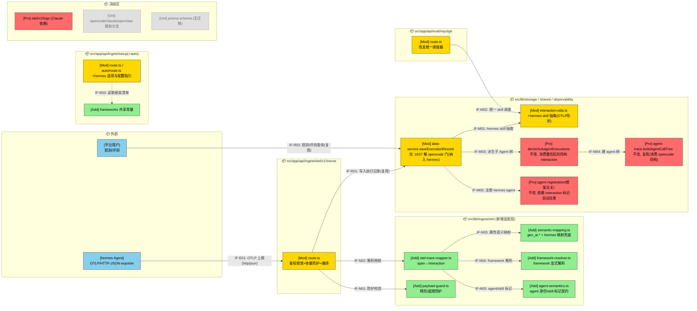
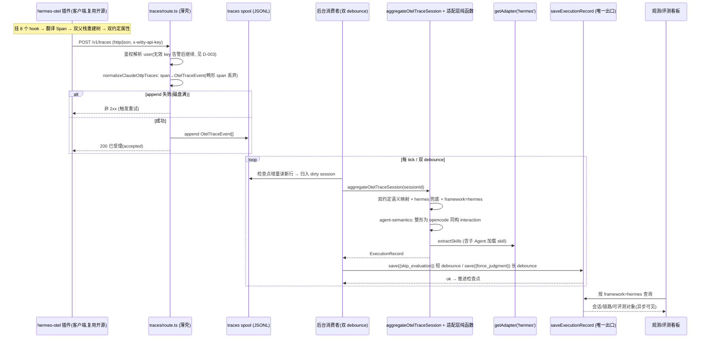
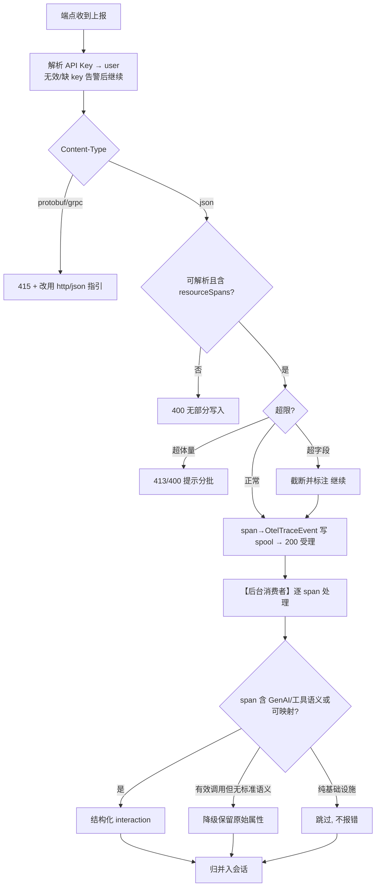

# Hermes 平台适配（OTel / OTLP 接入）— 需求设计规格
版本：v0.4
最后更新：2026-06-09

> 文档类型：Phase2 需求设计规格
> 关联项目：agent-insight ｜ 关联 Phase1：[phase1-requirements-analysis.md](phase1-requirements-analysis.md)
> 复杂度评估：**Medium**
> base_commit：d72f05e（master）
> 更新时间：2026-06-09
> 状态：Phase2 评审条件通过 → 已修订 → **v0.4 refine（补客户端插件 + 对齐同批两线目标架构）**
> 关联设计（同批未开发，须兼容）：
> - [`otel-spool-consumer`](../otel-spool-consumer/) —— **接收/处理解耦**：traces 端点退化为薄壳（写 spool 即 200），聚合/落库/评估移到后台消费者。hermes 的 span→interaction 映射须落在其 `traces-aggregator.ts`，**不再内联在 route**。
> - [`framework-adapter-registry`](../framework-adapter-registry/) —— **转换层查表**：`getAdapter(framework)`，dispatcher 缩为 `getAdapter(fw).extractSkills?.(n) ?? null`，**禁 per-framework 裸分支**。hermes 的 skill 抽取/整形挂为 `hermes.ts` adapter，框架清单合并为单一 `listFrameworks()`。
>
> **v0.4 关键修订**：① 补「客户端插件」一层（复用开源 `briancaffey/hermes-otel`，配 `otlp` 后端指向平台）——这是 v0.3 完全缺失的上游适配器；② 服务端解析下沉到 spool-consumer 的 traces-aggregator + registry 的 hermes adapter，撤销「改 route 内联编排 + 401 收敛 + dispatcher 分支」的旧路径；③ 详见新增 §2.0 三线分层架构与 §8.4 兼容性附件。

---

## §1 设计概要

### 1.1 实现思路

总体策略：**双层适配器夹一个标准中间层**——上游用社区插件让 hermes 吐出标准 OTLP，下游复用平台既有 OTLP 通路并整形为内部模型（Session + Execution），**零数据库迁移**。服务端落在同批 `otel-spool-consumer` 的接收管线与 `framework-adapter-registry` 的转换查表上。

0. **客户端插件（上游适配器，v0.4 新增）**：hermes 内核不支持 OTel，**复用开源 `briancaffey/hermes-otel` 插件**——它以纯观察者身份挂 hermes 的 8 个 hook，把私有事件流翻译为 OTel Span/Metric、用「双父栈 + 合成根 Span」重建父子嵌套，并以 OTLP/HTTP exporter 导出。接入 = 把它的下游配成一个**通用 `otlp` 后端**：`endpoint=…/api/ingest/otel/v1/traces`、`headers: x-witty-api-key`、`service.name=hermes`。**平台侧不写客户端代码**，仅产出配置规约（FR-014）。它默认发 **OpenInference + OTel GenAI 双约定**属性（`llm.token_count.*` 与 `gen_ai.usage.*` 并存），这是服务端语义映射的输入事实。
1. **接入通路（薄壳，对齐 spool-consumer）**：复用端点 `POST /api/ingest/otel/v1/traces`（根重写自 `/v1/traces`，`next.config.ts:23`）。在 spool-consumer 目标态下，traces 端点**退化为薄壳**：`span→OtelTraceEvent 归一化→写 traces spool→200（受理语义）`，**不在请求内落库**。hermes 不改这一壳层，只是它的数据流经此壳。
2. **框架标识**：`framework` 由 OTLP `service.name` 驱动且 **`framework=serviceName` 是 spool-consumer 红线 R-2**（保 `{task_id,framework}` 去重键不被击穿）。要求插件配 `service.name=hermes`；服务端在 framework 解析处提供「缺失 service.name 不静默落 unknown」的兜底告警（修正现状落 `unknown-service`）。
3. **适配层抽象（下沉到 aggregator，对齐 spool-consumer）**：把 span→interaction 映射、双约定语义解析 + hermes 兜底、framework 解析、体量/畸形防护，实现为**纯函数模块**，由后台消费者的 **`aggregateOtelTraceSession`（traces-aggregator）调用**——而非 v0.3 设想的「route 内联编排」。模块仍放 `src/lib/ingest/otel/`（纯函数、无 DB I/O），但**调用方从 route 改为 traces-aggregator**。落库仍是唯一出口 `saveExecutionRecord`。
4. **下游打通（走 registry，对齐 framework-adapter-registry）**：skill 抽取**不再在 dispatcher 加 `fw==='hermes'` 裸分支**，而是把 `extractSkillsWithVersionsFromHermesSession` 挂为 **`adapters/hermes.ts` 的 `extractSkills`**；dispatcher 缩为 `getAdapter(fw).extractSkills?.(n) ?? null`；`rejudge/route.ts` 同走该 dispatcher（补回 openclaw）。子 Agent 整形（toOpencodeShape）作为 hermes adapter 的能力（registry 预留的 `capabilities.subagentTree` / `deriveExecutionFields` 扩展点）。`saveExecutionRecord` 仍**仅在 `:1937` 解 `framework==='opencode'` 门处纳入 hermes**。
5. **接入引导（plugin 模式）**：框架选择器/安装脚本新增 hermes，接入方式标记 `onboard:'plugin'`，输出**hermes-otel 插件安装步骤 + `otlp` 后端配置块**（非 Claude 那种「仅配置 env」）；框架清单与 registry 的 `listFrameworks()` **合并为单一出处**（消除 `frameworks.ts` 与 registry 各搞一套）。

### 1.2 设计决策

|编号|决策项|类别|内容|理由|
|-|-|-|-|-|
|D-001|复用 OTLP traces 端点、零 schema 迁移|架构/数据|不新建端点、不改库表；`framework` 维持自由字符串，hermes 记录经既有 Session/Execution 入库，看板框架筛选项动态从数据派生（`Dashboard.tsx:2370`）自动出现|改动面最小、向后兼容最强；新增框架天然可被观测与统计（验证已确认无硬编码白名单拦截）|
|D-002|引入可单测的 OTLP 适配层（Adapter）|架构/设计模式|将 span→interaction 映射、语义映射、framework 解析、体量防护实现为纯函数模块（`src/lib/ingest/otel/`）。**v0.4 修正调用方**：由后台消费者的 `aggregateOtelTraceSession`（traces-aggregator）调用，**不再由 route 编排**（spool-consumer 把 route 退化为薄壳）|纯函数适配层为「下一个框架」提供低成本扩展点（NFR-004/005）、满足可测试性；调用点落在 spool-consumer 的 transformation 层，与同批架构一致|
|D-003|**（v0.4 修订）traces 端点鉴权语义对齐 spool-consumer，401 收敛降级为「后续轮」**|安全/兼容|spool-consumer 明确 traces 端点本轮**维持现状鉴权语义**（无效 key 告警后继续、不阻塞落 spool，其 S-010/§7.3），因端点已退化为薄壳、请求内不再落库，原「401 收敛 + 不写入」的破坏性变更**与薄壳模型冲突**。本设计**撤销 v0.3 的 D-003 强收敛**，改为：①user 仍按 key 解析、归属正确（多租户隔离的实质由 `{user}` 归属 + 后台聚合保证）；②「缺/非法 key 一律 401 拒绝」作为**收敛项留到 spool-consumer 后续轮统一处理**（避免两线对端点鉴权各改一套）。BR-003/NFR-003 的「不越权写入」改由「user 归属正确 + 不落 anonymous」达成，强 401 拒绝**降级为 P2/后续**|两线同批，端点壳层归 spool-consumer 管，hermes 线不应单独把它改成「请求内 401 + 落库」；强行收敛会与薄壳/异步落库相矛盾。安全实质（正确归属、不污染他人）仍满足，仅「主动 401 拒绝匿名」延后|
|D-004|**适配层把 hermes 整形为 opencode 同构 interaction**，复用既有 agent 树管线（不改建树/派生函数）|架构/数据|关键澄清（据代码核实）：`buildAgentCallTree`（`agent-trace.ts:207`）**完全基于 opencode 语义**——`tool_calls[name='task']`、`subagent_type`、`subagent_session_id`、`role`，**无 parentSpanId 处理**。因此 hermes 不是「让建树读 OTLP」，而是由 `agent-semantics` 把 OTLP（parentSpanId + agent 身份属性）**整形为 opencode 同构 interaction 字段**，再原样喂给 `buildAgentCallTree` 与 `deriveSubagentExecutions`（`:2006`）。本期**唯一需改的存量点**：解除 `saveExecutionRecord` 中 `deriveSubagentExecutions` 的 `framework==='opencode'` 门限（`data-service.ts:1937`），纳入 hermes|满足 NFR-007「与 opencode 等价」；建树/派生**零改动**（仅整形 + 解门限），冻结区更干净、风险更低；避免实现者误改建树去读 parentSpanId|
|D-005|定义 OTLP「agent 身份 / skill 调用」语义契约，适配层统一产出标记|约定/数据|新增 `agent-semantics.ts`：把 hermes 的 agent 名/类型/父子关系、skill 名/版本（含子 Agent 加载）从 OTLP resource/span 属性解析为内部标记，写入 interaction（如 `agentName/agentType/subagentName/agentSessionId`、`toolCall.name='skill'` + 解析后的 skill/version），供建树与 skill 抽取共同消费。**v0.4：契约的左列「hermes OTLP 来源」以 hermes-otel 插件实际发出的属性为准**（OpenInference/OTel GenAI + 其 agent/session span 命名），由 T001 采真实样本定稿|FR-013：建树(FR-010)、注册(FR-011)、skill(FR-012) 三者依赖同一份身份契约；契约据真实样本(T001)定稿，数据化可演进|
|D-006|**客户端复用开源 `hermes-otel` 插件，平台不自研客户端**|架构/接入|hermes 的「产出 OTLP」由社区插件 `briancaffey/hermes-otel` 承担（纯观察者挂 hook、重建 Span 树、双约定属性、OTLP 导出）。平台侧交付物只有「插件安装 + `otlp` 后端配置规约」（FR-014），把 endpoint/key/`service.name` 指向平台|hermes 内核无 OTel，必须有插件；社区插件已实现核心难点（跨线程双父栈、合成根 Span、双语义约定），自研是重复造轮；复用使接入≈纯配置，且随上游演进|
|D-007|**服务端落在 `otel-spool-consumer` 接收管线**（薄壳端点→spool→后台消费者→`aggregateOtelTraceSession`→`saveExecutionRecord`）|架构/兼容|hermes 的 span→interaction 映射实现为纯函数，由 traces-aggregator 在后台消费者内调用；端点只负责 `normalizeClaudeOtlpTraces→OtelTraceEvent→写 spool→200`。**红线**：`framework=serviceName`（=hermes）不可变，保 `{task_id,framework}` 去重键（spool-consumer R-2）|两线同批；若 hermes 仍按 v0.3 改 route 内联落库，会与 spool-consumer「删除 route 内全部同步落库」正面冲突。下沉到 aggregator 后两线天然协作|
|D-008|**下游打通走 `framework-adapter-registry` 查表，禁 per-framework 裸分支**|架构/兼容|hermes 的 `extractSkills` 与子 Agent 整形/派生字段挂为 `adapters/hermes.ts`（registry 的 `extractSkills?` + 预留 `capabilities.subagentTree`/`deriveExecutionFields` 扩展点）；dispatcher 缩为 `getAdapter(fw).extractSkills?.(n) ?? null`；框架清单合并为单一 `listFrameworks()`（hermes descriptor `onboard:'plugin'`）|registry 红线禁新增 `framework==='x'` 裸分支、且 §3 已点名两线框架清单要合并。hermes 作为 adapter 注册即「下一个框架低成本接入」NFR-005 的活样板|

---

## §2 架构设计

### 2.0 三线分层目标架构（v0.4 新增——必读）

hermes 接入是**双层适配器夹标准中间层**，且服务端落在同批两条线的目标架构上。整体分四层：

```
┌─ 客户端（hermes 进程内）─────────────────────────────────────────────┐
│  hermes 内核(8 hook) ──▶ [hermes-otel 插件: 复用开源 briancaffey/hermes-otel]   │
│     纯观察者挂 hook → 翻译为 OTel Span → 双父栈重建父子树 → 合成根 Span        │
│     → 双约定属性(OpenInference + OTel GenAI) → OTLP/HTTP exporter             │
│  接入 = 配一个通用 otlp 后端: endpoint=/v1/traces, x-witty-api-key,           │
│         service.name=hermes  （平台不写客户端代码，仅给配置规约 FR-014）       │
└───────────────────────────────┬─────────────────────────────────────┘
                                 │ OTLP/HTTP-JSON 上报
┌─ 服务端·接收层（otel-spool-consumer 线）──────────────────────────────┐
│  [薄壳 traces/route.ts]  span→OtelTraceEvent 归一化 → 写 traces spool → 200   │
│                          （请求内不落库；framework=serviceName=hermes 红线）   │
│  [后台消费者 loop]  检查点增量发现 dirty session → 调 aggregate → 双 debounce  │
└───────────────────────────────┬─────────────────────────────────────┘
                                 │ aggregateOtelTraceSession(sessionId)
┌─ 服务端·转换层（本设计 hermes 适配 + framework-adapter-registry 线）────┐
│  [traces-aggregator]  OtelTraceEvent[] → interaction[]                       │
│     ├─ 本设计纯函数: semantic-mapping(双约定+hermes兜底) / framework-resolver  │
│     │                / payload-guard / agent-semantics(toOpencodeShape 整形)  │
│     └─ getAdapter('hermes'): extractSkills + capabilities.subagentTree        │
│  → ExecutionRecord（framework=hermes，整形为 opencode 同构 interaction）       │
└───────────────────────────────┬─────────────────────────────────────┘
                                 │ saveExecutionRecord（唯一落库出口）
┌─ 服务端·落库/复用层（存量，仅解 1 处门限）────────────────────────────┐
│  saveExecutionRecord → 解 :1937 opencode 门纳入 hermes →                      │
│  buildAgentCallTree / deriveSubagentExecutions / extractObservedAgentRegistrations │
│  （函数体零改动，消费整形后的 opencode 同构 interaction）                      │
└─────────────────────────────────────────────────────────────────────┘
```

**三线职责切分（互不重叠）**：

| 关注点 | 归属线 | hermes 线在此做什么 |
|-|-|-|
| 产出 OTLP（客户端） | **本设计（复用 hermes-otel）** | 配置 `otlp` 后端 + 写接入规约，零客户端代码 |
| 何时何地处理（薄壳端点/后台 loop/检查点/spool） | `otel-spool-consumer` | **不碰**；hermes 数据流经其管线 |
| 怎么查表转换（getAdapter/dispatcher/listFrameworks） | `framework-adapter-registry` | 注册 `adapters/hermes.ts`（extractSkills + 整形能力），合并框架清单 |
| hermes 专有的 span→interaction 语义/整形 | **本设计** | 纯函数模块，由 traces-aggregator 调用 |

> **落地次序建议**：spool-consumer 的 traces-aggregator 骨架 + registry 的 `getAdapter` 先到位，hermes 把自己的纯函数「插」进 aggregator、把 adapter「注册」进 registry。三线可并行，但 hermes 的服务端集成依赖前两者的接口骨架（见 Phase3 依赖与 §8.4）。

### 2.1 架构变更

> **【v0.4 阅读提示】** 下面 §2.1.1 的 mermaid 与 §2.1.2 模块表保留 v0.3 的「数据转换逻辑视图」，但在 spool-consumer 目标态下有两处语义已变，以本节为准：
> - **route 不再编排/落库**：`traces/route.ts` 退化为薄壳（归一化→写 spool→200）。原图中 `R1` 的「编排 + 调 saveExecutionRecord」职责**移到后台消费者 + traces-aggregator**；适配层（AD1~AD5）的**调用方从 route 改为 `aggregateOtelTraceSession`**。
> - **skill 走 registry**：原图 `S1→S2` 的「dispatcher 加 hermes 分支」改为「dispatcher 调 `getAdapter('hermes').extractSkills`」，hermes 抽取函数挂在 `adapters/hermes.ts`。
> - **鉴权**：原图/表中「鉴权收敛 401」按 D-003（v0.4）撤销，端点鉴权语义归 spool-consumer。

#### 2.1.1 变更总览

> 图例：🔵外部 🟢新增 🟡修改 🔴保护(被调用但本期禁止改) ⚪不涉及。接口命名 IF-{E外部/N新内部/M改内部/R复用内部}{编号}。



#### 2.1.2 模块变更

|模块|变更|职责|接口|依赖|约束|
|-|-|-|-|-|-|
|`src/lib/ingest/otel/`（新增适配层）|新增|OTLP span→内部 interaction 映射、语义映射兜底、framework 解析、skill 抽取、体量/畸形防护、**agent 身份/skill 标记契约（agent-semantics.ts）**|IF-N01~N05（内部纯函数）|无新增运行时依赖（纯 TS）|纯函数、无副作用，便于单测；不得直接访问 DB|
|`.../ingest/otel/v1/traces/route.ts`|修改|**（v0.4 改：退薄壳，见 §2.0/D-007）** span→OtelTraceEvent→写 spool→200 受理；~~鉴权收敛 401~~（撤销，D-003）；~~调用适配层/saveExecutionRecord~~（移到 traces-aggregator）|IF-E01|spool（spool-consumer 线）|禁止改 `/v1/logs`、`/v1/metrics`；不内联落库/不收敛 401|
|`src/lib/shared/interaction-utils.ts`|修改|新增 `extractSkillsWithVersionsFromHermesSession`（hermes 工具/skill 抽取函数）|IF-M01|—|既有 opencode/claude/openclaw 抽取函数**冻结**，仅新增函数|
|`src/lib/storage/data-service.ts::extractInvokedSkillsFromSessionInteractions`（调度器，:476-492）|修改|在统一调度器中新增 `fw==='hermes'` 分支，调用 interaction-utils 的 hermes 抽取函数（未知框架现返回 `null`）|IF-M01|interaction-utils|仅新增分支；既有 opencode/claude/openclaw 分支冻结。**与同文件的 `saveExecutionRecord`（保护）为不同函数，须分别对待**|
|`src/app/api/eval/rejudge/route.ts`（:60-66）|修改|将内联 framework switch 改为调用统一调度器 `extractInvokedSkillsFromSessionInteractions`|IF-M02|data-service 调度器|行为对既有框架保持等价（**含补回当前遗漏的 openclaw**）|
|`src/app/api/ingest/setup/route.ts` + `setup/auto/route.ts`|修改|框架选择器/安装逻辑加入 hermes（配置指引块，非插件下载）|IF-R03|frameworks 常量|bash+PS、setup+auto 四副本必须一致|
|~~`src/lib/ingest/frameworks.ts`（共享常量）~~|**（v0.4 取消，见 D-008）**|框架清单**并入 registry 的 `listFrameworks()`**（单一出处，hermes descriptor `onboard:'plugin'`）|—|adapters/registry|不另建第二份框架清单|
|`src/lib/storage/data-service.ts::saveExecutionRecord`|修改|**唯一存量改动点**：解除 `deriveSubagentExecutions` 的 `framework==='opencode'` 门限（:1937），纳入 hermes；并经统一调度器抽 skill|IF-R01 / IF-M03 / IF-M05|deriveSubagentExecutions、调度器|**仅改 :1937 门限判断；opencode/claude/openclaw 既有路径行为零变更**|
|`src/lib/storage/data-service.ts::deriveSubagentExecutions`（:2006-2112）|保护/复用|**不改**。被纳入 hermes 后，消费「整形为 opencode 同构」的 interaction，产出多条 Execution（parent/root/isSubagent/subagentType/subagentName/agentSessionId）|IF-M03|buildAgentCallTree|函数体不动；hermes 同构 interaction 由 agent-semantics 整形产出|
|`src/lib/engine/observability/agent-trace.ts::buildAgentCallTree`（:207）/`inferSubagentType`|保护/复用|**不改**。完全基于 opencode 语义（`tool_calls[name=task]`/`subagent_type`/`subagent_session_id`/`role`，无 parentSpanId）；hermes 由适配层整形为同构 interaction 后原样复用|IF-M04|agent-semantics 整形输出|**禁止改其读 parentSpanId**；如需最小防御扩展须保 opencode 输入/输出不变|
|`src/lib/engine/observability/agent-registration.ts::extractObservedAgentRegistrations`（:14，由 data-service:1801-1842 调用）|保护/复用|**框架无关、本期多半不改**。从 interaction 的 `agent/subagent_name/role` 读取并注册；hermes 只要 interaction 携带这些标记即自动注册（platform 来自调用处）|IF-M05|agent-semantics 整形输出|无 per-framework 分支可改；如需也仅泛化 role 判定接纳 hermes 标记；去重沿用 (platform,name,user)|
|`otel/v1/logs`、`prisma/schema.prisma`、既有框架分支|不涉及/保护|—|—|—|显式防止误改；**无 DB 迁移（agent 树/注册字段已存在）**|

### 2.2 模块详情

#### 2.2.0 客户端插件接入（上游适配器，v0.4 新增；复用开源、非平台代码）

- 负责职责：让 hermes 产出标准 OTLP——这是 v0.3 完全缺失的一层。**平台不实现客户端代码**，仅交付「复用 + 配置」规约（FR-014）。
- 功能性设计（复用 `briancaffey/hermes-otel`，理解其工作机制即可正确配置/排障）：
  1. **发现与注册**：插件置于 hermes 约定目录 `~/.hermes/plugins/hermes_otel/`，靠 `plugin.yaml` 的 `provides_hooks` 声明能力；`register(ctx)` 里先 `tracer.init()` 决定后端、再 `ctx.register_hook` 挂回调（未配置后端则零注册、零开销）。
  2. **hook→Span 翻译**：`pre_*` 开 Span 写输入侧属性并压父栈，`post_*` 结束 Span 写输出侧（token/耗时/结果）并弹栈；`pre/post` 间靠 key 关联（如 `{tool_name}:{task_id}`）。
  3. **Span 树重建（难点，插件已实现）**：hermes 跨线程派发 hook，用「双父栈（按 session_id 的共享 dict 主栈 + ContextVar 兜底）」保证跨线程父子不断裂；对「`on_session_start` 仅首轮触发」用**合成根 Span**补根（`hermes.session.synthesized=true`）。
  4. **双语义约定**：同一 token 同时写 OpenInference（`llm.token_count.*`、`openinference.span.kind`）与 OTel GenAI（`gen_ai.usage.*`）——**这是服务端 semantic-mapping 必须同时认两套 key 的根因**。
  5. **接入配置（平台交付物）**：把插件下游配成一个**通用 `otlp` 后端**：
     - `endpoint = https://<平台>/api/ingest/otel/v1/traces`（或根重写 `/v1/traces`）
     - `headers = { "x-witty-api-key": "<用户 key>" }`（hermes-otel 的通用 `otlp` resolver 支持透传任意 headers）
     - resource 属性 `service.name = hermes`（驱动 `framework=hermes`，spool-consumer R-2 红线）
     - 协议 `OTEL_EXPORTER_OTLP_PROTOCOL = http/protobuf` 或 `http/json`（与服务端支持的编码一致；当前服务端仅 json，见 FR-007）
     - 隐私/采样开关按需（`capture_previews`、`sample_rate` 等）
- 非功能设计：
  1. **零侵入、可独立演进**：纯观察者，不改 hermes 内核；平台不 fork、不维护客户端代码，随上游升级。
  2. **属性事实即契约输入**：插件实际发出的属性（双约定 + 其 agent/session span 命名）是服务端 FR-013 语义契约左列的**唯一事实来源**，由 T001 采样定稿，不臆造。
- 风险与缓解：
  1. 插件默认命名与服务端「标准 gen_ai.*」假设有差异（尤其 OpenInference 那套）→ 服务端 semantic-mapping 同时认两套 key + 映射表兜底 + 降级保留；T001 校准。
  2. 协议不匹配（插件默认可能 protobuf）→ 接入规约显式要求 `http/json`（或服务端补 protobuf 解码，本期 415 拒绝 + 指引，FR-007）。
  3. skill 版本 / agent.type 等平台关心字段，插件未必显式发出 → 先以「降级保留 + 父子推断」兜底；若 T001 证实缺失影响 FR-012/010，再评估**最小 fork** 补属性（本期默认不 fork，见 Phase1 决策「先复用，缺口再 fork」的延后选项）。

#### 2.2.1 OTLP 适配层 `src/lib/ingest/otel/`（纯函数，由 traces-aggregator 调用）

- 负责职责：把 hermes（及通用）OTLP trace 安全、确定性地转换为内部 interaction 列表与会话元信息，吸收平台差异。
- 功能性设计：
  1. `payload-guard.ts`：上报前/解析时校验——体量上限（max-bytes）、`resourceSpans` 缺失/为空 → 确定性 400（修正当前缺失 resourceSpans 返回 200-空写的问题）；超大字段（如 `tool.arguments`）按上限截断并标注 `_truncated`。
  2. `semantic-mapping.ts`：标准 `gen_ai.*`/`llm.*`/`tool.name` 解析，叠加 hermes 自定义属性映射表；命中 GenAI/工具语义 → 结构化 interaction；**未命中标准语义但属于有效调用 span 的，按降级策略保留原始属性**（满足 S-008「保留原始而非整条丢弃」，修正当前 `isGenAI/isTool` 门会静默丢弃的问题）。
  3. `framework-resolver.ts`：显式解析 framework——优先 `service.name`；缺失时按既定兜底（如 scope/instrumentation 名或专用资源属性）判定，且对 hermes 提供「必须 service.name=hermes」的契约校验与告警，不静默落为 `unknown-service`。
  4. `otel-trace-mapper.ts`：编排 1–3，输出 `{interactions[], taskId, framework, user, sessionMeta, stats}`；会话归并键沿用 `session.id → service.instance.id → traceId` 优先级。**v0.4：本编排函数由后台消费者的 `aggregateOtelTraceSession` 调用**（消费 traces spool 的 `OtelTraceEvent[]`），不再由 route 调用。**畸形/缺 resourceSpans 的确定性拒绝**前移到薄壳端点的 `normalizeClaudeOtlpTraces` 归一化阶段（写 spool 前），适配层只处理「已落 spool 的有效事件」。
- 非功能设计：
  1. 纯函数、无 I/O，便于单测（覆盖标准/自定义/畸形/超限/缺失字段路径）。
  2. 映射表数据化、可扩展，新增框架仅加映射条目（NFR-004/005）；映射表可由 registry 的 hermes adapter 持有。
  3. **接入可观测（NFR-006 落点，v0.4 改落点）**：结构化日志在**两处**产生——薄壳端点记 `{authResult, spanTotal, acceptedToSpool, httpCode}`（受理侧）；后台消费者/aggregator 记 `{taskId(会话归并键), framework, mappedCount, skippedCount, skipReasons[], degradedCount, truncatedFields[], saved}`（处理侧）。适配层以返回值（`stats`，非日志副作用）回传计数，由调用方统一记录，保证纯函数可测。用户据此自助判断「是否成功 / 为何未呈现」。
- 风险与缓解：
  1. hermes 真实属性命名未知 → 以映射表 + 降级保留兜底；**交付前需采集一条真实 hermes trace 校准映射表**（列为前置任务）。
  2. 降级保留可能引入噪声 → 仅对「有效调用 span」降级，纯基础设施 span 仍跳过。

#### 2.2.2 会话归并与幂等（v0.4：由 spool-consumer 管线保证，hermes 不再自建并发锁）

- 负责职责：将分批/重试的 hermes span 增量归并入同一会话，保证去重与聚合正确。
- 功能性设计：
  1. 复用既有「按 spanId 去重、按 timestamp 排序、token/latency 聚合」逻辑（在 traces-aggregator 内）。
- 非功能设计（**v0.4 改为依赖 spool-consumer，撤销 v0.3 自建串行锁**）：
  1. **并发幂等由 spool-consumer 三重机制保证**，hermes 线**不再实现「同 taskId 串行键互斥」**（那是 v0.3 在「route 内 read-modify-write」假设下的方案，已被薄壳/异步管线取代）：
     - **不丢**：检查点（checkpoint）按 spool 文件行游标增量消费，崩溃后从游标续处理（spool-consumer FR-004/BR-004a）。
     - **不重**：聚合期 `dedupeEvents`（按 spanId）+ 落库 `saveExecutionRecord` 的 `{task_id, framework}` upsert + 单调 merge interactions（data-service.ts:1487/1656）双重兜底。
     - **写盘原子性**：端点 `appendFileSync` 顺序追加 spool，半行容错由 checkpoint「只跨以 `\n` 结尾的整行推进」处理。
  2. **hermes 的唯一对接义务**：保证其 `framework=hermes`（=`service.name`）稳定，使 `{task_id, framework}` 去重键不被击穿（spool-consumer R-2 红线）。
- 风险与缓解：
  1. 多实例部署时检查点/单例 loop 失效——spool-consumer 已登记为「本轮单进程、多实例守卫后续」，hermes 沿用同一边界，不另立方案。
  2. 若 spool-consumer 尚未落地而 hermes 先行：回退到「route 内直接调 aggregateOtelTraceSession + saveExecutionRecord」的临时同步路径（与现状 traces/route 一致），但**必须在 spool-consumer 落地后切回薄壳**，不得固化同步落库（避免与同批架构分叉）。

#### 2.2.3 下游 Skill 抽取统一化（v0.4：经 framework-adapter-registry，禁 dispatcher 裸分支）

- 负责职责：让 hermes 会话在评测/rejudge 中可正确提取 invokedSkills（一等公民）。
- 功能性设计（**v0.4 改为注册 adapter，不在 dispatcher 加 `fw==='hermes'`**）：
  1. 新增 hermes 抽取纯函数 `extractSkillsWithVersionsFromHermesSession`（仍可放 `interaction-utils.ts` 或 `adapters/hermes.ts`）：解析 **OTLP 形状**（`interaction.toolCall:{name,arguments(字符串)}`，与 opencode `tool_calls[]`、claude/openclaw content block 均不同）；`toolCall.name∈{skill,load_skill}` 时，从 `arguments`（JSON 字符串）解析 `skill/skill_name/name` 与 `version`。
  2. **挂为 `adapters/hermes.ts` 的 `extractSkills`**（registry 的 `FrameworkAdapter.extractSkills?`）。dispatcher（`data-service.ts:476`）已被 registry 改为 `getAdapter(fw).extractSkills?.(n) ?? null`，**无需为 hermes 加分支**——注册即生效。
  3. **覆盖子 Agent 加载的 skill**：对齐 opencode 的 `task.load_skills` 语义——子 Agent 节点关联的 skill 也并入 invokedSkills（依赖 agent-semantics 整形把 skill 归属到对应 agent）。
  4. rejudge route 改走统一 dispatcher（registry 线已把 `rejudge/route.ts:61` 列入搬迁、并补回 openclaw）——hermes **复用其结果**，不重复改 rejudge。
- 协作边界（与 registry 线）：若 registry 先落地，hermes 只新增 `adapters/hermes.ts` 与抽取函数；若 hermes 先行，则临时在 dispatcher 加 hermes 分支并**标注待 registry 落地后收编为 adapter**（不固化裸分支）。
- 风险与缓解：
  1. hermes skill 的真实 OTLP 表示未知 → 由 D-005 语义契约 + T001 样本定稿；无 skill 概念时安全返回空。

#### 2.2.4 子 Agent 多 Execution 树（FR-010/AC-011，与 opencode 对齐）

- 负责职责：把 hermes 多 Agent 运行拆为多条 Execution 并组成树，达成子 Agent 级可观测/可评测，且与 opencode 等价（NFR-007）。
- 功能性设计（核心：**整形复用，而非改建树**）：
  1. **适配层整形（净新增的重活）**：`agent-semantics.ts` 把 hermes 的 OTLP（`parentSpanId` + agent 名/类型/会话 + `task`/skill 语义）**整形为 opencode 同构的 interaction 字段**——即产出 `buildAgentCallTree` 期望的键名：`tool_calls[].name='task'`、`subagent_type`、`subagent_session_id`、`role`、`agent`/`subagent_name`。这是本能力的主要工作量。
  2. **解除门限（唯一存量改动）**：`saveExecutionRecord` 中 `deriveSubagentExecutions` 的 `framework==='opencode'`（`data-service.ts:1937`）泛化为「opencode 或 hermes」。
  3. **建树/派生零改动**：`buildAgentCallTree`（`agent-trace.ts:207`）与 `deriveSubagentExecutions`（`:2006`）**函数体不动**，直接消费整形后的同构 interaction，产出多条 Execution（`parentExecutionId/rootExecutionId/agentSessionId/subagentType/subagentName/isSubagent`，字段已存在，无迁移）。
  4. **链路展示层（FR-005）**：UI `AgentTraceView` 客户端 `buildAgentCallTree(interactions)` 因 interaction 已整形为同构，对 hermes 同样生效。
- 非功能设计：
  1. 与 opencode 等价性（NFR-007）：以「同一逻辑多 Agent 运行，两框架产出同构树」作为验收（AC-011/TC-010）。
- 风险与缓解：
  1. **不得让 `buildAgentCallTree` 去读 `parentSpanId`**（它无此能力且属冻结区）；hermes→opencode 同构整形是关键且非平凡，须以 T001 样本校准字段映射。
  2. hermes agent 身份的 OTLP 表示未知 → D-005 契约 + T001 样本；无多 Agent 样本时用构造样本验证整形。

#### 2.2.5 Agent 自动注册（FR-011/AC-012）

- 负责职责：hermes 主/子 Agent 身份首次观测即注册到 RegisteredAgent。
- 功能性设计（**复用框架无关函数，本期多半零改**）：
  1. `extractObservedAgentRegistrations`（**`agent-registration.ts:14`**，由 `data-service.ts:1801-1842` 调用）是**框架无关**的：从 interaction 的 `agent/subagent_name/role` 读取并注册，`platform` 来自调用处。该调用**已对任意非空 framework（含 hermes）无条件执行**。
  2. 因此 hermes 注册的实现 = §2.2.4 整形使 interaction 携带 `agent/subagent_name` 标记，注册即自动生效；**通常无需改该函数**，若需改也仅泛化 `role` 判定以接纳 hermes 标记（保持框架无关语义）。
- 风险与缓解：
  1. 无 agent 名时回退为「单主 Agent」注册，不报错。

### 2.3 功能影响

```text
- agent-insight
  - 客户端 (复用 hermes-otel 插件)
    - 配 otlp 后端指向平台 + 接入规约 (v0.4)
  - 数据接入 (ingest/otel)
    - 新增 hermes OTLP 适配纯函数 (由 traces-aggregator 调用)
    - traces 端点退薄壳 (写 spool 即受理; 鉴权归 spool-consumer)
    - 畸形/超限上报防护 (端点写 spool 前)
  - 观测 (observe/trace)
    - framework=hermes 自动出现于筛选与链路 (无需改动)
  - 评测 (eval)
    - hermes 主/子 Agent 均可作为「从 Trace」评测对象
    - rejudge skill 抽取统一化 (修复 openclaw/hermes)
  - 多 Agent / 注册 (storage/observability)
    - hermes 多 Agent 拆多条 Execution + agent 树 (对齐 opencode)
    - hermes 主/子 Agent 自动注册 RegisteredAgent
  - Skill
    - OTLP 形状 skill 解析 (含版本 + 子 Agent 加载) 打通评测/A-B/优化
  - 接入引导 (setup)
    - 新增 hermes 选项与配置指引 (四副本 + 共享常量)
```

|功能|变更|变更点|对应需求|
|-|-|-|-|
|客户端接入|增|复用 hermes-otel 插件 + 配 otlp 后端（service.name=hermes）|FR-014/BR-010|
|OTLP 接入解析|改/增|适配层纯函数（由 traces-aggregator 调用）+ 双约定语义映射兜底 + framework 显式解析|FR-001/FR-002/FR-003/FR-004|
|鉴权|改|user 按 key 归属正确；**强 401 收敛降级为后续轮（对齐 spool-consumer）**|BR-003/NFR-003（实质）|
|健壮性|增|畸形/超限防护（端点写 spool 前 + aggregator）|FR-009/BR-006|
|子 Agent 链路层级|增|整形为 opencode 同构后复用建树（链路展示）|FR-005/AC-003|
|子 Agent 多 Execution 树|增|适配层整形为同构 + 解 :1937 门，复用 deriveSubagentExecutions 拆多条 Execution|FR-010/AC-011/NFR-007|
|agent 注册|增|整形使 interaction 带 agent/subagent_name 标记，复用框架无关注册（自动生效）|FR-011/AC-012|
|Skill 解析|改/增|OTLP 形状 extractor + 版本 + 子 Agent 加载 skill|FR-012/AC-013|
|OTLP agent/skill 语义契约|增|agent-semantics.ts 解析 agent 身份/skill 标记|FR-013|
|接入引导|改|选择器 + **插件安装步骤 + otlp 配置指引** + 单一 listFrameworks（onboard:'plugin'）|FR-006/FR-014/NFR-005|
|评测承接|改|skill 走 registry adapter，主/子 Agent 可评测|FR-008/AC-010|
|不支持编码反馈|改|protobuf/gRPC → 415 + 改用 http/json 指引|FR-007|
|接入可自检|增|端点（受理侧）+ 后台消费者/aggregator（处理侧）双处结构化日志|NFR-006|

---

## §3 核心流程

### 3.1 主流程（v0.4：客户端插件 → 薄壳端点 → spool → 后台消费者 → 整形入库 → 观测）



> **与现状的过渡**：若 spool-consumer 尚未落地，hermes 可临时在 route 内同步调 `aggregateOtelTraceSession + saveExecutionRecord`（与现状一致），但落地后须切回上图薄壳+异步（§2.2.2 风险 2）。

### 3.2 异常与边界判定（决策分支）

> 注（v0.4 修订）：端点退化为薄壳后，**鉴权语义对齐 spool-consumer**——解析 user，无效/缺 key **告警后继续受理**（不再「先 401 拒绝」，见 D-003）；强 401 收敛留 spool-consumer 后续轮。编码/结构校验仍在端点（写 spool 前）确定性拒绝；语义分类（GenAI/工具/降级/infra）在后台 aggregator。



---

## §4 算法设计

### 4.1 属性语义映射与降级（semantic-mapping）

**目标**：将 hermes/通用 OTLP span 的属性，确定性地映射为内部 interaction 字段；支持标准 GenAI 语义与 hermes 自定义命名，且无法识别时不丢数据（支撑 FR-004/S-008）。

**核心逻辑**：

```
function mapSpan(span, resourceAttrs, mappingTable):
    attrs = flatten(span.attributes)
    kind = classify(attrs)        # llm | tool | other(but valid call) | infra
    if kind == infra: return SKIP
    model   = pick(attrs, ['gen_ai.request.model','llm.request.model', ...mappingTable.model])
    usage   = pickUsage(attrs, mappingTable.usage)   # input/output/reasoning/total
    toolName= pick(attrs, ['tool.name', ...mappingTable.tool])
    base    = {spanId, parentSpanId, name, type: kind, model, usage,
               latency: nsToMs(end-start), timestamp: nsToMs(start)}
    if kind == 'other':           # 有效调用但语义不识别 → 降级保留
        base.raw = attrs; base._degraded = true
    return base
```

**输入**：单个 OTLP span + 资源属性 + 映射表（数据化配置）。
**输出**：内部 interaction 对象，或 SKIP。

**复杂度分析**：单 span O(属性数)；整批 O(span 总数)，线性。

**边界条件与异常处理**：
- 缺 model/usage：字段置空/0，不报错。
- 时间戳缺失或乱序：缺失按 0 处理，入库后按 timestamp 排序。
- 字段超限：交由 payload-guard 截断并标注。
- 映射表未命中：进入降级保留分支。

### 4.2 OTLP agent 身份 / skill 语义契约与建树（agent-semantics，FR-013/010/012）

**目标**：把 hermes OTLP 中的 agent 身份与 skill 调用，**整形为 opencode 同构的 interaction 字段**，从而原样复用既有建树/派生/注册/skill 管线（建树等函数零改动），产出多条 Execution（与 opencode 等价）。

**契约（左：hermes OTLP 缺省来源 → 右：必须整形成的 opencode 同构字段；据 T001 真实样本定稿）**：

| 内部语义 | hermes OTLP 缺省来源（可经映射表覆盖） | **整形为 opencode 同构字段（下游消费者期望）** |
|-|-|-|
| agent 名 | `gen_ai.agent.name` / `agent.name` | interaction `agent` / `subagent_name` |
| agent 类型 | `agent.type`（main/subagent）；缺省由父子推断 | `role`（`subagent`）/ `subagent_type` |
| 父子关系 | span `parentSpanId`（结合 agent 边界 span） | `tool_calls[].name='task'` 的 spawn 边界 + `subagent_session_id` |
| agent 会话 | `session.id` / `agent.session.id` | `subagent_session_id` |
| skill 调用 | `tool.name∈{skill,load_skill}` 且 args 含 `skill/name`+`version` | interaction `toolCall`/`tool_calls` 中 skill 名+版本 |
| 子 Agent 加载的 skill | 子 agent 节点关联的 skill span | 归属到对应 subagent 节点的 skill |

> 关键：`buildAgentCallTree`（`agent-trace.ts:207`）**只认 opencode 语义（`tool_calls[name=task]`/`subagent_type`/`subagent_session_id`/`role`），无 parentSpanId 处理**。故适配层必须产出右列字段名，而非把 parentSpanId 直接交给建树。

**核心逻辑**：

```
# 适配层(agent-semantics): 整形为 opencode 同构 interaction（关键工作量）
shaped = interactions.map(toOpencodeShape)   # parentSpanId+agent属性 → tool_calls[task]/subagent_*/role
# saveExecutionRecord: 解 :1937 门后 if framework in {opencode, hermes}:
tree = buildAgentCallTree(shaped)            # 函数体不改, 直接复用
deriveSubagentExecutions(tree)               # 函数体不改 → 多条 Execution(parent/root/isSubagent/subagentType)
extractObservedAgentRegistrations(shaped)    # 框架无关, 不改 → upsert RegisteredAgent
extractSkills(shaped)                        # invokedSkills(含子 Agent 加载)
```

**边界条件与异常处理**：
- 无 agent 身份标记：退化为单主 Agent（一条 Execution），不报错。
- agent 名缺失：用 span/agent.type 兜底命名；仍可注册与建树。
- 与 opencode 等价（NFR-007）：同构运行产出同构树（AC-011 验收）。

---

## §5 数据模型

### 5.1 无 schema 变更（关键决策）

**描述**：相对现有系统，**不新增/修改任何数据库表或字段**。`Execution.framework`、`Session.interactions` 均为既有结构；hermes 仅作为 `framework` 的一个新取值流入。无迁移、无回滚脚本。

**详细设计**：
- 复用 `Session{ taskId, interactions(JSON), model, user, startTime, label }` 与 `Execution{ framework, model, tokens, latency, query, final_result, invokedSkills, ... }`。
- interaction JSON 结构沿用 OTLP 适配层输出。本期新增的字段均为**可选**，旧消费者忽略未知字段即可（向后兼容）：

| 字段 | 类型 | 可选性 | 说明 / 兼容性 |
|-|-|-|-|
| spanId / parentSpanId | string | 必填 / 可空 | 沿用既有；parentSpanId 用于子 Agent 层级重建（FR-005） |
| type | 'llm' \| 'tool' | 必填 | 沿用既有 |
| model | string | 可选 | 沿用既有 |
| usage | {input_tokens,output_tokens,reasoning_tokens?,total_tokens} | 可选 | 沿用既有 |
| latency / timestamp | number(ms) | 可选 | 沿用既有 |
| requestMessages / responseMessage / toolCall | object | 可选 | 沿用既有 |
| **raw** | object | **新增·可选** | 降级保留的原始 span 属性（仅 `_degraded` 时存在），旧消费者忽略 |
| **_degraded** | boolean | **新增·可选** | 标记该 interaction 未命中标准语义、走降级保留（S-008） |
| **_truncated** | string[] | **新增·可选** | 被 payload-guard 截断的字段名列表（FR-009） |
| **agentName / agentType / subagentName / agentSessionId** | string | **新增·可选** | agent 身份标记，由 agent-semantics 从 OTLP 属性解析，供建树/注册（FR-010/011） |

> 说明：上述 agent 身份标记仅写入 interaction（Session.interactions JSON，向后兼容）；落到 **Execution 表**的 `parentExecutionId/rootExecutionId/agentSessionId/subagentType/subagentName/isSubagent` 为**模型已存在字段**（opencode 已在用），故仍**无 schema 迁移**。`RegisteredAgent` 表亦为既有结构。

---

## §6 接口设计

### 6.1 外部接口

|名称|变更|描述|请求方式|请求参数|返回参数|错误码|
|-|-|-|-|-|-|-|
|OTLP traces 接入|改|hermes 上报入口（复用，**薄壳受理**）|POST `/v1/traces`（重写至 `/api/ingest/otel/v1/traces`）|Header: `x-witty-api-key`, `Content-Type: application/json`；Body: OTLP `resourceSpans`（要求 `service.name=hermes`）|`{status:'accepted'}`（受理语义，非「已落库」；BR-005）|400 畸形/缺 resourceSpans；413/400 超限；415 protobuf/gRPC；append 失败→非 2xx（触发重试）。**鉴权失败不阻塞受理（D-003 v0.4）**|
|hermes 客户端插件接入|增|**复用 `briancaffey/hermes-otel`**：安装插件 + 配通用 `otlp` 后端指向平台|客户端配置（非平台接口）|`endpoint`、`x-witty-api-key`、`service.name=hermes`、协议、隐私/采样开关|插件向平台导出 OTLP|—（FR-014）|
|hermes 安装配置指引|增|安装脚本输出 hermes-otel **插件安装步骤 + otlp 后端配置块**|安装脚本交互|选择 hermes（onboard:'plugin'）|打印插件安装步骤 + 后端配置片段|—|

### 6.2 内部接口

|名称|变更|描述|调用方|提供方|请求参数|返回参数|
|-|-|-|-|-|-|-|
|IF-N02 mapOtlpTrace|增|OtelTraceEvent[]→内部模型|**aggregateOtelTraceSession（traces-aggregator）**|otel-trace-mapper|`{events, resourceAttrs, apiUser}`|`{interactions[], taskId, framework, user, sessionMeta, stats}`|
|IF-N01 guardPayload|增|体量/结构防护|**薄壳端点（归一化前）+ aggregator**|payload-guard|`{rawBody/size, parsed}`|`{ok, code?, truncatedFields?}`|
|IF-N03 mapSpan|增|单 span 语义映射（双约定）|mapper|semantic-mapping|`{span, resourceAttrs, table}`|`interaction \| SKIP`|
|IF-M01 extractInvokedSkills|改|**经 registry 查表**抽 skill（含子 Agent 加载）|aggregator / rejudge|`data-service.ts:476` dispatcher → `getAdapter(fw).extractSkills?.(n) ?? null`；hermes 实现挂 `adapters/hermes.ts`|`(framework, interactions)`|`InvokedSkill[] \| null`|
|IF-R04 getAdapter / listFrameworks|复用(registry 线)|框架查表入口 + 单一框架清单|aggregator / setup 脚本 / Dashboard|`adapters/registry.ts`|`(framework)` / —|`FrameworkAdapter` / `FrameworkDescriptor[]`|
|IF-N05 toOpencodeShape|增|把 OTLP 整形为 opencode 同构 interaction（含 agent 身份/skill 标记）|mapper|agent-semantics|`{span, resourceAttrs, table}`|含 `tool_calls[task]/subagent_type/subagent_session_id/role/agent` 的 interaction 片段|
|IF-M03 deriveSubagentExecutions|复用(不改)|消费整形后的同构 interaction，产出多条子 Agent Execution|saveExecutionRecord（解 :1937 门后）|deriveSubagentExecutions（函数不改）|`{framework, taskId, interactions, baseRecord}`|多条 Execution（含 parent/root/isSubagent…）|
|IF-M04 buildAgentCallTree|复用(不改)|消费 opencode 同构 interaction 建树（**不读 parentSpanId**）|deriveSubagentExecutions / AgentTraceView|agent-trace（函数不改）|opencode 同构 `interactions[]`|agent 树|
|IF-M05 extractObservedAgentRegistrations|复用(不改)|框架无关，依据 interaction 的 agent/subagent_name 标记自动注册|saveExecutionRecord（既有调用）|`agent-registration.ts:14`（函数不改）|`(interactions, agentName)`|observedAgents → upsert RegisteredAgent|

### 6.3 配置接口

|名称|变更|描述|类型|默认值|取值范围|
|-|-|-|-|-|-|
|OTLP 上报体最大字节|增|payload-guard 体量上限|int(bytes)|默认 8MB（G4，可配置）|>0|
|单字段最大长度|改|复用既有 `SKILL_INSIGHT_MAX_TOOL_IO`/`MAX_EVENT_STRING` 思路|int|沿用既有默认|>0|
|hermes service.name 契约|增|要求**插件** `otlp` 后端配 `service.name=hermes`（=framework，spool-consumer R-2 红线）|string|`hermes`|固定|
|客户端插件 otlp 后端 endpoint|增|hermes-otel `otlp` 后端指向平台 traces 端点|string(url)|`…/api/ingest/otel/v1/traces`|有效 URL|
|客户端插件认证头|增|hermes-otel `otlp` 后端透传 `x-witty-api-key`|header|用户 key|—|
|客户端插件协议|增|`OTEL_EXPORTER_OTLP_PROTOCOL`|string|`http/json`（与服务端编码一致）|http/json（protobuf 待 FR-007）|

---

## §7 DFx 设计

### 7.1 可用性 / 可靠性

|故障/风险场景|触发|应对策略|取舍/决策|
|-|-|-|-|
|并发批次交错导致丢 span/重复计数|同 taskId 并发上报|**（v0.4）由 spool-consumer 保证**：检查点（不丢）+ dedupeEvents + `{task_id,framework}` upsert（不重）；hermes 不自建串行锁|对齐同批架构，避免两套并发方案；hermes 仅保证 `framework=hermes` 稳定（R-2）|
|单条畸形 span|上游打点异常|端点归一化阶段丢弃坏 span（不污染 spool）；aggregator 逐 span try/catch|可靠性优先|
|缺 resourceSpans / 畸形 JSON|上游误配|端点写 spool 前确定性 400/415，无部分受理|可诊断性优先（修正现状）|
|客户端插件未装/未配后端|用户漏装插件|接入引导显式列「装插件」为第一步；无数据时排障文档指向「是否装了 hermes-otel 且配了 otlp 后端」|hermes 与 Claude「仅配置」不同，必须装插件，引导须强调|

### 7.2 性能

|指标|目标值|模块分解|分解假设|
|-|-|-|-|
|单批上报处理|P95 < [待 Phase3 基线测试确认]ms|适配层映射 O(n) + 入库 I/O|测量条件：单批 ≤500 span、字段未超限、同 taskId 串行；SQLite 本地单实例写|
|内存占用|≤ 体量上限的常数倍（有界）|payload-guard 限体量|拒绝超体量上报、截断超大字段|

> 说明：性能绝对阈值无既有基线，标注「待 Phase3 基线测试确认」；本期先固定测量条件（批大小、并发模型、存储），Phase3 压测后回填数值，与 Phase1 NFR 口径对齐。

**优化措施**：

|关注点|应对策略|取舍/决策|
|-|-|-|
|大 payload 内存|体量上限 + 字段截断|拒绝/截断优于 OOM|
|会话 JSON 反复读写|沿用增量合并；必要时批合并|保持最小改动|

### 7.3 安全性

|高风险项|类型|风险分析|应对策略|
|-|-|-|-|
|匿名上报越权写入|授权认证|缺/非法 Key 仍受理可能归 anonymous|**（v0.4）实质防护：user 按 key 正确归属、不污染他人**；主动 401 拒绝匿名**降级为 spool-consumer 后续轮统一收敛**（端点壳层归该线管，hermes 不单独改鉴权语义，见 D-003）|
|超大/恶意 payload|数据保护/可用性|无体量限制可致资源耗尽|payload-guard 体量上限 + 字段截断|
|敏感内容落库|日志审计|prompt/completion 入库|沿用既有最大长度限制；不新增暴露面|

### 7.4 其他

|目标|类型|应对策略|取舍/决策|
|-|-|-|-|
|下一个框架低成本接入|可扩展性|适配层 + 数据化映射表 + 共享框架常量|前期多一层抽象，换长期可维护|
|映射/防护可回归|可测试性|适配层纯函数 + 用例覆盖标准/自定义/畸形/超限/缺失|提升测试投入|
|协议演进|可升级性|为 protobuf/gRPC 预留解码适配位（本期不实现）|NFR-004|

---

## §8 附件

**实现前置任务（阻塞映射表定稿）**：采集一条真实 hermes OTLP trace 样本，校准 `semantic-mapping` 的属性映射表与 skill 抽取规则（对应 Phase1 「样本采集 + 映射规约」假设）。

**自验证结论摘要**：Feasible-with-changes。已纳入修订：①rejudge 第二处 switch 统一化；②framework 缺失兜底（非 anonymous，实为 unknown-service）；③缺 resourceSpans 的确定性 400 与体量防护为净新增；④安装选择器四副本 + 共享常量；⑤并发幂等需原子化；⑥子 Agent 层级与自定义属性映射为净新增、需真实样本。

**关键代码锚点**：`traces/route.ts:80,94-95,138,153-184,197,204`；`data-service.ts:476-491,1487,1656,1937,2006-2112,1801-1842`；`eval/rejudge/route.ts:60-66`；`next.config.ts:23`；`setup/route.ts` 与 `setup/auto/route.ts` 框架清单；`Dashboard.tsx:2370`。

### 8.4 同批三线兼容性附件（v0.4 新增——评审必读）

本设计与同批未开发的两条线**职责正交、接口对接**，不重叠也不冲突。逐项对接如下：

| 维度 | `otel-spool-consumer`（调度/执行层） | `framework-adapter-registry`（转换/查表层） | 本设计（hermes 适配 + 客户端插件） |
|-|-|-|-|
| 关注点 | 处理在何时何地跑（薄壳端点/后台 loop/检查点/spool/双 debounce） | 数据怎么转换（getAdapter/extractSkills/归一化，纯函数） | 让 hermes 产出 OTLP（复用插件）+ hermes 专有的 span→interaction 语义/整形 |
| hermes 的对接点 | span→interaction 映射放进其 `traces-aggregator.aggregateOtelTraceSession`；端点退薄壳；落库走 `saveExecutionRecord` | hermes 注册 `adapters/hermes.ts`（`extractSkills` + `capabilities.subagentTree`/`deriveExecutionFields`）；框架清单并入 `listFrameworks()` | 提供纯函数（semantic-mapping/framework-resolver/payload-guard/agent-semantics）+ 客户端插件接入规约 |
| 硬约束（红线） | `framework=serviceName=hermes` 不变，保 `{task_id,framework}` 去重键（R-2） | 禁新增 `framework==='x'` 裸分支；`resolveFrameworkId` 翻译存量名；冻结区 git diff 空 | 建树/派生/注册函数体零改动；仅解 `:1937` opencode 门纳入 hermes |
| 冲突点（v0.4 已消解） | v0.3 想「改 route 内联落库」↔ spool-consumer「删 route 内同步落库」→ **改为下沉 aggregator** | v0.3 想「dispatcher 加 hermes 分支」↔ registry「禁裸分支」→ **改为注册 adapter** | v0.3 想「401 收敛 + frameworks.ts 各搞一套」→ **401 降级后续轮、框架清单合并 listFrameworks** |

**落地次序与回退**：
- 推荐：spool-consumer 的 `traces-aggregator` 骨架 + registry 的 `getAdapter`/`listFrameworks` 先到位 → hermes 把纯函数插进 aggregator、把 adapter 注册进 registry。
- 回退（任一线滞后）：hermes 可临时在 route 内同步聚合落库、临时在 dispatcher 加标注「待收编」的 hermes 分支；但**两线落地后必须切回薄壳 + adapter**，F4 核验不得固化临时路径。
- **三线对「框架清单」只能有一个出处**：最终为 registry 的 `listFrameworks()`；本设计原计划的 `src/lib/ingest/frameworks.ts` 取消或并入（registry §3 已点名此缝）。

## 变更记录（合成文档）

| 版本 | 内容 |
|-|-|
| v0.1 | Phase1/2/3 三阶段初稿，各自通过独立 reviewer 闸门（P1 84 条件通过→修订；P2 73 条件通过→修订；P3 Pass）|
| v0.2 | 可行性验证修订：rejudge 第二处 switch 统一化、framework 兜底澄清、缺 resourceSpans 确定性 400、并发幂等定稿、setup 四副本+共享常量 |
| v0.3 | **refine：skill / subagent 一等公民**——新增 FR-010/011/012/013、NFR-007、BR-007/008/009、AC-011/012/013、D-004/D-005、§2.2.4/2.2.5、IF-N05、任务 T007~T010 与 T004 升级 |
| v0.3.1（本合成） | 据代码二次核对修正两处 ERROR：①`extractObservedAgentRegistrations` 实为 `agent-registration.ts:14` 框架无关函数（不加分支、靠标记自动注册）；②`buildAgentCallTree` 无 parentSpanId 能力，改为「适配层把 hermes 整形为 opencode 同构 interaction，建树/派生/注册函数零改动」。同步收敛冻结区与任务边界（T008 整形为关键、T009 仅解 :1937 门、T010 多半零改、T006 纯 UI 消费）|
| **v0.4（本次 refine）** | **补客户端插件 + 对齐同批两线**：① 新增 §2.0 三线分层目标架构、§2.2.0 客户端插件接入（复用 `briancaffey/hermes-otel`，配 `otlp` 后端）；② 新增 D-006/007/008（复用插件 / 落 spool-consumer 管线 / 走 registry 查表），修订 D-001/D-002/D-003（适配层调用方改 aggregator、401 收敛降级）；③ §2.2.1~2.2.3 调用方/接线改为「aggregator + registry adapter」，§2.2.2 撤销自建串行锁（改依赖检查点+upsert）；④ §3.1/3.2 主流程与异常分支重画为「插件→薄壳→spool→消费者→aggregator」；⑤ §6 端点改受理语义、新增插件配置接口、IF-N02/M01 改调用方；⑥ §7 鉴权/并发/接入风险重写；⑦ 新增 §8.4 三线兼容性附件。**核心：服务端不再改 route 内联落库、不加 dispatcher 裸分支、撤销强 401；客户端复用社区插件** |

> 注：本文件为三阶段 + refine + 代码核对修正的合成稿；v0.4 在 `.refine` 副本上修订，原 v0.3.1 文件保留以便生成变更记录。
