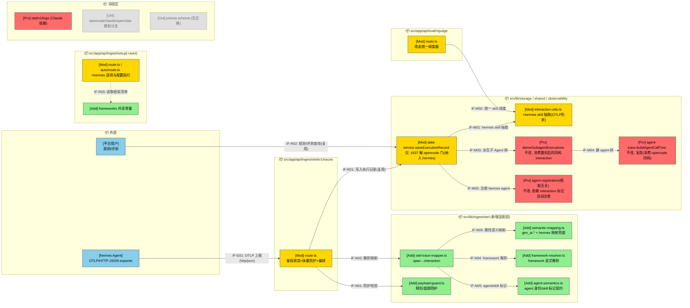
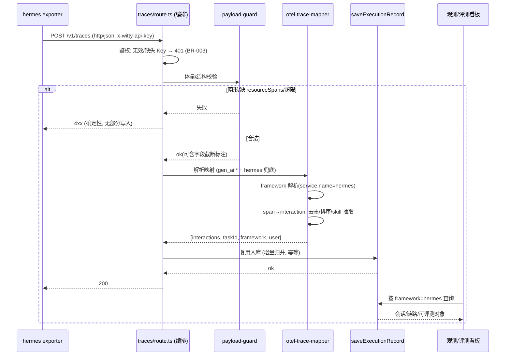
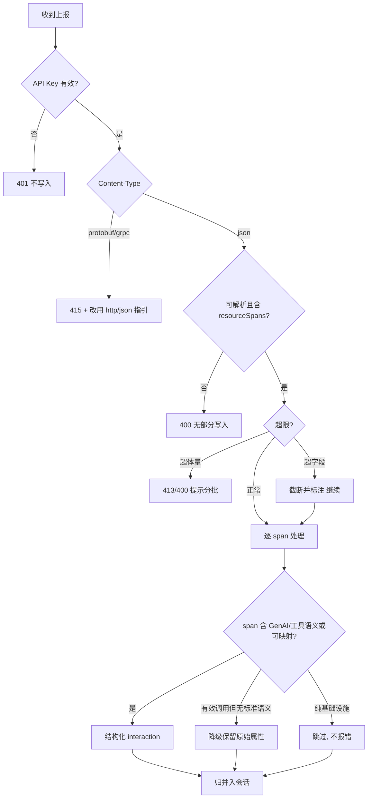

# Hermes 平台适配（OTel / OTLP 接入）— 需求设计规格
版本：v0.3
最后更新：2026-06-03 06:16:34

> 文档类型：Phase2 需求设计规格
> 关联项目：agent-insight ｜ 关联 Phase1：[phase1-requirements-analysis.md](phase1-requirements-analysis.md)
> 复杂度评估：**Medium**
> 版本：v0.2（已纳入可行性验证 + Phase2 评审修订）
> base_commit：c47829a（master_0530）
> 更新时间：2026-06-02
> 状态：Phase2 评审条件通过 → 已修订（M-1/M-2 + should-fix 全闭环）

---

## §1 设计概要

### 1.1 实现思路

总体策略：**最大化复用现有 OTLP/HTTP-JSON 通路，零数据库迁移**，以一层「OTLP 适配层」吸收 hermes 的差异，将其映射到既有内部模型（Session + Execution）。

1. **接入通路**：直接复用现有端点 `POST /api/ingest/otel/v1/traces`（根重写自 `/v1/traces`，见 `next.config.ts:23`）。hermes 侧以标准 OTLP/HTTP-JSON exporter 上报，无需安装插件（对齐 Claude Code 的「仅配置」模式，区别于 OpenCode 的插件模式）。
2. **框架标识**：`Execution.framework` 为自由字符串，由 OTLP `service.name` 驱动。要求 hermes exporter 设置 `service.name=hermes`；并在适配层提供显式 hermes 识别与「缺失 service.name 不静默落为 unknown」的兜底（修正自验证发现：当前缺失时落为 `unknown-service`，`traces/route.ts:80,197`）。
3. **适配层抽象**：把当前内联在 route 中的 OTLP 解析/映射逻辑下沉为可单测的纯函数模块 `src/lib/ingest/otel/`（Adapter 模式），承担：span→interaction 映射、`gen_ai.*`/`tool.name` 标准语义解析 + hermes 自定义属性映射兜底、framework 解析、invokedSkills 抽取、体量/畸形防护。route 变薄、仅做编排。
4. **下游打通**：统一 skill 抽取入口已存在于 `data-service.ts:476 extractInvokedSkillsFromSessionInteractions`（对未知框架返回 `null`）。在该**调度器内新增 hermes 分支**（调用 interaction-utils 新增的 hermes 抽取函数），并将 `eval/rejudge/route.ts:60-66` 的内联 switch 改为调用同一调度器（消除第二处重复 switch、并补回其遗漏的 openclaw），使 hermes 会话在「从 Trace」评测与 rejudge 中可正确进行 Skill 匹配（满足 FR-004/FR-008/AC-010）。注意：调度器与同文件的 `saveExecutionRecord` 是不同函数；后者本期**仅在 `:1937` 解 `framework==='opencode'` 门限处新增 hermes**，其余既有逻辑冻结。
5. **接入引导**：在全部 4 处安装脚本生成器中加入 hermes，并提供 Claude 风格的「配置指引块」（traces endpoint + `x-witty-api-key`），同时把框架清单抽取为共享常量以消除四副本漂移。

### 1.2 设计决策

|编号|决策项|类别|内容|理由|
|-|-|-|-|-|
|D-001|复用 OTLP traces 端点、零 schema 迁移|架构/数据|不新建端点、不改库表；`framework` 维持自由字符串，hermes 记录经既有 Session/Execution 入库，看板框架筛选项动态从数据派生（`Dashboard.tsx:2370`）自动出现|改动面最小、向后兼容最强；新增框架天然可被观测与统计（验证已确认无硬编码白名单拦截）|
|D-002|引入可单测的 OTLP 适配层（Adapter）|架构/设计模式|将 span→interaction 映射、语义映射、framework 解析、skill 抽取、体量防护从 route 抽出为纯函数模块；route 仅编排|当前逻辑全部内联在 route，难测难扩展；适配层为「下一个框架」提供低成本扩展点（NFR-004/005），并满足可测试性 DFx|
|D-003|traces 端点鉴权收敛为「必须有效 Key 否则 401」|安全/兼容|缺失/非法 `x-witty-api-key` 返回 401、不写入（实现 BR-003/NFR-003）。**作为受控的破坏性变更**：仅作用于 traces 端点，不动 `/v1/logs`（Claude 依赖）。经验证 Claude 用 logs、OpenCode 走 upload，均不 POST 到 traces；潜在受影响者仅为经 `/v1/traces` 重写无 Key 上报的第三方采集器|多租户隔离是硬需求；当前匿名兜底（`user`→`anonymous`）存在越权写入风险；首方调用方零影响，故收益远大于成本，但需在文档显式声明为破坏性变更|
|D-004|**适配层把 hermes 整形为 opencode 同构 interaction**，复用既有 agent 树管线（不改建树/派生函数）|架构/数据|关键澄清（据代码核实）：`buildAgentCallTree`（`agent-trace.ts:207`）**完全基于 opencode 语义**——`tool_calls[name='task']`、`subagent_type`、`subagent_session_id`、`role`，**无 parentSpanId 处理**。因此 hermes 不是「让建树读 OTLP」，而是由 `agent-semantics` 把 OTLP（parentSpanId + agent 身份属性）**整形为 opencode 同构 interaction 字段**，再原样喂给 `buildAgentCallTree` 与 `deriveSubagentExecutions`（`:2006`）。本期**唯一需改的存量点**：解除 `saveExecutionRecord` 中 `deriveSubagentExecutions` 的 `framework==='opencode'` 门限（`data-service.ts:1937`），纳入 hermes|满足 NFR-007「与 opencode 等价」；建树/派生**零改动**（仅整形 + 解门限），冻结区更干净、风险更低；避免实现者误改建树去读 parentSpanId|
|D-005|定义 OTLP「agent 身份 / skill 调用」语义契约，适配层统一产出标记|约定/数据|新增 `agent-semantics.ts`：把 hermes 的 agent 名/类型/父子关系、skill 名/版本（含子 Agent 加载）从 OTLP resource/span 属性解析为内部标记，写入 interaction（如 `agentName/agentType/subagentName/agentSessionId`、`toolCall.name='skill'` + 解析后的 skill/version），供建树与 skill 抽取共同消费|FR-013：建树(FR-010)、注册(FR-011)、skill(FR-012) 三者依赖同一份身份契约；契约据真实样本(T001)定稿，数据化可演进|

---

## §2 架构设计

### 2.1 架构变更

#### 2.1.1 变更总览

> 图例：🔵外部 🟢新增 🟡修改 🔴保护(被调用但本期禁止改) ⚪不涉及。接口命名 IF-{E外部/N新内部/M改内部/R复用内部}{编号}。



#### 2.1.2 模块变更

|模块|变更|职责|接口|依赖|约束|
|-|-|-|-|-|-|
|`src/lib/ingest/otel/`（新增适配层）|新增|OTLP span→内部 interaction 映射、语义映射兜底、framework 解析、skill 抽取、体量/畸形防护、**agent 身份/skill 标记契约（agent-semantics.ts）**|IF-N01~N05（内部纯函数）|无新增运行时依赖（纯 TS）|纯函数、无副作用，便于单测；不得直接访问 DB|
|`.../ingest/otel/v1/traces/route.ts`|修改|HTTP 编排：鉴权收敛(401)、调用防护与适配层、调用 saveExecutionRecord|IF-E01 / IF-R01|依赖适配层、data-service|禁止改 `/v1/logs`、`/v1/metrics` 行为；保持 http/json 路径不变|
|`src/lib/shared/interaction-utils.ts`|修改|新增 `extractSkillsWithVersionsFromHermesSession`（hermes 工具/skill 抽取函数）|IF-M01|—|既有 opencode/claude/openclaw 抽取函数**冻结**，仅新增函数|
|`src/lib/storage/data-service.ts::extractInvokedSkillsFromSessionInteractions`（调度器，:476-492）|修改|在统一调度器中新增 `fw==='hermes'` 分支，调用 interaction-utils 的 hermes 抽取函数（未知框架现返回 `null`）|IF-M01|interaction-utils|仅新增分支；既有 opencode/claude/openclaw 分支冻结。**与同文件的 `saveExecutionRecord`（保护）为不同函数，须分别对待**|
|`src/app/api/eval/rejudge/route.ts`（:60-66）|修改|将内联 framework switch 改为调用统一调度器 `extractInvokedSkillsFromSessionInteractions`|IF-M02|data-service 调度器|行为对既有框架保持等价（**含补回当前遗漏的 openclaw**）|
|`src/app/api/ingest/setup/route.ts` + `setup/auto/route.ts`|修改|框架选择器/安装逻辑加入 hermes（配置指引块，非插件下载）|IF-R03|frameworks 常量|bash+PS、setup+auto 四副本必须一致|
|`src/lib/ingest/frameworks.ts`（共享常量，新增）|新增|集中定义已知框架（name/value/接入方式）供安装脚本与类型引用|—|—|仅声明，不含逻辑|
|`src/lib/storage/data-service.ts::saveExecutionRecord`|修改|**唯一存量改动点**：解除 `deriveSubagentExecutions` 的 `framework==='opencode'` 门限（:1937），纳入 hermes；并经统一调度器抽 skill|IF-R01 / IF-M03 / IF-M05|deriveSubagentExecutions、调度器|**仅改 :1937 门限判断；opencode/claude/openclaw 既有路径行为零变更**|
|`src/lib/storage/data-service.ts::deriveSubagentExecutions`（:2006-2112）|保护/复用|**不改**。被纳入 hermes 后，消费「整形为 opencode 同构」的 interaction，产出多条 Execution（parent/root/isSubagent/subagentType/subagentName/agentSessionId）|IF-M03|buildAgentCallTree|函数体不动；hermes 同构 interaction 由 agent-semantics 整形产出|
|`src/lib/engine/observability/agent-trace.ts::buildAgentCallTree`（:207）/`inferSubagentType`|保护/复用|**不改**。完全基于 opencode 语义（`tool_calls[name=task]`/`subagent_type`/`subagent_session_id`/`role`，无 parentSpanId）；hermes 由适配层整形为同构 interaction 后原样复用|IF-M04|agent-semantics 整形输出|**禁止改其读 parentSpanId**；如需最小防御扩展须保 opencode 输入/输出不变|
|`src/lib/engine/observability/agent-registration.ts::extractObservedAgentRegistrations`（:14，由 data-service:1801-1842 调用）|保护/复用|**框架无关、本期多半不改**。从 interaction 的 `agent/subagent_name/role` 读取并注册；hermes 只要 interaction 携带这些标记即自动注册（platform 来自调用处）|IF-M05|agent-semantics 整形输出|无 per-framework 分支可改；如需也仅泛化 role 判定接纳 hermes 标记；去重沿用 (platform,name,user)|
|`otel/v1/logs`、`prisma/schema.prisma`、既有框架分支|不涉及/保护|—|—|—|显式防止误改；**无 DB 迁移（agent 树/注册字段已存在）**|

### 2.2 模块详情

#### 2.2.1 OTLP 适配层 `src/lib/ingest/otel/`

- 负责职责：把 hermes（及通用）OTLP trace 安全、确定性地转换为内部 interaction 列表与会话元信息，吸收平台差异。
- 功能性设计：
  1. `payload-guard.ts`：上报前/解析时校验——体量上限（max-bytes）、`resourceSpans` 缺失/为空 → 确定性 400（修正当前缺失 resourceSpans 返回 200-空写的问题）；超大字段（如 `tool.arguments`）按上限截断并标注 `_truncated`。
  2. `semantic-mapping.ts`：标准 `gen_ai.*`/`llm.*`/`tool.name` 解析，叠加 hermes 自定义属性映射表；命中 GenAI/工具语义 → 结构化 interaction；**未命中标准语义但属于有效调用 span 的，按降级策略保留原始属性**（满足 S-008「保留原始而非整条丢弃」，修正当前 `isGenAI/isTool` 门会静默丢弃的问题）。
  3. `framework-resolver.ts`：显式解析 framework——优先 `service.name`；缺失时按既定兜底（如 scope/instrumentation 名或专用资源属性）判定，且对 hermes 提供「必须 service.name=hermes」的契约校验与告警，不静默落为 `unknown-service`。
  4. `otel-trace-mapper.ts`：编排 1–3，输出 `{interactions[], taskId, framework, user, sessionMeta}`；会话归并键沿用 `session.id → service.instance.id → traceId` 优先级。
- 非功能设计：
  1. 纯函数、无 I/O，便于单测（覆盖标准/自定义/畸形/超限/缺失字段路径）。
  2. 映射表数据化、可扩展，新增框架仅加映射条目（NFR-004/005）。
  3. **接入可观测（NFR-006 落点）**：route 编排在每次上报输出一条结构化日志，契约字段含 `{taskId(会话归并键), framework, authResult(ok/invalid/missing), spanTotal, mappedCount, skippedCount, skipReasons[], degradedCount, truncatedFields[], httpCode}`；适配层以返回值（非日志副作用）回传计数，由 route 统一记录，保证纯函数可测。用户据此自助判断「是否成功 / 为何未呈现」。
- 风险与缓解：
  1. hermes 真实属性命名未知 → 以映射表 + 降级保留兜底；**交付前需采集一条真实 hermes trace 校准映射表**（列为前置任务）。
  2. 降级保留可能引入噪声 → 仅对「有效调用 span」降级，纯基础设施 span 仍跳过。

#### 2.2.2 会话归并与幂等（route 编排 + data-service 复用）

- 负责职责：将分批/重试的 hermes span 增量归并入同一会话，保证去重与聚合正确。
- 功能性设计：
  1. 复用既有「按 spanId 去重、按 timestamp 排序、token/latency 聚合」逻辑。
- 非功能设计（关键风险，已定稿）：
  1. **并发幂等（选定方案）**：当前为 JSON blob 的 read-modify-write（`traces/route.ts:153-184`），无事务/锁；同一 taskId 的并发批次可能交错丢 span 或重复计数。**选定方案：应用层「同 taskId 串行键互斥 + spanId 集合幂等合并」**——按 taskId 维护进程内互斥（key=taskId 的 mutex/promise 队列），临界区内执行 read→merge(by spanId set)→upsert；spanId 集合去重保证重复 span 幂等。**并发模型：同 taskId 串行、跨 taskId 并行。**
- 风险与缓解：
  1. 选型理由与取舍：SQLite 写并发弱、无可依赖的行级锁，应用层串行键实现简单、零额外依赖，可确定性达成 AC-002 的 100% 去重；代价是单一会话的并发上报被串行化（牺牲单会话极端并发吞吐换正确性）。
  2. 适用边界：本期为自托管单实例。若未来多实例部署，进程内锁失效，需升级为 DB 唯一约束（taskId+spanId）或分布式锁——列为可升级点（NFR 可升级性）。

#### 2.2.3 下游 Skill 抽取统一化（interaction-utils + rejudge）

- 负责职责：让 hermes 会话在评测/rejudge 中可正确提取 invokedSkills（一等公民）。
- 功能性设计：
  1. interaction-utils 新增 `extractSkillsWithVersionsFromHermesSession`：解析 **OTLP 形状**（`interaction.toolCall:{name,arguments(字符串)}`，与 opencode `tool_calls[]`、claude/openclaw content block 均不同）；当 `toolCall.name∈{skill,load_skill}` 时，从 `arguments`（JSON 字符串）解析 `skill/skill_name/name` 与 `version`。
  2. **覆盖子 Agent 加载的 skill**：对齐 opencode 的 `task.load_skills` 语义——子 Agent 节点关联的 skill 也并入 invokedSkills（依赖 agent-semantics 标记把 skill 归属到对应 agent）。
  3. rejudge route 改走统一 `extractInvokedSkillsFromSessionInteractions(framework, …)`，消除第二处 switch（同时补回当前遗漏的 openclaw）。
- 风险与缓解：
  1. hermes skill 的真实 OTLP 表示未知 → 由 D-005 语义契约 + T001 样本定稿；无 skill 概念时安全返回空。

#### 2.2.4 子 Agent 多 Execution 树（FR-010/AC-011，与 opencode 对齐）

- 负责职责：把 hermes 多 Agent 运行拆为多条 Execution 并组成树，达成子 Agent 级可观测/可评测，且与 opencode 等价（NFR-007）。
- 功能性设计（核心：**整形复用，而非改建树**）：
  1. **适配层整形（净新增的重活）**：`agent-semantics.ts` 把 hermes 的 OTLP（`parentSpanId` + agent 名/类型/会话 + `task`/skill 语义）**整形为 opencode 同构的 interaction 字段**——即产出 `buildAgentCallTree` 期望的键名：`tool_calls[].name='task'`、`subagent_type`、`subagent_session_id`、`role`、`agent`/`subagent_name`。这是本能力的主要工作量。
  2. **解除门限（唯一存量改动）**：`saveExecutionRecord` 中 `deriveSubagentExecutions` 的 `framework==='opencode'`（`data-service.ts:1937`）泛化为「opencode 或 hermes」。
  3. **建树/派生零改动**：`buildAgentCallTree`（`agent-trace.ts:207`）与 `deriveSubagentExecutions`（`:2006`）**函数体不动**，直接消费整形后的同构 interaction，产出多条 Execution（`parentExecutionId/rootExecutionId/agentSessionId/subagentType/subagentName/isSubagent`，字段已存在，无迁移）。
  4. **链路展示层（FR-005）**：UI `AgentTraceView` 客户端 `buildAgentCallTree(interactions)` 因 interaction 已整形为同构，对 hermes 同样生效。
- 非功能设计：
  1. 与 opencode 等价性（NFR-007）：以「同一逻辑多 Agent 运行，两框架产出同构树」作为验收（AC-011/TC-010）。
- 风险与缓解：
  1. **不得让 `buildAgentCallTree` 去读 `parentSpanId`**（它无此能力且属冻结区）；hermes→opencode 同构整形是关键且非平凡，须以 T001 样本校准字段映射。
  2. hermes agent 身份的 OTLP 表示未知 → D-005 契约 + T001 样本；无多 Agent 样本时用构造样本验证整形。

#### 2.2.5 Agent 自动注册（FR-011/AC-012）

- 负责职责：hermes 主/子 Agent 身份首次观测即注册到 RegisteredAgent。
- 功能性设计（**复用框架无关函数，本期多半零改**）：
  1. `extractObservedAgentRegistrations`（**`agent-registration.ts:14`**，由 `data-service.ts:1801-1842` 调用）是**框架无关**的：从 interaction 的 `agent/subagent_name/role` 读取并注册，`platform` 来自调用处。该调用**已对任意非空 framework（含 hermes）无条件执行**。
  2. 因此 hermes 注册的实现 = §2.2.4 整形使 interaction 携带 `agent/subagent_name` 标记，注册即自动生效；**通常无需改该函数**，若需改也仅泛化 `role` 判定以接纳 hermes 标记（保持框架无关语义）。
- 风险与缓解：
  1. 无 agent 名时回退为「单主 Agent」注册，不报错。

### 2.3 功能影响

```text
- agent-insight
  - 数据接入 (ingest/otel)
    - 新增 hermes OTLP 适配与解析
    - traces 端点鉴权收敛 (401)
    - 畸形/超限上报防护
  - 观测 (observe/trace)
    - framework=hermes 自动出现于筛选与链路 (无需改动)
  - 评测 (eval)
    - hermes 主/子 Agent 均可作为「从 Trace」评测对象
    - rejudge skill 抽取统一化 (修复 openclaw/hermes)
  - 多 Agent / 注册 (storage/observability)
    - hermes 多 Agent 拆多条 Execution + agent 树 (对齐 opencode)
    - hermes 主/子 Agent 自动注册 RegisteredAgent
  - Skill
    - OTLP 形状 skill 解析 (含版本 + 子 Agent 加载) 打通评测/A-B/优化
  - 接入引导 (setup)
    - 新增 hermes 选项与配置指引 (四副本 + 共享常量)
```

|功能|变更|变更点|对应需求|
|-|-|-|-|
|OTLP 接入解析|改/增|适配层 + 语义映射兜底 + framework 显式解析|FR-001/FR-002/FR-003/FR-004|
|鉴权|改|缺失/非法 Key → 401（破坏性，限 traces）|BR-003/NFR-003|
|健壮性|增|畸形/超限防护|FR-009/BR-006|
|子 Agent 链路层级|增|整形为 opencode 同构后复用建树（链路展示）|FR-005/AC-003|
|子 Agent 多 Execution 树|增|适配层整形为同构 + 解 :1937 门，复用 deriveSubagentExecutions 拆多条 Execution|FR-010/AC-011/NFR-007|
|agent 注册|增|整形使 interaction 带 agent/subagent_name 标记，复用框架无关注册（自动生效）|FR-011/AC-012|
|Skill 解析|改/增|OTLP 形状 extractor + 版本 + 子 Agent 加载 skill|FR-012/AC-013|
|OTLP agent/skill 语义契约|增|agent-semantics.ts 解析 agent 身份/skill 标记|FR-013|
|接入引导|改|四处选择器 + 配置指引 + 共享常量|FR-006/NFR-005|
|评测承接|改|统一 skill 调度，主/子 Agent 可评测|FR-008/AC-010|
|不支持编码反馈|改|protobuf/gRPC → 415 + 改用 http/json 指引|FR-007|
|接入可自检|增|适配层/route 输出结构化接入日志|NFR-006|

---

## §3 核心流程

### 3.1 主流程：hermes OTLP 上报 → 入库 → 观测



### 3.2 异常与边界判定（决策分支）

> 注：鉴权最先生效（安全收敛 D-003）——即便是 protobuf 请求，缺/非法 Key 也先返回 401，再判编码。



---

## §4 算法设计

### 4.1 属性语义映射与降级（semantic-mapping）

**目标**：将 hermes/通用 OTLP span 的属性，确定性地映射为内部 interaction 字段；支持标准 GenAI 语义与 hermes 自定义命名，且无法识别时不丢数据（支撑 FR-004/S-008）。

**核心逻辑**：

```
function mapSpan(span, resourceAttrs, mappingTable):
    attrs = flatten(span.attributes)
    kind = classify(attrs)        # llm | tool | other(but valid call) | infra
    if kind == infra: return SKIP
    model   = pick(attrs, ['gen_ai.request.model','llm.request.model', ...mappingTable.model])
    usage   = pickUsage(attrs, mappingTable.usage)   # input/output/reasoning/total
    toolName= pick(attrs, ['tool.name', ...mappingTable.tool])
    base    = {spanId, parentSpanId, name, type: kind, model, usage,
               latency: nsToMs(end-start), timestamp: nsToMs(start)}
    if kind == 'other':           # 有效调用但语义不识别 → 降级保留
        base.raw = attrs; base._degraded = true
    return base
```

**输入**：单个 OTLP span + 资源属性 + 映射表（数据化配置）。
**输出**：内部 interaction 对象，或 SKIP。

**复杂度分析**：单 span O(属性数)；整批 O(span 总数)，线性。

**边界条件与异常处理**：
- 缺 model/usage：字段置空/0，不报错。
- 时间戳缺失或乱序：缺失按 0 处理，入库后按 timestamp 排序。
- 字段超限：交由 payload-guard 截断并标注。
- 映射表未命中：进入降级保留分支。

### 4.2 OTLP agent 身份 / skill 语义契约与建树（agent-semantics，FR-013/010/012）

**目标**：把 hermes OTLP 中的 agent 身份与 skill 调用，**整形为 opencode 同构的 interaction 字段**，从而原样复用既有建树/派生/注册/skill 管线（建树等函数零改动），产出多条 Execution（与 opencode 等价）。

**契约（左：hermes OTLP 缺省来源 → 右：必须整形成的 opencode 同构字段；据 T001 真实样本定稿）**：

| 内部语义 | hermes OTLP 缺省来源（可经映射表覆盖） | **整形为 opencode 同构字段（下游消费者期望）** |
|-|-|-|
| agent 名 | `gen_ai.agent.name` / `agent.name` | interaction `agent` / `subagent_name` |
| agent 类型 | `agent.type`（main/subagent）；缺省由父子推断 | `role`（`subagent`）/ `subagent_type` |
| 父子关系 | span `parentSpanId`（结合 agent 边界 span） | `tool_calls[].name='task'` 的 spawn 边界 + `subagent_session_id` |
| agent 会话 | `session.id` / `agent.session.id` | `subagent_session_id` |
| skill 调用 | `tool.name∈{skill,load_skill}` 且 args 含 `skill/name`+`version` | interaction `toolCall`/`tool_calls` 中 skill 名+版本 |
| 子 Agent 加载的 skill | 子 agent 节点关联的 skill span | 归属到对应 subagent 节点的 skill |

> 关键：`buildAgentCallTree`（`agent-trace.ts:207`）**只认 opencode 语义（`tool_calls[name=task]`/`subagent_type`/`subagent_session_id`/`role`），无 parentSpanId 处理**。故适配层必须产出右列字段名，而非把 parentSpanId 直接交给建树。

**核心逻辑**：

```
# 适配层(agent-semantics): 整形为 opencode 同构 interaction（关键工作量）
shaped = interactions.map(toOpencodeShape)   # parentSpanId+agent属性 → tool_calls[task]/subagent_*/role
# saveExecutionRecord: 解 :1937 门后 if framework in {opencode, hermes}:
tree = buildAgentCallTree(shaped)            # 函数体不改, 直接复用
deriveSubagentExecutions(tree)               # 函数体不改 → 多条 Execution(parent/root/isSubagent/subagentType)
extractObservedAgentRegistrations(shaped)    # 框架无关, 不改 → upsert RegisteredAgent
extractSkills(shaped)                        # invokedSkills(含子 Agent 加载)
```

**边界条件与异常处理**：
- 无 agent 身份标记：退化为单主 Agent（一条 Execution），不报错。
- agent 名缺失：用 span/agent.type 兜底命名；仍可注册与建树。
- 与 opencode 等价（NFR-007）：同构运行产出同构树（AC-011 验收）。

---

## §5 数据模型

### 5.1 无 schema 变更（关键决策）

**描述**：相对现有系统，**不新增/修改任何数据库表或字段**。`Execution.framework`、`Session.interactions` 均为既有结构；hermes 仅作为 `framework` 的一个新取值流入。无迁移、无回滚脚本。

**详细设计**：
- 复用 `Session{ taskId, interactions(JSON), model, user, startTime, label }` 与 `Execution{ framework, model, tokens, latency, query, final_result, invokedSkills, ... }`。
- interaction JSON 结构沿用 OTLP 适配层输出。本期新增的字段均为**可选**，旧消费者忽略未知字段即可（向后兼容）：

| 字段 | 类型 | 可选性 | 说明 / 兼容性 |
|-|-|-|-|
| spanId / parentSpanId | string | 必填 / 可空 | 沿用既有；parentSpanId 用于子 Agent 层级重建（FR-005） |
| type | 'llm' \| 'tool' | 必填 | 沿用既有 |
| model | string | 可选 | 沿用既有 |
| usage | {input_tokens,output_tokens,reasoning_tokens?,total_tokens} | 可选 | 沿用既有 |
| latency / timestamp | number(ms) | 可选 | 沿用既有 |
| requestMessages / responseMessage / toolCall | object | 可选 | 沿用既有 |
| **raw** | object | **新增·可选** | 降级保留的原始 span 属性（仅 `_degraded` 时存在），旧消费者忽略 |
| **_degraded** | boolean | **新增·可选** | 标记该 interaction 未命中标准语义、走降级保留（S-008） |
| **_truncated** | string[] | **新增·可选** | 被 payload-guard 截断的字段名列表（FR-009） |
| **agentName / agentType / subagentName / agentSessionId** | string | **新增·可选** | agent 身份标记，由 agent-semantics 从 OTLP 属性解析，供建树/注册（FR-010/011） |

> 说明：上述 agent 身份标记仅写入 interaction（Session.interactions JSON，向后兼容）；落到 **Execution 表**的 `parentExecutionId/rootExecutionId/agentSessionId/subagentType/subagentName/isSubagent` 为**模型已存在字段**（opencode 已在用），故仍**无 schema 迁移**。`RegisteredAgent` 表亦为既有结构。

---

## §6 接口设计

### 6.1 外部接口

|名称|变更|描述|请求方式|请求参数|返回参数|错误码|
|-|-|-|-|-|-|-|
|OTLP traces 接入|改|hermes 上报入口（复用）|POST `/v1/traces`（重写至 `/api/ingest/otel/v1/traces`）|Header: `x-witty-api-key`(必填), `Content-Type: application/json`；Body: OTLP `resourceSpans`（要求 `service.name=hermes`）|`{status:'success'}`|400 畸形/缺 resourceSpans；401 缺/非法 Key；413/400 超限；415 protobuf/gRPC|
|hermes 安装配置指引|增|安装脚本中输出 hermes 的 OTLP 配置说明（endpoint+key）|安装脚本交互|选择 hermes|打印 exporter 环境变量/配置片段|—|

### 6.2 内部接口

|名称|变更|描述|调用方|提供方|请求参数|返回参数|
|-|-|-|-|-|-|-|
|IF-N02 mapOtlpTrace|增|OTLP body→内部模型|traces/route|otel-trace-mapper|`{body, resourceAttrs, apiUser}`|`{interactions[], taskId, framework, user, sessionMeta}`|
|IF-N01 guardPayload|增|体量/结构防护|traces/route|payload-guard|`{rawBody/size, parsed}`|`{ok, code?, truncatedFields?}`|
|IF-N03 mapSpan|增|单 span 语义映射|mapper|semantic-mapping|`{span, resourceAttrs, table}`|`interaction \| SKIP`|
|IF-M01 extractInvokedSkills|改|统一 skill 抽取调度（+hermes 分支，含子 Agent 加载 skill）|saveExecutionRecord / rejudge|`data-service.ts::extractInvokedSkillsFromSessionInteractions`（调度器，内部调用 interaction-utils hermes 抽取函数）|`(framework, interactions)`|`InvokedSkill[] \| null`|
|IF-N05 toOpencodeShape|增|把 OTLP 整形为 opencode 同构 interaction（含 agent 身份/skill 标记）|mapper|agent-semantics|`{span, resourceAttrs, table}`|含 `tool_calls[task]/subagent_type/subagent_session_id/role/agent` 的 interaction 片段|
|IF-M03 deriveSubagentExecutions|复用(不改)|消费整形后的同构 interaction，产出多条子 Agent Execution|saveExecutionRecord（解 :1937 门后）|deriveSubagentExecutions（函数不改）|`{framework, taskId, interactions, baseRecord}`|多条 Execution（含 parent/root/isSubagent…）|
|IF-M04 buildAgentCallTree|复用(不改)|消费 opencode 同构 interaction 建树（**不读 parentSpanId**）|deriveSubagentExecutions / AgentTraceView|agent-trace（函数不改）|opencode 同构 `interactions[]`|agent 树|
|IF-M05 extractObservedAgentRegistrations|复用(不改)|框架无关，依据 interaction 的 agent/subagent_name 标记自动注册|saveExecutionRecord（既有调用）|`agent-registration.ts:14`（函数不改）|`(interactions, agentName)`|observedAgents → upsert RegisteredAgent|

### 6.3 配置接口

|名称|变更|描述|类型|默认值|取值范围|
|-|-|-|-|-|-|
|OTLP 上报体最大字节|增|payload-guard 体量上限|int(bytes)|默认 8MB（G4，可配置）|>0|
|单字段最大长度|改|复用既有 `SKILL_INSIGHT_MAX_TOOL_IO`/`MAX_EVENT_STRING` 思路|int|沿用既有默认|>0|
|hermes service.name 契约|增|要求 hermes exporter `service.name=hermes`|string|`hermes`|固定|

---

## §7 DFx 设计

### 7.1 可用性 / 可靠性

|故障/风险场景|触发|应对策略|取舍/决策|
|-|-|-|-|
|并发批次交错导致丢 span/重复计数|同 taskId 并发上报|对同 taskId 串行化合并 / 原子 upsert / 基于 spanId 集合幂等合并|SQLite 并发弱，优先应用层串行键；牺牲极端并发吞吐换取 100% 去重正确性（AC-002）|
|单条畸形 span|上游打点异常|逐 span try/catch，跳过坏 span 不中断整批|可靠性优先|
|缺 resourceSpans 静默成功|上游误配|确定性 400|可诊断性优先（修正现状）|

### 7.2 性能

|指标|目标值|模块分解|分解假设|
|-|-|-|-|
|单批上报处理|P95 < [待 Phase3 基线测试确认]ms|适配层映射 O(n) + 入库 I/O|测量条件：单批 ≤500 span、字段未超限、同 taskId 串行；SQLite 本地单实例写|
|内存占用|≤ 体量上限的常数倍（有界）|payload-guard 限体量|拒绝超体量上报、截断超大字段|

> 说明：性能绝对阈值无既有基线，标注「待 Phase3 基线测试确认」；本期先固定测量条件（批大小、并发模型、存储），Phase3 压测后回填数值，与 Phase1 NFR 口径对齐。

**优化措施**：

|关注点|应对策略|取舍/决策|
|-|-|-|
|大 payload 内存|体量上限 + 字段截断|拒绝/截断优于 OOM|
|会话 JSON 反复读写|沿用增量合并；必要时批合并|保持最小改动|

### 7.3 安全性

|高风险项|类型|风险分析|应对策略|
|-|-|-|-|
|匿名上报越权写入|授权认证|当前缺/非法 Key 仍写入并归 anonymous，多租户下可污染|traces 端点收敛为 401（D-003），限本端点，不动 logs|
|超大/恶意 payload|数据保护/可用性|无体量限制可致资源耗尽|payload-guard 体量上限 + 字段截断|
|敏感内容落库|日志审计|prompt/completion 入库|沿用既有最大长度限制；不新增暴露面|

### 7.4 其他

|目标|类型|应对策略|取舍/决策|
|-|-|-|-|
|下一个框架低成本接入|可扩展性|适配层 + 数据化映射表 + 共享框架常量|前期多一层抽象，换长期可维护|
|映射/防护可回归|可测试性|适配层纯函数 + 用例覆盖标准/自定义/畸形/超限/缺失|提升测试投入|
|协议演进|可升级性|为 protobuf/gRPC 预留解码适配位（本期不实现）|NFR-004|

---

## §8 附件

**实现前置任务（阻塞映射表定稿）**：采集一条真实 hermes OTLP trace 样本，校准 `semantic-mapping` 的属性映射表与 skill 抽取规则（对应 Phase1 「样本采集 + 映射规约」假设）。

**自验证结论摘要**：Feasible-with-changes。已纳入修订：①rejudge 第二处 switch 统一化；②framework 缺失兜底（非 anonymous，实为 unknown-service）；③缺 resourceSpans 的确定性 400 与体量防护为净新增；④安装选择器四副本 + 共享常量；⑤并发幂等需原子化；⑥子 Agent 层级与自定义属性映射为净新增、需真实样本。

**关键代码锚点**：`traces/route.ts:80,94-95,138,153-184,197,204`；`data-service.ts:476-491`；`eval/rejudge/route.ts:60-66`；`next.config.ts:23`；`setup/route.ts` 与 `setup/auto/route.ts` 框架清单；`Dashboard.tsx:2370`。

## 变更记录（合成文档）

| 版本 | 内容 |
|-|-|
| v0.1 | Phase1/2/3 三阶段初稿，各自通过独立 reviewer 闸门（P1 84 条件通过→修订；P2 73 条件通过→修订；P3 Pass）|
| v0.2 | 可行性验证修订：rejudge 第二处 switch 统一化、framework 兜底澄清、缺 resourceSpans 确定性 400、并发幂等定稿、setup 四副本+共享常量 |
| v0.3 | **refine：skill / subagent 一等公民**——新增 FR-010/011/012/013、NFR-007、BR-007/008/009、AC-011/012/013、D-004/D-005、§2.2.4/2.2.5、IF-N05、任务 T007~T010 与 T004 升级 |
| v0.3.1（本合成） | 据代码二次核对修正两处 ERROR：①`extractObservedAgentRegistrations` 实为 `agent-registration.ts:14` 框架无关函数（不加分支、靠标记自动注册）；②`buildAgentCallTree` 无 parentSpanId 能力，改为「适配层把 hermes 整形为 opencode 同构 interaction，建树/派生/注册函数零改动」。同步收敛冻结区与任务边界（T008 整形为关键、T009 仅解 :1937 门、T010 多半零改、T006 纯 UI 消费）|

> 注：本文件为三阶段 + refine + 代码核对修正的**合成终稿**，取代此前的分阶段草稿与 .refine 副本。
