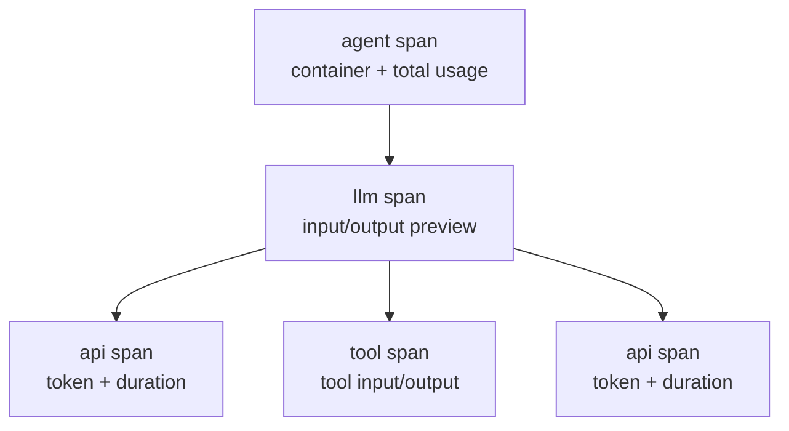
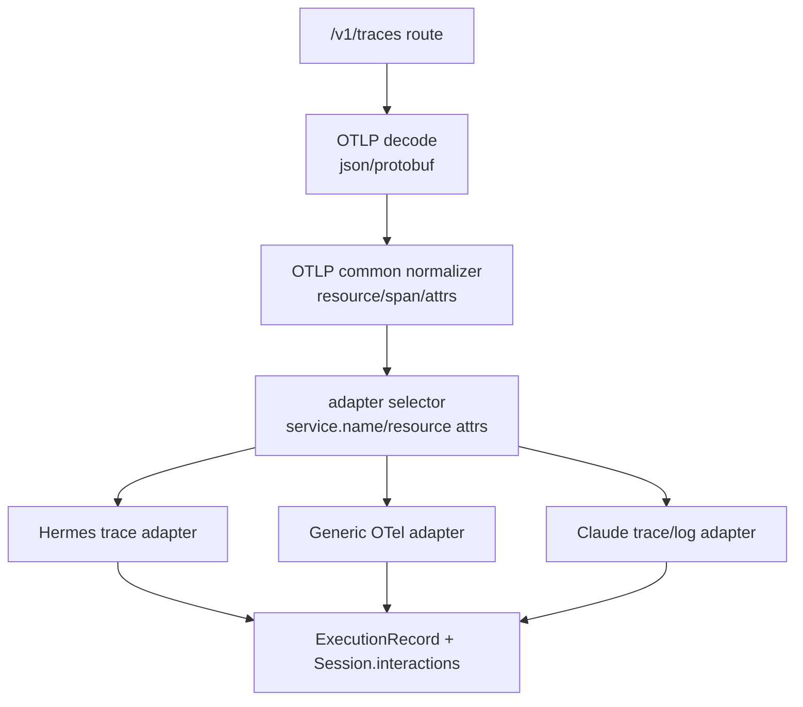

# Hermes OTel Trace Tree 与 Subagent 归并后续设计

> 状态：真实 Hermes 对话样本验证后的 follow-up 设计，已按 2026-06-12 的当前实现状态刷新。本文聚焦三类问题：单 trace 展示、Hermes OTel 数据高保真边界，以及 subagent/skill 后续全链路。
> 结论先行：OTLP/protobuf 接收、Hermes 单 trace span tree 展示、一键 setup、snapshot replacement 已经落地；当前剩余风险主要来自 `hermes-otel` 插件上报内容本身不完整，以及平台侧 Hermes skill/subagent/OTel adapter registry 尚未闭环。

## 0. 当前落地状态（2026-06-12）

本阶段已经按“平台侧先可用、暂不改 Hermes 原工具代码”的顺序落地：

1. **Hermes 独立 adapter**：`src/lib/ingest/otel/adapters/hermes.ts` 按 `spanId` / `parentSpanId` 重建单 trace 内的 span tree，生成平台需要的 user、tool、final reply interactions；当上游 `api.*` span 提供 `output.value` 时，也能插入 intermediate LLM reply。前端仍消费现有 `Session.interactions`，不需要改成 span UI。
2. **一键 setup 接入**：普通交互版 `/api/ingest/setup` 和 auto 版 `/api/ingest/setup/auto` 都加入 Hermes 选项；脚本以 `$HERMES_HOME` 为中心探测 Hermes 安装，默认使用 `$HERMES_HOME/hermes-agent/venv/bin/pip`，fallback 到 `~/git/hermes-agent/venv` / `~/agent/hermes-agent/venv`；插件安装使用 `hermes plugins install briancaffey/hermes-otel --enable`，并写入 `$HERMES_HOME/plugins/hermes_otel/config.yaml`。配置会开启 `capture_full_responses`、`capture_conversation_history`，并把 `preview_max_chars` 提到 4000。
3. **partial batch snapshot replacement**：Hermes `FrameworkAdapter` 声明 `sessionMergeStrategy: "snapshot-replace"`，同一 session 的后续 OTLP batch 会用最新 snapshot 覆盖旧 interactions，不再走通用 monotonic merge，避免 partial batch 把工具步骤挂到错误的旧 interaction 上。
4. **AGENTS.md 环境约定**：已把本地数据库位置写入仓库协作约束，后续排查默认从 `~/.agent-insight/data` 找 SQLite / spool 数据。

仍未解决的问题：

- **Hermes LLM 输出数据缺失**：实测 `20260611_194339_8f1e6c` 中，配置已写入并被 Hermes 进程加载，但原始 OTLP spool 里 `agent` / `llm.*` 的 `output.value` 仍只有 500 chars；中间 `api.*` span 多数只有 token / finish reason，没有 `output.value` 或 `llm.output.content`。这说明缺口主要在 `hermes-otel` 插件采集内容，而不是前端裁剪。
- **工具 output 完整采集**：插件源码中 tool output 仍走 `_preview(..., 2000)` 一类逻辑，平台只能展示上游给到的 preview。要拿完整工具输出，需要改 `hermes-otel` 的 tool span 采集策略或 Hermes 工具执行层。
- **Hermes skill 全链路**：`src/lib/ingest/adapters/hermes.ts` 目前只有 descriptor 和 `sessionMergeStrategy`，还没有实现 `extractSkills`；因此 `ExecutionSkill`、skill 筛选、skill 分析模块还不能稳定识别 Hermes 的 `skill_view` / skill 调用语义。
- **Hermes subagent 树**：真实样本里 root 和 child session 仍缺少 `parent_session_id` / `root_session_id` / delegate tool span back-reference。需要改 `hermes-otel` 插件或 Hermes subagent 调度侧，上报 `parent_session_id`、`root_session_id`、`agent.role`、`parent_tool_span_id` 等显式字段。
- **API span 高保真结构化解析增强**：平台 Hermes adapter 已能解析常见 OpenAI-compatible response 形态，但仍需要覆盖更多 provider 的 response JSON，并补 `llm.output.content` 等字段 fallback，避免未来插件开始上报完整 API response 后平台只认一种格式。
- **统一 OTel adapter registry**：Hermes 主逻辑已拆到 `src/lib/ingest/otel/adapters/hermes.ts`，但 OTLP traces 的入口、聚合命名和部分通用逻辑仍挂在历史 `claude-otel` 路径。后续仍应迁到 `otel/adapter-registry.ts`，为其他 OTel 框架提供统一接入接口。

## 1. 背景

当前平台已经能接收 `hermes-otel` 通过 OTLP/HTTP protobuf 发来的 traces，并能写入本地 spool 与数据库。基础字段如 `framework=hermes`、`model=GLM-5.1`、token、tool span、`input.value` / `output.value` 已能被识别。

但真实任务暴露了两类结构性问题：

1. 普通工具调用任务中，Trace UI 看起来没有用户输入，且时间线顺序像是“最终回答先出现、工具调用后出现”。
2. 调用两个 subagent 的任务中，平台出现三条独立 trace，而不是一棵 root + 两个 subagent 的树。

这两个问题都不是简单字段漏映射，而是数据模型语义不匹配。

## 2. 样本事实

### 2.1 单 session 工具调用样本

样本：`20260611_141826_808e5a`

spool 中该 session 有 5 个 span：

| span | 层级 | 关键信息 |
|---|---|---|
| `agent` | root container | `openinference.span.kind=AGENT`，有 `input.value` 和 `output.value`，token 总量 44356 |
| `llm.GLM-5.1` | `agent` child | 有 `input.value` 和 `output.value`，无 token |
| `api.GLM-5.1` | `llm` child | token 15743，无 message detail |
| `tool.skill_view` | `llm` child | 有工具 input/output |
| `api.GLM-5.1` | `llm` child | token 28613，无 message detail |

原始 span 里用户输入不是缺失：`agent` 和 `llm.GLM-5.1` 都带了 `input.value`。修复前 DB 里的 `Session.interactions` 形态是：

- interaction 全部是 `role: "assistant"`。
- 用户输入藏在 assistant interaction 的 `requestMessages[0]` 中。
- `buildAgentCallTree` 只把顶层 `role === "user"` 识别为用户事件，不展开 `requestMessages`。

因此 Trace UI 中看起来“没有用户输入”。当前 Hermes adapter 已把 `llm.input.value` 转为顶层 user interaction，单 trace 的用户输入显示问题已经修复。

同时，`agent` / `llm` 是长生命周期容器 span：它们开始得最早，结束得最晚。修复前平台按 span start time 把它们压平成线性 interactions，于是容器 span 的输出会排在内部 `api/tool/api` 前面，看起来顺序不对。当前 Hermes adapter 已按 span tree 生成平台事件序列，单 trace 的主流程顺序已经修复。Langfuse 不会出现这个错觉，因为它展示的是 span tree + time bars，而不是 chat message 列表。

### 2.2 subagent 样本

样本：

- root：`20260611_114911_3bd20b`
- child 1：`20260611_115035_98c544`
- child 2：`20260611_115035_4f5bca`

现象：

- root session 中有 `tool.delegate_task`，时间窗口覆盖两个 child session。
- 两个 child session 各自有独立 `traceId`。
- 每个 session 的 `correlation.id`、`session.id`、`session_id` 都等于自己的 session id。
- root 的 `tool.delegate_task` input/output 中没有包含 child session id。
- child span 中没有 `parent_session_id`、`root_session_id`、`parent_span_id` 指向 root 的 `tool.delegate_task`。

所以平台当前只能按 session id 生成三条独立 trace。仅靠时间窗口把它们归并是启发式猜测，不适合作为一等公民的 subagent 关系依据。

### 2.3 信息不全的边界

`hermes-otel` 插件自身文档说明了一个重要限制：

- `api.*` span 只带 model、token、duration 等 metadata，不带完整 message detail。
- 原始用户消息和最终 assistant response 在父 `llm.*` span 上。
- 若要看到模型收到的 message list，需要启用 `capture_conversation_history`。
- 完整渲染后的 prompt 目前 Hermes hook 不暴露，插件也拿不到。

当前 setup 已写入更激进的高保真配置：

```yaml
capture_previews: true
capture_conversation_history: true
conversation_history_max_chars: 40000
capture_full_responses: true
preview_max_chars: 4000
```

但真实样本 `20260611_194339_8f1e6c` 证明：配置生效并不等于 payload 已完整。已安装的 `hermes-otel` 插件源码里，`llm` / `agent` 输出仍有 `_preview(assistant_response, 500)` 硬编码；`api.*` span 的 `capture_full_responses` 只有在 hook 参数里存在 `response_content` 时才会写 `llm.output.content` / `output.value`。在当前样本里，中间多轮 `api.*` span 只有 token、duration、finish reason，缺少真实模型输出；最终 `llm.*` / `agent` output 也只有 500 chars preview。

因此平台当前拿到的是“比默认更多的可观测预览”，还不是完整模型上下文。要补齐中间模型输出、完整最终回复和完整工具 output，需要插件侧或 Hermes hook 层真正上报这些正文。

## 3. 已定位的平台侧根因与修复状态

### 3.1 适配代码放错层

当前 OTLP traces 的字段归一化与聚合逻辑仍在历史目录 `src/lib/ingest/claude-otel/` 下。这个名字来自 Claude Code OTel logs 接入，但现在该模块已经承担 Hermes 和通用 OTLP traces 的处理。

问题：

- 名字误导维护者，以为 Hermes 只是 Claude 适配里的一个字段补丁。
- 新框架接入容易继续往一个文件里追加 `llm.model_name`、`x.y.z` 之类 alias。
- Hermes 需要 span tree、partial batch、安全归并、subagent linkage，这已经超过“字段 alias”的复杂度。

### 3.2 span tree 被压平成 chat interactions

内部 `Session.interactions` 和 `buildAgentCallTree` 主要面向 OpenCode/Claude 风格的线性 message/tool-call 序列：

- user message 是顶层 interaction。
- assistant message 可携带 `tool_calls`。
- task/subagent 通过 `tool_calls[name='task']`、`subagent_type`、`subagent_session_id` 表达。

Hermes OTel 的真实形态是 span tree：



如果直接把每个 span 变成一个 assistant interaction，会出现：

- 用户输入在 `requestMessages` 内嵌，Trace UI 不认。
- `agent` / `llm` 容器的最终 output 排在前面，内部 `api/tool` 排在后面。
- `api` span 没有 content，却占据 timeline 节点。
- token 容易在 `agent` 与 `api.*` 之间重复统计。

当前 Hermes adapter 已经不再按上述方式直接压平 span，而是在 adapter 层转成平台需要的 interactions；该根因对单 trace 展示已经修复。

### 3.3 partial batch + session merge 会污染 interactions

OTLP exporter 可能分批上报同一 trace。样本中早到的 batch 只包含部分 `api/tool` span，晚到 batch 才包含完整 `agent/llm` container span。

历史落库是按 spool consumer 增量保存，并通过 `mergeSessionInteractionsMonotonic` 合并已有 `Session.interactions`。这个 merge 适合追加式消息流，但不适合“同一 trace 的更完整快照覆盖旧快照”。

具体后果：

- 第一批数据到达时，tool 可能临时挂到最后一个 `api` interaction。
- 第二批完整数据到达时，tool 又挂到正确的 `llm` interaction。
- merge 只合并/保留 tool_calls，不会从错误 interaction 上清掉旧挂载，于是 UI 出现重复或错位。
- `Execution.query` 也可能先写成 fallback `OTel Session`，后续未被正确替换为真实用户输入。

当前实现已让 Hermes `FrameworkAdapter` 声明 `sessionMergeStrategy: "snapshot-replace"`，存储层在该策略下跳过 monotonic merge，直接用新的 deterministic interactions snapshot 覆盖旧 snapshot。这个问题对 Hermes 当前链路已经修复；后续迁移到统一 OTel registry 时，需要保留这条语义，避免新入口重新退回 append merge。

### 3.4 subagent 缺少可靠关联字段

平台已有数据库字段可表达父子 Execution：`parentExecutionId`、`rootExecutionId`、`agentSessionId`、`subagentType`、`subagentName`、`isSubagent`。问题不是 schema 缺字段，而是当前 Hermes OTLP 样本没有足够证据把 child session 接回 root。

可靠关联至少需要其中一种：

- child session span 带 `hermes.parent_session_id` / `hermes.root_session_id`。
- child session 继承 root trace context，使 child root span 的 `parentSpanId` 指向 root 的 `tool.delegate_task`。
- root `tool.delegate_task` output 明确包含 child session id，并且 child session 也带对应 back-reference。

当前三者都没有。

## 4. 设计目标

1. 让 Hermes 单 session trace 在 UI 中按真实执行顺序展示：用户输入、LLM/API、工具、后续 LLM/API、最终输出。
2. 保留 span tree 语义，不再把容器 span 当普通 assistant message 展示。
3. 避免 partial batch 重放污染 Session interactions。
4. 为 subagent 归并建立可靠契约，优先要求 `hermes-otel` 或 Hermes hook 层提供 parent/root 关系。
5. 把 Hermes 后端处理抽成独立 adapter，避免继续写进 `claude-otel` 文件。
6. 为未来框架接入提供统一接口：通用 OTLP 解码共享，框架语义转换独立。

## 5. 推荐架构

### 5.1 分层



### 5.2 目录建议

短期可先新增文件，保留旧导出兼容测试；中期再重命名目录。

推荐结构：

```text
src/lib/ingest/otel/
  decode.ts                 # OTLP transport: JSON/protobuf decode
  types.ts                  # 通用 OtelSpan/OtelTrace/AdapterResult 类型
  normalize.ts              # OTLP ResourceSpans -> 通用 span event
  adapter-registry.ts       # 按 service.name / attrs 选择 framework adapter
  adapters/
    generic.ts              # 标准 gen_ai/openinference 的兜底适配
    hermes/
      index.ts              # Hermes adapter 入口
      span-tree.ts          # parentSpanId 建树、container/api/tool 分类
      interaction-builder.ts# 生成平台可消费 interactions
      subagent-linker.ts    # root/child session 归并，等待可靠字段
      usage.ts              # token/latency 去重
    claude.ts               # 若后续 traces 也有 Claude 特化逻辑

src/lib/ingest/claude-otel/
  aggregator.ts             # Claude Code OTel logs/raw body 特有逻辑保留
```

### 5.3 Adapter 接口草案

```ts
type OTelTraceAdapterInput = {
  sessionId: string;
  resource: Record<string, unknown>;
  spans: NormalizedOtelSpan[];
};

type OTelTraceAdapterResult = {
  record: ExecutionRecord | null;
  sessionLinks?: Array<{
    childSessionId: string;
    parentSessionId: string;
    parentSpanId?: string;
    confidence: 'explicit' | 'heuristic';
  }>;
  warnings?: string[];
};

interface OTelTraceAdapter {
  id: string;
  match(input: OTelTraceAdapterInput): boolean;
  aggregate(input: OTelTraceAdapterInput): OTelTraceAdapterResult;
}
```

原则：

- route 只负责 decode 与 append spool，不写框架逻辑。
- common normalizer 只做 OTLP 结构统一和标准字段 alias。
- Hermes adapter 独立处理 Hermes span tree、容器 span、tool span、usage 去重、partial batch 覆盖、subagent linkage。
- Generic adapter 只处理普通 `gen_ai.*` / `tool.name` span，不背 Hermes 特化逻辑。
- 现有 `FrameworkAdapter` 继续负责 skill 抽取、存储归一化、框架元信息；OTel trace adapter 可以作为其 ingest 子能力，也可以独立 registry 后由 `framework=hermes` 关联。不要在 `saveExecutionRecord` 或 route 中增加 `framework === 'hermes'` 裸分支。

## 6. Hermes adapter 行为设计

### 6.1 单 session span tree 构建

输入：同一 `sessionId` 下的 spans。

步骤：

1. 按 `traceId` 分组，按 `spanId/parentSpanId` 建树。
2. 识别 span 类型：
   - `agent` + `openinference.span.kind=AGENT`：session/root container。
   - `llm.*`：模型对话容器，承载 `input.value/output.value`。
   - `api.*`：实际模型 API 调用，承载 token/duration/finish reason。
   - `tool.*`：工具调用，承载 tool input/output。
3. 不把 `agent` 与 `llm` container 同时渲染成两个完整 assistant message。它们是层级信息和内容来源，不是两个独立回答。
4. 由 `llm.input.value` 生成顶层 `role: "user"` interaction，或让 Trace UI 显式展开 `requestMessages`。推荐前者，因为现有 `buildAgentCallTree` 已能识别顶层 user。
5. tool span 作为相邻 assistant interaction 的 `tool_calls`，不要挂到 `api.*` 这种无 message detail 的 span 上。
6. `llm.output.value` 生成 assistant final content。

### 6.2 时间线排序

不要用“每个 span start time = 一个 message 顺序”。

推荐事件排序：

1. user input：`llm.startTime`
2. first api call：`api1.startTime`
3. tool call：`tool.startTime`
4. next api call：`api2.startTime`
5. assistant final output：`llm.endTime` 或 session root end time

这样既保留真实 span 时间，也符合人阅读的执行顺序。

### 6.3 token 与 latency

token 统计优先级：

1. 若 `agent` container 的 total token 等于所有 `api.*` 总和，可用 container 作为 session 总量。
2. 否则用 `api.*` 去重求和。
3. 禁止 `agent` + `api.*` 双算。

latency：

- session latency 用 `agent` container duration。
- API latency 用各 `api.*` span duration，仅用于明细。
- tool latency 用 tool span duration。

### 6.4 partial batch 处理

OTLP trace 可能分批到达，因此 Hermes adapter 不能把每次 partial aggregation 当作“追加消息”盲目 merge。

可选方案：

| 方案 | 做法 | 优点 | 风险 |
|---|---|---|---|
| A. 等 root span 完成再保存 | 只有看到 `agent`/session root container 且有 end time 后才生成 record | 最干净，避免 partial 污染 | 长任务在完成前不可见 |
| B. 保存 partial，但 full snapshot 覆盖 | partial 可见；后续完整聚合按 spanId 替换整段 `Session.interactions` | 兼顾实时性与正确性 | 需要区分 OTel snapshot merge 与消息流 append |
| C. 延长 debounce | consumer 等更久再聚合 | 实现最小 | 不能根治慢任务/多 batch |

推荐 B：OTel traces 是“span snapshot 重放”语义，不是普通聊天消息 append。对同一 `{framework, sessionId}`，adapter 应产出 deterministic interactions；落库时用新快照替换由同一 adapter 产出的旧 interactions，而不是逐 interaction 合并 tool_calls。

## 7. Subagent 归并设计

### 7.1 推荐契约

平台要可靠把 child session 挂回 root，需要 `hermes-otel` 或 Hermes hook 提供显式字段。建议字段：

| 字段 | 写入位置 | 说明 |
|---|---|---|
| `hermes.root_session_id` | child `agent`/`llm` span | 整棵任务的 root session |
| `hermes.parent_session_id` | child `agent`/`llm` span | 直接父 session |
| `hermes.parent_tool_span_id` | child `agent` span | 触发 child 的 root `tool.delegate_task` span id |
| `hermes.subagent.name` | child `agent` span | 子 agent 展示名 |
| `hermes.subagent.type` | child `agent` span | 子 agent 类型或 delegate target |
| `hermes.delegate.child_session_ids` | root `tool.delegate_task` span | 一个 delegate tool 对应的 child session id 列表 |

更理想的方案：child session 继承 root trace context，使 child root span 直接成为 `tool.delegate_task` 的 child。这样 Langfuse 与平台都能天然看到一棵树。

### 7.2 平台归并行为

当存在显式字段时：

1. `subagent-linker` 读取 root/parent session 字段。
2. root Execution 保持 `isSubagent=false`。
3. child Execution 写入：
   - `parentExecutionId = root or direct parent execution id`
   - `rootExecutionId = root execution id`
   - `agentSessionId = child session id`
   - `subagentName/subagentType`
   - `isSubagent = true`
4. root `Session.interactions` 中的 `tool.delegate_task` 关联 child execution id，供 UI 点击展开。

当字段缺失时：

- 可以生成 warning：`hermes_subagent_unlinked`。
- 不应默认用时间窗口强行归并。
- 可在调试模式提供“候选关联”，但标记 `confidence='heuristic'`，不写入正式父子 Execution。

## 8. 是否需要改 hermes-otel 插件

需要分两类：

### 8.1 不必改插件即可修的平台问题

- 用户输入显示：已由 Hermes span tree adapter 把 `llm.input.value` 转成顶层 user interaction。
- 单 session 顺序：已由 Hermes span tree adapter 按 user / tool / intermediate API output / final output 生成平台事件序列，不再把 container span 直接当普通 assistant message。
- token/latency 去重：已在 Hermes adapter 内按 container/API span 语义处理，避免 `agent` + `api.*` 双算。
- partial batch merge：已通过 `sessionMergeStrategy: "snapshot-replace"` 和存储层跳过 monotonic merge 解决。
- 一键 setup：普通交互版和 auto 版都已支持 Hermes，安装逻辑以 `$HERMES_HOME` 为中心探测。
- API response 字段读取增强：平台侧仍可继续补，例如 `output.value` 之外 fallback 到 `llm.output.content`，以及覆盖更多 provider JSON 形态。这类增强不要求插件改代码，但前提是插件已经把正文上报出来。
- `claude-otel` 历史命名：仍是平台重构问题，不需要改插件。

### 8.2 需要插件或 Hermes hook 支持的问题

- root/subagent 跨 session 可靠归并。
- 完整渲染 prompt。
- 超过 preview 上限的完整最终 LLM 输出。当前 `llm` / `agent` span 仍会被 `_preview(..., 500)` 截断。
- 中间 `api.*` span 的真实模型输出。当前样本里多轮 `api.*` 只有 token / finish reason，没有 `output.value` / `llm.output.content`。
- 完整工具 input/output。当前工具 output 仍受 `_preview(..., 2000)` 等插件侧逻辑限制。
- 子 agent 名称、类型、角色、父 delegate tool 的明确标识。

当前 setup 已通过配置提升可见性：

```yaml
capture_previews: true
capture_conversation_history: true
conversation_history_max_chars: 40000
capture_full_responses: true
preview_max_chars: 4000
```

但这只能打开插件已有的采集路径，不会突破插件源码里的硬编码 preview，也不会自动解决 subagent 归并。

## 9. 开发计划建议

### Phase A：拆出通用 OTLP 与 Hermes adapter

状态：**部分完成**。Hermes 主逻辑已经拆到 `src/lib/ingest/otel/adapters/hermes.ts`；统一 `adapter-registry.ts`、`adapters/hermes/` 子目录拆分、以及 `claude-otel` 历史入口迁移仍未完成。

- 新增 `src/lib/ingest/otel/adapter-registry.ts`。
- 新增 `src/lib/ingest/otel/adapters/hermes/`。
- 把现有 traces 归一化逻辑从 `claude-otel` 迁出或包一层 re-export。
- 保持 route 与 spool consumer 调用点稳定，降低一次性重构风险。

验收：

- 现有 Claude Code OTel logs 不受影响。
- 普通 OTLP JSON/protobuf traces 测试通过。
- Hermes 字段映射测试不再引用 `claude-otel` 路径。

### Phase B：Hermes 单 session span tree 正确展示

状态：**已完成主闭环**。当前单 trace 已能正常显示用户输入、工具步骤和最终输出；剩余问题不是排序/前端 span 适配，而是上游 payload 缺少中间模型正文和完整输出。

- 用 `20260611_141826_808e5a` 形态补 fixture。
- 生成顶层 user interaction。
- `tool.skill_view` 只挂到正确 LLM/tool step，不重复挂到 API span。
- `api.*` 作为明细事件或 metadata，不作为空 assistant message 主体。
- query 使用真实 user input，不落 `OTel Session` fallback。

验收：

- Trace UI 有用户输入。
- 顺序为 user → api/tool/api → final output。
- tokens=44356，llm_call_count=2，tool_call_count=1。

### Phase C：partial batch 幂等

状态：**已完成当前 Hermes 链路的核心策略**。Hermes adapter 声明 `snapshot-replace`，存储层会用最新 interactions snapshot 覆盖旧 snapshot，不再走通用 monotonic merge。后续统一 OTel registry 迁移时需要保留该语义，并补充更明确的重放测试。

- 区分 append-style interactions 与 OTel snapshot-style interactions。
- 对 Hermes/OTLP trace snapshot，按 spanId 生成 deterministic interactions 并替换旧快照。
- 修复 `Execution.query` 由 fallback 更新为真实 input 的路径。

验收：

- 同一 session 多批上报后 tool call 不重复。
- 早到 partial record 会被 full record 修正。
- 重放同一 spool 多次结果一致。

### Phase D：subagent 可靠归并

状态：**未完成，需要插件侧字段**。

- 优先改 `hermes-otel`，增加 parent/root session 字段或 trace context propagation。
- 平台 `subagent-linker` 只消费显式字段。
- 缺字段时只展示 warning，不强行写父子关系。

验收：

- 含两个 subagent 的任务只在主列表显示 root trace。
- root trace 内能展开两个 child execution。
- child execution 有 `parentExecutionId/rootExecutionId/isSubagent/agentSessionId`。

### Phase E：配置与接入引导

状态：**基础 setup 已完成，插件级高保真仍未完成**。普通交互版和 auto 版都能安装/配置 Hermes；但完整 LLM/tool 正文仍受 `hermes-otel` 插件采集能力限制。

- Hermes 安装引导中增加可选高保真配置：
  - `capture_conversation_history`
  - `conversation_history_max_chars`
  - `preview_max_chars`
- 明确隐私与体量风险。
- 默认配置仍保持 preview，避免误采集超大上下文。

### Phase F：Phase3 原方案对照与当前实现差异

当前实现不是 Phase3 全量方案的完整落地，而是先切出一个“单 trace 可正确显示”的最小闭环。对照如下：

| 模块 | Phase3 原方案 | 当前实现状态 | 结论 |
|---|---|---|---|
| OTLP 解码 | 支持标准 OTLP JSON，必要时补 protobuf | 已支持 JSON/protobuf traces decode | 已完成，并且比原计划更完整 |
| 接收路由 | `/v1/traces` 只负责鉴权、解码、入 spool | 路由已保持薄入口，decode 逻辑已下沉 | 基本符合 |
| Hermes 单 trace 映射 | 识别 model/token/tool/skill/session 字段 | 已新增 Hermes span tree adapter，能生成 user/tool/final output 序列 | 单 trace 主流程已完成 |
| adapter 文件层级 | 通用 OTLP mapper + `otel/adapter-registry.ts` + framework adapter | 目前已有 `ingest/otel/adapters/hermes.ts`，但 registry/聚合入口仍部分挂在历史 `claude-otel` 路径 | 分层方向一致，但尚未完全迁移 |
| FrameworkAdapter | `src/lib/ingest/adapters/hermes.ts` 暴露 `descriptor`、`extractSkills`、`capabilities.subagentTree` | 目前只注册了 Hermes descriptor，未补 skill/subagent 能力 | 未完成 |
| 接入引导 | setup 中提供 Hermes plugin 安装、venv 依赖安装、config 模板 | 普通交互版和 auto 版都已集成 Hermes，安装以 `$HERMES_HOME` 为中心探测，写入 `config.yaml` | 已完成基础接入 |
| 高保真内容 | 可选采集完整 conversation/response，并提示隐私与体量风险 | setup 已开启 `capture_conversation_history` / `capture_full_responses` / `preview_max_chars=4000`；但实测 `llm` / `agent` 仍被插件硬编码 500 chars 截断，中间 `api.*` 输出缺失，tool output 受插件 preview 限制 | 平台配置已完成，完整正文需要插件侧改造 |
| partial batch | OTel trace 采用 snapshot replacement，不走 append merge | Hermes `FrameworkAdapter` 已声明 `sessionMergeStrategy: "snapshot-replace"`，存储层已跳过 monotonic merge | 当前链路已完成，后续 registry 迁移需保留 |
| subagent | 解析 parent/root session 或 trace context，生成平台子执行树 | 当前真实样本缺少可靠父子字段，仍会拆成多条 trace | 未完成，需要插件侧补字段 |

这里最关键的差异有三点：

1. **Phase3 里的 `otel/adapter-registry.ts` 与 Phase4 的“适配代码放错层”是同一个问题。** 当前已经把 Hermes 主逻辑抽到了 `ingest/otel/adapters/hermes.ts`，但入口和部分通用 normalization 仍沿用 `claude-otel` 历史目录。短期能工作，长期应该迁到 `ingest/otel/*` 的统一 registry。
2. **Phase3 计划的 `FrameworkAdapter.extractSkills` / `capabilities.subagentTree` 还没做。** 这部分不是单 trace 展示必需能力，而是让 Hermes 进入平台“框架能力模型”的完整链路：skill 识别、subagent 能力声明、后续接入引导和分析模块按能力开关工作。
3. **Phase3 低估了真实 Hermes OTLP 的分批、子任务拆 trace、以及正文采集缺失问题。** Phase4 已把单 trace span tree 和 snapshot replacement 先闭环；后续重点转向插件侧高保真正文采集、Hermes skill 全链路、以及需要显式字段支撑的 subagent linkage。

## 10. 风险与取舍

| 风险 | 说明 | 建议 |
|---|---|---|
| 只靠平台猜 subagent | 时间窗口可能误连并发任务 | 不作为默认写库策略 |
| 高保真采集体量大 | 当前 setup 为了可观测性已开启 conversation history / full responses，但长上下文会显著放大 span 属性 | 后续产品化时提供开关和大小上限提示；本地调试默认可保持开启 |
| 改 `buildAgentCallTree` 读 parentSpanId | 会把 OpenCode/Claude 线性语义和 OTel span 语义混在一起 | 不推荐；应在 adapter 中转换 |
| 继续在 `claude-otel` 追加 Hermes 逻辑 | 新框架接入成本越来越高 | 尽快迁到 `ingest/otel/adapters/hermes` |
| partial batch 被当 append | 重复 tool、query fallback、顺序污染 | 当前 Hermes 链路已用 snapshot replacement；registry 迁移时必须保留 |
| 插件未上报正文 | 平台 adapter 再完善也无法还原不存在的 `output.value` / `llm.output.content` | 把完整 LLM/tool 正文采集列为 `hermes-otel` 插件改造项 |

## 11. 最终建议

1. **当前版本可以先以“单 trace 正常显示”作为可提交基线。** OTLP/protobuf、Hermes 单 trace adapter、setup、snapshot replacement 已经闭环。
2. **下一阶段优先补数据高保真。** 先改 `hermes-otel` 解决 LLM 500 chars 截断、中间 `api.*` 输出缺失、工具 output preview 限制；平台侧同步补 `llm.output.content` 和多 provider response JSON fallback。
3. **Hermes skill 全链路应作为平台侧下一项。** 实现 `FrameworkAdapter.extractSkills`，把 `skill_view` / Hermes skill 调用写入 `ExecutionSkill`，让 skill 筛选和分析模块能识别 Hermes trace。
4. **subagent 不要靠猜。** 没有 parent/root session 字段时，只能展示多条独立 trace 或候选关联；要达到产品级父子树，需要插件侧补显式字段或 trace context propagation。
5. **框架适配应继续独立文件化。** 通用 OTLP 解码和标准字段映射共享；框架语义转换由 `adapters/<framework>` 独立维护；后续补 `otel/adapter-registry.ts`，减少新 OTel 框架接入时的后端改动量。
