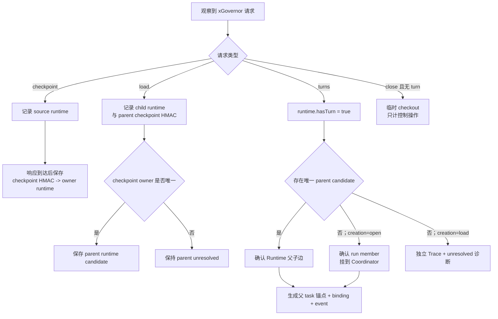
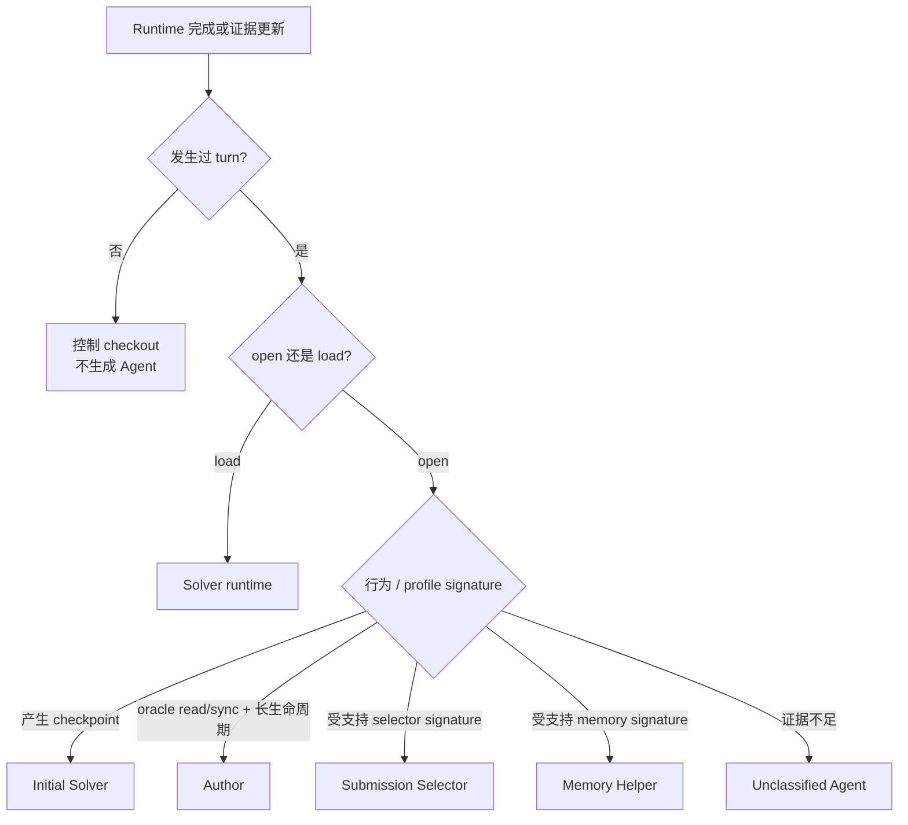
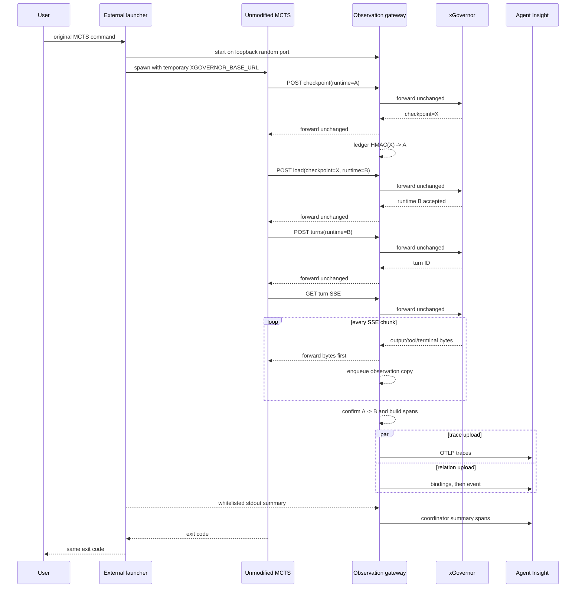

# MCTS 执行 Trace 非侵入式接入：方案设计

## 1. 方案结论

采用 Agent Insight 仓库内的“**外部启动器 + 透明 xGovernor 观测网关 + stdout 白名单解析器**”，完全取消原方案对 MCTS 代码的改动。

新方案不在 MCTS 中增加 bridge、callback、event sink、spool 或任何 import；所有采集能力均由 Agent Insight 安装的独立 collector 提供：

- 外部启动器包裹原始命令，并只给子进程覆盖现有 `XGOVERNOR_BASE_URL`。
- 透明网关原样转发 xGovernor HTTP/SSE，在旁路副本上提取白名单事实。
- checkpoint owner/load 血缘生成精确的 Runtime Agent 树。
- stdout parser 提取 MCTS 已明确输出的 node/score/final tree 摘要。
- OTLP Trace 与 Collaboration binding/event 进入 Agent Insight 现有通道。
- `/trace` 复用现有只读协作投影展示，不修改原生 Execution 树。

该方案能实现“非侵入式执行 Trace + 精确 Runtime 血缘”，但不能声称完整恢复 MCTS 内部语义。`node_id ↔ runtime_id`、backprop 和 MemoryPool 内部事件默认标记为 unavailable。

## 2. 与旧方案的差异

| 项目 | 已废弃的侵入式方案 | 新的非侵入式方案 |
|-|-|-|
| MCTS 源码 | 增加 ObservabilityBridge、sink、callback | 零修改 |
| run identity | MCTS 主动生成并传递 | 读取现有 `lease.client_id` |
| Agent 数据 | MCTS 回调主动上报 | 网关旁路观察 HTTP/SSE |
| Solver 关系 | 读取 `Node.parent` | 读取 checkpoint owner/load 血缘 |
| MCTS node ID | 与 runtime 精确映射 | 通常无法映射，只保留 stdout 摘要 |
| score/backprop/memory | 由内部事件上报 | score/final tree 部分可见；backprop/memory 不可见 |
| 本地可靠队列 | 位于 MCTS 新模块 | 位于 Agent Insight collector 数据目录 |
| 运行风险 | 观测异常可完全旁路 | 网关位于网络路径，存在可缓解但不可消除的残余风险 |

原方案中 `testcases_union/observability/`、修改 `mcts_log.py`、修改 `xgovernor_client.py` 和 Coordinator callback 的设计全部作废。

## 3. 总体架构流程图

```mermaid
flowchart LR
    USER["原 MCTS 命令"] --> LAUNCHER["Agent Insight 外部启动器"]

    subgraph CHILD["MCTS 子进程：源码与参数不变"]
        MCTS["main / Coordinator"]
        XGC["现有 xgovernor_client"]
        MCTS --> XGC
    end

    LAUNCHER -->|"spawn + 信号/退出码透传"| MCTS
    LAUNCHER -->|"仅覆盖子进程 XGOVERNOR_BASE_URL"| XGC

    XGC -->|"HTTP + SSE"| GATEWAY["透明观测网关<br/>转发数据面"]
    GATEWAY -->|"原样流式转发"| XGOV["原 xGovernor upstream"]
    XGOV -->|"响应 / SSE chunks"| GATEWAY
    GATEWAY -->|"原样返回"| XGC

    GATEWAY -.->|"非阻塞事件副本"| OBSERVER["旁路观察器<br/>白名单解析 + 脱敏"]
    LAUNCHER -.->|"stdout/stderr 白名单副本"| OBSERVER
    OBSERVER --> LEDGER["Run / Runtime / Checkpoint ledger"]
    OBSERVER --> TSPOOL["OTLP Trace spool"]
    LEDGER --> ROUTBOX["Binding / Relation outbox"]

    TSPOOL --> OTLP["/api/ingest/otel/v1/traces"]
    ROUTBOX --> BIND["/api/ingest/collaborations/sessions"]
    ROUTBOX --> EVENT["/api/ingest/collaborations/events"]

    OTLP --> ADAPTER["mcts-xgovernor adapter"]
    ADAPTER --> EXEC["Execution + Session"]
    BIND --> COLLAB["Collaboration overlay"]
    EVENT --> COLLAB
    EXEC --> PROJECTION["只读 Trace 投影"]
    COLLAB --> PROJECTION
    PROJECTION --> UI["/trace"]
```



## 4. 部署与启动边界

### 4.1 组件位置

所有新文件位于 Agent Insight，例如：

```text
agent-insight/
└─ scripts/agent-trace-collectors/mcts-xgovernor-proxy/
   ├─ run.cjs
   ├─ gateway.cjs
   ├─ observer.cjs
   ├─ topology-ledger.cjs
   ├─ stdout-parser.cjs
   ├─ otlp-builder.cjs
   ├─ role-classifier.cjs
   ├─ privacy.cjs
   └─ install.cjs
```

运行时数据复用 Agent Insight durable transport，位于 Agent Insight 数据目录：

```text
~/.agent-insight/otel_data/mcts-xgovernor/<api-key-hash>/
├─ YYYY-MM-DD/events.jsonl
├─ runtime-ledger.json
├─ uploader-checkpoint.json
└─ relationships/{pending,delivered,rejected}/
```

不得在 MCTS 仓库创建日志、缓存、配置或锁文件。

### 4.2 启动方式

建议安装后提供命令：

```bash
agent-insight-mcts-run -- \
  bash run_union.sh --mode sweverified --index 0 --split test
```

启动器执行：

1. 读取原 `XGOVERNOR_BASE_URL`；未设置时使用 MCTS 当前默认 `http://127.0.0.1:8787`。
2. 在 loopback 随机空闲端口启动透明网关。
3. 预检 upstream 连通性与网关自检。
4. 以原 cwd、argv、其余环境和 stdin 启动 MCTS，只把子进程 `XGOVERNOR_BASE_URL` 改为网关地址。
5. 转发 stdout/stderr、SIGINT、SIGTERM、终端 resize 和最终退出码。
6. 子进程结束后有界 flush；超时则保留 outbox 后退出。

如果网关或 upstream 在启动前失败，默认 bypass：使用原 URL 直接启动 MCTS，并在本地记录“未采集”。若用户显式选择 strict 模式，才允许因采集预检失败而拒绝启动。

## 5. 网关转发数据面

### 5.1 基本原则

- 转发优先于观测。
- 不等待 parser、spool 或上传完成。
- 请求/响应 chunk 到达后立即转发，同时向有界旁路队列复制。
- 旁路队列满时丢弃观测副本并记录 degraded；不得对 MCTS/xGovernor 施加背压。
- 未识别 endpoint、字段或 content encoding 原样转发，不尝试修改。
- 不增加、删除或重写 xGovernor 业务 header/body。

### 5.2 Endpoint 观察规则

| Endpoint 类别 | 转发 | 观察副本 |
|-|-|-|
| open/load/checkpoint/turns/close/cancel | 流式转发 | 有界 JSON 白名单解析 |
| turn SSE | chunk 立即转发 | 按 SSE event 边界解析副本 |
| files/read | 流式转发 | 只取 runtime 与脱敏 path 类别，不取响应内容 |
| files/write | 流式转发 | 不复制 base64 内容；只记 endpoint/status/bytes |
| exec | 流式转发 | 不记录 command/env/stdout/stderr，只记 runtime/status/latency |
| heartbeat/delete | 流式转发 | 只更新生命周期，不生成用户可见正文 |
| 未知路径 | 原样转发 | 记录 unsupported 计数，不保存正文 |

请求头中的 Authorization、Cookie 和 API token 只存在于转发内存，不得进入通用日志或异常对象。

### 5.3 SSE 处理

SSE 观察器仅消费当前 xGovernor 客户端已使用的事件：

- `output_delta`：assistant/reasoning 增量；
- `tool_activity`：Tool 名称、状态和允许的 summary；
- `turn_completed` / `turn_failed`：usage、outcome 和终态；
- `interaction_requested`：异常诊断；
- xiaoO extension 的 `reasoning_delta`：只在显式开启时保存正文。

原始 SSE bytes 先发给 MCTS，再交给解析队列。解析失败只降低该 turn 的 fidelity，不得关闭 upstream 或 downstream 连接。

## 6. Run 与拓扑 Ledger

### 6.1 稳定身份

```text
clientId          = request.lease.client_id
runKey            = sha256(clientId)
collaborationId   = mcts.<runKey>
coordinatorTrace  = mcts:<runKey>:coordinator
runtimeTrace      = mcts:<runKey>:runtime:<runtimeId>
runtimeLogic      = runtime.<sha256(runtimeId)>
edgeEventId       = edge.<sha256(runKey,parentTrace,childTrace)>
checkpointKey     = hmacSha256(runScopedKey,checkpointId)
traceId           = first16Bytes(sha256(traceSessionId))
spanId            = first8Bytes(sha256(runKey,semanticEventKey))
```

`collaborationId/eventId` 遵守 128 字符 ASCII identifier 契约；Session ID 允许冒号且控制在 512 字符内。原始 checkpoint ID 不落盘，使用 run-scoped HMAC 关联。

### 6.2 Ledger 记录

```ts
type RuntimeLedger = {
  runKey: string
  runtimeId: string
  runtimeKind?: 'xiaoo' | 'pi'
  creation: 'open' | 'load'
  parentCheckpointKey?: string
  parentRuntimeId?: string
  hasTurn: boolean
  turnIds: string[]
  producedCheckpointKeys: string[]
  observedOperations: string[]
  role: 'pending' | 'author' | 'solver' | 'selector' | 'memory-helper' | 'unknown'
  roleEvidence: string[]
  lifecycle: 'active' | 'completed' | 'failed' | 'closed'
}
```

Ledger 是 collector 的本地权威源，不写入 MCTS 或 xGovernor。

## 7. Runtime 血缘重建

### 7.1 确定性规则

```text
checkpoint(runtime=A) -> response checkpoint=X
    checkpointOwner[HMAC(X)] = A

load(checkpoint=X, runtime=B)
    runtimeParentCandidate[B] = checkpointOwner[HMAC(X)]

turn(runtime=B)
    B 是真实 Agent runtime
    若 parent candidate 唯一，则确认 A -> B

close(runtime=B) 且 B 没有 turn
    B 是临时控制 checkout，不生成 Agent Execution
```

这个关系不依赖 stdout 时间、线程或 child 完成顺序。只要 checkpoint 请求/响应和 load 请求均被观察到，就能精确关联。

### 7.2 拓扑重建流程图



### 7.3 与 MCTS node 树的边界

Runtime 血缘只能证明“B 从 A 的 checkpoint checkout 并执行了 Agent turn”。它不能证明 B 在 MCTS 内部被命名为 `root/c0/c1` 还是 `root/c0/c2`。并发 load 到达顺序不得用于赋予 `cN`。

UI 使用 `Solver <runtime-short-id>` 或 `Solver depth=N`。stdout 中的 node ID保留在 Coordinator 摘要，不自动覆盖 Runtime label。

## 8. Role 分类

角色分类在生命周期证据完整后执行，允许 Trace 先以 pending/unknown 保存，再用同一 task ID 确定性重建快照。

| 角色 | 必要证据 | 不满足时 |
|-|-|-|
| Solver child | `creation=load` 且发生 turn，parent checkpoint owner 唯一 | Solver unknown-parent 或 Unknown Agent |
| Initial Solver | `creation=open`、发生 turn、随后产生 full checkpoint | Unknown Agent，不能按启动顺序猜测 |
| Author | `creation=open`、发生 turn、无 checkpoint、观察到 host-side oracle read/sync，且生命周期跨越 startup | Unknown Agent |
| Selector | `creation=open`、发生 turn、tools disabled、max turns/profile fingerprint 与支持矩阵一致 | Unknown Agent |
| Memory Helper | `creation=open`、发生 turn、tools disabled、单 turn profile fingerprint 与支持矩阵一致 | Unknown Agent |
| 临时 score/official checkout | `creation=load`、无 turn、仅 exec/files/control 后关闭 | 不生成 Agent |

`ext.system_prompt` 只在内存中计算 SHA-256 fingerprint，不保存正文。profile 规则与 MCTS baseline 绑定；未知 fingerprint 不进行语义文本猜测。



## 9. Trace 数据采集

### 9.1 OTLP Resource

| 属性 | 值 |
|-|-|
| `service.name` | `mcts-xgovernor` |
| `service.instance.id` | canonical runtime/coordinator traceSessionId |
| `witty.session.id` | canonical runtime/coordinator traceSessionId |
| `agent.insight.framework` | `mcts-xgovernor` |
| `mcts.capture.mode` | `reverse-proxy` |
| `mcts.capture.version` | collector contract version |
| `mcts.run.id` | runKey |
| `mcts.role` | confirmed role 或 `unknown` |
| `mcts.runtime.kind` | `xiaoo / pi / synthetic` |
| `mcts.fidelity` | `xgovernor-sse` |

### 9.2 Span 映射

| 观察事实 | kind | span/tool 名 | 内容 |
|-|-|-|-|
| synthetic run lifecycle | agent | `mcts.coordinator` | argv 摘要、mode/task、起止、退出码 |
| submitted turn | llm | `mcts.turn` | 脱敏 input/output、model、usage、runtime/turn |
| SSE Tool activity | tool | 原 Tool 名 | status、受限 summary、activity ID |
| confirmed child runtime | tool | `task` | child traceSessionId、role、checkpoint lineage |
| runtime open/load/close | tool | `mcts.runtime.lifecycle` | endpoint、状态、耗时，不含 secret |
| temp checkout aggregate | tool | `mcts.control.checkout` | purpose unknown/score-like、操作计数、耗时 |
| stdout choose | tool | `mcts.summary.choose` | iter、node、source=stdout |
| stdout score | tool | `mcts.summary.score` | node、score、timing、testcase version、association=unbound |
| stdout final tree | tool | `mcts.summary.final_tree` | node、visits、value 的受限结构 |
| stdout official | tool | `mcts.summary.official_eval` | node、pass/fail |

父 `task` span 标记 `mcts.synthetic=true`，adapter 映射为 interaction 的 `trace_synthetic=true`。它表达外部观测到的 checkout 调度事实，不冒充模型 Tool call，也不计为 LLM 调用。

### 9.3 保真度声明

每个 Execution metadata 至少包含：

```json
{
  "captureMode": "reverse-proxy",
  "captureFidelity": "xgovernor-sse",
  "runtimeRelation": "checkpoint-lineage",
  "mctsNodeCorrelation": "unavailable",
  "internalBackprop": "unavailable",
  "memoryPoolEvents": "unavailable"
}
```

如果某个 turn 因旁路队列溢出或 SSE 解析失败而不完整，必须改为 `degraded` 并记录缺失范围。

## 10. stdout 白名单摘要

启动器必须把原 stdout/stderr 字节继续发送给用户。解析器在独立副本上去除 ANSI，仅接受版本化正则：

| 格式 | 结构化事件 | Runtime 绑定 |
|-|-|-|
| `▶ startup mode=... task=...` | run metadata | Coordinator |
| `▶ choose iter=N node=X` | choose summary | Coordinator；不绑定 parent runtime |
| `X score=S timing=T testcases=vN` | score summary | Coordinator；默认 unbound |
| `▶ final tree ...` 与树行 | final tree snapshot | Coordinator |
| `OFFICIAL TEST PASS/FAIL node=X` | official result | Coordinator |

解析器不得：

- 上传未匹配行；
- 解析任意 traceback、prompt、LLM 回复或 pytest 输出；
- 以 stdout 时间与 HTTP 时间做 node/runtime join；
- 因格式变化阻断子进程输出。

## 11. 关系上报与步骤定位

### 11.1 Binding

Coordinator 与每个真实 Agent runtime 都建立 binding：

```json
{
  "collaborationId": "mcts.<runKey>",
  "sessionId": "runtime.<runtimeHash>",
  "traceSessionId": "mcts:<runKey>:runtime:<runtimeId>",
  "eventClock": "source_session"
}
```

所有关系和父 `task` timing 都由同一 collector 时钟记录，但 upstream 事件本身可能来自远端，因此使用 `source_session`，不声称跨机器完全同步。显式 child session ID足以让 locator confirmed，不依赖时间排序。

### 11.2 Relation event

```json
{
  "collaborationId": "mcts.<runKey>",
  "eventId": "edge.<edgeHash>",
  "fromSessionId": "runtime.<parentHash>",
  "toSessionId": "runtime.<childHash>",
  "description": "Observed xGovernor checkpoint checkout",
  "observedAt": "2026-09-22T00:00:00.000Z",
  "content": "evidence=checkpoint-lineage; role=solver",
  "fromLocator": {
    "recordType": "tool",
    "name": "task"
  }
}
```

对于 `creation=open` 的 run member，from 端是 Coordinator。对于 `creation=load + turn` 的 Agent，from 端是 checkpoint owner runtime。父 trace 中的 `task` arguments/output 同时包含唯一 child traceSessionId，现有 resolver 可将锚点解析为 confirmed。

若 parent checkpoint owner 缺失，collector 只上传 child Trace 与 Coordinator 诊断，不创建推测关系。

## 12. 端到端时序图



## 13. 本地可靠性设计

### 13.1 进程分层

推荐把转发数据面和观察/上传面分成两个组件：

- Gateway data plane：只负责 socket、HTTP/SSE 透传和向本机有界 IPC 发送副本。
- Observer worker：解析、脱敏、ledger、spool、OTLP/关系上传。

Observer 崩溃或 IPC 不可用时 Gateway 继续转发并增加 dropped counter。Gateway 自身崩溃仍会影响当前连接，因此其依赖和逻辑必须最小化，并由 launcher 监控。

### 13.2 Outbox

```text
observed -> locally_persisted -> sending -> delivered
                                      ├─> retry      (network/408/429/5xx)
                                      └─> rejected   (deterministic 4xx/conflict)
```

- Trace spool、topology ledger 和 relation outbox 分开持久化。
- binding 先于 relation event 投递；OTLP 与 relation event 可并行。
- 稳定 span/event ID保证重放不重复。
- 进程退出只做有界 flush；未完成数据下次由 `flush` 命令处理。
- Agent Insight 不可达不会反向影响 Gateway 转发。

### 13.3 Bypass 与残余风险

- 启动前故障：默认 bypass，MCTS 直接连接原 upstream。
- Observer/upload 故障：Gateway 保持转发，Trace 标记 degraded。
- Gateway parser 故障：停止观察该消息，仍转发原始 bytes。
- Gateway 进程/主机故障：活跃网络连接会断开，无法做到运行中无损 fail-open。

如果部署不能接受最后一项，只能改用 xGovernor 服务端原生镜像/OTel，或为 MCTS/xGovernor 增加显式观测 seam；当前约束下没有同时满足“完全旁路、无特权、支持 HTTPS/SSE、零数据路径风险”的实现。

## 14. Agent Insight 服务端改动

### 14.1 必需改动

| 模块 | 改动 |
|-|-|
| `scripts/agent-trace-collectors/mcts-xgovernor-proxy/*` | 外部启动器、透明网关、observer、ledger、spool 和安装器 |
| `src/lib/ingest/otel/adapters/mcts-xgovernor.ts` | 聚合 proxy OTLP spans 为 ExecutionRecord |
| `src/lib/ingest/otel/adapter-registry.ts` | 注册专用 adapter |
| `src/lib/ingest/framework-reporting-channels.ts` | 声明 OTLP traces + collaboration sessions/events |
| 测试 | proxy 透明性、SSE、checkpoint 血缘、role 降级、stdout 白名单、outbox、adapter、投影 |

### 14.2 无需改动

- MCTS 仓库任何文件。
- xGovernor 服务端和协议。
- Prisma schema/数据库迁移。
- Collaboration 外部 API。
- `Execution.parentExecutionId/rootExecutionId`。
- `/api/observe/session` 的通用只读投影。

### 14.3 Adapter 规则

`mcts-xgovernor` adapter 必须：

1. 匹配 `agent.insight.framework=mcts-xgovernor`。
2. 按 span ID保留最新终态，按 source time/父子/稳定 ID排序。
3. 把 turn 聚合成 user/assistant interaction，把 Tool activity 挂到对应 turn。
4. 保留父 `task` 的 child session ID与 `trace_synthetic=true`。
5. 仅统计 terminal usage，避免 output delta 重复计数。
6. 输出 role evidence、capture mode、fidelity 和 unavailable 能力。
7. 使用 `session_merge_strategy=snapshot-replace`。

由于 payload 声明了 framework，现有 registry 不会回退 generic adapter；专用 adapter 必须先于 collector 发布。

## 15. 与现有 xiaoO/Pi collector 的关系

proxy SSE 是本方案的统一权威源，可同时适配 `xiaoo` 和 `pi`。现有原生 collector 可能提供更细 Tool 数据，但也可能产生重复 Execution。

一期策略：

- MCTS run 只以 proxy Trace 参与 Collaboration 投影。
- 不把 native trace 与 proxy trace 写入同一 task ID。
- 部署侧应为 MCTS runtime 选择 proxy collector 作为唯一主展示通道。
- 已经存在的 native trace 可以独立保留，但 UI 不把它自动合并到 MCTS 树。
- 后续只有在 native trace 暴露与 proxy `runtime_id` 完全相同的显式 identity 时，才设计确定性 enrichment；禁止使用 sticky session 或时间匹配。

## 16. 配置契约

| 配置 | 默认值 | 说明 |
|-|-|-|
| `AGENT_INSIGHT_BASE_URL` | 必填 | Agent Insight 地址 |
| `AGENT_INSIGHT_API_KEY` | 必填才上传 | 只进入请求头 |
| `AGENT_INSIGHT_MCTS_PROXY_ENABLED` | `true`（启动器内） | 是否启用网关；false 直接 bypass |
| `AGENT_INSIGHT_MCTS_UPSTREAM_URL` | 原 `XGOVERNOR_BASE_URL` 或默认值 | xGovernor upstream |
| `AGENT_INSIGHT_MCTS_CAPTURE_REASONING` | `false` | reasoning 正文开关 |
| `AGENT_INSIGHT_MCTS_SPOOL_DIR` | Agent Insight 数据目录 | 不允许指向 MCTS 仓库 |
| `AGENT_INSIGHT_MCTS_MAX_TEXT_BYTES` | 待评审 | input/output/summary 截断上限 |
| `AGENT_INSIGHT_MCTS_MAX_SPOOL_BYTES` | 待评审 | 本地配额 |
| `AGENT_INSIGHT_MCTS_BYPASS_ON_START_FAILURE` | `true` | 预检失败时执行原命令 |
| `AGENT_INSIGHT_MCTS_STRICT` | `false` | 显式要求采集成功才启动 |

真实密钥、内部 URL、账号或路径不得写入 `.env.example` 的示例值。

## 17. 安全与数据最小化

### 17.1 永不持久化

- xGovernor Authorization/Cookie/API token。
- Agent Insight API key。
- `ext.system_prompt` 正文、LLM provider 配置、credential env 名对应的值。
- files/read/write 内容、base64、exec command/env/stdout/stderr。
- 原始 checkpoint ID、完整 HTTP header 或未知 endpoint body。
- 未匹配白名单的 MCTS stdout/stderr。
- 未明确开启的 reasoning 正文。

### 17.2 可持久化白名单

- run/runtime/turn 的哈希或 canonical identity。
- endpoint 类型、状态码、时间、字节数。
- 脱敏截断后的 turn input、assistant output、Tool summary。
- terminal usage/outcome。
- stdout 白名单解析出的 mode/task/node/score/visits/value/pass-fail。
- role evidence code，不保存用于 fingerprint 的 system prompt。

### 17.3 日志

Gateway 错误日志只包含 request ID、endpoint class、status、error code 和 digest。任何 upstream 错误 body 在输出前必须脱敏、截断，且不得自动写入 persistent log。

## 18. 容量与投影限制

- 每个发生 turn 的 runtime 对应一个 Trace Session。
- 默认 MCTS 规模通常低于 Collaboration 的 200 Session 上限。
- collector 默认最多为 180 个 runtime 创建关系，预留 Coordinator 与辅助 Agent 空间。
- 超出关系预算后继续采集独立 Trace，不再创建 binding/event，并在 Coordinator 写 `mcts.projection_truncated`。
- 单 turn delta 应在 collector 本地聚合为终态 span，不能把每个 token delta 作为独立 span 上传。
- SSE/observer 队列必须有字节与事件双重上限，溢出时优先保留 terminal usage 和 lifecycle。

## 19. 测试方案

### 19.1 透明性测试

- 同一 mock xGovernor 请求分别直连和经 Gateway，比较 method、path、headers、body、status 和 response bytes。
- SSE 逐 chunk 比较字节、顺序和断流行为。
- 未知路径、错误响应、超时、cancel、长连接和大 files/write payload。
- Observer 故障/队列满时转发仍成功。
- SIGINT/SIGTERM、stdin、TTY/非 TTY、退出码透传。

### 19.2 拓扑与分类测试

- `checkpoint(A)->X; load(X)->B; turn(B)` 生成 confirmed A→B。
- `load(X)->B; close(B)` 不生成 Agent。
- 同一 parent 并发 3 个 child，乱序完成仍全部挂到 A，不赋予 `c0/c1/c2`。
- owner 缺失、重复 checkpoint、乱序 ledger replay 保持 unresolved 而非猜测。
- initial solver、author、selector、memory helper 与 unknown profile 的降级。

### 19.3 stdout 测试

- ANSI/无 ANSI、分块行、UTF-8 边界、final tree 缩进。
- 白名单行正确结构化；prompt、traceback、pytest 任意正文不上传。
- score 与 HTTP 时间接近时仍保持 `association=unbound`。

### 19.4 端到端验收

| 场景 | 预期 |
|-|-|
| `xiaoo`, branching=1, max-iters=1 | Coordinator、Author、初始 Solver、child Solver；checkpoint 边 confirmed |
| `pi`, branching=1, max-iters=1 | 同一 Runtime 拓扑与 `runtime.kind=pi` |
| branching=3 并发乱序 | 父 runtime 正确，不显示伪造 MCTS `cN` |
| score checkout | 不生成 Agent；控制计数可见 |
| Memory Helper | 真实 turn 可见，标为控制型 Agent |
| selector 未启动 | 不生成 Selector |
| selector 启动 | 作为 Coordinator 子 Agent |
| Insight 离线后恢复 | 本地重放，无重复 span/event |
| Gateway 启动失败 | bypass 执行原命令，退出码一致，本次标记未采集 |
| MCTS 仓库检查 | 运行前后 `git status` 无 collector 造成的变化 |

浏览器验收需确认 `/trace` 树、TASK 锚点、子 Trace 跳转、unknown/degraded 文案和 stdout 摘要；按仓库约定应在开发完成后先询问再启动 dev server。

## 20. 风险与取舍

| 风险/取舍 | 处理 |
|-|-|
| 透明网关位于网络路径 | 极小数据面、旁路 observer、启动失败 bypass；承认运行中 gateway crash 残余风险 |
| 无共同 node/runtime ID | Runtime 树与 MCTS 摘要分离，不做时间 join |
| Role profile 没有显式 ID | 使用版本化结构证据；未知即 unknown |
| stdout 格式不稳定 | 严格白名单、版本化 parser；变化只损失摘要 |
| SSE 仅有归一化 turn/tool summary | 明确 `xgovernor-sse` fidelity，不推断内部多轮 |
| native collector 重复 | proxy 为主通道，不自动合并；精确 identity enrichment 延后 |
| Proxy 能看到敏感流量 | 最小字段白名单、敏感 endpoint 不复制、header/body 永不持久化 |
| 大规模 runtime 超投影限制 | 关系预算 180，超出后 Trace 独立可查并标记截断 |

## 21. 发布顺序

1. Agent Insight 先发布 adapter、reporting channel 注册和单元测试。
2. 发布 collector 安装器、Gateway 和 launcher，默认不改任何 MCTS 文件。
3. 使用 mock xGovernor 做透明性与故障测试。
4. 在测试环境分别运行 `xiaoo`、`pi` golden path，验证 MCTS `git status` 无变化。
5. 完成 `/trace` 浏览器验收和长时并发运行。
6. 验收后再决定是否提供 strict 模式和 native trace enrichment。

## 22. 后续演进

在继续保持 MCTS 零修改的前提下，可增加：

- xGovernor 网关正式版本/能力协商，替代基于 baseline 的 profile signature。
- 专用 Runtime 血缘视图和 MCTS stdout summary 面板。
- native xiaoO/Pi trace 仅在显式 runtime identity 匹配时进行 enrich。
- upstream 服务端原生 traffic mirror/OTel，以移除本机 inline Gateway 风险。

若后续要求精确 `node_id ↔ runtime_id`、每次 backprop、memory provenance 或 UCT 全量回放，必须重新评审约束：这些信息当前不存在于可观察边界，不能通过继续增强外部推断可靠获得。
