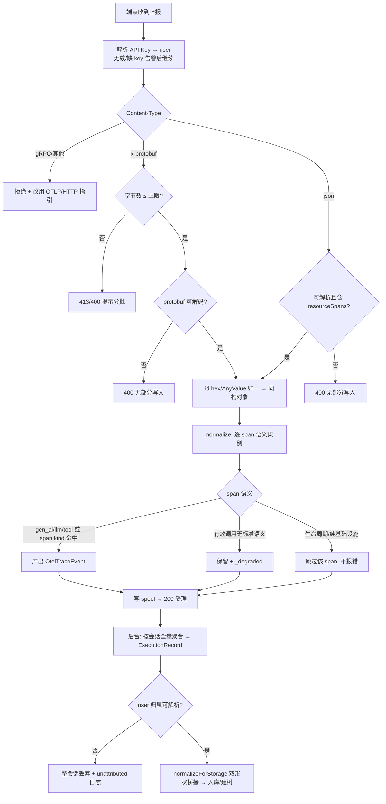

# OpenClaw 平台适配（OTel / OTLP 接入）— 需求设计规格
版本：v0.3
最后更新：2026-06-17

> 文档类型：Phase2 需求设计规格
> 关联项目：agent-insight ｜ 关联 Phase1：[phase1-requirements-analysis.md](phase1-requirements-analysis.md)（v0.3）
> 复杂度评估：**Medium**
> base_commit：5976cbb（master）
> 变更类型：新增能力（feature）
> 状态：**v0.3.1（基于已评审 openclaw-otel-adapter v0.2 重生成 + 现状刷新 → Phase2 评审条件通过 87/100 → 已按 W-1/W-2/W-3/I-2/I-3/I-4 修订）**
>
> **v0.3 核心刷新（据 master 5976cbb 实测，与 v0.2 的关键差异）**：同批两条目标架构**已落地**，故 v0.2 中大量「未落地/回退条款/协商项」已收敛为现实：
> - `otel-spool-consumer` **已落地于 `src/lib/ingest/claude-otel/`**：`traces/route.ts` 已退薄壳（`normalizeClaudeOtlpTraces`→`appendOtelTraceEvents`→`{status:'accepted'}`）；聚合在 `traces-aggregator.ts`（`aggregateOtelTraceSession`/`aggregateOtelTraceEvents`）。
> - `framework-adapter-registry` **已落地于 `src/lib/ingest/adapters/`**：`getAdapter`/`listFrameworks`/`resolveFrameworkId` 可用；skill 调度无裸分支（`getAdapter(fw).extractSkills`）；`openclawAdapter` 已注册，含 `normalizeForStorage?`/`extractSkills?` 扩展点。
> - **实测发现（影响设计）**：①端点 `normalizeClaudeOtlpTraces` 现状只认 `gen_ai.*`/`llm.*`/`tool.name`，**不认 `gen_ai.span.kind`**——openclaw 语义需扩展此判定；②聚合器 `aggregateOtelTraceEvents` 产出 **opencode 式嵌套 `tool_calls`**，而 openclaw 既有 skill 抽取器 `extractSkillsWithVersionsFromOpenClawSession` 读 **扁平 `responseMessage.content` toolCall 块**——双形状不匹配，本设计用**已落地的 `openclawAdapter.normalizeForStorage` 钩子**桥接（比 v0.2 设想更干净）；③聚合器对无 user 事件回退 **`user:'anonymous'`（`traces-aggregator.ts:145`）**——NFR-003 风险真实存在，归属防线落此处。
>
> 关联设计：[`hermes-otel-adapter`](../hermes-otel-adapter/)（同类先行设计）、[`otel-spool-consumer`](../otel-spool-consumer/)（已落地）、[`framework-adapter-registry`](../framework-adapter-registry/)（已落地）。

---

## §1 设计概要

### 1.1 实现思路

总体策略：**双路径客户端 + 复用已落地服务端分层**——OpenClaw 内核自带 OTel 导出（与 hermes「必须装插件」相反），主路径纯配置；服务端不为 openclaw 新建任何通路，复用已落地的薄壳端点 + spool + 后台聚合（`claude-otel/`）与已注册的 `adapters/openclaw.ts`，净新增集中在四点：**protobuf 解码（编码层，框架无关）**、**openclaw 语义识别条目**（`gen_ai.span.kind` 等）、**openclaw 双形状桥接**（经 `normalizeForStorage` 钩子）、**聚合侧归属防线**。**零数据库迁移**。

0. **客户端（双路径，FR-007）**：
   - **主路径·纯配置**：配置 OpenClaw 内置 OTLP exporter 环境变量——`OTEL_EXPORTER_OTLP_TRACES_ENDPOINT=https://<平台>/api/ingest/otel/v1/traces`（signal 专用变量写**全路径**，规避 `OTEL_EXPORTER_OTLP_ENDPOINT` 自动拼接 `/v1/traces` 的 404 陷阱）、`OTEL_EXPORTER_OTLP_HEADERS="x-witty-api-key=<key>"`、`OTEL_SERVICE_NAME=openclaw`、`OTEL_EXPORTER_OTLP_PROTOCOL=http/protobuf`（内置导出唯一支持的编码）。
   - **增强路径·exporter 插件**：复用开源 aliyun 形态 openclaw-exporter（GenAI 语义 span 树 + version-compat 矩阵），配 endpoint/鉴权头指向平台。鉴权头可配置性 = 待验证假设（Phase1 DC-009，T001 验证；失败走 §2.2.0 兜底链）。
   - **兜底·自研插件最小规约**：仅当复用受阻时启用，附录给出 hook→GenAI span→OTLP 导出骨架（含重试/超时/批量/背压要求）。
1. **接收层（薄壳已落地 + 新增 protobuf 解码）**：复用端点 `POST /api/ingest/otel/v1/traces`（根重写自 `/v1/traces`）。本设计在端点「读 body→parse」一步前置**编码分派**：`application/x-protobuf` → 解码 `ExportTraceServiceRequest` → 归一为与 json 同构对象（**id bytes→hex、AnyValue 归一**）→ 汇入既有 `normalizeClaudeOtlpTraces` → 写 spool → 200。**解码发生在归一化之前，下游零分叉**；解码失败/超体量确定性 4xx。当前端点对 protobuf 返回 415（`traces/route.ts:22-27`），本设计将其改为解码受理。
2. **框架标识与变体归一（v0.3.1 据评审 W-3 补全）**：`framework` 由 `service.name` 驱动（聚合器 `traces-aggregator.ts:129` `framework=firstEvent.serviceName`；归一缺省回退 `'unknown-service'`，`otlp-json.ts:142`）。接入规约强制 `OTEL_SERVICE_NAME=openclaw`，与 watcher 路径写入值 `'openclaw'`（`openclaw-parser.ts:160`，已核实）同值单一口径。**关键**：openclaw 的 `normalizeForStorage`/`extractSkills` 仅在 `framework==='openclaw'` 时由 `getAdapter` 命中，故 service.name 变体（如 `openclaw-gateway`）会**静默跳过桥接**。处理：①已知变体经 `resolveFrameworkId`（registry 已落地）归一到 `openclaw`（在 adapter descriptor 的 `aliases` 登记，T001 确认实际缺省值）；②无法归一且落 `unknown-service` 的会话由 attribution-guard 之外的「framework 校验」分支告警并丢弃（不静默落 `unknown-service` 入库、不静默跳过桥接）。
3. **语义识别条目（扩展端点归一 + 聚合）**：现状端点归一仅认 `gen_ai.*`/`llm.*`/`tool.name`。openclaw 需扩展：识别 `gen_ai.span.kind∈{ENTRY,AGENT,LLM,TOOL}`、openclaw span 命名（`invoke_agent`/`chat`/`execute_tool`）、生命周期 span（`session_start·end`/`gateway_start·stop`/`enter_openclaw_system`）归 infra 跳过；未命中标准语义但属有效调用的 span 降级保留（`raw`+`_degraded`）。
4. **双形状桥接（经已落地 `normalizeForStorage` 钩子）**：聚合器产出 opencode 式嵌套 `tool_calls`，而 openclaw 既有 skill 抽取器读扁平 `responseMessage.content` toolCall 块——本设计在 `adapters/openclaw.ts` 实现 `normalizeForStorage`，把 OTel 形状 interaction 桥接为**双形状**：①扁平 toolCall 块置入 `responseMessage.content`（既有 skill 抽取器零改动命中）+ ②opencode 同构 agent 身份标记（`tool_calls[name='task']`/`subagent_type`/`subagent_session_id`/`role`/`agent`，使建树/派生/注册零改动复用）。该钩子已在保存路径被调用（`data-service.ts:1951-1957`，`storageAdapter.normalizeForStorage`）。
5. **下游打通（registry 已生效）**：skill 抽取经 `getAdapter('openclaw').extractSkills`（`data-service.ts:650-653` 调度无裸分支），既有抽取函数零改动（双形状桥接后形状匹配）。唯一存量改动 = 解除 `deriveSubagentExecutions` 的 `framework==='opencode'` 门限（`data-service.ts:2368`，与 hermes 线**潜在共改同一行**，合并策略见 §8.3）。
6. **聚合侧归属防线（NFR-003）**：聚合器现状对无 user 事件回退 `user:'anonymous'`（`traces-aggregator.ts:145`），违反「0 落匿名/他人」。本设计在聚合产出 ExecutionRecord 后、落库前增加归属校验：user 无法解析的会话**不落库**（丢弃 + 结构化日志），不复制 anonymous 兜底。
7. **接入引导（双模式）**：交互式 `setup/route.ts` 当前**无 openclaw**；`setup/auto` 已有 watcher 模式。新增 openclaw 选项并提供 `watcher`（存量）与 `otel`（本设计）双模式入口，强制输出互斥声明（BR-012）；框架清单读 registry `listFrameworks()`，双模式经 `onboardModes?` 与 registry 线协商（descriptor 现为单值 `onboard`）。

### 1.2 设计决策

|编号|决策项|类别|内容|理由|
|-|-|-|-|-|
|D-001|复用已落地 OTLP 通路 + registry，openclaw 为 OTel 第二样板，零 schema 迁移|架构|不新建端点、不改库表、不建第二套接收/转换层；openclaw 语义差异表达为数据化映射条目 + `adapters/openclaw.ts` 的 `normalizeForStorage`/`extractSkills` 能力|spool/registry 已落地即为「下一个框架低成本接入」而生；改动面最小、与现状天然协作|
|D-002|protobuf 解码 = 端点编码分派层适配（框架无关）|协议/架构/兼容|在端点「读 body」处按 Content-Type 分派：protobuf → 解码+归一（**id bytes→hex 为首要正确性**）→ 与 json 汇入同一 `normalizeClaudeOtlpTraces`；解码前先做字节数上限防护。选型优先复用 `@opentelemetry/sdk-node ^0.216.0` 依赖树内已含的 `otlp-transformer`/`protobufjs`，避免重复引入与版本漂移；**选型决定性依据 = traceId/spanId 的 hex 归一正确性**（spanId 是去重键、traceId 是归并键回退，归一错会以「不报错、只裂会话/重复」的隐蔽形态同时击穿 AC-003/004/017）|OpenClaw 内置导出仅 http/protobuf，不解码则纯配置主路径不成立（Phase1 P0）；放编码分派层使下游零感知、框架无关惠及未来框架（NFR-004）|
|D-003|**无归属会话在落库前丢弃（不落 anonymous）**|安全/兼容|聚合器现状 `traces-aggregator.ts:145` 对无 user 事件落 `user:'anonymous'`，违反 NFR-003。本设计在聚合产出后、`saveExecutionRecord` 前增加谓词式归属校验——user 无法解析的会话不落库（丢弃 + 结构化日志，含会话键/原因/事件数）；端点鉴权语义（无效 key 告警后受理）不动，强 401 收敛仍归 spool-consumer 后续轮|端点壳层归 spool-consumer；在落库前设防线既满足 NFR-003 实质（0 落匿名/他人），又不与薄壳「请求内不拒绝」模型冲突。**丢弃不可恢复**口径见 §2.2.3|
|D-004|**双形状桥接经 `openclawAdapter.normalizeForStorage`（已落地钩子）**|架构/数据|聚合器 `aggregateOtelTraceEvents` 产出 opencode 式嵌套 `tool_calls`；openclaw 既有抽取器 `extractSkillsWithVersionsFromOpenClawSession`（`interaction-utils.ts`）读**扁平 `{type:'toolCall', name, arguments}` 块**（置于 `responseMessage.content`/assistant `requestMessages[].content`）。本设计在 `adapters/openclaw.ts` 实现 `normalizeForStorage(interactions)`：把 OTel 形状桥接为**双形状**——①扁平 toolCall 块（skill 链路零改动）+ ②opencode 同构 agent 标记（树/注册链路零改动）。该钩子已在 `data-service.ts:1951-1957` 保存路径被无条件调用（`getAdapter(framework).normalizeForStorage`）。**golden 用例守护**：用既有抽取器/建树**原函数**跑桥接产物，断言 invokedSkills 非空且树结构正确。**已识别副作用**：`deriveSubagentExecutions` 在树为 null 时**非 no-op**——会触发 `sweepStaleSubagents` 清空该 root 下既有子 Execution；缓解 = 聚合按会话**全量**事件重算（`aggregateOtelTraceSession(sessionId)` 语义）+ 专项用例|两条下游链路消费者期望形状不同（skill 链路认扁平 toolCall 块、树链路认 opencode 语义标记），双形状各取所需、两边零改动；用已落地 `normalizeForStorage` 钩子承载比在聚合器内嵌 openclaw 逻辑更干净（聚合器保持框架无关）|
|D-005|客户端双路径分层交付，T001 真实样本前置为第一里程碑|接入/约定|主路径纯配置（零代码、env 规约）；增强路径复用 aliyun 形态插件（语义最全）；自研规约仅兜底。**T001（纯配置/插件两形状各采一条真实 trace）阻塞三项定稿**：semantic 映射条目、agent/skill 语义契约（§4.2 左列）、DC-009 鉴权头验证。**能力差异口径**：若样本证实纯配置路径不携带 agent 身份属性，FR-009 子 Agent 树在主路径退化为单 Execution（安全退化、不报错），接入引导须明示两路径能力差异|不臆造属性约定（Phase1 BR-010）；先复用后自研，平台不维护客户端代码|
|D-006|watcher 并存 + 互斥指引 + 单一框架标识|兼容/数据|watcher 链路（`openclaw-watcher.ts`/`openclaw-parser.ts`）**冻结不动**；OTel 为新增可选接入；两路 framework 同值 `openclaw`（BR-001）；接入引导强制声明「同一实例只开一路」，平台不实现双路去重（双开重复 = 已知限制）|用户确认的边界；双路去重需跨「文件会话 id ↔ OTLP 会话键」对齐，复杂度高收益低|
|D-007|接入引导与 registry 对接：框架清单单一出处 + onboard 多模式协商|架构/兼容|框架清单唯一出处 = registry `listFrameworks()`；openclaw descriptor 现为单值 `onboard:'plugin'`，双模式（watcher+otel）需 registry `FrameworkDescriptor` 增加可选 `onboardModes?`（缺省 `[onboard]`，向后兼容），由 registry 线协商采纳；未闭环则引导内按需输出双模式 + 标注待收编|registry 红线「框架清单单一出处」；跨线接口变更走协商而非旁路|

---

## §2 架构设计

### 2.0 分层目标架构（已落地分层 + 本设计净新增——必读）

```
┌─ 客户端（OpenClaw 进程内，双路径二选一）────────────────────────────────┐
│  路径①纯配置(主): OpenClaw 内置 OTel 导出(http/protobuf)                       │
│     env: OTEL_EXPORTER_OTLP_TRACES_ENDPOINT(全路径) / OTLP_HEADERS            │
│          (x-witty-api-key) / OTEL_SERVICE_NAME=openclaw                       │
│  路径②插件(增强): aliyun 形态 openclaw-exporter (GenAI 语义 span 树,           │
│     version-compat 矩阵; 鉴权头假设 DC-009 待 T001)                           │
│  兜底: 自研插件最小规约(仅复用受阻时; 附录交付)                                 │
│  ⚠ 与本地 watcher 互斥: 同一实例只开一路 (BR-012)                              │
└───────────────────────────────┬──────────────────────────────────────┘
                                 │ OTLP/HTTP (protobuf 或 json) 上报
┌─ 服务端·接收层（已落地薄壳 + 本设计 D-002 新增解码）─────────────────────┐
│  [薄壳 traces/route.ts] (已落地)                                              │
│    ★净新增: Content-Type 编码分派 — x-protobuf → 解码+归一(id hex)            │
│    → (与 json 汇合) → normalizeClaudeOtlpTraces (扩 openclaw 语义条目)        │
│    → appendOtelTraceEvents 写 spool → 200                                    │
│    (解码前字节上限; 解码失败 400; gRPC 维持拒绝+指引; protobuf 现状 415→受理)  │
│  [后台消费者 otel-consumer/consumer.ts] 按 dirty session 调 aggregate → save  │
└───────────────────────────────┬──────────────────────────────────────┘
                                 │ aggregateOtelTraceSession(sessionId) — 按会话全量
┌─ 服务端·转换层（已落地聚合器 claude-otel + registry adapter，本设计扩展）────┐
│  [traces-aggregator] OtelTraceEvent[] → interaction[] → ExecutionRecord       │
│     (已落地; 框架无关; 产出 opencode 式嵌套 tool_calls; user 回退 anonymous)    │
│     ★净新增(在 otel-consumer/consumer.ts 两处 save 前): attribution-guard      │
│       (无归属丢弃, 判定复用 isServiceTraceOwner, D-003)                        │
│  [adapters/openclaw.ts] (已注册)                                              │
│     ★净新增: normalizeForStorage 双形状桥接(扁平 toolCall 块 + opencode 标记)  │
│     extractSkills: 既有函数(桥接后形状匹配, 零改动)                            │
└───────────────────────────────┬──────────────────────────────────────┘
                                 │ saveExecutionRecord（唯一落库出口）
┌─ 服务端·落库/复用层（存量，仅 1 处解门）───────────────────────────────┐
│  saveExecutionRecord → normalizeForStorage(getAdapter) 已调用(:1957) →         │
│  解 :2368 opencode 门(纳入 openclaw) → deriveSubagentExecutions /              │
│  buildAgentCallTree / extractObservedAgentRegistrations（函数体零改动）         │
│  （watcher-openclaw 存量数据过门安全退化, 入回归）                              │
└──────────────────────────────────────────────────────────────────────┘
```

**与已落地分层的职责切分（互不重叠）**：

| 关注点 | 归属 | openclaw 线在此做什么 |
|-|-|-|
| 客户端产出 OTLP | **本设计** | 双路径接入规约（零客户端代码） |
| 薄壳端点/spool/后台消费者 | `otel-spool-consumer`（已落地） | 仅在端点「读 body」前置编码分派一步（D-002）；其余不碰 |
| getAdapter/listFrameworks 查表 | `framework-adapter-registry`（已落地） | 在已注册的 `adapters/openclaw.ts` 上扩展 `normalizeForStorage`；`onboardModes` 协商 |
| openclaw 专有语义/桥接/归属防线 | **本设计** | 语义条目 + `normalizeForStorage` 双形状桥接 + 聚合侧 attribution-guard |

### 2.1 架构变更

#### 2.1.1 变更总览

> 图例：🔵外部 🟢新增 🟡修改 🔴保护(被调用但本期禁止改) ⚪不涉及。接口命名 IF-{E外部/N新内部/M改内部/R复用内部}{编号}。

```mermaid
graph LR
    classDef ext fill:#87CEEB,stroke:#333,color:#000
    classDef add fill:#90EE90,stroke:#333,color:#000
    classDef mod fill:#FFD700,stroke:#333,color:#000
    classDef pro fill:#FF6B6B,stroke:#333,color:#000
    classDef unt fill:#E0E0E0,stroke:#999,color:#666

    subgraph ext_box["📦 外部"]
        OC1["[OpenClaw 内置导出] <br/>http/protobuf (纯配置)"]:::ext
        OC2["[aliyun 形态 exporter 插件] <br/>GenAI 语义 span 树"]:::ext
        UV["[平台用户] <br/>观测/评测"]:::ext
    end

    subgraph ingest["📦 api/ingest/otel/v1/traces (薄壳, 已落地)"]
        R0["[Add] otlp-protobuf-decoder <br/>编码分派+解码+id hex 归一 (D-002)"]:::add
        R1["[Mod] route.ts <br/>:22-27 protobuf 415→解码受理"]:::mod
    end

    subgraph claudeotel["📦 src/lib/ingest/claude-otel (已落地, 本设计扩展)"]
        N1["[Mod] otlp-json.normalizeClaudeOtlpTraces <br/>+gen_ai.span.kind/生命周期 infra/降级"]:::mod
        A1["[Pro] traces-aggregator.aggregateOtelTraceEvents <br/>框架无关, 不改"]:::pro
        AG["[Add] attribution-guard <br/>无归属会话丢弃 (D-003)"]:::add
    end

    subgraph registry["📦 src/lib/ingest/adapters (registry 已落地)"]
        RG1["[Mod] openclaw.ts <br/>+normalizeForStorage 双形状桥接"]:::mod
        RG2["[Pro] registry.ts / types.ts <br/>onboardModes 走协商"]:::pro
    end

    subgraph storage["📦 src/lib/storage / observability"]
        S1["[Mod] data-service.saveExecutionRecord <br/>:2368 解 opencode 门"]:::mod
        S2["[Pro] interaction-utils.extractSkills...OpenClawSession <br/>不改(桥接为其期望形状)"]:::pro
        S3["[Pro] deriveSubagentExecutions / sweepStaleSubagents <br/>不改(全量聚合缓解 sweep)"]:::pro
        S4["[Pro] buildAgentCallTree <br/>不改(消费 opencode 同构标记)"]:::pro
        S5["[Pro] agent-registration <br/>不改(框架无关)"]:::pro
    end

    subgraph setup["📦 src/app/api/ingest/setup(+auto)"]
        ST1["[Mod] route.ts / auto/route.ts <br/>+openclaw OTel 双模式引导+互斥声明"]:::mod
    end

    subgraph frozen["📦 冻结区"]
        F1["[Pro] openclaw-watcher.ts / openclaw-parser.ts"]:::pro
        F2["[Unt] otel/v1/logs·metrics (Claude 依赖)"]:::unt
        F3["[Unt] prisma schema (无迁移)"]:::unt
        F4["[Unt] opencode/claude/hermes 既有分支"]:::unt
    end

    OC1 -->|"IF-E01: OTLP 上报(protobuf)"| R1
    OC2 -->|"IF-E01: OTLP 上报(protobuf/json)"| R1
    R1 -->|"IF-N01: 解码+id hex 归一"| R0
    R1 -->|"IF-R01: normalize→写 spool→200"| N1
    N1 -.->|"(后台) aggregate"| A1
    A1 -->|"IF-N05: 归属判定(谓词)"| AG
    AG -->|"pass → saveExecutionRecord"| S1
    S1 -->|"IF-N02: normalizeForStorage 双形状桥接"| RG1
    S1 -->|"IF-M01: skill 抽取(getAdapter)"| RG1
    RG1 -.->|"IF-R02: 复用既有抽取函数"| S2
    S1 -->|"IF-M02: 解门→派生子 Agent 树"| S3
    S3 -.->|"IF-R03: 建树"| S4
    S1 -.->|"IF-R05: 自动注册"| S5
    UV -->|"IF-R06: 观测/评测查询(复用)"| S1
    ST1 -.->|"IF-R04: listFrameworks(onboardModes 协商)"| RG2
```



#### 2.1.2 模块变更

|模块|变更|职责|接口|依赖|约束|
|-|-|-|-|-|-|
|`otlp-protobuf-decoder`（新增，建议 `src/lib/ingest/claude-otel/`，与归一同目录）|新增|Content-Type 编码分派；`ExportTraceServiceRequest` 解码；**traceId/spanId bytes→hex、AnyValue 归一**为与 OTLP/JSON 同构对象；解码前字节上限；解码失败确定性 400|IF-N01|`@opentelemetry/sdk-node` 依赖树内 otlp-transformer/protobufjs（Phase3 选型）|纯函数可单测；产物与 json 路径**字段级同构**（AC-003）；不得引入下游分叉|
|`.../otel/v1/traces/route.ts`|修改|`:22-27` 的 `application/x-protobuf` 由「返回 415」改为「调 decoder → 汇入既有 json 后续」；gRPC/未知类型维持拒绝+指引（文案更新）|IF-E01|otlp-protobuf-decoder|仅改编码分派一处；禁改 `/v1/logs`、`/v1/metrics`；不在 route 内联落库（薄壳已落地）|
|`claude-otel/otlp-json.ts::normalizeClaudeOtlpTraces`|修改|扩展 openclaw 语义识别：现状只认 `gen_ai.*`/`llm.*`/`tool.name`（`:155-157`），新增 `gen_ai.span.kind∈{ENTRY,AGENT,LLM,TOOL}` 分类；openclaw 生命周期 span（`session_start·end`/`gateway_start·stop`/`enter_openclaw_system`）归 infra 跳过；未命中标准语义但有效调用 → 降级保留（`raw`+`_degraded`，写入 OtelTraceEvent.attributes 透传）|IF-N03|映射条目数据化|仅加判定分支/数据条目，不改既有 claude/opencode 路径行为；据 T001 样本定稿|
|`attribution-guard`（新增，建议 `src/lib/ingest/claude-otel/`）|新增|聚合产出 ExecutionRecord 后、落库前校验 user 归属：无法解析 user 的会话**不落库**，丢弃 + 结构化日志（会话键/原因/事件数）；不复制聚合器 `:145` 的 anonymous 兜底|IF-N05|—|纯函数谓词 + 调用处一次判定；**不改端点鉴权语义**（D-003）；对全部 OTLP 框架生效（框架无关）|
|`adapters/openclaw.ts`（registry 已注册文件）|修改|新增 `normalizeForStorage(interactions)`：把 OTel 形状桥接为**双形状**（扁平 toolCall 块置 `responseMessage.content` + opencode 同构 agent 标记）；`extractSkills` 维持指向既有函数（桥接后形状匹配，零改动）|IF-N02/IF-M01|interaction-utils（复用）、registry|`normalizeForStorage` 已在 `data-service.ts:1957` 被调用，注册即生效；不在 dispatcher 加裸分支|
|`data-service.ts::saveExecutionRecord`|修改|**唯一存量逻辑改动点**：解除 `deriveSubagentExecutions` 的 `framework==='opencode'` 门限（`:2368`），纳入 openclaw（与 hermes 线潜在共改同一行，合并策略 §8.3）|IF-M02|deriveSubagentExecutions|仅改门限判断；opencode/claude/hermes 路径行为零变更；watcher-openclaw 存量过门安全退化（回归 TC）|
|`setup/route.ts` + `setup/auto/route.ts`|修改|交互式新增 openclaw（当前缺失）；双模式引导（watcher 保留 + OTel 新增：env 块/插件块）+ 互斥声明|IF-R04|registry `listFrameworks()`|bash+PS、setup+auto 多副本一致；框架清单不另建出处|
|`interaction-utils.ts::extractSkillsWithVersionsFromOpenClawSession`|保护/复用|**不改**。`normalizeForStorage` 桥接把 OTel skill 归一为其期望的扁平 toolCall 块|IF-R02|—|函数体冻结；如 T001 证实形状缺口，先改桥接端|
|`traces-aggregator.ts`/`deriveSubagentExecutions`/`sweepStaleSubagents`/`buildAgentCallTree`/`agent-registration`|保护/复用|**不改**。聚合器框架无关；建树/派生/注册消费桥接后的同构 interaction；sweep 副作用由全量聚合缓解 + 专项用例|IF-M02/R03/R05|—|函数体冻结；禁止让建树读 parentSpanId|
|`openclaw-watcher.ts`/`openclaw-parser.ts`、`otel/v1/logs·metrics`、`prisma schema`、opencode/claude/hermes 分支|保护/不涉及|存量链路与其余冻结区|—|—|显式防误改；无 DB 迁移|

### 2.2 模块详情

#### 2.2.0 客户端接入（双路径规约，FR-007/AC-016 交付物——平台不写客户端代码）

- 负责职责：让 OpenClaw 产出指向平台的标准 OTLP；交付「接入规约」文档（FR-007 承载体）。
- 功能性设计：
  1. **纯配置规约（主路径）**：`OTEL_EXPORTER_OTLP_TRACES_ENDPOINT`（signal 专用变量、全路径，规避 `OTEL_EXPORTER_OTLP_ENDPOINT` 自动拼接 404）/`OTEL_EXPORTER_OTLP_PROTOCOL=http/protobuf`/`OTEL_EXPORTER_OTLP_HEADERS="x-witty-api-key=<key>"`/`OTEL_SERVICE_NAME=openclaw`。
  2. **插件规约（增强路径）**：aliyun 形态 exporter 安装（一键脚本 + version-compat 矩阵机制说明）；endpoint/鉴权头指向平台；**鉴权头假设（DC-009）** T001 验证。
  3. **自研兜底最小规约（附录）**：插件清单 + hook 挂载（agent/LLM/tool 生命周期）→ GenAI 语义 span（对齐 `gen_ai.span.kind`）→ 批量 OTLP/HTTP 导出；硬性要求：静默失败不阻塞 Agent、重试/超时/批量/背压、截断上限。
  4. **互斥声明**：同一实例 watcher 与 OTel 只开一路（BR-012），规约与引导双处声明。
- 非功能设计：①属性事实即契约输入（§4.2 左列与映射条目唯一事实来源，T001 定稿，不臆造）；②能力差异口径（D-005）——纯配置路径保证观测/归并/token/延迟，子 Agent 树与 skill 版本完整能力以插件路径为准（纯配置若无 agent 身份属性则安全退化为单 Execution）。
- 风险与缓解：①DC-009 不成立 → 兜底链（平台兼容 `Authorization: Basic` 头评估 / 自研兜底规约）；②插件 version-compat 随升级失效（S-018）→ 规约写明升级回归要求，纯配置不受影响。

#### 2.2.1 protobuf 解码与编码分派（otlp-protobuf-decoder，D-002）

- 负责职责：把 `application/x-protobuf` 的 `ExportTraceServiceRequest` 安全、确定性地解码并归一为与 OTLP/JSON 完全同构对象，使下游（既有 `normalizeClaudeOtlpTraces`）零分叉。
- 功能性设计：
  1. 编码分派：`application/json` → 现行 parse；`application/x-protobuf` → 本模块解码；gRPC/其他 → 维持显式拒绝 + 指引（FR-014）。
  2. **归一化适配（解码正确性核心）**：traceId/spanId/parentSpanId **bytes→lowercase hex**（OTLP/JSON 约定 hex；protobufjs 默认 toJSON 产 base64——首要测试与选型依据）；AnyValue oneof 展开（既有 `getOtelAnyValue` 已处理 `stringValue/intValue/...`，解码产物须喂入同一结构）；attributes 保持 KeyValue list（不提前扁平化，交给既有 `otelAttrsToObject`）。
  3. 防护顺序：字节数上限（解码前）→ 解码（失败 400）→ span 批量上限（超限 4xx + 分批提示）→ 归一化 → 汇入 json 路径同一后续（`normalizeClaudeOtlpTraces`）。
- 非功能设计：纯函数、无 I/O；单测覆盖合法/非法字节流/超体量/id 归一（与 json 同 trace 对比，AC-003）/AnyValue 各类型；内存有界（解码前限字节数，NFR-008）。
- 风险与缓解：①解码库 toJSON 行为差异（base64 vs hex）→ Phase3 以 id 归一正确 + 依赖树复用为决定性依据；TC-003 等价性守护；②proto 版本漂移 → 锁定依赖版本，升级走回归。

#### 2.2.2 openclaw 语义识别与双形状桥接（normalizeClaudeOtlpTraces 扩展 + adapters/openclaw.ts，D-004）

- 负责职责：把 openclaw（纯配置/插件两形状）的 OTLP span 确定性识别为内部 interaction，并桥接为下游两条链路各自期望的形状。
- 功能性设计：
  1. **端点归一扩展（`otlp-json.ts`）**：现状 `:155-157` 仅 `gen_ai.*`/`llm.*`/`tool.name` 命中。新增——`gen_ai.span.kind∈{LLM→llm, TOOL→tool, AGENT/ENTRY→agent 边界（记入 attributes 供桥接用）}`；`chat`→llm、`execute_tool`→tool；生命周期 span（`session_start·end`/`gateway_start·stop`/`enter_openclaw_system`）→ infra 跳过（不产 OtelTraceEvent，对应 S-010）；未命中标准语义但有效调用 → 保留并打 `_degraded`（透传 attributes，S-011/FR-005）。**仅扩展判定，不改既有 claude/opencode 行为**（新增 `gen_ai.span.kind` 与生命周期识别仅在原判定基础上叠加）。
  2. **双形状桥接（`adapters/openclaw.ts::normalizeForStorage`）**：聚合器产出的 interaction（assistant + 嵌套 `tool_calls[{id,type:function,function:{name,arguments}}]`）→ 桥接为双形状：
     - **形状A（skill 链路）**：把工具/skill 调用产出为**扁平块 `{type:'toolCall', name, arguments}`** 并置入 interaction 的 `responseMessage.content[]`（既有抽取器 `extractSkillsWithVersionsFromOpenClawSession` 的实际读取位置与形状；watcher 路径 `openclaw-parser.ts:140-145` 同款）。**禁止**产出嵌套 `toolCall:{...}` 对象或置于顶层 `content[]`（抽取器读不到、会静默丢 skill）。
     - **形状B（树/注册链路）**：agent 边界（`gen_ai.span.kind=AGENT`/`invoke_agent` 嵌套 + parentSpanId）→ opencode 同构标记（`tool_calls[name='task']`/`subagent_type`/`subagent_session_id`/`role`/`agent`，§4.2 契约）。两类字段共存于同一 interaction，旧消费者忽略未知字段。
  3. `normalizeForStorage` 已在 `data-service.ts:1951-1957`（`storageAdapter.normalizeForStorage`）被无条件调用，故注册即生效，无需改保存路径调用点。
- 非功能设计：①数据化条目 + 纯函数，单测覆盖标准/插件/纯配置/降级/infra/无 agent 退化路径；②与 opencode 等价（NFR-007）：同构多 Agent 运行产出同构树（AC-012）；③**golden 用例（skill 契约守护）**：用 `extractSkillsWithVersionsFromOpenClawSession` **原函数**跑桥接产物，断言 invokedSkills 非空 **且 version 字段被正确提取**（抽取器 `:163` 读 `arguments.version`；I-4：golden 须含带 version 样本，守护 §4.2「skill 名/版本」契约，防形状漂移静默丢 skill 或丢版本）。
- 风险与缓解：①两路径属性丰富度差异（DC-008）→ T001 双形状采样定稿，纯配置缺 agent 身份 → 单主 Agent 安全退化 + 引导明示能力差异；②trace 碎片化（已知限制）→ 归并键回退 traceId 时多会话，需求层已定可接受；插件路径 span 树重建天然缓解。

#### 2.2.3 后台消费者侧归属防线（attribution-guard，D-003）

- 负责职责：保证 NFR-003「归入匿名/他人发生率 0」在「端点不拒绝匿名」的薄壳语义下仍成立。
- **精确落点（v0.3.1 据评审 W-1 修正）**：聚合在 `claude-otel/`（`aggregateOtelTraceSession`），但**调用 `saveExecutionRecord` 的后台消费者在 `src/lib/ingest/otel-consumer/consumer.ts`**。归属判定须插在「`source.aggregate(sessionId)` 之后、`state.saveExecution(...)` 之前」——**两处 save 调用各拦一次**：常规落库（`consumer.ts:202-204`）与 force_judgment 重判落库（`consumer.ts:225-230`，I-2：重判路径不得绕过防线）。建议把 guard 包成 `saveExecution` 包装器（在 `createConsumer` 的 `options.saveExecution` 注入处统一拦截），避免两处重复且天然覆盖重判路径。
- 功能性设计：
  1. 谓词纯函数 `guardAttribution({user, taskId, framework, eventCount})` → `{pass} | {drop, reason:'unattributed'}`；drop 时记结构化日志并**不落库**。
  2. **判定口径（v0.3.1 据评审 W-2 修正）**：聚合器 `traces-aggregator.ts:145` 已把空 user 兜底为字面量 `'anonymous'`，故 `record.user` 永不为空——单判 `!user` 会**永远 pass、防线失效**。guard 必须把「`user` 为空 **或** `isServiceTraceOwner(user)` 命中」判为未归属 → drop。**复用既有 `isServiceTraceOwner`（`data-service.ts:165`）与 `TRACE_SERVICE_OWNERS`（`:160`，默认 `admin,anonymous`）**，不自造判定，且与既有 service-owner 归还逻辑（真实用户 trace 不动）不冲突。
  3. 对全部 OTLP 框架生效（框架无关防线）。
- 非功能设计：丢弃可观测（NFR-006 日志含丢弃计数与原因），用户可自助定位「为何未呈现」=「key 未配/配错」。
- 风险与缓解：①与 spool-consumer 端点鉴权语义衔接 → 本防线在消费者落库前，不触碰端点壳层；②**丢弃不可恢复（显式口径）**：会话被丢弃后消费检查点照常推进，事后补配 key **无法追溯呈现历史数据**（仅 spool 保留期内可手工重放补救）；排障指引须明示该边界。

#### 2.2.4 子 Agent 树 / 自动注册 / skill 全链路（复用为主）

- 负责职责：openclaw OTel 会话获得与 opencode 等价的子 Agent 树、自动注册、invokedSkills。
- 功能性设计：
  1. **子 Agent 树**：`normalizeForStorage` 桥接产出 opencode 同构标记 → 解 `:2368` 门纳入 openclaw → `buildAgentCallTree`/`deriveSubagentExecutions` 零改动产出多条 Execution（字段已存在，无迁移）。
  2. **自动注册**：`extractObservedAgentRegistrations` 框架无关，interaction 携带 `agent/subagent_name/role` 标记即自动注册（platform=openclaw）；去重 (platform,name,user)。
  3. **skill**：桥接归一为扁平 toolCall 块 → `getAdapter('openclaw').extractSkills`（既有函数）零改动；子 Agent 加载的 skill 随同构标记归属到对应节点。
- 风险与缓解：①**sweep 副作用**：`deriveSubagentExecutions` 树为 null 时经 `sweepStaleSubagents` 清空 root 下既有子 Execution——若某次重聚合缺 agent 标记会误删。缓解：按会话**全量**事件重算（`aggregateOtelTraceSession` 语义）+ 专项用例 + watcher 存量首次过门（无子行）回归确认 no-op；②watcher interactions 无 `tool_calls[name='task']` → 树 null → 与现状等价（单 Execution），纳入 NFR-001 回归。

#### 2.2.5 接入引导（setup 双模式，FR-006）

- 负责职责：让用户在引导内完成 openclaw 的 watcher 或 OTel 任一模式接入。
- 功能性设计：①交互式 `setup/route.ts` 新增 openclaw（当前缺失）；`setup/auto` 在既有 watcher 项上增加 OTel 模式分支；②OTel 模式输出纯配置 env 块（含全路径 endpoint 说明）或插件安装块，均嵌互斥声明；③框架清单读 registry `listFrameworks()`；openclaw 多模式经 `onboardModes` 协商（D-007）。
- 风险与缓解：bash+PS、setup+auto 多副本一致性 → 配置块抽共享常量/模板，Phase3 列一致性核验。

### 2.3 功能影响

```text
- agent-insight
  - 客户端 (零平台代码): openclaw 双路径接入规约 (纯配置 env / aliyun 插件 / 自研兜底附录)
  - 数据接入 (ingest)
    - traces 端点编码分派 + protobuf 解码 (框架无关, 净新增)
    - claude-otel/otlp-json 归一扩展 openclaw 语义条目 (gen_ai.span.kind/生命周期 infra/降级)
    - claude-otel 聚合侧归属防线 (无归属会话不落库, 框架无关)
  - 转换 (adapters/openclaw.ts): normalizeForStorage 双形状桥接 (扁平 toolCall + opencode 标记)
  - 观测: framework=openclaw 的 OTel 会话自动出现于筛选与链路 (与 watcher 同一口径)
  - 多 Agent / 注册: 解 :2368 门拆多条 Execution + 树; 主/子 Agent 自动注册 (复用框架无关函数)
  - Skill: 桥接后既有 openclaw 抽取器零改动 (经 getAdapter)
  - 评测: openclaw OTel 主/子 Agent 可作为「从 Trace」评测对象
  - 接入引导 (setup): openclaw 双模式 (watcher 保留 + OTel 新增) + 互斥声明
```

|功能|变更|变更点|对应需求|
|-|-|-|-|
|客户端接入|增|双路径接入规约 + 自研兜底附录 + 互斥声明|FR-007/BR-010/BR-012|
|OTLP protobuf 受理|增|编码分派 + 解码 + id hex/AnyValue 归一 + 解码前防护|FR-002/BR-004/DC-005|
|OTLP 语义识别|改|otlp-json 扩 openclaw 条目（gen_ai.span.kind/生命周期/降级）|FR-001/003/005|
|双形状桥接|增|adapters/openclaw.ts normalizeForStorage|FR-011/FR-009（桥接 agent 标记）|
|framework 标识|改|service.name=openclaw 校验，缺失/变体告警不静默|FR-004/BR-001|
|鉴权归属|增|聚合侧无归属会话丢弃（端点语义不动）|BR-003/NFR-003|
|健壮性|增|畸形 protobuf 400、超体量/批量 4xx、字段截断|FR-013/BR-006|
|子 Agent 树|增|解 :2368 门，复用 deriveSubagentExecutions，sweep 缓解|FR-008/009/BR-007/NFR-007|
|agent 注册|增|桥接携带标记，复用框架无关注册|FR-010/BR-008|
|Skill 解析|复用|桥接为扁平 toolCall 形状，既有抽取器零改动|FR-011/BR-009|
|接入引导|改|openclaw 双模式 + 互斥声明 + listFrameworks 单一出处|FR-006/BR-012/NFR-005|
|评测承接|复用|主/子 Agent 随 Execution 入库自动承接|FR-015|
|不支持传输反馈|改|gRPC 维持拒绝 + 指引更新（protobuf 已支持）|FR-014|
|接入可自检|增|受理侧 + 处理侧（含 unattributed 丢弃）双处结构化日志|NFR-006|

---

## §3 核心流程

### 3.1 主流程（双路径客户端 → 编码分派薄壳 → spool → 聚合 → 归属防线 → 双形状桥接 → 入库）

```mermaid
sequenceDiagram
    participant C as OpenClaw 客户端<br/>(内置导出 protobuf / 插件)
    participant R as traces/route.ts (薄壳)
    participant PD as otlp-protobuf-decoder
    participant NJ as normalizeClaudeOtlpTraces
    participant SP as traces spool (JSONL)
    participant CO as 后台消费者
    participant AGG as aggregateOtelTraceSession
    participant AG as attribution-guard
    participant D as saveExecutionRecord (唯一出口)
    participant NS as openclawAdapter.normalizeForStorage
    participant V as 观测/评测看板

    C->>R: POST /v1/traces (x-witty-api-key)
    R->>R: 解析 user (无效 key 告警后继续, 端点语义不动)
    alt Content-Type = x-protobuf
        R->>PD: 字节上限校验 → 解码 → id hex 归一
        PD-->>R: 同构对象 / 解码失败 400
    else json
        R->>R: 现行 parse / 畸形 400
    end
    R->>NJ: 归一(扩 openclaw 语义: span.kind/生命周期 infra/降级)
    NJ-->>R: OtelTraceEvent[]
    R->>SP: appendOtelTraceEvents
    R-->>C: 200 受理(accepted)
    loop 后台 / dirty session
        CO->>AGG: aggregateOtelTraceSession(sessionId) — 按会话全量
        AGG-->>CO: ExecutionRecord (framework=openclaw; user 可能为空)
        CO->>AG: guardAttribution
        alt drop (user 无法解析)
            AG-->>CO: {drop, unattributed} → 不落库 + 日志 (丢弃不可恢复)
        else pass
            CO->>D: saveExecutionRecord
            D->>NS: normalizeForStorage 双形状桥接(:1957 已调用)
            D->>D: 解 :2368 门 → 建树/派生/注册 / extractSkills(getAdapter)
        end
    end
    V->>D: 按 framework=openclaw 查询
    D-->>V: 会话/链路/可评测对象(异步可见)
```

### 3.2 异常与边界判定（决策分支）



---

## §4 算法设计

### 4.1 protobuf 解码归一（otlp-protobuf-decoder）

**目标**：使 protobuf 路径解码产物与 OTLP/JSON 路径**字段级同构**，保障 AC-003（等价）、AC-004（spanId 去重）、AC-017（traceId 归并回退）同时成立。

**核心逻辑**：

```
function decodeOtlpProtobuf(rawBytes, limits):
    assert rawBytes.length <= limits.maxBytes        # 解码前防护 → 413/400
    msg = ExportTraceServiceRequest.decode(rawBytes)  # 失败 → 400
    obj = toJsonLike(msg) with:
        traceId/spanId/parentSpanId: bytes → lowercase hex   # ★首要归一(非 base64)
        AnyValue: oneof 保持 {stringValue|intValue|...} 结构（喂给既有 getOtelAnyValue）
        attributes: 保持 KeyValue list（喂给既有 otelAttrsToObject）
    assert countSpans(obj) <= limits.maxSpans         # 批量防护 → 4xx+分批提示
    return obj   # 与 JSON.parse(jsonBody) 同构, 汇入同一 normalizeClaudeOtlpTraces
```

**复杂度**：O(字节数) 解码 + O(span 数) 归一，线性；内存由 maxBytes 上界。
**边界**：空 body/非法字节流 → 400 无部分写入；id 缺失 → 保留空由下游归并键回退处理；**等价性守护**：同一逻辑 trace 的 json 与 protobuf 两路，归一化产物逐字段断言相等（TC-003 单测 + 端到端双层）。

### 4.2 openclaw 语义契约与双形状桥接（FR-012/D-004）

**目标**：把 openclaw OTLP 的 agent 身份与 skill 调用桥接为下游两条链路各自期望的形状，建树/派生/注册/skill 抽取函数全部零改动。

**契约（左 = openclaw OTLP 缺省来源，据 T001 定稿；右 = 桥接目标形状）**：

| 内部语义 | openclaw OTLP 缺省来源（可经映射覆盖） | 桥接目标（下游消费者期望） |
|-|-|-|
| interaction 类型 | `gen_ai.span.kind`(LLM/TOOL)；纯配置回退 `gen_ai.*`/`llm.*` 前缀 + `tool.name` | OtelTraceEvent.kind = `llm`/`tool` |
| 工具/skill 调用 | `execute_tool` span 的 `tool.name` + 入参 | `responseMessage.content:[{type:'toolCall', name, arguments}]`（**扁平块**，抽取器实际契约；禁嵌套对象/顶层 content[]） |
| skill 名/版本 | `tool.name∈{skill,load_skill}` 且 args 含 `skill/skill_name/name`+`version` | 同上扁平块的 `arguments` 内（抽取器既有逻辑命中；golden 守护） |
| agent 名 | `gen_ai.agent.name`/`agent.name`/`invoke_agent` span 名 | interaction `agent`/`subagent_name` |
| agent 类型 | `agent.type`；缺省由 `invoke_agent` 嵌套层级（parentSpanId）推断 | `role`(`subagent`)/`subagent_type` |
| 父子关系 | `invoke_agent` 嵌套边界（parentSpanId 链） | `tool_calls[].name='task'` spawn 边界 + `subagent_session_id` |
| agent 会话 | `session.id`/agent span 属性 | `subagent_session_id` |

> 关键：`buildAgentCallTree` 只认 opencode 语义（无 parentSpanId 处理），skill 抽取器只认「`responseMessage.content`/assistant `requestMessages[].content` 容器内的扁平 toolCall 块」——**双形状桥接让两边各取所需**，禁止改任一消费者去读 OTLP 原生字段。

**核心逻辑**：

```
# adapters/openclaw.ts::normalizeForStorage(interactions)  —— 已落地钩子, 注册即在 :1957 生效
shaped = interactions.map(i =>
    flat  = toFlatToolCallBlocks(i)        # 形状A: 嵌套 tool_calls → responseMessage.content 扁平块
    agent = toOpencodeAgentMarks(i)        # 形状B: agent 边界 → tool_calls[task]/subagent_*/role
    merge(i, flat, agent))
# saveExecutionRecord: 解 :2368 门后 if framework in {opencode, openclaw(, hermes)}:
tree = buildAgentCallTree(shaped)          # 不改
deriveSubagentExecutions(tree)             # 不改(sweep 副作用由全量聚合缓解)
extractObservedAgentRegistrations(shaped)  # 不改(框架无关)
getAdapter('openclaw').extractSkills(shaped) # 既有函数, 形状已匹配
```

**边界**：无 agent 身份属性（纯配置可能形态）→ 退化单主 Agent 不报错（D-005）；某批缺 agent 标记 → 全量聚合重算保证树完整 + 专项用例守护 sweep 不误删；与 opencode 等价（NFR-007）。

---

## §5 数据模型

### 5.1 无 schema 变更（关键决策）

不新增/修改任何数据库表或字段。openclaw OTel 数据经既有 `Session`/`Execution`/`RegisteredAgent` 结构入库；`framework='openclaw'` 为既有取值（watcher 路径已在用）。无迁移、无回滚脚本。

interaction JSON 复用 hermes 设计的可选字段扩展（旧消费者忽略未知字段，向后兼容）：

| 字段 | 类型 | 可选性 | 说明 |
|-|-|-|-|
| spanId / parentSpanId | string | **可空** / 可空 | protobuf 路径经 hex 归一后与 json 同格式；spanId 来自 `asOptionalString(span.spanId)`，是去重键（`dedupeTraceEvents`），缺失时退化为「按 session/traceId/name/kind/起始时间」复合键去重（`traces-aggregator.ts:9-18`） |
| type / model / usage / latency / timestamp | 既有 | 沿用 | 同 hermes 设计 §5 |
| responseMessage.content[]（扁平 toolCall 块 `{type,name,arguments}`） | object[] | 可选 | **双形状之一**：openclaw 既有抽取器实际读取容器与形状（watcher 路径同款，`openclaw-parser.ts:140-145`） |
| tool_calls / subagent_type / subagent_session_id / role / agent / subagent_name | string/object | 可选 | **双形状之二**：opencode 同构 agent 标记（hermes 设计已定义） |
| raw / _degraded / _truncated | object/bool/string[] | 可选 | 降级保留与截断标注（hermes 设计已定义，复用） |

> Execution 表的 `parentExecutionId/rootExecutionId/agentSessionId/subagentType/subagentName/isSubagent` 为既有字段（opencode 在用），故无迁移。

---

## §6 接口设计

### 6.1 外部接口

|名称|变更|描述|请求方式|请求参数|返回参数|错误码|
|-|-|-|-|-|-|-|
|OTLP traces 接入|改|openclaw 上报入口（复用薄壳端点，**新增 protobuf 受理**）|POST `/v1/traces`（重写至 `/api/ingest/otel/v1/traces`）|Header `x-witty-api-key`、`Content-Type: application/json` **或 `application/x-protobuf`**；Body OTLP `resourceSpans`（要求 `service.name=openclaw`）|`{status:'accepted', received, sessions}`（薄壳受理语义）|400 畸形 json/非法 protobuf/缺 resourceSpans；413/400 超体量（解码前）；4xx 超批量+分批提示；gRPC 拒绝+指引。鉴权失败不阻塞受理（D-003，归属防线在聚合侧）|
|openclaw 纯配置接入|增|内置 OTel 导出指向平台（客户端配置规约）|客户端 env|`OTEL_EXPORTER_OTLP_TRACES_ENDPOINT`（全路径）、`OTEL_EXPORTER_OTLP_HEADERS(x-witty-api-key)`、`OTEL_SERVICE_NAME=openclaw`、`OTEL_EXPORTER_OTLP_PROTOCOL=http/protobuf`|OpenClaw 向平台导出 OTLP|—（FR-007）|
|openclaw 插件接入|增|aliyun 形态 exporter 指向平台（客户端配置规约）|客户端插件配置|endpoint、鉴权头（DC-009 待验证）、service.name、采样/截断开关|插件向平台导出 GenAI 语义 span|—（FR-007）|
|openclaw 接入引导|改|setup 交互式/auto 输出 openclaw 双模式配置块 + 互斥声明|安装脚本交互|选择 openclaw → watcher / otel 模式|打印对应配置块|—（FR-006）|

### 6.2 内部接口

|名称|变更|描述|调用方|提供方|请求参数|返回参数|
|-|-|-|-|-|-|-|
|IF-N01 decodeOtlpProtobuf|增|protobuf 解码 + id hex/AnyValue 归一 + 防护|traces/route.ts 编码分派处|otlp-protobuf-decoder|`{rawBytes, limits}`|同构对象 \| 4xx 错误|
|IF-N02 normalizeForStorage（openclaw）|增|OTel 形状 → 双形状桥接（扁平 toolCall 块 + opencode 标记）|`saveExecutionRecord`（`:1957`，经 getAdapter）|`adapters/openclaw.ts`|`interactions[]`|双形状 `interactions[]`|
|IF-N03 normalizeClaudeOtlpTraces（扩展）|改|span→OtelTraceEvent，新增 openclaw 语义识别（span.kind/生命周期/降级）|traces/route.ts|`claude-otel/otlp-json.ts`|`{body, opts}`|`OtelTraceEvent[]`|
|IF-N05 guardAttribution|增|无归属会话丢弃 + 结构化日志（框架无关；判定复用 `isServiceTraceOwner`）|**`otel-consumer/consumer.ts` 两处 save 调用前（`:202-204` / `:225-230`）**，建议包成 `saveExecution` 包装器|attribution-guard|`{user, taskId, framework, eventCount}`|`{pass} \| {drop, reason}`|
|IF-M01 extractInvokedSkills|复用(registry 已生效)|经 `getAdapter('openclaw').extractSkills` 查表；桥接后形状匹配，既有函数零改动|`data-service.ts:650-653` dispatcher|`adapters/openclaw.ts` → `interaction-utils.ts`|`(framework, interactions)`|`InvokedSkill[] \| null`|
|IF-M02 saveExecutionRecord 解门|改|`:2368` 门限纳入 openclaw（与 hermes 潜在共改）|saveExecutionRecord|data-service|—|多条 Execution（含 parent/root/isSubagent…）|
|IF-R01 normalize→写 spool|复用(已落地)|端点归一产物追加 spool（受理语义）|traces/route.ts|`claude-otel/spool.appendOtelTraceEvents`|`OtelTraceEvent[]`|`{dirtySessionIds}`|
|IF-R02 extractSkillsWithVersionsFromOpenClawSession|复用(不改)|读扁平 toolCall 块抽 skill|`adapters/openclaw.ts`|`interaction-utils.ts`|`interactions[]`|`{name, version?}[]`|
|IF-R03 buildAgentCallTree + deriveSubagentExecutions|复用(不改)|消费 opencode 同构标记建树并派生多条 Execution（sweep 见 §2.2.4）|saveExecutionRecord（解门后）|agent-trace / data-service|双形状 `interactions[]`|agent 树 / `Execution[]`|
|IF-R04 getAdapter / listFrameworks|复用(registry 已落地)|查表入口 + 单一框架清单；`onboardModes` 为协商项|setup / save 路径|`adapters/registry.ts`|`(framework)` / —|`FrameworkAdapter` / `FrameworkDescriptor[]`|
|IF-R05 extractObservedAgentRegistrations|复用(不改)|框架无关自动注册（依据 agent/subagent_name 标记）|saveExecutionRecord|`agent-registration.ts`|`interactions[]`|observedAgents → upsert RegisteredAgent|
|IF-R06 观测/评测查询|复用|看板按 framework=openclaw 检索会话/链路/「从 Trace」评测对象|Dashboard / eval 入口|data-service|查询条件|会话/Execution 列表|

### 6.3 配置接口

|名称|变更|描述|类型|默认值|取值范围|
|-|-|-|-|-|-|
|OTLP 上报体最大字节（解码前）|增|protobuf/json 共用体量上限|int(bytes)|对齐 hermes 设计 8MB（可配置）|>0|
|单批最大 span 数|增|批量上限，超限 4xx+分批提示|int|默认 500（对齐 spool-consumer 测量假设）|>0|
|单字段最大长度|复用|payload 截断上限|int|沿用既有|>0|
|openclaw service.name 契约|增|客户端必须 `OTEL_SERVICE_NAME=openclaw`（=framework，红线）|string|`openclaw`|固定（变体经映射归一+告警）|
|客户端 endpoint|增|纯配置/插件共用|string(url)|`…/api/ingest/otel/v1/traces`|有效 URL|
|客户端鉴权头|增|`x-witty-api-key`（插件路径 DC-009 待验证）|header|用户 key|—|
|客户端协议|增|`OTEL_EXPORTER_OTLP_PROTOCOL`|string|`http/protobuf`（内置导出唯一支持；插件可 json）|http/protobuf、http/json|

---

## §7 DFx 设计

### 7.1 可用性 / 可靠性

|故障/风险场景|触发|应对策略|取舍/决策|
|-|-|-|-|
|并发批次交错丢/重 span|同 taskId 并发上报|由已落地 spool/聚合保证（spool 追加 + 聚合 `dedupeTraceEvents` 按 spanId 去重 + saveExecutionRecord upsert/单调 merge）；openclaw 仅保证 framework=service.name 稳定|对齐已落地架构，不自建并发方案|
|protobuf 解码异常/超体量|非法字节流/恶意大包|解码前限字节数 → 413/400；解码失败 400；无部分写入|拒绝优于 OOM；可诊断优先|
|重聚合批次缺 agent 标记|碎片化/部分数据缺失|按会话全量聚合重算（非增量批）；sweep 误删守护用例|防 `sweepStaleSubagents` 副作用（D-004 风险）|
|纯配置路径无 agent 身份|OpenClaw 内置导出属性有限|安全退化单主 Agent；引导明示能力差异（完整能力走插件路径）|能力分层而非报错|
|客户端误配（endpoint 拼接 404 / 协议 / key）|env 配置错误|规约用 TRACES_ENDPOINT 全路径写法 + 排障自检清单（受理/处理双处日志）|可自助排障（NFR-006）|
|watcher 与 OTel 双开|用户违反互斥|引导/规约双处声明；双开重复呈现 = 已知限制，不做去重|复杂度/收益取舍（D-006）|

### 7.2 性能

|指标|目标值|模块分解|分解假设|
|-|-|-|-|
|端点受理（json，不含解码增量）|继承 spool-consumer 端点基线（快速受理，不随 span 数线性阻塞）|归一 O(span) + 写 spool|单批 ≤500 span、SQLite 本地单实例|
|protobuf 解码增量|P99 增量 < [待 Phase3 实测回填]ms|解码 O(bytes) + id/AnyValue 归一 O(span)|单批 ≤8MB、≤500 span；解码不做语义处理|
|内存占用|≤ 体量上限的常数倍（有界）|解码前限字节数|拒绝超体量；NFR-008|

**优化措施**：protobuf 仅解码+归一，语义处理在既有 normalize/聚合（薄壳「快速受理」语义不破坏）；大 payload 解码前字节上限 + 批量上限 + 字段截断（拒绝/截断优于 OOM）。

### 7.3 安全性

|高风险项|类型|风险分析|应对策略|
|-|-|-|-|
|匿名/越权数据落库|授权认证|聚合器 `traces-aggregator.ts:145` 现状落 `user||'anonymous'`，违反 NFR-003|**聚合侧归属防线（D-003）**：无归属会话不落库 + 丢弃日志；端点强 401 留 spool-consumer 后续轮|
|恶意 protobuf 包（超大消息）|数据保护/可用性|protobuf 紧凑编码可携带远超 json 的 span 量|解码前字节上限 + 解码后批量上限双防护|
|敏感内容落库|日志审计|prompt/completion 入库|沿用既有截断上限；不新增暴露面|

### 7.4 其他

|目标|类型|应对策略|取舍/决策|
|-|-|-|-|
|下一个框架低成本接入|可扩展性|openclaw 全部表达为映射条目 + adapter `normalizeForStorage`/`extractSkills` 能力，0 既有框架分支改动|registry 已落地的核验样板（NFR-005）|
|解码/桥接/防线可回归|可测试性|全部纯函数；json/protobuf 等价性单测 + golden 用例双层守护|提升测试投入|
|协议演进|可升级性|编码分派层即扩展点（本期 protobuf 首次兑现）；gRPC 仍预留不实现|NFR-004|
|插件版本兼容|可升级性|规约写明 version-compat 矩阵机制 + 升级回归要求|S-018|

---

## §8 附件

### 8.1 实现前置任务（第一里程碑，阻塞三项定稿）

**T001 真实样本采集**：在真实 OpenClaw 环境分别采集**纯配置路径**与**插件路径**各一条含 LLM+工具调用（理想含多 Agent + skill）的 OTLP trace，用于：①定稿 openclaw 语义映射条目与 §4.2 契约左列（含 `service.name` 实际缺省值、`gen_ai.span.kind` 实际取值、agent 身份属性有无）；②验证 DC-009（aliyun exporter 鉴权头可配置性）；③评估纯配置路径 trace 碎片化程度与 `session.id` 携带情况。

### 8.2 与 v0.2 设计的差异（现状落地导致的收敛）

1. v0.2 假设 hermes 适配层 `src/lib/ingest/otel/` 未落地、需建骨架 → **实际转换分层已落地于 `src/lib/ingest/claude-otel/`**（`otlp-json.ts` 归一 + `traces-aggregator.ts` 聚合），openclaw 在其上扩展，不再建第二套。
2. v0.2 设想「agent-semantics 在 aggregator 内整形」→ **改为经已落地的 `openclawAdapter.normalizeForStorage` 钩子**（聚合器保持框架无关，桥接归 adapter，更干净；钩子已在 `:1957` 调用）。
3. v0.2 大量「registry 未落地/回退到 dispatcher 裸分支」→ **registry 已落地、dispatcher 已无裸分支**，skill 经 `getAdapter` 自动生效，回退条款删除。
4. v0.2 归属防线针对 `route.ts:204` 的 anonymous → **现状 anonymous 兜底在聚合器 `traces-aggregator.ts:145`**，防线落聚合产出后、落库前。
5. v0.2 把 protobuf 解码列为「对 spool-consumer json-only 契约的修订协商项」→ **spool-consumer 已落地**，protobuf 解码为端点编码分派的直接净新增（仍框架无关、下游零分叉），不再是跨线协商项。
6. 子 Agent 解门锚点 `:2155` → **`:2368`**（行号漂移；实现期按当时 master 重新定位）。

### 8.3 同批/共改兼容性

| 维度 | 已落地基线 | openclaw 线在此做什么 |
|-|-|-|
| 薄壳端点/spool/聚合（`claude-otel/`） | 已落地 | 端点前置编码分派（D-002）；聚合产出后插 attribution-guard；不改聚合器函数体 |
| registry 查表（`adapters/`） | 已落地 | 在 `openclaw.ts` 加 `normalizeForStorage`；skill 经 `getAdapter` 已生效；`onboardModes` 协商 |
| `:2368` 解门 | opencode 门限 | 纳入 openclaw。**与 hermes 线潜在共改同一行**：约定先落地者把门限改为 `SUBAGENT_TREE_FRAMEWORKS` 集合判断，后落地者仅向集合加值（Phase3 G5 / PR 描述声明） |

**冻结区红线**：建树/派生/注册/既有 skill 抽取/聚合器函数体零改动；watcher 链路（`openclaw-watcher.ts`/`openclaw-parser.ts`）不动；无 DB 迁移；不改 `/v1/logs`、`/v1/metrics`。

### 8.4 关键代码与文档锚点（master 5976cbb）

`src/app/api/ingest/otel/v1/traces/route.ts`（薄壳：`:8-19` 鉴权、`:21-27` protobuf 415、`:29-38` parse+normalize、`:38-39` 写 spool+受理）；`src/lib/ingest/claude-otel/otlp-json.ts`（`normalizeClaudeOtlpTraces` `:132-203`，`:155-157` GenAI/tool 判定，`getOtelAnyValue`/`otelAttrsToObject`）；`src/lib/ingest/claude-otel/traces-aggregator.ts`（`aggregateOtelTraceEvents` `:88-155`，`:129` framework=serviceName，`:145` anonymous 兜底，`dedupeTraceEvents` `:9-30`，`aggregateOtelTraceSession` `:157-167`）；**`src/lib/ingest/otel-consumer/consumer.ts`（后台消费者：`:202` aggregate / `:204` 常规 save / `:225` aggregate / `:227-230` force_judgment 重判 save——attribution-guard 两处落点；`:89` saveExecution 注入点）**；`src/lib/storage/data-service.ts:160-167`（`TRACE_SERVICE_OWNERS`/`isServiceTraceOwner`，guard 复用）；`src/lib/ingest/adapters/{registry,types,openclaw}.ts`（`getAdapter`/`listFrameworks`、`FrameworkAdapter.normalizeForStorage?`/`extractSkills?`、openclawAdapter 已注册 `onboard:'plugin'`）；`src/lib/storage/data-service.ts`（`:650-653` skill 调度 getAdapter、`:1951-1957` storageAdapter.normalizeForStorage、`:2368` opencode 解门 / `:2370` deriveSubagentExecutions 调用、`:2437` deriveSubagentExecutions、`:2601` sweepStaleSubagents）；`src/lib/shared/interaction-utils.ts`（`extractSkillsWithVersionsFromOpenClawSession`，扁平 toolCall 形状）；`src/lib/engine/observability/openclaw-parser.ts:140-145`（watcher 同款扁平形状）、`:160`（framework='openclaw'）；`src/app/api/ingest/setup/auto/route.ts`（`:109` openclaw watcher 枚举）、`src/app/api/ingest/setup/route.ts`（无 openclaw）。

## 变更记录

| 版本 | 内容 |
|-|-|
| v0.1 | Phase2 初稿：双路径客户端规约、protobuf 解码、聚合侧归属防线、双形状整形、解门（与 hermes 共改声明）、setup 双模式、三线协商清单 |
| v0.2 | 评审修订（条件通过 78/100）：skill 整形契约修正为扁平 toolCall 块；§6.2 接口补全；性能基线对齐；attribution-guard 谓词式建模；归属丢弃不可恢复口径 |
| **v0.3** | **基于 v0.2 重生成 + 现状刷新（master 5976cbb）**：①目录迁 `openclaw-adapter`；②据实测重写架构——`claude-otel/` 转换分层与 registry **已落地**，删除全部「未落地/回退」条款（§8.2 列差异 6 项）；③双形状桥接改经**已落地 `openclawAdapter.normalizeForStorage` 钩子**（`:1957`），聚合器保持框架无关零改动；④归属防线锚点改为聚合器 `traces-aggregator.ts:145` anonymous 兜底；⑤protobuf 解码不再是跨线协商项（spool-consumer 已落地），为端点直接净新增；⑥语义识别落点明确到 `otlp-json.ts:155-157` 扩展；⑦解门锚点 `:2155→:2368`；⑧§8.4 锚点全部按 5976cbb 重新核实 |
| **v0.3.1** | **Phase2 评审修订（条件通过 87/100，0 ERROR）**：**W-1** attribution-guard 与后台消费者落点精确锚定到 `src/lib/ingest/otel-consumer/consumer.ts:202-204/225-230`（两处 save），建议包成 `saveExecution` 包装器（修正 §2.0 图/§2.2.3/IF-N05/§8.4 的模块归属，原误指 `claude-otel/`）；**W-2** guard 判定改为「user 为空 **或** `isServiceTraceOwner(user)`（复用 `data-service.ts:165`/`TRACE_SERVICE_OWNERS`）」→ drop，修正聚合器 `:145` 已兜底 `'anonymous'` 致单判 `!user` 失效的漏洞；**W-3** §1.1.2 补 framework 变体归一（`resolveFrameworkId`/aliases）与「不静默落 unknown-service/跳过桥接」校验；**I-2** 明确 force_judgment 重判路径（`:227`）亦经 guard；**I-3** §5.1 spanId 改标可空（复合去重键）；**I-4** golden 用例增带 version 断言 |
