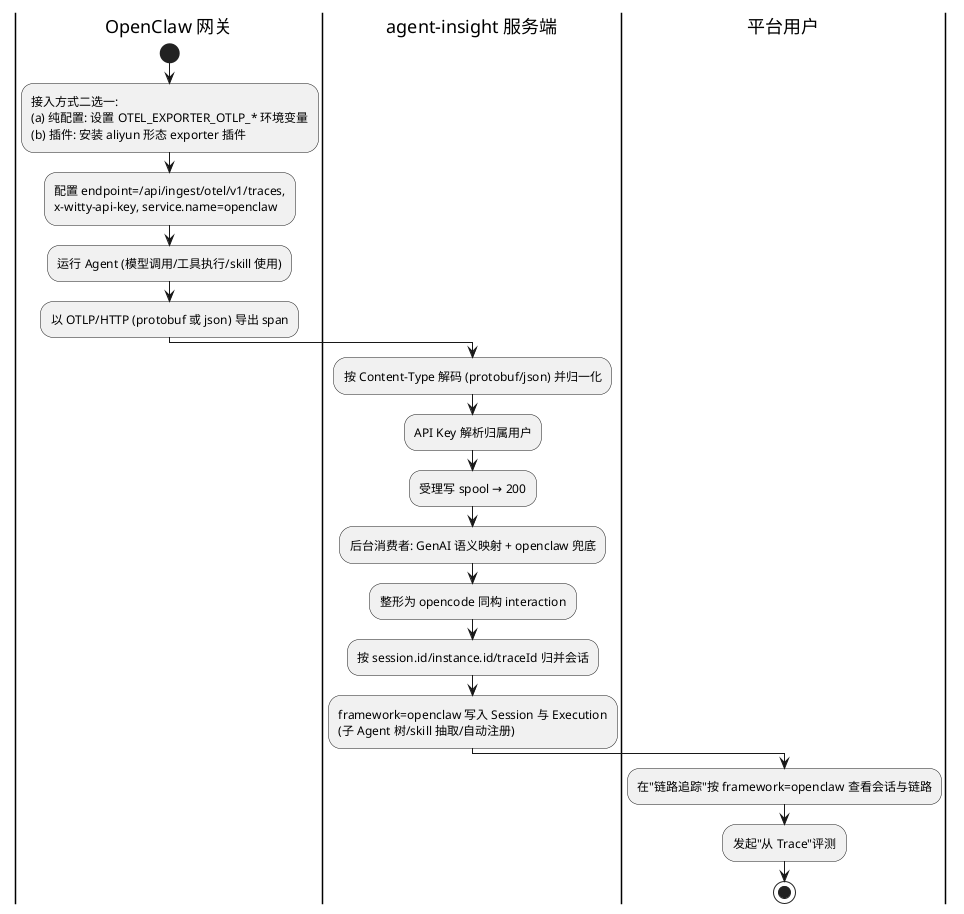

# OpenClaw 平台适配（OTel / OTLP 接入）— 需求分析规格（IR）
版本：v0.2
最后更新：2026-06-11

> 文档类型：Phase1 需求分析规格（IR）
> 关联项目：agent-insight
> 复杂度评估：**Medium**（用户已确认；P0 含 protobuf 解码，复杂度偏该档上限）
> base_commit：d351dad（master）
> 变更类型：新增能力（feature）
> 状态：评审条件通过（81/100）→ **已按评审意见修订（v0.2）**
>
> 参考材料：
> - [`docs_backup/openclaw-langfuse-接入分析报告.md`](../../../docs_backup/openclaw-langfuse-接入分析报告.md) —— OpenClaw 接入 Langfuse 的三条路径（A: OpenRouter Broadcast / B: 原生 OTel 导出 / C: 自定义插件 + Ingestion API），本需求迁移其中 **方案 B**（含纯配置与 exporter 插件两种形态）到 agent-insight；方案 A 为 Langfuse/OpenRouter 专属不适用，方案 C 的 Ingestion API 为 Langfuse 私有协议、本平台统一走 OTLP。
> - [`hermes-otel-adapter`](../hermes-otel-adapter/) —— 同类先行设计（已评审、代码未落地），本需求的服务端架构与其对齐并复用其适配层设计。
> - 同批未落地目标架构：[`otel-spool-consumer`](../otel-spool-consumer/)（薄壳端点 + 后台消费者）、[`framework-adapter-registry`](../framework-adapter-registry/)（adapter 查表，禁 per-framework 裸分支）。

---

## §1 基本信息

### 1.1 项目背景

需求价值：agent-insight 的核心定位是「框架无关」的 Agent 观测/评测/Skill 优化工程底座。OpenClaw 当前仅有**本地文件 watcher** 接入（chokidar 监听 `~/.openclaw/agents/**/*.jsonl`，要求 OpenClaw 与平台**同机部署**），无法服务远程/容器化/多实例的 OpenClaw 部署形态。新增标准 OTel/OTLP 接入可解除同机限制、统一接入协议，并与 hermes 适配同批兑现「多平台标准化接入」的产品承诺。

需求描述：使运行在 **OpenClaw**（自治 AI Agent 网关，模型无关，Signal/Telegram/Discord 等渠道接入）上的 Agent，能够通过**标准 OpenTelemetry（OTel/OTLP）协议**将运行链路数据上报到 agent-insight，被正确解析、归并为会话并在观测看板呈现，框架标识为 `openclaw`。本需求**是**「为 OpenClaw 新增一条标准协议的远程接入通路」，**不是**替代既有 watcher 接入（两者并存、接入指引互斥），也**不**改变 OpenCode/Claude 及同批 hermes 的接入行为。

> **接入模式定位（与 hermes 的关键差异）**：hermes 内核不支持 OTel，必须装插件才能产出 OTLP；**OpenClaw 内核内置 OTel 导出**（`http/protobuf`），因此 OpenClaw 的主路径是「**纯配置**」（Claude Code 同款模式：配环境变量即可），插件（aliyun openclaw-exporter 形态）是**增强路径**（输出更完整的 GenAI 语义 span 树：`invoke_agent`/`chat`/`execute_tool` 等）。
>
> **关键协议缺口（用户已确认 P0 解决）**：OpenClaw 内置导出仅走 `http/protobuf`（忽略 gRPC），而平台 traces 端点当前仅受理 `application/json`（protobuf 返回 415）。**服务端必须新增 OTLP `http/protobuf` 解码**（落在 hermes 设计 NFR-004 预留的「仅新增解码适配、不动核心解析/归并」扩展点上），否则「纯配置」主路径不成立。

### 1.2 结构化信息

|维度|内容|
|-|-|
|Who|OpenClaw 网关的部署/运维者（数据生产侧）；agent-insight 平台使用者（观测/评测/Skill 优化消费侧）|
|When|OpenClaw Agent 运行时（产生 trace 并上报）与运行后（在看板查看链路、发起评测）|
|What|OpenClaw 以标准 OTLP 协议（http/protobuf 或 http/json）上报运行数据，平台正确接收、解码、解析、按会话归并并标记 framework=openclaw，呈现于链路追踪；数据可进入「从 Trace」评测与 Skill 全链路|
|Why|既有 watcher 接入要求同机部署、依赖 OpenClaw 私有 jsonl 格式；标准 OTLP 接入解除部署限制、降低格式耦合，并复用 hermes 同批的标准化接入架构|
|Where|OpenClaw 运行环境（纯配置 env 指向平台，或安装 exporter 插件）；agent-insight 自托管服务端（Next.js + Prisma/SQLite）|
|How Much|**客户端**：主路径零代码（仅配置环境变量）；增强路径复用开源 aliyun openclaw-exporter（配 endpoint/鉴权头指向平台），自研插件仅作兜底规约。**服务端**：复用 `/api/ingest/otel/v1/traces` 通路与 hermes 适配层设计，净新增 = protobuf 解码适配 + openclaw 语义映射条目 + registry 的 openclaw-otel adapter|
|How|OpenClaw 侧配置 OTLP exporter（endpoint=平台 traces 端点、`x-witty-api-key` 头、`service.name=openclaw`）→ 运行 Agent 产生 span → OTLP/HTTP 上报 → 平台薄壳端点解码（protobuf/json）受理写 spool → 后台消费者语义映射、整形、归并入库 → 用户在看板按 framework=openclaw 检索查看与评测|

---

## §2 核心能力

### 2.1 场景分析

**主成功场景**



|编号|路径|类别|触发|步骤|
|-|-|-|-|-|
|S-001|主成功|业务|OpenClaw 经**纯配置**内置 OTLP exporter 上报有效 trace（http/protobuf）|配置 env（endpoint/鉴权头/service.name）→ 运行产生 span → protobuf 上报 → 平台解码受理 →（异步）解析归并 → 入库 → 看板呈现 framework=openclaw|
|S-002|主成功|业务|OpenClaw 经 **exporter 插件**（aliyun 形态）上报 GenAI 语义 span 树|安装插件（一键脚本，版本兼容矩阵选版）→ 配 endpoint/鉴权指向平台 → 运行产生 `invoke_agent`/`chat`/`execute_tool` 等语义 span → 上报 → 平台解析（`gen_ai.span.kind` 等属性）→ 入库呈现|
|S-003|主成功|接入|用户为 OpenClaw 接入平台（接入引导）|平台接入引导输出两种路径的可复制配置：（a）env 配置块；（b）插件安装步骤 + endpoint/鉴权配置；均含 **watcher 互斥声明**；用户照做后首次运行即上报成功|
|S-004|备选|业务|OpenClaw 以 `http/json` 上报（若其 exporter 支持或经插件转 json）|平台按既有 json 路径受理，行为与 protobuf 路径等价（同一归一化产物）|
|S-005|扩展|业务|OpenClaw 多次/分批上报同一会话的 span（含重试）|平台按会话标识增量归并，同 spanId 去重，按时间戳排序，聚合 token/延迟|
|S-006|扩展|业务|OpenClaw 会话含多 Agent / 子 Agent 调用|平台据 span 父子关系与 agent 身份属性保留链路层级，正确归属主/子 Agent|
|S-007|备选|业务|上报未携带 `session.id`，仅有 `service.instance.id` 或 `traceId`|平台按既定优先级 session.id→instance.id→traceId 选择会话归并键|
|S-008|异常|业务|以 gRPC 上报|平台明确返回不支持状态并给出可操作指引（改用 http/protobuf 或 http/json），不静默丢弃|
|S-009|异常|安全|上报缺失或非法 API Key|数据不得归入其他用户或匿名名下；用户归属解析失败时按平台统一鉴权语义处理（对齐 spool-consumer 线的端点鉴权约定），且结构化日志可定位|
|S-010|异常|业务|span 不含 GenAI/工具语义（基础设施类 span，如 `gateway_start`/`session_start` 生命周期 span）|平台跳过或降级处理该 span，不产生噪声会话，不报错中断整批处理|
|S-011|异常|业务|span 使用自定义/非标准属性命名（如 OpenClaw 私有属性、aliyun exporter 的 `gen_ai.span.kind`）|平台经映射适配层尽力解析；无法识别字段时降级保留原始信息而非整条丢弃|
|S-012|异常|业务|上报体畸形（非法 protobuf 字节流 / 缺 `resourceSpans` 的 JSON / 截断）|平台返回确定性 4xx（非 5xx），不写入部分损坏数据，错误信息可定位|
|S-013|异常|业务|单次上报体量超限（超大批量 span / 超大字段）|平台以确定性策略处理（拒绝并提示分批 / 截断超大字段并标注），不导致服务异常或内存膨胀|
|S-014|扩展|业务|OpenClaw 多 Agent 运行（主 Agent + ≥1 子 Agent）上报|平台拆分为多条 Execution 并组成 agent 树（与 opencode 对齐），子 Agent 可独立筛选、下钻、评测|
|S-015|扩展|业务|OpenClaw（主或子 Agent）调用/加载 skill|平台从 OTLP 数据抽取 skill 名与版本，写入 invokedSkills，进入评测/A-B/优化全链路|
|S-016|扩展|业务|OpenClaw 某 agent 身份首次被观测到|平台自动注册到 RegisteredAgent（platform=openclaw，区分 main/subagent），重复上报不重复注册|
|S-017|异常|运维|同一 OpenClaw 实例同时开启本地 watcher 与 OTel 上报|接入指引明确互斥要求（同一实例只开一路）；平台不承诺双路去重，双开导致的同会话重复呈现记录为已知限制|
|S-018|备选|运维|OpenClaw 版本升级后插件 hook API 变化导致 exporter 插件失效|接入指引说明插件版本兼容矩阵机制与升级回归要求；纯配置路径不受影响（内置导出随内核演进）|

### 2.2 业务规则

|编号|描述|原因|影响范围|
|-|-|-|-|
|BR-001|OpenClaw 运行数据的 framework 标识必须稳定为 `openclaw`，与 opencode/claude/hermes 不混淆；OTel 路径与既有 watcher 路径产生的数据使用**同一**框架标识（单一口径，不引入 `openclaw-otel` 之类的第二标识）|多框架数据需可独立检索、统计、评测；同一框架双标识会割裂看板与统计|观测看板、评测、统计|
|BR-002|同一会话内同一 spanId 的 interaction 必须去重；多批上报必须增量合并而非覆盖|OTLP 天然分批、可重试，需保证幂等|会话归并、token/延迟聚合|
|BR-003|缺失或非法 API Key 的上报，数据**禁止**归入其他用户或匿名名下（用户归属必须正确或明确失败）；端点的具体拒绝语义（是否强 401）对齐 spool-consumer 线的统一约定，不在本需求单独定义|多租户数据隔离与安全；端点鉴权壳层归 spool-consumer 线统一管理，避免两线各改一套|鉴权、数据归属|
|BR-004|`application/json` 与 `application/x-protobuf` 均为必须受理的有效 OTLP 编码；gRPC 等不支持的传输必须显式拒绝并返回可操作指引，禁止静默成功|OpenClaw 内置导出仅 http/protobuf，不收 protobuf 则主路径不成立；静默失败会让用户误以为接入成功|接入端点、解码层、接入体验|
|BR-005|新增 openclaw OTel 适配不得破坏现有 OpenCode/Claude 的接入解析行为，不得破坏既有 **watcher-openclaw** 链路，不得与同批 hermes 适配冲突（向后兼容）|存量接入不可回退；三线同批须共存|全部既有接入链路|
|BR-006|畸形或超限上报体（含非法 protobuf 字节流）必须返回确定性 4xx，且不得写入部分损坏数据（要么整批受理、要么明确失败）|保证数据一致性与可诊断性|解码、解析、入库|
|BR-007|OpenClaw 多 Agent 运行必须建模为多条 Execution 并组成树（parentExecutionId/rootExecutionId/isSubagent 等），语义与 opencode 对齐，不得塌缩为单条扁平记录|子 Agent 级可观测/可评测是平台核心能力|入库、观测、评测、Agent 注册|
|BR-008|OpenClaw 的 agent 身份（含子 Agent）首次被观测到时必须自动注册到 RegisteredAgent（platform=openclaw，agentType 区分 main/subagent），同一 (platform,name,user) 不重复注册|Agent 注册表与筛选需识别 openclaw agent|Agent 注册、筛选|
|BR-009|skill 调用的抽取必须覆盖主 Agent 与子 Agent 加载的 skill，并尽力带出版本；抽取结果写入 invokedSkills 供下游消费|Skill 为一等公民，评测/A-B/优化依赖 invokedSkills|Skill 抽取、评测、A-B、优化|
|BR-010|客户端**禁止** fork/修改 OpenClaw 内核：主路径为纯配置内置 exporter；插件路径**优先复用开源 aliyun 形态 exporter**（配 endpoint/鉴权指向平台）；自研插件仅作为复用受阻时的兜底，且须遵循文档给出的最小规约（hook→GenAI 语义 span→OTLP）。服务端解析必须以「客户端实际发出的属性」为准（内置导出与 aliyun exporter 的 GenAI 语义约定），不得假设平台私有命名|降低接入与维护成本、随上游演进；服务端不能凭空假设 OpenClaw 属性命名|客户端接入、服务端语义映射、真实样本校准|
|BR-011|平台服务端对 openclaw 的解析/聚合必须复用同批统一的接收/转换分层（接收与处理解耦、按框架查表转换），禁止为 openclaw 新增独立的接收路径或框架专属分支；新增 protobuf 编码支持不得改变既有框架（json 路径）的解析结果（具体落点见 §5.2 目标架构条目，模块级细节归 Phase2）|三线（hermes/openclaw/两套基建）同批实现，必须共用一套接收/转换分层，避免冲突与返工|服务端架构、接收路径、转换层|
|BR-012|接入指引必须包含「同一 OpenClaw 实例的 watcher 与 OTel 上报互斥（只开一路）」的强制声明；平台对违反互斥导致的同会话双路重复不承诺去重|两路 framework 同值、会话键来源不同，强去重复杂度高且收益低（用户已确认不做强保证）|接入引导、文档、数据质量|

### 2.3 数据约束

|编号|类别|名称|描述|
|-|-|-|-|
|DC-001|String|framework|会话/执行记录的框架标识，取值 `openclaw`（OTel 路径来源于 OTLP `service.name`，须与 watcher 路径写入值一致）|
|DC-002|String|会话归并键(taskId)|按 `session.id` → `service.instance.id` → `traceId` 优先级取值，非空，作为会话唯一归并依据|
|DC-003|Object|interaction|单次交互记录，至少含 spanId、parentSpanId、type(llm/tool)、model、usage(input/output/total tokens)、latency、timestamp|
|DC-004|String|apiKey|上报鉴权凭据，经 `x-witty-api-key` 头传入，用于解析归属用户|
|DC-005|Enum|OTLP 编码|有效输入：`application/json`、`application/x-protobuf`（OTLP/HTTP）；无效输入：gRPC（显式拒绝）。两种有效编码解码后必须产出同一归一化结构|
|DC-006|Object|agent 身份|agent 树身份字段：agentName、agentType(main/subagent)、subagentType、agentSessionId、parentExecutionId、rootExecutionId、isSubagent；来源于 OTLP agent 身份语义契约（DC-008）|
|DC-007|Object|skill 调用|skill 标识：name(必填)、version(可空)；来源：工具/skill 型 span 及其属性约定（含子 Agent 加载场景）|
|DC-008|约定|OTLP agent/skill 语义契约（openclaw 形状）|OpenClaw 在 OTLP 中标识 agent 身份与 skill 调用的属性约定。已知候选事实（待真实样本定稿）：内置导出与 aliyun exporter 遵循 OTel GenAI 语义约定，span 命名含 `enter_openclaw_system`(ENTRY)/`invoke_agent`(AGENT)/`chat`(LLM)/`execute_tool`(TOOL)/`session_start·end`/`gateway_start·stop`，属性含 `gen_ai.span.kind` 与 `gen_ai.*`（model/token/cost）。**纯配置路径与插件路径的属性丰富度可能不同**，两种形状均需采样|
|DC-009|假设(待验证)|插件路径鉴权头可配置性|aliyun exporter 一键安装脚本仅暴露 `--endpoint/--pk/--sk`（面向 Langfuse Basic Auth），「配置 `x-witty-api-key` 自定义鉴权头指向本平台」是**未经证实的假设**，须经插件源码/真实样本验证。验证失败的确定性走向（二选一，设计阶段定）：①平台端点兼容 `Authorization: Basic` 形式鉴权头；②插件路径降级为 BR-010 的自研兜底规约|

---

## §3 需求列表

### 3.1 功能性需求

|编号|类别|名称|描述|优先级|
|-|-|-|-|-|
|FR-001|接入|OpenClaw OTLP 接入（端到端）|OpenClaw 可通过标准 OTLP/HTTP 将 trace 上报至平台并被成功接收、鉴权与解析，最终在链路追踪看板以 framework=openclaw 呈现|P0|
|FR-002|协议|OTLP http/protobuf 解码|平台 traces 端点新增对 `application/x-protobuf` 的受理与解码，解码后与 json 路径产出同一归一化结构、最终入库结果等价。该能力为框架无关的平台能力（同时惠及未来框架；实现方式约束见 NFR-004）|P0|
|FR-003|解析|GenAI/工具 span 解析与会话归并|平台正确解析 openclaw 上报的 GenAI/LLM/工具 span，映射为内部 interaction，按会话标识增量归并、去重、时序排序，并聚合 token 与延迟|P0|
|FR-004|标识|framework 稳定标记为 openclaw|OTel 路径数据在 Session/Execution 中稳定标记为 openclaw（由 `service.name` 驱动），与 watcher 路径同一口径，可按框架检索统计|P0|
|FR-005|兼容|自定义属性映射兜底|当 span 未严格遵循标准 GenAI 语义约定（或使用 `gen_ai.span.kind` 等扩展属性）时，提供映射适配层尽力识别关键字段，无法识别时降级保留原始信息|P1|
|FR-006|接入引导|openclaw OTel 接入引导|在安装指导页/框架选择器中提供 openclaw 的 OTel 接入选项（与既有 watcher 模式并列或整合），输出两种路径的可复制配置：（a）纯配置 env 块（endpoint、`x-witty-api-key`、`service.name=openclaw`、协议）；（b）exporter 插件安装步骤 + 配置块；均含 watcher 互斥声明（BR-012）|P1|
|FR-007|客户端接入|客户端接入规约（双路径）|交付「OpenClaw 客户端接入规约」文档：①纯配置路径——内置 OTLP exporter 的环境变量配置规约；②插件路径——复用 aliyun 形态 exporter 的安装与指向平台的配置规约（含版本兼容矩阵说明）；③附录——自研插件最小规约（hook→GenAI 语义 span→OTLP 导出骨架），仅作复用受阻时兜底。同时标注各路径实际发出的属性约定，作为服务端语义契约（FR-012）与样本校准输入|P0|
|FR-008|多Agent|子 Agent 链路层级还原|当 openclaw 会话含多/子 Agent 时，依据 span 父子关系与 agent 身份属性还原链路层级与主/子 Agent 归属（链路图展示层）|P1|
|FR-009|多Agent|子 Agent 多 Execution 树建模|openclaw 多 Agent 运行拆分为多条 Execution，写入 parentExecutionId/rootExecutionId/agentSessionId/subagentType/subagentName/isSubagent，组成与 opencode 对齐的 agent 树，支撑子 Agent 级筛选/下钻/聚合|P0|
|FR-010|注册|agent 自动注册|openclaw 的主/子 Agent 身份首次被观测到时自动注册到 RegisteredAgent（platform=openclaw，区分 main/subagent），可在 Agent 注册表与筛选中可见|P1|
|FR-011|Skill|skill 全链路一等解析|针对 openclaw OTLP 形状解析 skill 调用，带出 skill 名与版本，覆盖子 Agent 加载的 skill，写入 invokedSkills 并打通评测/A-B/优化全链路|P0|
|FR-012|约定|OTLP agent/skill 语义契约（openclaw 形状）|定义并对外说明 openclaw 在 OTLP 中标识 agent 身份与 skill 调用的属性契约（含纯配置与插件两种形状差异），作为 FR-008/009/010/011 解析依据；据真实样本定稿|P0|
|FR-013|健壮性|畸形/超限上报处理|对非法 protobuf 字节流、畸形 JSON、缺失 resourceSpans、截断或超限上报体，返回确定性 4xx 并保证不写入部分损坏数据；超大字段按既定上限截断并标注|P1|
|FR-014|可诊断|不支持传输的显式反馈|对 gRPC 等暂不支持的传输，返回明确状态与改用 OTLP/HTTP（protobuf 或 json）的指引|P2|
|FR-015|评测承接|openclaw OTel 会话可作为评测对象|openclaw OTel 上报形成的 Execution/会话（含子 Agent 维度）可进入「从 Trace」评测流程；主 Agent 与子 Agent 均可作为评测对象|P2|

### 3.2 非功能性需求

|编号|类别|名称|描述|优先级|
|-|-|-|-|-|
|NFR-001|兼容性|存量接入零回退|openclaw OTel 适配上线后，OpenCode/Claude 的接入解析、**watcher-openclaw** 链路、以及同批 hermes 适配的行为保持不变（既有用例全部通过）|P0|
|NFR-002|可靠性|上报幂等与容错|分批/重试上报，同 spanId 去重率 100%（最终 interaction 无重复）；单条异常 span 不导致整批 trace 处理失败（异常 span 跳过率 100%、其余正常入库）|P0|
|NFR-003|安全性|多租户数据隔离|openclaw 数据按 API Key 正确归属用户；归入他人或匿名名下的发生率为 0（按 BR-003）|P0|
|NFR-004|可扩展性|协议演进可扩展|protobuf 解码以编码层适配实现（本期即为 hermes NFR-004 预留扩展点的首次兑现）：新增一种编码不改核心解析/归并逻辑；gRPC 仍预留扩展点不实现|P1|
|NFR-005|可维护性|新增框架低成本（registry 第二样板）|openclaw OTel 适配按目标架构核验：≈ 新增 1 个 registry adapter + 1 组语义映射条目 + 1 个 skill extractor + 1 个整形适配 + 编码层 protobuf 解码（框架无关），**0 处既有框架分支改动**|P1|
|NFR-006|可观测性|接入可自检|对每次上报输出可定位的结构化日志（受理侧：鉴权结果/编码类型/span 数/受理结果；处理侧：会话归并键/命中数/跳过原因/降级数）；用户据此可自助判断「是否成功/为何未呈现」（具体字段对齐 spool-consumer 双处日志设计，Phase2 确认）|P2|
|NFR-007|一致性|子 Agent 建模与 opencode 等价|对语义等价的多 Agent 运行，openclaw 产出的 agent 树结构（层级、parent/root 关系、main/subagent 归属）应与 opencode 等价，避免双口径|P1|
|NFR-008|性能|protobuf 解码不劣化端点|新增 protobuf 解码后，traces 端点受理路径（解码+归一化+写 spool）的行为仍为「快速受理」，不引入阻塞性重处理（量化基线待 Phase2 结合 spool-consumer 端点指标确认）|P2|

---

## §4 验收方案

### 4.1 验收准则

|编号|关联能力|维度|描述|验收标准|
|-|-|-|-|-|
|AC-001|S-001, FR-001/FR-002|功能|纯配置路径端到端（protobuf）|OpenClaw 仅配置环境变量（不装插件）、以 http/protobuf 上报有效 trace 后，链路追踪看板可检索到 framework=openclaw 的会话，关键字段（model/token/延迟）非空且合理|
|AC-002|S-002, FR-001|功能|插件路径端到端|安装 aliyun 形态 exporter 插件并配 endpoint/鉴权指向平台，运行一次含 LLM+工具调用的任务后，看板出现 framework=openclaw 会话，且 span 语义（AGENT/LLM/TOOL 层级）被正确解析|
|AC-003|S-004, FR-002, DC-005|功能|json 与 protobuf 等价|同一逻辑 trace 分别以 json 与 protobuf 上报，归一化产物与最终入库结果等价（interaction 数、关键字段一致）|
|AC-004|S-005, BR-002, NFR-002|功能|会话增量归并与幂等|对同一会话分 N 批上报（含重复 spanId），最终会话内 interaction 无重复、按时间排序，token/延迟聚合正确|
|AC-005|S-006, FR-008|功能|子 Agent 层级还原|含父子关系的 openclaw 会话，每个 interaction 的层级归属与上报一致；还原层级深度 = 上报层级深度|
|AC-006|S-008/S-009/S-010, BR-003/BR-004|功能|异常路径处理|gRPC 上报返回明确不支持状态及指引；缺失/非法 Key 的数据 0 条归入他人或匿名名下；非 GenAI 基础设施 span 被 100% 跳过/降级且不中断整批|
|AC-007|BR-005, NFR-001|兼容|存量接入不回退|openclaw OTel 上线后，OpenCode/Claude 既有接入回归用例全部通过；watcher-openclaw 链路行为不变；hermes 适配（若已落地）不受影响|
|AC-008|S-003, FR-006, BR-012|功能|接入引导可用|接入引导出现 openclaw OTel 选项；输出含 endpoint + x-witty-api-key 的两种路径可复制配置且含互斥声明；按任一路径配置上报一次后，看板在 ≤1 次刷新内出现对应会话|
|AC-009|NFR-003|安全|数据隔离|不同用户 API Key 上报的 openclaw 数据互不可见、互不污染|
|AC-010|S-011, FR-005|功能|自定义属性映射兜底|上报含非标准命名（或 `gen_ai.span.kind` 扩展属性）的 span，关键字段（model/token/tool 名）经映射被识别填充；未识别字段降级保留原始信息而非整条丢弃|
|AC-011|S-012/S-013, BR-006, FR-013|健壮性|畸形/超限上报|非法 protobuf 字节流 / 畸形 JSON / 缺 resourceSpans 返回确定性 4xx（非 5xx）且无部分写入；**超大批量 span 被拒绝并返回分批提示**；超大字段被按上限截断并标注，服务不崩溃|
|AC-012|S-014, FR-009, BR-007, NFR-007|功能|子 Agent 多 Execution 树|含 1 主 + M 子 Agent 的 openclaw 运行上报后，生成 1+M 条 Execution；子 Agent 行 isSubagent=true 且 parent/root 链与运行结构一致；可按 rootExecutionId 聚合、可筛选/下钻子 Agent；与等价 opencode 运行的树结构一致|
|AC-013|S-016, FR-010, BR-008|功能|agent 自动注册|openclaw 主/子 Agent 首次上报后自动出现在 RegisteredAgent（platform=openclaw，agentType 正确）；重复上报不产生重复注册|
|AC-014|S-015, FR-011, BR-009|功能|skill 全链路解析|openclaw 主 Agent 与子 Agent 加载的 skill 均被抽取入 invokedSkills（带版本，若上报含版本）；该会话在 Skill 诊断/路由评测中显示「实际调用 skill」非空；可进入 A-B/优化|
|AC-015|FR-015|功能|评测承接|openclaw OTel 入库的 Execution（主与子 Agent）在「从 Trace」评测入口均可被检索、选中并成功发起评测|
|AC-016|FR-007, FR-012, BR-010|接入|客户端接入规约完备|接入规约文档覆盖：纯配置 env 规约、插件复用配置规约（含版本兼容矩阵说明）、自研插件兜底规约；并记录两种路径实际发出的属性约定，服务端映射对这些约定有覆盖或降级保留|
|AC-017|S-007, DC-002|功能|会话归并键回退|上报不含 `session.id` 时，平台按 `service.instance.id` → `traceId` 优先级正确选取归并键并归并会话，不丢弃、不误并|
|AC-018|BR-001, S-001/S-017|功能|双路径单一框架口径|watcher 路径与 OTel 路径各产生一条会话后，看板按 framework=openclaw 单一筛选可同时检索到两条会话；不存在第二框架标识|

> **文档性场景验收说明**：S-017（watcher/OTel 双开）由 AC-008 的互斥声明 + §5.2「已知限制」条目覆盖（双开重复呈现不设用例）；S-018（插件版本升级失效）由 AC-016 的版本兼容矩阵说明覆盖；二者不另设独立测试用例。

### 4.2 测试用例

|编号|关联准则|前置条件|操作步骤|预期结果（量化指标/判断条件）|
|-|-|-|-|-|
|TC-001|AC-001|平台运行、已获取有效 API Key、OpenClaw 未装插件|仅配置 OTLP env（endpoint/鉴权/service.name=openclaw，协议 http/protobuf）并运行一次含 LLM 调用的任务|看板出现 1 条 framework=openclaw 会话，含 model、token>0、latency>0|
|TC-002|AC-002|同 TC-001，另安装 exporter 插件|配 endpoint/鉴权指向平台，运行一次含 LLM+工具调用的任务|看板出现会话；AGENT/LLM/TOOL 语义 span 均被解析为对应 interaction 类型|
|TC-003|AC-003|平台运行|构造同一逻辑 trace，分别以 application/json 与 application/x-protobuf 上报|两次入库结果 interaction 数相同、model/token/latency/spanId 一致|
|TC-004|AC-004|同 TC-001|将同一会话 spans 拆为 3 批（其中 1 批含重复 spanId）依次上报|最终会话 interaction 数=去重后实际数；按 timestamp 升序；token/延迟为各 interaction 之和|
|TC-005|AC-005|openclaw 任务含 1 主 + ≥1 子 Agent（已知层级深度 D）|上报含父子关联的 spans|还原链路深度 = D；主/子 Agent 归属与上报一致|
|TC-006|AC-006|平台运行|分别以 gRPC 上报 / 缺失 API Key 上报 / 上报纯生命周期 span（gateway_start 等）|gRPC 返回明确不支持+指引；缺 Key 数据 0 条归入他人/匿名；生命周期 span 被跳过或降级、其余正常入库|
|TC-007|AC-007|OpenCode/Claude 既有用例 + watcher-openclaw 用例|执行存量回归用例|全部通过，无行为差异|
|TC-008|AC-008|平台运行|打开接入引导选择 openclaw OTel，分别按两种路径配置并各上报一次|两种路径均 ≤1 次刷新出现会话；配置块含互斥声明|
|TC-009|AC-009|两个不同用户各自 API Key|两用户分别上报 openclaw 数据|用户 A 看板不可见用户 B 的会话，反之亦然|
|TC-010|AC-010|平台运行|上报 span 关键字段采用非标准命名 / 含 gen_ai.span.kind 扩展属性|model/token/tool 名经映射被识别；未识别字段原样保留可见；该 span 不被整条丢弃|
|TC-011|AC-011|平台运行|分别上报：非法 protobuf 字节流 / 缺 resourceSpans 的 JSON / 超大批量 span（超出体量上限）/ 含超大字段的 span|前两者返回 4xx 且无写入；超大批量返回 4xx 且响应含分批提示、无写入；超大字段被截断并标注，服务无 5xx、无崩溃|
|TC-012|AC-012|openclaw 运行含 1 主 + M 子 Agent（已知结构）|按语义契约上报含 agent 身份标记的 spans|生成 1+M 条 Execution；子 Agent isSubagent=true、parent/root 链正确；与等价 opencode 运行树结构一致|
|TC-013|AC-013|平台运行|首次上报 openclaw 主+子 Agent；随后重复上报相同 agent|首次后 RegisteredAgent 出现 platform=openclaw 的 main 与 subagent 记录；重复上报无重复行|
|TC-014|AC-014|openclaw 运行主 Agent 调 skillA、子 Agent 加载 skillB（带版本）|按语义契约上报|invokedSkills 含 skillA、skillB 及版本；Skill 诊断显示实际调用非空；可发起 A-B/优化|
|TC-015|AC-015|已有 ≥1 条 openclaw OTel Execution（含子 Agent）入库|进入「从 Trace」评测入口检索并选中主/子 Agent 会话发起评测|主、子 Agent 均可检索、选中、成功评测|
|TC-016|AC-016|纯净 OpenClaw 环境 + 平台运行 + 有效 key|按接入规约文档分别走通纯配置与插件两条路径|两条路径均一次走通；文档记录的属性约定与实际上报采样一致（或差异已被映射/降级覆盖）|
|TC-017|AC-017|平台运行|构造三组上报：①含 session.id；②无 session.id 仅 service.instance.id；③两者皆无仅 traceId|三组均成功归并为会话；②的归并键=instance.id、③的归并键=traceId；同组分批上报归并入同一会话|
|TC-018|AC-018|同机环境：watcher 接入一条会话 + OTel 接入另一条会话（不同实例，遵守互斥）|看板按 framework=openclaw 筛选|两条会话均出现在同一筛选结果中；框架筛选项中不存在 openclaw 以外的 openclaw 变体标识|

### 4.3 交付物定义

|交付物|描述|
|-|-|
|OTLP http/protobuf 解码能力|traces 端点编码层适配（框架无关），protobuf 与 json 汇入同一归一化产物|
|openclaw OTLP 接入能力|服务端解析/归并/标识对 openclaw 的支持（复用 hermes 适配层设计 + registry adapter + 语义映射条目）|
|openclaw OTel 接入引导|接入引导中的 openclaw OTel 选项 + 双路径可复制配置 + watcher 互斥声明|
|**OpenClaw 客户端接入规约**|纯配置 env 规约 + aliyun 形态 exporter 插件复用配置规约（含版本兼容矩阵说明）+ 自研插件兜底最小规约 + 各路径属性约定记录|
|openclaw 接入文档|端到端接入指南（客户端双路径 + 服务端语义约定 + 排障自检：协议/鉴权/网络/插件加载）|
|子 Agent 多 Execution 树能力|openclaw 多 Agent 运行拆多条 Execution + agent 树（与 opencode 对齐）|
|agent 自动注册能力|openclaw 主/子 Agent 自动注册 RegisteredAgent|
|skill 全链路解析能力|openclaw OTLP 形状 skill 抽取（含版本与子 Agent 加载）+ 下游打通|
|OTLP agent/skill 语义契约文档（openclaw 形状）|openclaw 标识 agent 身份与 skill 调用的属性约定（纯配置/插件两种形状）|
|回归与新增测试|覆盖上述验收准则的测试用例|

---

## §5 附录

### 5.1 用户记录

#### 5.1.1 初始描述

```text
你帮生成一个需求文档，目标是将openclaw适配到项目中agent-insight（agent-insight是服务与所有的agent平台，
将 agent的执行记录上报到平台的），生成的文件放到目录：/opt/src/agent-insight/docs/design 具体要求：
（1）参考openclaw接入langfuse的指导方式，升成接入agent-insight的方式（使用OTel协议）：
    /opt/src/agent-insight/docs_backup/openclaw-langfuse-接入分析报告.md
（2）升成的需求文档包含几个部分：1. 在openclaw段如何配置？或者类似对应的插件怎么写？
    2. 插件（如果有）如何接入到agent-insight；
（3）agent-insight之前的已经有了类似的实现，但是代码还没落地，你参考下对应的设计：
    /opt/src/agent-insight/docs/design/hermes-otel-adapter
```

#### 5.1.2 澄清

```text
执行模式确认：用户选择 Phase1（需求分析）+ Phase2（需求设计），每阶段经独立 Subagent 评审。

第一轮澄清（A1.1，4 问均选推荐项）：
1. 客户端形态 = 双路径都覆盖：主路径「纯配置内置 OTLP exporter」+ 增强路径「exporter 插件
   （aliyun openclaw-exporter 形态，GenAI 语义 span 树）」，文档两者都写。
2. 与既有 watcher 关系 = 并存 + 互斥指引：watcher 不动，OTel 为新增标准接入；接入文档声明同一
   实例只开一路；双路去重作为风险记录、不做强保证。
3. 服务端架构 = 对齐同批未落地目标架构：hermes-otel-adapter 适配层纯函数 + otel-spool-consumer
   薄壳管线 + framework-adapter-registry 查表；openclaw 作为 registry 新 adapter + 映射条目。
4. 范围深度 = 对齐 hermes 全量：观测链路 + 会话归并 + 子 Agent 树 + skill 一等抽取 + 自动注册 +
   评测承接；语义缺口靠真实样本校准 + 降级保留兜底。

第二轮澄清（A1.2/A1.3，4 问）：
1. 场景/边界清单 = 准确无遗漏。
2. protobuf 协议缺口 = P0 服务端补 http/protobuf 解码（落在 hermes NFR-004 预留扩展点：仅新增
   解码适配、不动核心解析/归并；保障纯配置主路径可用）。
3. 插件策略 = 优先复用 aliyun exporter（配 endpoint/鉴权指向平台）+ 文档附自研插件最小规约兜底。
4. 难度评估 = 认可 Medium。
```

```text
Phase1 独立 reviewer 评审：条件通过（81/100，1 ERROR / 3 WARNING / 3 INFO）。已据评审意见修订（v0.2）：
- E-1：补 AC-017/TC-017（S-007 归并键回退）、AC-018/TC-018（BR-001 双路径单一框架口径）；
  AC-011/TC-011 补「超大批量拒绝并提示分批」分支。
- W-1：新增 DC-009 登记「插件鉴权头可配置性」为待验证假设，并写明验证失败的两条确定性走向；
  §5.2 已知风险同步。
- W-2：BR-011 改述为业务可判定的架构约束（文件级细节下沉 §5.2/Phase2）；FR-002 删去实现方式表述
  （归 NFR-004 承载）。
- W-3：§4.1 末新增「文档性场景验收说明」（S-017/S-018 验收归属）。
- I-1：framework 对齐事项闭环（openclaw-parser.ts:160 已核实写入 'openclaw'）。
- I-2：trace 碎片化补需求层口径（多会话呈现为可接受已知限制）。
- I-3：§5.2 补 OTLP env 端点语义提示（ENDPOINT 自动拼接 vs TRACES_ENDPOINT 全路径）。
```

### 5.2 关键现状（代码与材料依据，便于后续设计追溯）

- **既有 openclaw 接入是本地 watcher**：`src/lib/ingest/openclaw-watcher.ts`（chokidar 监听 `~/.openclaw/agents/**/*.jsonl`，3s 同步 debounce + 30s 评测 debounce）→ `src/lib/engine/observability/openclaw-parser.ts` 解析 jsonl → `saveExecutionRecord` 入库。该链路要求 OpenClaw 与平台同机部署，本需求不改动它。
- **平台已有 OTLP 端点**：`src/app/api/ingest/otel/v1/traces/route.ts`，当前仅受理 `application/json`、`application/x-protobuf` 返回 415；会话归并键优先级 `session.id → service.instance.id → traceId`；`framework` 取自 OTLP `service.name`。
- **OpenClaw 内置 OTel 导出（langfuse 报告 §4）**：进程内导出、模型无关，协议为 `http/protobuf`（忽略 gRPC）；可经标准 `OTEL_EXPORTER_OTLP_ENDPOINT/PROTOCOL/HEADERS` 环境变量配置。捕获范围含模型调用、工具执行、skill 使用、harness 生命周期与 `gen_ai.*` 属性。
- **aliyun openclaw-exporter 形态（langfuse 报告 §4.1/4.2）**：OpenClaw 原生插件（`openclaw.plugin.json` + `index.ts`），挂 hook 翻译为 GenAI 语义 span（`enter_openclaw_system`/`invoke_agent`/`chat`/`execute_tool` + `gen_ai.span.kind`），一键安装脚本带 `version-compat.json` 版本兼容矩阵；endpoint/鉴权头可配置，理论上可直接指向本平台。
- **已知风险与限制（langfuse 报告 §6）**：
  - **trace 碎片化（已知限制，需求层口径）**：OTel 路径有「一次请求生成多条独立 trace」的社区反馈（context 传播断裂）。当归并键回退到 traceId（S-007）时，碎片化会呈现为「一个逻辑会话裂成多条会话」——**需求层将此定为可接受的已知限制**，不作为验收失败项；Phase2 评估缓解手段（如插件路径的 span 树重建天然规避）。
  - 插件 hook API 随 OpenClaw 版本变化需回归（version-compat 矩阵机制，S-018）。
  - 自研插件兜底路径需补重试/超时/批量/背压（规约中体现）。
  - **插件鉴权头假设（DC-009，待验证）**：aliyun exporter 是否支持自定义 `x-witty-api-key` 头未经证实（其安装脚本面向 Langfuse Basic Auth）；验证失败走 DC-009 列明的两条确定性路径之一。
  - watcher/OTel 双开导致同会话双路重复呈现（S-017/BR-012）：互斥指引覆盖，平台不做强去重。
- **同批目标架构（均已评审、代码未落地）**：`otel-spool-consumer`（端点退薄壳：归一化→写 spool→200；后台消费者聚合；`framework=serviceName` 为红线 R-2）；`framework-adapter-registry`（`getAdapter(framework)` 查表、`listFrameworks()` 单一出处、禁 per-framework 裸分支）；`hermes-otel-adapter`（适配层纯函数：semantic-mapping/framework-resolver/payload-guard/agent-semantics 整形为 opencode 同构 interaction，复用 `buildAgentCallTree`/`deriveSubagentExecutions`/自动注册，唯一存量改动 = 解 `data-service.ts:1937` 的 opencode 门限）。openclaw OTel 适配在上述架构上的净新增 = protobuf 解码（编码层）+ openclaw 语义映射条目 + `adapters/openclaw-otel` 能力挂载 + 接入引导。
- **framework 标识对齐（已核实）**：`openclaw-parser.ts:160` 写入 `framework: 'openclaw'`，与 OTel 路径 `service.name=openclaw` 同值，满足 BR-001 单一口径（评审时已核实闭环，无遗留待办）。
- **纯配置 env 端点语义提示（Phase2 配置块编写注意）**：标准 `OTEL_EXPORTER_OTLP_ENDPOINT` 会自动拼接 `/v1/traces`（故 base 应配 `…/api/ingest/otel`），而 signal 专用变量 `OTEL_EXPORTER_OTLP_TRACES_ENDPOINT` 需写全路径；FR-006 的可复制配置块必须明确采用哪一个，避免用户配出 404。

## 变更记录

| 版本 | 内容 |
|-|-|
| v0.1 | Phase1 初稿：双路径客户端（纯配置 + 插件）、P0 protobuf 解码、watcher 并存互斥、对齐 hermes 全量范围与同批目标架构 |
| v0.2 | 评审修订（条件通过 81/100）：补 AC-017/018 与 TC-017/018、超大批量拒绝分支；新增 DC-009 插件鉴权头待验证假设；BR-011/FR-002 去实现细节化；文档性场景验收说明；碎片化已知限制口径；framework 对齐闭环；env 端点语义提示 |
