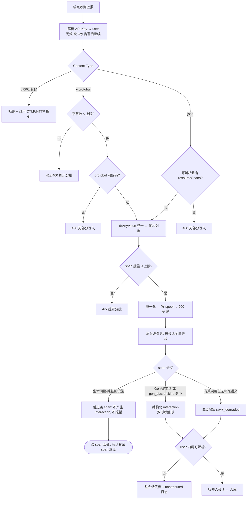

# OpenClaw 平台适配（OTel / OTLP 接入）— 需求设计规格
版本：v0.2
最后更新：2026-06-11

> 文档类型：Phase2 需求设计规格
> 关联项目：agent-insight ｜ 关联 Phase1：[phase1-requirements-analysis.md](phase1-requirements-analysis.md)（v0.2）
> 复杂度评估：**Medium**
> base_commit：d351dad（master）
> 变更类型：新增能力（feature）
> 状态：可行性验证有条件通过 → 已修订 → 用户确认方案 → 评审条件通过（78/100）→ **已按评审意见修订（v0.2）**
> 关联设计（同批未落地，须兼容）：
> - [`otel-spool-consumer`](../otel-spool-consumer/) —— 接收/处理解耦：traces 端点退薄壳（写 spool 即 200），聚合/落库移后台消费者。**注意：其设计明确 traces 输入为「OTLP/json（不变）」，本设计的 protobuf 解码是对其薄壳契约的显式修订项（见 D-002 与 §8.3）。**
> - [`framework-adapter-registry`](../framework-adapter-registry/) —— 转换层查表：`getAdapter(framework)`、`listFrameworks()` 单一框架清单、禁 per-framework 裸分支。其文件结构已规划 `adapters/openclaw.ts`（迁移既有 watcher 形状 skill 抽取），本设计在同一 adapter 上扩展 OTel 能力。
> - [`hermes-otel-adapter`](../hermes-otel-adapter/) —— 同类先行设计：服务端适配层纯函数（semantic-mapping / framework-resolver / payload-guard / agent-semantics）由本设计**直接复用并扩展 openclaw 条目**，不另建第二套适配层。

---

## §1 设计概要

### 1.1 实现思路

总体策略：**双路径客户端 + 复用同批服务端目标架构**——OpenClaw 内核**自带 OTel 导出**（与 hermes「必须装插件」相反），主路径是纯配置；服务端不为 openclaw 新建任何通路，复用 hermes 设计的适配层纯函数与 spool/registry 管线，净新增集中在两点：**protobuf 解码（编码层，框架无关）**与 **openclaw 语义映射/整形条目**。**零数据库迁移**。

0. **客户端（双路径，FR-007）**：
   - **主路径·纯配置**：配置 OpenClaw 内置 OTLP exporter 环境变量——`OTEL_EXPORTER_OTLP_TRACES_ENDPOINT=https://<平台>/api/ingest/otel/v1/traces`（signal 专用变量写**全路径**，规避 `OTEL_EXPORTER_OTLP_ENDPOINT` 自动拼接 `/v1/traces` 的 404 陷阱；亦可用根重写 `/v1/traces`）、`OTEL_EXPORTER_OTLP_HEADERS="x-witty-api-key=<key>"`、`OTEL_SERVICE_NAME=openclaw`、协议 `http/protobuf`（OpenClaw 内置导出唯一支持的编码）。
   - **增强路径·exporter 插件**：复用开源 aliyun 形态 openclaw-exporter（OpenClaw 原生插件，挂 hook 输出 GenAI 语义 span 树：`enter_openclaw_system`/`invoke_agent`/`chat`/`execute_tool` + `gen_ai.span.kind`，带 version-compat 版本兼容矩阵），配 endpoint/鉴权头指向平台。鉴权头可配置性为**待验证假设**（Phase1 DC-009，T001 验证；失败走 §2.2.5 兜底链）。
   - **兜底·自研插件最小规约**：仅当复用受阻时启用，文档附录给出 hook→GenAI span→OTLP 导出骨架（含重试/超时/批量/背压要求）。
1. **接收层（薄壳 + protobuf 解码）**：复用端点 `POST /api/ingest/otel/v1/traces`（根重写自 `/v1/traces`，`next.config.ts:49`）。本设计在端点「读 body→parse」一步新增**编码分派**：`application/x-protobuf` → 解码 `ExportTraceServiceRequest` → 归一为与 json 同构的对象 →（与 json 路径汇合）→ `normalizeClaudeOtlpTraces` 归一化 → 写 spool → 200 受理。**解码发生在归一化之前，下游零分叉**；解码失败/超体量确定性 4xx。
2. **框架标识**：`framework` 由 `service.name` 驱动（spool-consumer 红线 R-2），接入规约强制 `OTEL_SERVICE_NAME=openclaw`，与 watcher 路径写入值 `'openclaw'`（`openclaw-parser.ts:160`，已核实）同值单一口径；framework-resolver 对缺失/变体 service.name 告警，不静默落 `unknown-service`。
3. **转换层（复用 hermes 适配层，扩展 openclaw 条目）**：semantic-mapping 增加 openclaw 映射条目（`gen_ai.span.kind`、openclaw span 命名、生命周期 span 归 infra）；agent-semantics 增加 openclaw 整形：产出「**双形状** interaction」——openclaw 既有抽取器期望的**扁平 toolCall 块**（`{type:'toolCall', name, arguments}`，置于 `responseMessage.content`，使既有 skill 抽取器零改动复用）+ opencode 同构 agent 身份标记（使建树/派生/注册零改动复用）。**聚合侧新增「无归属会话不落库」防线**（D-003）。
4. **下游打通（走 registry）**：registry 设计已规划 `adapters/openclaw.ts`（承接 watcher 形状的 `extractSkillsWithVersionsFromOpenClawSession`，`interaction-utils.ts:146`）；本设计在**同一 adapter** 上扩展：`extractSkills` 兼容双形状输入（整形已归一为 toolCall 形状，故多半零扩展）、子 Agent 整形能力挂 registry 预留扩展点。唯一存量改动 = 解除 `deriveSubagentExecutions` 的 `framework==='opencode'` 门限（`data-service.ts:2155`，与 hermes 线**共改同一行**，Phase3 排程合并策略）。
5. **接入引导（双模式）**：交互式 `setup/route.ts` 当前**无 openclaw**（仅 `setup/auto` 有 watcher 模式）——新增 openclaw 选项，提供 `watcher`（存量）与 `otel`（本设计：纯配置 env 块 / 插件安装块）双模式入口，强制输出互斥声明（BR-012）；框架清单并入 registry `listFrameworks()` 单一出处，openclaw descriptor 的多接入模式表达为与 registry 线的接口协商点（§6.2 IF-R04）。

### 1.2 设计决策

|编号|决策项|类别|内容|理由|
|-|-|-|-|-|
|D-001|复用 OTLP 通路 + hermes 适配层，openclaw 为 registry 第二个 OTel adapter，零 schema 迁移|架构|不新建端点、不改库表、不建第二套适配层；openclaw 的语义差异全部表达为 semantic-mapping/agent-semantics 的**数据化条目**与 `adapters/openclaw.ts` 的能力挂载|hermes 适配层即为「下一个框架低成本接入」而设计（其 NFR-005）；openclaw 是该承诺的首个核验样板。改动面最小、与同批三线天然协作|
|D-002|**protobuf 解码 = 薄壳端点编码分派层适配，且为对 spool-consumer 契约的显式修订项**|协议/架构/兼容|在端点「读 body」处按 Content-Type 分派：protobuf → 解码+归一 → 与 json 汇入同一 `normalizeClaudeOtlpTraces`；解码前先做字节数上限防护。**spool-consumer 设计写明 traces 输入「OTLP/json 不变」（其 IF-E02），本项是对该契约的修订，已列入 §8.3 协商清单**，不得绕过协商静默实现。选型（protobufjs+官方 OTLP proto 或 @opentelemetry/otlp-transformer——**无直接依赖，但既有 `@opentelemetry/sdk-node` 的依赖树内已含两者**，优先评估复用依赖树内版本、避免重复引入与版本漂移）留 Phase3，**选型决定性依据 = traceId/spanId 的 hex/base64 归一正确性**（spanId 是去重键、traceId 是归并键回退，归一错误会以「不报错、只裂会话/重复」的隐蔽形态同时击穿 AC-003/AC-004/AC-017）|OpenClaw 内置导出仅 http/protobuf，不解码则纯配置主路径不成立（Phase1 用户确认 P0）；放在编码分派层使下游（归一化/spool/聚合）零感知，框架无关惠及未来框架（NFR-004）|
|D-003|**无归属会话在聚合侧丢弃（不落 anonymous），端点鉴权语义不动**|安全/兼容|现状端点对无 key 上报落 `user: userId \|\| 'anonymous'`（`traces/route.ts:204`），直接违反 NFR-003「归入匿名/他人名下发生率 0」；而 spool-consumer 线明确「端点鉴权失败告警后继续受理、本轮不收紧」。取舍：端点壳层维持其语义（告警+受理），**在后台聚合产出 ExecutionRecord 前增加归属校验——user 无法解析的会话不落库（丢弃 + 结构化日志告警，含会话键与原因）**；强 401 收敛仍留 spool-consumer 后续轮统一处理。用户已确认此取舍|两线同批，端点壳层归 spool-consumer 管；在聚合侧设防线既满足 NFR-003 实质（0 落匿名/他人），又不与薄壳「请求内不落库、受理不拒绝」模型冲突|
|D-004|**整形产出「双形状」interaction：扁平 toolCall 块复用 skill 链路 + opencode 同构标记复用 agent 树链路**|架构/数据|openclaw 的 skill 抽取器已存在（`interaction-utils.ts:146-178`），其**实际契约**（评审核实）：遍历 `responseMessage.content` 与 `requestMessages[role=assistant].content`，读**扁平块** `{type:'toolCall', name, arguments}`（直接取 `block.name`/`block.arguments`，**无嵌套 toolCall 对象、不读 interaction 顶层 content[]**；watcher 解析器 `openclaw-parser.ts:140-145` 产出同形状）；dispatcher 已有 openclaw 分支（`data-service.ts:487-489`）——OTel 整形把工具/skill span 产出为**同一扁平块并放入 `responseMessage.content` 容器**，skill 全链路零改动；**golden 用例守护**：用既有抽取器原函数跑整形产物，断言 invokedSkills 非空且含版本。agent 树则按 hermes D-004 同款策略：附加 opencode 同构标记（`tool_calls[name='task']`/`subagent_type`/`subagent_session_id`/`role`/`agent`），复用 `buildAgentCallTree`/`deriveSubagentExecutions`/自动注册（函数体零改动）。唯一存量改动 = `data-service.ts:2155` 门限纳入 openclaw（与 hermes 共改同一行）。**已识别副作用**：`deriveSubagentExecutions` 在树为 null 时**非 no-op**——会触发 `sweepStaleSubagents` 清空该 root 下既有子 Execution；缓解 = 聚合按会话**全量**事件重算（spool-consumer 的 `aggregateOtelTraceSession(sessionId)` 语义）而非增量批，另设专项用例（TC：某批缺 agent 标记不误删子 Execution）；存量 watcher 数据首次过门为无子行状态、安全（仍入回归）|两条下游链路各自的「消费者期望形状」不同（skill 链路认 openclaw toolCall 形状、树链路认 opencode 语义形状），双形状各取所需，两边均零改动；比「让任一消费者学新形状」改动面更小、冻结区更干净|
|D-005|客户端双路径分层交付，T001 真实样本前置为第一里程碑|接入/约定|主路径纯配置（零代码、env 规约）；增强路径复用 aliyun 形态插件（语义最全）；自研规约仅兜底。**T001（纯配置/插件两种形状各采一条真实 trace）阻塞三项定稿**：semantic-mapping 映射表、agent/skill 语义契约（§4.2 左列）、DC-009 鉴权头假设验证，故列为第一里程碑。**能力差异口径**：若样本证实纯配置路径不携带 agent 身份属性，FR-009 子 Agent 树在主路径退化为单 Execution（安全退化、不报错），接入引导须明示两路径能力差异，FR-009 的完整能力以插件路径为准|不臆造属性约定（Phase1 BR-010「以客户端实际发出的属性为准」）；先复用后自研，平台不维护客户端代码|
|D-006|watcher 并存 + 互斥指引 + 单一框架标识|兼容/数据|watcher 链路（chokidar + openclaw-parser）**冻结不动**；OTel 为新增可选接入；两路 framework 同值 `openclaw`（BR-001）；接入引导强制声明「同一 OpenClaw 实例只开一路」，平台不实现双路去重（双开重复呈现 = 已知限制）|用户确认的边界；双路去重需跨「文件会话 id ↔ OTLP 会话键」对齐，复杂度高收益低|
|D-007|接入引导与 registry 对接：框架清单单一出处 + onboard 多模式协商|架构/兼容|框架清单最终唯一出处 = registry `listFrameworks()`；openclaw descriptor 当前规划 `onboard` 为单值（'watcher'），双模式需求表达为**接口协商点**：建议 registry 的 `FrameworkDescriptor` 增加可选 `onboardModes?: OnboardMode[]`（缺省 `[onboard]`，向后兼容），由 registry 线评审采纳与否；本设计不单方面改其接口|registry 红线「框架清单单一出处」；接口归属方是 registry 线，跨线接口变更走协商而非旁路|

---

## §2 架构设计

### 2.0 分层目标架构（与同批三线的关系——必读）

```
┌─ 客户端（OpenClaw 进程内，双路径二选一）────────────────────────────────┐
│  路径①纯配置(主): OpenClaw 内置 OTel 导出(http/protobuf)                       │
│     env: OTEL_EXPORTER_OTLP_TRACES_ENDPOINT(全路径) / OTLP_HEADERS            │
│          (x-witty-api-key) / OTEL_SERVICE_NAME=openclaw                       │
│  路径②插件(增强): aliyun 形态 openclaw-exporter (GenAI 语义 span 树,           │
│     version-compat 矩阵; endpoint/鉴权头指向平台; 鉴权头假设 DC-009 待 T001)    │
│  兜底: 自研插件最小规约(仅复用受阻时; 附录交付)                                 │
│  ⚠ 与本地 watcher 互斥: 同一实例只开一路 (BR-012)                              │
└───────────────────────────────┬──────────────────────────────────────┘
                                 │ OTLP/HTTP (protobuf 或 json) 上报
┌─ 服务端·接收层（otel-spool-consumer 线 + 本设计 D-002 修订）─────────────┐
│  [薄壳 traces/route.ts]                                                       │
│    ★本设计净新增: Content-Type 编码分派 — x-protobuf → 解码+归一(id hex 化)    │
│    → (与 json 汇合) → normalizeClaudeOtlpTraces → 写 traces spool → 200       │
│    (解码前字节数上限; 解码失败 400; gRPC 维持拒绝+指引)                         │
│  [后台消费者 loop] 检查点增量发现 dirty session → aggregate → 双 debounce      │
└───────────────────────────────┬──────────────────────────────────────┘
                                 │ aggregateOtelTraceSession(sessionId) — 按会话全量聚合
┌─ 服务端·转换层（hermes 适配层纯函数 + registry 查表，本设计扩展条目）─────┐
│  [traces-aggregator]  OtelTraceEvent[] → interaction[]                        │
│     ├─ semantic-mapping: +openclaw 条目(gen_ai.span.kind/span 名/生命周期归 infra)│
│     ├─ framework-resolver: service.name=openclaw 契约校验(缺失告警,不落 unknown)│
│     ├─ payload-guard: 复用(字段截断/标注)                                      │
│     ├─ agent-semantics: +openclaw 整形 → 双形状 interaction                    │
│     │   (toolCall content 形状 ∪ opencode 同构 agent 标记)                     │
│     └─ ★本设计净新增: 归属校验 — user 无法解析的会话不落库(丢弃+告警, D-003)    │
│  getAdapter('openclaw'): extractSkills(既有函数) + subagentTree 能力           │
└───────────────────────────────┬──────────────────────────────────────┘
                                 │ saveExecutionRecord（唯一落库出口）
┌─ 服务端·落库/复用层（存量，仅 1 处与 hermes 共改）───────────────────────┐
│  saveExecutionRecord → 解 :2155 opencode 门(纳入 openclaw, 与 hermes 同一行) → │
│  buildAgentCallTree / deriveSubagentExecutions / extractObservedAgentRegistrations│
│  （函数体零改动; watcher-openclaw 存量数据过门安全退化, 入回归）                 │
└──────────────────────────────────────────────────────────────────────┘
```

**与三线的职责切分（互不重叠）**：

| 关注点 | 归属线 | openclaw 线在此做什么 |
|-|-|-|
| 客户端产出 OTLP | **本设计** | 双路径接入规约（零客户端代码，复用内置导出/开源插件） |
| 何时何地处理（薄壳/loop/检查点/spool） | `otel-spool-consumer` | 仅新增编码分派一步（**契约修订项，须协商**，§8.3）；其余不碰 |
| 怎么查表转换（getAdapter/listFrameworks） | `framework-adapter-registry` | 在其已规划的 `adapters/openclaw.ts` 上扩展 OTel 能力；onboardModes 协商 |
| openclaw 专有语义/整形/归属防线 | **本设计** | semantic-mapping/agent-semantics 的 openclaw 条目 + 聚合侧归属校验纯函数 |

### 2.1 架构变更

#### 2.1.1 变更总览

> 图例：🔵外部 🟢新增 🟡修改 🔴保护(被调用但本期禁止改) ⚪不涉及。接口命名 IF-{E外部/N新内部/M改内部/R复用内部}{编号}。
> 阅读提示：图为 spool-consumer 目标态下的数据转换逻辑视图；若该线尚未落地，按 §8.3 回退条款临时挂接现有同步路径。

```mermaid
graph LR
    classDef ext fill:#87CEEB,stroke:#333,color:#000
    classDef add fill:#90EE90,stroke:#333,color:#000
    classDef mod fill:#FFD700,stroke:#333,color:#000
    classDef pro fill:#FF6B6B,stroke:#333,color:#000
    classDef unt fill:#E0E0E0,stroke:#999,color:#666

    subgraph ext_box["📦 外部"]
        OC1["[OpenClaw 内置导出] <br/>http/protobuf (纯配置)"]:::ext
        OC2["[aliyun 形态 exporter 插件] <br/>GenAI 语义 span 树"]:::ext
        UV["[平台用户] <br/>观测/评测"]:::ext
    end

    subgraph ingest["📦 api/ingest/otel/v1/traces (薄壳, spool-consumer 线)"]
        R0["[Add] otlp-protobuf-decoder <br/>编码分派+解码+id 归一 (D-002)"]:::add
        R1["[Mod] route.ts <br/>接入编码分派(契约修订项)"]:::mod
        SPC["[Pro] traces spool + 后台消费者 loop <br/>(spool-consumer 线, 不碰)"]:::pro
    end

    subgraph adapter["📦 src/lib/ingest/otel (hermes 适配层, 本设计扩展)"]
        AD2["[Mod] semantic-mapping <br/>+openclaw 映射条目"]:::mod
        AD5["[Mod] agent-semantics <br/>+openclaw 双形状整形"]:::mod
        AD3["[Mod] framework-resolver <br/>+openclaw 契约校验"]:::mod
        AD6["[Add] attribution-guard <br/>无归属会话丢弃 (D-003)"]:::add
        AD4["[Pro] payload-guard <br/>复用不改"]:::pro
    end

    subgraph registry["📦 src/lib/ingest/adapters (registry 线)"]
        RG1["[Mod] openclaw.ts <br/>+OTel 能力(extractSkills 双形状/subagentTree)"]:::mod
        RG2["[Pro] registry.ts / types.ts <br/>onboardModes 走协商"]:::pro
    end

    subgraph storage["📦 src/lib/storage / shared / observability"]
        S1["[Mod] data-service.saveExecutionRecord <br/>:2155 解 opencode 门(与 hermes 共改)"]:::mod
        S2["[Pro] interaction-utils.extractSkills...OpenClawSession <br/>不改(整形归一为其期望形状)"]:::pro
        S3["[Pro] deriveSubagentExecutions / sweepStaleSubagents <br/>不改(全量聚合缓解 sweep 副作用)"]:::pro
        S4["[Pro] buildAgentCallTree <br/>不改(消费 opencode 同构标记)"]:::pro
        S5["[Pro] agent-registration <br/>不改(框架无关)"]:::pro
    end

    subgraph setup["📦 src/app/api/ingest/setup(+auto)"]
        ST1["[Mod] route.ts / auto/route.ts <br/>+openclaw OTel 双模式引导+互斥声明"]:::mod
    end

    subgraph frozen["📦 冻结区"]
        F1["[Pro] openclaw-watcher.ts / openclaw-parser.ts <br/>存量 watcher 链路"]:::pro
        F2["[Unt] otel/v1/logs·metrics (Claude 依赖)"]:::unt
        F3["[Unt] prisma schema (无迁移)"]:::unt
        F4["[Unt] opencode/claude 既有分支"]:::unt
    end

    OC1 -->|"IF-E01: OTLP 上报(protobuf)"| R1
    OC2 -->|"IF-E01: OTLP 上报(protobuf/json)"| R1
    R1 -->|"IF-N01: 解码+id 归一"| R0
    R1 -.->|"IF-R01: 归一化→写 spool"| SPC
    SPC -.->|"IF-R07: aggregate 编排调用纯函数<br/>(含 payload-guard 截断复用)"| AD2
    SPC -.-> AD4
    AD2 -->|"IF-N03: openclaw 属性映射"| AD5
    AD5 -->|"IF-N02: 双形状整形输出"| AD6
    AD3 -->|"IF-N04: framework 契约校验"| AD6
    AD6 -.->|"IF-N05: 归属判定(谓词)"| SPC
    SPC -->|"pass → saveExecutionRecord(唯一出口)"| S1
    S1 -->|"IF-M01: skill 抽取(经 registry 查表)"| RG1
    RG1 -.->|"IF-R02: 复用既有抽取函数"| S2
    S1 -->|"IF-M02: 派生子 Agent 树(解门)"| S3
    S3 -.->|"IF-R03: 建树"| S4
    S1 -.->|"IF-R05: 自动注册"| S5
    UV -->|"IF-R06: 观测/评测查询(复用)"| S1
    ST1 -.->|"IF-R04: 读框架清单(listFrameworks, onboardModes 协商)"| RG2
```



#### 2.1.2 模块变更

|模块|变更|职责|接口|依赖|约束|
|-|-|-|-|-|-|
|`otlp-protobuf-decoder`（新增，建议位于 `src/lib/ingest/otel/`）|新增|Content-Type 编码分派；`ExportTraceServiceRequest` protobuf 解码；**traceId/spanId hex 归一、AnyValue（intValue 字符串化等）归一**为与 OTLP/JSON 同构对象；解码前字节数上限防护；解码失败确定性 400|IF-N01|新增解码依赖（protobufjs+官方 proto 或 @opentelemetry/otlp-transformer，Phase3 选型）|纯函数可单测；产物必须与 json 路径**字段级同构**（AC-003 等价性）；不得引入对下游的任何分叉|
|`.../otel/v1/traces/route.ts`|修改|在「读 body→parse」处接入编码分派（仅此一处改动）；其余职责（归一化→写 spool→200 / 现状同步路径）归 spool-consumer 线|IF-E01|otlp-protobuf-decoder|**契约修订项**（spool-consumer 设计写明 json 不变），落地前须完成 §8.3 协商；禁止改 `/v1/logs`、`/v1/metrics`|
|`semantic-mapping`（hermes 适配层）|修改|新增 openclaw 映射条目：`gen_ai.span.kind`(ENTRY/AGENT/LLM/TOOL)、span 命名（`invoke_agent`/`chat`/`execute_tool`）、生命周期 span（`session_start·end`/`gateway_start·stop`）归 infra 跳过或降级|IF-N03|映射表数据化|仅加数据条目，不改函数骨架；据 T001 样本定稿|
|`agent-semantics`（hermes 适配层）|修改|新增 openclaw 整形：OTLP（parentSpanId + `invoke_agent` 边界 + agent/skill 属性）→ **双形状 interaction**（toolCall content 形状 + opencode 同构标记，§4.2 契约）|IF-N02|semantic-mapping|无 agent 身份属性时安全退化为单主 Agent（不报错）；据 T001 定稿|
|`framework-resolver`（hermes 适配层）|修改|openclaw 契约校验：`service.name` 必须为 `openclaw`；缺失/变体（如 `openclaw-gateway`）告警并按映射表归一或拒绝，不静默落 `unknown-service`|IF-N04|—|变体归一条目数据化，T001 确认实际缺省值|
|`attribution-guard`（新增，聚合侧归属防线）|新增|聚合产出 ExecutionRecord 前校验 user 归属：无法解析 user 的会话**不落库**，丢弃并记结构化日志（会话键/原因/事件数）|IF-N05|—|纯函数 + 聚合编排处一次调用；**不修改端点鉴权语义**（D-003）；对全部 OTLP 框架生效（框架无关）|
|`adapters/openclaw.ts`（registry 线已规划文件）|修改（在其规划基础上扩展）|registry 线：迁移既有 watcher 形状 `extractSkills`。本设计扩展：确认其对整形后 toolCall 形状输入**天然兼容**（形状已归一，预期零扩展）；挂子 Agent 整形能力到 registry 预留扩展点|IF-M01|interaction-utils（复用）、registry|不在 dispatcher 加裸分支；若 registry 未落地，按 §8.3 回退条款临时走既有 dispatcher 分支（已存在，无需新增）|
|`data-service.ts::saveExecutionRecord`|修改|**唯一存量改动点**：解除 `deriveSubagentExecutions` 的 `framework==='opencode'` 门限（`:2155`），纳入 openclaw（与 hermes 线共改同一行，合并策略见 §8.3）|IF-M02|deriveSubagentExecutions|仅改门限判断；opencode/claude 路径行为零变更；watcher-openclaw 存量数据过门安全退化（回归 TC）|
|`setup/route.ts` + `setup/auto/route.ts`|修改|新增 openclaw 选项（交互式当前缺失）与 OTel 双模式引导（env 块 / 插件块）+ 互斥声明；watcher 模式保留|IF-R04|registry `listFrameworks()`|bash+PS、setup+auto 多副本一致；框架清单不另建出处|
|`interaction-utils.ts::extractSkillsWithVersionsFromOpenClawSession`（:146）|保护/复用|**不改**。整形把 OTel skill span 归一为其期望的 toolCall content 形状|IF-R02|—|函数体冻结；如 T001 证实形状缺口，先改整形端，仍不动该函数|
|`deriveSubagentExecutions`/`sweepStaleSubagents`/`buildAgentCallTree`/`agent-registration`|保护/复用|**不改**。消费整形后的同构 interaction；sweep 副作用由「按会话全量聚合」缓解 + 专项用例|IF-M02/R03/R05|—|函数体冻结；禁止让建树读 parentSpanId|
|`openclaw-watcher.ts`/`openclaw-parser.ts`、`otel/v1/logs·metrics`、`prisma schema`、opencode/claude 既有分支|保护/不涉及|存量 watcher 链路与其余冻结区|—|—|显式防误改；无 DB 迁移|

### 2.2 模块详情

#### 2.2.0 客户端接入（双路径规约，FR-007/AC-016 交付物——平台不写客户端代码）

- 负责职责：让 OpenClaw 产出指向平台的标准 OTLP；交付「接入规约」文档（本模块即 FR-007 的承载体，验证 Subagent 指出 v0 草案缺此承载，已补）。
- 功能性设计：
  1. **纯配置规约（主路径）**：
     - `OTEL_EXPORTER_OTLP_TRACES_ENDPOINT=https://<平台>/api/ingest/otel/v1/traces`（**signal 专用变量、全路径**；若用 `OTEL_EXPORTER_OTLP_ENDPOINT` 则 base 为 `…/api/ingest/otel` 并依赖根重写——规约二选一并解释差异，规避 404）
     - `OTEL_EXPORTER_OTLP_PROTOCOL=http/protobuf`（OpenClaw 内置导出唯一编码；服务端已支持，D-002）
     - `OTEL_EXPORTER_OTLP_HEADERS="x-witty-api-key=<用户 key>"`
     - `OTEL_SERVICE_NAME=openclaw`（framework 红线；缺省值 T001 确认，变体由 framework-resolver 归一/告警）
  2. **插件规约（增强路径）**：aliyun 形态 exporter 安装（一键脚本 + version-compat 矩阵机制说明）；endpoint/鉴权头指向平台；**鉴权头假设（DC-009）**：主选标准 OTLP exporter 的 headers 透传机制；T001 验证。
  3. **自研兜底最小规约（附录）**：插件清单（`openclaw.plugin.json`）+ hook 挂载（agent/LLM/tool 生命周期）→ GenAI 语义 span（对齐 `gen_ai.span.kind` 约定）→ 批量 OTLP/HTTP 导出；硬性要求：静默失败不阻塞 Agent、重试/超时/批量/背压、截断上限。
  4. **互斥声明**：同一 OpenClaw 实例 watcher 与 OTel 只开一路（BR-012），规约与引导双处声明。
- 非功能设计：
  1. 属性事实即契约输入：两路径实际发出的属性是 §4.2 契约左列与映射表的唯一事实来源（T001 采样定稿，不臆造）。
  2. **能力差异口径（D-005）**：规约明示——纯配置路径保证观测/归并/token/延迟；子 Agent 树与 skill 版本的完整能力**以插件路径为准**（纯配置路径若无 agent 身份属性则安全退化为单 Execution）。
- 风险与缓解：
  1. DC-009 鉴权头假设不成立 → 兜底链：①评估平台端点兼容 `Authorization: Basic` 形式（列为与 spool-consumer 线端点鉴权的协商项，非本线单方面改）；②自研兜底规约启用。
  2. 插件版本兼容矩阵随 OpenClaw 升级失效（S-018）→ 规约写明升级回归要求；纯配置路径不受影响。

#### 2.2.1 protobuf 解码与编码分派（otlp-protobuf-decoder，D-002）

- 负责职责：把 `application/x-protobuf` 的 `ExportTraceServiceRequest` 安全、确定性地解码并归一为与 OTLP/JSON 完全同构的对象，使下游零分叉。
- 功能性设计：
  1. 编码分派：`application/json` → 现行 parse；`application/x-protobuf` → 本模块解码；gRPC/其他 → 维持显式拒绝 + 指引（FR-014）。
  2. **归一化适配（解码正确性的核心）**：traceId/spanId **bytes→hex 字符串**（OTLP/JSON 约定 hex；protobufjs 默认 toJSON 产 base64——首要测试用例与选型依据）；AnyValue 的 oneof 表示与 intValue 字符串化归一；attributes KeyValue list 保持与 json 路径同构。
  3. 防护顺序：字节数上限（解码前）→ 解码（失败 400）→ span 数批量上限（超限 4xx + 分批提示）→ 归一化 → 汇入 json 路径同一后续。
- 非功能设计：
  1. 纯函数、无 I/O，单测覆盖：合法 protobuf / 非法字节流 / 超体量 / id 归一（与 json 同 trace 对比，AC-003）/ AnyValue 各类型。
  2. 内存有界：解码前限字节数，拒绝优于 OOM（NFR-008）。
- 风险与缓解：
  1. 解码库选型差异（protobufjs vs otlp-transformer 的 toJSON 行为不同）→ Phase3 以「id 归一正确 + 体积/维护成本」为决定性依据做对比选型；等价性用例（TC-003）作为守护。
  2. proto 版本漂移（OTLP proto 升级）→ 锁定依赖版本，升级走回归。

#### 2.2.2 openclaw 语义映射与双形状整形（semantic-mapping / agent-semantics 扩展条目，D-004）

- 负责职责：把 openclaw（纯配置/插件两种形状）的 OTLP span 确定性转换为内部 interaction，并整形为下游两条链路各自期望的形状。
- 功能性设计：
  1. **映射条目**：`gen_ai.span.kind∈{ENTRY,AGENT,LLM,TOOL}` → interaction type；`chat`→llm、`execute_tool`→tool；`gen_ai.*`（model/usage/cost）标准解析；生命周期 span（`session_start·end`/`gateway_start·stop`/`enter_openclaw_system`）→ infra 跳过（不产噪声会话，S-010）；纯配置路径无 `gen_ai.span.kind` 时回退「`gen_ai.*`/`llm.*` 前缀 + `tool.name`」既有判定（`traces/route.ts:94-95` 现行逻辑的纯函数化）。
  2. **双形状整形**：工具/skill span → **扁平 toolCall 块** `{type:'toolCall', name, arguments}`，置于 interaction 的 `responseMessage.content[]`（或 assistant `requestMessages[].content[]`）容器——这是既有抽取器的实际读取位置与形状（IF-R02 零改动；**禁止**产出嵌套 `toolCall:{...}` 对象或置于 interaction 顶层 `content[]`，那两种形状抽取器读不到、会静默丢 skill）；agent 边界（`invoke_agent` 嵌套 / parentSpanId + agent 属性）→ opencode 同构标记（`tool_calls[name='task']`/`subagent_type`/`subagent_session_id`/`role`/`agent`，§4.2 契约）。两类字段共存于同一 interaction，互不干扰（旧消费者忽略未知字段）。同时确认整形产物满足 `normalizeInteractions` 直通条件（容器位置约束的一部分）。
  3. 未命中标准语义但属有效调用的 span → 降级保留原始属性（`raw`+`_degraded`，S-011/FR-005，沿用 hermes 设计字段）。
- 非功能设计：
  1. 全部为数据化映射条目 + 纯函数，单测覆盖标准/插件形状/纯配置形状/降级/infra 路径。
  2. 与 opencode 等价性（NFR-007）：同构多 Agent 运行产出同构树（AC-012 验收）。
  3. **golden 用例（skill 契约守护）**：用 `extractSkillsWithVersionsFromOpenClawSession` **原函数**跑整形产物，断言 invokedSkills 非空且含版本（防形状漂移导致静默丢 skill）。
- 风险与缓解：
  1. 两种路径属性丰富度差异（DC-008）→ T001 双形状采样定稿；纯配置缺 agent 身份 → 单主 Agent 安全退化 + 引导明示能力差异（D-005）。
  2. trace 碎片化（已知限制）→ 归并键回退 traceId 时呈现多会话，需求层已定可接受；插件路径 span 树重建天然缓解，规约中作为推荐插件路径的理由之一。

#### 2.2.3 聚合侧归属防线（attribution-guard，D-003）

- 负责职责：保证 NFR-003「归入匿名/他人名下发生率 0」在「端点不拒绝匿名」的薄壳语义下仍成立。
- 功能性设计：
  1. 聚合编排（traces-aggregator）产出 ExecutionRecord 前校验：`user` 无法由 API Key 解析 → 该会话**不落库**，丢弃并记结构化日志 `{taskId, framework, reason:'unattributed', eventCount}`。
  2. 对全部 OTLP 框架生效（框架无关防线，非 openclaw 专属）；现状 `user: userId || 'anonymous'`（`traces/route.ts:204`）的 anonymous 兜底在聚合路径中**不复制**。
- 非功能设计：丢弃可观测（NFR-006 日志含丢弃计数与原因），用户可自助定位「为何未呈现」=「key 未配/配错」。
- 风险与缓解：
  1. 与 spool-consumer 线「现状鉴权语义」的衔接 → 本防线在**聚合侧**（该线的 transformation 层之后、落库前），不触碰其端点壳层；列入 §8.3 协商清单同步知会。
  2. 用户误配 key 导致数据「静默不可见」→ 受理侧告警日志（现状已有）+ 处理侧丢弃日志，排障文档双处指引。
  3. **丢弃不可恢复（显式口径）**：会话被丢弃后消费检查点照常推进，事后补配 key **无法追溯呈现历史数据**（仅 spool 保留期内可手工重放补救）；排障指引必须明示该边界与补救窗口。

#### 2.2.4 子 Agent 树 / 自动注册 / skill 全链路（复用为主）

- 负责职责：openclaw OTel 会话获得与 opencode 等价的子 Agent 树、自动注册与 invokedSkills 能力。
- 功能性设计：
  1. **子 Agent 树**：整形（§2.2.2）产出 opencode 同构标记 → 解 `:2155` 门纳入 openclaw → `buildAgentCallTree`/`deriveSubagentExecutions` 零改动产出多条 Execution（字段已存在，无迁移）。
  2. **自动注册**：`extractObservedAgentRegistrations` 框架无关，interaction 携带 `agent/subagent_name` 标记即自动注册（platform=openclaw）；去重 (platform,name,user)。
  3. **skill**：整形归一为 toolCall 形状 → dispatcher 既有 openclaw 分支（registry 落地后为 `getAdapter('openclaw').extractSkills`）→ 既有抽取函数零改动；子 Agent 加载的 skill 随同构标记归属到对应节点。
- 风险与缓解：
  1. **sweep 副作用（验证 Subagent 发现）**：`deriveSubagentExecutions` 树为 null 时会经 `sweepStaleSubagents` 清空 root 下既有子 Execution——若某次重聚合因数据缺失丢了 agent 标记，会误删已派生子行。缓解：①聚合按会话**全量**事件重算（spool-consumer 的 `aggregateOtelTraceSession(sessionId)` 语义，单批缺失不影响全量视图）；②专项用例：分批上报中某批缺 agent 标记 → 子 Execution 不被误删；③watcher 存量数据首次过门（无子行）回归确认 no-op。
  2. watcher 数据流经解门后的行为：watcher interactions 无 `tool_calls[name='task']` 标记 → 树为 null → 与现状等价（单 Execution）；纳入 NFR-001 回归。

#### 2.2.5 接入引导（setup 双模式，FR-006）

- 负责职责：让用户在引导内完成 openclaw 的 watcher 或 OTel 任一模式接入。
- 功能性设计：
  1. 交互式 `setup/route.ts` 新增 openclaw（当前缺失）；`setup/auto` 在既有 watcher 项上增加 OTel 模式分支。
  2. OTel 模式输出：纯配置 env 块（含全路径 endpoint 写法说明）或插件安装块（含 DC-009 状态说明）；两块均嵌互斥声明。
  3. 框架清单读 registry `listFrameworks()`（单一出处）；openclaw 多模式经 `onboardModes` 协商（D-007）。
- 风险与缓解：bash+PS、setup+auto 多副本一致性 → 配置块由共享常量/模板生成，Phase3 列一致性核验任务。

### 2.3 功能影响

```text
- agent-insight
  - 客户端 (零平台代码)
    - openclaw 双路径接入规约 (纯配置 env / aliyun 插件 / 自研兜底附录)
  - 数据接入 (ingest/otel)
    - traces 端点编码分派 + protobuf 解码 (契约修订项, 框架无关)
    - semantic-mapping/agent-semantics/framework-resolver 增 openclaw 条目
    - 聚合侧归属防线 (无归属会话不落库, 框架无关)
  - 观测 (observe/trace)
    - framework=openclaw 的 OTel 会话自动出现于筛选与链路 (与 watcher 同一口径)
  - 多 Agent / 注册 (storage/observability)
    - openclaw OTel 多 Agent 拆多条 Execution + agent 树 (解 :2155 门, 与 hermes 共改)
    - openclaw 主/子 Agent 自动注册 (复用框架无关函数)
  - Skill
    - OTel 路径 skill 经双形状整形复用既有 openclaw 抽取器 (零改动)
  - 评测 (eval)
    - openclaw OTel 主/子 Agent 可作为「从 Trace」评测对象
  - 接入引导 (setup)
    - openclaw 双模式引导 (watcher 保留 + OTel 新增) + 互斥声明
```

|功能|变更|变更点|对应需求|
|-|-|-|-|
|客户端接入|增|双路径接入规约 + 自研兜底附录 + 互斥声明|FR-007/BR-010/BR-012|
|OTLP protobuf 受理|增|编码分派 + 解码 + id/AnyValue 归一 + 解码前防护|FR-002/BR-004/DC-005|
|OTLP 接入解析|改/增|openclaw 映射条目 + 双形状整形 + framework 契约校验|FR-001/FR-003/FR-004/FR-005/FR-012|
|鉴权归属|增|聚合侧无归属会话丢弃（端点语义不动）|BR-003/NFR-003（实质）|
|健壮性|增/改|畸形 protobuf 400、超体量/批量 4xx、字段截断（复用 payload-guard）|FR-013/BR-006|
|子 Agent 树|增|整形 + 解 :2155 门（与 hermes 共改），sweep 副作用缓解|FR-008/FR-009/BR-007/NFR-007|
|agent 注册|增|整形携带标记，复用框架无关注册|FR-010/BR-008|
|Skill 解析|复用|toolCall 形状归一，既有抽取器/分支零改动|FR-011/BR-009|
|接入引导|改|openclaw 双模式 + 互斥声明 + listFrameworks 单一出处|FR-006/BR-012/NFR-005|
|评测承接|复用|主/子 Agent 可评测（随 Execution 入库自动承接）|FR-015|
|不支持传输反馈|改|gRPC 维持拒绝 + 指引更新（protobuf 已支持）|FR-014|
|接入可自检|增|受理侧（编码/鉴权/受理）+ 处理侧（归并/跳过/降级/丢弃）双处结构化日志|NFR-006|

---

## §3 核心流程

### 3.1 主流程（双路径客户端 → 编码分派薄壳 → spool → 消费者 → 双形状整形 → 归属防线 → 入库）

```mermaid
sequenceDiagram
    participant C as OpenClaw 客户端<br/>(内置导出 protobuf / 插件)
    participant R as traces/route.ts (薄壳)
    participant PD as otlp-protobuf-decoder
    participant SP as traces spool (JSONL)
    participant CO as 后台消费者
    participant AGG as traces-aggregator + 适配层纯函数
    participant AG as attribution-guard
    participant D as saveExecutionRecord (唯一出口)
    participant V as 观测/评测看板

    C->>R: POST /v1/traces (x-witty-api-key)
    R->>R: 解析 user (无效 key 告警后继续, 端点语义不动)
    alt Content-Type = x-protobuf
        R->>PD: 字节数上限校验 → 解码
        PD-->>R: 同构对象 (id 已 hex 归一) / 解码失败 400
    else json
        R->>R: 现行 parse / 畸形 400
    end
    R->>R: 批量上限校验(超限 4xx+分批提示) → normalizeClaudeOtlpTraces
    R->>SP: append OtelTraceEvent[]
    R-->>C: 200 受理(accepted)
    loop 每 tick / 双 debounce
        CO->>SP: 检查点增量读 → dirty session
        CO->>AGG: aggregateOtelTraceSession(sessionId) — 按会话全量
        AGG->>AGG: semantic-mapping(openclaw 条目) + framework=openclaw 校验
        AGG->>AGG: agent-semantics: 双形状整形<br/>(toolCall 形状 + opencode 同构标记)
        AGG->>AG: guardAttribution (谓词判定)
        alt 判定 drop (user 无法解析)
            AG-->>AGG: {drop, reason:'unattributed'}
            AGG-->>CO: 丢弃 + 结构化日志 (不落库; 丢弃不可恢复, 见 §2.2.3)
        else 判定 pass
            AG-->>AGG: {pass}
            AGG-->>CO: ExecutionRecord
            CO->>D: save (skill 经 registry 查表 / 解 :2155 门派生子树 / 自动注册)
        end
    end
    V->>D: 按 framework=openclaw 查询
    D-->>V: 会话/链路/可评测对象(异步可见)
```

> **过渡态**：若 spool-consumer 未落地，编码分派与解码仍在端点同一位置接入，下游临时走现状同步路径（route 内聚合落库）；归属防线临时挂在该同步聚合处。两线落地后切换调用方，纯函数不变（§8.3 回退条款）。

### 3.2 异常与边界判定（决策分支）



---

## §4 算法设计

### 4.1 protobuf 解码归一（otlp-protobuf-decoder）

**目标**：使 protobuf 路径的解码产物与 OTLP/JSON 路径**字段级同构**，保障 AC-003（json/protobuf 等价）、AC-004（spanId 去重幂等）、AC-017（traceId 归并回退）同时成立。

**核心逻辑**：

```
function decodeOtlpProtobuf(rawBytes, limits):
    assert rawBytes.length <= limits.maxBytes      # 解码前防护 → 413/400
    msg = ExportTraceServiceRequest.decode(rawBytes)  # 失败 → 400
    obj = toJsonLike(msg) with:
        traceId/spanId/parentSpanId: bytes → lowercase hex   # ★首要归一(非 base64)
        AnyValue: oneof 展开为 {stringValue|intValue|...} 且
                  intValue 统一字符串化(与 OTLP/JSON 约定一致)
        attributes: 保持 KeyValue list 结构(不提前扁平化)
    assert countSpans(obj) <= limits.maxSpans      # 批量防护 → 4xx+分批提示
    return obj   # 与 JSON.parse(jsonBody) 同构, 汇入同一 normalize
```

**输入**：原始请求字节流 + 防护上限配置。
**输出**：与 OTLP/JSON 同构的对象，或确定性 4xx 错误。

**复杂度分析**：O(字节数) 解码 + O(span 数) 归一，线性；内存由 maxBytes 上界。

**边界条件与异常处理**：
- 空 body / 非法字节流：400，无部分写入。
- id 字段缺失：保留为空，由下游归并键回退逻辑处理。
- **等价性守护**：同一逻辑 trace 的 json 与 protobuf 两路输入，归一化产物逐字段断言相等（TC-003 实现为单测 + 端到端双层）。

### 4.2 openclaw 语义契约与双形状整形（agent-semantics 条目，FR-012）

**目标**：把 openclaw OTLP 中的 agent 身份与 skill 调用整形为下游两条链路各自期望的形状，建树/派生/注册/skill 抽取函数全部零改动。

**契约（左列 = openclaw OTLP 缺省来源，**据 T001 真实样本定稿**；右列 = 整形目标形状）**：

| 内部语义 | openclaw OTLP 缺省来源（可经映射表覆盖） | 整形目标（下游消费者期望） |
|-|-|-|
| interaction 类型 | `gen_ai.span.kind`(LLM/TOOL)；纯配置回退 `gen_ai.*`/`llm.*` 前缀 + `tool.name` | `type: 'llm' \| 'tool'` |
| 工具/skill 调用 | `execute_tool` span 的 `tool.name` + 入参属性 | `responseMessage.content:[{type:'toolCall', name, arguments}]`（**扁平块**，openclaw 既有抽取器实际契约，IF-R02；禁止嵌套 toolCall 对象/顶层 content[]） |
| skill 名/版本 | `tool.name∈{skill,load_skill}` 且 args 含 `skill/skill_name/name` + `version` | 同上扁平块的 `arguments` 内（抽取器既有解析逻辑直接命中；golden 用例守护） |
| agent 名 | `gen_ai.agent.name` / `agent.name` / `invoke_agent` span 名 | interaction `agent` / `subagent_name` |
| agent 类型 | `agent.type`；缺省由 `invoke_agent` 嵌套层级（parentSpanId）推断 | `role`(`subagent`) / `subagent_type` |
| 父子关系 | `invoke_agent` 嵌套边界（parentSpanId 链） | `tool_calls[].name='task'` spawn 边界 + `subagent_session_id` |
| agent 会话 | `session.id` / agent span 属性 | `subagent_session_id` |

> 关键：`buildAgentCallTree` 只认 opencode 语义（无 parentSpanId 处理，hermes 设计已核实），skill 抽取器只认「`responseMessage.content` / assistant `requestMessages[].content` 容器内的扁平 toolCall 块」——**双形状整形让两边各取所需**，禁止改任一消费者去读 OTLP 原生字段。

**核心逻辑**：

```
# 适配层: 双形状整形(净新增工作量)
shaped = spans.map(span =>
    base   = semanticMapping.mapSpan(span)            # type/model/usage/latency
    tool   = isToolLike(span)                         # 形状A: skill 链路
             ? putInResponseContent({type:'toolCall', name, arguments})  # 扁平块+指定容器
             : none
    agent  = toOpencodeAgentMarks(span, parentChain)  # 形状B: 树/注册链路
    merge(base, tool, agent))
# 落库处: 解 :2155 门后 if framework in {opencode, hermes, openclaw}:
tree = buildAgentCallTree(shaped)                     # 不改
deriveSubagentExecutions(tree)                        # 不改(sweep 副作用由全量聚合缓解)
extractObservedAgentRegistrations(shaped)             # 不改(框架无关)
getAdapter('openclaw').extractSkills(shaped)          # 既有函数, 形状已归一
```

**边界条件与异常处理**：
- 无 agent 身份属性（纯配置路径可能形态）：退化单主 Agent，一条 Execution，不报错（D-005 能力差异口径）。
- 某批次缺 agent 标记：全量聚合重算保证树视图完整；专项用例守护 sweep 不误删。
- 与 opencode 等价（NFR-007）：同构运行产出同构树（AC-012 验收）。

---

## §5 数据模型

### 5.1 无 schema 变更（关键决策）

**描述**：不新增/修改任何数据库表或字段。openclaw OTel 数据经既有 `Session`/`Execution`/`RegisteredAgent` 结构入库；`framework='openclaw'` 为既有取值（watcher 路径已在用）。无迁移、无回滚脚本。

**详细设计**：interaction JSON 沿用 hermes 设计的可选字段扩展（旧消费者忽略未知字段，向后兼容）：

| 字段 | 类型 | 可选性 | 说明 |
|-|-|-|-|
| spanId / parentSpanId | string | 必填 / 可空 | protobuf 路径经 hex 归一后与 json 路径同格式 |
| type / model / usage / latency / timestamp | 既有 | 沿用 | 同 hermes 设计 §5 |
| responseMessage.content[]（扁平 toolCall 块 `{type,name,arguments}`） | object[] | 可选 | **双形状之一**：openclaw 既有抽取器实际读取容器与形状（watcher 路径同款，`openclaw-parser.ts:140-145`） |
| tool_calls / subagent_type / subagent_session_id / role / agent / subagent_name | string/object | 可选 | **双形状之二**：opencode 同构 agent 标记（hermes 设计已定义） |
| raw / _degraded / _truncated | object/bool/string[] | 可选 | 降级保留与截断标注（hermes 设计已定义，复用） |

> Execution 表的 `parentExecutionId/rootExecutionId/agentSessionId/subagentType/subagentName/isSubagent` 为既有字段（opencode 在用），故无迁移。

---

## §6 接口设计

### 6.1 外部接口

|名称|变更|描述|请求方式|请求参数|返回参数|错误码|
|-|-|-|-|-|-|-|
|OTLP traces 接入|改|openclaw 上报入口（复用端点，**新增 protobuf 受理**）|POST `/v1/traces`（重写至 `/api/ingest/otel/v1/traces`）|Header: `x-witty-api-key`、`Content-Type: application/json` **或 `application/x-protobuf`**；Body: OTLP `resourceSpans`（要求 `service.name=openclaw`）|200 受理语义（spool 目标态）/ 现状同步语义（过渡态）|400 畸形 json/非法 protobuf/缺 resourceSpans；413/400 超体量（解码前）；4xx 超批量+分批提示；gRPC 拒绝+指引。鉴权失败不阻塞受理（D-003，归属防线在聚合侧）|
|openclaw 纯配置接入|增|内置 OTel 导出指向平台（非平台接口，客户端配置规约）|客户端 env|`OTEL_EXPORTER_OTLP_TRACES_ENDPOINT`（全路径）、`OTEL_EXPORTER_OTLP_HEADERS(x-witty-api-key)`、`OTEL_SERVICE_NAME=openclaw`、`OTEL_EXPORTER_OTLP_PROTOCOL=http/protobuf`|OpenClaw 向平台导出 OTLP|—（FR-007）|
|openclaw 插件接入|增|aliyun 形态 exporter 指向平台（客户端配置规约）|客户端插件配置|endpoint、鉴权头（DC-009 待验证）、service.name、采样/截断开关|插件向平台导出 GenAI 语义 span|—（FR-007）|
|openclaw 接入引导|改|setup 交互式/auto 输出 openclaw 双模式配置块 + 互斥声明|安装脚本交互|选择 openclaw → 选择 watcher / otel 模式|打印对应配置块|—（FR-006）|

### 6.2 内部接口

|名称|变更|描述|调用方|提供方|请求参数|返回参数|
|-|-|-|-|-|-|-|
|IF-N01 decodeOtlpProtobuf|增|protobuf 解码 + id/AnyValue 归一 + 防护|traces/route.ts 编码分派处|otlp-protobuf-decoder|`{rawBytes, limits}`|同构对象 \| 4xx 错误|
|IF-N02 toOpenclawShaped|增|openclaw 双形状整形（toolCall 形状 + opencode 同构标记）|traces-aggregator（过渡态：route 同步路径）|agent-semantics（openclaw 条目）|`{spans, resourceAttrs, table}`|双形状 interaction[]|
|IF-N03 mapSpan(openclaw 条目)|增|openclaw 语义映射（gen_ai.span.kind/span 名/生命周期 infra）|agent-semantics|semantic-mapping|`{span, resourceAttrs, table}`|interaction 基础字段 \| SKIP|
|IF-N04 resolveFramework(openclaw 契约)|增|service.name=openclaw 校验/变体归一/缺失告警|traces-aggregator|framework-resolver|`{resourceAttrs}`|`{framework, warnings[]}`|
|IF-N05 guardAttribution|增|无归属会话丢弃 + 结构化日志（框架无关）|traces-aggregator（落库前）|attribution-guard|`{user, taskId, framework, eventCount}`|`{pass} \| {drop, reason}`|
|IF-M01 extractInvokedSkills|改（registry 线）|经 `getAdapter('openclaw').extractSkills` 查表；整形已归一形状，复用既有函数|aggregator / rejudge|`adapters/openclaw.ts` → `interaction-utils.ts:146`|`(framework, interactions)`|`InvokedSkill[] \| null`|
|IF-M02 saveExecutionRecord 解门|改|`:2155` 门限纳入 openclaw（与 hermes 共改同一行）|saveExecutionRecord|data-service|—|多条 Execution（含 parent/root/isSubagent…）|
|IF-R01 归一化→写 spool|复用(spool-consumer 线)|端点归一化产物追加 traces spool（受理语义）|traces/route.ts|spool（spool-consumer 线）|`OtelTraceEvent[]`|append 结果（失败→非 2xx 触发客户端重试）|
|IF-R02 extractSkillsWithVersionsFromOpenClawSession|复用(不改)|读 `responseMessage.content`/assistant `requestMessages[].content` 的扁平 toolCall 块抽 skill|`adapters/openclaw.ts`|`interaction-utils.ts:146`|`interactions[]`|`{name, version?}[]`|
|IF-R03 buildAgentCallTree + deriveSubagentExecutions|复用(不改)|消费 opencode 同构标记建树并派生多条 Execution（sweep 副作用见 §2.2.4）|saveExecutionRecord（解门后）|agent-trace / data-service|双形状 `interactions[]`|agent 树 / `Execution[]`（parent/root/isSubagent/subagentType…）|
|IF-R05 extractObservedAgentRegistrations|复用(不改)|框架无关自动注册（依据 agent/subagent_name 标记）|saveExecutionRecord|`agent-registration.ts:14`|`interactions[]`|observedAgents → upsert RegisteredAgent|
|IF-R06 观测/评测查询|复用|看板按 framework=openclaw 检索会话/链路/「从 Trace」评测对象|Dashboard / eval 入口|data-service|查询条件（framework/用户/时间…）|会话/Execution 列表|
|IF-R07 aggregate 编排调用|复用(spool-consumer 线)|后台消费者按会话**全量**调用适配层纯函数并依归属判定落库|消费者 loop|traces-aggregator|`sessionId`|`ExecutionRecord` \| drop（含 unattributed 日志）|
|IF-R04 getAdapter / listFrameworks|复用(registry 线)|查表入口 + 单一框架清单；**onboardModes 扩展为协商项**|aggregator / setup|adapters/registry.ts|`(framework)` / —|`FrameworkAdapter` / `FrameworkDescriptor[]`|

### 6.3 配置接口

|名称|变更|描述|类型|默认值|取值范围|
|-|-|-|-|-|-|
|OTLP 上报体最大字节（解码前）|增|protobuf/json 共用体量上限|int(bytes)|对齐 hermes 设计 8MB（可配置）|>0|
|单批最大 span 数|增|批量上限，超限 4xx+分批提示|int|默认 500（与 spool-consumer §7.2 测量假设对齐；如需放宽列 §8.3 协商并同步其基线假设）|>0|
|单字段最大长度|复用|payload-guard 截断上限|int|沿用既有|>0|
|openclaw service.name 契约|增|客户端必须 `OTEL_SERVICE_NAME=openclaw`（=framework，红线）|string|`openclaw`|固定（变体经映射归一+告警）|
|客户端 endpoint|增|纯配置/插件共用|string(url)|`…/api/ingest/otel/v1/traces`|有效 URL|
|客户端鉴权头|增|`x-witty-api-key`（插件路径 DC-009 待验证）|header|用户 key|—|
|客户端协议|增|`OTEL_EXPORTER_OTLP_PROTOCOL`|string|`http/protobuf`（内置导出唯一支持；插件可 json）|http/protobuf、http/json|

---

## §7 DFx 设计

### 7.1 可用性 / 可靠性

|故障/风险场景|触发|应对策略|取舍/决策|
|-|-|-|-|
|并发批次交错丢/重 span|同 taskId 并发上报|由 spool-consumer 三重机制保证（检查点不丢 + dedupeEvents/upsert 不重）；openclaw 仅保证 framework=service.name 稳定（R-2）|对齐同批架构，不自建并发方案|
|protobuf 解码异常/超体量|非法字节流/恶意大包|解码前限字节数 → 413/400；解码失败 400；无部分写入|拒绝优于 OOM；可诊断优先|
|重聚合批次缺 agent 标记|碎片化/部分数据缺失|按会话全量聚合重算（非增量批）；sweep 误删守护用例|防 `sweepStaleSubagents` 副作用（D-004 风险）|
|纯配置路径无 agent 身份|OpenClaw 内置导出属性有限|安全退化单主 Agent；引导明示能力差异（完整能力走插件路径）|能力分层而非报错|
|客户端误配（endpoint 拼接 404 / 协议 / key）|env 配置错误|规约用 TRACES_ENDPOINT 全路径写法 + 排障自检清单（受理/处理双处日志）|可自助排障（NFR-006）|
|watcher 与 OTel 双开|用户违反互斥|引导/规约双处声明；双开重复呈现 = 已知限制，不做去重|复杂度/收益取舍（D-006）|

### 7.2 性能

|指标|目标值|模块分解|分解假设|
|-|-|-|-|
|端点受理（json，不含解码增量）|**继承 spool-consumer §7.2 基线：P99 < 100ms 且不随 span 数线性增长**|归一化 O(span) + 写 spool|测量假设与该线一致：单批 ≤500 span、SQLite 本地单实例|
|protobuf 解码增量|P99 增量 < [待 Phase3 实测回填]ms|解码 O(bytes) + id/AnyValue 归一 O(span)|单批 ≤8MB、≤500 span；解码不做语义处理（语义在后台）|
|内存占用|≤ 体量上限的常数倍（有界）|解码前限字节数|拒绝超体量；NFR-008|

**优化措施**：

|关注点|应对策略|取舍/决策|
|-|-|-|
|protobuf 解码开销|仅解码+归一，语义处理全部后置到后台消费者|薄壳「快速受理」语义不破坏|
|大 payload|解码前字节上限 + 批量上限 + 字段截断|拒绝/截断优于 OOM|

### 7.3 安全性

|高风险项|类型|风险分析|应对策略|
|-|-|-|-|
|匿名/越权数据落库|授权认证|现状端点落 `anonymous`（route.ts:204）违反 NFR-003|**聚合侧归属防线（D-003）**：无归属会话不落库 + 丢弃日志；端点强 401 留 spool-consumer 后续轮|
|恶意 protobuf 包（解压炸弹式超大消息）|数据保护/可用性|protobuf 紧凑编码可携带远超 json 的 span 量|解码前字节上限 + 解码后批量上限双防护|
|敏感内容落库|日志审计|prompt/completion 入库|沿用既有截断上限；不新增暴露面|

### 7.4 其他

|目标|类型|应对策略|取舍/决策|
|-|-|-|-|
|下一个框架低成本接入|可扩展性|openclaw 全部表达为映射条目 + adapter 能力，0 既有框架分支改动（NFR-005 核验）|registry 第二样板|
|解码/映射/整形可回归|可测试性|全部纯函数；json/protobuf 等价性单测 + 端到端双层守护|提升测试投入|
|协议演进|可升级性|编码分派层就是扩展点（本期 protobuf 即首次兑现）；gRPC 仍预留不实现|NFR-004|
|插件版本兼容|可升级性|规约写明 version-compat 矩阵机制 + 升级回归要求|S-018|

---

## §8 附件

### 8.1 实现前置任务（第一里程碑，阻塞三项定稿）

**T001 真实样本采集**：在真实 OpenClaw 环境分别采集**纯配置路径**与**插件路径**各一条含 LLM+工具调用（理想含多 Agent + skill）的 OTLP trace，用于：
1. 定稿 semantic-mapping 的 openclaw 映射表与 §4.2 契约左列（含 service.name 实际缺省值、agent 身份属性有无）；
2. 验证 DC-009（aliyun exporter 鉴权头可配置性）——失败则触发 §2.2.0 兜底链；
3. 评估纯配置路径的 trace 碎片化程度与 session.id 携带情况（归并键回退频度）。

### 8.2 可行性验证结论摘要（Subagent，有条件通过 → 已修订）

1. ~~「spool-consumer FR-002 已含 protobuf」~~ 为**虚构引用**——已更正：protobuf 解码是对其薄壳契约（traces 输入 json 不变）的**显式修订项**（D-002、§8.3）。
2. 鉴权与 NFR-003 冲突（现状落 anonymous）——已补 D-003 聚合侧归属防线（用户确认）。
3. FR-007 客户端规约无承载——已补 §2.2.0 为其承载模块。
4. FR-013 超限策略缺失——已补解码前字节上限 + 批量上限 + 字段截断三参数与 4xx 语义。
5. 「无 task 标记→行为不变」不严谨——已修正为「`sweepStaleSubagents` 副作用 + 全量聚合缓解 + 专项用例」（D-004）。
6. 特别注意项已吸收：id hex/base64 归一为解码首要测试与选型依据（§4.1）；三线落地顺序与 `:2155` 共改行合并策略（§8.3）；T001 前置第一里程碑 + 双路径能力差异口径（D-005）。

### 8.3 同批三线兼容性附件（评审必读）

| 维度 | `otel-spool-consumer` | `framework-adapter-registry` | 本设计（openclaw 适配） |
|-|-|-|-|
| 关注点 | 薄壳端点/后台 loop/检查点/spool | getAdapter/extractSkills/listFrameworks 查表 | 客户端双路径规约 + protobuf 解码 + openclaw 语义条目 + 归属防线 |
| openclaw 对接点 | 编码分派挂其薄壳「读 body」处；聚合纯函数由其 traces-aggregator 调用 | 在其已规划的 `adapters/openclaw.ts` 上扩展 OTel 能力 | 提供 decoder/映射条目/整形/attribution-guard 纯函数 |
| 硬约束（红线） | `framework=serviceName=openclaw`（R-2）；端点鉴权语义本轮不动 | 禁 per-framework 裸分支；框架清单单一出处 | 建树/派生/注册/既有 skill 抽取函数体零改动；仅解 `:2155` 门 |
| **跨线协商项（落地前必须闭环）** | ①**protobuf 解码 = 对其「traces 输入 json 不变」契约的修订**（D-002）；②聚合侧归属防线位置确认（其 transformation 层之后、落库前）；③（条件项）DC-009 失败时端点兼容 Basic Auth 头的评估 | ④`FrameworkDescriptor` 增加可选 `onboardModes?`（openclaw 双模式表达，向后兼容缺省 `[onboard]`）|（本设计为协商发起方，结论回填本文档后再进 Phase3）|
| 共改冲突点 | — | — | `data-service.ts:2155` 解门与 **hermes 线共改同一行**（hermes 文档锚点 `:1937` 已漂移至 `:2155`，行号漂移本身即合并冲突信号）——Phase3 必须声明两线合并顺序：先落地者把门限改为「framework ∈ 集合」的可扩展判断，后落地者仅向集合加值 |

**落地次序与回退**：
- 推荐：spool-consumer 薄壳/aggregator 骨架 + registry getAdapter 先行 → openclaw 把 decoder 挂端点、纯函数插 aggregator、能力注册 adapter。
- 回退（任一线滞后）：编码分派+解码仍挂现有端点同一位置（位置不依赖薄壳化）；聚合纯函数与归属防线临时由 route 现状同步路径调用；skill 走既有 dispatcher openclaw 分支（**已存在，无需新增裸分支**——openclaw 回退路径比 hermes 更干净）。两线落地后仅切换调用方，纯函数不变；不得固化临时路径。

### 8.4 关键代码与文档锚点

`traces/route.ts:25-36（鉴权）,43-47（Content-Type/415）,80（service.name 兜底 unknown-service）,94-141（span 映射现行逻辑）,145-151（归并键）,194-209（同步落库现状）,204（anonymous 兜底）`；`data-service.ts:38,476-492（dispatcher 含 openclaw 分支）,2155（opencode 门限）,2230/2378-2390（sweepStaleSubagents）`；`interaction-utils.ts:55,112,146-178（openclaw 抽取器 toolCall 形状）`；`openclaw-parser.ts:160（framework='openclaw'）`；`setup/route.ts:97-98（无 openclaw）`；`setup/auto/route.ts:106-110,244-246（watcher 模式）`；`next.config.ts:49（/v1/traces 重写）`；`package.json（无直接 protobuf 解码依赖；@opentelemetry/sdk-node ^0.216.0 依赖树内含 otlp-transformer 与 protobufjs）`；spool-consumer phase2（IF-E02 json 不变、薄壳职责、OtelTraceEvent）；registry phase2（FrameworkAdapter/Descriptor、adapters/openclaw.ts 规划、onboard 单值）。

## 变更记录

| 版本 | 内容 |
|-|-|
| v0.1 | Phase2 初稿：双路径客户端规约、protobuf 解码（含对 spool-consumer 的契约修订声明与 id 归一首要项）、聚合侧归属防线、双形状整形、解 :2155 门（与 hermes 共改声明）、setup 双模式、三线协商清单；已吸收可行性验证（Subagent）全部 5 项不符合 + 3 项注意项，用户确认两项关键取舍（归属防线 / protobuf 契约修订） |
| v0.2 | 评审修订（条件通过 78/100）：**E-1** skill 整形契约修正为既有抽取器实际契约——扁平 toolCall 块 `{type,name,arguments}` 置于 `responseMessage.content`（禁嵌套对象/顶层 content[]），D-004/§2.2.2/§4.2/§5.1 同步 + golden 用例守护；**W-1** §6.2 补 IF-R01/R06/R07 并拆分 IF-R02/R03/R05，架构图增 spool/消费者节点修正 IF-R01 指向；**W-2** 性能基线继承 spool-consumer「P99<100ms」、批量上限默认 500 对齐其测量假设；**W-3** attribution-guard 统一为谓词式建模（图/时序/接口一致），流程图「跳过」分支改独立终点；**I-1** 补变更类型元数据；**I-2** 解码依赖表述修正（依赖树内已含）；**I-3** 归属丢弃不可恢复口径显式化 |
