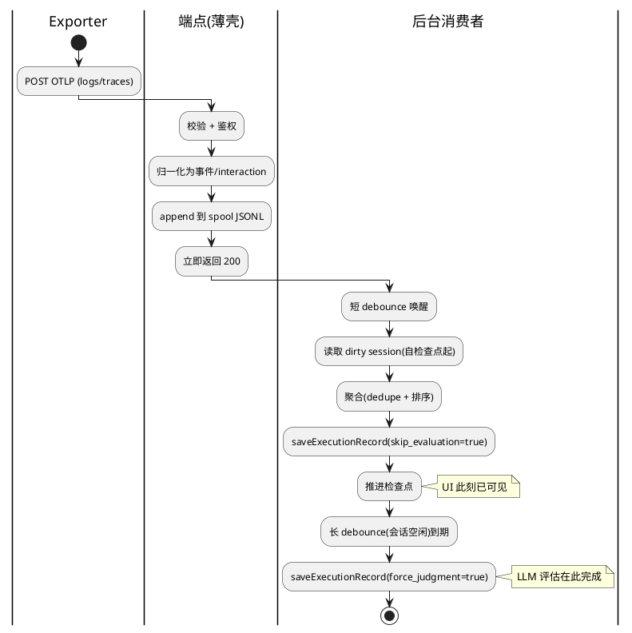

# OTel 进程内后台 Spool 消费者 — 需求分析（异步摄取第一刀）
版本：v0.2（已按 Phase1 评审 Conditional Pass 修订：补失败场景 S-008~S-010/FR-008、澄清检查点与去重职责 BR-004a、收紧可量化验收、单进程定位、已确认前提 §1.3）
最后更新：2026-06-09

> 文档类型：Phase1 需求分析 ｜ 关联项目：agent-insight
> 复杂度：**Medium**（跨 instrumentation 启动钩子 + 两个 OTel 端点 + 新建消费模块；触及摄取核心；traces 同步→异步为可观测行为变更）
> base_commit：d72f05e（master）｜ 变更类型：架构调整（接收/处理解耦）
> 关联设计：
> - [`docs/design/framework-adapter-registry/`](../framework-adapter-registry/) —— **不合并**。关注点正交：那条线管「数据怎么转换」(纯函数 transformation 层)，本设计管「处理在何时何地跑」(scheduling/execution 层)。仅在「消费者聚合时复用 adapter」一处相交，详见 §5.2。
> - [`docs/design/hermes-otel-adapter/`](../hermes-otel-adapter/) —— 并行，互不阻塞。
> - 现有 [`ClaudeLogWatcher`](../../src/lib/ingest/claude-watcher.ts) —— **共存**（本轮决策），本设计只负责 OTel spool 一路；两路重复处理同一 Claude 会话的风险仅记录为 NFR/风险，不在本轮消除。

---

## 导读（工程师先看这段）

**这是什么** —— 把 OTel 摄取的「聚合 + 落库 + 评估」从 HTTP 请求里搬出来，改由一个**进程内的后台 loop** 异步消费 spool。HTTP 端点退化成薄壳：**收下 → 写 spool → 立即返回 200**。

**为什么要做** —— 现在 [traces 端点](../../src/app/api/ingest/otel/v1/traces/route.ts) 对**每个 span** 同步做「读 session → 全量 JSON.parse/stringify 回写 → `saveExecutionRecord`」，而 `saveExecutionRecord` 内部还会**同步 `await judgeAnswer`（一次 LLM 调用）**。一个几百 span 的会话 = 上千次 DB 往返 + 可能上百次 LLM 调用，全卡在 exporter 那个 POST 里 → 超时重试 → 重复上报，雪上加霜。[logs 端点](../../src/app/api/ingest/otel/v1/logs/route.ts) 虽已落 spool，但聚合/落库/评估仍在请求内同步跑。

**不重新造轮子** —— 项目已有一套**完全可复用**的模式：[`ClaudeLogWatcher`](../../src/lib/ingest/claude-watcher.ts) 的**双 debounce**（短 debounce 快落库 `skip_evaluation:true` 供 UI 实时看；长 debounce 空闲后再 `force_judgment` 跑 LLM）。本设计把同一套模式换个数据源——从「监听 `~/.claude/projects` 文件」改成「消费 OTel 端点写的 spool JSONL」。启动落点也已现成：[`instrumentation-node.ts`](../../src/instrumentation-node.ts) 的 `setupNodeRuntime()` 钩子（Next.js 官方启动机制，单进程内最地道，**不动 start.sh**）。

**这一轮做到哪**
1. 两个 OTel 端点（logs + traces）统一改为「落 spool → 立即返回」。
2. 新建一个**单例后台消费者**，在 instrumentation 钩子里拉起，双 debounce 异步聚合落库 + 调度评估。
3. 保证**崩溃恢复（检查点）/重复去重/单消费者/spool 保留压实**四条非功能红线。

**明确不碰**（§3 边界）：不引入 Redis/BullMQ/独立 worker 进程；不改 adapter 转换逻辑（另一条线）；不动 ClaudeLogWatcher（共存）；metrics 端点维持 no-op。

---

## §1 基本信息

### 1.1 项目背景

**需求价值**：把昂贵的聚合/落库/LLM 评估移出 OTel 摄取的同步请求路径，让摄取接口在高吞吐下快速响应、抗 exporter 超时重试，并为后续规模化（独立 worker / 队列）留出干净的解耦边界。

**需求描述**：建一个**进程内单例后台消费者**（debounce/interval loop，由 instrumentation 启动钩子拉起，零新增依赖），异步消费 OTel spool（logs 与 traces 两路），完成「聚合 → 快速落库（不评估）→ 会话空闲后再跑 LLM 评估」。HTTP 端点只负责校验、写 spool、立即返回。**不是**新的协议/字段/UI，也**不是**独立进程或外部队列。

### 1.2 结构化信息

|维度|内容|
|-|-|
|Who|主体：agent-insight 平台自身（系统后台）。间接相关方：向 OTel 端点上报的 Agent 框架 exporter（Claude Code / OpenCode 等）、看 Dashboard 的用户。|
|When|OTel 数据摄取阶段（运行时常态）；以及进程启动时（清理上一代积压）。|
|What|摄取接口快速响应、不阻塞；聚合/落库/评估异步在后台完成；重启不丢不重。|
|Why|现状 traces 端点 per-span 同步落库 + 同步 `judgeAnswer` LLM 调用，导致 POST 慢（秒~分钟级）、exporter 超时重试 → 重复落库。|
|Where|单一 Next.js 进程（`npm run start`），通过 `instrumentation-node.ts` 的 `setupNodeRuntime()` 拉起后台 loop。|
|How Much|端点响应应降到「仅 spool append」量级（目标 P99 < 100ms）；后台处理不丢、不重复落库；全进程仅一个消费者实例。|
|How|exporter 仍按 OTLP http/json 正常配置上报，对其无感；后台 loop 随进程自启自停。|

### 1.3 已确认前提（来自 §5.1.2 澄清，非本阶段设计决策）

> 以下几项虽带技术取向，但均由用户在澄清环节拍板，作为**业务约束/既定前提**记录，物理实现仍留待 Phase2：

- **P-01 启动机制**：后台 loop 由 `instrumentation-node.ts` 的 `setupNodeRuntime()` 拉起，不改 start.sh（用户确认，因其为 Next.js 单进程官方启动机制）。
- **P-02 评估调度形态**：沿用既有 `ClaudeLogWatcher` 的双 debounce 语义（用户确认）。
- **P-03 部署形态**：本轮目标为单一 Next.js 进程，不引入 Redis/BullMQ/独立 worker（用户确认）。
- **P-04 数据源范围**：本轮覆盖 logs + traces 两路 spool（用户确认）。

## §2 核心能力

### 2.1 场景分析

**主成功场景**



|编号|路径|类别|触发|步骤|
|-|-|-|-|-|
|S-001|主成功|业务|exporter 上报|端点落 spool → 200；后台短 debounce 后聚合落库（skip_eval）；会话空闲后跑 LLM 评估|
|S-002|扩展|维护|进程启动|instrumentation 钩子拉起消费者，先扫一遍 spool 积压（上一代崩溃/空窗遗留）补处理|
|S-003|异常|可靠性|处理中进程崩溃/被 SIGKILL|重启后依检查点续处理，已落库的 session 不重复聚合、未处理的不丢|
|S-004|异常|可靠性|exporter 重试重发同一批|同一 span/event 重复进 spool，聚合阶段 dedupe，落库结果不重复|
|S-005|异常|可靠性|多实例/并发|确保进程内只有一个消费者 loop 在跑；若部署为多 worker，需有单消费者守卫|
|S-006|异常|性能|spool 持续增长|按保留/压实策略归档或裁剪，避免 JSONL 越啃越慢|
|S-007|备选|业务|长会话迟迟不空闲|长 debounce 一直被刷新时，由最大等待兜底触发一次评估，不至于永不评估|
|S-008|异常|可靠性|spool 写盘失败 / 磁盘满|append 是薄壳端点唯一会丢数据的同步点；写失败时**必须返回非 2xx**让 exporter 重试，不得吞掉返回 200|
|S-009|异常|业务|归一化/校验失败|traces 的 span→interaction 归并失败时，明确是「丢弃该 span 继续」还是「整批拒绝」；不得静默落入 spool 造成后续聚合脏数据|
|S-010|异常|安全|鉴权失败|无效/缺失 API key 时端点行为（现状为告警后仍继续）需明确，并明确它是否影响 200 语义与是否仍落 spool|

### 2.2 业务规则

> 本节是「系统在所有场景下都要守的约束」。其中 **BR-005 是一条可观测的行为变更（已在 §1 标注，用户已认可）**，单列说明。

|编号|描述|原因|影响范围|
|-|-|-|-|
|BR-001|端点收到合法请求后，**只做校验 + 归一化 + 写 spool**，不得在请求内做聚合/落库/评估|这是解耦的核心；任何同步重活都会让响应重新变慢|两个 OTel 端点|
|BR-001a|spool append 失败（写盘错误/磁盘满）**必须返回非 2xx**；归一化失败按 S-009 的既定策略处理，不得静默吞掉|薄壳化后 append 是唯一同步丢数据点；返回 200 会让 exporter 误以为成功而不重试（对应 S-008/S-009）|两个 OTel 端点|
|BR-002|后台消费者全进程**有且仅有一个实例**在运行|并发多实例会重复落库、争抢检查点|后台消费者|
|BR-003|落库分两段：短 debounce 落库**必须 `skip_evaluation`**；评估只在长 debounce（或最大等待兜底）触发|对齐 ClaudeLogWatcher 既有语义，把 LLM 调用彻底移出快路径|后台消费者|
|BR-004|检查点推进**必须在对应 session 成功落库之后**，且崩溃后据此续处理|先推进后落库会在崩溃时丢数据|后台消费者 / 检查点|
|BR-004a|**职责分离**：「不丢」由检查点保证（崩溃后从检查点后续处理）；「不重」由聚合期 dedupe（DC-003）保证。检查点本身**不要求幂等**——重启后重放检查点之后的事件是允许的，重复落库由 dedupe 兜住|避免 Phase2 误以为检查点需保证幂等而过度设计；明确二者职责不重叠（回应 NFR-002）|后台消费者 / 检查点|
|BR-005|**（行为变更）** traces 端点 200 响应语义从「已落库」改为「已受理」（数据稍后异步可见）|同步 per-span 落库正是要消除的瓶颈；用户已认可此语义变更|traces 端点的下游/读后即取的客户端|

### 2.3 数据约束

> 倾向**不新增数据库 schema**；检查点等运行态状态优先以 spool 目录下的状态文件承载。下表是逻辑约束，物理形态留给 Phase2。

|编号|类别|名称|描述|
|-|-|-|-|
|DC-001|状态|检查点（checkpoint）|记录每个 spool 文件已处理到的位置（偏移/行号或等价游标）；同一文件内单调不回退。**Phase2 待定**：① 用字节偏移还是行号（append 中途崩溃留半行的处理语义不同）；② 压实/裁剪某文件后其检查点游标如何失效或迁移|
|DC-002|状态|dirty session 集合|待聚合的 sessionId 集合，**可由「检查点之后的新事件」推导**——故无需独立持久化，丢失后可从检查点重建。重建可能让「已落库但检查点未推进」的 session 被重新聚合，该重复由 DC-003 去重兜住（见 BR-004a）|
|DC-003|约束|事件去重键|聚合阶段以既有 dedupe 键（如 spanId / eventKey）判重，保证重复上报不产生重复落库|
|DC-004|约束|spool 文件命名/保留|沿用现有按日期分目录的 JSONL（`spool.ts`）；新增保留窗口/压实标记，不破坏既有读取|

## §3 需求列表

### 3.1 功能性需求

|编号|类别|名称|描述|优先级|
|-|-|-|-|-|
|FR-001|端点薄壳|logs/traces 落 spool|两个端点统一改为「校验→归一化→写 spool→立即 200」。logs 已落 spool（移除请求内聚合/落库）；traces 新增 spool 写入，含 span→interaction 归并后写入|P0|
|FR-002|后台消费|单例消费者 loop|新建进程内单例消费者，由 instrumentation 钩子拉起；debounce/interval 唤醒，取 dirty session 聚合后 `saveExecutionRecord({skip_evaluation:true})`|P0|
|FR-003|评估调度|双 debounce|短 debounce 快落库（不评估）；长 debounce（会话空闲）后再以 `force_judgment` 跑 LLM 评估。沿用 ClaudeLogWatcher 模式|P0|
|FR-004|可靠性|检查点/进度跟踪|记录并推进处理进度，崩溃重启后续处理：不丢未处理事件、不重复聚合已落库 session（对应 S-003/DC-001）|P0|
|FR-005|启动补偿|backlog 清理|进程启动时扫一遍 spool 积压并补处理（上一代崩溃/启动空窗遗留），复用现有 instrumentation kick 思路|P0|
|FR-006|运维|spool 保留/压实|对已处理的历史 spool 按保留窗口归档/裁剪，控制体积与扫描成本（对应 S-006/DC-004）|P1|
|FR-007|兜底|长会话最大等待|长 debounce 被持续刷新时，由最大等待上限兜底触发一次评估（对应 S-007）|P1|
|FR-008|端点失败处理|薄壳失败路径|定义端点 append 失败（非 2xx 让 exporter 重试）、归一化失败、鉴权失败三类返回语义（对应 S-008/S-009/S-010、BR-001a）|P0|

### 3.2 非功能性需求

|编号|类别|名称|描述|优先级|
|-|-|-|-|-|
|NFR-001|性能|端点响应|端点仅做校验 + append。**基准条件**：单批 ≤ 500 span、单进程串行 append、非冷启动下，响应 P99 < 100ms 且不随单批 span 数量线性增长。注：`appendFileSync` 为同步 I/O，极端高并发下仍是潜在瓶颈，本轮接受|P0|
|NFR-002|可靠性|不丢不重|崩溃/重启后：已 append 到 spool 的事件最终都被处理（不丢）；已落库 session 不被重复聚合落库（不重）|P0|
|NFR-003|可靠性|单消费者|**本轮部署形态为单一 Next.js 进程**（§1.2 Where、§3 边界）：保证进程内仅一个消费者实例（单例 + 启动幂等）。多实例/集群下的跨进程单消费者守卫**本轮不实现**，仅作为已知前提登记，留待后续部署形态变化时评估|P0|
|NFR-004|可维护性|复用既有模式|消费者复用 ClaudeLogWatcher 的双 debounce 结构与 `aggregator`/`spool` 既有能力，作为独立模块，不复制粘贴逻辑|P1|
|NFR-005|兼容性|exporter 无感 & 共存|OTLP http/json 上报方式不变；与 ClaudeLogWatcher 文件监听路**共存**，两路重复处理同一 Claude 会话的去重风险本轮仅标注（见风险）|P1|
|NFR-006|可观测性|后台可见性|消费者的处理量/积压/失败有日志或指标，便于排查（沿用现有 `console` 日志风格即可）|P2|

## §4 验收方案

### 4.1 验收准则

|编号|关联能力|维度|描述|验收标准|
|-|-|-|-|-|
|AC-001|S-001/FR-001/NFR-001|性能|端点不再在请求内聚合/落库/评估|按 NFR-001 基准条件（单批 ≤ 500 span、单进程串行、非冷启动）：端点响应时间与 N 基本无关，P99 < 100ms（仅 append）|
|AC-002|S-001/FR-002/FR-003|功能|异步落库 + 双 debounce 评估|上报后 ≤（短 debounce + 单次落库耗时）内 Execution 行可见且为 skip_eval 态；会话空闲超过长 debounce 后，评估字段被 LLM 结果填充。短/长 debounce 默认沿用 ClaudeLogWatcher 口径（3s / 30s），具体值 Phase2 定|
|AC-003|S-003/FR-004/NFR-002|可靠性|崩溃恢复不丢不重|处理中 kill 进程并重启：未处理事件最终落库；已落库 session 不产生重复行|
|AC-004|S-004/DC-003|可靠性|重复上报去重|同一批事件重发两次，落库结果与发一次一致（无重复 interaction/无重复 Execution）|
|AC-005|S-005/NFR-003|可靠性|单消费者（单进程）|单进程内只观察到一个消费者实例在推进检查点；重复触发启动钩子不产生第二个 loop。多实例/集群守卫本轮不在验收范围（NFR-003 已登记为前提）|
|AC-006|S-006/FR-006|维护|spool 不无限增长|已处理的历史 spool 被保留窗口归档/裁剪，体积受控|
|AC-007|BR-005|兼容|traces 异步语义|traces 端点行为变更已在文档与代码注释明示；现有依赖「响应即落库」的内部调用方已盘点无受影响（或已适配）|
|AC-008|S-008/S-009/FR-008/BR-001a|可靠性|端点失败语义|模拟 append 失败（如目标不可写）→ 端点返回非 2xx；归一化失败按既定策略处理且不污染 spool|

### 4.2 测试用例

|编号|关联准则|前置条件|操作步骤|预期结果（量化指标/判断条件）|
|-|-|-|-|-|
|TC-001|AC-001|服务已启动|构造含 200 个 span 的 OTLP traces 批次 POST|响应 < 100ms；响应体为「已受理」语义；DB 此刻尚未必有数据|
|TC-002|AC-002|同上|上报后等待短 debounce|短 debounce 后 Execution 行出现且 `skip_evaluation` 态；等待长 debounce 后评估字段被填充|
|TC-003|AC-003|spool 中有未处理事件|处理过程中 `kill -9` 进程并重启|重启后该 session 最终落库一次；无重复 Execution 行|
|TC-004|AC-004|无|同一 OTLP 批次连发两次|落库后 interaction 数量与单次一致；无重复 spanId|
|TC-005|AC-005|单进程已启动|重复调用启动钩子 / 触发 HMR 重载|进程内仍只有一个消费者 loop 在推进检查点；落库无重复|
|TC-006|AC-006|spool 含跨多日历史文件|触发保留/压实|超出保留窗口的已处理文件被归档/裁剪；当日文件不受影响|
|TC-007|AC-008|spool 目录设为不可写|POST 一批合法 traces|端点返回非 2xx（让 exporter 重试）；进程不崩、无半截脏数据|

### 4.3 交付物定义

|交付物|描述|
|-|-|
|后台消费者模块|`src/lib/ingest/` 下的 OTel spool 消费者（单例 + 双 debounce + 检查点），具体文件结构留给 Phase2|
|端点薄壳改造|logs/traces 两个 `route.ts` 改为落 spool 即返回；traces 新增 span→interaction 归并 + spool 写入|
|启动接线|`instrumentation-node.ts` 中拉起消费者 + 启动 backlog 清理|
|检查点/保留机制|检查点状态与 spool 保留/压实的实现（形态见 Phase2）|
|测试|覆盖 §4.2 的用例（含崩溃恢复、去重的回归测试）|

## §5 附录

### 5.1 用户记录

#### 5.1.1 初始描述

```text
我比较关注：1. 异步执行，2. 性能提升，你帮我分析下我需要怎么整改？

（随后选定）当前先实现第一层：进程内后台消费(推荐) —— start.sh 是长驻 node 进程,
可在启动时拉起一个 debounce/interval 消费 spool 的 loop。无新依赖。
你帮我设计下，出个设计文档放到：docs/design ，同时结合之前的设计：
docs/design/framework-adapter-registry ，看是否需要合并整合（这个设计还没落地）。
```

#### 5.1.2 澄清

```text
Q：后台消费者这一轮覆盖哪些 OTel 数据源？
A：logs + traces 都接入 spool。

Q：后台 loop 的启动落点用哪个？
A：instrumentation register 钩子（推荐）—— 注：用户最初设想是 start.sh，澄清后改用
   instrumentation-node.ts 的 setupNodeRuntime()，因其为 Next.js 单进程内官方启动机制。

Q：消费者是否同时负责调度 LLM 评估（沿用 ClaudeLogWatcher 的双 debounce）？
A：双 debounce —— 快落库 + 慢评估。

Q：是否与 framework-adapter-registry 设计合并？
A：不合并，独立成文。两者关注点正交（转换 vs 调度），仅标注接口缝。

Q：哪些鲁棒性/非功能场景必须纳入本轮？
A：崩溃恢复/检查点、重复事件去重、单消费者保证、spool 保留/压实（长会话评估兜底默认已含）。

Q：新后台消费者与现有 ClaudeLogWatcher（文件监听）的关系？
A：共存，本轮仅标注两路重复处理同一 Claude 会话的去重风险，不在本轮消除。

Q：预估复杂度与 traces 转异步的行为变更，是否认可？
A：认可：Medium + 接受 traces 端点「响应=已受理」的异步语义。
```

### 5.2 与 framework-adapter-registry 的接口缝（为什么不合并）

| 维度 | framework-adapter-registry | 本设计（spool 消费者） |
|-|-|-|
| 关注点 | 数据**怎么转换**（按框架抽 skill / 归一化），纯函数 transformation 层 | 处理**在何时何地跑**（异步调度、检查点、生命周期），execution 层 |
| 是否碰 DB | 不碰（纯函数） | 经 `saveExecutionRecord` 落库 |
| 触发方 | 被调用 | 主动 loop |
| 相交点 | 唯一缝隙：消费者聚合时若需按框架转换，**调用 adapter registry 的 `getAdapter()`**，而非自己分支 | 同左 |

**结论**：两者可独立落地、互不阻塞。合并会把「本可分轮演进的两件事」耦死，放大风险。本设计落地时，聚合环节遇到「按框架转换」一律走 adapter registry 入口（若届时已落地）；未落地则沿用现有 `aggregator`/`interaction-utils` 函数，不阻塞。该回退路径与现状一致——`logs/route.ts` 当前正是直接调 `aggregateClaudeOtelSession`（纯聚合、不经 adapter registry），故「不阻塞」有现成代码为据。

### 5.3 风险登记（共存带来的去重风险）

| 风险 | 说明 | 本轮处置 |
|-|-|-|
| 双路重复处理 | ClaudeLogWatcher 监听 `~/.claude/projects` 文件、本消费者消费 OTel spool，同一 Claude 会话可能被两路各落一次 | 本轮**仅登记**为已知风险（NFR-005）；是否让 watcher 退役/加跨路去重留待后续单独评估 |
