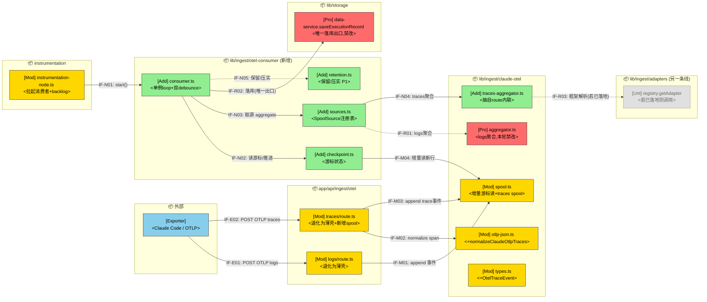
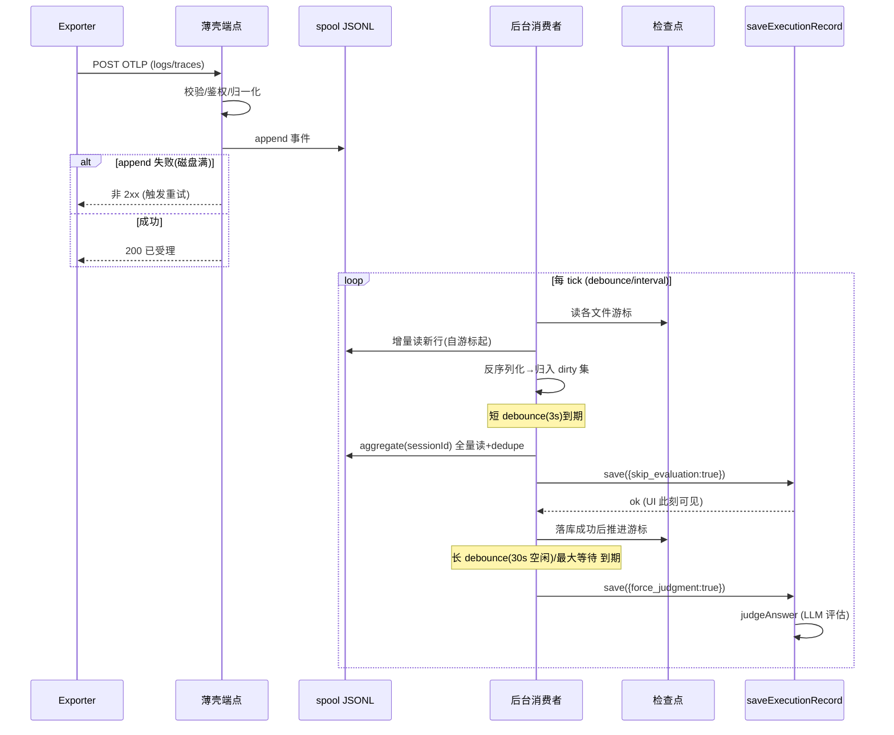
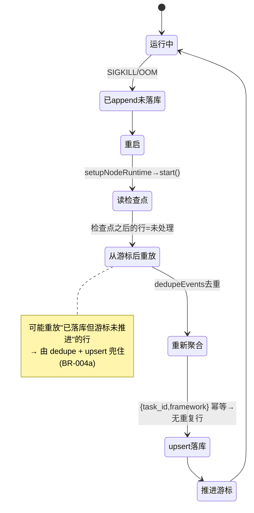

# OTel 进程内后台 Spool 消费者 — 需求设计

版本：v0.1
最后更新：2026-06-09

> 文档类型：Phase2 需求设计 ｜ 关联 Phase1：[phase1-requirements-analysis.md](phase1-requirements-analysis.md)
> base_commit：d72f05e（master）｜ 变更类型：架构调整（接收/处理解耦）｜ 复杂度：**Medium**
> 关联设计：
> - [`docs/design/framework-adapter-registry/`](../framework-adapter-registry/) —— **不合并**（§1.2 D-002）。关注点正交：那条线管「数据怎么转换」(纯函数 transformation 层)，本设计管「处理在何时何地跑」(scheduling/execution 层)。仅在聚合时的框架解析一处相交（§2.1.1 IF-R03、§7.1）。
> - [`docs/design/hermes-otel-adapter/`](../hermes-otel-adapter/) —— 并行，互不阻塞。

---

## 导读（工程师先看这段）

**这份文档定了什么** —— 把 OTel 摄取从「请求内同步聚合+落库+评估」改成「端点只写 spool 立即返回 + 一个进程内后台 loop 异步消费」。三层切分：**薄壳端点**（§2.2.1）→ **源插件**（§2.2.2，logs/traces 各自的 normalize+aggregate）→ **后台消费者**（§2.2.3，单例 loop + 双 debounce + 检查点）。

**Review 时重点看四处**
- **§2.1.2 模块变更表** = 改动清单（谁新增、谁修改、谁冻结）。
- **§5 数据模型** = 检查点状态文件 + traces 新 spool + 新 `OtelTraceEvent` 类型。这是本设计唯一的「新数据」。
- **§7.1 可靠性** = 不丢不重的红线怎么落（检查点 vs 去重职责分离，对应 Phase1 BR-004a）。
- **§4 算法** = 检查点游标的「半行容错」与双 debounce 的 per-session 调度——两处最容易写错。

**这套设计为什么不会改坏行为**（一句话）：落库出口仍是唯一的 `saveExecutionRecord`，它**按 `{task_id, framework}` upsert + 单调 merge interactions**（data-service.ts:1487/1656，机器证幂等）；后台只是把「什么时候调它」从请求线程挪到 loop 线程。traces 那条新 aggregator 是把现有 route 内联逻辑**原样抽成纯函数**，靠 golden 测试两头对（§7.1 风险 R-1）。

**术语**：`dirty session` = 检查点之后出现过新事件、待重新聚合的 sessionId；`检查点(checkpoint)` = 每个 spool 文件「已消费到第几行」的游标；`双 debounce` = 短 debounce 快落库(不评估) + 长 debounce 空闲后跑 LLM 评估（沿用 ClaudeLogWatcher 的 3s/30s 口径，**仅常量与形态复用**，见 D-001）。

---

## §1 设计概要

### 1.1 实现思路

总体思路：**接收与处理解耦**，按三层落地。

```
Exporter ──OTLP──> [薄壳端点]──append──> [spool JSONL] <──poll── [后台消费者 loop]
                    校验/归一化/写盘/200          ▲                  │ 双 debounce
                                                  │                  ├─短:saveExecutionRecord(skip_evaluation)
                                              [检查点状态文件] <──推进─┤
                                                                     └─长/兜底:saveExecutionRecord(force_judgment)
```

1. **薄壳端点**（logs + traces 两个 `route.ts`）：`校验 → 归一化为事件 → append spool → 立即 200`。请求内**不再**做任何聚合/落库/评估。
   - logs 端点：已落 spool，本轮**删掉**请求内的 `aggregateClaudeOtelSession + saveExecutionRecord` 循环（logs/route.ts:33-44）。
   - traces 端点：当前**完全没有 spool**，per-span 同步 `db.findSessionByTaskId` + JSON.parse/stringify + `upsertSession` + `saveExecutionRecord`（traces/route.ts:153-209，且未传 `skip_evaluation`，会同步触发 `judgeAnswer` LLM 调用）。本轮改为：`span → OtelTraceEvent` 归一化 → 写 traces spool → 200，**删除全部同步 DB/落库**。
2. **源插件（transformation 层）**：定义 `SpoolSource` 接口（§6.2 IF-N04），把「这一路 spool 怎么读、怎么聚合成 `ExecutionRecord`」收敛成可注册的源。logs 源复用现有 `normalizeClaudeOtlpLogs` + `aggregateClaudeOtelSession`；traces 源新增 `normalizeClaudeOtlpTraces` + `aggregateOtelTraceSession`（把 route 内联逻辑抽成纯函数）。
3. **后台消费者（execution 层，源无关）**：进程内单例 loop，由 `instrumentation-node.ts` 的 `setupNodeRuntime()` 拉起。按 spool 文件检查点增量发现 dirty session，对每个 dirty session 跑双 debounce：短 debounce → `saveExecutionRecord({skip_evaluation:true})`（UI 快可见）；长 debounce（会话空闲）或最大等待兜底 → `saveExecutionRecord({force_judgment:true})`（跑 LLM 评估）。检查点在落库成功后推进。

**为什么不动 start.sh**（Phase1 P-01）：`start.sh` 只是 `nohup npm run start`（start.sh:173），真正的「单进程内启动钩子」是 Next.js 官方的 `instrumentation.ts → register() → setupNodeRuntime()`（instrumentation.ts:10-13）。后台 loop 拉起放这里最地道，且该钩子已在做「启动补偿」类工作（instrumentation-node.ts:61-90 的 backlog uploader kick），落点同构。

### 1.2 设计决策

|编号|决策项|类别|内容|理由|
|-|-|-|-|-|
|D-001|双 debounce 复用边界|架构设计|**仅复用** ClaudeLogWatcher 的两个常量（短 3s / 长 30s）与「双计时器」形态；keying、dirty-set、最大等待兜底均为净新增|ClaudeLogWatcher 按 `filePath` 计时（claude-watcher.ts:12-13/51-73）且走 `ClaudeParser.parseFile`——与 spool 模型不通。legacy 日文件曾含多 session；当前新写入已按 session shard，但消费者仍必须**按 sessionId** 计时。且 watcher **没有**最大等待兜底（FR-007 是净新增，不能宣称「复用」）。另：`instrumentation.ts` 注明「Server-side watchers have been removed」，watcher 现在跑在客户端，本消费者是**新模块**而非复活 watcher|
|D-002|与 framework-adapter-registry 不合并|架构设计|两份设计独立落地、互不阻塞。本设计聚合环节遇到「按框架转换」走 adapter registry 入口（若已落地），否则沿用现有函数。**硬约束**：此缝**不得改变** `saveExecutionRecord` 的 `{task_id, framework}` 去重键|关注点正交（转换 vs 调度），合并会把可分轮演进的两件事耦死。代码层证据：`logs/route.ts` 当前直接调 `aggregateClaudeOtelSession`（不经 registry），回退路径有现成代码为据。registry 的 Phase3 T5 已把 `aggregator.ts:476` 的 normalize 列为**后续轮**迁移点——天然是缝不是并|
|D-003|不丢/不重职责分离|数据/可靠性|「不丢」由检查点保证（崩溃后从检查点续处理）；「不重」由聚合期 `dedupeEvents`（aggregator.ts:241）+ `saveExecutionRecord` 的 `{task_id,framework}` upsert（data-service.ts:1487）双重兜底。检查点**只在落库成功后推进**，自身**不要求幂等**|对齐 Phase1 BR-004/BR-004a。避免把检查点设计成需保证幂等而过度设计；重启后重放检查点之后的事件是允许的，重复落库由去重兜住|

---

## §2 架构设计

### 2.1 架构变更

#### 2.1.1 变更总览

> 图例：🔵外部 🟢新增 🟡修改 🔴保护(有调用但本轮禁改) ⚪不涉及(防误改)。
> 接口命名 IF-{类型}{编号}：E=外部, N=新增内部, M=修改内部, R=复用内部。



#### 2.1.2 模块变更

|模块|变更|职责|接口|依赖|约束|
|-|-|-|-|-|-|
|`otel/v1/logs/route.ts`|修改|退化为薄壳：校验→归一化→append→200|IF-E01|spool|**禁止**在请求内聚合/落库/评估；append 失败返回非 2xx|
|`otel/v1/traces/route.ts`|修改|退化为薄壳：span→OtelTraceEvent→写 traces spool→200|IF-E02|otlp-json, spool|**删除**全部同步 DB/`upsertSession`/`saveExecutionRecord`；框架值固定 `framework=serviceName`（红线，见 §7.1 R-2）|
|`otel-consumer/consumer.ts`|新增|进程内单例 loop；按检查点发现 dirty session；per-session 双 debounce 调度；park 中毒 session；计数指标|IF-N01/N02/N03/R02|checkpoint, sources, data-service|全进程**唯一实例**（globalThis 守卫 + 存 timer 句柄）；落库后才推进检查点|
|`otel-consumer/checkpoint.ts`|新增|读写每个 spool 文件的行游标状态文件；半行容错；首启种 EOF|IF-N02/M04|spool|游标只跨「以 `\n` 结尾的整行」推进（§4.1）|
|`otel-consumer/sources.ts`|新增|`SpoolSource` 注册表：logs / traces 两源的 normalize 出处与 aggregate 入口|IF-N03/N04/R01|aggregator, traces-aggregator|源无关层不得写 `framework===` 分支|
|`otel-consumer/retention.ts`|新增（P1）|已处理历史 spool 按保留窗口归档/裁剪；裁剪后失效对应游标|IF-N05|spool, checkpoint|只动「检查点已越过」的文件|
|`claude-otel/spool.ts`|修改|新增：增量游标读 `readNewLinesSince`、traces spool 的 append/list；保留现有 logs append/read|IF-M01/M03/M04|node:fs|不破坏现有 `appendClaudeOtelEvents`/`readClaudeOtelEventsForSession` 签名|
|`claude-otel/traces-aggregator.ts`|新增|`aggregateOtelTraceSession(sessionId)`：把 traces/route.ts:73-205 的内联聚合**原样**抽成纯函数|IF-N04|otlp-json, (registry 可选)|与现状逐字段等价，golden 守（§7.1 R-1）|
|`claude-otel/otlp-json.ts`|修改|新增 `normalizeClaudeOtlpTraces(body)`：`resourceSpans → OtelTraceEvent[]`|IF-M02|types|复用现有 `getOtelAnyValue`/`otelAttrsToObject`|
|`claude-otel/types.ts`|修改|新增 `OtelTraceEvent` 类型（带 parentSpanId/usage/serviceName 等 traces 专有字段）|—|—|`ClaudeOtelEvent` 不动|
|`instrumentation-node.ts`|修改|`setupNodeRuntime()` 末尾拉起消费者 + 启动 backlog 触发一次|IF-N01|consumer|失败不阻塞启动（沿用现有 try/catch 风格）|
|`claude-otel/aggregator.ts`|🔴保护|logs 聚合逻辑，本轮**只被调用不改**|IF-R01|—|`framework:'claudecode'` 硬编码维持不变|
|`data-service.saveExecutionRecord`|🔴保护|唯一落库出口|IF-R02|—|本轮**禁改**；依赖其 `{task_id,framework}` upsert 幂等|
|`lib/ingest/adapters/*`|⚪不涉及|另一条线；本设计只在已落地时调 `getAdapter`|IF-R03|—|本轮**不**为它写任何代码|

### 2.2 模块详情

#### 2.2.1 薄壳端点（logs / traces route）

- **负责职责**：OTLP 入口的「受理」——校验、鉴权（沿用现状：有 key 则解析 user，无效 key 告警后继续）、归一化为事件、append spool、立即 200。
- **功能性设计**：
  1. logs：保留 `normalizeClaudeOtlpLogs` + `appendClaudeOtelEvents`，**删除** `dirtySessionIds` 循环里的聚合/落库（logs/route.ts:32-44）。
  2. traces：新增 `normalizeClaudeOtlpTraces(body) → OtelTraceEvent[]` → `appendOtelTraceEvents`，**删除** :153-209 的 `findSessionByTaskId`/`upsertSession`/`saveExecutionRecord`。
  3. 响应体语义：从「已落库」改为「已受理」（BR-005）。
- **非功能设计**：
  1. 响应仅 = 校验 + append；目标 P99 < 100ms 且不随单批 span 数线性增长（NFR-001）。
  2. append 失败（写盘错/磁盘满）**返回非 2xx** 让 exporter 重试（BR-001a/FR-008）；归一化失败按既定策略丢弃该 span 继续，不污染 spool（S-009）。
- **风险与缓解**：
  1. traces 失去内联拿到的 user/serviceName/usage 等 → 由 `OtelTraceEvent` 字段承载（§5.3），消费者据此重建（见 §特别关注 A）。
  2. `appendFileSync` 同步 I/O，极端高并发仍是潜在瓶颈 → 本轮接受（NFR-001 备注）。

#### 2.2.2 源插件层（SpoolSource 注册表）

- **负责职责**：把「一路 spool 怎么读、怎么聚合成 `ExecutionRecord`」收敛为可注册的源；让消费者 loop 对数据源无感。
- **功能性设计**：
  1. `SpoolSource` 接口（§6.2 IF-N04）：`id`、`spoolDir()`、`aggregate(sessionId) → ExecutionRecord | null`、`defaultSkipEvaluation`。
  2. logs 源：`aggregate = aggregateClaudeOtelSession`（直接复用，`framework:'claudecode'`）。
  3. traces 源：`aggregate = aggregateOtelTraceSession`（新纯函数，`framework=serviceName`）。
- **非功能设计**：
  1. 源无关层**禁止** `framework===` 分支；按框架转换一律下沉到 aggregate 内部，且只走 adapter registry 入口或现有函数（D-002）。
- **风险与缓解**：
  1. 两源 framework 取值不一致会击穿 `{task_id,framework}` 去重 → 把 traces 的 `framework=serviceName` 钉成回归测试（§7.1 R-2）。

#### 2.2.3 后台消费者（consumer.ts）

- **负责职责**：进程内唯一 loop，驱动「发现 dirty → 聚合 → 双 debounce 落库 → 推进检查点」全过程，并做单例守卫、中毒隔离、可观测计数。
- **功能性设计**：
  1. **单例守卫**：`globalThis.__otelSpoolConsumer` 存 **timer 句柄**（非布尔）；`start()` 先 `clearInterval` 既有句柄再重排，HMR/重复钩子不产生第二 loop（TC-005）。
  2. **发现 dirty**：每 tick 经 checkpoint 增量读各 spool 文件新行 → 反序列化 → 按 sessionId 归入 dirty 集（dirty 集可由检查点重建，无需独立持久化，DC-002）。
  3. **双 debounce（per-session）**：短 timer（3s）到期 → `aggregate(sid)` → `saveExecutionRecord({...rec, skip_evaluation:true})` → 推进该文件检查点；长 timer（30s 空闲，刷新即重排）或最大等待兜底（FR-007，净新增）到期 → `saveExecutionRecord({...rec, force_judgment:true})`。
  4. **启动 backlog**：`start()` 先扫一遍 spool 补处理（FR-005）；**首启检查点缺失 → 各文件游标种当前 EOF，不回放历史**（D-003 确认项）。
  5. **中毒隔离**：某 session 的 aggregate/save 连续抛错 N 次 → park（暂置、不再每 tick 重试、不推进其检查点）；记失败计数（§7.1 R-4）。
- **非功能设计**：
  1. 单进程内仅一个实例推进检查点（NFR-003）；多实例/集群守卫本轮不实现，仅登记前提。
  2. 计数指标：每 tick 输出 processed/backlog/parked/failed（NFR-006，沿用 console 风格）。
  3. 有界并发：一个 tick 内顺序/小并发处理 dirty session，避免一次性把全部历史灌进 `judgeAnswer`（配合 D-003 EOF 种子）。
- **风险与缓解**：
  1. 长 timer 被长会话持续刷新 → 永不评估：最大等待上限兜底触发一次（FR-007）。
  2. park 的 session 永不恢复：本轮 park 后由日志暴露，人工/重启复核；自动复活留后续。

### 2.3 功能影响

```text
- agent-insight / OTel 摄取
  - 接收路径
    - logs 端点：移除请求内聚合/落库（退薄壳）
    - traces 端点：移除 per-span 同步 DB/落库/评估；新增 spool 写入
  - 处理路径（新增）
    - 后台消费者 loop：异步聚合 + 双 debounce 落库/评估
    - 检查点：崩溃恢复续处理
    - 保留/压实：控制 spool 体积（P1）
  - 响应语义
    - traces 200：已落库 → 已受理
```

|功能|变更|变更点|对应需求|
|-|-|-|-|
|logs 摄取|改|删请求内聚合/落库循环|FR-001|
|traces 摄取|改|删 per-span 同步落库；加 span→事件归一化 + spool|FR-001/BR-005|
|后台消费|增|单例 loop + dirty 发现 + 落库调度|FR-002/FR-003|
|崩溃恢复|增|检查点续处理|FR-004/NFR-002|
|启动补偿|增|backlog 扫描（首启种 EOF）|FR-005|
|spool 运维|增|保留/压实（P1）|FR-006|
|长会话兜底|增|最大等待评估|FR-007|
|端点失败语义|增|append 非 2xx / 归一化丢弃 / 鉴权|FR-008/BR-001a|

---

## §3 核心流程

### 3.1 主流程：摄取 → 异步落库 → 评估



### 3.2 崩溃恢复流程



---

## §4 算法设计

### 4.1 检查点游标推进（半行容错）

**目标**：在 `appendFileSync` 可能于崩溃时留下「半行」的前提下（spool.ts:22 以 `\n` 连接并尾随 `\n`），保证不漏处理、不把torn line 当数据（DC-001 待定项的落地）。

**核心逻辑**：

```
readNewLinesSince(file, cursor):
  raw = read(file)                       # 全量读该文件
  lastNewline = raw.lastIndexOf('\n')
  if lastNewline < 0: committed = ''     # 整个文件还没有一行写完
  else: committed = raw.slice(0, lastNewline+1)   # 只取「以 \n 结尾」的整行区
  newText = committed.slice(cursor.bytes)         # 自上次游标起的新整行
  lines = newText.split('\n').filter(非空)
  events = lines.map(安全 JSON.parse).filter(成功) # 沿用现有「坏行静默跳过」
  return { events, nextCursor: { bytes: committed.length } }
```

**输入**：`file`（spool 文件路径）、`cursor`（已消费字节数，落库成功后才持久化）。
**输出**：`events`（自游标起的新整行事件）、`nextCursor`。
**复杂度**：每 tick 每文件 O(文件大小) 读；保留/压实（§7.1 R-3）控制文件体积避免线性退化。
**边界条件与异常处理**：
- 尾部非 `\n` 结尾的字节（半行）→ 不计入 committed，本 tick 不消费，下 tick 写完整后再读。
- 文件被压实/裁剪 → 该文件游标失效并重置（retention 负责，§7.1 R-3）。
- 坏 JSON 行 → 静默跳过（沿用 spool.ts:64 现状），由计数指标暴露。

### 4.2 per-session 双 debounce 调度

**目标**：把 LLM 评估彻底移出快路径，同时保证长会话不至于永不评估（FR-003/FR-007）。

**核心逻辑**：

```
on dirtySession(sid):
  clear(short[sid]); clear(long[sid])
  short[sid] = setTimeout(3s, () => saveFast(sid))          # skip_evaluation
  if !maxWait[sid]: maxWait[sid] = setTimeout(MAX, () => saveEval(sid))  # 兜底,只设一次
  long[sid]  = setTimeout(30s, () => { saveEval(sid); clear(maxWait[sid]) })
```

**输入**：dirty 事件触发的 sessionId。
**输出**：到期回调 `saveFast`（skip_evaluation）/ `saveEval`（force_judgment）。
**边界条件与异常处理**：
- 持续刷新 → short/long 不断重排，但 `maxWait` 只设一次，到点强制评估一次（FR-007）。
- 回调内抛错 → 计入 park 失败计数，不推进检查点（D-003）。

---

## §5 数据模型

> 不新增数据库 schema、不改存量字段（沿用 Phase1 数据约束倾向）。新增的均为 spool 目录内的文件态/内存态。

### 5.1 检查点状态文件（DC-001）

**描述**：相对现状为**新增**。承载每个 spool 文件「已消费字节游标」。

**详细设计**：JSON 文件，置于各 spool 根目录（与 logs/traces 各自的 `getClaudeOtelSpoolDir()`/traces spool dir 同级），形如：

```jsonc
{
  "version": 1,
  "files": {
    "2026-06-09/sessions/session-a/logs.jsonl":   { "bytes": 10240, "updatedAt": "..." },
    "2026-06-09/sessions/session-a/traces.jsonl": { "bytes": 4096,  "updatedAt": "..." },
    "2026-06-09/traces.jsonl":                    { "bytes": 2048,  "updatedAt": "..." } // legacy daily file
  }
}
```

- 写时机：对应文件的 session 成功落库后（BR-004）。
- 首启缺失：种当前各文件 EOF（D-003，不回放历史）。
- 不要求幂等：重启后重放游标之后的行由去重兜住（BR-004a）。

### 5.2 traces spool（DC-004）

**描述**：相对现状为**新增**一路 spool（现状 traces 完全无 spool）。

**详细设计**：沿用现有按日期分目录的 JSONL 约定（与 `logs.jsonl` 并列 `traces.jsonl`），每行一个 `OtelTraceEvent`。append 用与 logs 同构的 `appendFileSync` 路径，复用 `listClaudeOtelSpoolFiles` 风格的列举。

### 5.3 OtelTraceEvent 类型（特别关注 A 的落地）

**描述**：相对现状为**新增**类型。现有 `ClaudeOtelEvent`（types.ts:3-16）是 logs 专用（eventName 语义），**缺** parentSpanId/usage/serviceName 等 traces 专有字段，故 traces 不复用该类型、不复用 `aggregateClaudeOtelEvents`。

**详细设计**（字段对齐 traces/route.ts 现内联取值，保证抽函数后等价）：

```ts
export type OtelTraceEvent = {
  receivedAt: string;
  sessionId: string;        // = explicitSessionId || service.instance.id || traceId（现状 :144-149）
  traceId?: string;
  spanId?: string;
  parentSpanId?: string;
  name?: string;
  kind: 'llm' | 'tool';     // isGenAI / isTool（现状 :94-96）
  serviceName: string;      // = framework（红线 §7.1 R-2）
  user?: string;
  model?: string;
  usage: { input_tokens; output_tokens; reasoning_tokens?; total_tokens };
  latencyMs: number;
  startTimeMs: number;
  attributes: Record<string, any>;
};
```

---

## §6 接口设计

### 6.1 外部接口

|名称|变更|描述|请求方式|请求参数|返回参数|
|-|-|-|-|-|-|
|IF-E01 logs 摄取|改|落 spool 即返回|POST `/api/ingest/otel/v1/logs`|OTLP/json logs（不变）|`{status, received}`（受理语义）|
|IF-E02 traces 摄取|改|落 spool 即返回|POST `/api/ingest/otel/v1/traces`|OTLP/json traces（不变）|`{status:'accepted'}`（受理语义，BR-005）|

> exporter 配置与上报方式**不变**（NFR-005 无感）；变化仅在响应语义与「数据稍后异步可见」。

### 6.2 内部接口

|名称|变更|描述|调用方|提供方|请求参数|返回参数|
|-|-|-|-|-|-|-|
|IF-N01 `consumer.start()`|增|拉起单例 loop（幂等：clearInterval 旧句柄）|instrumentation-node|consumer|—|void|
|IF-M04 `readNewLinesSince`|增|增量读文件新整行|consumer/checkpoint|spool|`(file, cursor)`|`{events, nextCursor}`|
|IF-N04 `SpoolSource`|增|源插件契约|consumer|sources|—|`{id, spoolDir(), aggregate(sid), defaultSkipEvaluation}`|
|IF-N04a `aggregateOtelTraceSession`|增|traces 聚合（抽自 route 内联）|traces 源|traces-aggregator|`(sessionId)`|`ExecutionRecord \| null`|
|IF-M02 `normalizeClaudeOtlpTraces`|增|span→事件归一化|traces/route|otlp-json|`(body, opts)`|`OtelTraceEvent[]`|
|IF-M03 `appendOtelTraceEvents`|增|写 traces spool|traces/route|spool|`OtelTraceEvent[]`|append 结果|
|IF-R01 `aggregateClaudeOtelSession`|复用|logs 聚合|logs 源|aggregator|`(sessionId)`|`ExecutionRecord \| null`|
|IF-R02 `saveExecutionRecord`|复用|唯一落库出口|consumer|data-service|`ExecutionRecord & {skip_evaluation\|force_judgment}`|`{success, record}`|
|IF-R03 `getAdapter`/`resolveFrameworkId`|复用(可选)|聚合内框架解析（若已落地）|traces-aggregator|adapters/registry|`(framework)`|adapter|

### 6.3 配置接口

|名称|变更|描述|类型|默认值|取值范围|
|-|-|-|-|-|-|
|`AGENT_INSIGHT_CLAUDE_OTEL_SKIP_EVALUATION`|复用|短 debounce 落库是否跳过评估|bool|`true`（现状 logs/route.ts:30）|true/false|
|`AGENT_INSIGHT_OTEL_CONSUMER_SHORT_MS`|增|短 debounce|number|`3000`|>0|
|`AGENT_INSIGHT_OTEL_CONSUMER_LONG_MS`|增|长 debounce（空闲评估）|number|`30000`|>0|
|`AGENT_INSIGHT_OTEL_CONSUMER_MAX_WAIT_MS`|增|最大等待兜底（FR-007）|number|`120000`|≥ long|
|`AGENT_INSIGHT_OTEL_CONSUMER_TICK_MS`|增|loop 轮询间隔|number|`1000`|>0|
|`AGENT_INSIGHT_OTEL_CONSUMER_PARK_AFTER`|增|连续失败 N 次后 park|number|`3`|≥1|
|`AGENT_INSIGHT_OTEL_SPOOL_RETENTION_DAYS`|增（P1）|保留窗口|number|`7`|≥1|

---

## §7 DFx 设计

### 7.1 可用性 / 可靠性

|故障/风险场景|触发|应对策略|取舍/决策|
|-|-|-|-|
|R-1 traces 抽函数改坏行为|把 route 内联聚合抽成 `aggregateOtelTraceSession`|先写 golden 测试钉死现状输出，再抽，diff 必须为空|抽函数不重写；与现状逐字段等价|
|R-2 两路 framework 去重击穿|traces 若改变 `framework=serviceName`|钉死 `framework=serviceName` 为不变量 + 回归测试「一个 task_id → 一行」跨 logs/traces|`saveExecutionRecord` 按 `{task_id,framework}` 去重，键一变就多一行（D-002 红线）|
|R-3 spool 无限增长 / 读变慢|历史文件累积|保留/压实（P1），只动检查点已越过的文件，裁剪后重置其游标|`readNewLinesSince` 每 tick 全量读，体积必须受控|
|R-4 中毒 session 反复打 LLM|aggregate/`judgeAnswer` 持续抛错|连续失败 N 次 → park，不每 tick 重试、不推进其检查点、不阻塞他人|park 后由日志暴露，人工/重启复核（自动复活后续）|
|R-5 崩溃丢/重|SIGKILL/OOM 于已 append 未落库|检查点续处理（不丢）+ dedupe+upsert（不重）|职责分离 D-003/BR-004a|
|R-6 多实例双 loop|HMR/重复钩子/多 worker|globalThis 存 timer 句柄 + start 先 clearInterval；多 worker 跨进程守卫本轮不做仅登记|NFR-003：本轮定位单 Next.js 进程|
|R-7 端点写盘失败吞 200|磁盘满/目录不可写|append 失败返回非 2xx 让 exporter 重试|BR-001a/FR-008|

### 7.2 性能

|指标|目标值|模块分解|分解假设|
|-|-|-|-|
|端点响应|P99 < 100ms|校验 + 归一化 + `appendFileSync`|单批 ≤ 500 span、单进程串行 append、非冷启动；不含聚合/落库/LLM|
|UI 可见延迟|≤ 短 debounce + 单次落库|3s + saveExecutionRecord|短 debounce 默认 3s|

**优化措施**：

|关注点|应对策略|取舍/决策|
|-|-|-|
|LLM 调用卡请求|移出快路径，长 debounce 异步跑|traces 200 语义变「已受理」（BR-005）|
|首启历史风暴|检查点缺失种 EOF，不回放历史|放弃首启补历史，换可控负载（D-003 确认项）|
|aggregate 全量重读 session|接受全量读 + dedupe（与现状一致）|正确性优先；体积由保留/压实控|

### 7.3 安全性

|高风险项|类型|风险分析|应对策略|
|-|-|-|-|
|鉴权失败仍落 spool|授权认证|现状为无效 key 告警后继续（traces/route.ts:33-35）|本轮**维持现状语义**，明确记录：鉴权失败不影响 200/落 spool（S-010），不在本轮收紧|

### 7.4 其他

|目标|类型|应对策略|取舍/决策|
|-|-|-|-|
|复用既有模式|可维护性|消费者复用 `aggregator`/`spool` 既有能力，作为独立模块，不复制 watcher 逻辑|D-001：仅复用常量+形态|
|可扩展（多源）|可扩展性|`SpoolSource` 注册表，未来新源只注册不改 loop|源无关层禁 `framework===` 分支|
|可测试|可测试性|纯函数 aggregate + 注入 spoolDir/常量；崩溃恢复、去重、半行容错可单测|TC-001~007 覆盖|
|与 registry 协同|可升级性|聚合内框架解析走 registry 入口或回退现有函数|D-002：缝不改去重键|

---

## §8 附件

### 8.1 与 framework-adapter-registry 的接口缝（为什么不合并，代码级）

| 维度 | framework-adapter-registry | 本设计（spool 消费者） |
|-|-|-|
| 关注点 | 数据**怎么转换**（skill 抽取 / claude 归一化），纯函数 | 处理**在何时何地跑**（异步调度、检查点、生命周期） |
| 是否碰 DB | 不碰 | 经 `saveExecutionRecord` 落库 |
| 触发方 | 被调用 | 主动 loop |
| 唯一缝 | `aggregator.ts:476` 的 `normalizeClaudeCodeInteractionsForStorage`、traces 的 serviceName→framework 解析 | 聚合时若按框架转换，调 `getAdapter()`/`resolveFrameworkId`，否则用现有函数 |
| 硬约束 | （registry 红线：不改存量、resolveFrameworkId 翻译）| 缝**不得改变** `{task_id,framework}` 去重键（R-2） |

**结论**：两者独立落地、互不阻塞。registry Phase3 T5 已把 `aggregator.ts:476` 列为**后续轮**迁移点——天然是缝不是并。本设计落地时遇「按框架转换」走 registry 入口（若已落地），未落地则沿用现有函数，与现状 `logs/route.ts` 直调 `aggregateClaudeOtelSession` 一致，有现成代码为据。

### 8.2 特别关注（实现期重点核对）

- **A. traces 事件需新类型**：`ClaudeOtelEvent` 缺 parentSpanId/usage/serviceName，traces 必须用 `OtelTraceEvent`（§5.3）并新建 `aggregateOtelTraceSession`，不能复用 logs aggregator。
- **B. skip_evaluation 默认翻转**：traces 现状 per-span **同步评估**（route 调 save 未传 skip）；改双 debounce 后 traces 首次获得「先 skip 后 judge」生命周期。须审计依赖「响应即落库/即评估」的下游与 Dashboard（AC-007）。
- **C. 首启 backlog 与检查点交互**：检查点缺失时种 EOF（D-003），避免首部署一次性把全部历史 session 灌进 `saveExecutionRecord`/`judgeAnswer`（`readClaudeOtelEventsForSession` 现为全文件扫描，O(sessions×files)）。

### 8.3 现状代码锚点（review 对照）

| 现状 | 文件:行 |
|-|-|
| logs 请求内聚合/落库（待删） | logs/route.ts:32-44 |
| traces per-span 同步 DB/落库/评估（待删） | traces/route.ts:153-209 |
| traces 内联取值（抽函数来源） | traces/route.ts:73-205 |
| logs 聚合（复用，禁改） | aggregator.ts:493-500 / dedupeEvents:241 |
| logs 归一化（复用） | otlp-json.ts:69-115 |
| spool append/read（扩展） | spool.ts:25-69 |
| 双 debounce 形态来源（仅借鉴） | claude-watcher.ts:18-73 |
| 落库幂等键 / 评估门控（依赖） | data-service.ts:1487 / 1656 / 1775-1865 |
| 启动钩子（拉起落点） | instrumentation.ts:10-13 / instrumentation-node.ts:18-91 |
| globalThis 单例先例 | debug/execute/route.ts:26-29 |
