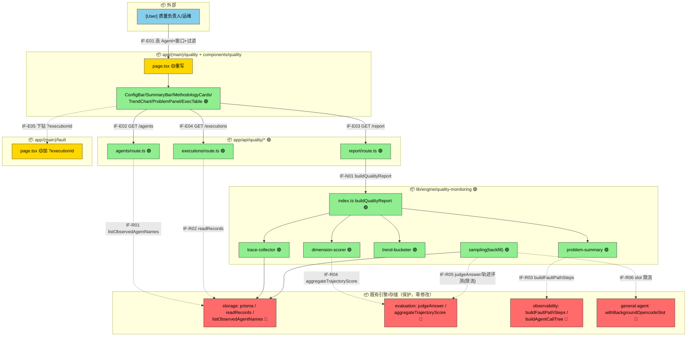
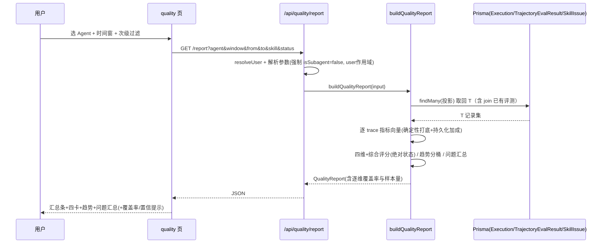
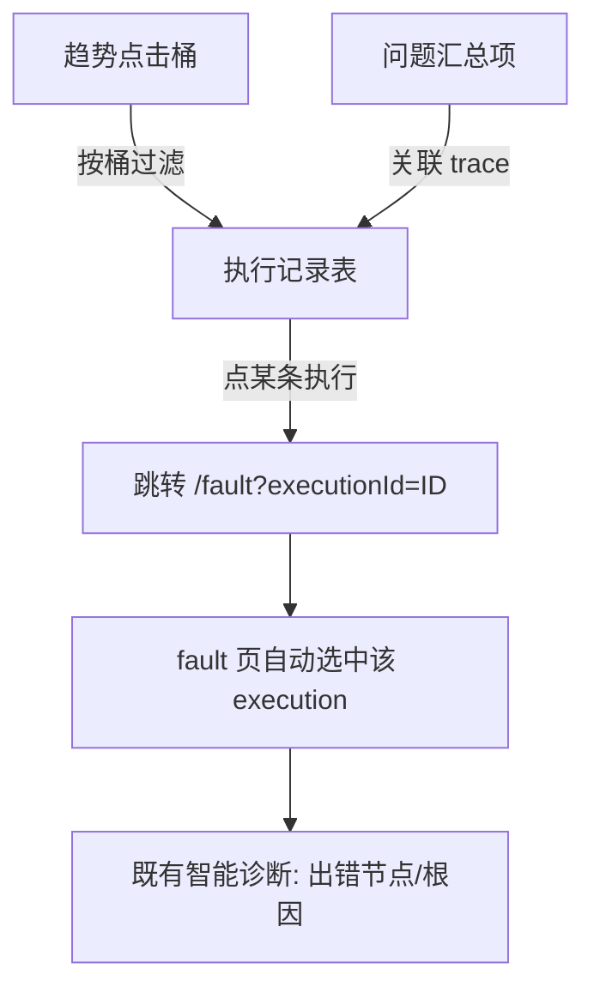

# 质量监控（Quality Monitoring）模块 — 系统设计规格

版本：1.1
最后更新：2026-06-05

> 阶段：Phase2 需求设计（AET analysis-and-design）｜ 难度：Medium ｜ 上游：[需求分析规格 v1.1](./quality-monitoring-requirements.md)
> 目标：把需求转化为**可实现、可集成、可演进**的系统方案。设计已通过独立 subagent 可行性验证（verdict: feasible-with-revisions），验证结论已并入下文设计决策。
> 落地约束：复用现有 `/quality` 路由；**深度复用现有引擎且零修改**（`judgeAnswer`/`evaluateTrajectory`/`aggregateTrajectoryScore`/`buildFaultPathSteps`/`buildAgentCallTree`/`withBackgroundOpencodeSlot`/`readRecords`）。技术栈：Next.js App Router + React 19 + TS + Prisma(SQLite/OpenGauss) + recharts。

---

## 导读（内容摘要）

> 本节把这篇设计文档的实质内容浓缩成一页，工程师读完即可掌握"代码怎么落、为什么这么定"，无需通读全文。

**改动范围一览**：
- 🟢 **新增**领域引擎 `lib/engine/quality-monitoring/`（`trace-collector` / `dimension-scorer` / `trend-bucketer` / `problem-summary` / `sampling` + 编排 `buildQualityReport`）；3 个只读路由 `app/api/quality/{agents,report,executions}`；组件 `components/quality/*`。
- 🟡 **修改**：重写占位页 `(main)/quality/page.tsx`；给 `(main)/fault/page.tsx` 加 `?executionId` 下钻入口（仅加性）；`locales/{zh,en}.ts` 加文案。
- 🔴 **保护（零修改复用）**：`storage`(readRecords/prisma/listObservedAgentNames)、`evaluation`(judgeAnswer/aggregateTrajectoryScore)、`observability`(buildFaultPathSteps/buildAgentCallTree)、`general-agent`(withBackgroundOpencodeSlot)。
- ⚪ **不动** `prisma/schema.prisma`（MVP 不建表）。

**四个关键决策（全篇的魂）**：
- **D-001 请求路径只读 + 确定性打底 + 采样异步回填**：因 `answerScore` 仅在命中 ground-truth Config 时才写、过程分在独立 `TrajectoryEvalResult` 表且实时评测要拉 opencode 子进程——所以 `/report` 只读已落库字段做内存聚合，结果/过程维以**确定性信号**(如 `isSuccess()`、工具错误率)打底，judge/轨迹缺口由**后台采样回填**补，**绝不在请求里同步跑重评测**（保 NFR-003 时延 + NFR-001 成本）。
- **D-002 MVP 不建表**：趋势在内存按时间分桶（对齐既有 `dashboard/stats` 写法）；跨窗口基线表 `QualitySnapshot` 延后。
- **D-003 问题汇总双源**：结构化错误事件由 `buildFaultPathSteps()` **重解析原始交互**按(节点×错误码×对象)聚类（持久化 `failures` 是自由文本，出不了结构化键）；评测问题来自 `failures/skillIssues/SkillIssue/低分维度`；合并去重后按影响度排序。
- **D-004 共享引擎零改**，单条诊断仅靠 `/fault?executionId` 联动跳转，不重建。

**数据与接口**：数据源 = `Execution`(主) + `TrajectoryEvalResult`(按 executionId join) + `SkillIssue` + `Session.interactions`(错误解析) + `RegisteredAgent`(选择器)；内存 DTO `TraceLite/QualityReport/TrendBucket/ProblemItem` 字段级形状见 §5.2；对外 `GET /agents`、`/report`、`/executions`（取值域见 §6.1）；引擎内编排序 **collect → problem → score(错误维消费问题汇总) → trend**。

**四个核心算法（§4）**：四维评分+绝对状态；趋势自适应分桶(二值算比率 / 连续量算 p50·p90·p95)；问题汇总双源合并+影响度排序+帕累托；采样回填。

**DFx 要点**：性能靠"只读 + 投影查询 + 并行 + 桶数封顶"守 SLA_refresh；安全靠 `resolveUser` + `{user}OR{null}` 作用域 + 强制 `isSubagent:false`；可靠性靠"样本不足降级 + 空态 + 回填失败隔离"。

**状态**：已过独立可行性验证(feasible-with-revisions) + 设计评审(Conditional Pass，修订已并入)。

---

## §1 设计概要

### 1.1 实现思路

在现有「app(路由) → lib(引擎) → storage(Prisma)」分层上，新增一个自包含的领域引擎与一组只读聚合接口，重写占位页，不触碰共享评测引擎的实现：

- **新增** `src/lib/engine/quality-monitoring/`（领域引擎：圈定 trace → 抽取逐 trace 指标向量 → 四维+综合评分 → 趋势分桶 → 统一问题汇总）。
- **新增** `src/app/api/quality/*`（`agents` / `report` / `executions` 三个 GET 路由，遵循 `dashboard/stats` 路由范式）。
- **重写** `src/app/(main)/quality/page.tsx`（由 `ComingSoon` 占位 → 真实页面：配置区 + 汇总条 + 四卡 + 趋势 + 问题汇总 + 执行记录表）。
- **新增** `src/components/quality/*`（页面所需展示组件，复用 `AppTopBar`/`StatusBadge`/`Term` + recharts）。
- **小幅修改** `src/app/(main)/fault/page.tsx`（新增读取 `?executionId=` 自动选中，作为单条 trace 诊断下钻入口）+ `src/locales/{zh,en}.ts`（新增文案键）。

**三条贯穿原则（源自可行性验证）**：
1. **请求路径只读已持久化值** —— 页面/`report` 接口绝不在请求内同步跑 `judgeAnswer`/轨迹评测（后者会拉起 opencode 子进程、秒级~分钟级），只读 `Execution` 及关联表已落库的字段，保证 NFR-003 重算时延可控。
2. **覆盖率优先 + 确定性打底** —— `answerScore`/轨迹分常缺失（前者依赖 ground-truth Config 命中，后者落在独立 `TrajectoryEvalResult` 表）。故结果/过程维**以确定性信号为主路径**（复用现有 `isSuccess()` 口径：`isAnswerCorrect`/`toolCallErrorCount`/`failures` 是否为空；过程维用工具错误率/步数 + join 已有轨迹分），持久化 judge 分作为加成；**逐维度显式标注覆盖率**（NFR-002/BR-007）。
3. **judge/轨迹类指标采样异步回填** —— 对未评测的采样子集，经 `withBackgroundOpencodeSlot` 限流后台跑、写回 DB，下次读取即命中；页面只反映"截至当前已落库"的覆盖（NFR-001）。

### 1.2 设计决策

|编号|决策项|类别|内容|理由|
|-|-|-|-|-|
|D-001|请求路径只读 + 确定性打底 + 采样异步回填|架构/DFx|`report` 接口只读 `Execution`/`TrajectoryEvalResult`/`SkillIssue` 已落库字段做内存聚合；结果维主路径为确定性 `isSuccess()` 口径、过程维为工具错误率/步数 + join 已有轨迹分，judge/轨迹类缺口由独立后台采样任务（`withBackgroundOpencodeSlot` 限流）回填。|验证确认 `answerScore`/`isAnswerCorrect` 仅在 ingest 命中 outcome Config 时写入（`api/ingest/upload/route.ts`），过程分不在 `Execution` 上而在 `TrajectoryEvalResult`，且实时轨迹评测需拉子进程。同步评测会击穿 NFR-003 并放大成本；只读+采样回填同时满足 NFR-001/002/003。|
|D-002|MVP 不新增 Prisma 模型，趋势在内存按时间分桶|架构/数据|窗口内趋势由 `prisma.execution.findMany({where:{agentName,isSubagent:false,timestamp:{gte,lte}}, select})` 取回后在 JS 内分桶聚合（对齐 `dashboard/stats` 既有内存聚合范式，代码库当前无 Prisma `groupBy`/分位 SQL）。跨窗口长期基线快照表 `QualitySnapshot` 延后到第二阶段。|最小改动、零迁移风险；窗口即趋势统计范围（需求 BR-003），窗口内 records 足以现算趋势；NFR-008"自身历史基线"仅在跨窗口对比时才需要落库快照，非 MVP 必需。|
|D-003|统一问题汇总=双源合并，结构化错误由 trace 重解析|架构/算法|结构化错误事件由 `buildFaultPathSteps(interactions)` 重解析原始交互、取 `status==='error'` 步并按 `(kind/节点 × 错误码 × 对象)` 聚类；评测问题来自 `Execution.failures`/`skillIssues`(JSON) + `SkillIssue` 表 + 低分/失败维度；二源合并去重后按影响度（频次×严重度）排序。|验证确认持久化 `failures` 是 LLM 生成的**自由文本**（`failure_type/description/...`，无 `errorCode/object` 字段），无法直接产出 BR-012 的结构化三元组；结构化键只能来自 fault-path 重解析。自由文本 `failures` 仅作语义来源。|
|D-004|共享引擎零修改，仅 fault 页加 `?executionId` 下钻入口|变更点/兼容|`judgeAnswer`/`aggregateTrajectoryScore`/`buildFaultPathSteps`/`buildAgentCallTree`/`withBackgroundOpencodeSlot`/`readRecords` 全部按现状复用、不改签名；单条 trace 诊断下钻通过给 `fault` 页新增"读取 `?executionId` 并自动选中"实现（现状仅支持 `?agent=` + 页内选择）。|遵循"最小改动 + 职责不重复"（BR-011）；保护核心评测/接入链路稳定性，避免引入回归。|

---

## §2 架构设计

### 2.1 架构变更

#### 2.1.1 变更总览

> 图例：🟢新增 🟡修改 🔴保护(被调用但本期禁止改动) ⚪不涉及。接口命名 IF-{E外部/N新增内部/M修改内部/R复用内部}{编号}。



#### 2.1.2 模块变更

|模块|变更|职责|接口|依赖|约束|
|-|-|-|-|-|-|
|`lib/engine/quality-monitoring`|新增|圈定 T、抽取逐 trace 指标向量、四维+综合评分（绝对状态）、趋势分桶、统一问题汇总、采样回填编排|`buildQualityReport`(IF-N01) 等内部接口（§6.2）|storage、evaluation、observability、general-agent|纯聚合函数为主、可单测；请求路径不触发同步重评测|
|`app/api/quality/*`|新增|HTTP 入口：`/agents`、`/report`、`/executions`|IF-E02/03/04（§6.1）|engine/quality-monitoring、auth、storage|`resolveUser` 鉴权；查询强制 `isSubagent=false` 且 `{user} OR {user:null}` 作用域；`force-dynamic`|
|`app/(main)/quality/page.tsx`|修改|由 ComingSoon 占位重写为真实质量监控页|消费 IF-E02/03/04|components/quality、client/api、locale|`'use client'`；切 Agent/窗口/过滤触发全页重算（BR-002）|
|`components/quality/*`|新增|配置区/汇总条/四卡/趋势图/问题汇总面板/执行记录表|—|recharts、shell/AppTopBar、feedback/StatusBadge、text/Term|复用既有 UI 原子；不新建设计令牌|
|`app/(main)/fault/page.tsx`|修改|新增读取 `?executionId=` 并自动选中，作为单条 trace 诊断下钻入口|IF-E05|既有 fault 逻辑|仅加性修改，不改既有 `?agent=` 行为|
|`src/locales/{zh,en}.ts`|修改|新增质量监控页文案键|—|—|仅新增键，不动既有键|
|`lib/storage/*`（prisma/readRecords/listObservedAgentNames）|保护|trace 读取与 Agent 枚举|IF-R01/R02|—|禁止改签名；时间窗过滤经 `findMany` 的 `timestamp` 条件实现，不改 `ReadRecordFilters`|
|`lib/engine/evaluation`、`observability`、`general-agent`|保护|judge/轨迹聚合、fault-path 解析、slot 限流|IF-R03/R04/R05/R06|—|按现状复用，零修改|
|`prisma/schema.prisma`|不涉及(MVP)|—|—|—|MVP 不新增模型；`QualitySnapshot` 表为第二阶段|

### 2.2 模块详情

#### 2.2.1 engine/quality-monitoring（核心）

- **负责职责**：质量监控的全部领域计算。给定 `(agent, window, filters)`，产出 `QualityReport`（综合分+四维分+绝对状态+趋势+问题汇总+逐维覆盖率）；并提供独立的采样回填编排。
- **功能性设计**：
  1. `trace-collector`：按 `agentName + isSubagent=false + timestamp∈[from,to] + {user}OR{null}（+skill/状态）` 经 prisma 投影查询取回 T 的精简记录集（FR-001、DC-001）。
  2. `metric-extractor`：逐 trace 产出指标向量——结果（确定性 `isSuccess` 主路径 + 持久化 `answerScore` 加成 + 安全命中）、过程（工具错误率/步数确定性 + join `TrajectoryEvalResult` 已有维度分）、成本（tokens/cost/latency/steps 原始量）、错误（从 `failures`/`skillIssues` 与 fault-path 抽取）。
  3. `dimension-scorer`：在 T 上聚合四维分，按 P0/P1/P2 加权出综合分、P0 硬阈值封顶降级、**绝对阈值**定状态（FR-002~007、BR-010；权重/阈值为配置参数 §6.3）。
  4. `trend-bucketer`：窗口自适应分桶（BR-008），桶内二值算比率/连续量出分位（BR-009），输出多维趋势 + 每桶样本量。
  5. `problem-summary`：双源合并的统一问题汇总（详见 §4.3，FR-008/009/015）。
  6. `sampling`：采样策略 + `withBackgroundOpencodeSlot` 限流回填（详见 §4.4，NFR-001），与请求路径解耦。
- **非功能设计**：纯函数可单测（对齐既有 `test/` 套件）；逐维覆盖率与有效样本 n 随结果返回（NFR-002/006）；不在请求内跑重评测（NFR-003）。
- **风险与缓解**：① 评测覆盖低 → 确定性打底 + 显式覆盖率 + 样本不足降级（BR-007）。② 大 T 性能 → 投影 `select` + 并行查询 + 桶数封顶 + 执行表分页。

#### 2.2.2 app/api/quality/*

- **负责职责**：HTTP 入口与鉴权、参数解析、调用引擎、组织响应。
- **功能性设计**：`GET /agents` 返回可选 Agent（复用 `listObservedAgentNames` + `RegisteredAgent` 富化）；`GET /report` 返回完整报告；`GET /executions` 返回 T 或某桶的执行记录（分页，供表格与桶下钻，可复用 `readRecords`）。
- **非功能设计**：`resolveUser(req)` 鉴权；查询强制 `isSubagent=false` 与用户作用域；`export const dynamic='force-dynamic'`；错误返回 `{error}` + HTTP 状态。
- **风险与缓解**：大结果 → 分页 + 投影；与 `dashboard/stats` 范式一致，降低维护成本。

#### 2.2.3 app/(main)/quality/page.tsx + components/quality

- **负责职责**：信息架构落地——配置→结论→顺四维下钻→执行记录→单条 trace。
- **功能性设计**：`QualityConfigBar`（Agent 选择 + 时间过滤 + 次级过滤）、`QualitySummaryBar`（综合分+状态+P0/P1/P2 条+评估次数/达标率/报错数）、`MethodologyCards`（结果/过程/成本/错误四卡，分数+一句诊断+锚点）、`QualityTrendChart`（recharts 多维趋势+样本量柱）、`ProblemSummaryPanel`（统一问题列表，按影响度排序+下钻）、`ExecutionScoreTable`（执行记录→`?executionId` 跳 fault）。
- **非功能设计**：`useLocale` 双语；复用既有 UI 原子与设计令牌；切换条件全页重算（BR-002）。
- **风险与缓解**：桶/行过多 → 桶数封顶 + 表格分页;空/低样本 → 空状态与置灰（S-007/S-011）。

### 2.3 功能影响

```text
- Agent Insight / 运行观测
  - 质量监控（/quality）
    - 配置与范围圈定（新增）
    - 四维评分与绝对综合分/状态（新增）
    - 多维质量与成本趋势（新增）
    - 统一问题汇总（错误+评测）（新增）
    - 执行记录评分表 + 单条 trace 下钻（新增）
  - 智能诊断（/fault）
    - 单条 trace 诊断（保护）+ executionId 下钻入口（修改/加性）
```

|功能|变更|变更点|对应需求|
|-|-|-|-|
|配置与范围圈定|增|Agent+时间+次级过滤 → 圈定 T 驱动全页|FR-001|
|四维评分与综合分/状态|增|结果/过程/成本 + 绝对综合分与状态|FR-002~007|
|统一问题汇总|增|错误事件 + 评测问题合并、影响度排序、下钻|FR-008/009/015|
|多维趋势|增|自适应分桶 + 多维折线 + 样本量柱|FR-010/014|
|执行记录表 + 下钻|增/改|执行成行 + 跳转单条诊断（fault 页加 `?executionId`）|FR-016、BR-011|
|采样异步回填|增|未评测采样子集后台评测写回|NFR-001|

---

## §3 核心流程

### 3.1 主流程：选 Agent → 报告渲染（请求路径，只读）



### 3.2 下钻流程（桶/问题/执行行 → 单条 trace 诊断）



### 3.3 采样异步回填流程（与请求路径解耦）

```mermaid
flowchart TD
    T[触发: 定时/手动/报告检测到低覆盖] --> S[选采样子集(未评测的T子集)]
    S --> L["withBackgroundOpencodeSlot 限流"]
    L --> J["judgeAnswer / 轨迹评测"]
    J --> W[写回 Execution.answerScore/failures 等 & TrajectoryEvalResult]
    W --> R[下次 /report 读取即命中, 覆盖率上升]
```

---

## §4 算法设计

### 4.1 四维评分与绝对综合分

**目标**：在 T 上得到四维分与综合分/状态，覆盖率优先、确定性打底（FR-002~007、BR-001/004/010）。

**核心逻辑**：
```
对每条 trace 产出指标向量：
  结果 = 主: isSuccess(isAnswerCorrect, toolCallErrorCount, failures空?)  // 确定性
         加成: answerScore(若非空)                                       // judge(已落库)
         安全: 命中注入/越权/PII ? 0 : 1                                  // 0容忍, 触发硬降级
  过程 = 主: 工具错误率/步数派生(确定性)
         加成: TrajectoryEvalResult.dimensionScores(join executionId, 若有)
  成本 = tokens / cost / latency / steps(原始量, 确定性, 必有)
  错误 = 由 §4.3 问题汇总反哺(错误密度/严重度)
聚合(对整个 T):
  各维 = 有效样本上的均值/比率(记录 n 与覆盖率)
  综合分 = w0*P0均 + w1*P1均 + w2*P2均           // 权重为配置参数
  若任一 P0 硬阈值命中 → 综合分封顶降级并标红     // BR-004/010
  状态 = 绝对阈值(达标/关注/异常)                  // 不含任何百分位/同类(BR-006)
```
**输入**：T 的逐 trace 精简记录（含持久化评测字段 + join 轨迹分）。
**输出**：`{ composite{score,status,p0,p1,p2}, dimensions{result,process,cost,error}, coverage{perDimension}, n }`。
**复杂度**：O(|T|) 单遍 + O(1) 聚合。
**N/A 与分母规则（BR-005）**：所有占比型指标统一遵循"N/A 不计入分母"——未触发 skill 的 trace 其 Skill 遵从记 N/A、不参与分母（System-prompt 遵循仍计）；过程维各占比子指标同理仅在有效样本上求均值。MVP 中过程维以工具错误率/步数确定性信号 + join 已有轨迹分为主，**计划遵循/约束遵循两层/工具输出归因（FR-011/012/013）连同其更细的 N/A 分层在第二阶段补全**（§8.3），但 N/A-不入分母 的口径在 MVP 即对所有比率型生效。
**完成度 [0,1] 路径（FR-002）**：MVP 结果维以二值 `isSuccess()` 打底；完成度 ∈[0,1] 的离散 rubric / 多准则逐项加权属 judge 支撑路径，依赖已落库 `answerScore` 或采样回填（§4.4），无 ground truth 时按确定性断言。
**边界与异常**：有效样本 < θ_sample → 该维置灰标置信度（BR-007）；过程维 join 命中率低 → 仅以确定性信号给分并标覆盖率；T 为空 → 空状态。

### 4.2 趋势自适应分桶与桶内聚合

**目标**：把"一条 trace=某时刻一个分数向量"变为可连线的趋势（BR-008/009、FR-010/014）。

**核心逻辑**：
```
粒度 = pickGranularity(window): 使桶数 ∈ [N_min,N_max]   // 一周→按天(7) 一天→按小时(24)
对每桶:
  二值/分类型(完成/安全/工具对错) → 比率(桶内命中/桶内n), 归一0-100, 可叠置信带
  连续型(steps/token/latency/效率/归因)   → 分位(p50主线 + p90/p95带)   // 成本看p95长尾
  附 n_traces(样本量柱)
异常桶(分骤降/错误尖峰) → 打 marker
```
**输入**：T + 选定维度。**输出**：`{ granularity, buckets: TrendBucket[] }`。
**复杂度**：O(|T| + B·log)（桶内分位排序）。**边界**：稀疏桶 → 样本量柱兜底 + 置信带变宽（防骗人）。

### 4.3 统一问题汇总（双源合并）

**目标**：让开发者看到"哪些问题在拖累 agent"（FR-008/009/015、BR-012/013、DC-009）。

**核心逻辑**：
```
来源A 结构化错误事件:
  对 T 中每条 trace 取原始 interactions → buildFaultPathSteps()
  取 status=='error' 步 → 键 = (kind/节点类型 × 错误码 × 对象)
  结构化分组(覆盖大头); 无码的自由文本失败原因 → 语义聚类+命名(第二阶段)
来源B 评测问题:
  Execution.failures(JSON, 自由文本) + skillIssues(JSON) + SkillIssue表(severity/summary/suggestedFix/category)
  + 低分/失败的指标维度(来自§4.1)
合并:
  规范化为 ProblemItem{问题描述,来源∈{错误,评测},受影响维度,频次,严重度,归因标签,关联trace[]}
  跨源去重(dedupKey: 节点/类目+规范化摘要)
  排序键 = 影响度(频次 × 严重度 / 受影响维度)            // BR-013
  附帕累托(频次降序+累计占比) + 归因标签(agent逻辑/模型/工具infra/外部输入)
```
**输入**：T（+按需取 `Session.interactions`/`Execution` 原始交互）。**输出**：`ProblemItem[]`（已排序）+ 帕累托元数据。
**复杂度**：O(Σ steps) 解析 + O(K log K) 排序。**边界**：无错误/评测问题 → 空清单；交互缺失的 trace 跳过结构化解析并计入覆盖率。

### 4.4 采样与回填策略

**目标**：控 judge/轨迹评测成本同时提升覆盖（NFR-001）。

**核心逻辑**：`未评测子集 → 按预算/采样率选样 → withBackgroundOpencodeSlot(限流) → judge/轨迹评测 → 写回 DB`。请求路径不参与。采样率/预算为配置参数；回填失败隔离不影响读路径。

---

## §5 数据模型

### 5.1 数据来源（复用既有，MVP 无 schema 变更）

**描述**：相对现有系统**零表结构变更**。质量监控读取以下既有数据：

|实体|用途|关键字段|
|-|-|-|
|`Execution`|逐 trace 指标向量主源|`agentName/agentId,timestamp,isSubagent,tokens,cost,latency,toolCallCount,llmCallCount,toolCallErrorCount,isAnswerCorrect,answerScore,skillScore,skillTriggerRate,failures(JSON),skillIssues(JSON),invokedSkills,framework,model`|
|`TrajectoryEvalResult`|过程维加成（join `executionId`）|`trajectoryScore,dimensionScoresJson,deviationStepsJson`|
|`SkillIssue`|问题汇总·评测来源|`source,severity,summary,suggestedFix,dedupKey,category,dimension,resolvedAt`|
|`Session`/`Execution.interactions`|结构化错误事件解析源|原始 `interactions`（喂 `buildFaultPathSteps`）|
|`RegisteredAgent`|Agent 选择器富化|`platform,name,agentType,agentOwnership,user`|

### 5.2 内存数据模型（引擎产物，非持久化）

**`TraceLite`（投影 DTO，`collectTraces` 产出、四个聚合函数共同消费的中心契约）**：
```ts
TraceLite {
  executionId: string; taskId?: string; ts: string|Date;
  agentName?: string; framework?: string; model?: string;
  // 结果维(确定性打底 + judge加成)
  isAnswerCorrect?: boolean|null; answerScore?: number|null; toolCallErrorCount?: number;
  failures?: FailureItem[];          // 解析自 Execution.failures(JSON)
  // 过程维(确定性 + join 轨迹)
  toolCallCount?: number; llmCallCount?: number; stepCount?: number;
  trajectory?: { score: number; dims: { completeness?: number; toolChoice: number; redundancy: number } } | null; // join TrajectoryEvalResult
  skillTriggerRate?: number|null; invokedSkills?: {name:string;version:number|null}[];
  // 成本维(原始量, 必有)
  tokens?: number; cost?: number; latency?: number;
  // 问题来源
  skillIssues?: SkillImprovementItem[]; // 解析自 Execution.skillIssues(JSON)
  // 安全(命中即0)
  safety?: 0|1;
}
```
**`QualityReport`（`/report` 返回体）**：
```ts
QualityReport {
  composite: { score: number; status: '达标'|'关注'|'异常'; p0: number; p1: number; p2: number; capped: boolean };
  dimensions: { result: DimScore; process: DimScore; cost: DimScore; error: DimScore };
  // DimScore { score: number; coverage: number; n: number; signal?: string }  // coverage∈[0,1] 逐维覆盖率
  trend: { granularity: 'hour'|'day'|'week'; buckets: TrendBucket[] };
  problems: ProblemItem[];           // 已按影响度排序
  coverage: { judged: number; total: number; perDimension: Record<string,number> };
  meta: { n: number; window: string; from: string; to: string; filters?: object };
}
TrendBucket {
  bucket_ts: string; n_traces: number;
  ratios: Record<string, number>;     // 二值/分类型: 完成率/安全合规率/工具正确率… (0–100)
  percentiles: Record<string, { p50: number; p90: number; p95: number }>; // 连续量
  composite: number; errorCount: number; anomaly?: boolean;
}
ProblemItem {                          // 见 §4.3 / DC-009
  key: string; desc: string; source: '错误'|'评测';
  affectedDimensions: string[]; frequency: number; severity: 'high'|'medium'|'low';
  attribution: 'agent逻辑'|'模型能力'|'工具&infra'|'外部输入';
  relatedTraces: string[];             // executionId[]
  impact: number;                      // 排序键 = 频次×严重度/受影响维度
}
```
> `FailureItem`/`SkillImprovementItem` 沿用既有 `engine/evaluation` 契约（`failure_type/description/context/...`、`type/content/match_score/...`），不另定义。

### 5.3 延后：QualitySnapshot（第二阶段）

跨窗口长期"自身历史基线"（NFR-008）需要落库聚合快照表 `QualitySnapshot{agent,window,ts,综合分,各维分,n,...}` + 定期重算。MVP 以窗口内现算趋势替代，**不建该表**；列为演进项，避免过度设计。

---

## §6 接口设计

### 6.1 外部接口

|名称|变更|描述|请求方式|请求参数|返回参数|
|-|-|-|-|-|-|
|`/api/quality/agents`|增|可选 Agent 列表|GET|`user?`,`platform?`|`{agents:[{name,platform,ownership,traceCount,lastSeen}]}`|
|`/api/quality/report`|增|综合分+四维+趋势+问题汇总+覆盖率|GET|`agent`(必填,=agentName),`window`∈`1d/1w/1m/custom`,`from?`/`to?`(window=custom 时必填,ISO),`skill?`(单值),`status?`∈`达标/关注/异常`|`QualityReport`(§5.2)|
|`/api/quality/executions`|增|T 或某桶的执行记录（分页，供表格/桶下钻）|GET|`agent`,`from`,`to`(ISO),`bucket?`(=`TrendBucket.bucket_ts`),`skill?`(单值),`page?`(默认1),`pageSize?`(默认20)|`{records:ExecutionRecord[],total:number}`|
|`/fault?executionId=`|改|单条 trace 诊断下钻入口（页面加性读取该参数自动选中）|GET(页面)|`executionId`|页面跳转；命中则自动选中该 execution，未命中则回退既有 `?agent=`/默认列表并提示|

### 6.2 内部接口

|名称|变更|描述|调用方|提供方|请求参数|返回参数|
|-|-|-|-|-|-|-|
|`buildQualityReport`|增|报告编排入口。**调用序**：`collectTraces` → `buildProblemSummary`（先于错误维，§4.1 错误维由其反哺）→ `scoreDimensions`（消费问题汇总产出错误维）→ `bucketTrends` → 汇总为 `QualityReport`|`api/quality/report`|engine/quality-monitoring|`{user,agent,window,from,to,filters}`|`QualityReport`|
|`collectTraces`|增|圈定 T（投影查询）|engine|engine/trace-collector|`{user,agent,from,to,filters}`|`TraceLite[]`|
|`scoreDimensions`|增|四维+综合+绝对状态|engine|engine/dimension-scorer|`TraceLite[]`,`policy`|`{composite,dimensions,coverage,n}`|
|`bucketTrends`|增|自适应分桶+桶内聚合|engine|engine/trend-bucketer|`TraceLite[]`,`window`,`dims`|`{granularity,buckets}`|
|`buildProblemSummary`|增|双源合并问题汇总|engine|engine/problem-summary|`TraceLite[]`(+interactions)|`ProblemItem[]`|
|`sampleAndBackfill`|增|采样异步回填（独立于读路径）|定时/手动|engine/sampling|`{agent,from,to,budget}`|`{evaluated,coverageDelta}`|

### 6.3 配置接口（设计标定参数）

|名称|变更|描述|类型|默认值|取值范围|
|-|-|-|-|-|-|
|`weights.P0/P1/P2`|增|综合分加权（BR-010）|number×3|0.55/0.30/0.15(v3.1参考)|和为1|
|`status.达标/关注/异常`|增|**绝对**状态阈值（BR-006/010，无百分位）|number|≥85 / 70–85 / <70(参考)|0–100|
|`sample.rate/budget`|增|judge/轨迹采样率与预算（NFR-001）|number|待标定|>0|
|`theta_sample`|增|样本不足降级阈值（BR-007）|int|待标定|≥1|
|`bucket.[N_min,N_max]`|增|趋势桶数目标区间（BR-008）|int×2|20/40(参考)|N_min≤N_max|
|`SLA_refresh`|增|重算响应时延目标（NFR-003）|ms|待标定|>0|

---

## §7 DFx 设计

### 7.1 可用性 / 可靠性

|故障/风险场景|触发|应对策略|取舍/决策|
|-|-|-|-|
|窗口/cohort 样本不足|稀疏数据|相关维与问题频次置灰、标置信度，不出确定结论|宁可不显示也不误导（NFR-002/BR-007）|
|选定 Agent 无 trace|空 T|空状态提示，不渲染评分/趋势/问题|S-011|
|采样回填失败/超时|opencode 子进程异常|回填任务隔离失败、不影响只读报告；下次重试|读写解耦，读路径永不被评测拖垮|
|评测覆盖低|answerScore/轨迹分缺失|确定性打底给分 + 显式逐维覆盖率 + 异步回填提升|D-001|

### 7.2 性能

|指标|目标值|模块分解|分解假设|
|-|-|-|-|
|`/report` 响应|P95 < SLA_refresh（待标定）|查询(投影+并行) + 内存聚合(O(|T|)) + 问题解析(O(Σsteps))|常规窗口 |T| 可控；只读已落库值，无同步评测|

**优化措施**：

|关注点|应对策略|取舍/决策|
|-|-|-|
|大 T 查询|投影 `select` 仅取所需列 + `Promise.all` 并行；超大 |T|（量级待标定）时聚合/趋势对窗口内 records 做上限采样并 `log` 标注"已截断、按样本估计"，问题汇总的 interactions 重解析仅对榜单 Top-K 簇按需进行|对齐 `dashboard/stats` 既有范式；宁可标注采样也不超时（呼应 NFR-003）|
|问题汇总解析重|仅对需要结构化错误的视图按需解析 interactions；可缓存|读路径优先返回，错误结构化可二次加载|
|趋势/表格量大|桶数封顶 [N_min,N_max] + 执行表分页|图表与列表性能可控|

### 7.3 安全性

|高风险项|类型|风险分析|应对策略|
|-|-|-|-|
|跨用户数据越权|授权认证|可能读到他人 Agent 的 trace|每个查询 `resolveUser` + 强制 `{user} OR {user:null}` 作用域（对齐 `listObservedAgentNames`）|
|响应泄露敏感内容|数据保护|trace 含敏感输入/输出|响应只返回聚合与必要摘要；安全维 0 容忍命中即降级（FR-003/BR-004）|

### 7.4 其他

|目标|类型|应对策略|取舍/决策|
|-|-|-|-|
|指标/判定器/问题来源可扩展|可扩展性|引擎按策略选用判定器、问题来源可插拔；新增不破坏综合分加权契约|NFR-005|
|聚合逻辑可测|可测试性|分桶/评分/聚类为纯函数，配 `test/` 单测（对齐既有 node test 套件）|NFR-006|
|不污染共享引擎|可维护性|评测/观测引擎零修改，质量监控逻辑内聚于独立模块|D-004、BR-011|

---

## §8 附件

### 8.1 需求 → 模块/接口 追溯

|需求|落点|
|-|-|
|FR-001 配置圈定|`trace-collector` / `/agents` / ConfigBar|
|FR-002/003 结果(完成度/安全)|`metric-extractor`(isSuccess打底)+`dimension-scorer`|
|FR-004 工具正确性(过程,P0)|`metric-extractor`(工具错误率确定性)+join轨迹分|
|FR-005 成本三件套|`metric-extractor`(原始量)+`trend-bucketer`(分位)|
|FR-006/007 综合分+四卡|`dimension-scorer` / SummaryBar+MethodologyCards|
|FR-008/009/015 统一问题汇总|`problem-summary` / ProblemSummaryPanel|
|FR-010/014 趋势|`trend-bucketer` / QualityTrendChart|
|FR-016 执行记录表+下钻|`/executions` / ExecutionScoreTable → `/fault?executionId`|
|FR-011/012/013 过程子指标(计划遵循/约束遵循两层/工具输出归因)|**第二阶段**（§8.3）；MVP 过程维以确定性信号+join 轨迹分为主（BR-005 的 N/A 口径在 MVP 即生效，§4.1）|
|FR-017 用户挫败信号 / FR-018 置信带分面|**第二阶段**（§8.3）|
|BR-001 结果过程分开评|`dimension-scorer` 四维各自独立计算、综合分加权不相互抵消（§4.1）|
|BR-005 约束遵循两层 / N/A 不入分母|`dimension-scorer`/`metric-extractor` 占比型统一 N/A-不入分母口径（§4.1）；两层细分随 FR-012 第二阶段|
|NFR-001 采样|`sampling` 异步回填|
|NFR-002/006 防失真/可追溯|逐维覆盖率与 n 随结果返回（`DimScore.coverage/n`、`coverage.perDimension`）|
|NFR-003 性能|D-001 只读 + §7.2|
|NFR-004 口径一致性|单一编排入口 `buildQualityReport` 统一各维/趋势口径，快照与趋势同窗一致（BR-003、§3.1）|
|NFR-005 可扩展|§7.4：判定器/问题来源可插拔，不破坏综合分加权契约|
|NFR-007 复用|D-004 零修改复用|
|NFR-008 自身历史基线|**第二阶段** `QualitySnapshot`（§5.3/§8.3）|

### 8.2 复用与零修改清单

`readRecords`/`listObservedAgentNames`/`prisma`（storage）、`judgeAnswer`/`aggregateTrajectoryScore`（evaluation）、`buildFaultPathSteps`/`buildAgentCallTree`（observability）、`withBackgroundOpencodeSlot`（general-agent）、`AppTopBar`/`StatusBadge`/`Term`（components）、recharts。

### 8.3 第二阶段演进

`QualitySnapshot` 跨窗口基线表 + 定期重算（NFR-008）；过程维子指标 计划遵循/约束遵循两层/工具输出归因（FR-011/012/013）；自由文本失败原因语义聚类+自动命名（FR-015 语义层）；趋势分位带/置信带细化（FR-018）；用户挫败信号（FR-017）。

### 8.4 评审与验证记录

- **可行性验证**（独立 subagent，A2.2）：verdict = feasible-with-revisions；关键修正（answerScore config-gated → 确定性打底；过程分在 `TrajectoryEvalResult` 且实时评测重 → 只读+异步采样回填；持久化 `failures` 自由文本 → 结构化错误经 `buildFaultPathSteps` 重解析；强制 `isSubagent=false`+用户作用域；`/fault` 加 `?executionId`）已并入 §1.2 设计决策与 §2/§4。
- **设计评审**（独立 reviewer，依据 reviewer.md）：裁定 Conditional Pass（0 ERROR / 5 WARNING）。据评审已完成修订：① §8.1 补全 FR-011/012/013、FR-017/018、NFR-004/005/008 与 BR-001/005 追溯；② §4.1 明确 BR-005 的 N/A-不入分母口径与 FR-002 完成度[0,1]路径；③ §5.2 补全 `TraceLite`/`QualityReport`/`TrendBucket`/`ProblemItem` 字段级形状；④ §6.1 收敛 `status`/`bucket`/`skill`/`window` 取值域与 `/fault` 未命中回退；⑤ §6.2 明确 `buildQualityReport` 调用序（问题汇总先于错误维）；⑥ §7.2 增大 |T| 上限采样降级说明。
- **v1.1（文档可读性）**：新增「导读（内容摘要）」，将改动范围、四个关键决策、数据与接口、核心算法、DFx 浓缩成一页；技术内容无变更。
