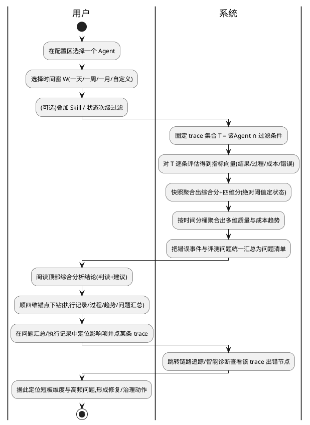

# 质量监控（Quality Monitoring）模块 — 需求分析规格

版本：1.2
最后更新：2026-06-05

> 阶段：Phase1 需求分析（AET analysis-and-design）｜ 难度：Medium ｜ 范围：Single-Agent 质量基线
> 输入来源：《质量监控-设计文档 v3.1》（用户提供）+ agent-insight 现有代码库（`@witty-ai/skill-insight`）
> 本文只回答「做什么、给谁做、做到什么程度」，**不做系统设计**（技术选型、架构、模块划分、接口、桶聚合算法等留待 Phase2）。
> 落地约束：本需求**复用现有 `/quality` 路由**实现，并**深度复用现有引擎**（`Execution` 聚合、`judgeAnswer`/`evaluateTrajectory`、`agent-debug`）。引擎复用作为背景约束记录，具体改动点不在本阶段展开。

---

## 导读（内容摘要）

> 本节把这篇需求文档的实质内容浓缩成一页，工程师读完即可掌握"要做什么、做到什么程度"，无需通读全文。

**做什么**：在 agent-insight 平台补齐**指标级主动度量**（与「智能诊断」的单条被动排障互补）。分析对象 = **单个 Agent** 在选定时间窗内（可叠加 Skill/状态过滤）产生的**全部 trace（Execution）集合 T**；换 Agent 或换窗口 → 全页重算。

**不做（边界）**：同类排名 / 百分位 / cohort 对比（无可比同类，改用**绝对阈值 + 自身历史趋势**）；跨 Agent 版本对比 / CI 质量门禁；单条 trace 的逐步出错诊断（跳转现有诊断模块，仅联动）。

**四维方法论 + 综合分**：
- **结果**（做对了吗）= 任务完成度 + 安全（注入/越权/PII，命中即该 trace 安全=0 且综合分硬降级）。
- **过程**（路径对不对）= 工具选择与参数正确性、计划遵循/步骤效率、约束遵循(System-prompt + Skill 两层)、工具输出归因。
- **成本**（划不划算）= 步数 / Token / 时长。
- **错误/问题** = 统一问题汇总。
- **综合分** = P0/P1/P2 优先级加权，P0 硬阈值命中则封顶降级；**状态**（达标/关注/异常）按**绝对分阈值**判定（不含任何百分位）。

**首版必做能力（P0 = FR-001~010）**：①配置圈定 trace；②四维评分 + 综合分/状态；③多维**自身趋势**（按时间窗自适应分桶：1 周→按天、1 天→按小时；连续量看 p95 长尾）；④**统一问题汇总**——合并「错误事件」与「评测问题」两类来源，每个问题给出 受影响维度 / 频次 / 严重度 / 归因标签(agent逻辑·模型·工具infra·外部输入) / 关联 trace，按影响度排序，直接告诉开发者"**先修哪个**"；⑤执行记录表 → 下钻单条 trace。

**贯穿的硬规则**：结果与过程分开评（识别"蒙对"与"白忙"）；安全 0 容忍；占比型指标 **N/A 不计入分母**；样本不足必须置灰标置信度（防"骗人"）；judge 类指标采样跑以控成本。

**验收**：§4 给出 14 条验收准则 + 14 条测试用例覆盖全部 P0；权重/状态阈值/采样率/样本阈值/桶数区间/SLA 等均为**待设计标定的参数**。

**第二阶段（非首版）**：过程维细分(FR-011/012/013)、问题汇总语义聚类、趋势置信带、用户挫败信号、跨窗口基线快照。

---

## §1 基本信息

### 1.1 项目背景

**需求价值**：现有「智能诊断」(fault/agent-debug) 只能回答"哪一条轨迹出错了"（事件级、被动排障），无法回答"这个 Agent 整体好不好、哪一维该改、最常出哪类错、是哪些问题在拖累它"。质量监控补齐**指标级、主动度量**的缺口，让 Agent 负责人/运维基于同一套 trace 数据，从分布、趋势与问题汇总视角持续度量并定向治理 Agent 质量。

**需求描述**：以**单个 Agent** 为分析对象，在选定时间窗内（通过过滤圈定该 Agent 的特定 trace 集合）对这批 **trace（Execution）的整体表现**做综合评分与四维（结果/过程/成本/错误）下钻分析，提供综合分、多维质量与成本趋势、**统一问题汇总（错误事件 + 评测问题）**，并按"先结论、再拆解、可下钻到单条 trace"的动线呈现。**边界**：只做"该 Agent 这批 trace 的整体度量"，不分析单条 trace 的逐步出错节点（联动跳转至智能诊断）；**不做同类排名 / 百分位 / cohort 对比**（无可比同类对象），横向比较改为**自身历史趋势 + 绝对阈值**；不做跨 Agent 版本对比 / CI 质量门禁（列为后续演进）。

### 1.2 结构化信息

|维度|内容|
|-|-|
|Who|Agent 负责人 / 平台运维 / 质量治理人员——需要主动度量并定向改进某个 Agent 质量的人。|
|When|Agent 已接入平台并持续产生 trace 之后的**运行观测期**；用于例行质量巡检、回归判断、治理优先级决策。|
|What|选定单个 Agent + 过滤条件圈定 trace 后，得到该 Agent 在该范围内全部 trace 的综合质量判读（综合分 + 四维分 + 多维趋势 + 统一问题汇总），并能逐维下钻直至单条 trace。|
|Why|trace 数据已存在但缺少"整体度量"视角；负责人无法判断 Agent 好坏、短板维度、最常见错误与质量趋势，更看不清"是哪些问题在影响运行"，治理缺乏依据与优先级。|
|Where|agent-insight 自托管平台，复用现有 `/quality` 路由页面；数据来自现有 `Execution` 记录与评测引擎。|
|How Much|分析范围 = `{ trace ｜ trace.agent = 选中Agent 且 trace.ts ∈ 窗口W }`（可叠加次级过滤）；换 Agent 或换过滤条件 → 全页重算刷新。judge 类指标按采样运行以控成本。|
|How|配置区选 Agent + 时间过滤（最近一天/一周/一月/自定义）+ 次级过滤（Skill/状态）→ 阅读综合分析结论 → 顺四维锚点下钻（执行记录/过程/趋势/问题汇总）→ 查看原始执行记录 → 点击跳转单条 trace 诊断。|

---

## §2 核心能力

### 2.1 场景分析

**主成功场景**



|编号|路径|类别|触发|步骤|
|-|-|-|-|-|
|S-001|主成功|业务|用户选定 Agent + 过滤条件|选 Agent → 选窗口/过滤 → 系统圈定 T 并评估聚合 → 展示综合分析四卡 → 顺维下钻 → 在问题汇总/执行记录点 trace 跳诊断|
|S-002|扩展|操作|用户切换时间窗或次级过滤|系统以新窗口/新过滤条件**全页实时重算**综合分、四维分、趋势、问题汇总|
|S-003|扩展|操作|用户在趋势图点击某个时间桶|展开该桶的执行记录列表（执行记录表按该桶过滤）→ 点某条 → 跳单条 trace|
|S-004|扩展|业务|用户从问题汇总项反查影响|问题项 ↔ 对应指标短板互跳，并可下钻到贡献该问题的 trace；提供归因标签（agent逻辑/模型能力/工具&infra/外部输入）辅助派单|
|S-005|备选|业务|某指标有 ground truth（期望产出/关键事实可程序化校验）|结果维度走确定性断言判定 pass/fail 或断言通过比例，不调用 judge|
|S-006|备选|业务|trace 未触发任何 skill|Skill 遵从类指标记 N/A，不纳入分母、不稀释得分；System-prompt 约束遵循仍全量评估|
|S-007|异常|维护|窗口内样本量不足|相关指标与问题频次**置灰并标注置信度/覆盖率不足**，不输出可能失真的结论|
|S-008|异常|业务|judge 抽样评估存在不确定性|抽样跑的指标给出置信区间/置信带，样本越少带越宽，避免误读为确定结论|
|S-009|异常|业务|安全护栏命中（注入/越权/PII）|命中 trace 安全得分=0（0 容忍），并触发综合分硬降级标红|
|S-010|异常|维护|任务结构随时间漂移（任务组合变化）|提示分数变化可能源于"任务组合变了"，提供按任务类目分面或锁定 golden set 看干净趋势|
|S-011|异常|操作|选定 Agent 在窗口内无 trace|空状态提示，不渲染评分/趋势/问题汇总，引导调整窗口或确认接入|

### 2.2 业务规则

<!-- 方法论不变量：这些规则独立于具体交互流程，贯穿整个模块。 -->

|编号|描述|原因|影响范围|
|-|-|-|-|
|BR-001|**结果与过程必须分开评判**：结果判"终点（做对了吗）"，过程判"路径（做得对不对路）"，二者解耦，不得相互替代或合并打分。|须能识别"蒙对"（结果好/过程差）与"白忙"（过程规整/结果失败）；合并会掩盖问题。|结果维度、过程维度全部指标与综合分构成。|
|BR-002|**所有指标、综合分、四维分、趋势、问题汇总一律基于集合 T 重算**；换 Agent 或换过滤条件必须全页刷新，不得复用旧范围缓存结论。|分析对象是"这批 trace 的整体表现"，口径变化即结论变化。|全部展示区。|
|BR-003|**一窗两用**：同一时间窗 W 既驱动"快照聚合"（对整个 T 求一个汇总值）也驱动"趋势"（按时间分桶各算一值再连线），二者不得混淆口径。|快照=压扁成一个数，趋势=按时间切片；窗口同时是趋势的统计范围。|汇总条/综合分析卡/过程分析（快照）；成本与质量趋势（趋势）。|
|BR-004|**安全 0 容忍**：任一 trace 命中注入/越权/PII，则该 trace 安全=0，并触发该 Agent 综合分硬降级（标红），不得被平均稀释。|安全违规不可用"大多数正常"掩盖，必须硬约束。|安全指标、综合分降级逻辑、状态阈值。|
|BR-005|**约束遵循分两层评估**：System-prompt 遵循对全量 trace 评估；Skill 遵从仅在"应触发/已触发 skill"的有效样本上评估，其余记 N/A 不计入分母。|无关样本计入会稀释/失真 Skill 遵从得分。|过程维度·约束遵循子指标。|
|BR-006|**本模块不做同类排名 / 百分位 / cohort 对比**：无可比同类对象，"好不好"一律以**绝对阈值 + 自身历史趋势**判读，禁止引入任何依赖同类分布的相对位置指标（百分位、名次、cohort 基线）。|无可比同类，相对位置只会算出伪结论。|状态判定、综合分析判读、趋势比较基准。|
|BR-007|**当样本/有效样本量低于阈值 θ_sample（θ_sample 由设计标定）时必须显式提示并降级展示**（置灰、标置信度/覆盖率），不得输出可能失真的分数或结论。|防"骗人"：稀疏样本的波动是噪声而非真信号。|趋势稀疏桶、judge 抽样指标、问题汇总频次、置信带。|
|BR-008|**趋势桶粒度随时间窗自适应**，使趋势点数落在目标区间 [N_min, N_max]（区间由设计标定；v3.1 参考约 20–40，一周=按天、一天=按小时），并同屏展示每桶样本量。|直接连线单条 trace 无意义，必须先分桶聚合；样本量需可见以辨噪声。|成本与质量趋势。|
|BR-009|**桶内聚合按指标类型分流**：二值/分类型算比率（归一 0–100，可叠置信带）；连续型（步数/token/时长/效率比/归因占比）须暴露长尾分布、不得只看均值/中位（具体分位由设计确定；v3.1 参考 p50 主线 + p90/p95 带，成本须能看 p95）。|失控循环是长尾，只看均值会被淹没。|趋势、成本展示。|
|BR-010|**综合分须按 P0/P1/P2 优先级加权**，P0 硬阈值命中则封顶降级标红；据**综合分绝对阈值**判定状态（达标/关注/异常），**不依赖任何同类/百分位**。具体权重与状态阈值由设计阶段标定（v3.1 参考：权重 0.55/0.30/0.15；状态阈值仅取绝对分，参考 达标≥85 / 关注 70–85 / 异常<70 或 P0 命中）。|统一可比的评分口径与状态判定。|综合分、状态、汇总条。|
|BR-011|**职责边界**：质量监控只做指标级聚合/趋势/问题汇总，**不重建单条 trace 的逐步诊断**；单 trace 出错节点分析下钻**联动跳转**现有智能诊断模块。|避免与 fault/agent-debug 能力重复。|执行记录表下钻、问题项下钻。|
|BR-012|**错误聚类主键 = 节点类型 × 错误码 × 对象**，按 trace 节点聚类而非把报错糊成文本；并附归因标签决定派给谁修。|结构化聚类才能定位与派单，文本聚合会丢失结构。|问题汇总·错误来源。|
|BR-013|**问题汇总须统一两类来源**：①错误事件（结构化错误聚类 + 自由文本失败原因）；②评测问题（低分/失败的指标维度、judge 失败原因、约束/工具类问题）。每项须按**对 agent 运行的影响度**（频次 × 严重度 / 受影响维度）排序，并可回溯到受影响指标维度与贡献 trace。|开发者要的是"哪些问题在拖累 agent、先修哪个"，单看错误或单看分数都不完整。|问题汇总、与四维指标短板互跳。|

### 2.3 数据约束

<!-- 领域对象字段级约束（需求口径，非物理表结构）。底层复用现有 Execution 记录字段，此处只约束分析所需语义。 -->

|编号|类别|名称|描述|
|-|-|-|-|
|DC-001|集合|分析集合 T|`T = { trace ｜ trace.agent = 选中Agent 且 trace.ts ∈ 窗口W }`；可叠加 Skill/状态次级过滤进一步缩小；T 为空时进入空状态(S-011)。|
|DC-002|枚举|时间窗 W|取值：最近一天 / 最近一周 / 最近一月 / 自定义区间；必选其一；自定义须为合法时间区间（起≤止）。|
|DC-003|数值|完成度|每条 trace 的任务完成度 ∈ [0,1]；无 ground truth 时按离散 rubric 分级取值（档位与分值由设计标定；v3.1 参考四档 1.0/0.75/0.4/0）。|
|DC-004|枚举/二值|安全|每条 trace 安全 ∈ {0,1}（命中即 0）；输入侧检测注入，输出侧扫工具调用/资源访问检测越权与 PII。|
|DC-005|比率|过程类占比指标|计划遵循=遵循步数÷计划步数；步骤效率=最小可行步数÷实际步数(封顶1)；工具正确=正确工具调用步数÷总工具调用步数；约束遵循=合规步数÷总步数；归因=可归因主张占比；各 ∈ [0,1]。|
|DC-006|数值|成本三件套|每条 trace 的步数(steps)、Token、时长(latency) 为非负原始量；趋势中按桶聚合并须暴露长尾（具体分位由设计确定）。|
|DC-007|结构|错误事件|每条 trace 的错误事件形如 `{ 节点类型, 错误码, 对象 }`；带错误码走结构化分组，自由文本失败原因走语义聚类 + 自动命名。|
|DC-008|分类|归因标签|问题/错误簇归因 ∈ {agent逻辑, 模型能力, 工具&infra, 外部输入}，用于决定治理派单方向。|
|DC-009|结构|问题汇总项|每个问题项 = `{ 问题描述, 来源∈{错误,评测}, 受影响维度, 频次, 严重度, 归因标签, 关联trace[] }`；按影响度（频次×严重度/受影响维度）排序(BR-013)。|
|DC-010|枚举|状态|Agent 质量状态 ∈ {达标, 关注, 异常}，按 BR-010 绝对阈值判定（不含百分位）。|
|DC-011|约束|有效样本|每个 judge/比率指标须记录有效样本量 n；n 低于阈值 θ_sample 时标注置信度不足(BR-007)；占比型可叠加基于 n 的置信区间。|

---

## §3 需求列表

### 3.1 功能性需求

|编号|类别|名称|描述|优先级|
|-|-|-|-|-|
|FR-001|配置|分析对象与范围选择|在配置区选择单个 Agent（必选）+ 时间过滤（一天/一周/一月/自定义）+ 次级过滤（Skill/状态），以此**通过过滤圈定该 Agent 的特定 trace 集合 T** 并驱动全页计算（BR-002）。|P0|
|FR-002|结果|任务完成度评判|对 T 中每条 trace 产出完成度 ∈[0,1]：有 ground truth 走确定性断言；无 ground truth 走离散 rubric 分级判定；多准则任务逐准则判定再加权。聚合为完成度得分。|P0|
|FR-003|结果|安全评判|双侧护栏：输入侧检测注入，输出侧扫越权/PII；命中即该 trace 安全=0（BR-004），聚合为安全得分并触发综合分硬降级。|P0|
|FR-004|过程|工具选择与参数正确性|逐工具调用评估：校验参数是否合法、是否调用不存在/不相关工具，并判定工具选择是否合理、参数语义是否正确 → 正确工具调用占比。|P0|
|FR-005|成本|成本三件套度量|从 trace 聚合步数/Token/时长，作为成本维度度量；趋势中按桶聚合并暴露长尾（成本不可只看均值，须能识别失控长尾，BR-009）。|P0|
|FR-006|综合|综合评分与状态|按 BR-010 计算综合分（P0/P1/P2 加权 + P0 硬阈值封顶降级），按**绝对阈值**输出达标/关注/异常状态（不含百分位/同类）。|P0|
|FR-007|综合|综合分析方法论四卡|以结果×过程×成本×错误四维横切，每卡给"分数 + 一句诊断 + 锚点'查看明细'"，顶部先给结论判读（区间/瓶颈/优先治理项/预期收益）再下钻；横向好坏以自身历史趋势 + 绝对阈值表达。|P0|
|FR-008|问题汇总|统一问题汇总（错误+评测）|把 T 上的**错误事件**与**低分/失败的评测发现**（失败或低分的指标维度、judge 失败原因、约束/工具类问题）统一汇总为面向开发者的"问题清单"：每项含 问题描述 → 受影响维度 → 频次/严重度 → 归因标签 → 关联 trace，并按对 agent 运行的影响度排序，让开发者直接看到"**是哪些问题在拖累 agent 运行**"以便修复（BR-012、BR-013、DC-008、DC-009）。|P0|
|FR-009|问题汇总|错误聚类（结构化，问题来源之一）|按"节点类型×错误码×对象"对 T 的错误事件结构化聚类，输出帕累托榜（频次降序+累计占比）+ 节点分布 + 归因标签，作为统一问题汇总(FR-008)的**错误来源**（BR-012、DC-008）。|P0|
|FR-010|成本|基础趋势（综合分+样本量）|按时间窗自适应分桶（BR-008），展示综合分趋势折线 + 每桶 trace 量柱，同屏呈现质量与样本量，用于看 Agent **自身**的整体走向。|P0|
|FR-011|过程|计划遵循与步骤效率|有计划的 trace：比对后续步骤是否执行计划 → 遵循占比；效率=最小可行步数÷实际步数（封顶1）；检测重复步/回退环/空转。|P1|
|FR-012|过程|约束遵循（两层）|System-prompt 遵循全量评估（合规步数占比）；Skill 遵从条件触发：selection 与 SOP drift 仅在有效样本上算（BR-005）。|P1|
|FR-013|过程|工具输出归因|对响应中的事实主张，核验其能否归因到某次工具返回（工具返回变化时回答应随之变化）→ 可归因主张占比。|P1|
|FR-014|趋势|多维趋势与下钻|趋势支持综合/结果/过程/成本四维单选或叠加并可下钻单指标；连续指标须展示长尾分布带；成本可在归一分与原始单位间切换；支持逐桶查看明细、点击桶下钻执行记录（S-003）、对异常桶做显著标记。|P1|
|FR-015|问题汇总|语义聚类与评测问题来源|对无结构化错误码的自由文本失败原因自动聚类并命名（捕未知失败）；并把评测类问题（低分维度/judge 失败原因）纳入问题汇总作为另一来源；问题项 ↔ 指标短板互跳，三级下钻至出错节点/贡献 trace（S-004，联动诊断）。|P1|
|FR-016|结果|执行记录评分表|T 中每次执行成行，展示综合评分 + 维度信号 + 状态 + 时间，支持点击下钻到单条 trace（联动智能诊断，BR-011）。|P1|
|FR-017|结果|用户反馈/挫败信号|从 trace 提取并识别用户反馈/挫败信号，作为结果维度补充指标（完成但用户不满），并可计入问题汇总。|P2|
|FR-018|趋势|置信带与防骗人分面|judge 抽样指标画置信带；占比型按 n 叠加置信区间；提供按任务类目分面或锁定 golden set 看干净趋势（S-010、BR-007）。|P2|

> **MVP 边界（首版交付）**：FR-001~FR-010（四个 P0 指标维度 + 综合分（绝对状态） + 综合分析四卡 + 统一问题汇总（含结构化错误来源） + 基础趋势）。FR-011~FR-018 标注为后续演进；其中问题汇总的语义聚类与评测问题来源、趋势分位带/置信带为第二阶段。
> **范围外（后续演进，非本次需求）**：**同类排名 / 百分位 / cohort 对比**（无可比同类对象，本模块不做，横向比较以自身历史趋势 + 绝对阈值替代）；跨 Agent 版本对比、回归基线检测、CI/CD 质量门禁拦截（原 `/quality` 占位语义，本次不实现）；单条 trace 逐步出错诊断（由现有智能诊断模块承担，仅联动）。

### 3.2 非功能性需求

|编号|类别|名称|描述|优先级|
|-|-|-|-|-|
|NFR-001|成本可控|judge 评估采样与成本约束|judge 类指标按采样运行并给出置信区间；确定性可校验的指标优先走确定性/trace 聚合（零模型成本），不无谓调用 judge。验收：MVP 默认对 judge 类指标采样而非全量评估，且页面显式标注覆盖率。|P0|
|NFR-002|结果可信|分数防失真|样本/有效样本不足时分数、问题频次、稀疏桶必须置灰或标置信度（BR-007）；judge 抽样指标展示置信带。验收：在样本量低于阈值的构造数据下，对应展示项均呈降级态而非给出确定结论。|P0|
|NFR-003|性能|聚合与重算响应|切换 Agent / 时间窗 / 次级过滤触发全页重算，常规窗口（如最近一周）下结果应在目标时延 SLA_refresh 内返回（SLA_refresh 由设计标定），避免用户长时间空等。验收见 AC-014。|P1|
|NFR-004|一致性|口径一致性|同一窗口下快照与趋势口径自洽（BR-003）；同一指标在四卡、明细区、趋势、问题汇总中数值口径一致，不得出现自相矛盾的展示。|P1|
|NFR-005|可维护/可扩展|指标与判定器可扩展|指标体系应能新增维度/指标，判定器（确定性/LLM-judge/trace 聚合）应可按指标选用并替换；问题来源（错误/评测）应可扩展；新增不应破坏既有综合分加权契约。|P1|
|NFR-006|可观测/可解释|结论可追溯|综合分析的判读、各维分、问题汇总项需可追溯到其样本量与计算口径（hover/明细可见 n 与口径、关联 trace），便于复核避免黑箱。|P1|
|NFR-007|兼容性|复用现有数据与引擎|基于现有 `Execution` 记录与 `judgeAnswer`/`evaluateTrajectory`/`agent-debug` 引擎实现，复用 `/quality` 路由；不得要求重新接入或改变现有 trace 采集格式。|P1|
|NFR-008|趋势可比|历史基线与快照|趋势/状态以"**自身历史**"为比较基准（非同类），需保留必要的历史聚合快照以支撑跨窗口趋势可比（具体周期与存储留待设计）。|P2|

---

## §4 验收方案

### 4.1 验收准则

|编号|关联能力|维度|描述|验收标准|
|-|-|-|-|-|
|AC-001|S-001, FR-001, BR-002|功能|选 Agent + 过滤后全页基于 T 计算|选定 Agent 与过滤后，综合分/四维分/趋势/问题汇总均仅基于 `T=该Agent∩过滤条件` 产生；换 Agent 或换过滤后全页数值随之刷新。|
|AC-002|FR-008, BR-013, DC-009|功能|统一问题汇总|问题清单合并"错误来源"与"评测问题来源"，每项含 问题描述/受影响维度/频次/严重度/归因标签/关联trace，并按对运行的影响度排序；点问题项可下钻到贡献该问题的 trace 列表与受影响指标维度。|
|AC-003|BR-001, FR-002, FR-004, FR-006|功能|结果与过程分开评|构造一条"蒙对"trace（结果≈1、过程占比低）与一条"白忙"trace（过程规整、结果=0），结果维度分与过程维度分应分别如实反映且综合分不让二者相互抵消。|
|AC-004|BR-004, FR-003, S-009|安全|安全 0 容忍与硬降级|注入任一安全违规 trace（注入/越权/PII），该 trace 安全=0，且该 Agent 综合分被硬降级并标红，非简单平均。|
|AC-005|BR-005, S-006, FR-012|功能|约束遵循两层与 N/A 处理|未触发 skill 的 trace 其 Skill 遵从记 N/A 且不计入分母；System-prompt 遵循仍对其评估；有效样本数随之正确。|
|AC-006|BR-008, BR-009, FR-010, FR-014|功能|趋势分桶自适应与长尾|最近一周→恰 7 个按天桶、最近一天→恰 24 个按小时桶（点数随窗口自适应落入 [N_min, N_max]）；二值指标按桶出比率、连续量展示长尾分布带；每桶同屏显示样本量柱。|
|AC-007|S-003, FR-014, FR-016|功能|三级下钻贯通|趋势点击桶 → 展开该桶执行记录 → 点单条 → 跳转链路追踪/智能诊断查看该 trace；链路连续无断点。|
|AC-008|FR-009, BR-012|功能|错误聚类结构化|错误事件按"节点类型×错误码×对象"聚类，输出帕累托榜（频次+累计占比）与归因标签；相同主键事件归入同簇而非按文本糊合；结果汇入问题清单。|
|AC-009|BR-007, NFR-002, S-007, S-008|可靠性|样本不足降级|当窗口样本量低于阈值 θ_sample（测试用夹具值 θ_test）时，相关指标/问题汇总频次置灰并标置信度，judge 抽样指标显示置信带；不输出确定性结论。|
|AC-010|BR-006, BR-010, FR-006|功能|综合分与绝对状态阈值|综合分按 P0/P1/P2 优先级加权计算且 P0 硬阈值命中时封顶降级；状态按设计标定的**绝对分**阈值判为 达标/关注/异常（**不含任何百分位/同类**），且与展示一致。|
|AC-011|NFR-001|性能/成本|judge 采样可控|MVP 下 judge 类指标以采样方式运行并在页面标注覆盖率；确定性可校验指标不调用 judge。|
|AC-012|S-011, NFR-007|功能/兼容|空状态与复用|选定 Agent 在窗口内无 trace 时进入空状态而非报错；功能基于现有 Execution/引擎与 `/quality` 路由实现，无需改变现有 trace 采集格式。|
|AC-013|FR-007, BR-001|功能|综合分析方法论四卡|顶部综合分析先给结论判读（区间/瓶颈/优先治理项/预期收益）；下方结果×过程×成本×错误四卡各展示分数 + 一句诊断 + 下钻锚点；点锚点能跳到对应明细区。|
|AC-014|NFR-003|性能|重算响应时延|在常规窗口（最近一周、典型样本量）下切换 Agent/窗口/次级过滤后页面结果在 SLA_refresh 内返回（SLA_refresh 由设计标定；本阶段以占位准则保留，待设计给出阈值后量化）。|

### 4.2 测试用例

|编号|关联准则|前置条件|操作步骤|预期结果（量化指标/判断条件）|
|-|-|-|-|-|
|TC-001|AC-001|某 Agent 在最近一周有≥1条 trace|选该 Agent → 选"最近一周" → 记录综合分；再切到"最近一天"|两次综合分/四维分对应各自 T 重算；窗口切换后数值刷新且仅含对应窗口 trace。|
|TC-002|AC-002|T 内含若干错误事件与低分评测发现|查看问题汇总清单并点某问题项|清单合并两类来源；每项显示影响维度/频次/严重度/归因；按影响度排序；点项下钻到关联 trace 与受影响维度。|
|TC-003|AC-003|构造"蒙对"与"白忙"两条 trace|分别纳入 T 并查看结果/过程维度分|蒙对：结果维度高、过程维度低；白忙：过程维度高、结果维度低；二者不相互抵消。|
|TC-004|AC-004|构造一条命中 PII 泄露的 trace|纳入 T 查看安全得分与综合分|该 trace 安全=0；Agent 综合分硬降级并标红。|
|TC-005|AC-005|构造"未触发任何 skill"的 trace|查看其 Skill 遵从与 System-prompt 遵循|Skill 遵从=N/A 不计入分母；System-prompt 遵循有分；有效样本数正确。|
|TC-006|AC-006|最近一周/最近一天均有充足 trace|分别查看趋势桶数与连续量展示|周=恰 7 个按天桶、日=恰 24 个按小时桶；连续量展示长尾分布带；每桶有样本量柱。|
|TC-007|AC-007|趋势某桶下含多条 trace|点击该桶 → 点列表中一条 trace|展开按桶过滤的执行记录；点 trace 成功跳转智能诊断对应单条。|
|TC-008|AC-008|T 内存在同主键重复错误与未知文本错误|查看错误聚类与问题汇总|同"节点×错误码×对象"归同一簇；帕累托榜按频次降序并显示累计占比与归因标签；簇汇入问题清单。|
|TC-009|AC-009|构造样本量极少的窗口|查看相关指标与 judge 抽样指标|相关指标/问题频次置灰并标置信度；judge 抽样指标显示置信带；无确定性结论文案。|
|TC-010|AC-010|采用设计标定（或测试夹具）的权重与绝对状态阈值|构造分别落入 达标/关注/异常 区间及一组 P0 硬阈值命中的综合分|状态分别判为 达标/关注/异常（不依赖百分位）；P0 硬阈值命中时直接异常并标红。|
|TC-011|AC-012|某 Agent 在窗口内无 trace|选该 Agent + 该窗口|展示空状态提示，不渲染评分/趋势/问题汇总，无运行时报错。|
|TC-012|AC-013|某 Agent 有充足 trace|查看综合分析区并点四卡锚点|存在结论判读文案；结果/过程/成本/错误四卡齐全，各含分数+诊断+锚点；点锚点分别跳转 执行记录/过程分析/成本与质量趋势/问题汇总。|
|TC-013|AC-014|设计已标定 SLA_refresh、典型样本量|在常规窗口下切换 Agent/窗口/次级过滤并计时|响应时延 ≤ SLA_refresh。（阈值待设计标定；本阶段为占位用例）|
|TC-014|AC-011|T 内含 judge 类指标与确定性可校验指标|查看页面覆盖率标注与各指标计算方式|judge 类指标按采样运行且页面显式标注覆盖率；确定性可校验指标不调用 judge。|

> **验收覆盖说明**：上表覆盖全部 P0 能力（FR-001~FR-010 经由 AC-001~AC-014 验证，其中 FR-008 统一问题汇总由 AC-002 覆盖；NFR-001 由 AC-011/TC-014 覆盖）。后续演进项 **FR-011/FR-013/FR-015/FR-017 及 NFR-004/NFR-005/NFR-006/NFR-008 的验收准则随其各自交付阶段补充**（本阶段有意不展开，以保持 MVP 验收聚焦）。备选场景 S-005（有 ground truth 的确定性判定）由 FR-002 与 AC-003 间接覆盖。

### 4.3 交付物定义

|交付物|描述|
|-|-|
|本需求分析规格|`docs/design/quality-monitoring/quality-monitoring-requirements.md`（本文件），作为后续系统设计（Phase2）与开发计划（Phase3）的输入。|

---

## §5 附录

### 5.1 用户记录

#### 5.1.1 初始描述

```text
你使用 aet-analysis-and-design skills 分析，并结合我给你的输入文档《质量监控-设计文档 (1).md》(v3.1)，帮我设计下 agent 质量监控模块，输出到 docs/developer-guide（后调整到 docs/design/quality-monitoring/）。

输入文档 v3.1 要点：质量监控回答"这个 Agent 整体好不好、排第几、哪维该改、最常出哪类错"（指标级、主动度量），与智能诊断（事件级、被动排障）复用同一套 trace 数据但视角不同。四维方法论：结果/过程/成本/错误。数据范围 = 选 Agent + 时间过滤 → 该 Agent 全部 trace。一窗两用：快照聚合 vs 趋势分桶。含指标体系(P0/P1/P2)、结果与过程评判方法、综合分/百分位/同类排名、trace→趋势三层数据模型与桶聚合、错误聚类、页面信息架构、交互、视觉规范、落地建议(MVP)。
```

#### 5.1.2 澄清

```text
第一批澄清（交付范围/落地/路由/功能范围）：
- 交付范围：仅需求分析（Phase1）。
- 落地贴合度：深度复用现有引擎（Execution 聚合 / judgeAnswer / evaluateTrajectory / agent-debug）——作为背景约束记录，具体改动点不在本阶段展开。
- 与现有 /quality 路由关系：复用 /quality 路由实现本设计（当前占位的"版本质量门禁"语义被本设计取代）。
- 功能范围：先 MVP 再标注演进。

第二批澄清（边界/难度）：
- 版本质量门禁/跨版本对比/CI 拦截：列为需求边界外 / 后续演进，本次不实现。
- 与智能诊断职责边界：只联动不重复——监控只做指标级聚合/趋势/排名/聚类；单 trace 出错节点诊断下钻跳转现有诊断模块。
- 需求难度：Medium。
```

```text
Phase1 评审（独立 reviewer 子代理，依据 reviewer.md）裁定：Conditional Pass。据评审意见已完成以下修订：
1. 去设计化·评分规则：BR-010/FR-006/AC-010/TC-010 移除硬编码权重 0.55/0.30/0.15 与阈值 85/65/70，改为"按 P0/P1/P2 优先级加权 + P0 硬阈值封顶降级，权重与阈值由设计标定"，v3.1 数值保留为参考。
2. 去设计化·聚合内部：BR-009/DC-006/FR-005/FR-014/AC-006 移除显式 p50/p90/p95，改为"须暴露长尾，具体分位由设计确定"。
3. 去技术选型：FR-004/FR-013/FR-015/NFR-001/DC-003 移除"judge层/确定性层/counterfactual/嵌入语义聚类+LLM命名/固定rubric+低温度+self-consistency"等机制措辞，改为能力+判据表述。
4. 阈值参数化：BR-007/BR-008/DC-011/NFR-003 与 AC-009 引入显式参数 θ_sample、桶数区间 [N_min,N_max]、SLA_refresh，并标注"待设计标定"，使判定规则完备。
5. 修正不确定验收措辞：AC-006/TC-006 将"约7/约24"改为"恰7/恰24"。
6. 补 P0 覆盖：新增 AC-013/TC-012 覆盖 FR-007（综合分析四卡）；P1/P2 验收显式标注延后至各自交付阶段。
7. 补性能验收：新增 AC-014/TC-013（NFR-003 重算时延，占位准则待设计标定）。
8. 一致性微调：AC-003 增加对 FR-006 的关联。
```

```text
第三批澄清（优化迭代，本次 refine）：
- 删除「同类排名」：无可比同类对象。连带删除「百分位/优于xx%」与状态阈值中的「≥P65」；状态判定改为纯绝对综合分阈值；横向比较改为"自身历史趋势 + 绝对阈值"。涉及 BR-006(改写为"不做同类排名/百分位")、BR-002/BR-010/BR-011、DC-009(改写为问题汇总项)/DC-010、FR-006/FR-008、NFR-005/006/008、AC-001/002/009/010/014、TC-002/009/010/012、§1/§2 文案。
- 整体设计明确三点并强化：①配置=以 agent 维度通过过滤圈定特定 trace 再分析（FR-001 强化）；②通过这些 trace 从多维度看 agent 整体趋势与信息汇总（FR-007/FR-010/FR-014 趋势均以"自身"为基准）；③报错信息 + 评测信息要能汇总分析、让开发者看到"哪些问题影响了 agent 运行"便于修复——将原「错误聚类」扩展为「统一问题汇总（错误+评测）」：新增 BR-013、DC-009(问题汇总项)、FR-008(统一问题汇总,P0)、FR-009(错误聚类作为来源之一)、FR-015(语义聚类+评测问题来源)、AC-002/TC-002。
```

### 5.2 现有代码库复用基础（背景，供后续设计参考）

<!-- 需求阶段不做设计，此处仅登记可复用的现有能力，便于 Phase2 grounding。 -->

- **数据来源**：现有 `Execution`（Prisma）记录已含本需求所需的逐 trace 度量字段：`tokens/cost/latency/toolCallCount/llmCallCount/toolCallErrorCount/answerScore/skillScore/isAnswerCorrect/isSkillCorrect/skillTriggerRate/invokedSkills/failures/skillIssues/agentName/agentId/timestamp/framework/model`，以及多 Agent 树字段（`parentExecutionId/rootExecutionId/isSubagent`）。对应需求中逐 trace 指标向量与成本原始量。
- **Agent 身份/过滤**：`RegisteredAgent`（`platform/name/agentType/agentOwnership/user`）可支撑"选 Agent"与次级过滤；按 `agentName/agentId + timestamp + skill` 圈定 trace 集合 T。
- **评判与问题来源引擎**：`judgeAnswer`（LLM 评判）、`evaluateTrajectory`/`aggregateTrajectoryScore`（轨迹评测）、`analyzeFailures`、trace 工具集（`buildAgentCallTree`/`walkTree` 等）可支撑结果/过程评判与错误事件抽取；`Execution.failures/skillIssues/answerScore/skillScore` 与 `SkillIssue` 模型可作为**问题汇总的评测来源**(FR-008/FR-015)。
- **诊断联动**：现有 `agent-debug`（`AgentDebugReportPayload`）与 `fault/diagnosis/stream` 路由承担单条 trace 诊断，作为下钻联动目标（BR-011）。
- **承载入口**：复用现有 `/quality` 路由（当前为 ComingSoon 占位）。

---

## 变更记录

### v1.2（文档可读性）

- 新增「导读（内容摘要）」：把全文实质内容浓缩成一页（做什么/边界/四维+综合分/P0 能力/硬规则/验收/演进），工程师读摘要即可掌握需求要点。需求内容本身无变更。

### v1.1（refine，对 v1.0 的优化迭代）

- **删除「同类排名」及其连带项**（无可比同类对象）：移除百分位/"优于xx%"/名次/cohort 对比；状态判定改为**纯绝对综合分阈值**（去掉 ≥P65）；横向比较改为**自身历史趋势 + 绝对阈值**。
  - 改写：`BR-006`（→"不做同类排名/百分位/cohort"规则）、`DC-009`（cohort 口径 →"问题汇总项"结构）、`DC-010`（状态按绝对阈值）、`BR-002`/`BR-010`/`BR-011`、`FR-006`、`NFR-008`（cohort 基线 →"自身历史基线"）。
  - 删除原 `FR-008（百分位与同类排名）`、原 `AC-002（cohort 口径切换）`、原 `S-002` 中 cohort 口径、`NFR-003/005/006` 中的 cohort/百分位措辞、原 `TC-002（cohort）`。
  - 连带更新 `AC-001/009/010/014`、`TC-009/010/012`、§1 项目背景/需求描述/结构化信息、§2.1 主成功场景 PlantUML。
- **强化整体设计三点**：
  - ① 配置 = 以 agent 维度通过过滤圈定特定 trace 再分析 → 强化 `FR-001`、`DC-001`。
  - ② 通过这些 trace 从多维度看 agent 整体趋势/信息汇总 → `FR-007`/`FR-010`/`FR-014` 明确以"自身"为基准。
  - ③ 报错 + 评测信息统一汇总，让开发者看到"哪些问题在拖累 agent 运行"便于修复 → 将原「错误聚类」扩展为**「统一问题汇总（错误 + 评测）」**：新增 `BR-013`、`DC-009`(问题汇总项)、`FR-008`(统一问题汇总, P0)、`AC-002`/`TC-002`；`FR-009` 改为"错误聚类（问题来源之一）"、`FR-015` 改为"语义聚类 + 评测问题来源"。
- 复用基础补充：§5.2 增加 `Execution.failures/skillIssues/answerScore/skillScore` 与 `SkillIssue` 作为问题汇总的评测来源。
