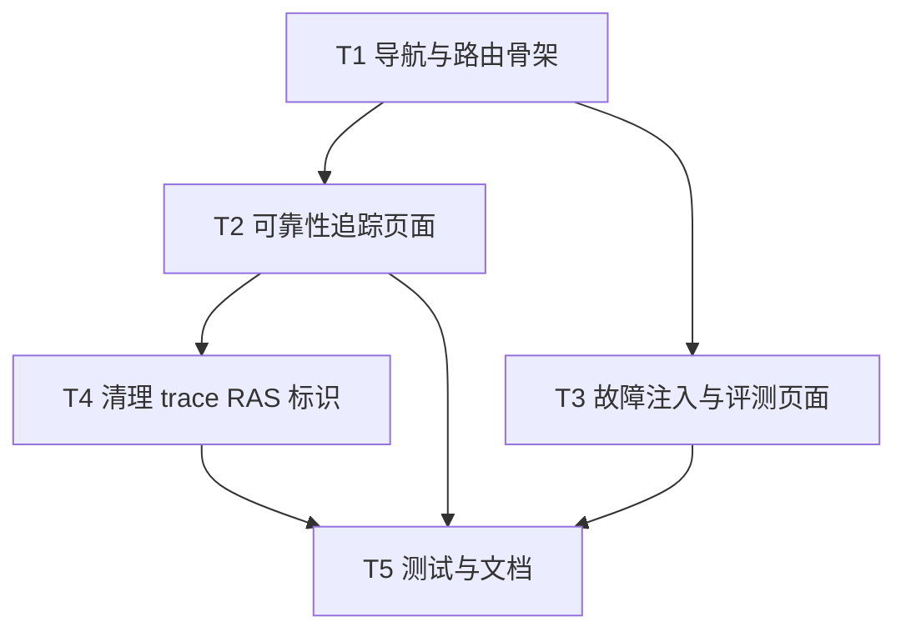

# AgentRAS 可靠性独立页面 — 开发计划

版本：v0.1  
最后更新：2026-07-28

> **HISTORICAL 开发计划**：文中「故障注入不做后端 / mock」已过时；现网见 [agent-fault-injection](../../agent-fault-injection/README.md)。

> 文档类型：Phase3 开发计划 ｜ 关联 [Phase1](phase1-requirements-analysis.md) / [Phase2](phase2-requirements-design.md)  
> 工作量：Medium ｜ 可并行：YES（T2-T3、T4）

---

## 导读

**干活顺序**：导航 + 路由 → 可靠性追踪（列表+统计+详情） → 故障注入（UI+mock） → 清理 → 测试 + 文档。

**硬约束**：不改 `core/` 语义；不合并 OTel 热路径；不新建 `--ras-*` 色板；故障注入不做后端。

---

## §1 概览

| 项 | 内容 |
|----|------|
| 关键路径 | T1 → T2+T3（并行） → T4 → T5 |
| 验证 | `npm run test`；`npm run dev` 浏览器验收 |
| 不涉及 | Prisma schema 变更、Python 代码修改、CI 变更 |

---

## §2 任务分解

### T1 — 导航与路由骨架

| 项 | 内容 |
|----|------|
| 产物 | `AppSidebar.tsx` 新增 `RAS_TREE`；新建 `(main)/agent-ras/trace/page.tsx` 和 `(main)/agent-ras/fault-injection/page.tsx` 占位页；locale 新增 4 个 key |
| 禁止 | 破坏现有导航结构 |
| 验收 | 侧栏出现"AgentRAS 可靠性"分组，两个子页面可点击跳转（空壳页） |

**详细步骤**：

1. 在 `AppSidebar.tsx` 新增 `ICON_RAS`（shield SVG）。
2. 定义 `RAS_TREE: NavItem`，插入 `AGENT_GROUP.items` 中 `OBSERVE_TREE` 之后。
3. `expandedTrees` 默认值新增 `'agent-ras'`。
4. 在 `src/locales/zh.ts` 和 `en.ts` 新增 `groupAgentRas`、`rasTrace`、`rasFaultInjection` key。
5. 新建 `src/app/(main)/agent-ras/trace/page.tsx`（临时占位）。
6. 新建 `src/app/(main)/agent-ras/fault-injection/page.tsx`（临时占位）。

---

### T2 — 可靠性追踪页面

| 项 | 内容 |
|----|------|
| 产物 | `FaultStatsPanel`、`RasTraceList`、`RasTraceDetail`、`FaultNodeIndex` 组件；`agent-ras/trace/page.tsx` 完整实现 |
| 依赖 | T1 |
| 禁止 | 修改 `RasAnomalyEvent` 模型；引入新 API |
| 验收 | 列表展示有 RAS 事件的 Trace；统计面板显示分类计数；点击进入详情；异常节点可跳转 |

**详细步骤**：

1. 创建 `src/components/agent-ras/` 目录。
2. `FaultStatsPanel.tsx`：调用 `GET /api/ingest/ras/v1/events` 按 `anomalyKind` 聚合；渲染数字卡片；点击卡片联动列表筛选。
3. `RasTraceList.tsx`：join `RasAnomalyEvent` + `Execution`；渲染表格；支持分页；点击行展开详情。
4. `RasTraceDetail.tsx`：内嵌 `AgentTraceView`；解析 `RasAnomalyEvent.payloadJson` 获取异常节点位置；`FaultNodeIndex.tsx` 侧面板列出异常节点，点击 `scrollIntoView`。
5. `agent-ras/trace/page.tsx`：组装上述组件，使用 `PageContainer` + `PageHeader`。
6. AgentTraceView 扩展：接受 `highlightNodeIds?: string[]` prop，对应 node 添加高亮样式；接受 `onNodeClick?: (nodeId: string) => void` 回调。

---

### T3 — 故障注入与评测页面

| 项 | 内容 |
|----|------|
| 产物 | ~~`FaultCatalog` / `InjectionConfig` / `InjectionHistory` + mockData~~（已删除，改走真实 BFF `/agent-ras/fault-injection`）；`PlatformSelector` 仍用于 RAS 能力配置 |
| 依赖 | T1（可与 T2 并行） |
| 禁止 | 从 Mock 页面向 Agent 下发真实故障；连接本地 RAS 控制服务 |
| 验收 | 平台切换正常；故障目录可浏览；注入配置可交互；历史列表展示 mock 数据 |

**详细步骤**：

1. `mockData.ts`：定义 `FAULT_TYPES` 数组（覆盖 4 个类别，~12 种故障类型，含多平台映射）和 `MOCK_INJECTION_HISTORY`。
2. `PlatformSelector.tsx`：水平 tab 切换；切换时过滤 FaultCatalog 和重置目标列表。
3. `FaultCatalog.tsx`：可折叠分类目录；每个故障项显示名称、简介、严重等级色标；点击选中。
4. `InjectionConfig.tsx`：单条/批量 toggle；选中故障类型回填；目标下拉；参数 key-value；提交按钮弹出 mock 确认。
5. `InjectionHistory.tsx`：表格展示注入历史（mock）；status badge。
6. `agent-ras/fault-injection/page.tsx`：组装布局，页面三栏或上下分栏。

---

### T4 — 清理链路追踪中的 RAS 标识

| 项 | 内容 |
|----|------|
| 产物 | 修改 `trace/page.tsx`，移除 RAS 引用 |
| 依赖 | T2（确保可靠性追踪已可用后再清理） |
| 禁止 | 删除 `RasAnomalyEvent` 表或 ingest API |
| 验收 | 链路追踪列表无 RAS Badge；详情无 RAS 面板；`TraceRasMarks.tsx` 确认无其他调用方 |

**详细步骤**：

1. 在 `trace/page.tsx` 中找出 `TraceRasListBadges`、`useRasSummaries`、`TraceRasPanel` 等引用，移除。
2. 在 `AgentTraceView.tsx` 中找到 RAS 面板嵌入，移除或条件隐藏。
3. Grep 全仓确认 `TraceRas` 引用仅剩 `agent-ras/` 下和 `TraceRasMarks.tsx` 自身。
4. 在 `TraceRasMarks.tsx` 顶部加 `@deprecated` JSDoc 注释，标注"迁移至 agent-ras/trace"。

---

### T5 — 测试与文档

| 项 | 内容 |
|----|------|
| 产物 | 测试用例（若有测试约定）+ 用户指南/开发者指南更新 |
| 验收 | `npm run test` 绿；doc 准确 |

**详细步骤**：

1. 检查现有测试是否受导航变更影响，更新 `expandedTrees` 相关测试。
2. 如果 `test/` 下有端到端或组件测试，为新的导航分组添加基础用例。
3. 更新 `docs/user-guide/`：从链路追踪 RAS 部分移到独立的"AgentRAS 可靠性"章节。
4. 更新 `docs/developer-guide/`：架构图中新增 RAS 导航分组说明。
5. 在 agent-ras-migration 设计文档中标注 D-003 已漂移。

---

## §3 建议提交切片

1. `feat(ras): 新增 AgentRAS 可靠性导航分组与路由骨架`
2. `feat(ras): 可靠性追踪页面（故障统计 + 列表 + 详情 + 节点跳转）`
3. `feat(ras): 故障注入与评测页面（UI + mock 数据）`
4. `refactor(trace): 从链路追踪移除 RAS 标识`
5. `docs: 更新 AgentRAS 独立页面的指南文档`

---

## §4 测试计划

| 层 | 内容 |
|----|------|
| TS 单元 | 导航分组渲染；FaultStatsPanel 聚合逻辑；mock 数据结构 |
| 组件 | RasTraceList 分页；故障节点高亮；平台切换过滤 |
| 手工 | 侧栏显示正常；页面跳转正常；列表数据正确；清理后链路追踪无 RAS 残留 |

---

## §5 授权提醒

改 `package.json`/CI/依赖/push 需用户授权。默认可做：新建组件、新建页面、修改导航、修改 locale、清理引用、写测试、写文档。

---

## §6 任务依赖图

