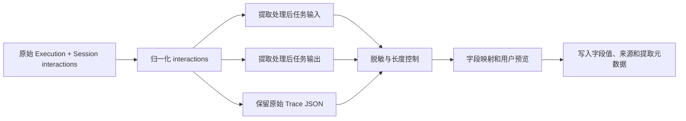

# Trace 回流到评测数据集设计方案

创建时间：2026-07-15

> 术语说明：本文所说的 **MVP（Minimum Viable Product）**，是“最小可用版本”，即先交付一版能够完整跑通核心用户流程、可以真实使用和验证的能力，再分阶段补充批量操作、版本治理等增强功能。下文统一称为“第一版最小闭环”。

## 1. 背景与目标

Agent-Insight 已经具备链路采集、Trace 查看、质量监控、Trace 评测和 `AgentEvalDataset` 数据集能力，但目前“从真实运行 Trace 沉淀成评测样本”的路径仍偏手工：用户需要从链路页面复制输入、输出、Trace，再到数据集中心手动新建或编辑 case。

本需求要补齐的闭环是：

1. 用户可以把一条 Trace 回流到评测数据集。
2. 评测数据集可以新增自定义字段。
3. 数据集中的每一条样本都可以编辑各字段的数据值。

当前实现围绕以上三个能力形成闭环，并覆盖 Trace 列表批量回流与回流字段映射。质量监控自动推荐、数据集版本化、自定义评估器字段映射等属于后续增强。

Trace 回流时，系统自动抽取并处理 `input`、`output`，并把调用 `summarizeTrace` 之前的 interactions 数组作为原始 JSON `trace`，允许用户预览和编辑后写入目标数据集，同时保留来源 Trace 的基本追溯信息。

用户提出的最小字段是 `input`、`output`、`trace`，其中：

- `input`：经过处理后的任务输入，不是简单照搬原始消息。
- `output`：经过处理后的任务输出，来自链路里 agent 的最终交付结果，不是简单照搬最后一条消息。
- `trace`：链路跟踪里的 Trace 本体。

评测数据集不再只使用写死的 case 属性，而是支持用户新增字段、编辑字段定义，以及为每条 case 新增、补齐、修改或清空字段值。字段定义与字段值是两个独立层次：给数据集增加字段后，用户可以逐条维护该字段在各 case 中的值。`reference_output` 与其他业务字段一样是可选扩展，不属于 Trace 回流的前置条件。

结合本项目现状，建议默认字段角色为：

| 回流概念 | 默认字段 key | 说明 |
|-|-|-|
| 任务输入 | `input` | 经过数据处理后的任务输入，用于匹配 case 与投递评估器。 |
| 任务输出 | `output` | 经过数据处理后的 agent 实际任务输出，用于复盘和作为评估对象。 |
| Trace | `trace` | 链路 Session 中、调用 `summarizeTrace` 之前的 interactions JSON 数组。 |
| 自定义字段 | 用户自定义 key | 例如 `rubric`、`scenario`、`difficulty`、`expectedToolCalls`、`humanLabel`。 |

## 2. 参考产品与取舍

### Coze Loop / 扣子罗盘

参考入口：Coze Loop Trace 评测教程（用户提供链接）。该页面公开 HTML 是前端应用壳，本文不逐条引用其页面细节，只借鉴“Trace 评测把执行过程作为评测对象”的产品方向：样本不能只保存最终答案，还需要能表达中间工具调用、Agent 切换、失败节点与关键步骤。

对 Agent-Insight 的取舍：

- 不照搬“先建独立 Trace 数据集系统”的方式。目标是把现有过程评测能力统一收敛到 `Trace` 命名。
- 不要求用户手写复杂 Trace。回流时系统直接带入链路 Session 的 interactions JSON，用户只做确认和少量编辑。
- Trace 字段既服务评测，也服务诊断，因此保留每轮交互、工具调用参数与结果、Agent 信息和时间信息。

### Langfuse

参考文档：[Datasets](https://langfuse.com/docs/evaluation/experiments/datasets)、[Observability & Application Tracing](https://langfuse.com/docs/observability/overview)。

可借鉴点：

- Dataset 是 `input` + optional expected output 的集合，可由生产 Trace 创建测试用例；本项目还需要保留 agent 实际 `output`，用于复盘真实运行结果。
- 从 trace/observation 加入 dataset 时保留 `source_trace_id` 和可选 `source_observation_id`。
- 批量添加 observations 时支持字段映射，用户能控制 observation 数据如何变成 dataset item 字段。
- Dataset 版本化用于复现实验，避免后续改动破坏历史评测对比。

对 Agent-Insight 的取舍：

- 第一版最小闭环不引入完整 dataset item 版本表，先在 `casesJson` 内加来源元信息；后续如评测回归依赖强版本一致性，再拆成 `AgentEvalDatasetCase` 表。
- 字段映射先给固定默认值 + 高级 JSONPath 配置预留，不一开始做完整映射 DSL。
- Source trace 链接要成为一等元信息，因为 Agent-Insight 的用户经常需要从评测失败回跳 Trace 详情定位 Skill 问题。

### AgentLoop

公开资料可验证信息有限。本文按用户指定方向抽象其核心思想：把“线上运行 -> 发现问题 -> 回流样本 -> 回归评测 -> 再观察”的 agent loop 做成闭环，而不是把数据集视为一次性上传文件。

对 Agent-Insight 的取舍：

- 回流入口不只放在数据集中心，而是嵌入观察、质量监控、Trace 评测结果等“发现问题”的上下文。
- 回流样本要带来源、标签、问题类型、评测器结果摘要，便于后续按真实失败类型组织数据集。

## 3. 现状盘点

### 已有能力

- 数据模型：`prisma/schema.prisma` 中 `AgentEvalDataset` 以 `casesJson` 存储 case，已有 `datasetKind` 字段；目前还没有数据集字段 schema。
- 服务层：`src/server/agent_datasets_storage.ts` 中 `DatasetCase` 是固定字段结构，已有 `input`、`expectedOutput`、`evaluationFocus`、`tags` 等字段；尚不能表达可配置字段及其值。
- 前端模型：`src/lib/agent-dataset-model.ts` 按固定列组织数据集字段，尚不支持 schema 驱动的数据表格。
- 数据集 UI：`src/components/AgentDatasetCenter.tsx` 和 `src/components/DatasetItemsPage.tsx` 需要支持 Trace 数据集和手工编辑 `trace` 字段。
- Trace 读取：`src/app/api/observe/session/route.ts` 可按 `taskId` 返回 `query` 和 `interactions`，并做 Claude Code interactions 归一化、子 Agent 名推断。
- Trace 摘要：`src/lib/engine/evaluation/trace-summarizer.ts` 能从 interactions 构建步骤摘要，`src/lib/engine/observability/agent-trace.ts` 能还原多 Agent 调用树。
- Trace bundle：`src/lib/engine/observability/trace-bundle.ts` 已有大字段外置、source hash、节点索引的思路，可复用其“摘要 + artifact 引用”理念。

### 主要缺口

1. 缺少数据集字段 schema，无法新增字段、约束字段类型或给字段赋予评测语义。
2. 缺少从 execution/Trace 生成 dataset case 的后端服务函数。
3. 缺少 API 将一个或多个 Trace append 到数据集，或创建新数据集后写入。
4. `DatasetCase.source` 目前只有 `user | skill-gen-draft`，无法表达 Trace 回流来源。
5. case 里没有来源 Trace 元信息，后续无法可靠回跳原始 Trace。
6. `trace` 字段需要定义本项目统一 schema。
7. UI 没有字段管理、字段值编辑、“加入评测集 / 回流到数据集”、预览、脱敏与冲突处理。

## 4. 用户故事

1. 作为 Skill 作者，我在链路追踪看到一次失败执行，希望一键把它加入某个 Trace 评测集，作为后续版本回归样本。
2. 作为数据集维护者，我希望按评测需要给数据集新增字段，而不需要修改固定数据结构。
3. 作为数据集维护者，我希望逐条编辑任意字段的数据值，包括回流生成的 input、output 和 trace。
4. 作为 Agent 调优者，我希望回流样本保留来源 Trace 链接，方便回到原始执行链路查看细节。

## 5. 产品流程设计

### 5.1 单条回流

入口：

- 第一版在 Trace 详情页顶部提供 `加入评测集`。
- Trace 列表、评测结果和质量监控中的入口后续复用同一回流弹窗。

流程：

1. 用户点击入口。
2. 后端根据 `executionId` 或 `taskId` 生成 draft case。
3. 弹窗展示目标数据集、字段预览、来源信息、脱敏选项。
4. 用户选择：
   - 加入已有 Trace 数据集。
   - 新建 Trace 数据集并加入。
5. 保存后返回 dataset/case id，并展示“查看数据集”“继续添加”。

### 5.2 批量回流

入口：

- Trace 列表多选。
- 质量监控执行记录多选。
- Trace 评测结果列表按低分筛选后多选。

流程：

1. 用户多选 Trace。
2. 系统批量生成 draft cases，并给出抽取成功、缺 input、缺 output、Trace 过长、疑似重复等预警。
3. 用户明确选择添加到已有数据集或新建数据集，不默认使用任一已有数据集。
4. 已有数据集加载当前 schema，允许映射现有字段并追加缺失字段；新建数据集默认提供可删除的 `input`、`output`、`trace`。
5. 用户预览并逐条编辑映射后的数据。草稿处理失败的 Trace 不进入待保存列表；准备成功的 cases 与新增字段在一次存储更新中写入。

当前实现已覆盖 Trace 列表跨页多选、当前页全选、批量草稿处理、逐条预览编辑和统一目标数据集保存。质量监控和 Trace 评测结果列表复用该入口仍作为后续增强。

## 6. 数据设计

### 6.1 数据集采用 Schema + Rows 模型

数据集本体保存“有哪些字段”，case 保存“每个字段的值”。字段 schema 不嵌进每条 case，避免新增字段时重写所有 case，也让字段管理、表格渲染和评测字段映射有唯一真源。

建议在 `AgentEvalDataset` 增加 `fieldsJson`（默认 `[]`）；继续使用 `casesJson` 保存 case。这样仍兼容 SQLite 与 JSON 文件 fallback，同时把这次的数据模型变更控制在一个表的一列，暂不引入 case 表。

```ts
export type DatasetFieldType = 'text' | 'number' | 'boolean' | 'select' | 'tags' | 'json' | 'trace';

export type DatasetFieldRole =
  | 'task_input'       // 重新执行时投递给 Agent 的任务输入
  | 'source_output'    // 来源 Trace 的历史任务输出
  | 'trace'            // 来源 Trace 的原始 interactions JSON
  | 'reference_output' // 人工维护的期望输出
  | 'metadata';

export interface DatasetField {
  id: string;
  key: string;             // 稳定机器 key；创建后不改，label 可改
  label: string;
  type: DatasetFieldType;
  role: DatasetFieldRole;
  required: boolean;
  system: boolean;         // 系统字段不能删除；可调整 label/说明/是否在表格显示
  description?: string;
  options?: string[];      // 仅 select
  defaultValue?: unknown;
  createdAt: string;
  updatedAt: string;
}

export type DatasetCaseSource = 'user' | 'skill-gen-draft' | 'trace-backflow';

export interface DatasetCase {
  id: string;
  values: Record<string, unknown>;
  source?: DatasetCaseSource;
  traceSource?: DatasetCaseTraceSource;
  valueMeta?: Record<string, DatasetValueMeta>;
  rootCauses?: RootCauseItem[];
  rootCauseMeta?: DatasetCaseRootCauseMeta;
}

export interface DatasetValueMeta {
  origin: 'trace-extracted' | 'user' | 'default' | 'migration';
  updatedAt: string;
  extraction?: {
    method: string;
    confidence?: number;
    fallbackUsed?: boolean;
    note?: string;
  };
}

export interface DatasetCaseTraceSource {
  kind: 'execution';
  executionId: string;
  taskId?: string;
  rootExecutionId?: string;
  framework?: string;
  agentName?: string;
  skillName?: string;
  skillVersion?: number | null;
  sourceHash: string;
  sourceUrl?: string;
  capturedAt: string;
}
```

初始 Trace 数据集自动带三个不可删除的系统字段：`input`（`task_input`）、`output`（`source_output`）、`trace`（`trace`）。`expectedOutput` 是可选模板字段，角色为 `reference_output` 且 `required=false`；用户可以新增它，也可以为已有自定义字段指定这个角色。

字段管理规则：

- 新增字段时定义 key、名称、类型、角色、是否必填、默认值和可选项；已有 case 自动获得空值或默认值。
- 新字段创建后，可在已有 case 中逐条新增或补齐该字段值；新建 case 时也可直接填写全部已定义字段。
- case 的任意字段值均可继续修改、批量填充、清空或导入；用户新增或编辑后 `valueMeta.origin` 改为 `user`。
- `key` 是程序契约，创建后不可修改；只允许改 `label`，以免评测映射和历史 case 失效。
- 有值的自定义字段不能直接删除，只能归档或先执行“删除该字段及其全部值”的明确确认；系统字段只能隐藏，不可删除。
- 同一个数据集每种核心 role 至多一个字段。`metadata` 字段可有多个；`reference_output` 始终是可选字段，没有该字段或字段值为空都不影响样本保存和使用。
- 字段 schema 保留通用 `required` 配置用于输入校验，但 `reference_output` 角色固定为 `required=false`，不能被配置为样本入库或参与评测的前置条件。

### 6.2 评测字段映射

字段能增加不代表所有字段都要送入每个评测器。评测器声明自己需要的角色，数据集在执行前将角色映射到字段 key：

| 评测场景 | 所需字段角色 | 说明 |
|-|-|-|
| 对来源 Trace 做过程评测 | `task_input`、`source_output`、`trace` | 评估已发生的那次执行。 |
| 重新执行 Agent 做回归 | `task_input` | 新执行的实际输出由运行时产生，不能读取历史 `source_output` 冒充。 |
| 结果准确性 / 任务完成度 | `task_input`；可选 `reference_output` | 有人工期望输出时用于比较；没有时按评估器自身能力执行，无法评价依赖参考答案的指标则返回 N/A。 |
| 自定义评测器 | 由配置显式选择角色或字段 key | 不能隐式把任意同名字段塞入 prompt。 |

这也解决 `output` 的语义问题：回流写入的 `output` 是历史 Trace 的处理后任务输出；回归执行中 `{{output}}` 仍表示本次执行实际输出。若自定义评测器需要历史输出，新增明确变量 `{{source_output}}`，避免两种输出混用。

样本不设置“就绪状态”，字段缺失也不阻止保存。评测执行时只解析当前评估器会消费的字段：可选字段缺失时跳过对应比较或返回 N/A；只有 `task_input` 等当前执行动作本身无法缺少的输入为空时，才对该次执行给出明确错误。这个错误属于评测运行结果，不回写为数据集样本状态。

### 6.3 兼容与演进

存量 `casesJson` 读取时通过兼容适配器转为 `values`：`input`、`expectedOutput`、`evaluationFocus`、`tags` 和旧过程字段按默认/迁移 schema 映射。写入新格式后不再依赖固定 case 属性；所有评测入口都经由字段映射读取。

拆出 `AgentEvalDatasetCase` 能带来更好的索引、版本化和来源 Trace 反查，但会引入 Prisma schema 变更、迁移和 JSON 文件 fallback 分歧。建议先引入 `fieldsJson + casesJson`，当出现 case 级权限、审计、高频局部写入或千万级样本查询时，再设计独立 case 表。

`traceSource.sourceHash` 用于判重。推荐 hash 输入为：

```text
sha256(user + executionId + taskId + processedInput + processedSourceOutput + traceSchemaVersion)
```

### 6.4 Trace 字段 schema

`trace` 以原生 JSON 数组存储，不做字符串化。数据契约统一使用 `trace`，不再新增或沿用旧的过程字段名。

示例结构：

```json
[
  { "role": "user", "content": "用户请求", "timestamp": 1784160000000 },
  {
    "role": "assistant",
    "content": "处理过程",
    "tool_calls": [
      { "name": "read", "arguments": { "filePath": "/path/to/file" }, "output": "工具结果" }
    ]
  }
]
```

字段原则：

- 数组内容来自 Session interactions，在框架存储归一化和子 Agent 名称补充之后直接回流。
- 不调用 `summarizeTrace`，不生成 `schemaVersion`、`summary` 或 `steps` 包装层。
- `traceSource` 仍独立保存 `taskId`、`executionId` 和采集时间，供来源追溯。

## 7. Trace 回流的数据处理与映射

### 7.1 复用现有“任务工件提取”能力

回流不直接把 `Execution.query` 和 `Execution.finalResult` 原样写进数据集，而是先把原始 Trace 处理为可评测的任务工件。现有 Trace 评测执行链路已具备两段应复用的能力：

- `src/lib/engine/evaluation/semantic-dataset-match.ts` 的 `extractRealUserInput`：从原始 query 中提取真正的用户任务，识别并移除运行模式前缀等非任务内容；模型不可用或提取失败时回退原文，并保留置信度、忽略片段和原因。
- `src/lib/engine/evaluation/result-artifact-extractor.ts` 的 `extractTaskResultArtifact`：从 Trace 的候选 LLM 产物及其后续工具上下文中定位真正交付给用户的结果；不能定位时才回退 `execution.finalResult`，并记录来源、置信度和回退原因。

实现时将二者封装成评测执行与回流共用的 `extractTaskArtifacts` 服务，不把提取逻辑复制到回流 API。现有 `src/app/api/eval/trajectory/run/route.ts` 改为调用该共享服务，回流 API 调用同一入口。这样同一条 Trace 在“直接评测”与“回流后再评测”中得到一致的任务输入和任务输出，也能统一复用缓存、超时、置信度和降级策略。

```ts
extractTaskArtifacts({
  user,
  execution,
  interactions,
  fallbackOutput: execution.finalResult,
}): Promise<{
  processedInput: string;
  processedSourceOutput: string;
  inputMeta: DatasetValueMeta['extraction'];
  outputMeta: DatasetValueMeta['extraction'];
  warnings: DatasetBackflowWarning[];
}>
```

### 7.2 回流处理流水线



各阶段的职责如下：

1. 解析 execution 与对应 session，使用现有 interaction 归一化逻辑处理不同框架格式。
2. 输入处理：调用 `extractRealUserInput`，产出 `input`；保留提取方式、置信度、忽略片段和回退说明，但不将未脱敏原文重复写入数据集。
3. 输出处理：调用 `extractTaskResultArtifact`，产出 `output`；保存候选定位方式、置信度、是否回退 `execution.finalResult` 和来源引用。
4. Trace 处理：不调用 `summarizeTrace` / `buildAgentCallTree`；直接把归一化后的完整 interactions 数组作为结构化 JSON 值写入 `trace`。
5. 脱敏和大小控制：对三个产物统一执行策略，再生成 `sourceHash`。用户可在预览中逐字段修改。
6. 按目标数据集 `fieldsJson` 映射写入 `values`。没有对应角色的字段时，提示用户新增字段或选择另一个数据集，绝不静默丢弃。

`output` 不会自动复制到 `reference_output`。若用户要把一次优秀运行沉淀成期望答案，需在预览或数据集表格中明确执行“复制为期望输出”并可继续改写，写入后该字段的 `origin` 为 `user`。

### 7.3 Trace 生成策略

后端新增纯服务函数：

```ts
buildDatasetCaseDraftFromExecution(args: {
  user: string;
  executionId?: string;
  taskId?: string;
  includeExpectedOutput?: boolean;
  maxSteps?: number;
  maxTextLen?: number;
  redact?: RedactionOptions;
}): Promise<DatasetCaseDraft>
```

内部复用：

- `db.findSessionByTaskId`
- `db.findExecutions`
- `normalizeClaudeCodeInteractionsForStorage`
- `inferSubagentNamesFromInteractions`
- interactions 数组直接作为 JSON 值返回，不经过 `summarizeTrace` 或 `buildAgentCallTree`

默认配置：

- Trace 默认保留完整 interactions，不按步骤数或单段文本长度截断。

### 7.4 脱敏策略

第一版最小闭环提供基础脱敏：

- 默认识别并替换 API key、Bearer token、常见 secret 字段、邮箱、手机号。
- UI 提供开关：`保留原文`、`基础脱敏`、`强脱敏`。
- 强脱敏会额外裁剪工具输出中的文件内容、大段日志、HTTP headers。

脱敏后仍保留 `traceSource.executionId`，方便有权限用户回看原始 Trace。

## 8. API 设计

涉及新增 API 路由，因此实现前需要按本方案确认后再开发。

### 8.1 生成回流草稿

`POST /api/agent-datasets/trace-drafts`

请求：

```json
{
  "user": "alice",
  "executionId": "exec_xxx",
  "taskId": "session_xxx",
  "redaction": "basic",
  "maxSteps": 120,
  "maxTextLen": 800
}
```

响应：

```json
{
  "draft": {
    "values": {
      "input": "处理后的任务输入",
      "output": "处理后的来源任务输出",
      "trace": [{ "role": "user", "content": "..." }]
    },
    "valueMeta": {
      "input": { "origin": "trace-extracted", "extraction": { "method": "extractRealUserInput", "confidence": 0.92 } },
      "output": { "origin": "trace-extracted", "extraction": { "method": "extractTaskResultArtifact", "confidence": 0.87 } }
    },
    "source": "trace-backflow",
    "traceSource": {
      "kind": "execution",
      "executionId": "exec_xxx",
      "taskId": "session_xxx",
      "framework": "opencode",
      "agentName": "Agent",
      "sourceHash": "sha256...",
      "capturedAt": "2026-07-15T..."
    }
  },
  "warnings": []
}
```

### 8.2 写入目标数据集

`POST /api/agent-datasets/backflow`

请求：

```json
{
  "user": "alice",
  "target": {
    "mode": "existing",
    "datasetId": "dataset_xxx"
  },
  "cases": [
    {
      "values": {
        "input": "处理后的任务输入",
        "output": "处理后的来源任务输出",
        "trace": "{...}"
      },
      "valueMeta": { "...": "..." },
      "source": "trace-backflow",
      "traceSource": { "...": "..." }
    }
  ],
  "dedupe": "skip"
}
```

新建数据集时：

```json
{
  "target": {
    "mode": "create",
    "name": "真实失败 Trace 回归集",
    "description": "从 Trace 回流的失败样本",
    "datasetKind": "trace",
    "targetAgent": "Agent",
    "targetSkill": "skill-name",
    "tags": ["trace-backflow"],
    "fields": [
      { "key": "input", "label": "任务输入", "type": "text", "role": "task_input", "required": true, "system": true },
      { "key": "output", "label": "来源任务输出", "type": "text", "role": "source_output", "required": true, "system": true },
      { "key": "trace", "label": "Trace", "type": "trace", "role": "trace", "required": true, "system": true }
    ]
  }
}
```

响应：

```json
{
  "success": true,
  "datasetId": "dataset_xxx",
  "inserted": 1,
  "skipped": 0,
  "failed": 0,
  "caseIds": ["case_xxx"],
  "warnings": []
}
```

去重策略：

- `skip`：同一 dataset 中已有相同 `traceSource.sourceHash` 时跳过。
- `append`：允许重复加入。
- `replace`：替换同 sourceHash 的旧 case。第一版最小闭环可不做。

### 8.3 字段管理 API

字段 schema 是数据集的一部分，创建或更新数据集时通过现有 `POST/PATCH /api/agent-datasets` 的 `fields` 参数整体保存；单个 case 的新增、编辑、批量更新采用专用 case API，避免表格编辑覆盖整份数据集。建议后续契约为：

- `PATCH /api/agent-datasets`：更新数据集信息与字段 schema；服务端校验 key 唯一、role 唯一性、类型变更与删除策略。
- `POST /api/agent-datasets/cases`：新增一个或多个 case。
- `PATCH /api/agent-datasets/cases/:caseId`：编辑单条 `values` 和来源元信息。
- `POST /api/agent-datasets/cases/batch`：按筛选条件批量设置/清空指定字段值。

这部分可与 Trace 回流一起落地基础写入能力；批量编辑 UI 可以后续补齐。API 的请求字段统一为 `values`，不继续扩大顶层 `expectedOutput` 一类固定属性。

### 8.4 为什么不复用现有 `PATCH /api/agent-datasets`

现有 PATCH 适合保存完整数据集编辑结果；回流是“读取 Trace -> 生成草稿 -> append case -> 判重 -> 返回部分成功”的专用流程。如果前端先 GET 整个 dataset 再 PATCH，容易产生并发覆盖，也无法清楚表达 warning 和部分失败。

## 9. 前端设计

### 9.1 Trace 回流弹窗

组件建议：`TraceBackflowDialog`

弹窗采用三步流程：

1. **选择数据集**：用户明确选择“添加到已有数据集”或“新建数据集”。已有数据集下拉初始为空；新建模式填写名称和描述。
2. **字段映射**：已有字段可选择处理后的任务输入、任务输出、Trace 或不写入，并可追加新字段；新建模式默认 `input`、`output`、`trace`，任意默认字段均可删除或修改。
3. **数据预览**：按最终 schema 展示映射值，批量场景可逐条切换和编辑；同时汇总处理失败数、写入数和新增字段数。

交互原则：

- 不默认选择目标数据集，防止误写到最近更新的数据集。
- 新建数据集默认使用 `input`、`output`、`trace` 模板，但只要求最终至少保留一个字段，不强制 `input`。
- 已有数据集的原字段不能在回流弹窗中删除；用户可以选择不写入。弹窗中新追加的字段可在确认前删除。
- `output` 标题用“Agent 最终输出”，副说明提示“来自本次 Trace 的实际输出”。
- `reference_output` 字段存在时，显示“期望输出（可选）”，提供“从来源输出复制”动作，但不默认混用。
- Trace 默认展示摘要视图，提供“查看 JSON”。

### 9.2 数据集字段与值编辑

数据集详情使用 schema 驱动的表格，而不是写死列：

- 工具栏提供“新增字段”，在侧边面板填写名称、key、类型、评测角色、是否必填、默认值和 select 选项。
- 表头菜单可编辑字段名称/说明、调整显示顺序、隐藏字段、归档自定义字段；字段 key 与系统字段删除受前述规则约束。
- 单元格按类型编辑：文本、数字、开关、下拉、标签、JSON/Trace 编辑器；编辑后即时校验并标记未保存状态。
- 支持“新增样本”和“批量编辑字段值”。新增字段不会强制历史样本立即补全，空值按字段和评估器语义在运行时处理。

### 9.3 列表入口

- `src/app/(main)/trace/page.tsx`：Trace 列表行操作增加 `加入评测集`。
- Trace 评测结果详情页增加 `回流为样本`。
- `src/components/eval/ExecutionRecordsTable.tsx`：评测记录里对有 trace 的记录提供入口。
- 质量监控相关列表后续接入同一 dialog。

## 10. 与现有评测链路的关系

回流样本进入 `AgentEvalDataset` 后：

- Trace 回流数据集可在 Trace 评测中心选择；评测前按角色读取 `task_input`、`source_output`、`trace`，而不是假定字段 key。
- `source_output` 用于复盘来源 Trace 的实际最终输出。重新执行 Agent 时，新的实际输出只存在于本次 run；它不能被历史 `source_output` 替代。
- `reference_output` 只有在人工填写后才供结果质量/准确性评估复用。现有对 `expectedOutput`、`reference_output` 的读取需经兼容适配器逐步改为字段角色映射。
- `traceSource` 可在评测结果详情展示“来源 Trace”，帮助用户从失败评测跳回历史链路。
- `tags` 可承载 `trace-backflow`、`failure`、`low-score`、`manual-reviewed` 等标签，便于筛选。

需要注意：

- 如果回流的是失败 Trace，`source_output` 很可能是错误答案，因此不应自动写入 `reference_output`。缺少 `reference_output` 不影响样本参与不依赖参考答案的评测。
- Trace 评测中的 reference Trace 不是唯一正确路径。评估器应继续按关键步骤、工具选择、冗余、归因等维度判断，不应机械要求逐步一致。

## 11. 开发计划

### Phase 1：当前需求

1. 为 `AgentEvalDataset` 增加 `fieldsJson`，定义字段 schema、`values` case 结构及存量兼容适配器。
2. 提供字段管理的基础 API 与 UI：新增字段、编辑字段名称和说明；已有样本对新字段先显示为空，不强制补值。
3. 抽出共享的 `extractTaskArtifacts`，复用现有任务输入/输出提取能力，并以原始 interactions JSON 数组返回 trace。
4. 新增 `POST /api/agent-datasets/trace-drafts` 和 `POST /api/agent-datasets/backflow`，支持显式 schema 与批量 cases 回流。
5. Trace 详情页和列表接入统一 `TraceBackflowDialog`，支持明确目标、字段映射、新增字段及逐条预览编辑。
6. 数据集详情改为 schema 驱动表格，支持逐条编辑每个字段的数据值，包括 input、output、trace 和用户新增字段。
7. 单测覆盖：字段 schema 校验、存量 case 兼容、字段新增、逐条字段值编辑、input/output 提取回退、原始 Trace JSON 和回流写入。

第一版最小闭环的完成标准：用户能从一条 Trace 生成经过处理的任务输入、任务输出和原始 Trace JSON，预览并修改这些值，保存到已有或新建数据集；之后还能在数据集详情中增加自定义字段，并为任意 case 新增或编辑字段值。

### Phase 2：批量回流与后续操作增强

1. 已完成 Trace 列表多选回流、新建数据集、批量 warning 汇总和成功草稿的原子保存；Trace 评测结果和质量监控接入同一 dialog 待实现。
2. 支持标签批量添加，以及草稿处理失败后的单条重试。
3. 支持批量新增/填充字段值和字段归档。
4. 评估批量编辑、导入导出和更丰富的字段类型。

### Phase 3：数据集治理增强

1. 评估是否拆出 `AgentEvalDatasetCase` 表，支持 case 级索引、版本、审计。
2. 引入 dataset version 快照，用于复现实验。
3. 做字段映射高级模式，例如 JSONPath、预设模板和数据集导入映射。
4. 支持从低分质量监控自动建议回流候选，但仍需用户确认。

## 12. 验证计划

默认自动化：

- `npm run test`
- 新增/更新以下测试：
  - `test/trace-to-dataset-backflow.test.ts`
  - `test/agent-datasets-storage.test.ts` 或就近扩展现有 dataset 测试

浏览器验证需用户确认后执行 `bash scripts/develop_start.sh`：

1. 打开 Trace 详情页，选择一条有 query/finalResult/interactions 的 Trace。
2. 点击 `加入评测集`，确认 draft 三字段均生成。
3. 保存到已有 Trace 数据集。
4. 到数据集中心查看新增 case，并从 case 来源跳回 Trace。
5. 边界 case：缺 finalResult 的 Trace 应产生 warning，允许用户手填 output 后保存。

## 13. 风险与待确认问题

1. **字段类型与删除策略**：第一版支持有限类型和不可变 key，避免自由 JSON schema 导致导入和表格实现失控；复杂嵌套字段先使用 `json` 类型。
2. **全量 Trace 体积**：当前按需求保存完整 interactions；需要持续关注 `casesJson` 膨胀，后续可在不改变字段契约的前提下引入独立对象存储或引用。
3. **提取结果的稳定性与成本**：任务输入/输出处理可能调用评测模型；必须记录置信度和回退原因，并允许用户在回流预览中修正。
4. **跨用户权限**：所有 API 必须校验 dataset.user 与 execution.user 一致；管理员视角另行设计。

## 14. 推荐结论

推荐采用“`fieldsJson` 字段 schema + `casesJson.values` 字段值 + 共享任务工件提取服务 + 专用回流 API”的第一版方案。

理由：

- 支持字段与字段值随评测需求增长，而不是每增加一个概念就修改 `DatasetCase` 固定结构。
- 复用评测端已有的真实任务输入/输出提取，避免 Trace 回流与评测得到两套不同数据。
- 保留 `traceSource`、字段角色和 `valueMeta` 后，后续拆表、版本化、批量治理和自定义评测器映射都有演进空间。
- 和 Langfuse 的生产 Trace -> dataset item 思路一致，但实现上更适配 Agent-Insight 已有的 Skill、Trace 评测器和 Trace 页面。
