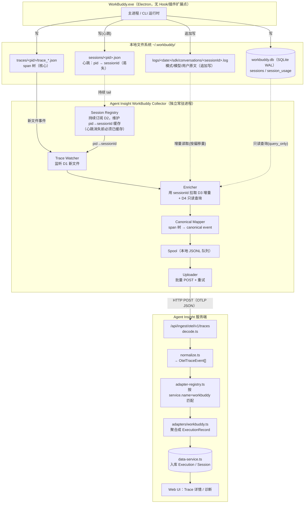
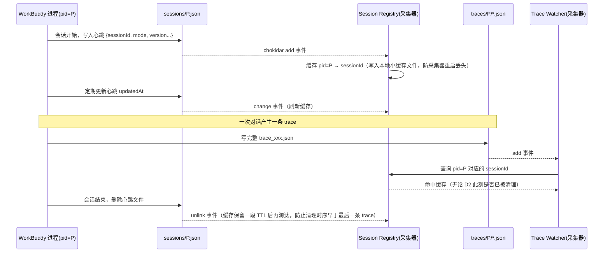
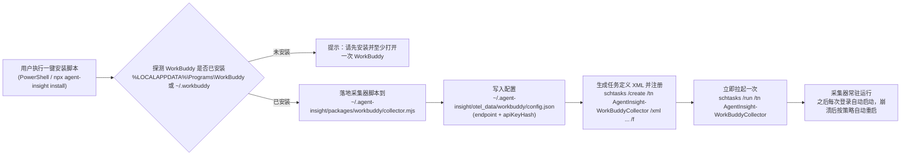
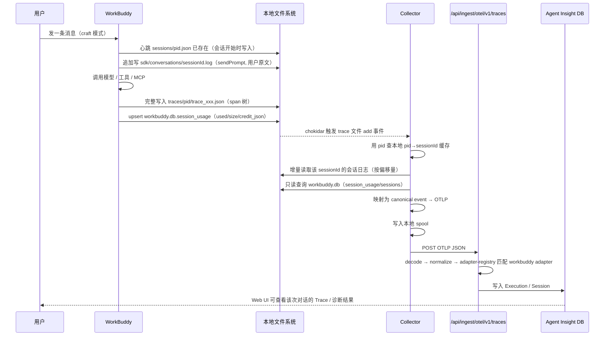

# WorkBuddy Trace 采集需求设计

> 需求背景、数据源实测结论与 token 边界见 [`phase1-requirements-analysis.md`](phase1-requirements-analysis.md)；开发步骤与风险清单见 [`phase3-development-plan.md`](phase3-development-plan.md)。

## 一、总体架构



---

## 二、客户端采集器设计

### 2.1 为什么必须是独立常驻进程

WorkBuddy 没有暴露 `SessionStart`/`PreToolUse` 之类的生命周期钩子，也没有原生 OTel 配置项，因此不能像 Claude Code / Qwen Code 那样"配置一个环境变量就完事"，也不能像 Qoder 那样"在 Hook 里同步触发一次快照"。采集器只能是一个**独立的本地文件监听服务**，跟 WorkBuddy 进程完全解耦：WorkBuddy 崩溃、重启、升级都不影响采集器；采集器崩溃、重启也不影响 WorkBuddy 正常使用。

代价是：不能像 Hook 模式那样精确知道"这一刻会话结束了"，只能靠"新 trace 文件出现"作为触发信号——好在 D1 的 trace 文件本身就是完整写完才落盘的（观测到的所有样本都是 `startedAt`/`endedAt` 同时存在），所以拿"文件新增事件"当触发点是可靠的。

### 2.2 核心风险：心跳文件的时序问题

`sessions/<pid>.json`（D2）在会话结束后会被清理，如果采集器"看到 trace 文件才去查 D2"，很可能已经查不到了。所以设计上把 Session Registry 做成**持续订阅**而不是"按需查询"：



要点：
- 缓存以 `pid` 为 key，`unlink` 时不立即删缓存，而是打上"已结束"标记，保留一段宽限期（例如 10 分钟）再真正淘汰，避免"心跳先被清理、trace 文件后落盘"的乱序。
- 采集器重启后先做一次 D2 目录全量扫描重建缓存，再进入订阅模式，减少重启窗口期的丢失。
- 极端情况下（缓存里也找不到，比如采集器重启时机极不巧）：不丢弃这条 trace，而是降级用 `workerPid + workerHostname + trace.startedAt` 拼一个兜底 session key 入库，标记 `sessionResolution: "degraded"`，好过整条丢弃。

### 2.3 数据关联与增量读取

- **D3（会话日志）增量读取**：这个文件持续追加、单文件可以长到几 MB，不能每次全量重读。采集器按 `(文件路径 → 已读字节偏移量)` 维护游标，每次只 `read from offset`，按行解析新增内容，提取 `method:sendPrompt` 里的 `mode`/`modelId` 和 `userContent` 原文。
- **D4（SQLite）只读关联**：连接时设置 `PRAGMA query_only = ON`（只读事务，不与主进程的写事务抢锁），查询按 `session_id` 精确查一行，短超时（如 200ms）拿不到就跳过本次关联，不阻塞整体流程；下一条 trace 触发时再查一次即可，不需要专门重试机制。
- **D5（迁移 SQL）**：采集器启动时读一次，做字段存在性探测；如果发现 `session_usage` 表缺少 `credit_json` 或 `sessions` 表缺少 `mode`/`model` 列（版本升级导致的 schema 变化），对应字段直接置空，不抛错、不阻塞采集，这是应对"闭源内部实现随时可能变"的基本姿势。

### 2.4 Span → Canonical Event 映射

复用项目现有的 `scripts/agent-trace-collectors/shared/trace-transport.cjs` 里的 canonical event 结构和 `canonicalEventsToOtlp()`，不用重新发明协议。映射由纯函数 `scripts/workbuddy-collector/mapper.cjs` 的 `mapWorkBuddyTrace()` 实现（无 I/O，便于单测）：

| WorkBuddy 原始结构 | canonical event `kind` | 说明 |
|---|---|---|
| `trace`（整条 trace） | `chain`（合成根节点） | `name` 取 `trace.name`；承载该轮用户原文、`mode`、会话级 token 快照；作为所有 `parentId=null` 顶层 span 的父节点 |
| `spans[].type === "agent"` | `agent` | `agentName` 映射为 agent 名称 |
| `spans[].type === "generation"` | `llm` | `input` = `toolInput` 里最后一条 user 文本；`output` = 响应的 `choices[].message.content`；`model` 与 `usage` 从 `toolOutput` 内嵌的模型响应直接解析 |
| `spans[].type === "function"` | `tool` | 真实工具调用：`tool.name`=`toolName`，`tool.arguments`=`toolInput`，`tool.result`=`toolOutput.content` |
| `spans[].type === "custom"`（`mcp_tools`） | —（跳过） | 无 I/O 的发现类噪声 span（单条 trace 常有几十个），不逐条上报；仅在根节点记 `workbuddy.mcp_tools_span_count` 计数 |

用户原文优先取自 D3 `method:sendPrompt`（若采集），否则回退 `generation.toolInput` 最后一条 user 消息——后者是逐 trace 精确的，MVP 直接用它，`mode`/`model` 从 D4 补全。

Token 字段填法（逐轮精确值来自 trace 文件本身，无需估算）：

```js
// 每个 generation span：从 toolOutput 内嵌的模型响应解析真实 usage
usage: {
  input:     rawUsage.prompt_tokens,                                  // 精确
  output:    rawUsage.completion_tokens,                              // 精确
  reasoning: rawUsage.completion_tokens_details?.reasoning_tokens,    // 精确
  total:     rawUsage.total_tokens,                                   // 精确
}
// cache 单独走 attribute（canonical usage 无标准槽位）
attributes["workbuddy.cache_read_tokens"] = rawUsage.prompt_tokens_details?.cached_tokens;

// 根节点：会话级上下文占用快照（来自 D4，独立维度，非逐轮累计）
attributes["workbuddy.session.total_tokens"] = sessionUsage?.used;
attributes["workbuddy.context_window"]       = sessionUsage?.size;
// 无 usage 的 generation → 该事件不带 usage，绝不填 0
```

### 2.5 Spool 与上传

不需要 Qoder 那种"按产品+账号多级隔离"的复杂 spool 结构（WorkBuddy 只有一个产品形态），直接复用现有共享工具（`trace-transport.cjs` 里的 `DurableTraceWriter`/`DurableTraceUploader`）：

- 落盘目录：`~/.agent-insight/otel_data/workbuddy/<apiKeyHash>/`
- 触发时机：**每条 trace 文件出现即处理即上传**（不用等会话结束），比 Qoder 的"整会话快照"粒度更细、更及时，实现也更简单——因为 WorkBuddy 天然按 trace 分片，不需要自己做会话级缓冲。
- 上传失败：写入本地 spool，独立的上传线程定时扫描重试，成功后删除，这部分和其他框架的采集器完全一致，不需要为 WorkBuddy 单独设计。

---

## 三、客户端安装与自动启动

采集器不应该要求用户每次手动敲命令启动——这一节把"装完就一直在后台跑，开机/登录自动拉起，崩了自己重启"作为硬性要求来设计，而不是留到"按需追加"的可选项。

### 3.1 现状：平台目前只做了 Linux/macOS，Windows 是空白

仓库里现成的常驻客户端安装器 `scripts/install-ras-client.js`（Agent RAS 的可靠性客户端，同样是一个不依赖任何 Agent Hook、需要开机自启的独立进程，场景和这里几乎一样）已经做了：

- Linux：生成 `systemd --user` unit，`enable` + `restart`，自带 `Restart=on-failure`/`WatchdogSec` 崩溃自愈
- macOS：生成 `launchd` plist，`RunAtLoad` + `KeepAlive.SuccessfulExit=false` 自愈

但代码里写死了：

```js
if (process.platform === 'win32') {
  fail(
    'Windows 暂不支持自动注册为系统服务',
    '本期仅支持 Linux (systemd) 与 macOS (launchd)。Windows 上可手动运行: node ...',
  )
}
```

也就是说，**"Windows 下免手动启动的常驻安装"这块目前整个平台都没做过**，WorkBuddy 采集器要补的正是这个空白，不是照抄一个现成方案。

### 3.2 Windows 侧自启动方案选型

| 方案 | 免管理员权限 | 崩溃自愈 | 隐藏窗口运行 | 结论 |
|---|---|---|---|---|
| 启动文件夹快捷方式（`shell:startup`） | ✅ | ❌ 不支持 | 需要额外包一层 | 太弱，进程崩了就永久停摆，直到下次登录 |
| Windows 服务（`node-windows`/NSSM） | ❌ 需要管理员权限装服务 | ✅ | ✅ | 安装体验差（UAC 弹窗打断一键安装），且服务默认在 Session 0 运行，访问用户 `%USERPROFILE%\.workbuddy` 还要额外配置以用户身份运行，没必要这么重 |
| **计划任务（Task Scheduler，登录触发，当前用户范围）** | ✅ | ✅（原生支持"失败后自动重启"） | ✅ | **采用**：系统自带 `schtasks.exe`，不需要额外依赖；免管理员权限；效果上等价于 systemd --user / launchd 在 Windows 上的对应物 |

选定 **Task Scheduler + 登录触发（LogonTrigger）+ 当前用户范围**，效果上正好补齐 `install-ras-client.js` 在 Linux/macOS 已经做到、Windows 一直缺的那一块。

### 3.3 安装流程



关键实现点：

1. **必须用 XML 注册，不能只用 `schtasks /create` 的命令行参数**：命令行参数不支持"失败后自动重启"这个设置项，只有导入任务定义 XML 才能带上：

```xml
<Settings>
  <RestartOnFailure>
    <Interval>PT1M</Interval>
    <Count>999</Count>
  </RestartOnFailure>
  <ExecutionTimeLimit>PT0S</ExecutionTimeLimit>  <!-- 常驻进程，不限时长 -->
  <Hidden>true</Hidden>
</Settings>
<Triggers>
  <LogonTrigger>
    <Enabled>true</Enabled>
  </LogonTrigger>
</Triggers>
```

   安装脚本：`schtasks /create /tn "AgentInsight-WorkBuddyCollector" /xml "<生成的临时xml路径>" /f`（`/f` 覆盖已存在的同名任务，保证重复安装/升级是幂等的）。

2. **动作不要直接指向 `node.exe`**：Task Scheduler 直接跑控制台程序，登录瞬间偶尔会闪一下黑框，体验很差。用一个隐藏窗口的 `.vbs` 小启动器包一层：

```vbs
CreateObject("Wscript.Shell").Run "node.exe " & Chr(34) & "collector.mjs" & Chr(34), 0, False
```

   任务的 Action 指向 `wscript.exe collector-launcher.vbs`，全程不弹窗。

3. **安装后立即启动一次**，不用等用户重新登录：`schtasks /run /tn "AgentInsight-WorkBuddyCollector"`，对齐 `install-ras-client.js` 里 `installSystemd(start)`/`installLaunchd(start)` 的"装完即起"逻辑。

4. **单实例保护**：采集器进程启动时检查一个带 PID 的 lock 文件——如果 lock 里的 PID 仍在跑，直接退出。这样即使用户手动又运行了一次，或者 Task Scheduler 因为某些原因重复触发，也不会跑出两个实例重复上传。

5. **`--status` / `--uninstall`**：延续 `install-ras-client.js` 的既有 UX 习惯——

```bash
node workbuddy_setup.mjs --status      # schtasks /query /tn AgentInsight-WorkBuddyCollector
node workbuddy_setup.mjs --uninstall   # schtasks /delete /tn ... /f + 清理配置和 lock 文件
```

### 3.4 接入平台既有的一键安装入口

按 `docs/developer-guide/09-trace-collector.md` 里已经定死的规矩：新框架只能在 `setup/route.ts`（curl/PowerShell 一键安装）和 `setup/auto/route.ts`（`npx agent-insight install`）两个入口的框架列表**末尾追加**，不能改动已有条目的顺序/名称/值。WorkBuddy 选项选中后，服务端吐出一段包含上述 Task Scheduler 注册逻辑的 PowerShell 脚本，用户粘贴执行即可，或者由本地 npm 包自动调用，两条入口都要覆盖到，跟其他框架的验收要求一致。

### 3.5 跨平台备注

本节的 Task Scheduler 方案只覆盖 Windows。如果未来 WorkBuddy 出 macOS/Linux 版本，直接复用 `install-ras-client.js` 里已经跑通的 `systemd --user`/`launchd` 代码，不需要重新设计一遍。

---

## 四、服务端设计

### 4.1 新增 Adapter

位置：`src/lib/ingest/otel/adapters/workbuddy.ts`，实现现有接口：

```typescript
export interface OtelTraceAdapter {
  readonly id: string;
  matches(events: OtelTraceEvent[]): boolean;      // 通过 service.name === "workbuddy" 识别
  aggregate(sessionId: string, events: OtelTraceEvent[]): ExecutionRecord | null;
}
```

在 `src/lib/ingest/otel/adapter-registry.ts` 里追加注册（放在 `genericOtelTraceAdapter` 兜底适配之前）：

```typescript
import { workbuddyOtelTraceAdapter } from './adapters/workbuddy';

const adapters: readonly OtelTraceAdapter[] = [
  // ...既有 adapter
  workbuddyOtelTraceAdapter,
  genericOtelTraceAdapter, // 兜底，始终放最后
];
```

### 4.2 ExecutionRecord 字段映射

| `ExecutionRecord` 字段 | 取值来源 |
|---|---|
| `task_id` | WorkBuddy `sessionId`（D2/D4 关联得到，不是 pid） |
| `query` | D3 里第一条 `method:sendPrompt` 对应的用户输入原文 |
| `framework` | 固定 `"WorkBuddy"` |
| `model` | 最近一次 generation 的 `toolOutput.model`（如 `hy4-preview`、`custom-local:deepseek-v4-flash`） |
| `tokens` / `input_tokens` / `output_tokens` / `reasoning_tokens` / `cache_read_input_tokens` | 各 generation 的精确 usage 汇总（逐轮真实值）；无任何 usage 时全部留空 |
| `context_window_limit` / `workbuddy_session_context_tokens` / `context_window_source` | 会话级上下文窗口上限 / 当前占用快照 / 来源标记（`workbuddy_local_sqlite`），来自 D4，独立于逐轮 token |
| `latency` | 根节点 span 时长 |
| `agent` / `agentName` | span `type==="agent"` 的 `agentName` |
| `llm_call_count` | `type==="generation"` 的 span 数 |
| `tool_call_count` | `type==="function"` 的 span 数（`mcp_tools` 噪声 span 不计入） |
| `interactions[]` | 按时间序拼接：每个 root → user（该轮原文）→ assistant/generation（含精确 usage）→ tool（来自 function span，挂到最近的 assistant） |

### 4.3 Token 精度的诚实表达

服务端落库和展示层遵守一个原则：**有真实值就精确填，没有就留空，绝不用会话总量反推逐轮、也不估算**。WorkBuddy 的有利条件是逐轮拆分本就落盘在 generation.toolOutput.usage，因此：

- `interactions[]` 里每条 `assistant` 的 `usage`（input/output/reasoning/cache/total）是该次 LLM 调用的精确值；某次调用无 usage 时，该字段直接不出现（不是填 0）。
- 会话级 `workbuddy_session_context_tokens`（当前上下文占用）与 `context_window_limit` 单独成列，UI 标注为"当前上下文占用/窗口上限"，与逐轮消耗区分，避免误读。
- `session_usage.credit_json` 是计费/积分（与 token 无关），不参与任何 token 字段。

---

## 五、端到端时序（一次真实对话的完整生命周期）


