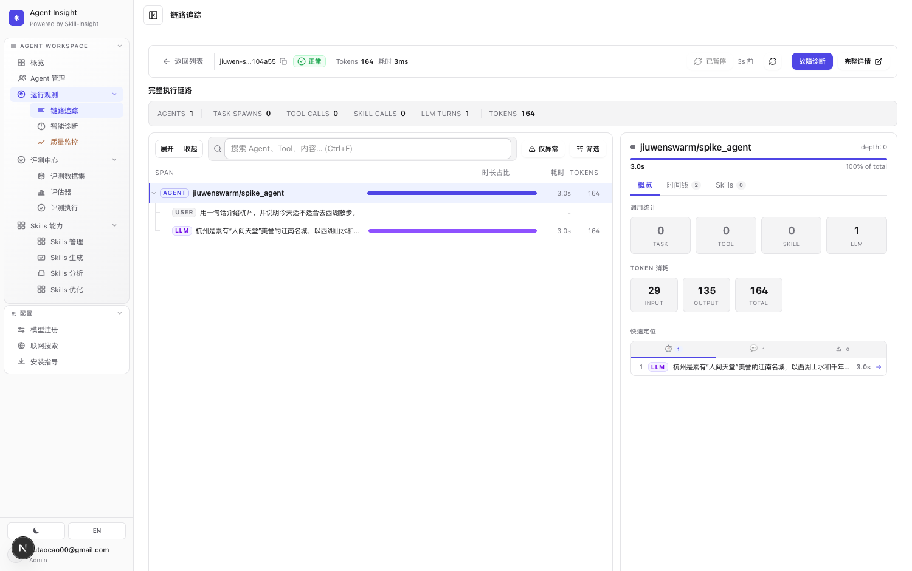
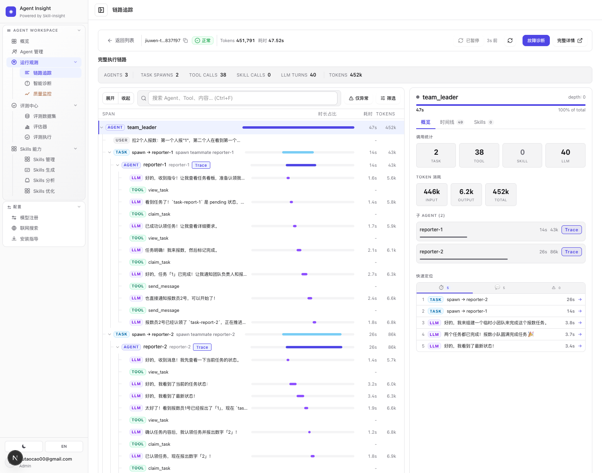
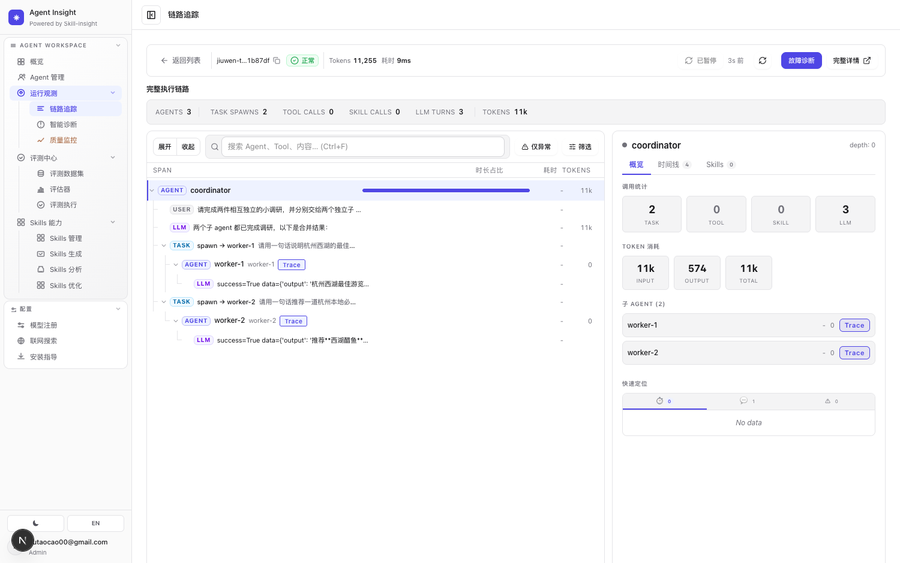

# 把 agent-insight 接入 openJiuwen / JiuwenSwarm —— 一次执行的端到端追踪（OTEL seam）

> **⚠️ 2026-06-16 更新（接手前必读）**：上游 agent-core `develop` 已被 rework（`8b2a384`）重写整个 observability 子系统——**本文档原文（"顺带修复"那三个 bug、`agent.<id>` 那套 span 形状）已过时**：三个 bug 都被上游修了（我们当初的 3 个回馈 PR 作废、应关），span 形状也变了。针对新 develop 的**重新验证、`insight_bridge.py` 校准、以及一串新踩的坑**记在文末 → [接新 develop（8b2a384）重验 + bridge 校准 + 踩坑](#接新-develop8b2a384重验--bridge-校准--踩坑2026-06-16)。**校准后的 `assets/insight_bridge.py` 已是当前版本**，接手模块化从它起步。

## What this is
验证 **agent-insight（agent 观测/评估平台）能否观测 openJiuwen / JiuwenSwarm（多 agent 系统）的一次执行**，并在 trace UI 里看到完整链路。结论：**能，且零改 jiuwen 业务代码**。已端到端跑通并 UI 验证了三种执行形态——单 agent、多 agent team（消息总线、成员互相通信）、Task fan-out（隔离子 agent、无通信）；过程中还顺手修复了 jiuwen observability 的三个真实 bug（流式 span 不收尾、agent span 未挂 context 致子 span 孤儿、agent.id=unknown；均已提 issue+PR），并定位了多 agent 子节点渲染的精确约定。这条路天然支撑"openJiuwen 缺的 jiuwen-ops 由 agent-insight 来补"的合作叙事。

## Goal & context
- **更大的图景**：openJiuwen 社区有编排（jiuwen-studio）、执行（agent-core / jiuwenswarm），但缺一个 agent 观测/评估平台（原计划的 `jiuwen-ops` 还没做）。agent-insight 正好做这块能力 → 若接得通，可谈合作。
- **本次范围（in）**：把一次 jiuwenswarm 执行的 trace（agent/子 agent 树 + LLM 调用 + 工具调用 + token/延迟）送进 agent-insight 并在 trace UI 可视化。先单 agent 打通管道，再补多 agent。
- **范围外（out）**：生产级实时上报、把 jiuwen agent 注册成 agent-insight 的"已注册 agent"、正式的 OTLP collector 链路、正式提 PR——都列入实现计划/后续，不在本次验证内。
- **合作前提**：唯一合入层是 gitcode（`gyctl` / `openJiuwen`）；任何回馈上游走 gitcode，不用 GitHub PR 流程。

## Alignment conclusions
- **先跑起来、观察天然产出，再定 seam**；seam 由实现者（本 spike 里是 Claude）依据证据决定，不预先赌。
- **成功标准 = 先单 agent 打通端到端管道，再补一个多 agent 执行做完整 demo**（"先单后多"）。
- **模型用 deepseek**（OpenAI 兼容端点 `https://api.deepseek.com`，`deepseek-v4-flash`）。key 只放 gitignored `.env`，**绝不进源码**。
- **网络**：本机 github.com 被 GFW 重置；**gitcode.com 可用**。jiuwenswarm 用 `gh-proxy.com` 镜像 clone；agent-core 直接从 gitcode clone（`git+https://gitcode.com/openJiuwen/agent-core.git@develop`）。
- **安全**：jiuwenswarm 仓库的 `llm_config.txt` **硬编码了一个 deepseek key（已失效）**——上游把 secret 提交进了公开仓库，是个可在合作中善意提醒的点。

## 架构关系（关键认知）
```
JiuwenSwarm（应用层：gateway / agentserver / web / tui）   ← 自身 0 处 OTEL
        └─ 依赖 openjiuwen / agent-core（真正运行时）        ← OTEL + callback 都在这
              ├─ core/runner            Runner.run_agent / run_agent_team_streaming
              ├─ core/foundation/llm    Model / model_clients（openai 兼容→deepseek）
              ├─ core/runner/callback   一等公民回调框架（LLM/Tool/Agent 事件）
              └─ agent_teams/observability   ★ 内建 OTEL 子系统（接住回调→emit span）
```
**接入点不在 jiuwenswarm，在 agent-core 的 `agent_teams/observability`。** 它提供：
`init_observability(config: ObservabilityConfig, *, span_exporter_override: SpanExporter|None)`，会把 `OtelCallbackHandler` 注册到 `Runner.callback_framework`，对 **单 agent 与 team 都会 fire**。`config.exporter ∈ {otlp_grpc, otlp_http, console}`（全 protobuf 系），但 **`span_exporter_override` 接受任意 `SpanExporter`** —— 这是整个 seam 的钥匙。

## What we tried — decision log
1. **orientation**：两个 Explore agent 摸清 agent-insight 摄入侧；grep 发现 jiuwenswarm 应用层无 OTEL，真正运行时是 agent-core，且 agent-core 已内建 observability + callback 框架。
2. **候选三方案**：
   - **A 事后 uploader**（读 jiuwen 落盘轨迹→上传）：最解耦，但要找落盘格式。
   - **B OTLP 直连**（agent-core OTLP exporter → agent-insight OTEL 端点）：最标准/最适合谈合作。
   - **C 原生 callback handler**（自接回调→富端点）：最实时但耦合最深、代码最多。
3. **跑 01（单 agent，console exporter）→ 决定性证据**：
   - callback/OTEL seam **单 agent 也 fire**（traceback 经过 `core/runner/callback/decorator.py` 包住 `BaseModelClient.invoke`）。不必非 team 模式。
   - emit 的 span 形状：`llm.call`(CLIENT) 带 `gen_ai.usage.prompt_tokens/completion_tokens/total_tokens`、**indexed** `gen_ai.prompt.{i}.content` / `gen_ai.completion.0.content`、`gen_ai.request.model`；`tool.{name}` 带 `gen_ai.tool.name/input/output`；`agent.{id}` 带 `agentteam.agent.*`。
   - **agent span 与 llm span 不同 trace_id**（单 agent 下 agent span 未设为 current context）→ 按 traceId 分组会把一次执行拆成两段。
4. **B（直连 OTEL 薄端点）被否**，两个硬伤：
   - **协议**：agent-core 的 OTLP exporter 发 **protobuf**；agent-insight 的 `/api/ingest/otel/v1/traces` **只收 application/json**（protobuf → 415）。Python OTLP/http exporter 实际不支持 JSON 编码，此路基本死。
   - **属性 mismatch**：agent-insight OTEL 端点读 `gen_ai.usage.input_tokens` / **flat** `gen_ai.prompt` / `tool.name`；agent-core 发的是 `prompt_tokens` / indexed `gen_ai.prompt.N` / `gen_ai.tool.name` → 直连会 **model 对、token=0、prompt/completion 空、工具名丢失**。且该端点只落"薄 Execution"（无多 agent 树字段），按 traceId 分组（见上）。
5. **定稿 seam（B 的机制 + 打到富端点）**：用 `span_exporter_override=InMemorySpanExporter()` 接住 agent-core 自己 emit 的 OTEL span（复用它做好的关联/嵌套），跑完读 finished spans → 在 bridge 里转成 agent-insight 的**富 JSON** → `POST /api/ingest/upload`。**零改 jiuwen 业务代码。**

## The approach（已验证设计）

### 控制流
```
init_observability(ObservabilityConfig(enabled=True, exporter="console",
                   service_name="jiuwenswarm"), span_exporter_override=InMemorySpanExporter())
→ Runner.run_agent(...)  /  Runner.run_agent_team_streaming(...)   # 跑 jiuwen
→ exporter.get_finished_spans()                                    # 拿全量 ReadableSpan
→ shutdown_observability()
→ transform_*(spans) → agent-insight 富 payload
→ POST {INSIGHT}/api/ingest/upload  (header x-witty-api-key 或 payload.user)
```
> 关键：**别按 traceId 分组**。一次执行的 span 散落在多个 trace_id（agent vs llm、各成员各自 trace）。我们用"整次 run 的全部 finished spans"作为分组边界，由 bridge 重组。

### 富 payload 形状（`/api/ingest/upload`）
顶层：`task_id, framework="jiuwenswarm", agentName, model, tokens, input_tokens, output_tokens, tool_call_count, llm_call_count, latency, final_result, interactions[], user`。
`interactions[]` 元素（agent-insight 的 `AgentTraceView.buildAgentCallTree` 从这个扁平列表建树）：
- 根/leader 轮次：`{role:"assistant", agent:<leader>, content, usage:{input,output,total}, tool_calls:[...], timeInfo}`
- 子 agent 轮次：`{role:"subagent", agent:<member>, subagent_name:<member>, subagent_session_id:<id>, content, tool_calls:[...]}`
- 工具调用：`tool_calls[] = {id, type:"function", function:{name, arguments}, state, output}`
完整样例见 `assets/{single-agent,team,task-fanout}-payload*.json`。

### span → payload 的映射（`assets/insight_bridge.py`）
- `llm.call` → 一个 assistant/subagent 轮次：`content`=`gen_ai.completion.0.content`，usage=`gen_ai.usage.*_tokens`，model=`gen_ai.request.model`，时间取 span start/end。
- `tool.{name}` → `tool_calls[]`：name=`gen_ai.tool.name`，arguments=`gen_ai.tool.input`，output=`gen_ai.tool.output`。
- `agent.{id}` → agent 边界 / 最终汇总（取最长的 `agentteam.agent.output`）。
- **成员归属**（团队模式 `agent.id` 是 `"unknown"`，靠 `gen_ai.tool.id` 后缀 `..._<team>_<member>` 还原成员；llm.call 无成员 id，按 trace_id→该 trace 主导 tool 成员投票归属）。

### ★ 多 agent 子节点联动配方（让 AGENTS 正确计数、子 agent 成独立可下钻节点）
`buildAgentCallTree`（`src/lib/engine/observability/agent-trace.ts`）建子节点需 **两个条件同时满足**：
1. 父 agent 发一个 **tool_call，`function.name == "task"`**，且 `arguments` 为结构化 JSON 含 **`subagent_type: "<X>"`** → 注册一个待认领的 spawn（键=X）；
2. 子 agent interaction 为 `role:"subagent"`，其 `subagent_name` 经 `inferSubagentType()`（取首词、小写）**== X** → 认领该 spawn → 建独立子节点（计入 AGENTS、带 Trace 下钻）。
认领不到就**退回 root**（AGENTS 不增）。所以：team 的 `spawn_teammate` 要**映射成 `task` + `subagent_type=成员名`**；成员名用干净 token（`reporter-1`，别用带 `#` 的 `general-purpose#1`，`#` 会被 `inferSubagentType` 截断）。`transform_team_spans_v2` 已实现该联动。

### 三种执行形态（都已验证成树）
| 形态 | jiuwen 入口 | 通信 | trace 签名（实测） |
|---|---|---|---|
| 单 agent | `ReActAgent` + `Runner.run_agent` | — | AGENTS 1 / LLM 1 / TOKENS 164 |
| **team**（消息总线，成员互通） | `TeamAgentSpec` + `Runner.run_agent_team_streaming` | `send_message`/`claim_task`/`list_members`（peer comms） | AGENTS 3 / TOOL CALLS 27 / LLM 34 / TOKENS 335k |
| **Task fan-out**（隔离子 agent） | `create_deep_agent(add_general_purpose_agent=True)` + `task` 工具 | 无（hub-and-spoke，派发→返回） | AGENTS 3 / TASK SPAWNS 2 / TOOL CALLS 0 / LLM 3 |
> agent-insight 原生区分 **TASK SPAWNS（任务派生）** 与 **TOOL CALLS（工具调用）**：把派生 tool_call 命名 `task` 它就渲成 `spawn → subagent`。

### 实测截图（trace UI）




### 边界 / 踩坑（实现时务必注意）
- **摄入与查看必须同一 server / 同一 DB**：主 checkout dev（:3000）与 worktree dev（:3010）读不同 DB（worktree 无本地 `DATABASE_URL`→home 库；主 checkout `.env` 有自己的）。POST 去 A、却在 B 看 = 看不到。
- **`/api/auth/apikey` 每次调用轮换该 user 的 key**（旧 key 失效）。浏览器 localStorage 用 `user_id` + `api_key`；多次 mint 会把之前的踢掉。
- **trace 列表默认 `ownership=user` 只显示已注册 agent**；jiuwen 这类外部 agent 是 `agentOwnership=unregistered`，默认被过滤 → 看似 0 条。用 `/trace?ownership=all`（看子 agent 加 `scope=all`，时间 `time=all`），或把 agent 注册进 `RegisteredAgent`。
- **trace 页取数 `apiFetch` 不带鉴权头**，纯按 `?user=<email>` scope（`/api/observe/data?user=...&includeEvaluations=0`）。
- **latency 单位**：传秒会被详情页头部按未知 framework 当成 ms 显示（"3ms" vs 右栏 span 时间 "3.0s"）。要么传 ms，要么给 framework 注册单位换算。
- agent-core **自身没声明 opentelemetry 依赖**（靠 jiuwenswarm 带），独立装 agent-core 要补 `opentelemetry-{api,sdk,exporter-otlp-proto-http}` + `aiosqlite`（team DB）。

## 顺带修复 / 已回馈 openJiuwen 的三个上游 bug
spike 过程中暴露并修复了 agent-core observability 的三个真实 bug，均已提 issue + PR（走 gitcode fork → `openJiuwen/agent-core` `develop`，各带回归单测）。**这三处改动属于 agent-core 仓库、以下方各自的下游 PR 为唯一 source of truth，agent-insight 不再镜像 diff**；三者正交、可独立 review，②③ 改 `on_agent_invoke_input/output` 相邻行，合入按顺序 rebase 即可。

1. **流式 LLM span 不收尾** — issue [#1023](https://gitcode.com/openJiuwen/agent-core/issues/1023) · PR [1648](https://gitcode.com/openJiuwen/agent-core/pull/1648)：team/成员走 streaming（`LLM_STREAM_*`），`callback_handler.py` 只在非流式 `LLM_INVOKE_OUTPUT` 关 span，`on_llm_stream_output` 仅 `peek` 不 close → 流式 span 开了不关 → exporter 收不到 → **team 导出 0 个 llm.call span（没 token）**。修：终止 chunk（`finish_reason`/`usage`）时真 pop + 写合并 completion + `span.end()`（`LlmSpanState` 加 `completion_parts`/`closed`）。**效果：llm.call 0 → 38；UI LLM TURNS 1/TOKENS 0 → 34/335k。**
2. **agent span 未挂为当前 OTel context → 子 LLM/Tool span 全成孤儿根** — issue [#1025](https://gitcode.com/openJiuwen/agent-core/issues/1025) · PR [1652](https://gitcode.com/openJiuwen/agent-core/pull/1652)：`on_agent_invoke_input` 建 agent span 却没 `otel_context.attach`（对比 `_open_llm_span` 有）→ team 下每个 span 各自独立 trace、无 parent → 无法按 agent 归属（成员"只有 tool 没 LLM"）。修：input attach / output detach（`push/pop_agent_span` 带 context token）。**效果：llm.call 孤儿根 38 → 0；distinct trace 63 → 2；成员 LLM/工具精确嵌套到其 agent span 下。**
3. **agent span `agentteam.agent.id == "unknown"`** — issue [#1024](https://gitcode.com/openJiuwen/agent-core/issues/1024) · PR [1650](https://gitcode.com/openJiuwen/agent-core/pull/1650)：`_AgentMeta` 包绑定的 `instance.invoke`，`self.card` 不进事件，真实入参无 agent id → 落 unknown。修：`_AgentMeta` 用 `emit_before/after(..., extra_kwargs={"agent_id": card.name or card.id})` 注入，handler 优先读。选 `card.name`（可读、与 tool id 后缀一致）。**效果：单 agent span `agent.unknown` → `agent.spike_agent`。**

> PR 号映射按 #1023→1648 / #1024→1650 / #1025→1652 记录；若 1650/1652 实际对调，互换即可。

## Open questions & risks
- **成员归属（已随上游修复转为精确）**：修复 #1025（agent span attach）后 llm.call 嵌套在其 agent span 下，bridge 改用 **span 父链**精确归属（`transform_team_spans_v2`；时间近邻启发式仅作未修版 jiuwen 的 fallback）。实测 team LLM 分布 leader 26 / reporter-1 7 / reporter-2 12。
- **本次是"事后批量上传"**（跑完一次性 POST）。生产要实时/增量上报：把 `InMemorySpanExporter` 换成自定义 `SpanExporter`，在 `export()` 里增量转换 + POST（或 OTLP collector 转发）。
- **OTLP 标准路径未打通**：若想"任何 OTEL agent 直连"，需 agent-insight OTEL 端点①支持 protobuf、②兼容 `gen_ai.usage.prompt_tokens`/indexed prompt/`gen_ai.tool.name` 这套 OpenLLMetry 实际命名。是更通用但更大的改动。
- **deepseek key 失效/限流**（历史上偶发 ECONNRESET）会让真跑失败，与集成无关。

## Implementation plan
1. **把 bridge 收敛成一个产品化模块**：定一个自定义 `SpanExporter`（消费 agent-core span），内含 `transform`（合并 single/team/task 三种映射 + 多 agent 联动配方）+ POST 客户端；起点是 `assets/insight_bridge.py`（含 `transform_spans` / `transform_team_spans_v2` / `transform_task_spans`）。
2. **接线方式**：给 jiuwen 用户一个"一行接入"——`init_observability(..., span_exporter_override=AgentInsightExporter(base_url, api_key))`，跑完自动上报。文档化 env：`INSIGHT_BASE_URL` / `INSIGHT_API_KEY`（`/api/auth/apikey` 取）。
3. **多 agent 联动落到 exporter**：派生 tool_call 命名 `task` + `subagent_type=成员名`；成员 interaction `role=subagent` + `subagent_name` 对齐（干净 token）。
4. **latency 单位 + agent 注册（已做）**：bridge 上报 latency 改 ms（详情页头部显示正确，如 47.52s）；jiuwen agent 已注册进 `RegisteredAgent`（`POST /api/agents`，platform=jiuwenswarm），默认列表即可见。
5. **回馈上游（已提：3 issue + 3 PR）**：见上「顺带修复」节——#1023/1648、#1024/1650、#1025/1652 均已提，各带回归单测，待 maintainer review/merge。
6.（可选，更大）**标准 OTLP 直连路径**：agent-insight OTEL 端点支持 protobuf + 兼容 OpenLLMetry 实际属性名 → 任何 OTEL-emitting agent 直接接。

## 复现命令（最小）
> 桥的对外函数、8 个脚本逐个说明、完整环境变量、以及"桥与脚本不同级、需先让 import 生效"的运行前提，见 [`assets/README.md`](assets/README.md)。
```bash
# 1) 装 agent-core 到隔离 venv（+ 补 OTEL/aiosqlite）
uv venv .venv && uv pip install --python .venv/bin/python -e /path/to/agent-core \
  "opentelemetry-api" "opentelemetry-sdk" "opentelemetry-exporter-otlp-proto-http" "aiosqlite"
# 2) .env 配 deepseek（API_BASE/API_KEY/MODEL_NAME=deepseek-v4-flash/MODEL_PROVIDER=OpenAI）
#    + INSIGHT_BASE_URL + INSIGHT_USER（apikey 经 /api/auth/apikey 取）
# 3) 跑 + 上传（单 / team / task），脚本见 assets/scripts/（01-08 + team_min.yaml）
.venv/bin/python 02-run-and-upload.py        # 单 agent
.venv/bin/python 04-run-team-and-upload.py   # team（已含流式 span 修复 + 多 agent 联动）
.venv/bin/python 06-run-task-and-upload.py   # Task fan-out
# 查看：{INSIGHT}/trace?ownership=all&scope=all&time=all&taskId=<task_id>
```

---

## 接新 develop（8b2a384）重验 + bridge 校准 + 踩坑（2026-06-16）

接手模块化前先看这节。上游把 observability 重写后，我们重新跑通了三形态并把 `assets/insight_bridge.py` 校准到位（**当前 asset 已是校准版**）；下面记下新 span 形状、校准点、和一串非常坑的细节。

### 1) 上游 rework 修了全部三个 bug → 我们的回馈 PR 作废

`8b2a384`（`feat(observability): agent team observability`，MR `!1603`，Refs `#1013`，现 `origin/develop` tip）重写了整个子系统。前文"顺带修复"的三个 bug 都被正确实现 + 带回归测试：

| 缺口 | 上游怎么修的 | 回归测试 |
|---|---|---|
| ① 流式 llm span 不收尾 | `on_llm_output` 终止回调真 pop + `span.end()` | `test_streaming_llm_call_records_ttft_and_reasoning`（断言流式 total_tokens） |
| ② agent span 孤儿（未 attach） | `otel_context.attach` 挂 agent span | `test_tool_call_nests_under_agent_span` / `test_span_tree_shape` |
| ③ `agent.id="unknown"` | `rail.py` 用 `agent.card.name` 设 `AT_AGENT_ID`（与我们当初选 card.name 一致） | 同上 |

→ **我们之前提的 3 个 PR（#1023/1648、#1024/1650、#1025/1652）与 rework 冲突、应直接关闭。**

### 2) 新 span 形状（bridge 必须按这个）

- 整次 run **单一 trace_id、正确嵌套**：`team.<name>`(root) → `agent.<member>.task_iteration.<n>`（`member` = `agentteam.agent.id`，已是真名不再 unknown）→ `llm.call` / `tool.<name>`。**`llm.call` 和 `tool.*` 是兄弟，都挂 agent span 下（不再 tool 挂 llm 下）。** 新增 `llm.reasoning`(挂 llm.call 下) 和 `llm.chunk`(event)。
- token / indexed prompt / `gen_ai.completion.0` / tool 属性名**没变**。
- **单 agent 和 Task fan-out** 仍是多 root-trace、**无 agent/team span**（rail 只在 team 模式 fire）；task 委派 span 名是 `tool.task_tool`，output 包成 `success=True data={...} error=None`。

### 3) bridge 校准点（已落进 `assets/insight_bridge.py`）

- **`transform_team_spans_v3`**（替代 v2）：v2 按 trace_id 投票归属成员，**单 trace 下失效**；v3 按 **span 父链**找 enclosing `agent.*` span 归属成员（`_enclosing_member`）+ **自动检测 leader**（跑 spawn/build/create 的成员，即 card.name 如 `TeamLeader`）。`v2` 留作未打上游修复的 jiuwen 的 fallback。
- **`transform_task_spans`**：① summary fallback（task 无 agent span → 取最长 llm completion）；② `_unwrap_tool_data` 解 `success=True data={...} error=None`；③ **子 agent 联动**；④ **顺序拆分**；⑤ **timing**（见下）。
- **单 agent `transform_spans` 不用改。**

### 4) 多 agent 子节点联动（不满足就 AGENTS=1、子 agent 塌缩）

`buildAgentCallTree`（`src/lib/engine/observability/agent-trace.ts`）建子节点要**两条同时**：

1. 父发一个 tool_call，`function.name == "task"`，且 `arguments` 是**含 `subagent_type` 的 JSON 字符串**（`interactionToEvents` 会 `JSON.parse`；写成纯描述字符串就读不到 → 不联动）；
2. 子 agent interaction `role:"subagent"` + `subagent_session_id` 非空，其 `subagent_name` 经 `inferSubagentType()`（取**首词**、`#` 等非 `[\w-]` 字符处**截断**、小写）**== 那个 `subagent_type`**。

→ 成员名用**干净 token**（`reporter-1` / `general-purpose-1`，**别带 `#`**）。team 的 `spawn_teammate` 映射成 `task` + `subagent_type=成员名`；task fan-out 的委派同理。

### 5) 顺序坑（UI 对单个 turn 先渲 llm 文本、再渲 tool_calls）

把"最终汇总 + spawns"塞进**一个** assistant turn → 汇总文本会排在 spawns **之前**。修法：

- **task**：拆成 **spawn 回合（content=最早 llm completion、带 spawns + 各自 timing）→ 子 agent → 汇总回合（content=最后/最长 completion，放在子 agent 之后）**。
- **team（v3）**：合成的 spawn-linkage 回合**别插在 user 之后**（会抢在 leader 的 build_team/create_task 真实 setup 前面）；**惰性插在第一个 member turn 之前**——既满足"spawn 必须先于 subagent"，又不抢 leader setup。
- 注意：spawn 回合的 content 常为空（协调者首个 llm.call 只发 task 调用、没正文）→ UI 有一行空 LLM，**是真实的不是 bug**。

### 6) 时长（task 早期全是 "-"）

UI 时长来自：tool_call 的 `timing.{started_at, completed_at}`、interaction 的 `timeInfo.{created, completed}`（ms；`interactionStartedAt` / `agent-trace.ts:613`）。`v3` 给每个 turn 都加了 `timeInfo`；task 也已补：task tool_call 加 `timing`、subagent interaction 加 `timeInfo`，都取该 `tool.task_tool` span 的 start/end（= 子 agent 工作时长）。

### 7) 摄入 / 重传两个大坑

- **同 `task_id` 重传是合并、不是覆盖**：`data-service.ts` 默认 `sessionMergeStrategy='monotonic'`（为 opencode 流式上报反复重传同 session 而设计），未知框架（jiuwenswarm→fallback adapter）命中它 → 重传纠正版会**并到旧的**上（实测变 8 条=旧4+新4）。**纠正版务必换全新 `task_id`**。Hermes adapter 用的是 `'snapshot-replace'`（整体覆盖）→ **模块化时给 jiuwen adapter 声明 `sessionMergeStrategy:'snapshot-replace'`** 就能同 id 覆盖。
- **`DELETE /api/observe/data {task_id}` 只删 execution、不删 session（interactions）**；而且若删除时那次上传的**后台 auto-eval 还在跑**，会从残留 session 把 execution **重新落回来**（看着像删不掉）。稳妥做法：换新 id，不要纠结删旧 session。

### 8) 重验结果 + 模块化目标

- **三形态全部 POST 200 入库、UI 渲染正确**（顺序、时长、子 agent 下钻都对）。119 上 `demo@huawei.com` 下三条 demo：`jiuwen-team-demo` / `jiuwen-task-92a62308` / `jiuwen-spike-725295b4`（看链接带 `ownership=all&scope=all&time=all&user=demo@huawei.com`）。
- **模块化目标 = Hermes 式服务端 OTEL adapter**：`src/lib/ingest/otel/adapters/jiuwen.ts`（把 `OtelTraceEvent[]` 归一化成 `ExecutionRecord`，`traces-aggregator.ts` 按 `service.name=jiuwenswarm` 路由）+ `adapters/jiuwen.ts`（FrameworkDescriptor，`sessionMergeStrategy:'snapshot-replace'`）注册进 `adapters/registry.ts`。**spike 当年否掉 OTLP 直连的 protobuf 拦路虎已通**（`src/lib/ingest/otel/decode.ts` 现支持 `application/x-protobuf`）→ jiuwen 侧可用 agent-core 自带 OTLP exporter（`init_observability(exporter="otlp_http", endpoint=...)`）近乎零代码直连，归一化全交给 TS adapter。本 `insight_bridge.py`（批量 InMemory → transform → 富 `/upload`）只是 spike/demo 形态，**不是模块化目标**，但它的属性映射 + 联动/顺序/timing 规则可直接搬进 TS adapter。

---

## 零代码「配置即接入」—— jiuwenswarm extension（2026-06-16）

> 诉求：复刻 OpenCode 的 `curl -sSf .../api/ingest/setup?key=xx | bash` 一键接入——让 **jiuwenswarm 不写 Python、靠配置/插件接入观测**。服务端 OTLP adapter（上节）已 merge 进 master，缺的是客户端「不写代码把 OTLP 指向我们」这一段。

### 结论：jiuwenswarm 是产品、且预留了配置面，只是没接线 → 我们补一个 extension

- **JiuwenSwarm 是产品**（不是框架）：`[project.scripts]`（`jiuwenswarm-app/-agentserver/-gateway/-tui/-desktop`）、PyInstaller + Inno Setup 安装器、workspace（`~/.jiuwenswarm`）+ `config/config.yaml`、以及一套 **extensions 插件系统**（`jiuwenswarm/extensions/{loader,manager,registry,sdk/base}.py`）。
- **`config.yaml` 已声明 `telemetry:` 段**（`enabled`/`exporter: otlp`/`protocol: grpc|http`/`headers:{}`/`service_name: jiuwenswarm`/`provider_factory`/`traces`·`metrics`）——产品 owner 本就打算做配置驱动观测。**但当前 checkout 没有任何代码读 `telemetry.*` 去建 exporter**（跨 jiuwenswarm/agent-core grep `provider_factory`/`OTEL_ENABLED`/`log_messages` 仅命中 config 文件本身 + 一个 e2e 测试）。唯一真正能用的 OTEL 仍是 agent-core 的 `init_observability(ObservabilityConfig)` 代码调用。
- **所以差的不是路、是接线**。我们做一个 jiuwenswarm extension 把它接上（option B，我们掌控、不依赖上游评审；可选把同逻辑作为 PR 贡献给上游 = option A）。

### 接线机制（已读真实代码确认）

- **执行钩子 = 模块级 `register_extensions(registry)`**：`ExtensionLoader`（`extensions/loader.py`）import `extension.py` 后**只调 `register_extensions`，从不调 `BaseExtension.initialize`**（symphony 同理）。我们在 `register_extensions` 里调一次 `init_observability(ObservabilityConfig(enabled=True, exporter="otlp_http", endpoint=<我们的/api/ingest/otel/v1/traces>, service_name="jiuwenswarm"))`。
- **进程时机**：`agentserver` 与 `gateway` 两进程都 `load_all_extensions()`（`server/app_agentserver.py:146`、`gateway/app_gateway.py:841`）；**agentserver 正是跑 `Runner` 的进程**，init 后 `OtelCallbackHandler` 挂上 `Runner.callback_framework`，覆盖之后所有 run（与验证过的 `otlp-team.py` 那一行等价，故服务端 aggregate 已适配）。
- **鉴权（user 归属）—— env-header 回退技巧**：agent-core 的 `ObservabilityConfig` **没有通用 headers 字段**（develop 的 `_build_auth_headers` 只认 langfuse basic auth），但它 `HttpExporter(endpoint=..., headers=_build_auth_headers())` 传的是**空 dict**；底层 `OTLPSpanExporter`（opentelemetry 1.42.1）对空 headers 会**回退读 `OTEL_EXPORTER_OTLP_TRACES_HEADERS`/`OTEL_EXPORTER_OTLP_HEADERS` 环境变量**。extension 在 init 前把 `x-witty-api-key=<key>` 写进该 env → header 上线 → `/api/ingest/otel/v1/traces` route 据此归属 user（解决"无主用户"caveat）。
- **安装 = 纯 `.env` 追加 + 丢文件，零 YAML 解析**：默认 `config.yaml` 是 `extension_dirs: ${EXTENSION_DIRS:-jiuwenswarm/extensions}`（读 env），且 agentserver 启动 `load_dotenv($JW_HOME/config/.env)`。所以 `curl|bash` 往 `$JW_HOME/config/.env` 追加 `OTEL_ENABLED=true` / `AGENT_INSIGHT_OTLP_ENDPOINT` / `AGENT_INSIGHT_API_KEY` / `EXTENSION_DIRS=jiuwenswarm/extensions;<abs>/.jiuwenswarm/extensions`（保留 symphony + 加我们的，去重），再把 `extension.{py,yaml}` 放进 `$JW_HOME/extensions/agent-insight-observability/`。（EXTENSION_DIRS env 覆盖仅在用户 config 用了 `${EXTENSION_DIRS:-...}`（默认）时生效。）

### 代码落点

| 件 | 位置 |
|---|---|
| extension 源（source of truth） | `scripts/jiuwen_extension/{extension.py,extension.yaml,README.md}` |
| 分发路由（curl 取 extension.py） | `src/app/api/ingest/setup/jiuwen-extension/route.ts`（仿 `hermes-plugin`，读盘返回） |
| `curl\|bash` 接入 | `src/app/api/ingest/setup/route.ts` 加第 4 个框架选项 **JiuwenSwarm**（bash + PowerShell 双路径：selector / flag / download / `.env` config / summary）；`next.config` 已有 rewrite `/api/setup/:path* → /api/ingest/setup/:path*` |

### 验证（2026-06-16，`.spike/jiuwenswarm-retest/.venv`，openjiuwen + opentelemetry 1.42.1）

- ✅ extension 从 env 解析配置正确；**空-headers exporter 回退读 env header（鉴权命门）实测成立**（`session.headers` 含 `x-witty-api-key`，发 `application/x-protobuf` 到精确路径）。
- ✅ **真实 openjiuwen 单 agent 经 `register_extensions`→`init_observability` 跑通 → 捕获 1 个带 `x-witty-api-key` 的 protobuf OTLP POST 到 `/api/ingest/otel/v1/traces`**（deepseek key 仍有效，输出正常）。
- ✅ 生成 bash `bash -n` 通过、jiuwen 标记齐全；分发路由 `served == repo source`；安装 dry-run 落 `extension.{py,yaml}` + `config/.env` 且**幂等**（2 次 = 4 行管理项不重复、EXTENSION_DIRS 去重；FINAL_HOST 尾斜杠正确 strip）。`tsc --noEmit` + `eslint` 通过。
- ⏳ **唯一未跑的最后一环**（产品级验收，需起真实 agentserver）：装进 `~/.jiuwenswarm/extensions/` 后由真实 `ExtensionManager` loader 加载 + 真实 jiuwen run → trace 入 agent-insight UI 带正确 user。loader 是读过的机械代码；span→ExecutionRecord→UI 上节 merge 时已验证。

> 分支：`feat/jiuwen-extension-onboarding`（从 `upstream/master` tip `975d39f` 起）。
