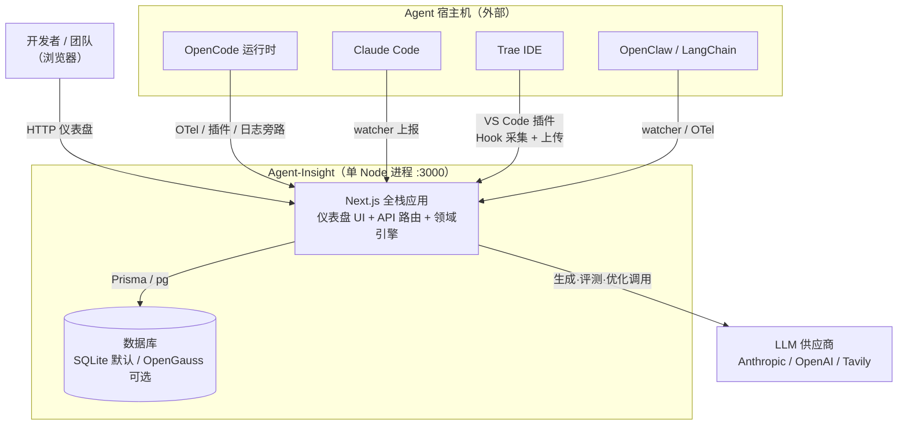
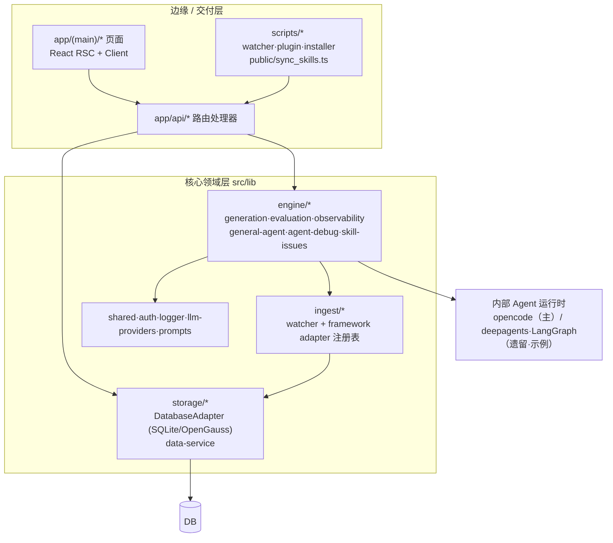
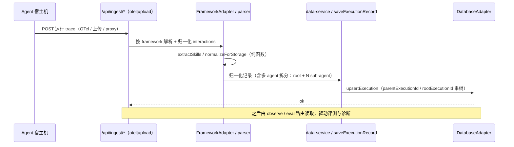
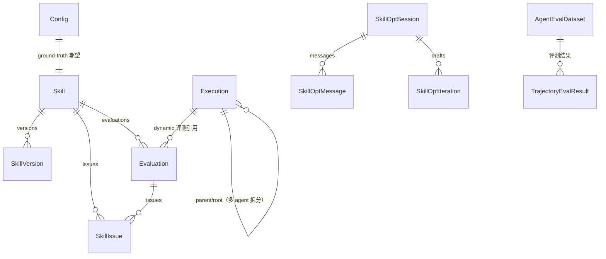
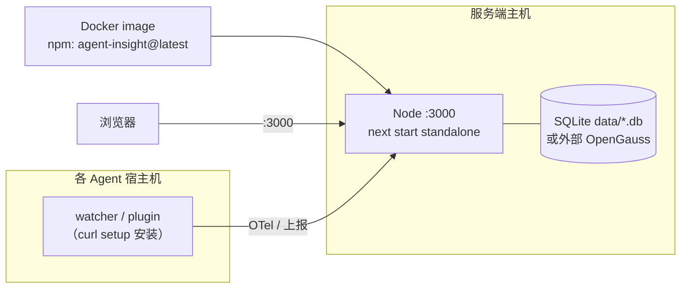

# Agent-Insight 架构设计文档

> 本文档基于源码逆向重建，系统说明该系统要解决的问题、整体架构形态、关键技术选型依据及主要风险。
> 全文用三个标签区分可信度——`[确证]`（来自代码/配置，可指向文件）、`[推断]`（据证据合理推测，给依据）、`[待确认]`（代码无法回答，已汇总到 §9 提问）。

| | |
|---|---|
| 生成方式 | 由源码逆向重建（codebase-arch-doc skill + 待人工确认） |
| 主要技术栈 | TypeScript 5 · Next.js 16 (App Router) · React 19 · Prisma 5 / pg · OpenTelemetry · opencode / LangChain |
| 代码版本 | `e0e7917`（分支 `master_0530`） |
| 状态 | 逆向初稿 |
| 最后更新 | 2026-06-04 |

> 配套文档：项目定位见 [00-positioning.md](00-positioning.md)，模块细节见 [02-modules.md](02-modules.md)，API 契约见 [04-api-and-contracts.md](04-api-and-contracts.md)，数据与控制流见 [05-data-and-control-flow.md](05-data-and-control-flow.md)。

---

## 1. 背景与问题（Background）

`[确证]`（来源 [README.md](../../README.md)、[00-positioning.md](00-positioning.md)）随着 Agent 在各行业落地，开发者面临三个反复出现的痛点：

1. **Agent 运行是黑盒** —— 难以定位失败的根因。
2. **Skill 质量参差不齐** —— 缺乏系统化的方式评测和迭代 Skill。
3. **Agent 经验无法沉淀** —— 每次优化都从零开始。

**Agent-Insight** 是一个**框架无关、完全自托管**的 Agent 工程底座，让运行在 OpenCode、Claude Code、Trae IDE、OpenClaw、LangChain 等任意框架上的 Agent 都能被持续观测、系统评测和自主优化，并将 **Skill（Agent 能力）作为一等公民**，提供从生成、A/B 测试到优化的完整闭环。

**形态判断** `[确证]`：这是一个 **Next.js 16 全栈 Web 应用**（前端仪表盘 + 后端 API 路由同进程），辅以一个 **CLI 安装器**（`bin/cli.js`，npm 包 `@witty-ai/skill-insight`）和一组**分发到 Agent 宿主机的客户端接入脚本**（`scripts/*watcher*`、`scripts/opencode_plugin*`、`scripts/trae-collector/`、`public/sync_skills.ts`）。`package.json` 声明了 `bin`，但主体是 Web 服务而非 CLI。

---

## 2. 目标与非目标（Goals & Non-Goals）

### 2.1 可从代码客观确证的「系统做了什么」`[确证]`

从顶层 API 路由（`src/app/api/*`）与仪表盘页面（`src/app/(main)/*`）客观罗列出五大能力域：

- **接入（ingest）** —— 通过 OTel / 插件 / watcher / VS Code Hook 采集多框架 Agent 运行数据。
- **观测（observe）** —— trace 列表、执行详情、会话、指标聚合、故障诊断。
- **评测（eval / evaluation / skill-eval）** —— 静态合规、动态轨迹、触发分析、结果/路由评测、A/B 与灰度。
- **Skill 全生命周期（skill-generator / skill-opt / skills）** —— 生成、版本管理、优化。
- **配置与治理（auth / settings / model-registry / access-control）** —— 模型注册、访问控制、用户隔离。

### 2.2 架构目标（推断）

> 目标属设计意图，代码只能旁证。以下内容基于基础设施信号作出 `[推断]`，并已结合项目背景完成校正。

- **`[推断]` 框架无关性是首要架构目标** —— 依据：存在显式的 `FrameworkAdapter` 注册表设计（`docs/design/framework-adapter-registry/`）、按框架分流的 parser/watcher（`src/lib/engine/observability/{claude,openclaw}-parser.ts`）、TRAE 的 VS Code 插件采集路径，以及基于 OpenTelemetry 标准协议的接入端点。
- **`[推断]` 数据主权 / 自托管是硬约束** —— 依据：README 强调「全栈本地化部署、无外部依赖」，默认 SQLite 落本地文件，安装走 `npx ... install` 单机脚本。
- **`[推断]` 可观测性是目标** —— 依据：集成 OpenTelemetry SDK + Langfuse，独立 `instrumentation*.ts` 注册。
- **`[推断]` Skills 全生命周期管理是核心目标** —— 依据：系统同时提供 Skills Hub、Skills 生成、Skills 评测、Skills 优化、版本历史等完整能力链路，覆盖从生成、管理到迭代优化的全过程。
- **`[推断]` Agent 智能诊断是核心目标** —— 依据：导航与 API 中存在独立的 fault/debug 能力域，配套 `engine/agent-debug` 子系统，说明系统不仅关注观测，还强调对运行异常进行诊断与定位。

---

## 3. 需求与约束（Requirements & Constraints）

### 3.1 功能范围 `[确证]`

> 按**产品导航信息架构**组织——即用户在侧边栏看到的功能模块分组（权威来源：`src/components/shell/AppSidebar.tsx` + 标签 `src/locales/zh.ts`）。注意「显示名 ↔ 路由」有若干不对应处（*智能诊断*→`/fault`、*评估器*→`/metrics`、*Skills Hub*→`/skills`），下表以路由为准。

**一级分组 `AGENT WORKSPACE`（`nav.groupAgentWorkspace`）**

| 模块 / 子项 | 路由 | 后端引擎 / API 域 |
|---|---|---|
| 概览 | `/dashboard` | `api/dashboard/**` |
| Agent 管理 | `/agents` | `api/agents/**`、`api/auth/**` |
| 运行观测 · 链路追踪 | `/trace`（+`/details`） | `api/observe/**`、`engine/observability` |
| 运行观测 · 智能诊断 | `/fault` | `api/fault/**`、`api/debug/**`、`engine/agent-debug` |
| 运行观测 · 质量监控 | `/quality` | `/api/quality/{agents,report,executions}` |
| 运行观测 · 推理 Infra | `/infra`（+`/infra/sources`、`/infra/source/:id`） | `api/observe/infra/**`、`lib/infra`、`lib/ingest/vllm` |
| 评测中心 · 评测数据集 | `/dataset` | `api/agent-datasets/**`、`engine/evaluation` |
| 评测中心 · 评估器 | `/metrics` | `api/user-evaluators/**`、`engine/evaluation` |
| 评测中心 · 评测执行 | `/eval` | `api/eval/**`、`api/evaluation/**`、`engine/evaluation` |
| Skills 能力 · Skills Hub | `/skills`（+`/skill-history`、`/skill-detail`） | `api/skills/**` |
| Skills 能力 · Skills 生成 | `/skill-generator` | `api/skill-generator/**`、`engine/skill-generation` |
| Skills 能力 · Skills 评测 | `/skill-eval` | `api/skill-eval/**`、`engine/skill-issues` |
| Skills 能力 · Skills 优化 | `/skill-opt` | `api/skill-opt/**`、`engine/skill-generation` |

**一级分组 `配置`（`nav.configGroup`）**

| 模块 | 路由 | API 域 |
|---|---|---|
| 模型注册 | `/modelconfig/registry` | `api/eval/settings/**` |
| 联网搜索 | `/modelconfig/web-search` | `api/eval/settings/**` |
| 安装指导 | `/accessconfig/install` | `api/ingest/setup/**` |

**数据接入（无独立导航入口，由"安装指导"分发的客户端回传）** `[确证]`：`api/ingest/**`（otel `/v1/{traces,logs,metrics}`、upload、proxy、setup、sync）+ `scripts/*watcher*` / `opencode_plugin*` / `public/sync_skills.ts`。

**已存在但未挂载到导航的页面** `[确证]`（源码保留、nav 中注释或未引用，多为半成品/已下线）：`/memory`（记忆评估，nav 注释）、`/optapi`、`/security`、`/skill-release`、`/modelconfig`（index）、`/accessconfig/{channels,webhooks,health}`（nav 注释，"后端能力未稳定"）。导航 IA 与可达性标注详见 [06-frontend.md](06-frontend.md#导航信息架构功能模块)。

### 3.2 关键质量属性（NFR）—— 推断节

> 代码不会写「我要 99.95% 可用」，但架构选择泄露意图。下表全部 `[推断]` 并给依据：

| 看到的证据（文件/依赖） | 推断的质量意图 |
|---|---|
| OpenTelemetry SDK + `@langfuse/otel` + `src/instrumentation-node.ts` | **可观测性**是一等目标 |
| `DatabaseAdapter` 抽象（SQLite ⇄ OpenGauss）`db-interface.ts` | **可移植性 / 数据主权** —— 适配企业信创库（OpenGauss）与零依赖单机（SQLite） |
| `FrameworkAdapter` 注册表（`docs/design/framework-adapter-registry/`） | **可扩展性** —— 新框架接入成本最小化 |
| `next.config.ts` 中大量 `legacyAliases` 重写 | **向后兼容**是约束 —— 外部 uploader/watcher/OTel collector 的旧 URL 不能断 |
| 大量 `*JobResult` / `status: pending|running|done|failed` 表（`DebugJobResult`、`TrajectoryEvalResult`、`AgentDebugReport`） | **异步任务可靠性** —— 长任务落库、可重跑、重启可恢复 |
| 几乎所有表都有 `user` 字段 + `@@unique([..., user])` | **多用户数据隔离**是需求 |

### 3.3 约束

- **技术约束** `[确证]`：Node.js `>= 20.0.0`；TypeScript `strict`，`moduleResolution: bundler`，路径别名 `@/* → src/*`（`tsconfig.json`）；3000 端口；Next.js `output: 'standalone'`，`serverExternalPackages: ['node-fetch','pg']`（`next.config.ts`）。
- **组织/合规约束** `[待确认]`：openEuler 社区项目（gitcode `openeuler/witty-agent-insight`，需签 CLA）；是否有等保/信创等硬性合规要求未在代码体现。

---

## 4. 架构总览（Architecture Overview）

整体是一个 **以领域引擎为核心的分层全栈单体**：轻量的 Next.js 路由处理器将工作委派给 `src/lib/engine/*` 子系统；持久化隐藏在 `DatabaseAdapter` 之后；框架特定的接入逻辑隔离在 parser/watcher 与 `FrameworkAdapter` 注册表；LLM 工作委派给内部的 opencode agent 运行时（遗留/示例路径仍走 deepagents/LangGraph）。

### 4.1 系统上下文（C4 Context）`[确证]`

外部依赖来自依赖清单与 `detected_concerns`：**数据库**（`@prisma/client`、`pg`）、**LLM**（`@langchain/anthropic`、`@langchain/openai`、`openai`、`@langchain/tavily`）、**可观测**（`@opentelemetry/sdk-node`、`@langfuse/otel`）、**Agent 运行时**（`@opencode-ai/sdk`、`deepagents`、`@langchain/langgraph`）。

### 4.2 主要组件（Component）`[确证]`

| 组件 | 路径 | 职责 |
|---|---|---|
| API 路由处理器 | `src/app/api/**/route.ts` | HTTP 入口，按域分组（ingest/observe/eval/skill-*） |
| 仪表盘页面 | `src/app/(main)/**/page.tsx` | 共享 layout 下的多页 SPA |
| 领域引擎 | `src/lib/engine/{skill-generation,evaluation,observability,general-agent,agent-debug,skill-issues}` | 业务核心，被路由委派 |
| 接入适配 | `src/lib/ingest/*` + `src/lib/engine/observability/*-parser.ts` | 多框架数据归一化 |
| 存储抽象 | `src/lib/storage/{db-interface,data-service,prisma}.ts` | DB 适配器 + 高层数据服务 |
| 内部运行时 | `@opencode-ai/sdk`（`general-agent`、skill 生成 bridge、轨迹评测） | 跑「被测 Agent」与 LLM 工作流 |

**单体判断** `[确证]`：单一 `package.json`、单进程、无多 service 目录 → **模块化单体**，而非微服务。

### 4.3 核心流程：一次 Agent 运行数据的接入 → 落库 `[确证]`（结构）/`[推断]`（步骤命名）

设计铁律 `[确证]`（`docs/design/framework-adapter-registry/phase2`）：**适配器是纯函数，不碰 DB/网络，只做转换；入库唯一出口是 `saveExecutionRecord`**。

---

## 5. 关键技术决策与权衡（Key Decisions）

> 决策本身 `[确证]`（代码里写着）；理由与备选 `[推断]`（据领域常识，请确认）。

| 决策点 | 采用方案 `[确证]` | 推断理由 / 权衡 `[推断]` | 常见备选 |
|---|---|---|---|
| 服务拆分 | 模块化单体（单 Next.js 进程） | 自托管要「一键安装、零运维」，单进程最简；牺牲独立伸缩 | 微服务 / 前后端分离 |
| 全栈框架 | Next.js 16 App Router + React 19 | UI 与 API 同仓同进程，降低部署复杂度；RSC 减少前端样板 | 独立 React SPA + Express/Nest 后端 |
| 主存储 | Prisma + SQLite（默认），`DatabaseAdapter` 可切 OpenGauss | SQLite 实现零依赖单机；OpenGauss 适配信创/企业 | 直接绑定 PostgreSQL / MySQL |
| 接入协议 | OpenTelemetry 标准 + 框架插件/watcher 旁路 | 标准协议最大化「框架无关」，旁路避免侵入 Agent 代码 | 仅私有 SDK 上报 |
| 框架扩展 | `FrameworkAdapter` 查表注册表（第一刀已落地） | skill 抽取、Claude 存储归一化、框架名别名解析走统一入口，降低新框架接入成本 | 保持分散 if/switch |
| 内部 Agent 运行时 | opencode 为主，deepagents/LangGraph 为遗留/示例 | 迁移到 opencode SDK；保留 LangGraph 兼容历史代码 | 全量自研 agent loop |
| 异步长任务 | 落库 + `status` 状态机（`*JobResult` 表） | 评测/诊断耗时长，需重启可恢复、可重跑、可追溯 | 纯内存队列 / 外部 MQ |

### ADR 摘要：`DatabaseAdapter` 双实现

- **状态**：已实现（`src/lib/storage/db-interface.ts`）。
- **决策** `[确证]`：定义 `DatabaseAdapter` 接口，`PrismaAdapter`（SQLite）与 `OpenGaussAdapter`（pg）双实现；工厂 `getDatabaseAdapter()` 按 `process.env.DB_HOST` 是否存在切换（有则 OpenGauss，否则 Prisma/SQLite，行 1059–1079）。
- **后果** `[推断]`：单机开箱即用 + 企业可换信创库；代价是接口方法签名大量 `any`（弱类型），且业务需绕开 Prisma 强类型走通用接口。

---

## 6. 数据设计（Data Design）`[确证]`

数据模型见 `prisma/schema.prisma`（默认 provider `sqlite`）。核心实体围绕三条主线组织：**Skill 资产**、**Execution 运行数据**、**Evaluation/Issue 评测产物**。

要点 `[确证]`：

- **Execution 多 Agent 拆分**：一次主 agent trace 拆成 1 条 root + N 条 sub-agent，靠 `parentExecutionId` 串、`rootExecutionId` 共享根；列表默认按 `isSubagent=false` 过滤（schema 行 97–114）。
- **评测两表设计**：`Evaluation`（按 `type` 区分 static/dynamic/trigger）+ `SkillIssue`（一行一个优化点，`source` 从 `Evaluation.type` denormalize 以避热路径 join）。旧 `SkillOptimizationPoint` 单表已废弃（schema 行 556–559）。
- **重评懒删除模型** `[确证]`：dynamic 评测重跑不删旧记录，多评估器并存，prevalence 由读取时派生。
- **JSON-as-string 普遍** `[推断]`：大量字段用 `String` 存 JSON（`tags`、`casesJson`、`configJson`、`itemsJson`…）。依据 schema 注释——这是 SQLite 无原生 JSON/array 类型下的折中，代价是类型安全与查询能力。
- **用户隔离**：几乎所有表带 `user` 字段并入唯一约束（如 `Skill @@unique([name, user])`）。

---

## 7. 横切关注（Cross-cutting Concerns）

直接来自 `detected_concerns` 与代码：

- **可观测性** `[确证]`：OpenTelemetry SDK + Langfuse；`src/instrumentation.ts`（运行时门控，仅 Node.js runtime 加载）→ `src/instrumentation-node.ts`（注册系统 agent `ensureAllSystemAgents`、opencode 子进程退出清理、拉起 uploader 处理待上报 spool）。OTel 接入端点 `src/app/api/ingest/otel/v1/{traces,logs,metrics}`，并在根路径 `/v1/*` rewrite 直收 collector 上报。
- **数据持久化** `[确证]`：见 §6，`DatabaseAdapter` 抽象 + `data-service.ts` 高层服务。
- **认证 / 多用户** `[确证]`：`User` 表（`apiKey` 唯一），`src/lib/auth/*`，按 `user` 字段做行级隔离；API Key 用于客户端接入鉴权。`[推断]` 登录为「任意邮箱即可」（README），表明是单机自托管的轻量身份模型，非企业 SSO。
- **向后兼容** `[确证]`：`next.config.ts` 维护一大批 `legacyAliases`，把旧扁平 `/api/*` 重写到分层后的 `ingest/observe/eval/*`，保证外部客户端不断。
- **缓存 / 消息队列**：`[确证]` **未发现**独立缓存层（Redis/CDN）或消息中间件；异步靠 DB 状态机 + 内存（见 §3.2 异步任务）。
- **国际化** `[确证]`：`src/locales/*`（多语言）。

---

## 8. 部署架构（Deployment）

`[确证]`：核心服务提供基于 npm 包的 `Dockerfile`：镜像构建时从 npm 安装 `agent-insight@latest`（可通过 `AGENT_INSIGHT_VERSION` 构建参数固定版本），不复制源码；运行时由 `scripts/docker-entrypoint.sh` 初始化持久化目录、同步数据库 schema，并以前台进程启动 Next.js standalone server。所有运行时数据均以 `AGENT_INSIGHT_DATA_DIR` 为根：SQLite、Skill 附件、评测 runtime 文件默认落到 `/data/agent-insight/data/`，避免写入 Next.js standalone 目录。镜像同时显式导出 `OPENCODE_BIN=/app/node_modules/.bin/opencode`，以支持 `opencode-live` 评测在服务端容器内直接 spawn `opencode serve`。当前默认镜像走 SQLite-first 路线，不打包 OpenGauss 的 Python 依赖；若部署侧设置了 `DB_HOST`，entrypoint 会直接报错退出。主服务部署方式是：

- **单 Node 进程**，`next start -p 3000`（`output: 'standalone'`）。
- **CLI 安装器** `bin/cli.js` → `scripts/{install,start,stop,status,restart}.js`，供 `npx @witty-ai/skill-insight install` 一键装。
- **进程管理脚本** `scripts/restart.sh`（生产）/ `scripts/restart_dev.sh`（开发）。
- **容器部署**：`docker build --pull --no-cache -t agent-insight:npm-latest .` 后运行，默认暴露 3000，并将 `/data/agent-insight` 作为持久化根目录。
- **客户端接入** 通过 `curl http://<host>:3000/api/ingest/setup | bash` 分发 watcher/插件到 Agent 宿主机。

`[待确认]`：生产环境的实际拓扑（是否反向代理、是否多实例、OpenGauss 部署形态、备份策略）代码无法回答。

---

## 9. 风险与待解决问题（Risks & Open Questions）

### 9.1 风险（据信号推断）

- **`[推断]` 存储接口弱类型** —— `DatabaseAdapter` 几乎全 `any`（`db-interface.ts`），绕开了 Prisma 类型安全；重构时易引入运行时错误。依据：接口签名。
- **`[推断]` JSON-as-string 蔓延** —— 大量业务结构存为 JSON 字符串，无法用 DB 查询/约束保证一致性，schema 演进靠注释约定。依据：§6。
- **`[推断]` 运行时迁移中的双轨** —— opencode（主）与 deepagents/LangGraph（遗留/示例）并存，存在 `legacy/` 目录；过渡期维护成本与认知负担。依据：`package.json` deepagent 脚本 + `00-positioning.md` 提到 `legacy/`。
- **`[推断]` 架构重构进行中** —— `FrameworkAdapter` 注册表第一刀已落地，skill 抽取与 `data-service` 内 Claude 存储归一化已收敛；setup 脚本框架清单、platform 轴、`role === 'opencode'` 等仍按设计留待后续治理。依据：`docs/design/framework-adapter-registry/phase2`。
- **`[推断]` 测试覆盖偏接入/解析** —— 38 个测试文件，但 `todo_fixme_count=7`；评测/优化等重逻辑的端到端覆盖待确认。依据：`evidence.json`。
- **`[推断]` 单进程单点** —— 模块化单体无水平扩展/高可用配置；长评测任务与 Web 请求共享进程资源。依据：§8 无编排配置。

### 9.2 待确认清单（请用户回答——这些代码答不出）

1. **业务目标优先级**：框架无关、数据主权、Skill 闭环——哪个是第一目标？本期明确的**非目标**是什么？
2. **部署形态**：生产是否单实例自托管？是否上反向代理 / 多副本？OpenGauss 用于什么规模的客户？
3. **合规约束**：是否有信创/等保/数据驻留等硬性合规要求驱动了 OpenGauss 适配？
4. **运行时迁移终局**：deepagents/LangGraph 路径是计划完全移除，还是长期保留兼容？
5. **SLA / 规模假设**：单实例预期支撑多少并发 Agent 上报、多大 trace 数据量？是否有性能目标？
6. **身份模型**：「任意邮箱登录」是 demo 便利还是生产形态？生产是否对接企业 SSO？

---

## 10. 演进方向（Evolution）`[推断]`

代码与设计文档暗示但尚未完全落地的方向：

- **框架适配器注册表统一化** —— `docs/design/framework-adapter-registry/`（第一刀已落地），把 skill 抽取、Claude 存储归一化与框架名别名解析收敛为单一 `getAdapter(framework)` 查表入口。
- **Hermes / OTel 适配扩展** —— `docs/design/hermes-otel-adapter/` 表明在接入更多运行时。
- **运行时全面迁移 opencode** —— 逐步退役 deepagents/LangGraph 遗留路径（`src/lib/engine/skill-generation/legacy/`）。

> 逆向文档不写 milestones；如需前瞻路线图请另开。

---

## 附录

- **关键文件索引（本次重建实际读过）**：
  - [prisma/schema.prisma](../../prisma/schema.prisma) — 数据模型
  - [next.config.ts](../../next.config.ts) — 重写规则、standalone 输出
  - [package.json](../../package.json) — 依赖与脚本
  - `src/lib/storage/db-interface.ts:1059` — `getDatabaseAdapter()` 适配器选择
  - `src/instrumentation.ts` / `src/instrumentation-node.ts` — 可观测性启动
  - [docs/design/framework-adapter-registry/phase2-requirements-design.md](../design/framework-adapter-registry/phase2-requirements-design.md) — 适配器注册表设计
  - [README.md](../../README.md) / [00-positioning.md](00-positioning.md) — 背景与定位
- **术语**：Skill（带版本能力）· Execution/trace（一次接入的 Agent 运行）· Config（标准答案数据集条目）· Evaluation（static/dynamic/trigger）· SkillIssue（优化点）· FrameworkAdapter（框架接入适配器）· DatabaseAdapter（存储适配器）。详见 [INDEX.md](INDEX.md)。
- **证据来源**：本文 `[确证]` 项均可追溯到上述文件；`[推断]`/`[待确认]` 已在 §9 汇总。
