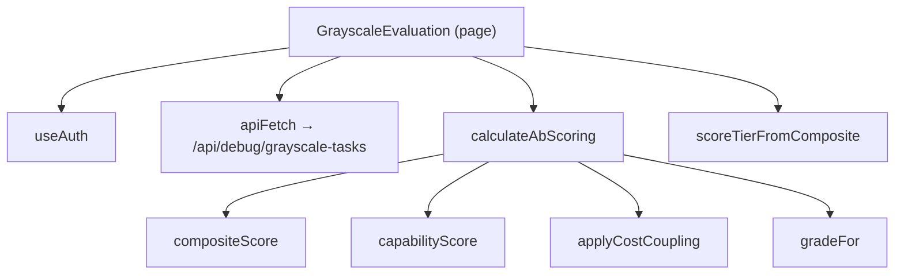
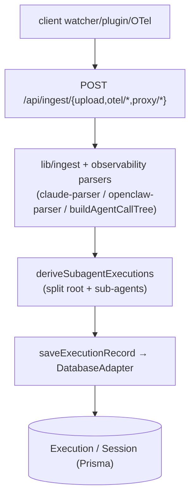
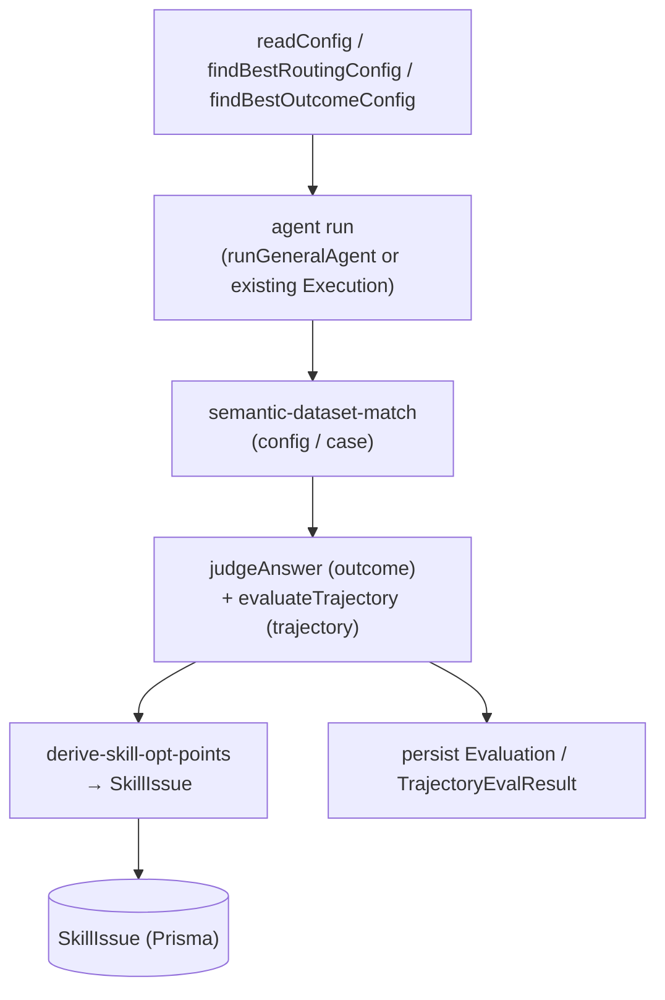
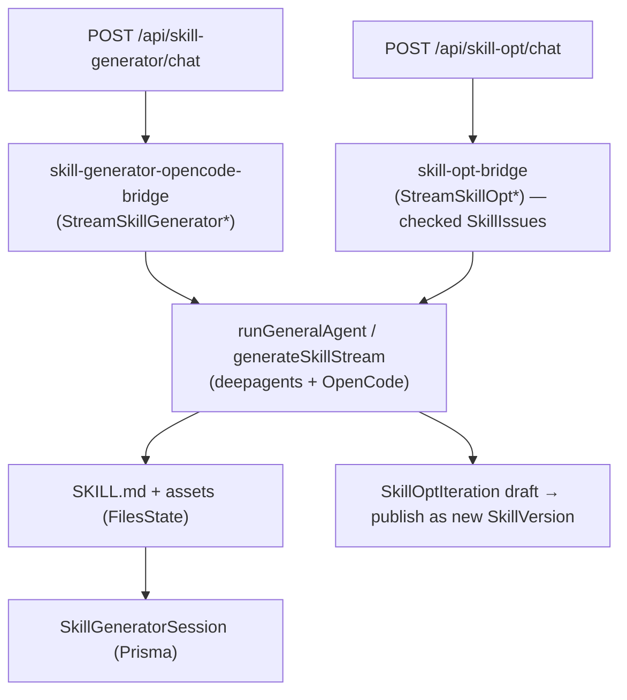

# 数据与控制流

> 两个视角：（1）分析器从页面/组件入口点出发，沿 React 调用图追踪出的前端流程；（2）从 API 路由处理器和引擎入口函数重建出的后端流水线。前端追踪使用真实的调用边；后端流水线则是从入口点 + 调用图与命名推导而来（确切的内部调用边可能有所不同——在需要时请核对源码）。

## Entry points
| Entry | File | Kind |
|---|---|---|
| `POST` ingest upload | `src/app/api/ingest/upload/route.ts` | HTTP |
| `POST/OPTIONS` OTel | `src/app/api/ingest/otel/v1/{logs,metrics,traces}/route.ts` | HTTP |
| `POST` agent run/stream | `src/app/api/agent/{run,stream}/route.ts` | HTTP |
| `POST` trajectory eval | `src/app/api/eval/trajectory/run/route.ts` | HTTP |
| `POST` grayscale tasks | `src/app/api/debug/grayscale-tasks/[taskId]/route.ts` | HTTP |
| `POST` skill-generator chat | `src/app/api/skill-generator/chat/route.ts` | HTTP |
| `POST` skill-opt chat | `src/app/api/skill-opt/chat/route.ts` | HTTP |
| `POST` fault diagnosis | `src/app/api/fault/diagnosis/stream/route.ts` | HTTP |
| `ClaudeLogWatcher.start` | `scripts/claude_watcher_client.ts` | 客户端 agent |
| `WittySkillInsightPlugin` | `scripts/opencode_plugin.ts` | 客户端插件 |

## 前端流程（分析器追踪）
静态分析器从 10 个页面/组件入口出发跟踪调用边。其中最大的几个：

| Entry | File | Modules touched | Project fns |
|---|---|---|---|
| `Dashboard` | `components/eval/Dashboard.tsx` | components, lib, app | 47 |
| `GrayscaleEvaluation` | `app/(main)/skill-eval/grayscale/page.tsx` | app, lib | 30 |
| `PlaygroundPage` | `app/(main)/skill-generator/page.tsx` | app, lib | 12 |
| `TrajectoryEvalCenter` | `components/eval/TrajectoryEvalCenter.tsx` | components, lib | 34 |
| `AgentTraceView` | `components/observe/AgentTraceView.tsx` | components, lib, scripts, app | 37 |
| `BatchEvaluation` | `app/(main)/skill-eval/_batch/page.tsx` | app, lib, components | 6 |
| `SkillOptimizePage` | `app/(main)/skill-opt/[name]/[version]/page.tsx` | app, lib | 7 |
| `AgentDatasetCenter` | `components/AgentDatasetCenter.tsx` | components, lib | 22 |

通用形态：页面/组件拉取 context hooks（`useAuth`、`useLocale`、`useTheme`），调用 `apiFetch`（`src/lib/client/api.ts`）请求某个路由处理器，然后运行本地的纯转换函数（评分/格式化辅助函数，如 `compositeScore`、`calculateAbScoring`、`formatTokens`、`normalizeConfig*`）。示例——A/B（灰度）页面：

## 后端流水线：接入（agent run → Execution 记录）
客户端 agent（OpenCode 插件、Claude/OpenClaw watcher、OTel SDK）将运行数据推送到接入路由。平台将原始 session 规范化为一棵 `Execution` 树。

关键函数：接入路由处理器（`processUploadAsync`、`proxyFetch`、OTel `POST`）→ `src/lib/ingest/*` + `engine/observability/{claude,openclaw}-parser.ts`、`agent-trace.ts:buildAgentCallTree` → `storage/data-service.ts:saveExecutionRecord` / `deriveSubagentExecutions`。

## 后端流水线：评测（Config → Execution → Decision）
数据集 `Config` 提供真值；将执行记录进行匹配并评分；结果转化为 `Evaluation` + `SkillIssue` 行。

入口路由：`eval/config/*`、`eval/trajectory/run`、`eval/rejudge`、`debug/batch-tasks/*`、`debug/grayscale-tasks/*`（A/B 经由 `ab-scoring.ts`）。引擎：`evaluation/judge.ts:judgeAnswer`、`trajectory-evaluator.ts:evaluateTrajectory`、`semantic-dataset-match.ts`、`derive-skill-opt-points.ts`、`result-artifact-extractor.ts`。轨迹评测的实际 trace 证据由 `trace-summarizer.ts` 基于 `Session.interactions` 生成事件级步骤；`ExecutionMatch.extractedSteps` 仍用于 Skill 流程对齐/可视化缓存，不作为轨迹评测唯一输入。

## 后端流水线：Skill 生成与优化

引擎：`engine/skill-generation/index.ts:generateSkill*`、`general-agent/runner.ts:runGeneralAgent`、`lib/skill-generator-opencode-bridge.ts`、`lib/skill-opt-bridge.ts`。静态合规检查：`engine/skill-issues/static-evaluator/index.ts:runStaticEvaluation`。

## 后端流水线：故障诊断
`POST /api/fault/diagnosis/stream` 从某个 session/Execution 构建上下文，读取 AgentDebug 上游分析结果并以流式方式回答追问。上游分析由观测页触发：`POST /api/observe/executions/:executionId/agent-debug` 将 `AgentDebugReport` 写成 `running` 后启动 Node 进程内后台任务，任务完成后将 `AgentDebugReportPayload` 持久化到 `AgentDebugReport`；`POST /api/observe/executions/:executionId/agent-debug/skills-analysis` 同样将 `AgentDebugSkillsAnalysis` 写成 `running` 后独立启动 Skills 步骤核验，完成后持久化到 `AgentDebugSkillsAnalysis`。前端 `components/observe/AgentDebugCard.tsx` 会并行触发两条链路，分别轮询 `/agent-debug` 和 `/agent-debug/skills-analysis`，任一结果完成后独立刷新对应区块。后台任务使用 `interactionsHash` 做条件写入，避免旧任务晚完成后覆盖新结果；进程内 active map 用于防重复启动和识别服务重启后的失活 `running`。故障追问上下文读取主诊断报告和新 Skills 分析缓存，不读取旧 `reportJson.skillsAnalysis`。

## 跨模块流程说明
每条后端流水线都跨越 `app`（路由）→ `lib`（引擎/存储），并经常涉及 `prompts`（LLM 模板）和 `server`（Prisma 仓库）。`lib ↔ server` 循环（见 [01-architecture.md](01-architecture.md#layering--pattern)）意味着存储辅助函数与仓库会相互调用；应将它们视为同一个持久化核心。
