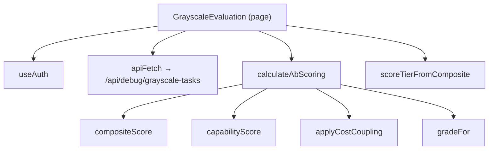
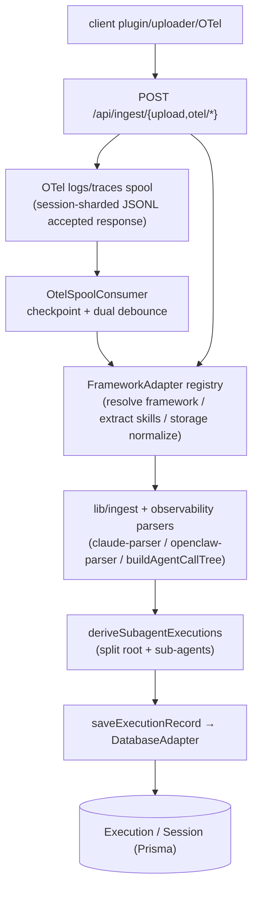
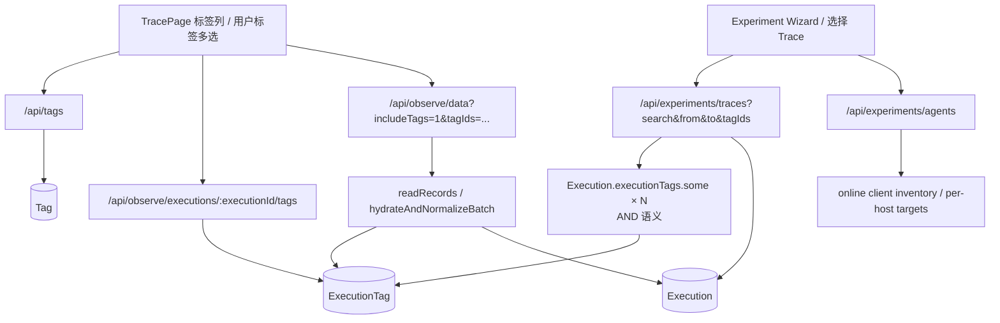
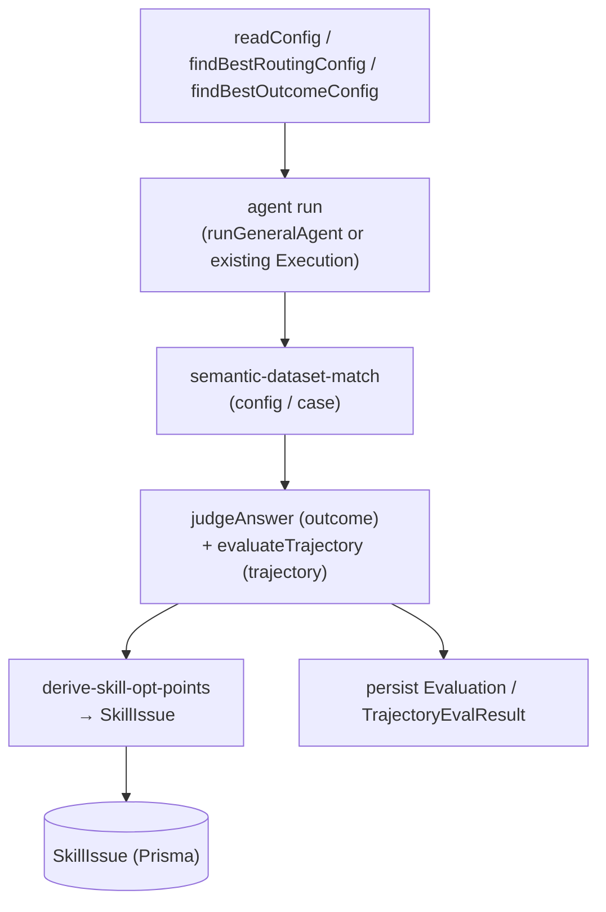
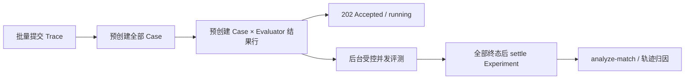
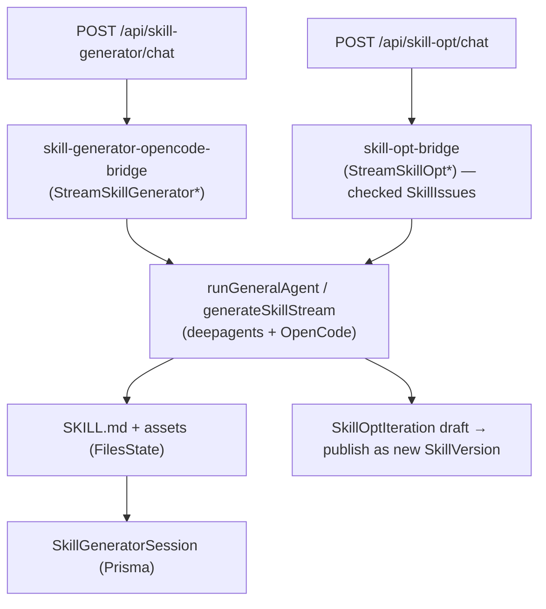
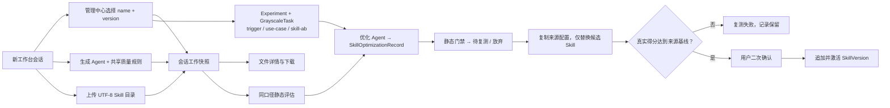

# 数据与控制流

> 两个视角：（1）分析器从页面/组件入口点出发，沿 React 调用图追踪出的前端流程；（2）从 API 路由处理器和引擎入口函数重建出的后端流水线。前端追踪使用真实的调用边；后端流水线则是从入口点 + 调用图与命名推导而来（确切的内部调用边可能有所不同——在需要时请核对源码）。

## Entry points
| Entry | File | Kind |
|---|---|---|
| `POST` ingest upload | `src/app/api/ingest/upload/route.ts` | HTTP |
| `POST/OPTIONS` OTel | `src/app/api/ingest/otel/v1/{logs,metrics,traces}/route.ts` | HTTP |
| `POST` agent run/stream | `src/app/api/agent/{run,stream}/route.ts` | HTTP |
| `POST` trajectory eval | `src/app/api/eval/trajectory/run/route.ts` | HTTP |
| `GET` experiment Trace candidates | `src/app/api/experiments/traces/route.ts` | HTTP |
| `POST` grayscale tasks | `src/app/api/debug/grayscale-tasks/[taskId]/route.ts` | HTTP |
| `POST` skill-generator chat | `src/app/api/skill-generator/chat/route.ts` | HTTP |
| `POST` skill-opt chat | `src/app/api/skill-opt/chat/route.ts` | HTTP |
| `POST` fault diagnosis | `src/app/api/fault/diagnosis/stream/route.ts` | HTTP |
| `POST` benchmark experiment / run | `src/app/api/experiments/route.ts`、`src/app/api/experiments/[id]/run/route.ts` | HTTP |
| `Claude Code OTel logs` | `src/app/api/ingest/setup/route.ts` | 客户端 OTel 配置 |
| `AcTrail otel-http setup` | `src/app/api/ingest/setup/actrail-setup.ts` | 已安装 AcTrail 的导出插件配置 |
| `TRAE VS Code plugin` | `scripts/trae-collector/src/extension.ts` | VS Code 插件采集 |
| `WittySkillInsightOtelPlugin` | `scripts/opencode_plugin_otel.ts` | 客户端插件 |

## 前端流程（分析器追踪）
静态分析器从 10 个页面/组件入口出发跟踪调用边。其中最大的几个：

| Entry | File | Modules touched | Project fns |
|---|---|---|---|
| `Dashboard` | `components/eval/Dashboard.tsx` | components, lib, app | 47 |
| `GrayscaleEvaluation` | `app/(main)/skill-eval/grayscale/page.tsx` | app, lib | 30 |
| `PlaygroundPage` | `app/(main)/skill-generator/page.tsx` | app, lib | 12 |
| `TrajectoryEvalCenter` | `components/eval/TrajectoryEvalCenter.tsx` | components, lib | 34 |
| `AgentTraceView` | `components/observe/AgentTraceView.tsx` | components, lib, scripts, app | 37 |
| `BatchEvaluation` | `app/(main)/skill-eval/_batch/page.tsx` | app, lib, components | 6 |
| `SkillOptimizePage` | `app/(main)/skill-opt/[name]/[version]/page.tsx` | app, lib | 7 |
| `AgentDatasetCenter` | `components/AgentDatasetCenter.tsx` | components, lib | 22 |

通用形态：页面/组件拉取 context hooks（`useAuth`、`useLocale`、`useTheme`），调用 `apiFetch`（`src/lib/client/api.ts`）请求某个路由处理器，然后运行本地的纯转换函数（评分/格式化辅助函数，如 `compositeScore`、`calculateAbScoring`、`formatTokens`、`normalizeConfig*`）。示例——A/B（灰度）页面：

Version Analysis reuses the same `Tag` / `ExecutionTag` tables. `/api/observe/version-analysis/compare` returns a de-duplicated global `summary`, per-version aggregates, and question facets; user, agent, framework, time-window, and root-only filters apply globally. For all selected traces, the service batch-loads successful `ExperimentEvalResult` rows for `preset-agent-task-completion`, orders them by `updatedAt`, and keeps the newest effective score (`humanScore ?? score`) for each `ExperimentCase.executionId`; only legacy cases without an execution ID use `taskId` fallback. Traces without such a score remain in the coverage denominator. `questionKey` only narrows the per-version comparison data for single-question drilldown. `/api/observe/version-analysis/tags/:tagId/traces` returns trace details for one version tag and uses the same global filters except the comparison question drilldown.

## 后端流水线：接入（agent run → Execution 记录）

Trae IDE 通过 VS Code 插件内置的 Hook 系统采集运行数据：Hook 脚本监听 session-start、pre-tool-use、post-tool-use、prompt-submit、stop、subagent-detect 等生命周期事件，将事件序列化为 JSONL 写入本地 spool 目录；插件内的 `UploadEngine` 按 checkpoint 增量消费 spool 文件，经内容截断后 POST 到 `/api/ingest/upload`。服务端通过 `traeAdapter` (`FrameworkAdapter`) 的 `extractSkills` 从 TRAE 特有 interaction 格式中提取 Skill 调用，再经 `saveExecutionRecord` 统一落库。

Hermes setup 现在安装仓库内置的 `scripts/hermes_agent_insight_plugin.py`，运行时目录为 `$HERMES_HOME/plugins/agent_insight_hermes/`。插件直接消费 Hermes lifecycle hooks，用 Python 标准库为每个已完成 span 生成 OTLP/HTTP JSON delta payload；LLM/API/tool/subagent spans 共用 root trace，并通过 `hermes.session_id`、`hermes.parent_session_id`、`hermes.root_session_id` 保留归属；root span 还会写入 `hermes.profile.name` 和 `hermes.agent.name`，profile 名优先从 Hermes 运行态 `HERMES_HOME` 的 `profiles/<name>` 路径推断；active profile 为 `default` 时聚合成 `hermes`，其他 profile 聚合成同名 root `Execution.agentName`。每个 delta payload 先原子写到 `~/.agent-insight/data/hermes-otel-spool/`，成功上报后删除，retryable failure 按指数退避；服务端 OTel trace spool 按 session 累积事件，聚合时重读该 session 已收到的全部 span，再用当前聚合快照替换存储记录。状态日志写入 `~/.agent-insight/logs/hermes-plugin.log`。平台 Hermes trace adapter 将 child interactions 标为 `role=subagent`，随后复用 `buildAgentCallTree` 与 `deriveSubagentExecutions`；child Execution 投影 self-only 的结果、模型、token、latency、调用统计和 skill，root 继续表示整棵 trace 总量。setup 只管理 `agent_insight_hermes`，不会更改 `hermes_otel` 等其他插件的启用状态或配置。OpenCode 式原生事件/snapshot API 保留为 exporter 备用方案，当前不新增第二条后端写入链路。
客户端 agent（OpenCode 插件 + uploader、Claude Code 官方 OTel logs、TRAE VS Code 插件 + uploader、CodeAgent 同名 OTel wrapper、Hermes `agent_insight_hermes` 插件、LlamaIndex `agent_insight_llamaindex`、OpenClaw watcher、AcTrail 官方 `otel-http` 插件、OTel SDK、Langfuse Python SDK）将运行数据推送到接入路由。平台将原始 session 规范化为一棵 `Execution` 树。OpenCode uploader 优先读取正式 `~/.agent-insight/client/config.json` 的 `clientId + deviceCredential`，但只在该配置的 `insightBaseUrl` 与当前 `AGENT_INSIGHT_HOST` 归一化后完整服务基址相同（协议、主机、端口与 basePath 均一致）时发送设备凭证；跨 Host、跨 basePath 或缺签发基址的旧配置退化为 API Key 鉴权。请求固定进入 `<Host>/api/ingest/upload` 并保留部署 basePath，同时上报 `client_id + host.reported_ip + host.hostname`。服务端并行验证 API Key 与设备凭证：任一有效即可归属用户，失效设备凭证不建立可信 `clientId`，两份有效凭证账号不一致则拒绝；兼容 `client.json` 的自报 ID 同样不建立绑定。重新运行 setup 会消费新安装令牌并按 `machineId` 复用记录、轮换设备凭证，防止服务重建后继续使用旧数据库签发的凭证；常驻客户端默认从当前服务端 bundle 安装，执行目录里的 checkout 只有显式设置 `AGENT_INSIGHT_CLIENT_SOURCE=local` 才会启用。通过设备凭证或有效 API Key 认证的 OpenCode uploader 直接访问公网 `IP:3000` 时，`observedIp` 取 Next.js 从 TCP 连接补入的来源公网地址；若 uploader 与服务端运行在同一台主机、连接来源为回环或私网地址，则在上报 hostname 与服务端 hostname 一致时取请求目标中的公网 IP。该直连路径不要求配置代理。经过代理部署时仍由 `AGENT_INSIGHT_TRUSTED_PROXY_HEADER` 指定可信代理清洗覆盖的来源头。兼容旧 uploader 的未认证自报身份不启用直连 IP 绑定，所有路径都只保存公网地址。完整部署矩阵与解析顺序见 [09-otlp-attribute-contract.md](09-otlp-attribute-contract.md) 的 OpenCode Trace 公网 IP 章节。客户端与主机字段取首次非空快照，重传不覆盖，根/child `Execution` 继承同一快照，也不复用表示模型推理源的 `Execution.endpoint`。Claude Code 的 `tool_result` log 只包含工具名、输入和结果大小等 metadata；工具输出正文从 raw API request body 的 `tool_result` blocks 回填，因此安装脚本将 `OTEL_LOG_RAW_API_BODIES` 配成 `file:<dir>`，避免 inline `1` 模式被 Claude Code 截断到 60 KB。跨机时服务端无法读取客户端 `body_ref`，仅由 Claude setup 安装的 `claude_context_uploader.js` 会在 `Stop`、`SubagentStop`、`StopFailure` 后把 session 任务原子写入本地队列，由 detached worker 增量扫描 transcript 并补传系统提示词、hook 上下文、工具输出和子 Agent 映射；其它 framework 不调用 `/api/ingest/claude/context`。system supplement 可携带父侧 `tool_use_id`，聚合器据此把 root 与 child prompt 分别写进对应 `subagent_session_id`；`subagent_map.agentType` 只在跨机 fallback 缺少 Agent tool-use input 时回填父 task 类型，随后 `claudecode` 复用 `buildAgentCallTree` / `deriveSubagentExecutions` 生成 child Execution。`generate_session_title`、`prompt_suggestion`、`prompt_suggestion_generate`、`away_summary`、`agent_summary` 属于 Claude 内部 query source，不进入 interactions 或 final result。上传失败保留任务，`SessionEnd` 写入同一队列并在无活动 worker 时同步排空，作为最终兜底；`.worker-starting` 原子令牌将 burst hook 合并为单 worker，spawn 失败立即释放，陈旧令牌 30 秒后可恢复，`.drain.lock` 继续保证 checkpoint 单写。该机制解决的是 hook 进程放大，不等于承诺 30 个完整新 Session/s 的实时吞吐；当前 worker 仍串行发 HTTP，服务端 consumer 也维持既有单飞语义，容量不足时以本地 queue/spool 积压而非提高并发。

Hermes 插件注册 `api_request_error`，并优先消费 Hermes 规范化后的 assistant message，同时兼容 choices/output/candidates 文本结构。OTel `logs` / `traces` 是异步摄取：HTTP 端点只负责解码、校验、归一化、写 JSONL spool 并返回已受理；`OtelSpoolConsumer` 再按 checkpoint 增量消费。traces 从 `src/lib/ingest/otel/{normalize,spool,aggregate}.ts` 进入 `adapter-registry.ts`。Langfuse LangGraph adapter 同时生成兼容评测的 interactions 与逐 observation 的无损 `langfuseTraceNodes`，后者按 spanId 合并保存；仅在 Langfuse Session 上，前端把可见 observation 投影成原有 `AgentTraceView` 的 Agent 和事件节点。业务 chain/span 以 CHAIN 类型保留 `displayParentSpanId` 层级；折叠已知 LangGraph 包装层时，其子节点提升到最近可见父节点，原始 `parentSpanId` 与正文仍保存在事实层。LlamaIndex adapter 按 `agent.instance.id` 和父 Span 恢复 Agent 所有者，去除 `achat → chat → complete` 等包装 Span，从 Completion/Chat 响应包装提取 LLM 正文，把 ReAct 的工具协议文本归入独立 Tool/Skill Interaction，规范化 Tool/Skill 摘要，并把 Tool、Retriever、Synthesizer 与有业务意义的 Workflow step 转为统一 Interaction。`init_run`、`setup_agent`、`parse_agent_output`、`aggregate_tool_results` 等纯运行时步骤不进入展示投影，原始 OTel 事件仍按 spool 保留策略保存。Hermes adapter 重建 `spanId` / `parentSpanId` 树，generic adapter 处理其他标准 OTel traces；Claude logs 专属聚合仍留在 `claude-otel`。

Pi、Codex 与 Goal Plus native 导入复用 `scripts/agent-trace-collectors/shared/trace-transport.cjs`。共享 writer 对正文递归脱敏后默认完整落盘；仅在调用方显式提供正整数 `maxContentChars` 时执行一次 Unicode code-point 截断。spool 事件转换为 OTLP 时不再应用隐式正文上限，避免 `[TRUNCATED ...]` 内容被二次截断；HTTP 错误响应和 span status message 等诊断文本继续使用独立的有界上限。

CodeAgent setup 在 Unix 安装 `~/.agent-insight/bin/codeagent` 并通过 shell profile 前置其目录，在 Windows 安装 `%USERPROFILE%\.agent-insight\bin\codeagent.cmd` + `codeagent-wrapper.ps1` 并前置持久化的用户级 PATH；两端包装器运行时都从排除自身目录后的 PATH 动态解析真实 CodeAgent，并以安装时记录的路径兜底，因此继承 PATH 的 Shell、PowerShell、CMD、Python、Node 等非交互子进程能获得同一套 OTel 环境且不会递归调用包装器。CodeAgent 通过 `service.name=CodeAgentOC` 分流：Logs 进入 `codeagent-otel` 独立聚合器，Traces/Metrics 返回 accepted 后在规范化和持久化前丢弃；聚合器根据 `query_source` 识别 `extract_memories` 和 `auto_dream`，并按其独立 `execution.agent_run_id` 排除整组后台记忆事件，原始 spool 不删除，正常子 Agent 不受影响；非 Langfuse 路径不读写 `langfuseTraceNodes`。

OpenClaw 的主接入路径是 setup 生成的同名命令包装函数：它向原始 `openclaw` 命令注入 OTLP/HTTP JSON 配置，watcher 仅作为互斥的兼容路径。OpenClaw trace adapter 重建 agent/LLM/tool/skill 与子 Agent 关系，并按 `traceId + spanId` 去重；模型请求仍由 OpenClaw 直接发送给模型供应商。

AcTrail 已由用户独立安装并通过 `actrailctl launch` 启动 Agent，Agent Insight setup 不安装或包装 AcTrail。Unix/WSL setup 为现有 AcTrail 官方 `otel-http` 插件生成带当前用户 `x-witty-api-key` 的完整属性配置，通过 `actraild plugin load --persist` 加载后，AcTrail 直接向 `/api/ingest/otel/v1/traces` 上报 protobuf。接收端将 AcTrail 从共享 OTel Trace 中分流，写入 `~/.agent-insight/otel_data/actrail/` 下按日期和 session 分片的独立 spool，并由独立消费源维护检查点；其他框架继续使用 `otel_data/traces/`。AcTrail adapter 按动作关系合并 `llm.call/request/response`，从请求头和明确身份字段确定 Agent 名称，按角色有界保留每次模型调用的系统提示、历史消息与本轮输入；模型输入中的内容块会整理为可读文本，并按工具调用标识识别本轮“调用—结果”组合。独立 `llm.tool_result` 缺失时，adapter 可从后续请求中的相同调用标识精确回填结果及连续文本块，再将工具、Skill、子 Agent 与 token 投影为公共 `ExecutionRecord`；重复 span 按最后到达版本覆盖。

Qoder CLI、Desktop、JetBrains 通过 `scripts/qoder_setup.mjs` 共享 session、prompt、tool、subagent 与 stop hooks，并通过 owner marker 管理独立生命周期；Qoder Work 由 `scripts/qoder_work_setup.mjs` 写入自己的 settings/runtime。四端全部 Hook 都是异步命令，Desktop 安装由事件循环调度，JetBrains 安装由 pooled thread 执行，启动线程和 `UserPromptSubmit` 不等待采集 I/O。`test/qoder-performance.test.ts` 对四端同步启动分派执行 `< 200ms` 断言，并用本地 SSE 首响应交替基准硬断言启用采集后的首 Token 中位数增幅 `< 5%`。每个 hook 进程只做 UTF-8 读取、脱敏和原子事件落盘；Stop/SessionEnd 再合并 transcript、diagnostics、Desktop/JetBrains 本地 SQLite Token、Experts cache 与 JetBrains marker，生成带稳定 trace/span id 的 OTLP JSON snapshot。snapshot 原子写入 pending 后会立即拉起一次 one-shot uploader，不等待后台 uploader 的 60 秒扫描周期；`test/qoder-trace-collector.test.ts` 使用真实本地 HTTP 接收端从 SessionEnd 计时到 OTLP 请求到达，并以 `< 3000ms` 作为 AC24 的硬断言。Desktop `deactivate()`、JetBrains application service `dispose()` 与动态卸载监听器会调用 collector `--flush`：没有 pending snapshot 的活动 event 目录先补一条 SessionEnd snapshot，再忽略 retry 等待时间并等待一次单实例上传；锁竞争最多等待 5 秒，网络或超时失败继续保留 pending/retry 文件。卸载器同时识别常驻 `uploader.lock` 和 one-shot `upload-run.lock`，先发送 SIGTERM、等待退出，超时后强制停止，再删除当前产品的新旧 spool、owner marker、Hook 与运行文件；Host/API Key 及 OpenCode、Claude、Hermes 等非 Qoder 配置不会被删除。四端卸载、交叉隔离与重新安装由 AC30–AC32 自动化用真实子进程覆盖。SQLite 只读查询按 `session_id` 选择 `chat_message`，再按 assistant 时间配对 LLM span，并以消息 `id` 保持一次 request 内多次模型调用互不覆盖；`cached_tokens` 是 prompt 的子集，不重复加入总量。spool 位于 `~/.agent-insight/otel_data/qoder/<product>/<api-key-hash>/`，不同产品/账号不会复用 pending、retry 或 uploader lock；旧 `qoder-{product}` 目录只保留停止 uploader 与 purge 兼容。成功受理后清理对应事件目录，失败前三次固定间隔，之后指数退避。Qoder adapter 只选同一 session 最新 snapshot，并把 Quest、Experts、Task→Subagent、多层嵌套、Skill、Tool、MCP、内置连接器、LLM 与错误状态映射到现有 Execution 树。

Codex 与 Pi 的 `default`、`worker` 等是一次委派的子任务角色名，而不是独立的平台
Agent 身份。二者的根/子 `Execution.agentName`、`observedAgents` 和 `RegisteredAgent`
均归一为 `codex` 或 `pi-agent`（界面展示 Codex/Pi）；角色名只保留在
`Execution.subagentName` 和 interaction 的 `subagent_name`，供链路树、详情与子任务筛选
使用。每次写入这两个框架的 trace 时，存储层会对同一用户/平台的历史记录做幂等归一，
清除遗留的角色名注册；其他框架继续沿用多 Agent 注册语义。

OTel spool 新写入按 day + session 分片：ClaudeCode logs 使用 `otel_data/claude/YYYY-MM-DD/sessions/<safe-session>/logs.jsonl`，CodeAgent logs 使用 `otel_data/codeagent/YYYY-MM-DD/sessions/<safe-session>/logs.jsonl`，Hermes/通用 traces 使用 `otel_data/traces/YYYY-MM-DD/sessions/<safe-session>/traces.jsonl`。Consumer 递归发现 JSONL shard，并继续兼容旧的 `YYYY-MM-DD/logs.jsonl` / `YYYY-MM-DD/traces.jsonl` 日文件。

Pi Agent 是通用 traces 之外的第一方专用路径：Extension 将事件写入
`~/.agent-insight/otel_data/pi-agent/<api-key-hash>/YYYY-MM-DD/events.jsonl`，独立 uploader
再通过同一 OTLP/HTTP traces endpoint 发送。服务端 `otel/adapters/pi-agent.ts` 按
`agent.insight.kind` 恢复 Agent、SubAgent、Skill、LLM、Tool 和 MCP，随后转交统一
`buildAgentCallTree` 与 `deriveSubagentExecutions`；同一 `spanId` 的 running/completion
快照在共享聚合器中按结束边界收敛为较新的完成快照。Pi Skill 使用一等 interaction 语义，
保留加载内容作为 Skill Output，不被投影为额外 LLM Turn；Pi 的上传失败不会阻塞 Hook 事件路径。
Pi 的 framework-specific setup 只分发一个由固定普通文件清单生成的确定性 ZIP；Bash/PowerShell
bootstrap 内嵌该归档的 SHA-256，并保证校验发生在解压和 `install.cjs` 执行之前。asset route
对旧的逐文件下载名称只保留带 `Deprecation: true` 的只读兼容，新 bootstrap 不再引用。
同源摘要用于内容完整性与版本一致性，不替代发布签名。

Codex 的 `default`、`Memory Agent` 等仍是委派角色，根/子 `Execution.agentName`、
`observedAgents` 和 `RegisteredAgent` 归一为 `codex`（界面展示 Codex）。Pi 的语义不同：
它的 `subagent` 扩展按 `agents/*.md` profile 启动独立 Pi 子进程，因此 `planner`、`reviewer`、
`scout`、`worker` 或项目自定义 profile 是子 Execution 的实际 `agentName`，并以
`RegisteredAgent.agentType=subagent` 登记；`pi-agent` 只用于框架和无 profile 的根 CLI。
interaction 的 `subagent_name` 继续承载父子匹配，且与实际 profile 相同时不得重复登记。
存储层不再对 Pi 做跨历史的框架身份覆盖，以免写入后抹掉子进程身份；其他框架保持各自
的既有归一化策略。

关键函数：接入路由处理器（`processUploadAsync`、OTel `POST`）→ CodeAgent logs 的 `codeagent-otel/{detect,spool,aggregator}.ts` → `otel-consumer/sources.ts`，或 OTel traces 路由的 `decodeOtlpRequest` → `otel/normalize.ts:normalizeOtlpTraces` + `otel/spool.ts:appendOtelTraceEvents` → `otel-consumer/consumer.ts:startOtelSpoolConsumer` / `runOtelSpoolConsumerTick` → `otel/aggregate.ts:aggregateOtelTraceEvents` → `otel/adapter-registry.ts:getOtelTraceAdapter` → `otel/adapters/{actrail,llamaindex,openclaw,langfuse-langgraph,hermes,qoder,generic}.ts` → `ingest/adapters/registry.ts:getAdapter` / `storage/data-service.ts:extractInvokedSkillsFromSessionInteractions` → `agent-trace.ts:buildAgentCallTree` → `storage/data-service.ts:saveExecutionRecord` / `deriveSubagentExecutions`。OTel trace adapter 负责 transport-normalized span 到 `ExecutionRecord` 的纯转换，FrameworkAdapter 负责框架能力、skill 抽取和存储合并策略，两者都不直接写库。

## 后端流水线：Trace 标签
Trace 用户标签分为版本标签和业务标签。标签定义写入 `Tag`，Trace 绑定写入 `ExecutionTag`；系统标签不持久化为 `Tag`，由前端根据 `Execution` 派生。`GET/POST /api/tags` 与 `PUT/DELETE /api/tags/[id]` 维护标签定义；`GET/PUT/POST/DELETE /api/observe/executions/[executionId]/tags` 维护单条 Trace 的绑定。`GET /api/observe/data?includeTags=1` 在 `readRecords` 批量 hydrate 阶段通过 `getTraceTagsByExecutionIds` 附加 `ExecutionRecord.userTags`；`tagIds=<id,...>` 同时接受版本标签和业务标签，先经带用户与类型约束的 `ExecutionTag` 反查 executionId，再保留同时命中全部标签的 Trace。旧 `bizTag` 保持业务标签 OR 筛选兼容，同时存在时以 `tagIds` 为准。Trace 列表默认将 `isSubagent=false` 作为独立的层级硬约束；Skill、标签等内容过滤不得放开它，只有显式 `includeSubagents`、`onlySubagents` 或按 task/parent 下钻才改变层级范围。`GET /api/tags` 返回两类用户标签及使用次数，供 Trace 页多选筛选与打标。实验向导的历史 Agent 候选、`GET /api/experiments/traces` 和监听模式新 Trace 都通过 `buildExecutionOwnershipWhere('user')` 排除系统归属 Agent；`GET /api/experiments/agents` 另通过 `listWorkerExecutionTargets` 合并所有在线客户端上报的可执行 Agent target。关联 Trace 接口接受两类用户标签，并为每个所选标签生成一个带用户与标签类型约束的 `Execution.executionTags.some` 关系条件；这些条件以 AND 合并，再与 Agent、用户归属、root-only、文本和时间条件一起进入 Prisma 分页查询。

实验向导的“开始实验”是唯一启动入口：创建实验后必须成功调用 run 路由，服务端确认进入运行流程后前端才跳转详情；create 与 run 之间的 `draft` 是不进入列表的内部瞬时状态。启动请求失败时前端调用 draft-only DELETE 补偿回滚，下次点击重新创建；若 DELETE 返回状态已推进的 `409`，说明 run 可能已生效而响应丢失，前端保留实验并进入详情。生成 Trace 时，前端将所选 target 的 `workerId`、`platform`、Agent、模型和数据集类型提交到实验 run 路由；每个 Case 的 `input` 只作为 Agent 用户输入。OpenCode Case 若以 `/command` 开头，控制客户端会把命令名与后续参数拆开，通过 `opencode run --command` 进入原生命令分发，从而触发 `command.execute.before` 与后续 Prompt 注入；普通文本继续通过 stdin 原样传递，避免 CLI 为含空格的整段输入补上字面双引号。可靠性数据集显式设置 `fiOrchestrate=true`：`orchestrateFaultInjection` 重新校验 target，`createTaskWithRuns` 写入目标 Worker，再等待 FI `sessionTaskId` 对应到已结束且 interactions 非空的 Session。FI Run 已有 `sessionTaskId` 时，即使自身先进入 `failed/stopped`，绑定器也不会立即把 Case 判失败，而会在 `timeoutSeconds + 180s` 窗口内继续等待晚到 Session/Execution；只有终态且没有 `sessionTaskId` 才立即失败。普通结果/轨迹数据集走 `trace-generation.ts`：只接受在线、声明 `RUN_EXPERIMENT_CASE` 且 `runExperimentCase.returnsTraceId=true` 的控制客户端；客户端从 OpenCode JSON 输出取得平台 `sessionID` 后立即回报 `RUNNING(state=TRACE_STARTED, traceId)`，不等待 Agent 进程退出。服务端从运行中或终态 Command 结果取得 Trace ID，只按当前用户与 `Execution.taskId = traceId` 等待 root Execution，并确认 Session 已结束且 interactions 非空后回填 `executionId/taskId/actualOutput`，输入文本不参与关联。客户端执行超时时先终止整个进程组，5 秒后强杀兜底，保证 long-poll 串行队列能继续领取命令。WSS 即时投递失败时命令保持 `CREATED` 并继续等待客户端通过 long-poll 领取，不能据此直接判为 `DELIVERY_FAILED`。每次执行写入 `ExperimentTraceAttempt`；临时故障默认首次加两次自动重试（5 秒、20 秒），每轮先跑完待处理 Case，再进入下一轮；自动重试只检查当前生成周期内的 Attempt.traceId 与关联 Command 结果，补回本周期晚到的 Trace ID，已入库时直接绑定而不重复执行。两条路径都先把实验置为 `running` 并立即响应，只把 ready Case ID 传给评估引擎；零条 ready Case 时实验失败，部分 ready 时只评估成功 Case。详情 API 合并 FI Run、通用 command 与 Attempt 状态，返回统一的 `traceProgress`、逐 Case `traceStatus/traceError/traceAttemptNo`。Case 级重试按来源元数据分流：普通生成 Attempt/Command 或 FI Run 存在时，即使 Case 已绑定 Execution 也会先清空旧绑定和旧评估结果，再开启新生成周期；首轮无条件创建新执行，本周期后续自动重试仍可恢复本周期晚到结果，新 Trace 就绪后重跑全部评估器。没有生成元数据的已有 Trace Case 只重跑失败评估行。

普通实验的平台生成 Trace 默认把每个 Case 的 Agent 执行上限冻结为 600 秒；等待 Trace 落库的服务端窗口仍在该执行上限之外保留原有缓冲时间。

### OTel Ingest 数据流

OpenClaw、LlamaIndex 及其他 OTLP 客户端通过 `POST /api/ingest/otel/v1/traces` 上报 trace。LlamaIndex 客户端先经官方兼容 Handler、隔离 Provider、自定义非阻塞 exporter 和客户端持久 spool；服务端接收后的通用流程如下：

1. 从 `x-witty-api-key` Header 解析身份（关联 Workspace）
2. 按 Content-Type 选择解码路径：`application/x-protobuf` 经 `decodeOtlpProtobuf` 解码，`application/json` 直接 JSON parse
3. 调用 `normalizeOtlpTraces` 将 OTLP 数据归一化为内部 Event 格式；`witty.*`、标准 `gen_ai.*`、`actrail.*` 与已有兼容别名在这里收敛，并按来源选择 LlamaIndex、AcTrail 等专用 normalizer 或通用归一化路径
4. `appendOtelTraceEvents` 将规范化 events 写入按 session/trace 分片的正式 JSONL spool
5. 返回 `{ status: 'accepted', received, sessions }`；该响应只表示数据已进入正式 spool，不表示后台 Consumer 已完成持久化

Logs 经由 `POST /api/ingest/otel/v1/logs`。普通 Claude/CodeAgent 路径继续使用既有 normalizer；DeepSeek Harness Resource 会先于 Claude normalizer 分离，支持 JSON 与 gzip，并要求有效 API Key。Harness 记录经过 `normalizeDeepSeekHarnessOtlpLogs` 写入 `~/.agent-insight/otel_data/deepseek-harness/YYYY-MM-DD/sessions/<safe-session>/events.jsonl`，再由专用 source 从完整 Session Event 快照聚合 `ExecutionRecord`。子 Session 事件同时镜像一份带 `sourceSessionId` 的分组记录到直接父 Session shard，使父 Trace 能恢复 Task/Skill/子 Agent 树，而子 Session shard 仍生成独立 Execution。

后台 `OtelSpoolConsumer`（`startOtelSpoolConsumer` / `runOtelSpoolConsumerTick`）按 checkpoint 增量消费 spool：
- **短 debounce**（`OTEL_CONSUMER_SHORT_MS`，默认 3s）：有数据时快速落库
- **长 debounce**（`OTEL_CONSUMER_LONG_MS`，默认 30s）：静默后触发评估

消费流程先由 OTel adapter registry 根据 AcTrail 标识或 `service.name` 选中 AcTrail、OpenClaw 等 trace adapter，再调用 framework adapter 完成 skill 抽取和存储归一化，最后依次执行 `buildAgentCallTree`（构建 Span 树）、`deriveSubagentExecutions`（拆分父子 Execution）、`saveExecutionRecord`（持久化到 Prisma）。AcTrail adapter 以完整请求正文恢复真实用户问题，以带类型的 Span Link 绑定工具结果和子 Agent 请求，并把逻辑 Agent 工具投影为现有 `task` 调用，使后续树构建与子 Execution 拆分无需增加专用 UI。OpenClaw 聚合按 `traceId + spanId` 去重，同一批 span 重传不会重复累计 Token、工具调用或扁平 tool block。

OpenClaw watcher 直接将完整 record 上报到 `POST /api/ingest/upload`。旧客户端仍可使用 `POST /api/ingest/openclaw/upload`，该兼容路由直接复用同一个 handler，不再把多轮 interactions 转成有损的合成 span。两条地址都沿用通用鉴权语义：缺少可归属身份返回 400，错误 API Key 返回 401。

`POST /api/proxy/v1/chat/completions` 不属于遥测接入，现仅保留兼容 URL 并返回 410；它不会读取平台 API Key、访问模型供应商或生成 Trace。OpenClaw 应直连模型供应商，并通过上述 OTLP 端点独立导出遥测。

OTLP 属性契约详见 [09-otlp-attribute-contract.md](09-otlp-attribute-contract.md)。

## 后端流水线：评测（Config → Execution → Decision）
数据集 `Config` 提供真值；将执行记录进行匹配并评分；结果转化为 `Evaluation` + `SkillIssue` 行。

入口路由：`eval/config/*`、`eval/trajectory/run`、`eval/rejudge`、`debug/batch-tasks/*`、`debug/grayscale-tasks/*`（A/B 经由 `ab-scoring.ts`）。引擎：`evaluation/judge.ts:judgeAnswer`、`trajectory-evaluator.ts:evaluateTrajectory`、`semantic-dataset-match.ts`、`derive-skill-opt-points.ts`、`result-artifact-extractor.ts`。轨迹评测的实际 trace 证据由 `trace-summarizer.ts` 基于 `Session.interactions` 生成事件级步骤；`ExecutionMatch.extractedSteps` 仍用于 Skill 流程对齐/可视化缓存，不作为轨迹评测唯一输入。任务完成度与轨迹质量的直连预置评估器会在 `model.invoke` 前后采集同一次调用的开始/完成时间，`evaluator-execution-recorder.ts` 将这组边界同时写入 assistant `timeInfo`、`Execution.timestamp/latency` 和 `Session.startTime/endTime`。结果评测会在运行前按轨迹评测同口径解析 trace 关联 Skill（含 `execution.skill` fallback）并写入 `rawAnalysis.resultSkillMode`；`no-skill` 分支不生成 Skill 归因、改进建议或 `SkillIssue`。任务完成度评测优先使用数据项内与当前预期输出匹配的关键观点缓存；缓存缺失、过期、上次提取失败或 `ready` 但没有观点时实时提取，并将成功结果按 case 懒写回。非空预期输出的实时提取结果为空时，`resolveRootCauses` 用完整预期输出构造一个确定性兜底观点，保证任务完成度的逐观点评分契约仍成立。普通实验创建 Case 时把数据集与数据项身份保存在 `ExperimentCase.caseValuesJson` 的内部元数据中，详情 API 会在返回用户字段前剥离它；`eval-traces` 入口也写入同一绑定。实验引擎只在 `preset-agent-task-completion` 行解析该绑定，重新校验用户、case ID 与预期输出原文后才复用或写回缓存，其他评估器不增加数据集读取。直连评测回退到 opencode 传输时复用同一次提取 Promise，避免重复提取和重复写回。写回失败仅记录警告，不中断已拿到关键观点的当次评测。`rawAnalysis.key_point_findings` 负责关键观点覆盖与等权算分；`rawAnalysis.result_issues` 单独承载关键观点之外的事实错误、编造内容、冗余或格式问题，只作为可归因的动态优化点输入，不直接参与任务完成度分数。

平台通过 `opencode-manager.ts` 启动的内置 OpenCode 子进程使用独立 spawn 环境。当前为兼容 OpenCode 1.14.39 与部分新证书链，子进程环境固定注入 `NODE_TLS_REJECT_UNAUTHORIZED=0`；该设置不修改 Next.js 父进程或系统 Node 环境。此为临时兼容策略，升级并验证 OpenCode 证书链后应恢复 TLS 校验。

### 质量监控与评测中心边界

上传、proxy end 与 `OtelSpoolConsumer` 只负责 trace 落库和既有的流程/失败分析，不调度结果评估器，也不写 `TraceEvaluation`。质量监控的 `collectTraces → buildProblemSummary → scoreDimensions → bucketTrends` 只读取 `Execution`、`Session`、轨迹分析、问题和诊断数据，聚合过程、成本与错误三维。

最终答案的准确性、答案质量、忠实度和指令遵循属于评测中心。用户主动运行实验后，`run-experiment.ts` 将四个结果类预置 evaluator id 分发到 `experiment/result-preset-evaluators.ts`，后者惰性加载 `evaluation/result-metric-evaluator.ts` 及各叶子评估器，并将结果写入 `ExperimentEvalResult`。这条链路不由 trace 上传触发，也不向质量监控回写结果分。

Skills 用例分析的批量 Trace 入口采用“先登记、后执行”：`POST /api/experiments/eval-traces` 先把整批 `ExperimentCase` 与 `ExperimentEvalResult` 落库并返回 `202`，再由 `startEvalExperimentCases` 通过跨实验共享的行级并发池执行。运行中重复提交同一实验/Trace 会复用已有结果任务。前端因此能立即展示全部已选 Trace；结果评估进入终态后，再执行 `analyze-match` 写入轨迹对齐与归因，避免两个写入链路并发覆盖；切换 Skill、版本或重新启动时会中止旧轮询，防止旧任务更新新上下文。

自建评估器的 `{{input}}` 始终读取完整实际任务输入；`{{dataset_input}}` 读取 `ExperimentCase.datasetInput` 快照。引用后注册表派生 `dataset_input` 前置条件，向导对全部已选 case 做硬门控，执行引擎再按“实际输入包含数据集输入”确定性复核。Trace 输入比数据集输入长时允许命中，多项命中取最长项；语义相似但无包含关系不开放该评估器。未匹配行产出无分的“不适用”结论，不进入综合分。`{{reference_output}}` 的用户界面名称统一为“预期输出”，技术 key 保持不变。

Skill 工作台的用例分析与 A/B 通过 `GrayscaleTask` 编排 Agent 运行，并将每条运行作为 case 写入 backing `Experiment`。用例分析以 4 路并发生成 Trace；A/B 先按 `datasetCaseId + roundIndex` 形成配对，2 个配对并发、每对 A/B 同时执行。执行开始和结束都通过单 run 的 CAS 合并写入 `caseStatesJson`，避免并发任务整份覆盖状态。全部可评估 Trace 登记完成后，`startEvalExperimentCases` 先预创建整批 `case × evaluator` 结果行，再交给标准 4 路行级池执行；评估结果全部收敛后一次回填运行状态并调用 `settleExperimentStatus`。触发分析不走通用 Agent + Judge 链路，继续复用旧页面的 `runTriggerEvalLive` 路由评测服务，默认并发 5。每个 OpenCode Session 在创建时必须绑定本次任务的绝对工作目录；`AgentInsight` 按 Session 记住该目录，并在 prompt、事件订阅、子会话、权限/问题回复、消息读取和清理请求中沿用。触发分析把目标 Skill 安装到同一临时目录的 `.opencode/skills`，避免 OpenCode 在进程启动目录创建 Session 后无法发现目标 Skill。结算完成后，实验评分点经 `syncExperimentSkillIssues` 归一化为 Skill 优化台账：只有显式 Skill 归因且带具体建议的用例/触发评分点进入 `SkillIssue`，同一建议跨 Case 依靠稳定 `dedupKey` 累计 prevalence。自动重试把失败评估器 ID 子集一路传到底层，只重置目标行，成功结果保持不变；同步层按 experiment/result 稳定来源替换该实验旧投影，避免重评重复计数。详情 API 按冻结的 `caseIds × executionSides × repeatRounds × evaluatorIds` 返回固定进度总数，并把执行失败折算为对应失败单元，因此响应不允许同时出现 `status=done` 与 `pending>0`。前端轮询串行执行并用请求序号丢弃晚到旧响应；顶部聚合分和 A/B 结论只在全批完成后发布，运行中仅展示固定进度与单条明细。

用例分析与 A/B 的用户触发重跑统一调用 `POST /api/debug/grayscale-tasks/:taskId` 的 `action='retry-execution'`。服务端用 `caseId + side + runIndex` 锁定单次运行；A/B 的 `side='both'` 同时锁定 `runIndexes.a/b`，两侧 Agent 在同一任务锁内并行执行。重跑保留 backing `ExperimentCase` 的稳定 ID，清空当前绑定与评分后按冻结的 Skill、模型和运行配置重新执行 Agent；执行成功后只对目标 Case/侧启动包含全部已配置评估器的标准实验批次，执行失败则直接把对应评估单元结算为失败。前端不再整份 PATCH `caseStatesJson`，提交后立即轮询，并把 409 等错误显示在当前行；成功结果重新执行前要求确认。操作可用性以 backing `Experiment` 的终态为权威来源，运行记录已有有效得分也视为已结束，避免灰度任务投影未收敛时仍显示“执行中”；后端采用同一口径，保证按钮恢复后请求不会因残留状态被拒绝。这里的用户操作语义与上文“只补失败评估器”的内部自动重试不同。

用例分析与 A/B 测试创建任务时均冻结实验向导提交的单次 Agent 执行上限，默认 600 秒、可配置范围为 30～3600 秒；触发分析继续使用独立的 30 秒上限，后续评估器继续使用各自的超时和重试策略。

实验建议同步按稳定 `runId + dedupKey` 更新已有派生行，保留 SkillIssue ID 与优化写入的解决状态。候选质量通过且产生真实文件差异后，执行项、归并计划与相同 dedupKey 的源问题在同一事务中完成状态回写；失败、冲突与 backlog 保持待处理。

RAS 可靠性执行由 `run-experiment.ts` 将可靠性 ID 分发到 `ras-reliability-evaluator.ts`。新实验只暴露检测恢复 profile：Judge 先通过 `faultOccurred` 判断预期故障是否真实发生；仅当 verdict 为 `met` 时，Zod 契约才接受齐全的 `fault_detected/mitigation_triggered/fault_mitigated` 三维结果并等权计分。门控为 `partial/missing` 时契约要求 `dimensions=[]`，适配器输出三个带原因但无 `score/status` 的评分点，评估器总分为空，通用 `overallAverage` 不把它计入分母。`preset-ras-reliability-fault-injection` 和旧 `preset-ras-reliability` 仅保留历史运行、名称解析与结果展示兼容，不进入新建实验的预置目录；`task_outcome` 也只保留给旧五维历史重评。

“从数据集生成”路径中的 `BatchEvalTask.configJson.evaluationBatchId` 是用户选择的评测任务，也是 case/result 的唯一写入与读取目标；兼容字段 `evalExperimentId` 只在用户未选择评测任务时作为回退。case 状态中的 `evaluatorRunId` 必须写实际使用的 Experiment id，避免执行状态挂在任务 A、评分却落到任务 B。

## 后端流水线：Benchmark Agent 执行与回传

```mermaid
flowchart LR
    parquet["本地 Verified Parquet"] --> official["官方 load_swebench_dataset"]
    official --> isolate["Adapter 白名单拆分 Public / Private"]
    isolate --> create["POST /api/experiments\ndatasetKind=benchmark"]
    create --> freeze["冻结 Dataset / Case / Client / RunConfig"]
    start["POST /api/experiments/:id/run"] --> split["Adapter 拆分 Public / Private"]
    split --> task["Adapter 构造完整 Prompt\n并校验 AgentTaskEnvelope"]
    task --> outbox["事务保存 Task + digest + Outbox"]
    outbox --> dispatch["RUN_BENCHMARK_CASE\nWSS / HTTPS 长轮询"]
    dispatch --> accepted["COMMAND_STATUS accepted\nrunId/digest 匹配"]
    accepted --> workspace["按能力 ID 选择 Workspace\nAgent Runtime + Artifact Collector"]
    workspace --> agent["Agent Runtime 执行\nOpenCode 解析结构化事件"]
    agent --> patch["收集 model.patch"]
    agent --> earlyFail["无模型响应时提前失败"]
    patch --> artifact["POST /api/benchmark/v1/artifacts"]
    artifact --> cleanup["清理工作区"]
    cleanup --> complete["POST /runs/:runId/complete\nRun=submitted"]
    complete --> validate["Adapter 校验 Artifact\n重算 size + SHA-256"]
    validate --> evaluation["事务冻结 EvaluationJob + Outbox"]
    config["运行时配置快照\n文件热加载 + env 兜底"] --> health
    evaluation --> health["GET Evaluator /health"]
    health --> evalDispatch["POST Evaluator /api/v1/evaluations"]
    evalDispatch --> evalAccepted["202 + evaluationId/digest 匹配\nrunning_evaluator"]
    evalAccepted --> download["Evaluator 经受控 API 下载 model.patch"]
    download --> entrypoint["统一 evaluator doctor/evaluate\n文件输入输出契约"]
    entrypoint --> harness["SWE-bench: 官方 make_test_spec + run_instance\n每 Case 独立容器"]
    harness --> evalCleanup["Harness 清理 + Controller 标签兜底清理"]
    evalCleanup --> evidence["POST evaluation artifacts\nreport/test_output/run_instance.log"]
    evidence --> raw["POST evaluation complete\nRaw Result 先落库"]
    raw --> normalize["冻结任务 + 证据闭合校验\nAdapter.normalizeResult"]
    normalize --> continuation["事务写终态 + continuation pending\n租约续跑可恢复"]
    continuation --> settle["按最新重试叶子收敛实验\nexpectedCaseCount 固定分母"]
    settle --> query["GET /api/experiments/:id（浏览器）\nBenchmark 专用只读查询保留"]
```

导入阶段要求真实 Verified 数据恰好包含 500 个唯一 Case。同一实验固定单 Case 串行。`benchmarks/*/benchmark.yaml` 是接入唯一 Manifest，构建期 Catalog 把 Adapter 和 Evaluator 描述装配进三端；核心链路不直接 import 具体 Benchmark。执行器只接收 Public；Private 留在服务端，完整 Prompt 由 Adapter 生成。执行下发和评测下发都先持久化再联网，连接结果未知时使用同一 `runId + requestDigest` 重发；`SERVICE_BUSY` 延迟重试，`RUN_ID_CONFLICT` 永久失败。执行器按统一信封中的能力 ID 选择工作区、Agent Runtime 和每个 Artifact Collector；准备独立 Git 工作区后同时设置子进程 `cwd` 与 `PWD`，收集 diff 时排除协议保留路径 `model.patch`。执行器先逐个上传 Artifact，再清理工作区，最后回传终态。Agent Insight 随后校验 Patch 并下发包含隐藏测试配置但不含 gold patch 的 EvaluationJob；评测服务只能通过鉴权 Artifact API 获取 Patch。常驻 Controller 容器把 Docker Socket 映射到宿主 Docker，并通过统一文件 Entrypoint 运行 Catalog 选中的 Evaluator；SWE-bench Entrypoint 在每 Case 容器中运行官方 Harness。Harness 自身清理后，Controller 再按 evaluation 标签兜底删除遗留容器，然后回传三类证据和 Raw Result。平台先冻结 Raw Result，再归一化和投影；`resolved=false` 是有效业务失败，镜像、Docker 或 Harness 失败才是无分的系统失败，清理异常作为独立事实保留而不覆盖已生成的官方判分。相同 completion 以 digest 幂等重放，不同内容冲突；Raw Schema/映射失败返回非重试 422 并把 Case 收敛为 `evaluation_failed`，数据库持久化失败才保留可重试状态。实验仅在终态 Case 数严格等于 `expectedCaseCount` 时完成；查询服务使用该固定分母计算 `resolvedRate`，只返回安全 `nativeMetrics` 和 Artifact 描述，完整官方报告通过归属校验后的证据下载访问。

Benchmark 的执行目标发现与普通实验共享客户端能力真源：从客户端上报的 `platforms[].agents/models` 中筛选支持普通 Trace 生成、`RUN_BENCHMARK_CASE` 且可回传 Trace ID 的平台。Adapter Manifest 只校验 Benchmark 固定能力；所选平台在候选查询和创建实验时动态追加 `agent-runtime/{platform}/v1`，执行器守护进程也只为同一批就绪平台注册 Runtime。平台、Agent 或能力在创建前失效时拒绝创建，不进入持久化调度。

前端接入不建立第二套流程：受控导入同时生成只读 `AgentEvalDataset` 公共投影和私有 `BenchmarkDataset`；通用实验创建按公共数据集类型在服务端分流并预建每 Case 的 Official/普通评估结果。Agent 成功后把 Trace ID 绑定回 `ExperimentCase`，Official 完成后再运行不依赖参考答案的补充评估器，全部结果终态后继续下一 Case 并收敛实验。Case 重跑创建新的 `BenchmarkCaseRun`；Official 单项重评复用最新 Patch、新建 attempt，且全局只允许一个重评任务。

第一阶段在 Agent 子进程与 Artifact 收集边界做确定性失败收敛，`BenchmarkCaseRun.status` 统一进入 `execution_failed`，具体原因保存在 `failureCode` 并由详情页映射展示。OpenCode 执行直接解析 `opencode run --format json` 事件，不等待 Trace 异步入库：结构化 `session.error`/错误事件按确定证据分为 `MODEL_UNAVAILABLE` 或 `MODEL_ERROR`；`session.idle` 或正常退出时若从未看到非空文本、推理、工具或 step finish 则为 `MODEL_NO_RESPONSE`；进程仍活着但默认 90 秒内没有首个模型活动则为 `MODEL_START_TIMEOUT`。以上失败会立即 TERM/KILL 进程组；已观察到模型活动后才继续使用冻结的 Agent 总超时，超时使用 `AGENT_TIMEOUT`。其他非零退出使用 `AGENT_EXIT_NONZERO`；模型已运行但必需 Patch 为空时使用 `AGENT_NO_OUTPUT`。这些确定性失败立即停止当前 Case，不进入 Artifact 上传或 Official Harness，也不参与自动重试；用户修复外部条件后通过 Case 重跑开启新的 Run。

平台运行两类 Benchmark watchdog。Agent Run 在启动时先扫描一次，此后每 30 秒扫描 `running_agent/collecting/uploading/cleaning`：进度为 `preparing` 时阈值 7 分钟，其余 `running_agent` 取冻结 `timeoutSeconds + 90s`，后三阶段固定 5 分钟。Evaluation 同周期扫描 queued/dispatch 不确定、运行 Harness、证据收集/上传/清理和 `normalizing`：除 Harness 取 `timeoutSeconds + 90s` 外，其余阶段固定 5 分钟。活性一律使用服务端接收时间。watchdog、完成回调和下发响应分别以状态/活性时间及 outbox `attemptCount` 做 CAS；胜者写终态，迟到 completion 或 dispatch 不能复活已回收任务。终态事务先持久化结果行、Case 状态和 `continuationStatus=pending` 再 ACK；持久化 continuation 使用递增 attempt 作为 owner lease，服务重启或下次 watchdog 可恢复，且会跳过已经完成的补充评估器。旧 Run 发现后继重跑时直接停止，不能覆盖新投影。执行器把 `complete_pending/upload_pending` 从 Agent 串行槽中拆成独立投递 lane，持久化失败次数和下次投递时间，采用 5 秒起步、最大 5 分钟的指数退避；单次 HTTP 回调 30 秒超时。投递 lane 与新 Agent 任务可并行，重启后均从磁盘状态恢复。Git Workspace Provider 的 fetch 单次超时为 120 秒，只对白名单瞬时网络故障进行总计 3 次尝试，退避为 1 秒、2 秒并附加小幅随机抖动；每次尝试前重建仓库，避免超时遗留 lock/半包，最后一次以 invocation-local `-c http.version=HTTP/1.1` 兜底。fetch 使用独立进程组，超时先 TERM、2 秒后 KILL，并禁用交互式凭据提示；永久仓库、revision、鉴权、证书和磁盘错误不重试。

SWE-bench 的归一化不信任单一回传字段。平台把冻结 `EvaluationJob` 和重读、复核 size/SHA-256 后的 `report.json` 一起交给 Adapter；Adapter 要求实例一致、严格 JSON boolean、`FAIL_TO_PASS/PASS_TO_PASS` 与冻结名单完整且唯一、Raw Result 计数与官方报告一致，并精确验证三类证据契约。字符串 `"false"`、错误实例、空/缺失/重复/未知测试或证据内容漂移都收敛为无分的分类错误，不能产生 pass；运行架构不参与结果准入。Controller 对超时后的进程退出 0 仍固定判为 `EVALUATION_TIMEOUT`，且仅接受结构和状态均匹配的 callback ACK。实验结果查询只采用 Case 重试图中的叶子 Run，并以 `createdAt + id` 稳定排序，避免旧尝试重复计分。

评测通信配置由 `EvaluatorRuntimeConfigProvider` 统一提供：每次相关操作从 `data/config/benchmark-evaluator.env` 读取一份 URL、认证模式、当前/宽限期 Token 与 HTTP 策略的完整快照，文件缺失时回退进程环境变量。合法原子替换在下一次操作生效，非法或半写入更新继续使用上一份有效配置。认证默认使用 `token`；显式 `none` 时 Agent Insight 的健康检查与任务下发、Controller 的接单、Artifact 下载及进度/证据/完成回调都不发送或校验 Authorization，安全边界完全由双向安全组或防火墙承担。`AGENT_INSIGHT_PUBLIC_BASE_URL` 是冻结到实验绑定、供远端 Evaluator 使用的协议地址；Evaluator 可通过 `EVALUATOR_AGENT_INSIGHT_BASE_URL`（启动参数 `--platform-base-url`）覆盖其实际下载 Artifact 和回调 Agent Insight 的网络地址，未配置时沿用任务地址。执行客户端不增加独立部署配置：安装 `curl` 已写入的 `insightBaseUrl` 同时用于 Artifact 上传、进度和完成回调，因而 Agent Insight、执行客户端、Evaluator 三机分离时也不会误用任务中的 loopback origin。可选的 `AGENT_INSIGHT_BENCHMARK_EXECUTOR_CALLBACK_BASE_URL` 仅作为旧客户端和冻结协议的兼容字段；新版客户端仍校验其 HTTP(S) 协议和精确 Run 路径，但不将该 origin 作为出站目标。Benchmark 执行任务本身通过现有客户端 WSS/长轮询控制通道下发，不要求客户端开放端口。执行 Outbox 仍冻结回调 URL 以保持 digest 和旧客户端兼容；已冻结任务不会被改写。新 Evaluation 同时冻结目标 URL 与认证配置修订，避免切换期间拼接新旧值；已冻结旧目标的重试不会自动采用新认证模式或 Token。Linux/macOS 上由 `start-evaluator.sh` 构建和常驻运行 Controller；构建期 Debian/PyPI 默认使用国内镜像并在失败时回退官方源，SWE-bench Harness 从官方 GitHub codeload 下载固定 commit archive 并校验固定 SHA-256。新 Controller 镜像就绪后，脚本每次都重建同名容器；Doctor 成功后精确清理旧 Controller 镜像，但保留命名 volume 与全部 Case 镜像。Node 基础镜像名称保持官方值并复用宿主 Docker daemon 的 registry mirror；Case 镜像默认同样使用官方名称并复用宿主 registry mirror。显式配置 `SWE_BENCH_IMAGE_PROXY_PREFIX` 时，才先通过该代理拉取并恢复官方 tag，代理失败再回退官方地址。在线镜像优先冻结 registry digest；`docker save/load` 离线导入且没有 `RepoDigests` 时冻结不可变 Image ID。部署脚本不修改宿主全局配置。默认 Doctor 不拉取 Case 镜像，显式 Gold Smoke 和真实任务才按需拉取。

## 后端流水线：Skill 生成与优化

引擎：`engine/skill-generation/index.ts:generateSkill*`、`general-agent/runner.ts:runGeneralAgent`、`lib/skill-generator-opencode-bridge.ts`、`lib/skill-opt-bridge.ts`。静态合规检查：`engine/skill-issues/static-evaluator/index.ts:runStaticEvaluation`。

### Skill 工作台

`/skills` 是正式 Skill 工作台；`/skill-workbench` 保留为兼容别名，`/config/skills` 渲染原资产管理能力。旧生成、评测、A/B 与优化 API 未删除，工作台通过服务端适配层复用它们。生成和优化的 SSE 是发起页面的低延迟实时视图，领域执行与最终同步由服务端持久化任务完成；运行开始时先创建 Agent 消息，流事件在内存中合并并限频更新同一行，串行 checkpoint 的最终 flush 先于任务 `done/failed`。观察页面按任务状态读取这些增量快照，因此刷新、复制会话 URL 或在另一个页面打开同一 `sessionId` 时都能继续追赶；同一会话和任务类型在服务端拒绝并发运行。评估、实验和复测同样以数据库状态作为恢复真源，因此任何站内导航都不会取消已接受的运行。生成/上传与优化候选在发布前都只保存不可执行的文件快照。静态评估状态按当前文件 hash 恢复，UI 将“评估器执行状态”和“无 high 的质量门禁状态”分开显示；评估中持续轮询并禁用发布，完成后清理旧的门禁错误。门禁阻断时，UI 可显式把当前问题集交给既有 Skill 优化 Agent；生成/上传来源会把 Agent 输出回写为同版本工作快照并重新静态评估，正式管理版本则继续形成独立 `SkillOptimizationRecord`，二者都不会自动发布。Skill 实验与全局实验共用执行模型但按 `scope` 隔离列表。实验创建时冻结模型配置 ID、模型参数、权限、并发、超时、数据集、Case 顺序、评估器和版本；灰度适配器与优化复测都按该快照执行，模型密钥仍只从服务端配置读取。

工作台会话首次从管理中心选择时写入固定 `skillName` 和起始 `workVersion`。会话内每次成功发布只推进 `workVersion`，不会改变 `skillName`；历史任务和优化记录继续保存各轮精确基线。顶部资产选择器是独立的右栏资产状态，不持久化到会话；详情、正式评估、实验和优化记录都读取该 `skillName + version`。正式评估和实验不为资产创建过程会话。重新打开历史会话、开始生成或开始优化时，前端才以过程会话保存的 `skillName + workVersion` 恢复右侧资产。

## 后端流水线：故障诊断
`POST /api/fault/diagnosis/stream` 从某个 session/Execution 构建上下文，读取 AgentDebug 上游分析结果并以流式方式回答追问。上游分析由观测页触发：`POST /api/observe/executions/:executionId/agent-debug` 将 `AgentDebugReport` 写成 `running` 后启动 Node 进程内后台任务，任务完成后将 `AgentDebugReportPayload` 持久化到 `AgentDebugReport`；`POST /api/observe/executions/:executionId/agent-debug/skills-analysis` 同样将 `AgentDebugSkillsAnalysis` 写成 `running` 后独立启动 Skills 步骤核验，完成后持久化到 `AgentDebugSkillsAnalysis`。前端 `components/observe/AgentDebugCard.tsx` 会并行触发两条链路，分别轮询 `/agent-debug` 和 `/agent-debug/skills-analysis`，任一结果完成后独立刷新对应区块。后台任务使用 `interactionsHash` 做条件写入，避免旧任务晚完成后覆盖新结果；进程内 active map 用于防重复启动和识别服务重启后的失活 `running`。故障追问上下文读取主诊断报告和新 Skills 分析缓存，不读取旧 `reportJson.skillsAnalysis`。
统一 `agent-debug-diagnosis` Skill 承载三条路线：一键诊断运行 AgentDebug 五模块和全部适用专项诊断器；普通追问保持现有上下文问答；定向查因只在用户症状命中诊断器清单时调用对应专项诊断器，不启动五模块。专项诊断器位于 `skills/agent-debug-diagnosis/detectors/<name>/`，每个目录通过自己的 `detector.json` 自注册，公共 `scripts/detector_runner.py` 扫描、匹配和执行；服务端不维护诊断器名称注册表，也不运行专项诊断器。

一键诊断只启动一次 `fault-diagnosis-agent`。同一个 Agent 先根据 Trace、静态检测和五模块规程生成 `.agent-insight/agent-debug-core.json`，再调用 Skill-local runner 生成 `.agent-insight/agent-debug-detectors.json`，随后由该 Agent 基于真实证据完成通用富化、语义查重和关联，并直接写出 `.agent-insight/agent-debug-final.json`。重复结果进入目标 core finding 的 `supplementalEvidence`，独立结果进入 `detectorFindings`；冻结 core 字段和专项 `facts`、`anchors`、`details` 由 `agentdebug_validate.py --core --detectors` 确定性校验。服务端只准备输入与 trace bundle、启动 Agent、标准化并持久化最终报告、转发流式事件。

`.agent-insight/agent-debug-final.json` 是一键诊断的唯一报告真源。每次运行前 runner 会删除同一 workspace 中的旧 final 文件，Agent 校验新文件后只返回 `AGENT_DEBUG_REPORT_READY`，服务端不再解析或要求模型回显完整报告。AgentDebug 将事件流最长时间设为 45 分钟，并给通用 Agent 配置默认 10 分钟“无有效进展” watchdog；只有心跳而没有真实 session 事件时，watchdog 通过 AbortSignal 中止底层 `session.prompt`。重跑同一 Execution 时会重新生成 `AgentDebugReport.id`，并同时刷新 `ranAt` 与 `updatedAt`；`id` 用于区分当前 attempt，`ranAt` 表示该 attempt 的开始边界。

AgentDebug 主诊断后端只向诊断 Agent 提供执行元数据、turn/node/artifact 数量和输入、静态、trace bundle 文件路径，不再把长 turn 摘要嵌入提示词。Skill 依次运行 `agentdebug_static.py` 全量拆分与静态检测、`agentdebug_inspect.py` 生成五模块候选信号并执行有界的 `tail/range/search/repeated-calls` 查询，再由 Agent 补充语义问题和 Phase 2；`agentdebug_validate.py --static` 校验最终报告未删除静态 step、issue 或 Phase 1 证据。超过 4000 字符的节点输入/输出由 trace bundle 外置为 artifact，查询脚本只返回完整 artifact 中的命中片段。

## 实验 Agent 执行超时

普通实验与 Benchmark 实验冻结的 Agent 默认执行上限均为 600 秒。实验向导允许用户配置 30～3600 之间的整数秒数，创建时分别写入普通实验的 `executionTarget.timeoutSeconds` 或 Benchmark 的 `runConfig.timeoutSeconds`；复用实验时会回填冻结值。该值只控制执行器运行 Agent 的时间；Benchmark Evaluator/Harness 使用独立的评测超时配置。

## 跨模块流程说明
每条后端流水线都跨越 `app`（路由）→ `lib`（引擎/存储），并经常涉及 `prompts`（LLM 模板）和 `server`（Prisma 仓库）。`lib ↔ server` 循环（见 [01-architecture.md](01-architecture.md#layering--pattern)）意味着存储辅助函数与仓库会相互调用；应将它们视为同一个持久化核心。

## 后端流水线：Trace Bundle 回放

```mermaid
flowchart LR
    detail["Trace 详情导出"] --> exportApi["GET /api/observe/traces/export"]
    exportApi --> resolveRoot["定位根 Execution + 全部子 Agent"]
    resolveRoot --> bundle["Trace Bundle v1 JSON"]
    bundle --> importApi["POST /api/observe/traces/import"]
    importApi --> validate["大小 / 版本 / 树结构校验"]
    validate --> collision["Execution + task ID 冲突检测"]
    collision --> remap["仅重映射冲突 ID 与内部引用"]
    remap --> persist["按父节点优先写 Execution / Session"]
    persist --> skills["重算 ExecutionSkill，不触发 LLM 评测"]
```

实现入口为 `src/lib/trace-transfer.ts`（Bundle 校验、排序与 ID 重映射）和 `src/lib/trace-transfer-service.ts`（所有权、完整树查询、持久化与失败清理）。Session 的 `interactions` 随树迁移；Langfuse Session 同时迁移完整 `langfuseTraceNodes`，冲突重映射只改其中的 `subagentSessionId`，保留 OTel trace/span 父子标识。导入目标 user 始终取当前请求身份，不信任 Bundle 中的来源用户。任一节点写入或 Skill 重算失败时，服务会清理本次已创建的 Session 与 Execution，避免保留可见的半棵树。
<!-- Codex trace collector contract: Hook and native OTel Logs are merged by the loopback relay; the Codex adapter uses the latest snapshot for a duplicated span without changing other framework dedupe semantics. -->
