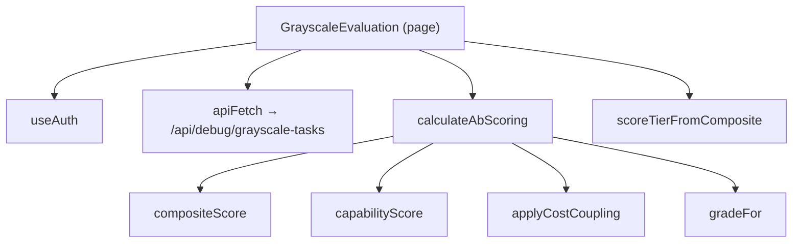
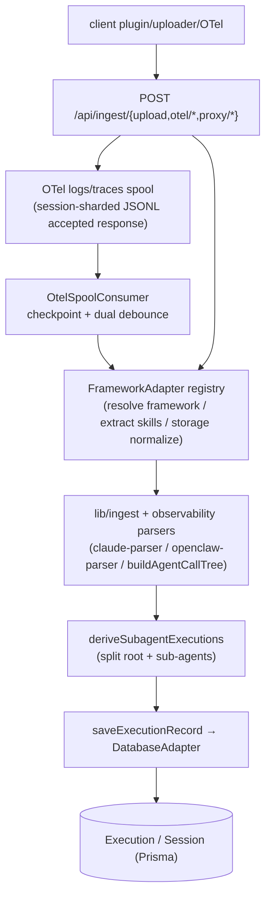
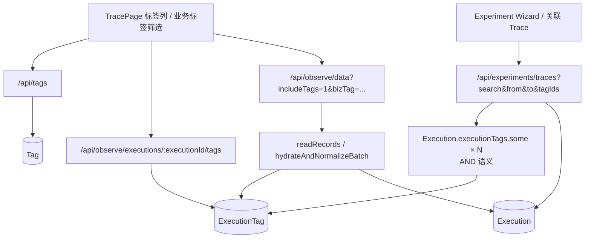
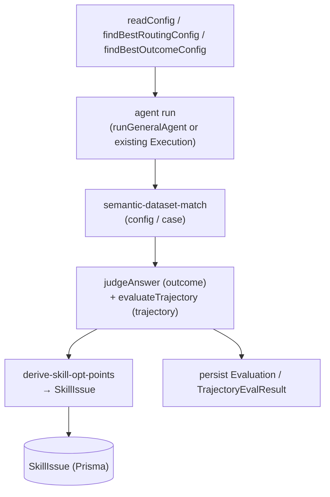
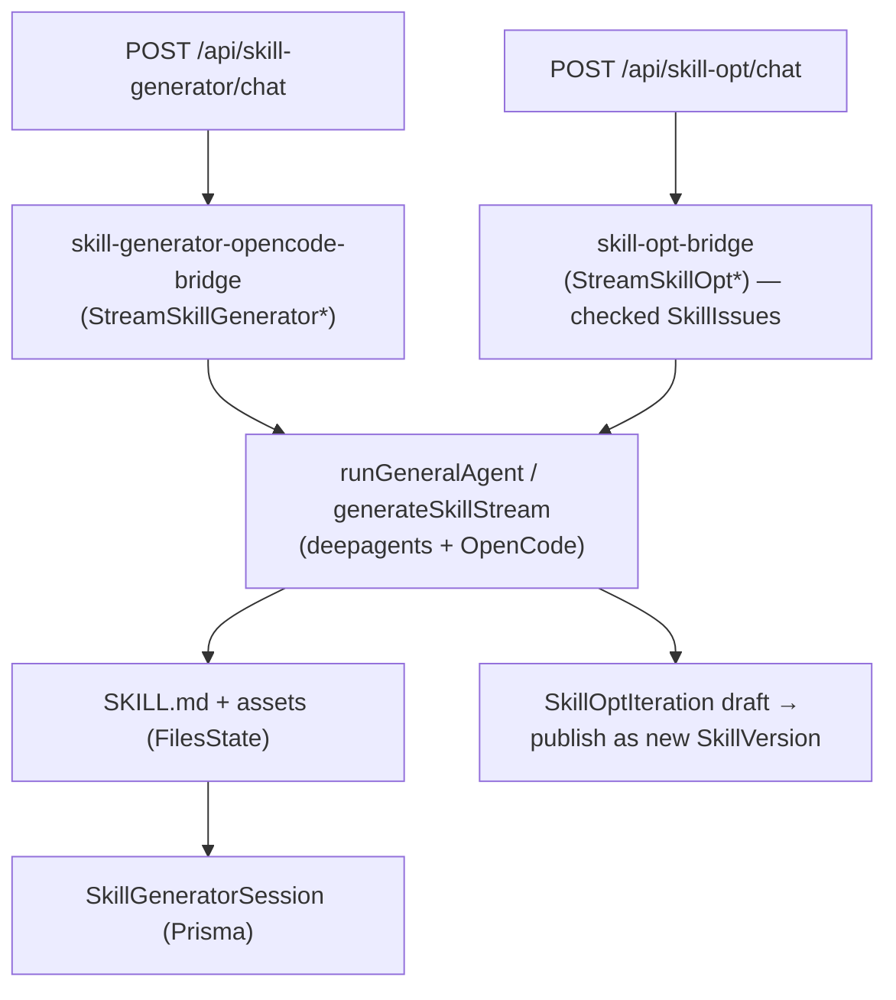

# 数据与控制流

> 两个视角：（1）分析器从页面/组件入口点出发，沿 React 调用图追踪出的前端流程；（2）从 API 路由处理器和引擎入口函数重建出的后端流水线。前端追踪使用真实的调用边；后端流水线则是从入口点 + 调用图与命名推导而来（确切的内部调用边可能有所不同——在需要时请核对源码）。

## Entry points
| Entry | File | Kind |
|---|---|---|
| `POST` ingest upload | `src/app/api/ingest/upload/route.ts` | HTTP |
| `POST/OPTIONS` OTel | `src/app/api/ingest/otel/v1/{logs,metrics,traces}/route.ts` | HTTP |
| `POST` agent run/stream | `src/app/api/agent/{run,stream}/route.ts` | HTTP |
| `POST` trajectory eval | `src/app/api/eval/trajectory/run/route.ts` | HTTP |
| `GET` experiment Trace candidates | `src/app/api/experiments/traces/route.ts` | HTTP |
| `POST` grayscale tasks | `src/app/api/debug/grayscale-tasks/[taskId]/route.ts` | HTTP |
| `POST` skill-generator chat | `src/app/api/skill-generator/chat/route.ts` | HTTP |
| `POST` skill-opt chat | `src/app/api/skill-opt/chat/route.ts` | HTTP |
| `POST` fault diagnosis | `src/app/api/fault/diagnosis/stream/route.ts` | HTTP |
| `Claude Code OTel logs` | `src/app/api/ingest/setup/route.ts` | 客户端 OTel 配置 |
| `WittySkillInsightOtelPlugin` | `scripts/opencode_plugin_otel.ts` | 客户端插件 |

## 前端流程（分析器追踪）
静态分析器从 10 个页面/组件入口出发跟踪调用边。其中最大的几个：

| Entry | File | Modules touched | Project fns |
|---|---|---|---|
| `Dashboard` | `components/eval/Dashboard.tsx` | components, lib, app | 47 |
| `GrayscaleEvaluation` | `app/(main)/skill-eval/grayscale/page.tsx` | app, lib | 30 |
| `PlaygroundPage` | `app/(main)/skill-generator/page.tsx` | app, lib | 12 |
| `TrajectoryEvalCenter` | `components/eval/TrajectoryEvalCenter.tsx` | components, lib | 34 |
| `AgentTraceView` | `components/observe/AgentTraceView.tsx` | components, lib, scripts, app | 37 |
| `BatchEvaluation` | `app/(main)/skill-eval/_batch/page.tsx` | app, lib, components | 6 |
| `SkillOptimizePage` | `app/(main)/skill-opt/[name]/[version]/page.tsx` | app, lib | 7 |
| `AgentDatasetCenter` | `components/AgentDatasetCenter.tsx` | components, lib | 22 |

通用形态：页面/组件拉取 context hooks（`useAuth`、`useLocale`、`useTheme`），调用 `apiFetch`（`src/lib/client/api.ts`）请求某个路由处理器，然后运行本地的纯转换函数（评分/格式化辅助函数，如 `compositeScore`、`calculateAbScoring`、`formatTokens`、`normalizeConfig*`）。示例——A/B（灰度）页面：

Version Analysis reuses the same `Tag` / `ExecutionTag` tables. `/api/observe/version-analysis/compare` returns a de-duplicated global `summary`, per-version aggregates, and question facets; user, agent, framework, time-window, and root-only filters apply globally. `questionKey` only narrows the per-version comparison data for single-question drilldown. `/api/observe/version-analysis/tags/:tagId/traces` returns trace details for one version tag and uses the same global filters except the comparison question drilldown.

## 后端流水线：接入（agent run → Execution 记录）

Hermes setup 现在安装仓库内置的 `scripts/hermes_agent_insight_plugin.py`，运行时目录为 `$HERMES_HOME/plugins/agent_insight_hermes/`。插件直接消费 Hermes lifecycle hooks，用 Python 标准库为每个已完成 span 生成 OTLP/HTTP JSON delta payload；LLM/API/tool/subagent spans 共用 root trace，并通过 `hermes.session_id`、`hermes.parent_session_id`、`hermes.root_session_id` 保留归属；root span 还会写入 `hermes.profile.name` 和 `hermes.agent.name`，profile 名优先从 Hermes 运行态 `HERMES_HOME` 的 `profiles/<name>` 路径推断；active profile 为 `default` 时聚合成 `hermes`，其他 profile 聚合成同名 root `Execution.agentName`。每个 delta payload 先原子写到 `~/.agent-insight/data/hermes-otel-spool/`，成功上报后删除，retryable failure 按指数退避；服务端 OTel trace spool 按 session 累积事件，聚合时重读该 session 已收到的全部 span，再用当前聚合快照替换存储记录。状态日志写入 `~/.agent-insight/logs/hermes-plugin.log`。平台 Hermes trace adapter 将 child interactions 标为 `role=subagent`，随后复用 `buildAgentCallTree` 与 `deriveSubagentExecutions`；child Execution 投影 self-only 的结果、模型、token、latency、调用统计和 skill，root 继续表示整棵 trace 总量。setup 只管理 `agent_insight_hermes`，不会更改 `hermes_otel` 等其他插件的启用状态或配置。OpenCode 式原生事件/snapshot API 保留为 exporter 备用方案，当前不新增第二条后端写入链路。
客户端 agent（OpenCode 插件 + uploader、Claude Code 官方 OTel logs、CodeAgent 同名 OTel wrapper、Hermes `agent_insight_hermes` 插件、LlamaIndex `agent_insight_llamaindex`、OpenClaw watcher、OTel SDK、Langfuse Python SDK）将运行数据推送到接入路由。平台将原始 session 规范化为一棵 `Execution` 树。Claude Code 的 `tool_result` log 只包含工具名、输入和结果大小等 metadata；工具输出正文从 raw API request body 的 `tool_result` blocks 回填，因此安装脚本将 `OTEL_LOG_RAW_API_BODIES` 配成 `file:<dir>`，避免 inline `1` 模式被 Claude Code 截断到 60 KB。Hermes 插件注册 `api_request_error`，并优先消费 Hermes 规范化后的 assistant message，同时兼容 choices/output/candidates 文本结构。OTel `logs` / `traces` 是异步摄取：HTTP 端点只负责解码、校验、归一化、写 JSONL spool 并返回已受理；`OtelSpoolConsumer` 再按 checkpoint 增量消费。traces 从 `src/lib/ingest/otel/{normalize,spool,aggregate}.ts` 进入 `adapter-registry.ts`。Langfuse LangGraph adapter 同时生成兼容评测的 interactions 与逐 observation 的无损 `langfuseTraceNodes`，后者按 spanId 合并保存；仅在 Langfuse Session 上，前端把可见 observation 投影成原有 `AgentTraceView` 的 Agent 和事件节点。业务 chain/span 以 CHAIN 类型保留 `displayParentSpanId` 层级；折叠已知 LangGraph 包装层时，其子节点提升到最近可见父节点，原始 `parentSpanId` 与正文仍保存在事实层。LlamaIndex adapter 按 `agent.instance.id` 和父 Span 恢复 Agent 所有者，去除 `achat → chat → complete` 等包装 Span，并把 Tool、Retriever、Synthesizer 与 Workflow step 转为统一 Interaction。Hermes adapter 重建 `spanId` / `parentSpanId` 树，generic adapter 处理其他标准 OTel traces；Claude logs 专属聚合仍留在 `claude-otel`。CodeAgent setup 在 Unix 安装 `~/.agent-insight/bin/codeagent` 并通过 shell profile 前置其目录，在 Windows 安装 `%USERPROFILE%\.agent-insight\bin\codeagent.cmd` + `codeagent-wrapper.ps1` 并前置持久化的用户级 PATH；两端包装器运行时都从排除自身目录后的 PATH 动态解析真实 CodeAgent，并以安装时记录的路径兜底，因此继承 PATH 的 Shell、PowerShell、CMD、Python、Node 等非交互子进程能获得同一套 OTel 环境且不会递归调用包装器。CodeAgent 通过 `service.name=CodeAgentOC` 分流：Logs 进入 `codeagent-otel` 独立聚合器，Traces/Metrics 返回 accepted 后在规范化和持久化前丢弃；聚合器根据 `query_source` 识别 `extract_memories` 和 `auto_dream`，并按其独立 `execution.agent_run_id` 排除整组后台记忆事件，原始 spool 不删除，正常子 Agent 不受影响；非 Langfuse 路径不读写 `langfuseTraceNodes`。

OTel spool 新写入按 day + session 分片：ClaudeCode logs 使用 `otel_data/claude/YYYY-MM-DD/sessions/<safe-session>/logs.jsonl`，CodeAgent logs 使用 `otel_data/codeagent/YYYY-MM-DD/sessions/<safe-session>/logs.jsonl`，Hermes/通用 traces 使用 `otel_data/traces/YYYY-MM-DD/sessions/<safe-session>/traces.jsonl`。Consumer 递归发现 JSONL shard，并继续兼容旧的 `YYYY-MM-DD/logs.jsonl` / `YYYY-MM-DD/traces.jsonl` 日文件。

关键函数：接入路由处理器（`processUploadAsync`、`proxyFetch`、OTel `POST`）→ CodeAgent logs 的 `codeagent-otel/{detect,spool,aggregator}.ts` → `otel-consumer/sources.ts`，或 OTel traces 路由的 `decodeOtlpRequest` → `otel/normalize.ts:normalizeOtlpTraces` + `otel/spool.ts:appendOtelTraceEvents` → `otel-consumer/consumer.ts:startOtelSpoolConsumer` / `runOtelSpoolConsumerTick` → `otel/aggregate.ts:aggregateOtelTraceEvents` → `otel/adapter-registry.ts:getOtelTraceAdapter` → `otel/adapters/{llamaindex,langfuse-langgraph,hermes,generic}.ts` → `ingest/adapters/registry.ts:getAdapter` / `storage/data-service.ts:extractInvokedSkillsFromSessionInteractions` → `agent-trace.ts:buildAgentCallTree` → `storage/data-service.ts:saveExecutionRecord` / `deriveSubagentExecutions`。OTel trace adapter 负责 transport-normalized span 到 `ExecutionRecord` 的纯转换，FrameworkAdapter 负责框架能力、skill 抽取和存储合并策略，两者都不直接写库。

## 后端流水线：Trace 标签
Trace 用户标签分为版本标签和业务标签。标签定义写入 `Tag`，Trace 绑定写入 `ExecutionTag`；系统标签不持久化为 `Tag`，由前端根据 `Execution` 派生。`GET/POST /api/tags` 与 `PUT/DELETE /api/tags/[id]` 维护标签定义；`GET/PUT/POST/DELETE /api/observe/executions/[executionId]/tags` 维护单条 Trace 的绑定。`GET /api/observe/data?includeTags=1` 在 `readRecords` 批量 hydrate 阶段通过 `getTraceTagsByExecutionIds` 附加 `ExecutionRecord.userTags`；`bizTag=<tagId>` 会先经 `ExecutionTag` 反查 executionId，再与其它 where 条件取交集。Trace 列表默认将 `isSubagent=false` 作为独立的层级硬约束；Skill、标签等内容过滤不得放开它，只有显式 `includeSubagents`、`onlySubagents` 或按 task/parent 下钻才改变层级范围。`facet=tags&kind=business` 返回业务标签及使用次数，供 Trace 页快捷筛选。实验向导的 `GET /api/experiments/traces` 同时接受版本标签与业务标签，并为每个所选标签生成一个带用户与标签类型约束的 `Execution.executionTags.some` 关系条件；这些条件以 AND 合并，再与 Agent、root-only、文本和时间条件一起进入 Prisma 分页查询。

### OTel Ingest 数据流

OpenClaw、LlamaIndex 及其他 OTLP 客户端通过 `POST /api/ingest/otel/v1/traces` 上报 trace。LlamaIndex 客户端先经官方兼容 Handler、隔离 Provider、自定义非阻塞 exporter 和客户端持久 spool；服务端接收后的通用流程如下：

1. 从 `x-witty-api-key` Header 解析身份（关联 Workspace）
2. 按 Content-Type 选择解码路径：`application/x-protobuf` 经 `decodeOtlpProtobuf` 解码，`application/json` 直接 JSON parse
3. 调用 `normalizeOtlpTraces`，按来源选择 LlamaIndex 等专用 normalizer 或通用归一化路径
4. `appendOtelTraceEvents` 将 events 写入 JSONL spool（指定目录，按 session/trace 分片）
5. 返回 `{ status: 'accepted', received, sessions }`，不阻塞

Logs 经由 `POST /api/ingest/otel/v1/logs`（仅 JSON），流程同上（`normalizeClaudeOtlpLogs` + `appendClaudeOtelEvents`）。

后台 `OtelSpoolConsumer`（`startOtelSpoolConsumer` / `runOtelSpoolConsumerTick`）按 checkpoint 增量消费 spool：
- **短 debounce**（`OTEL_CONSUMER_SHORT_MS`，默认 3s）：有数据时快速落库
- **长 debounce**（`OTEL_CONSUMER_LONG_MS`，默认 30s）：静默后触发评估

消费流程调用 `getAdapter(framework)` 确定解析器后，依次执行 `buildAgentCallTree`（构建 Span 树）、`deriveSubagentExecutions`（拆分父子 Execution）、`saveExecutionRecord`（持久化到 Prisma）。

OTLP 属性契约详见 [09-otlp-attribute-contract.md](09-otlp-attribute-contract.md)。

## 后端流水线：评测（Config → Execution → Decision）
数据集 `Config` 提供真值；将执行记录进行匹配并评分；结果转化为 `Evaluation` + `SkillIssue` 行。

入口路由：`eval/config/*`、`eval/trajectory/run`、`eval/rejudge`、`debug/batch-tasks/*`、`debug/grayscale-tasks/*`（A/B 经由 `ab-scoring.ts`）。引擎：`evaluation/judge.ts:judgeAnswer`、`trajectory-evaluator.ts:evaluateTrajectory`、`semantic-dataset-match.ts`、`derive-skill-opt-points.ts`、`result-artifact-extractor.ts`。轨迹评测的实际 trace 证据由 `trace-summarizer.ts` 基于 `Session.interactions` 生成事件级步骤；`ExecutionMatch.extractedSteps` 仍用于 Skill 流程对齐/可视化缓存，不作为轨迹评测唯一输入。任务完成度与轨迹质量的直连预置评估器会在 `model.invoke` 前后采集同一次调用的开始/完成时间，`evaluator-execution-recorder.ts` 将这组边界同时写入 assistant `timeInfo`、`Execution.timestamp/latency` 和 `Session.startTime/endTime`。结果评测会在运行前按轨迹评测同口径解析 trace 关联 Skill（含 `execution.skill` fallback）并写入 `rawAnalysis.resultSkillMode`；`no-skill` 分支不生成 Skill 归因、改进建议或 `SkillIssue`。任务完成度评测的 `rawAnalysis.key_point_findings` 负责关键观点覆盖与等权算分；`rawAnalysis.result_issues` 单独承载关键观点之外的事实错误、编造内容、冗余或格式问题，只作为可归因的动态优化点输入，不直接参与任务完成度分数。

### 质量监控与评测中心边界

上传、proxy end 与 `OtelSpoolConsumer` 只负责 trace 落库和既有的流程/失败分析，不调度结果评估器，也不写 `TraceEvaluation`。质量监控的 `collectTraces → buildProblemSummary → scoreDimensions → bucketTrends` 只读取 `Execution`、`Session`、轨迹分析、问题和诊断数据，聚合过程、成本与错误三维。

最终答案的准确性、答案质量、忠实度和指令遵循属于评测中心。用户主动运行实验后，`run-experiment.ts` 将四个结果类预置 evaluator id 分发到 `experiment/result-preset-evaluators.ts`，后者惰性加载 `evaluation/result-metric-evaluator.ts` 及各叶子评估器，并将结果写入 `ExperimentEvalResult`。这条链路不由 trace 上传触发，也不向质量监控回写结果分。

## 后端流水线：Skill 生成与优化

引擎：`engine/skill-generation/index.ts:generateSkill*`、`general-agent/runner.ts:runGeneralAgent`、`lib/skill-generator-opencode-bridge.ts`、`lib/skill-opt-bridge.ts`。静态合规检查：`engine/skill-issues/static-evaluator/index.ts:runStaticEvaluation`。

## 后端流水线：故障诊断
`POST /api/fault/diagnosis/stream` 从某个 session/Execution 构建上下文，读取 AgentDebug 上游分析结果并以流式方式回答追问。上游分析由观测页触发：`POST /api/observe/executions/:executionId/agent-debug` 将 `AgentDebugReport` 写成 `running` 后启动 Node 进程内后台任务，任务完成后将 `AgentDebugReportPayload` 持久化到 `AgentDebugReport`；`POST /api/observe/executions/:executionId/agent-debug/skills-analysis` 同样将 `AgentDebugSkillsAnalysis` 写成 `running` 后独立启动 Skills 步骤核验，完成后持久化到 `AgentDebugSkillsAnalysis`。前端 `components/observe/AgentDebugCard.tsx` 会并行触发两条链路，分别轮询 `/agent-debug` 和 `/agent-debug/skills-analysis`，任一结果完成后独立刷新对应区块。后台任务使用 `interactionsHash` 做条件写入，避免旧任务晚完成后覆盖新结果；进程内 active map 用于防重复启动和识别服务重启后的失活 `running`。故障追问上下文读取主诊断报告和新 Skills 分析缓存，不读取旧 `reportJson.skillsAnalysis`。
统一 `agent-debug-diagnosis` Skill 承载三条路线：一键诊断运行 AgentDebug 五模块和全部适用专项诊断器；普通追问保持现有上下文问答；定向查因只在用户症状命中诊断器清单时调用对应专项诊断器，不启动五模块。专项诊断器位于 `skills/agent-debug-diagnosis/detectors/<name>/`，每个目录通过自己的 `detector.json` 自注册，公共 `scripts/detector_runner.py` 扫描、匹配和执行；服务端不维护诊断器名称注册表，也不运行专项诊断器。

一键诊断只启动一次 `fault-diagnosis-agent`。同一个 Agent 先根据 Trace、静态检测和五模块规程生成 `.agent-insight/agent-debug-core.json`，再调用 Skill-local runner 生成 `.agent-insight/agent-debug-detectors.json`，随后由该 Agent 基于真实证据完成通用富化、语义查重和关联，并直接写出 `.agent-insight/agent-debug-final.json`。重复结果进入目标 core finding 的 `supplementalEvidence`，独立结果进入 `detectorFindings`；冻结 core 字段和专项 `facts`、`anchors`、`details` 由 `agentdebug_validate.py --core --detectors` 确定性校验。服务端只准备输入与 trace bundle、启动 Agent、标准化并持久化最终报告、转发流式事件。

AgentDebug 主诊断后端只向诊断 Agent 提供执行元数据、turn/node/artifact 数量和输入、静态、trace bundle 文件路径，不再把长 turn 摘要嵌入提示词。Skill 依次运行 `agentdebug_static.py` 全量拆分与静态检测、`agentdebug_inspect.py` 生成五模块候选信号并执行有界的 `tail/range/search/repeated-calls` 查询，再由 Agent 补充语义问题和 Phase 2；`agentdebug_validate.py --static` 校验最终报告未删除静态 step、issue 或 Phase 1 证据。超过 4000 字符的节点输入/输出由 trace bundle 外置为 artifact，查询脚本只返回完整 artifact 中的命中片段。

## 跨模块流程说明
每条后端流水线都跨越 `app`（路由）→ `lib`（引擎/存储），并经常涉及 `prompts`（LLM 模板）和 `server`（Prisma 仓库）。`lib ↔ server` 循环（见 [01-architecture.md](01-architecture.md#layering--pattern)）意味着存储辅助函数与仓库会相互调用；应将它们视为同一个持久化核心。

## 后端流水线：Trace Bundle 回放

```mermaid
flowchart LR
    detail["Trace 详情导出"] --> exportApi["GET /api/observe/traces/export"]
    exportApi --> resolveRoot["定位根 Execution + 全部子 Agent"]
    resolveRoot --> bundle["Trace Bundle v1 JSON"]
    bundle --> importApi["POST /api/observe/traces/import"]
    importApi --> validate["大小 / 版本 / 树结构校验"]
    validate --> collision["Execution + task ID 冲突检测"]
    collision --> remap["仅重映射冲突 ID 与内部引用"]
    remap --> persist["按父节点优先写 Execution / Session"]
    persist --> skills["重算 ExecutionSkill，不触发 LLM 评测"]
```

实现入口为 `src/lib/trace-transfer.ts`（Bundle 校验、排序与 ID 重映射）和 `src/lib/trace-transfer-service.ts`（所有权、完整树查询、持久化与失败清理）。Session 的 `interactions` 随树迁移；Langfuse Session 同时迁移完整 `langfuseTraceNodes`，冲突重映射只改其中的 `subagentSessionId`，保留 OTel trace/span 父子标识。导入目标 user 始终取当前请求身份，不信任 Bundle 中的来源用户。任一节点写入或 Skill 重算失败时，服务会清理本次已创建的 Session 与 Execution，避免保留可见的半棵树。
