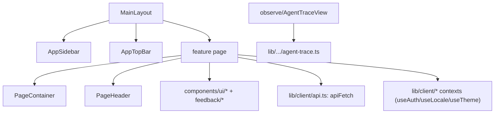

# Frontend

> 框架：Next.js 16 App Router + React 19（RSC + 客户端组件）。样式：Tailwind CSS 4，在 `src/app/globals.css` 中带有一套令牌系统；基础组件构建于 Radix UI 之上。状态：React Context（`src/lib/client/*`）+ Zustand + 经由 `nuqs` 的 URL 状态。Agent 聊天 UI：assistant-ui（`src/providers/*`）。数据获取：`apiFetch`（`src/lib/client/api.ts`）请求应用自身的 API 路由。

## 路由
App Router。页面位于 `src/app` 下。主仪表盘位于 `(main)` 路由组中（共享的 `MainLayout` 在 `src/app/(main)/layout.tsx`）；认证页与独立的详情视图位于顶层。

| Route | Page component (file) | Purpose |
|---|---|---|
| `/` | `Home` (`src/app/page.tsx`) | 落地页 / 重定向 |
| `/login` | `LoginPage` (`src/app/login/page.tsx`) | 邮箱登录 |
| `/(main)/dashboard` | `DashboardPage` (`(main)/dashboard/page.tsx`) | 概览：健康度、趋势、RAS 可靠性、性能、模型/工具/Agent/编排监控 |
| `/(main)/quickstart` | `QuickstartPage` (`(main)/quickstart/page.tsx`) | 五阶段推荐使用路径与现有模块入口 |
| `/(main)/agents` | `AgentsPage` (`(main)/agents/page.tsx`) | 已注册/已观测的 agents |
| `/(main)/trace` | `TracePage` (`(main)/trace/page.tsx`) | trace 列表 + 详情；列表由服务端过滤、排序和数据库分页，详情先加载轻量 interaction 结构并按需读取完整内容；支持标签、列筛选、跨页多选，并通过统一的 `TraceBackflowDialog` 单条或批量回流到评测数据集 |
| `/(main)/fault` | `FaultPage` (`(main)/fault/page.tsx`) | 故障诊断 |
| `/(main)/dataset`, `/(main)/dataset/[id]` | `DatasetPage`, `DatasetDataItemsRoutePage` | 评测数据集；列表读取不含 cases 的摘要视图，编辑和详情再按需加载完整记录；详情页按字段 schema 渲染动态列，支持新增字段和逐条编辑字段值 |
| `/(main)/eval`, `/(main)/eval/run/[runId]`, `/(main)/eval/trajectory/*` | `EvalPage`, `RunDetailPage`, `TrajectoryDetailPage`/`TrajectoryTracePage` | 评测运行与轨迹视图 |
| `/(main)/skill-eval`, `/(main)/skill-eval/grayscale`, `/(main)/skill-eval/trigger/[skillName]`, `/(main)/skill-eval/_batch` | `SkillAnalysisPage`, `GrayscalePage`, `SkillEvalTriggerPage`, `BatchEvaluation` | Skill 分析：静态、A/B、触发、批量 |
| `/(main)/skill-generator` | `PlaygroundPage` (`(main)/skill-generator/page.tsx`) | Skill 生成 playground |
| `/(main)/skill-opt`, `/(main)/skill-opt/[name]/[version]` | `SkillOptListPage`, `SkillOptimizePage` | Skill 优化 + 历史 |
| `/(main)/skills`, `/(main)/skill-workbench` | `SkillsPage`, `SkillWorkbenchPreviewPage` | 正式 Skill 对话工作台与兼容别名 |
| `/(main)/config/skills` | `SkillsPage` management mode | Skill 管理中心；复用旧资产管理主体，隐藏旧顶部页签 |
| `/(main)/metrics`, `/(main)/metrics/evaluators/[id]` | `MetricsPage`, `CustomEvaluatorDetailPage` | 指标与自定义评测器 |
| `/(main)/modelconfig`, `/(main)/modelconfig/registry`, `/(main)/modelconfig/web-search` | `ModelConfigPage`, `ModelRegistryPage`, `WebSearchConfigPage` | 模型注册表与搜索配置 |
| `/(main)/accessconfig`, `/(main)/accessconfig/{install,health,channels,webhooks}` | `AccessConfigPage`, `AccessInstallPage`, … | 客户端安装 / 接入访问 |
| `/(main)/{quality,security,memory,optapi,evaluation/[id]}` | `QualityPage`, `SecurityPage`, `MemoryPage`, `OptApiPage`, `EvaluationDetailPage` | 其他仪表盘 |
| `/details`, `/skill-detail` | `DetailPage`, `SkillDetailPage` | 可分享的详情视图 |

API 路由处理器位于其旁的 `src/app/api/**/route.ts` 下——见 [03-file-map.md](03-file-map.md#api-routes-srcappapi--grouped)。

仪表盘按页签懒加载数据。`/api/fleet/trends` 提供常驻健康总览和系统趋势；`/api/fleet/reliability` 将窗口内 root Execution 与 `RasAnomalyEvent` 按 taskId 关联，支持 `platform` / `agent` 筛选并返回 RAS KPI、趋势、恢复结果、最高 severity 分布、故障模式、Agent 聚合和近期故障 Trace。无 RAS anomaly 的 Trace 按无故障统计；只有 recoveryOutcome=success 才算已恢复。接口同时返回单独标注来源的 Execution/Judge 失败补充，不把它们并入 RAS KPI。`/api/fleet/breakdowns` 的 `performance` 字段只承载端到端时延、上下文峰值和慢 Trace，其余 model/tool/agent/orchestration 契约保持不变。

> **注意**：上表是「磁盘上存在的页面」全集；其中一部分**未挂载到侧边栏导航**（见下一节）。新增页面时，路由文件存在 ≠ 用户可达。

## 导航信息架构（功能模块）
侧边栏是产品的**功能模块入口**。语义配置的权威定义在 `src/components/shell/sidebar-navigation.ts`，`AppSidebar.tsx` 通过原有 `NavTree` 渲染，显示文案在 `src/locales/{zh,en}.ts` 的 `nav.*`。以下是默认完整模式的统一模块树；评测演示模式在同一棵树中过滤入口，见文末“NH 演示模式与原 UI 复用”。

```
仪表盘                         → /dashboard
快速开始                       → /quickstart
运行观测 (groupObserve)
├─ Agent 概览                  → /agents
├─ 链路追踪                     → /trace
├─ 版本分析                     → /version-analysis
└─ 推理基础设施                 → /infra
评估与实验 (evalCenter)
├─ 实验                         → /experiments
├─ 评测数据集                   → /dataset
└─ 评估器                       → /metrics
诊断分析                       → /fault
持续优化 (groupSkills)
└─ Skill 工作台                → /skills
配置 (configGroup)
├─ Skill 管理中心              → /config/skills
├─ 模型注册                     → /modelconfig/registry
├─ 联网搜索                     → /modelconfig/web-search
└─ 客户端安装                   → /accessconfig/install
```

Skill 在持续优化分组中只有一个正式入口，进入统一对话工作台。旧 `SkillWorkspaceTabs` 和 `/skill-generator`、`/skill-eval`、`/skill-opt` 页面继续保留兼容；带 `openSkillId` 的旧 `/skills` 深链接仍进入管理模式。

版本能力在侧边栏中只有“版本分析”一个入口。`VersionWorkspaceTabs` 在 `/version-analysis` 与 `/version-management` 顶部提供“版本分析 / 版本管理”页签；进入管理页签时，侧边栏仍保持“版本分析”激活。

**显示名 ↔ 路由的非直觉映射**（改导航或写文档时易踩坑）：

| 侧边栏显示名 | 实际路由 | 备注 |
|---|---|---|
| 诊断分析 | `/fault` | 复用既有智能诊断页，非独立 `/diagnosis` |
| 评估器 | `/metrics` | 评测器中心（`MetricsPage` + `metrics/evaluators/[id]`） |
| Skill | `/skills` | 对话工作台；会话固定 Skill、推进工作版本，右侧选择器可旁路浏览其他资产 |
| Skill 管理中心 | `/config/skills` | 原 SkillHub 资产列表与版本管理 |
| 客户端安装 | `/accessconfig/install` | 客户端接入分发 |

**导航可达性矩阵**——磁盘存在的页面分三类：

| 状态 | 路由 | 说明 |
|---|---|---|
| ✅ 侧边栏直达 | `/dashboard` `/quickstart` `/agents` `/trace` `/version-analysis` `/infra` `/experiments` `/dataset` `/metrics` `/fault` `/skills` `/config/skills` `/modelconfig/registry` `/modelconfig/web-search` `/accessconfig/install` | `/version-analysis` 是版本能力统一入口；`/skills` 为工作台，`/config/skills` 为长期资产管理 |
| 🔁 页签或页面内可达 | `/version-management`、`/skill-generator` `/skill-eval` `/skill-opt`、`/skill-history` `/skill-detail`、`/details`、`/skill-opt/[name]/[version]` 等子路由 | 由版本/Skill 页签或父页面跳转，无独立 nav 项 |
| 🚫 存在但未挂导航 | `/skill-workbench` `/quality` `/eval` `/memory` `/optapi` `/security` `/skill-release` `/modelconfig`(index) `/accessconfig/{channels,webhooks,health}` | `/skill-workbench` 是 `/skills` 的兼容别名；其余源码保留，但当前信息架构不提供侧边栏入口 |

> 折叠状态：`AppSidebar` 默认展开运行观测、评估与实验、持续优化和配置，并在路由命中时自动展开对应祖先。

## 组件组织
组件按功能与可复用基础组件进行分组（`src/components/`）：
- **应用外壳** — `shell/{AppSidebar,AppTopBar,PageContainer,PageHeader,providers}.tsx`。页面在 `<PageContainer>` 内渲染（左对齐、全幅——不要手写居中）。
- **评测** — `eval/*`（`Dashboard`、`SkillEvaluation`、`TrajectoryEvalCenter`、`EvaluationRunDetailView`、`ExecutionRecordsTable`、`EvaluatorFindingsView`）以及 `evaluation/*`（`EvaluationContent`、`EvaluationFindings`）。
- **可观测性** — `observe/{AgentTraceView,TraceDrawer,AgentDebugCard,VersionWorkspaceTabs}.tsx`（trace 树由 `buildAgentCallTree` 渲染）。Trace 列表主体在 `app/(main)/trace/page.tsx`，列宽存 `trace.columnWidths.v1`，列显隐存 `trace.columnVisibility.v1`；用户标签列默认显示，系统标签列默认隐藏；隐藏用户标签列后，操作列不再提供标签编辑入口。筛选栏的用户标签下拉支持版本/业务标签混合多选，按类型及名称前缀聚类；前缀作为无框行标题，标签以可换行的胶囊横向排列。多个标签使用 AND 语义并写入 `tagIds` URL 参数。`version-workspace-navigation.ts` 定义版本分析与版本管理两个页签的路由归属；页面分别位于 `app/(main)/version-analysis/page.tsx` 与 `app/(main)/version-management/page.tsx`。
- **Skills** — `skills/*`（`SkillCatalogV2`、`SkillDiagnosis`、`SkillRegistry`、`SkillWorkspaceTabs`）、`skill-generator/*`；`skill-workspace-navigation.ts` 定义四个页签的路由归属。
- **Skill 工作台** — `skill-workbench/*` 通过 `/api/skill-workbench` 与 `/api/skill-management` BFF 编排旧引擎。`SkillWorkbenchShell` 把顶部 `Skill + version` 作为右栏资产上下文，详情、正式评估、实验和优化记录都跟随版本切换；正式评估和实验不要求或创建过程会话，顶部切换也不会改变左侧过程会话。生成/优化会话只保存过程，未发布草稿仍由 `sessionId` 隔离；当前过程会话同时写入 `/skills?sessionId=...`，初始化、历史选择、新建以及浏览器前进后退都以该参数为准，无效 ID 不回退最近会话。同一过程会话进入优化后，`OptimizationConversation` 在原单滚动区内先投影 `GenerationHistory`，再展示各轮优化消息与原位结果卡，不创建第二个输入框或嵌套滚动区；发布导致 `source` 变更也不会隐藏生成消息。`GenerationConversation` 与 `OptimizationConversation` 复用 `ConversationProcessDisclosure` 渲染思考和工具过程：状态行默认折叠，展开后分别显示完整思考文本或限高可滚动的命令结果，运行、成功和失败状态只使用共享设计令牌。左侧 Copilot 宽度由可拖拽分隔条控制并写入浏览器本地存储；历史会话由带文字的顶部按钮控制，并以临时浮层覆盖在对话区上方，不参与布局宽度计算；点击遮罩、选择会话、新建对话或按 `Escape` 后收起。历史列表使用独立滚动容器，消息块对任意长文本强制断行。生成完成会选中草稿并打开详情，发布后再切换为正式资产。生成/优化 SSE 只是发起页的低延迟投影；服务端为当前 Agent 消息串行合并 checkpoint，最终 flush 完成后才提交任务终态。其他页面通过同源通知快速发现任务，并以 1 秒运行轮询、4 秒空闲轮询从服务端追赶，同源通知不承载正文且不是数据真源。优化候选发布或放弃后会广播 `optimization-record-changed`，旁观页立即从服务端重载会话、记录与版本目录；空闲轮询还会比较记录的 `id/status/publishedVersion/updatedAt` 指纹作为漏通知兜底。优化流首次收到 `verify_progress` 或 `verify_ok` 时，会串行持久化任务第 3 步“执行质量校验”，使刷新页和旁观页使用与发起页相同的阶段真值。固定“Skill 优化”动作先调用 `/api/skill-opt/plan` 聚合全部未解决问题，再把 `planId` 交给旧优化 bridge；归并计划、编辑范围保护、结构/脚本真值/行为三层自验证和 repair 事件都会投影并持久化到 `OptimizationConversation`。每次优化运行先创建稳定 `runId/taskId/recordId`，并把同一个不可见 `optimization_meta` block 写入触发它的用户消息和对应 Agent 消息；时间线只按这组结构化标识在每轮问题下原位渲染进度、候选摘要和操作按钮，不再按创建时间推测。缺少标识的存量记录独立标为“未关联的历史优化记录”。候选随后执行快照静态质量规则；界面将优化执行失败、候选质量未通过和候选已发布分开显示，避免跨轮状态混淆。`OptimizationRecordsPanel` 使用记录列表 + 报告详情布局，以 `vN → vN+1` 展示顶部所选基线版本的记录、Monaco 行级 diff、来源会话、阻断问题以及修复、放弃和发布动作；质量规则通过后可从左侧卡片或右侧报告直接发布下一版本，Skill 实验不再提供新建候选复测入口。发布确认使用站内模态框；发布后工作台切换到新正式版本，同时创建新基线的优化会话并复制可见消息历史，旧优化会话及旧 plan 保留为审计边界。`StaticEvaluationPanel` 将评估器执行状态与质量门禁状态分开显示；`ExperimentPanel` 内嵌同一 `ExperimentWizard`，Skill 实验按当前用户、Skill 与版本过滤；创建页与 `SkillExperimentResult` 都通过 `useEvaluatorLookup` 使用评估器注册表中的 canonical 名称，冻结快照只保存稳定 ID，存量快照展示时同样按注册表解析。A/B 结果由 `ab-comparison.ts` 按 Case 交集配对聚合，只有两侧均有综合分的 Case 才进入组均分、胜负统计和逐评估器双色分解；单侧结果归入未配对。`SkillExperimentResult` 对 A/B 展示双组综合分和胜负筛选的配对表；运行中只显示固定进度与单条明细，顶部双组均分、评估器聚合条和胜负结论保持占位，全部执行和结果行收敛后再一次发布。表格每侧只聚合综合、结果、轨迹三类得分，长文本默认两行截断并可点击展开，明细容器同时提供横向与纵向滚动，数据集顶层 `expectedOutput` 会映射为参考输出。A/B 每侧的详情入口通过执行 taskId 映射回 backing `ExperimentCase`，复用标准 `ExperimentCaseDetail`，重试则复用灰度任务的单侧重评能力；重评期间保留上一版稳定分。触发分析与用例分析继续使用带纵向滚动的单组详情。所有详情始终留在工作台右侧；全局实验仍保留原路由与导航。样式仅使用共享令牌。
- **Skill 会话与资产上下文** — 会话固定 `skillName`，并在本会话发布成功后推进 `workVersion`；历史任务仍记录各轮精确基线。历史浮层直接展示 `skillName + workVersion`，长名称复用 `TruncateText` 做单行省略与完整名称提示。顶部 `Skill + version` 控制右栏四个页签，即使与会话版本不一致也可查看和运行正式评估、实验并查看该基线的优化记录。左侧空会话的管理中心入口通过 session context BFF 完成首次绑定；点击历史会话、生成或优化入口会恢复/切换到其精确工作版本。
- **数据集 / 评测器** — `AgentDatasetCenter.tsx`、`DatasetItemsPage.tsx`、`EvaluatorsCenter.tsx`。可靠性数据集详情在“数据项”旁显示“故障模式说明”页签；`fault-mode-guide.ts` 按当前数据项中的 `fault_injection_type + submode` 分组，结合 `/api/reliability/fault-modes` 的逻辑摘要、子模式说明和注入方式渲染四列表格，目录缺失时回退 Case 快照。逻辑说明独立维护在 `src/lib/reliability/fault-mode-copy.ts`，不修改或参与解析 `SKILL.md`。非可靠性数据集不显示该页签。内置可靠性数据集显示“只读”标记，禁用信息编辑、新增字段、批量导入、单条增删改；公开 PATCH 同时执行服务端只读校验。
- **实验向导与生成重试** — `app/(main)/experiments/new/page.tsx` 使用“实验设计 → Trace 来源 → 预期答案 → 评估器与执行”四步结构。第 ① 步的 Agent 来自 `/api/experiments/agents`：用户归属历史 Trace Agent 与在线客户端可执行 Agent 按名称合并，普通生成 target 还必须声明可返回 Trace ID；停留在该步时每 10 秒刷新候选，窗口重新聚焦时立即刷新，刷新失败保留上一版列表与当前选择。Skill 触发分析只展示当前 Skill 的触发数据集，用例分析与 A/B 展示全部非触发数据集并标注跨 Skill 来源。第 ② 步在 `existing` / `generate` 间切换：已有 Trace 路径继续通过 `/api/experiments/traces` 服务端分页；生成路径从 Agent target 选择 `workerId + platform + host`，模型只读取该 target 上报的列表，Case 使用独立 `selectedGenerated` Map，并将每条数据集 Case 的 input 作为 Agent 用户输入。第 ③ 步为已有 Trace 导入数据集标注时，以“规范化后的 Trace 输入包含数据集输入”为命中条件；多条命中优先最长输入，并同时回填预期答案和 Tool/Skill 上下文。生成路径会直接带入所选数据集的这些字段，可靠性数据集额外带入 FI 元数据。第 ④ 步对非触发实验展示全部 ready 的非触发预置与自建评估器；可靠性专用、参考答案和 Tool/Skill 目录要求通过置灰门控说明，不再通过预设白名单隐藏。“开始实验”串行完成 create 与 run，run body 通过 `fiOrchestrate` 显式区分 FI 与通用 Trace 生成，成功后才进入详情。详情页在自动重试期间显示当前 Attempt 次数；最终 Trace 失败与评估失败共用 Case 操作列的“重试”按钮，由 Case 级 API 决定重新生成还是重评。筛选不持久化为监听规则，监听运行时仍会拒绝系统归属 Agent 的新 Trace。
- **实验结果** — `app/(main)/experiments/page.tsx` 展示 API 返回的 `overallScore`。RAS 与通用评估器统一走 `detail-agg.ts::overallAverage`，按评估成功且有分的评估器生效总分（`humanScore ?? score`）求平均。Trace 评测详情把机器/人工生效分标记为“总分”，并对旧、新 RAS 与轨迹质量 evaluator id 隐藏卡级结构化 evidence 摘要，只保留评分点证据与建议；详情容器、证据文本和评分点表格限制在右栏宽度内，表格不足时只在自身横向滚动。详情页是纯状态/结果视图；`draft` 只作为 create → run 的内部瞬时状态，列表 API 不返回它，启动失败时创建页通过 draft-only DELETE 补偿回滚。运行中的实验通过轮询自动刷新进度。
- **聊天 / agent UI** — `thread/*`、`chat/*`、`ai-elements/*`，通过 `src/providers/{Stream,Thread}.tsx` 中的 assistant-ui providers 接线。
- **基础组件（复用，不要重建）** — `ui/*`（button、card、dialog、select、switch……）、`feedback/{EmptyState,ErrorState,StatusBadge}.tsx`、`text/*`（`MetricValue`、`RelativeTime`、`TruncateText`）、`SmartViewer/*`。

组件关系（典型组合）：


## i18n、主题、状态
- **语言**：`src/locales/{en,zh}.ts` + `LocaleContext`（`lib/client/locale-context.tsx`，`useLocale().t(key)`）。产品为双语（中文/英文）。
- **主题**：`lib/client/theme-context.tsx`（`useTheme`、`useThemeColors`）；令牌在 `src/app/globals.css` 中一次性定义（`:root` + `[data-theme='dark']`）。
- **认证**：`lib/auth/auth-context.tsx`（`useAuth`）统一消费服务端 `login_mode`，区分本地登录、历史组织集成和 IDaaS OAuth 登录；IDaaS callback 由 `/callback`（兼容 `/api/auth/idaas-oauth/callback`）完成；可选地区限制先按 UUID 查询人员信息并失败关闭，放行后才映射本地用户。API Key 恢复也会复查地区；登录页分别展示地区不可用与地区校验失败。侧边栏在三种登录模式下均渲染通用退出入口；退出仅清除浏览器本地认证状态，不调用 IDaaS 单点登出。

## 构建与开发
- **开发**：`npm run dev`（或 `bash scripts/restart_dev.sh`——项目规范的开发启动方式）。端口 3000。
- **构建**：`npm run build`（`next build`）。**启动**：`npm run start`。
- **根布局 / 启动**：`src/app/layout.tsx`（`RootLayout`）；OpenTelemetry 在 `src/instrumentation.ts` / `instrumentation-node.ts` 中注册。

### 2026-09-09 NH 演示模式与原 UI 复用

`src/lib/evaluation-harness/demo-profile.ts` 以 `process.env.NEXT_PUBLIC_EVALUATION_DEMO === 'true'` 判断演示模式，未设置或设为其他值时使用完整模式。该公开环境变量由 Next.js 在构建时写入前端产物；演示构建需显式设置为 `true`，改变已构建服务的运行环境不会重新生成另一种界面。`MainLayout` 只在演示模式限制未纳入演示的页面显示，原路由、组件、API 和历史数据保留。此开关是界面呈现配置，不代替服务端权限校验。

`getSidebarNavigation(showUsage, evaluationDemo)` 先生成原完整导航，再按演示入口集合过滤叶子节点、去掉空分组。保留节点沿用原 `labelKey`、图标、匹配路径、顺序和父子关系，由同一个 `NavTree` 渲染和管理折叠；不再使用“评测工作 / 评测资源 / 系统设置”三个常显分组。演示保留仪表盘、运行观测下的 Agent 概览与版本分析、评估与实验下的实验/评测数据集/评估器，以及配置下的模型注册。Trace 从实验 Case 内进入，侧栏不单列。

页面复用边界如下：

| 页面 | 复用方式与演示扩展 |
|---|---|
| 评测数据集 | `/dataset` 继续渲染 `AgentDatasetCenter`。可选 `evaluationOnly` 只影响数据来源和相关操作的显示；版本资产通过 `datasetCards` 适配为原卡片数据，沿用搜索、列表/卡片及操作布局。默认模式继续加载原数据集，不删除原创建、导入或管理逻辑。 |
| 评估器 | `/metrics` 保留原页面外壳。`VersionedEvaluatorsCenter` 将版本资产适配为 `EvaluatorCard`，通过 `EvaluatorsCenter` 的可选 `dataSource` 注入预置/自建卡片、版本选择和发布动作；复用原页签、搜索、卡片/列表及 `EvaluatorDetailModal`。编辑与公共/私有连接使用 `ui/Dialog`、`Input`、`Select`、`Textarea`。不传数据源时继续使用原获取、创建、持久化、删除和详情路径；演示不传旧删除回调，也不展示无效执行入口。 |
| 新建实验 | 原 `ExperimentWizard` 与演示编排组件共用步骤条以及 `ExperimentWizardLayout` 中的标题、面板、字段和前进/后退操作布局。演示保留四类版本与单变量 A/B 契约，第二步为“选择 Case”；原 Trace 来源流程保留在完整模式。共享 UI 不包含演示白名单。 |
| Agent 概览 | 原目录页和 `DemoTargets` 共用 `agents/AgentDirectory` 的目录布局、卡片、筛选及按钮。演示卡片适配外部 Agent/Skill 版本目录，详情增加定义查看与静态检查；检查报告绑定 `targetId`，不同对象或版本不会混用结果。 |
| 仪表盘 | `DemoOverview` 只提供评测目录数据，交给原 `DashboardPage` 的可选 `evaluation` 数据入口；沿用原标题、布局和统计组件，只显示演示有关的评测概况。 |
| Trace | `/trace` 继续使用原页面、详情与 `AgentTraceView` 执行树；演示从实验 Case 定位执行记录，补充实验关联，条件隐藏无关导入、标签、诊断和评论操作。原 Trace 列表和完整操作代码保留。 |

版本资产适配、版本选择、对比评测和共享组件属于可迁移的能力扩展；入口白名单、演示默认值及不相关元素的隐藏属于演示配置。后续向 `master` 迁移时按这两类拆分，优先保留能力与原组件的可选扩展点，不携带演示筛选或把原页面替换成专用演示页。隐藏功能不以删除源码、路由或数据代替。

NH Trace 在挂载原详情前通过 `trace-access.ts` 校验当前账号归属；切换账号或 Trace 时旧授权即时失效。`AgentTraceView` 对 evaluation-harness 记录用 `trace-evidence.ts` 按 `tool_call_id` 关联独立工具返回，单条懒加载同时补齐关联消息并保留原索引。原 Skills 卡片追加执行端确认的加载定义、外部版本和指纹；它们不计为 Skill 工具调用。`showInfra` 默认为 true，演示调用传 false，仅隐藏基础设施页签。

2026-09-10：版本趋势在原 `VersionExperiments` 内为每张图显示保存的实验配置（模型、脱敏地址、Case 范围、并发、超时、重试、门槛、Trace 来源，以及需要时的附加评估器和评分连接）。`buildDemoVersionView` 同时保留组内全部记录和去重后的有效评分点，用统一编号关联下方实验表；未完成记录可关联已有同配置图，但不成为评分点。Case 范围按分组选择、Trace 关联、显式选择、完整评测集的顺序解析；省略 Case 选择和显式全选统一归为完整集。缺失参数显示未记录；评分连接仅显示当前视图编号，地址查询参数不展示，同名地址的不同参数配置用编号区分。无 API 或数据模型变更。

实验详情继续复用原 `ExperimentDetail`。版本化对比的 Case 区域使用可选 `ExperimentCaseComparisonTable`，以服务端 `comparisonKey` 归为一行，各结果指标下并列 A/B；单组与原生 `ComparisonDetail` 路径不变。`case-comparison-view.ts` 复用 `caseScore` 按组评估器计算生效分，只有 `shared` 记录复用执行到两列，未知分组独立提示。Case 页数用 `casePairTotal`，执行数量仍来自 `caseTotal`；详情链接保留实际 Case ID，共用 Trace 的评估器对比进入同一评估详情。
