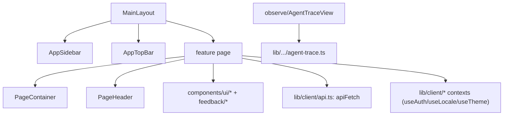

# Frontend

> 框架：Next.js 16 App Router + React 19（RSC + 客户端组件）。样式：Tailwind CSS 4，在 `src/app/globals.css` 中带有一套令牌系统；基础组件构建于 Radix UI 之上。状态：React Context（`src/lib/client/*`）+ Zustand + 经由 `nuqs` 的 URL 状态。Agent 聊天 UI：assistant-ui（`src/providers/*`）。数据获取：`apiFetch`（`src/lib/client/api.ts`）请求应用自身的 API 路由。

## 路由
App Router。页面位于 `src/app` 下。主仪表盘位于 `(main)` 路由组中（共享的 `MainLayout` 在 `src/app/(main)/layout.tsx`）；认证页与独立的详情视图位于顶层。

| Route | Page component (file) | Purpose |
|---|---|---|
| `/` | `Home` (`src/app/page.tsx`) | 落地页 / 重定向 |
| `/login` | `LoginPage` (`src/app/login/page.tsx`) | 邮箱登录 |
| `/(main)/dashboard` | `DashboardPage` (`(main)/dashboard/page.tsx`) | 概览：健康度、趋势、告警、agents |
| `/(main)/agents` | `AgentsPage` (`(main)/agents/page.tsx`) | 已注册/已观测的 agents |
| `/(main)/trace` | `TracePage` (`(main)/trace/page.tsx`) | trace 列表 + 详情；列表由服务端过滤、排序和数据库分页，详情先加载轻量 interaction 结构并按需读取完整内容；支持标签、列筛选、跨页多选，并通过统一的 `TraceBackflowDialog` 单条或批量回流到评测数据集 |
| `/(main)/fault` | `FaultPage` (`(main)/fault/page.tsx`) | 故障诊断 |
| `/(main)/dataset`, `/(main)/dataset/[id]` | `DatasetPage`, `DatasetDataItemsRoutePage` | 评测数据集；详情页按字段 schema 渲染动态列，支持新增字段和逐条编辑字段值 |
| `/(main)/eval`, `/(main)/eval/run/[runId]`, `/(main)/eval/trajectory/*` | `EvalPage`, `RunDetailPage`, `TrajectoryDetailPage`/`TrajectoryTracePage` | 评测运行与轨迹视图 |
| `/(main)/skill-eval`, `/(main)/skill-eval/grayscale`, `/(main)/skill-eval/trigger/[skillName]`, `/(main)/skill-eval/_batch` | `SkillAnalysisPage`, `GrayscalePage`, `SkillEvalTriggerPage`, `BatchEvaluation` | Skill 分析：静态、A/B、触发、批量 |
| `/(main)/skill-generator` | `PlaygroundPage` (`(main)/skill-generator/page.tsx`) | Skill 生成 playground |
| `/(main)/skill-opt`, `/(main)/skill-opt/[name]/[version]` | `SkillOptListPage`, `SkillOptimizePage` | Skill 优化 + 历史 |
| `/(main)/skill-history`, `/(main)/skill-release`, `/(main)/skills` | `SkillHistoryPage`, `SkillReleasePage`, `SkillsPage` | Skill 生命周期 |
| `/(main)/metrics`, `/(main)/metrics/evaluators/[id]` | `MetricsPage`, `CustomEvaluatorDetailPage` | 指标与自定义评测器 |
| `/(main)/modelconfig`, `/(main)/modelconfig/registry`, `/(main)/modelconfig/web-search` | `ModelConfigPage`, `ModelRegistryPage`, `WebSearchConfigPage` | 模型注册表与搜索配置 |
| `/(main)/accessconfig`, `/(main)/accessconfig/{install,health,channels,webhooks}` | `AccessConfigPage`, `AccessInstallPage`, … | 客户端安装 / 接入访问 |
| `/(main)/{quality,security,memory,optapi,evaluation/[id]}` | `QualityPage`, `SecurityPage`, `MemoryPage`, `OptApiPage`, `EvaluationDetailPage` | 其他仪表盘 |
| `/details`, `/skill-detail` | `DetailPage`, `SkillDetailPage` | 可分享的详情视图 |

API 路由处理器位于其旁的 `src/app/api/**/route.ts` 下——见 [03-file-map.md](03-file-map.md#api-routes-srcappapi--grouped)。

> **注意**：上表是「磁盘上存在的页面」全集；其中一部分**未挂载到侧边栏导航**（见下一节）。新增页面时，路由文件存在 ≠ 用户可达。

## 导航信息架构（功能模块）
侧边栏是产品的**功能模块入口**，权威定义在 `src/components/shell/AppSidebar.tsx`（`GROUPS = [AGENT_GROUP, CONFIG_GROUP]`），显示文案在 `src/locales/{zh,en}.ts` 的 `nav.*`。两个一级分组、若干可折叠子树：

```
AGENT WORKSPACE  (nav.groupAgentWorkspace)
├─ 概览                 → /dashboard
├─ Agent 管理           → /agents
├─ 运行观测 (groupObserve)
│  ├─ 链路追踪           → /trace   (matchPrefixes: /trace, /details)
│  ├─ 版本分析           → /version-analysis
│  ├─ 智能诊断           → /fault
│  ├─ 质量监控           → /quality
│  └─ 推理 Infra         → /infra
├─ 评测中心 (evalCenter)
│  ├─ 评测数据集         → /dataset
│  ├─ 评估器             → /metrics
│  ├─ 评测执行           → /eval
│  └─ (记忆评估 → /memory) 代码注释掉，未暴露
└─ Skills 能力 (groupSkills)
   ├─ Skills Hub        → /skills   (matchPrefixes: /skills, /skill-history, /skill-detail)
   ├─ Skills 生成        → /skill-generator
   ├─ Skills 评测        → /skill-eval
   └─ Skills 优化        → /skill-opt

配置  (nav.configGroup)
├─ 模型注册             → /modelconfig/registry
├─ 联网搜索             → /modelconfig/web-search
├─ 版本管理             → /version-management
└─ 安装指导             → /accessconfig/install
   (接入通道/Webhook/健康检查 → /accessconfig/{channels,webhooks,health}) 代码注释掉，"后端能力未稳定"
```

**显示名 ↔ 路由的非直觉映射**（改导航或写文档时易踩坑）：

| 侧边栏显示名 | 实际路由 | 备注 |
|---|---|---|
| 智能诊断 | `/fault` | 故障诊断页，非独立 `/diagnosis` |
| 评估器 | `/metrics` | 评测器中心（`MetricsPage` + `metrics/evaluators/[id]`） |
| Skills Hub | `/skills` | Skill 目录 |
| 安装指导 | `/accessconfig/install` | 客户端接入分发 |

**导航可达性矩阵**——磁盘存在的页面分三类：

| 状态 | 路由 | 说明 |
|---|---|---|
| ✅ 导航可达 | `/dashboard` `/agents` `/trace` `/fault` `/quality` `/dataset` `/metrics` `/eval` `/skills` `/skill-generator` `/skill-eval` `/skill-opt` `/modelconfig/registry` `/modelconfig/web-search` `/accessconfig/install` | 侧边栏直达；`/quality` 的 `QualityPage` 含 `ResultPanel` 结果明细 |
| 🔁 间接可达 | `/skill-history` `/skill-detail`（经 Skills Hub）、`/details`（经链路追踪）、`/eval/run/[runId]`、`/skill-opt/[name]/[version]` 等子路由 | 由父页面跳转，无独立 nav 项 |
| 🚫 存在但未挂导航 | `/memory` `/optapi` `/security` `/skill-release` `/modelconfig`(index) `/accessconfig/{channels,webhooks,health}` | nav 中注释或未引用；多为半成品/已下线，源码保留 |

> 折叠状态：`AppSidebar` 默认展开 `['skills','eval-center','observe']` 三棵子树（`useState` 初值），并在路由命中时自动展开对应祖先。

## 组件组织
组件按功能与可复用基础组件进行分组（`src/components/`）：
- **应用外壳** — `shell/{AppSidebar,AppTopBar,PageContainer,PageHeader,providers}.tsx`。页面在 `<PageContainer>` 内渲染（左对齐、全幅——不要手写居中）。
- **评测** — `eval/*`（`Dashboard`、`SkillEvaluation`、`TrajectoryEvalCenter`、`EvaluationRunDetailView`、`ExecutionRecordsTable`、`EvaluatorFindingsView`）以及 `evaluation/*`（`EvaluationContent`、`EvaluationFindings`）。
- **可观测性** — `observe/{AgentTraceView,TraceDrawer,AgentDebugCard}.tsx`（trace 树由 `buildAgentCallTree` 渲染）。Trace 列表主体在 `app/(main)/trace/page.tsx`，列宽存 `trace.columnWidths.v1`，列显隐存 `trace.columnVisibility.v1`；用户标签列默认显示，系统标签列默认隐藏；隐藏用户标签列后，操作列不再提供标签编辑入口。Version Analysis page: `app/(main)/version-analysis/page.tsx`; Version Management page: `app/(main)/version-management/page.tsx`。
- **Skills** — `skills/*`（`SkillCatalogV2`、`SkillDiagnosis`、`SkillRegistry`）、`skill-generator/*`。
- **数据集 / 评测器** — `AgentDatasetCenter.tsx`、`DatasetItemsPage.tsx`、`EvaluatorsCenter.tsx`。
- **实验向导** — `app/(main)/experiments/new/page.tsx` 的第 ② 步通过 `/api/experiments/traces` 服务端分页选择 root Trace；搜索同时匹配 `Execution.id`、`taskId` 与 `query`，时间支持预设窗口和自定义起止时间，用户标签多选使用 AND 语义。筛选栏下方的独立已选区读取跨页 `selected` Map，支持单条移除和全部清空；筛选状态不清空跨页已选 case，跨页全选沿用当前筛选参数并受 500 条上限保护。这些筛选不持久化为监听模式规则。
- **聊天 / agent UI** — `thread/*`、`chat/*`、`ai-elements/*`，通过 `src/providers/{Stream,Thread}.tsx` 中的 assistant-ui providers 接线。
- **基础组件（复用，不要重建）** — `ui/*`（button、card、dialog、select、switch……）、`feedback/{EmptyState,ErrorState,StatusBadge}.tsx`、`text/*`（`MetricValue`、`RelativeTime`、`TruncateText`）、`SmartViewer/*`。

组件关系（典型组合）：


## i18n、主题、状态
- **语言**：`src/locales/{en,zh}.ts` + `LocaleContext`（`lib/client/locale-context.tsx`，`useLocale().t(key)`）。产品为双语（中文/英文）。
- **主题**：`lib/client/theme-context.tsx`（`useTheme`、`useThemeColors`）；令牌在 `src/app/globals.css` 中一次性定义（`:root` + `[data-theme='dark']`）。
- **认证**：`lib/auth/auth-context.tsx`（`useAuth`）；API key 存储于客户端，经由 `apiFetch` 发送。

## 构建与开发
- **开发**：`npm run dev`（或 `bash scripts/restart_dev.sh`——项目规范的开发启动方式）。端口 3000。
- **构建**：`npm run build`（`next build`）。**启动**：`npm run start`。
- **根布局 / 启动**：`src/app/layout.tsx`（`RootLayout`）；OpenTelemetry 在 `src/instrumentation.ts` / `instrumentation-node.ts` 中注册。
