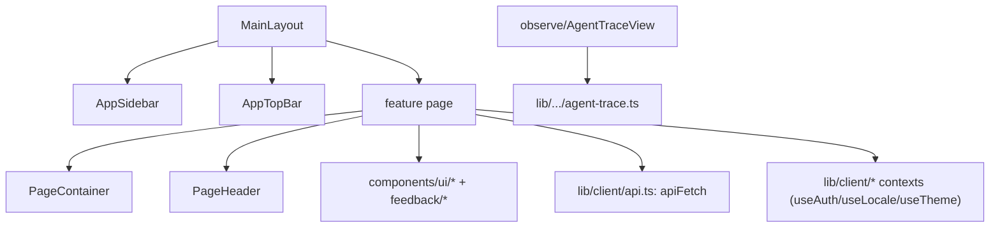

# Frontend

> 框架：Next.js 16 App Router + React 19（RSC + 客户端组件）。样式：Tailwind CSS 4，在 `src/app/globals.css` 中带有一套令牌系统；基础组件构建于 Radix UI 之上。状态：React Context（`src/lib/client/*`）+ Zustand + 经由 `nuqs` 的 URL 状态。Agent 聊天 UI：assistant-ui（`src/providers/*`）。数据获取：`apiFetch`（`src/lib/client/api.ts`）请求应用自身的 API 路由。

## 路由
App Router。页面位于 `src/app` 下。主仪表盘位于 `(main)` 路由组中（共享的 `MainLayout` 在 `src/app/(main)/layout.tsx`）；认证页与独立的详情视图位于顶层。

| Route | Page component (file) | Purpose |
|---|---|---|
| `/` | `Home` (`src/app/page.tsx`) | 落地页 / 重定向 |
| `/login` | `LoginPage` (`src/app/login/page.tsx`) | 邮箱登录 |
| `/(main)/dashboard` | `DashboardPage` (`(main)/dashboard/page.tsx`) | 概览：健康度、趋势、告警、agents |
| `/(main)/quickstart` | `QuickstartPage` (`(main)/quickstart/page.tsx`) | 五阶段推荐使用路径与现有模块入口 |
| `/(main)/agents` | `AgentsPage` (`(main)/agents/page.tsx`) | 已注册/已观测的 agents |
| `/(main)/trace` | `TracePage` (`(main)/trace/page.tsx`) | trace 列表 + 详情；列表由服务端过滤、排序和数据库分页，详情先加载轻量 interaction 结构并按需读取完整内容；支持标签、列筛选、跨页多选，并通过统一的 `TraceBackflowDialog` 单条或批量回流到评测数据集 |
| `/(main)/fault` | `FaultPage` (`(main)/fault/page.tsx`) | 故障诊断 |
| `/(main)/dataset`, `/(main)/dataset/[id]` | `DatasetPage`, `DatasetDataItemsRoutePage` | 评测数据集；列表读取不含 cases 的摘要视图，编辑和详情再按需加载完整记录；详情页按字段 schema 渲染动态列，支持新增字段和逐条编辑字段值 |
| `/(main)/eval`, `/(main)/eval/run/[runId]`, `/(main)/eval/trajectory/*` | `EvalPage`, `RunDetailPage`, `TrajectoryDetailPage`/`TrajectoryTracePage` | 评测运行与轨迹视图 |
| `/(main)/skill-eval`, `/(main)/skill-eval/grayscale`, `/(main)/skill-eval/trigger/[skillName]`, `/(main)/skill-eval/_batch` | `SkillAnalysisPage`, `GrayscalePage`, `SkillEvalTriggerPage`, `BatchEvaluation` | Skill 分析：静态、A/B、触发、批量 |
| `/(main)/skill-generator` | `PlaygroundPage` (`(main)/skill-generator/page.tsx`) | Skill 生成 playground |
| `/(main)/skill-opt`, `/(main)/skill-opt/[name]/[version]` | `SkillOptListPage`, `SkillOptimizePage` | Skill 优化 + 历史 |
| `/(main)/skills`, `/(main)/skill-workbench` | `SkillsPage`, `SkillWorkbenchPreviewPage` | 正式 Skill 对话工作台与兼容别名 |
| `/(main)/config/skills` | `SkillsPage` management mode | Skill 管理中心；复用旧资产管理主体，隐藏旧顶部页签 |
| `/(main)/metrics`, `/(main)/metrics/evaluators/[id]` | `MetricsPage`, `CustomEvaluatorDetailPage` | 指标与自定义评测器 |
| `/(main)/modelconfig`, `/(main)/modelconfig/registry`, `/(main)/modelconfig/web-search` | `ModelConfigPage`, `ModelRegistryPage`, `WebSearchConfigPage` | 模型注册表与搜索配置 |
| `/(main)/accessconfig`, `/(main)/accessconfig/{install,health,channels,webhooks}` | `AccessConfigPage`, `AccessInstallPage`, … | 客户端安装 / 接入访问 |
| `/(main)/{quality,security,memory,optapi,evaluation/[id]}` | `QualityPage`, `SecurityPage`, `MemoryPage`, `OptApiPage`, `EvaluationDetailPage` | 其他仪表盘 |
| `/details`, `/skill-detail` | `DetailPage`, `SkillDetailPage` | 可分享的详情视图 |

API 路由处理器位于其旁的 `src/app/api/**/route.ts` 下——见 [03-file-map.md](03-file-map.md#api-routes-srcappapi--grouped)。

> **注意**：上表是「磁盘上存在的页面」全集；其中一部分**未挂载到侧边栏导航**（见下一节）。新增页面时，路由文件存在 ≠ 用户可达。

## 导航信息架构（功能模块）
侧边栏是产品的**功能模块入口**。语义配置的权威定义在 `src/components/shell/sidebar-navigation.ts`，`AppSidebar.tsx` 只负责渲染，显示文案在 `src/locales/{zh,en}.ts` 的 `nav.*`。当前结构为统一模块树：

```
仪表盘                         → /dashboard
快速开始                       → /quickstart
运行观测 (groupObserve)
├─ Agent 概览                  → /agents
├─ 链路追踪                     → /trace
└─ 推理基础设施                 → /infra
评估与实验 (evalCenter)
├─ 实验                         → /experiments
├─ 评测数据集                   → /dataset
└─ 评估器                       → /metrics
诊断分析                       → /fault
持续优化 (groupSkills)
└─ Skill 工作台                → /skills
配置 (configGroup)
├─ Skill 管理中心              → /config/skills
├─ 模型注册                     → /modelconfig/registry
├─ 联网搜索                     → /modelconfig/web-search
└─ 客户端安装                   → /accessconfig/install
```

Skill 在持续优化分组中只有一个正式入口，进入统一对话工作台。旧 `SkillWorkspaceTabs` 和 `/skill-generator`、`/skill-eval`、`/skill-opt` 页面继续保留兼容；带 `openSkillId` 的旧 `/skills` 深链接仍进入管理模式。

**显示名 ↔ 路由的非直觉映射**（改导航或写文档时易踩坑）：

| 侧边栏显示名 | 实际路由 | 备注 |
|---|---|---|
| 诊断分析 | `/fault` | 复用既有智能诊断页，非独立 `/diagnosis` |
| 评估器 | `/metrics` | 评测器中心（`MetricsPage` + `metrics/evaluators/[id]`） |
| Skill | `/skills` | 统一对话工作台；生成、评估、实验、优化、复测和发布共享会话上下文 |
| Skill 管理中心 | `/config/skills` | 原 SkillHub 资产列表与版本管理 |
| 客户端安装 | `/accessconfig/install` | 客户端接入分发 |

**导航可达性矩阵**——磁盘存在的页面分三类：

| 状态 | 路由 | 说明 |
|---|---|---|
| ✅ 侧边栏直达 | `/dashboard` `/quickstart` `/agents` `/trace` `/infra` `/experiments` `/dataset` `/metrics` `/fault` `/skills` `/config/skills` `/modelconfig/registry` `/modelconfig/web-search` `/accessconfig/install` | `/skills` 为工作台，`/config/skills` 为长期资产管理 |
| 🔁 页签或页面内可达 | `/skill-generator` `/skill-eval` `/skill-opt`、`/skill-history` `/skill-detail`、`/details`、`/skill-opt/[name]/[version]` 等子路由 | 由 Skill 页签或父页面跳转，无独立 nav 项 |
| 🚫 存在但未挂导航 | `/skill-workbench` `/version-analysis` `/quality` `/eval` `/version-management` `/memory` `/optapi` `/security` `/skill-release` `/modelconfig`(index) `/accessconfig/{channels,webhooks,health}` | `/skill-workbench` 是 `/skills` 的兼容别名；其余源码保留，但当前信息架构不提供侧边栏入口 |

> 折叠状态：`AppSidebar` 默认展开运行观测、评估与实验、持续优化和配置，并在路由命中时自动展开对应祖先。

## 组件组织
组件按功能与可复用基础组件进行分组（`src/components/`）：
- **应用外壳** — `shell/{AppSidebar,AppTopBar,PageContainer,PageHeader,providers}.tsx`。页面在 `<PageContainer>` 内渲染（左对齐、全幅——不要手写居中）。
- **评测** — `eval/*`（`Dashboard`、`SkillEvaluation`、`TrajectoryEvalCenter`、`EvaluationRunDetailView`、`ExecutionRecordsTable`、`EvaluatorFindingsView`）以及 `evaluation/*`（`EvaluationContent`、`EvaluationFindings`）。
- **可观测性** — `observe/{AgentTraceView,TraceDrawer,AgentDebugCard}.tsx`（trace 树由 `buildAgentCallTree` 渲染）。Trace 列表主体在 `app/(main)/trace/page.tsx`，列宽存 `trace.columnWidths.v1`，列显隐存 `trace.columnVisibility.v1`；用户标签列默认显示，系统标签列默认隐藏；隐藏用户标签列后，操作列不再提供标签编辑入口。筛选栏的用户标签下拉支持版本/业务标签混合多选，按类型及名称前缀聚类；前缀作为无框行标题，标签以可换行的胶囊横向排列。多个标签使用 AND 语义并写入 `tagIds` URL 参数。Version Analysis page: `app/(main)/version-analysis/page.tsx`; Version Management page: `app/(main)/version-management/page.tsx`。
- **Skills** — `skills/*`（`SkillCatalogV2`、`SkillDiagnosis`、`SkillRegistry`、`SkillWorkspaceTabs`）、`skill-generator/*`；`skill-workspace-navigation.ts` 定义四个页签的路由归属。
- **Skill 工作台** — `skill-workbench/*` 通过新的 `/api/skill-workbench` 与 `/api/skill-management` BFF 编排旧引擎；`SkillWorkbenchShell` 维护唯一会话上下文，生成/优化 SSE 只是实时投影，离开页面后服务端任务继续执行并在返回时从持久化状态恢复。`StaticEvaluationPanel` 将评估器执行状态与质量门禁状态分开显示，`SkillDetailWorkspace` 读取同一当前文件 hash 的门禁状态；评估中、结果过期或存在 high 时发布按钮禁用，blocked 状态提供显式 AI 修复入口，并把当前问题集自动提交给 `OptimizationConversation`。`ExperimentPanel` 内嵌同一 `ExperimentWizard`，触发/用例/A-B 只通过 Skill 上下文改变默认 Trace 来源、数据集编辑、版本选择和评估器；已有 Trace 走标准 Experiment 评估，生成的触发分析走真实 Skill 路由判定，两条路径都只冻结预置 `skill-trigger-analyzer` 并产出单一「触发准确率」评分点；用例分析加载冻结当前版本并只执行单组，A/B 执行双侧。Skill 实验列表只读取工作台 BFF，不调用全局列表；`SkillExperimentResult` 展示冻结配置、真实触发/配对对比指标和四阶段进度，并通过 `ExperimentDetail.onOpenCase` 在工作台右侧切换内嵌 `ExperimentCaseDetail`，不跳转全局 `/experiments/:id/cases/:caseId`；全局实验仍保留原路由与导航。样式仅使用共享令牌。
- **数据集 / 评测器** — `AgentDatasetCenter.tsx`、`DatasetItemsPage.tsx`、`EvaluatorsCenter.tsx`。
- **实验向导与生成重试** — `app/(main)/experiments/new/page.tsx` 使用“实验设计 → Trace 来源 → 预期答案 → 评估器与执行”四步结构。第 ① 步的 Agent 来自 `/api/experiments/agents`：用户归属历史 Trace Agent 与在线客户端可执行 Agent 按名称合并，普通生成 target 还必须声明可返回 Trace ID；数据集下拉展示全部结果、轨迹和可靠性评测数据集。第 ② 步在 `existing` / `generate` 间切换：已有 Trace 路径继续通过 `/api/experiments/traces` 服务端分页；生成路径从 Agent target 选择 `workerId + platform + host`，模型只读取该 target 上报的列表，Case 使用独立 `selectedGenerated` Map，并将每条数据集 Case 的 input 作为 Agent 用户输入。所有数据集都会带入预期答案和 Tool/Skill 上下文，可靠性数据集额外带入 FI 元数据并只展示故障检测恢复评估器；普通数据集展示通用评估器。“开始实验”串行完成 create 与 run，run body 通过 `fiOrchestrate` 显式区分 FI 与通用 Trace 生成，成功后才进入详情。详情页在自动重试期间显示当前 Attempt 次数；最终 Trace 失败与评估失败共用 Case 操作列的“重试”按钮，由 Case 级 API 决定重新生成还是重评。筛选不持久化为监听规则，监听运行时仍会拒绝系统归属 Agent 的新 Trace。
- **实验结果** — `app/(main)/experiments/page.tsx` 展示 API 返回的 `overallScore`。RAS 与通用评估器统一走 `detail-agg.ts::overallAverage`，按评估成功且有分的评估器生效总分（`humanScore ?? score`）求平均。Trace 评测详情把机器/人工生效分标记为“总分”，并对旧、新 RAS evaluator id 隐藏卡级结构化 evidence 摘要，只保留评分点证据与建议。详情页是纯状态/结果视图；`draft` 只作为 create → run 的内部瞬时状态，列表 API 不返回它，启动失败时创建页通过 draft-only DELETE 补偿回滚。运行中的实验通过轮询自动刷新进度。
- **聊天 / agent UI** — `thread/*`、`chat/*`、`ai-elements/*`，通过 `src/providers/{Stream,Thread}.tsx` 中的 assistant-ui providers 接线。
- **基础组件（复用，不要重建）** — `ui/*`（button、card、dialog、select、switch……）、`feedback/{EmptyState,ErrorState,StatusBadge}.tsx`、`text/*`（`MetricValue`、`RelativeTime`、`TruncateText`）、`SmartViewer/*`。

组件关系（典型组合）：


## i18n、主题、状态
- **语言**：`src/locales/{en,zh}.ts` + `LocaleContext`（`lib/client/locale-context.tsx`，`useLocale().t(key)`）。产品为双语（中文/英文）。
- **主题**：`lib/client/theme-context.tsx`（`useTheme`、`useThemeColors`）；令牌在 `src/app/globals.css` 中一次性定义（`:root` + `[data-theme='dark']`）。
- **认证**：`lib/auth/auth-context.tsx`（`useAuth`）；API key 存储于客户端，经由 `apiFetch` 发送。

## 构建与开发
- **开发**：`npm run dev`（或 `bash scripts/restart_dev.sh`——项目规范的开发启动方式）。端口 3000。
- **构建**：`npm run build`（`next build`）。**启动**：`npm run start`。
- **根布局 / 启动**：`src/app/layout.tsx`（`RootLayout`）；OpenTelemetry 在 `src/instrumentation.ts` / `instrumentation-node.ts` 中注册。
