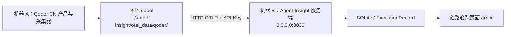

# Qoder CN 采集器跨机器验证手册

## 1. 验证目标

验证 Qoder CN 采集器和 Agent Insight 服务端部署在两台不同机器时，Trace 仍能通过网络正常上传、入库并展示。



本测试至少需要跑通一种 Qoder CN 产品。若要验证四端接入完整性，可依次测试：

- Qoder CN CLI
- Qoder CN Desktop
- Qoder for JetBrains
- Qoder Work CN

## 2. 通过标准

同时满足以下条件，跨机器约束验证通过：

1. 机器 A 与机器 B 是两台不同的主机。
2. 机器 A 可以访问机器 B 的 `3000` 端口。
3. 机器 A 从机器 B 的 `/api/ingest/setup` 下载并安装 Qoder CN 采集器。
4. 机器 A 生成本地隔离 spool 目录和 uploader 进程。
5. 在机器 A 执行带唯一标识的 Qoder CN 任务。
6. 机器 B 的 `/trace` 页面出现该唯一标识对应的 Trace。
7. Trace 的 Agent 名称、状态、调用链和 Token 数据可正常展示。

> 本流程验证的是“跨机器网络上报链路”。“会话结束后上传时间小于 3 秒”等精确性能指标应使用单独的自动化或计时测试验证，不能只根据 UI 的“不到 1 分钟”判断。

## 3. 测试环境

| 项目 | 示例值 | 说明 |
|---|---|---|
| 机器 A | Collector 主机 | 安装并运行 Qoder CN 产品 |
| 机器 B | Server 主机 | 运行 Agent Insight 服务端 |
| 服务端地址 | `http://<SERVER_IP>:3000` | 必须是机器 A 可访问的地址，不能填 `localhost` |
| 功能分支 | `feat/qoder-cn-collector` | 按实际交付分支替换 |
| Node.js | `>= 20` | 两台机器均建议确认 |
| API Key | `<TEMP_API_KEY>` | 从机器 B 的 Agent Insight 安装指导页面取得 |

网络可以是同一局域网、可互通的 VPN 网络或其他路由可达网络。是否开启 VPN 本身不决定成败，以机器 A 的 `Test-NetConnection` 结果为准。

## 4. 机器 B：启动 Agent Insight 服务端

### 4.1 获取测试代码

建议新建独立目录，避免影响机器 B 上其他开发分支：

```powershell
git clone -b feat/qoder-cn-collector https://gitcode.com/wangxin-2026/agent-insight.git agent-insight-qoder-cross-host
Set-Location .\agent-insight-qoder-cross-host
git log -1 --oneline
```

确认输出的分支和提交包含 Qoder CN 采集器代码。本次交付的基线提交为 `3298474`；若分支已有后续修复，使用更新的提交即可。

### 4.2 安装依赖

```powershell
node --version
npm.cmd install
```

若 PowerShell 报 `npm.ps1` 禁止运行脚本，继续使用 `npm.cmd` 和 `npx.cmd`，不需要为了本测试修改系统执行策略。

### 4.3 监听所有网卡并启动服务

```powershell
New-Item -ItemType Directory -Force "$env:USERPROFILE\.agent-insight\data" | Out-Null
npx.cmd next dev -H 0.0.0.0 -p 3000
```

看到类似以下内容表示服务启动成功：

```text
Local:   http://localhost:3000
Network: http://0.0.0.0:3000
Ready
```

保持此终端窗口运行。

> 同一台机器不能同时有两个进程占用 `3000` 端口。不同源码目录默认仍可能复用当前 Windows 用户的 `~/.agent-insight/data/witty_insight.db`，因此页面出现以前的 Trace 是正常现象，不代表跨机器上传失败。验收时应使用唯一测试标识定位新记录。

### 4.4 确认服务端 IP 和监听状态

另开 PowerShell：

```powershell
ipconfig
Get-NetTCPConnection -LocalPort 3000 -State Listen
```

记录机器 A 能访问的 IPv4 地址，例如：

```text
10.x.x.x
```

如果 Windows 防火墙阻止连接，需要由机器 B 的管理员放行 TCP `3000` 入站端口。测试结束后可按团队安全要求移除临时规则。

## 5. 机器 A：验证到服务端的网络连接

将下面的地址替换为机器 B 的实际地址：

```powershell
$serverBase = "http://<SERVER_IP>:3000"
Test-NetConnection <SERVER_IP> -Port 3000
Invoke-WebRequest "$serverBase/trace" -UseBasicParsing
```

必须满足：

- `TcpTestSucceeded : True`
- `Invoke-WebRequest` 返回 HTTP `200`
- 浏览器可以打开 `$serverBase/trace`

若这一步失败，先解决 IP、VPN、路由、防火墙或服务端监听问题，不要继续安装采集器。

## 6. 机器 A：从远程服务端安装 Qoder CN 采集器

### 6.1 推荐：非交互式安装

该命令只选择 `Qoder CN product family`，可以避免误选成 OpenCode：

```powershell
$serverBase = "http://<SERVER_IP>:3000"
$secureKey = Read-Host "输入机器 B 的临时 Agent Insight API Key" -AsSecureString
$apiKey = [System.Net.NetworkCredential]::new("", $secureKey).Password
$encodedKey = [Uri]::EscapeDataString($apiKey)

irm "$serverBase/api/ingest/setup?yes=1&frameworks=qoder&key=$encodedKey" | iex

$apiKey = $null
$encodedKey = $null
$secureKey = $null
```

此命令验证的是导师指定的交互安装入口：

```text
src/app/api/ingest/setup/route.ts
```

### 6.2 可选：验证交互式选择界面

```powershell
$serverBase = "http://<SERVER_IP>:3000"
$secureKey = Read-Host "输入机器 B 的临时 Agent Insight API Key" -AsSecureString
$apiKey = [System.Net.NetworkCredential]::new("", $secureKey).Password
$encodedKey = [Uri]::EscapeDataString($apiKey)

irm "$serverBase/api/ingest/setup?key=$encodedKey" | iex
```

在选择界面中：

1. 使用方向键移动到 `Qoder CN product family`。
2. 按空格选中。
3. 按 Enter 确认。
4. 如果提示发现新的 Host，选择 `y`，将采集目标切换到机器 B。

若输出显示 `集成到：OpenCode`，说明选错了，需要重新执行并选择 Qoder CN。

### 6.3 预期安装结果

安装成功时应输出四组结果：

- `product: cli`
- `product: desktop`
- `product: jetbrains`
- Qoder Work 的安装结果

每组结果应包含 `spoolDir`，并通常包含 `uploaderPid`。目录结构应类似：

```text
~/.agent-insight/otel_data/qoder/
├── cli/<accountHash>/
├── desktop/<accountHash>/
├── jetbrains/<accountHash>/
└── work/<accountHash>/
```

其中 `<accountHash>` 用于 API Key/账号隔离。

> 一键安装会配置共享 Hook、collector 和 uploader，并在安装结果中输出 Desktop VSIX 与 JetBrains ZIP 的服务端下载地址。两个界面插件仍需在对应产品内完成本地安装；只验证跨机器网络上报时，使用 Qoder CN CLI 即可完成最小闭环。

需要验证 Desktop 或 JetBrains 时，在机器 A 浏览器打开安装结果中的地址：

```text
http://<机器B-IP>:3000/api/ingest/setup/qoder-desktop-vsix
http://<机器B-IP>:3000/api/ingest/setup/qoder-jetbrains-plugin
```

- Desktop：在 Qoder CN Desktop 的 Extensions 面板选择 **Install from VSIX**，选择下载的 `.vsix` 后重启。
- JetBrains：进入 **Settings → Plugins → 齿轮 → Install Plugin from Disk**，选择下载的 `.zip` 后重启 IDE。

## 7. 机器 A：检查安装状态

### 7.1 检查远程 Host

以下命令只显示 Host，不打印 API Key：

```powershell
Get-Content "$env:USERPROFILE\.agent-insight\.env" -ErrorAction SilentlyContinue |
    Where-Object { $_ -match '^AGENT_INSIGHT_HOST=' }

Get-Content "$env:USERPROFILE\.agent-insight\config" -ErrorAction SilentlyContinue |
    Where-Object { $_ -match '^AGENT_INSIGHT_HOST=' }
```

输出应指向：

```text
AGENT_INSIGHT_HOST=http://<SERVER_IP>:3000
```

### 7.2 检查 spool 目录

```powershell
Get-ChildItem "$env:USERPROFILE\.agent-insight\otel_data\qoder" -Directory -Recurse |
    Select-Object FullName
```

### 7.3 检查 uploader 进程

```powershell
Get-CimInstance Win32_Process |
    Where-Object { $_.CommandLine -match 'qoder_uploader_client\.mjs' } |
    Select-Object ProcessId, CommandLine
```

至少应看到已安装产品对应的 uploader。安装器还会为当前用户配置 `QODERCN_EXPOSE_TOKEN_USAGE=1`，供 Qoder CN CLI 与 Qoder Work CN 将精确 Token 写入 diagnostics。Windows 可执行以下命令确认：

```powershell
[Environment]::GetEnvironmentVariable("QODERCN_EXPOSE_TOKEN_USAGE", "User")
```

输出应为 `1`。安装后应关闭已有终端和待测试客户端，从新终端重新启动 Qoder CN CLI，或完全退出并重新启动 Qoder Work CN，使新进程继承环境变量和 Hook 配置。

## 8. 执行最小跨机器冒烟测试

### 8.1 推荐先测 Qoder CN CLI

进入任意包含 `package.json` 的测试项目：

```powershell
Get-Command qoderclicn
[Environment]::GetEnvironmentVariable("QODERCN_EXPOSE_TOKEN_USAGE", "User")
Set-Location C:\path\to\test-project
$marker = "cross-machine-qoder-cn-cli-$((Get-Date).ToString('yyyyMMdd-HHmmss'))"
Write-Host $marker
qoderclicn
```

若 `Get-Command qoderclicn` 找不到命令，应先安装 Qoder CN CLI 并确认其 `bin` 目录已经加入 `PATH`。

在 Qoder CN CLI 中提交：

```text
[粘贴上一步生成的 marker] 请只读当前项目的 package.json，返回 name 和 version；不要创建、修改或删除任何文件。
```

得到结果后结束当前会话，以触发会话结束 Hook 和立即上传：

- 优先输入 `/exit`
- 若当前版本不支持 `/exit`，按 `Ctrl+C`

### 8.2 可选：四端完整验证

每端使用不同的唯一标识，避免混淆：

| 产品 | 建议标识 | 操作 |
|---|---|---|
| Qoder CN CLI | `cross-machine-qoder-cn-cli-<时间>` | 在 `qoderclicn` 中执行只读任务 |
| Qoder CN Desktop | `cross-machine-qoder-cn-desktop-<时间>` | Agent 模式读取 `package.json` |
| Qoder for JetBrains | `cross-machine-qoder-jetbrains-<时间>` | Agent 模式读取当前项目 `package.json` |
| Qoder Work CN | `cross-machine-qoder-work-<时间>` | 执行一个只读文档/项目任务 |

通用提示词：

```text
[唯一标识] 请只读当前项目的 package.json，返回 name 和 version；不要创建、修改或删除任何文件。
```

## 9. 机器 B：确认远程 Trace

在机器 B 或任意可访问机器 B 的浏览器中打开：

```text
http://<SERVER_IP>:3000/trace
```

刷新页面并搜索第 8 节生成的唯一标识。检查：

- 执行记录出现在机器 B，而不是只出现在机器 A 的本地服务。
- `AGENT` 为对应产品，例如 `Qoder CN CLI` 或 `Qoder CN Desktop`。
- 状态为成功。
- 详情页包含 USER、LLM、TOOL 等链路。
- Token、耗时和最终结果能够展示。
- 若测试多个产品，各记录不会相互覆盖。

## 10. 建议保留的验收证据

至少保存以下四项证据：

1. 机器 B 服务端终端：显示 `0.0.0.0:3000` 和 `Ready`。
2. 机器 A 网络测试：`TcpTestSucceeded : True`。
3. 机器 A 安装输出：四个 Qoder 产品的 `spoolDir` 和 `uploaderPid`。
4. 机器 B `/trace` 页面：显示唯一标识、正确 Agent 名称和完整 Trace。

建议记录：

```text
测试时间：
机器 A 地址：
机器 B 地址：
服务端分支与 commit：
测试产品：
唯一测试标识：
网络检查结果：
本地 spool 路径：
远程 Trace ID：
最终结论：通过 / 不通过
```

可向导师汇报：

> Agent Insight 服务端部署在机器 B，Qoder CN 采集器及客户端运行在机器 A。机器 A 通过远程 `/api/ingest/setup` 安装采集器，并将 Trace 上传到机器 B 的 OTLP 接口；机器 B 的链路追踪页面成功展示带唯一测试标识的 Qoder CN Trace，跨机器采集、上传、入库和展示链路验证通过。

## 11. 常见问题

### 11.1 机器 A 无法打开机器 B 的页面

依次检查：

```powershell
Test-NetConnection <SERVER_IP> -Port 3000
```

- 服务端是否使用 `-H 0.0.0.0`
- 机器 B 的 `3000` 端口是否被防火墙拦截
- 两台机器是否处于可路由的局域网或 VPN
- 使用的是否是机器 A 能访问的网卡 IP

### 11.2 页面能打开，但安装后没有 Qoder 采集器

检查安装输出是否显示：

```text
集成到：Qoder CN product family
```

若只显示 OpenCode，重新执行第 6.1 节的非交互命令。

### 11.3 机器 A 有 Trace，机器 B 没有

检查 Host 是否仍是 `localhost`：

```powershell
Get-Content "$env:USERPROFILE\.agent-insight\.env" -ErrorAction SilentlyContinue |
    Where-Object { $_ -match '^AGENT_INSIGHT_HOST=' }
```

还应检查：

- 安装时发现新 Host 后是否选择了 `y`
- Qoder CN 客户端是否在安装 Hook 后重启
- 会话是否正常结束
- uploader 进程是否存在
- spool 的 `pending` 目录是否持续积压
- API Key 是否有效；HTTP `401` 通常表示 Key 无效或已轮换

### 11.4 远程页面出现另一位开发者的旧记录

这是正常现象。Agent Insight 默认读取当前服务端用户的：

```text
~/.agent-insight/data/witty_insight.db
```

源码目录不同并不会自动隔离 SQLite 数据。使用唯一测试标识定位本次新 Trace 即可。

### 11.5 PowerShell 中文显示乱码

可在当前终端执行：

```powershell
[Console]::OutputEncoding = [System.Text.UTF8Encoding]::new()
$OutputEncoding = [System.Text.UTF8Encoding]::new()
```

乱码只影响终端显示时，不代表安装或上传必然失败，应结合退出码、spool 和远程 Trace 判断。

## 12. 测试结束后的恢复与安全处理

1. 立即轮换或撤销本次测试使用的临时 API Key。
2. 不要在截图、聊天记录、Issue 或提交中保留明文 API Key。
3. 远程安装会把机器 A 的采集目标改为机器 B。若要恢复上传到机器 A 的本地 Agent Insight，请重新执行本地 `http://localhost:3000` 安装指导中的 Qoder CN 安装命令。
4. 如果需要完全卸载，可使用安装到 `~/.agent-insight/qoder-distribution/` 的脚本；默认不加 `--purge` 会保留 spool，只有确认需要删除测试数据时才加 `--purge`。

```powershell
$dist = "$env:USERPROFILE\.agent-insight\qoder-distribution"

node "$dist\qoder_setup.mjs" uninstall --scope=user --product=cli --owner=cli
node "$dist\qoder_setup.mjs" uninstall --scope=user --product=desktop --owner=desktop
node "$dist\qoder_setup.mjs" uninstall --scope=user --product=jetbrains --owner=jetbrains
node "$dist\qoder_work_setup.mjs" uninstall
```
