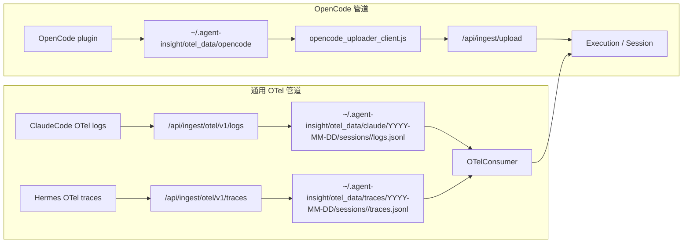

# Hermes / OpenCode / ClaudeCode Trace 数据流与落盘问题分析

> 讨论稿，基于 2026-06-16/17 对本地 `~/.agent-insight` 数据、Hermes 插件、OpenCode uploader、OTel consumer 的排查。

## 1. Trace 数据为什么要先落盘

当前仓库里实际存在两类采集管道：



`otel_data` 不是最终展示数据，它是采集端和落库端之间的缓冲队列。真正用于页面展示的是 `Execution` / `Session` 里的归一化结果。

### 1.1 落盘的目的

落盘主要解决四个问题：

1. **快速响应 exporter**
   OTel endpoint 收到数据后只做校验、归一化、append spool，然后返回 `200 accepted`。聚合、去重、写库、评估都放到后台，避免 exporter POST 被长时间阻塞。

2. **崩溃恢复**
   如果 Next 进程在接收后、聚合前重启，已经 append 到 spool 的事件还能由 `OTelConsumer` 继续处理。否则“HTTP 已返回成功但数据还没入库”的窗口会丢数据。

3. **聚合碎片事件**
   OTel 上报的是 span/event，不是页面能直接展示的一条完整 trace。后台 consumer 需要按 `sessionId` 聚合、排序、dedupe，再生成 `ExecutionRecord`。

4. **抗重试和削峰**
   exporter 超时或网络波动会重发。spool + 后台聚合允许系统在后处理阶段去重，不把所有重活压在 HTTP 请求里。

### 1.2 能不能取消落盘

可以，但要明确牺牲什么。

| 方案 | 优点 | 代价 | 判断 |
| --- | --- | --- | --- |
| 纯内存队列 | 没有文件膨胀和文件读取问题 | 进程重启/HMR/崩溃会丢 accepted 但未入库的数据；长 debounce 不可靠 | 不建议作为主链路 |
| 请求内直接落库 | 实现直观，页面可见最快 | 大 trace 会拖慢 POST，exporter 超时重试，容易重复上报和雪崩 | 不建议回退 |
| 文件 spool | 简单、无新增依赖、可恢复 | 要处理分片、retention、checkpoint、流式读取 | 当前方向可保留，但实现需要修 |
| DB/队列表 raw event queue | 查询、去重、清理更结构化 | 需要 schema 设计；SQLite 高频写可能锁表/膨胀 | 中长期可评估 |

结论：**不建议取消持久化缓冲，但应修正当前文件 spool 的组织方式和读取方式。** 问题不是“落盘”本身，而是通用 traces spool 当前把大量 trace 都写到同一个日文件里，并且后续聚合还有整文件读取路径。

## 2. Hermes 数据文件为什么异常大

本次排查的服务端文件：

`~/.agent-insight/otel_data/traces/2026-06-16/traces.jsonl`

在一次排查中有约 `407` 条事件、约 `89.9MB` 内容。字段体积最大的两个 attribute 是：

| 字段 | 体积 | 原因 |
| --- | ---: | --- |
| `llm.input_messages` | 约 `40.95MB` | 每个 API span 存完整 request history |
| `input.value` | 约 `40.56MB` | 同一份 request history 又被存了一份 |

这两个字段合计超过 90%。同时，`407` 条事件里只有 `54` 个唯一 `sessionId + spanId`，重复率约 `86.7%`。去重后约 `10.9MB`，实际写了约 `89.9MB`，重复上传放大约 `8.25x`。

所以 Hermes 变大的根因是三层叠加：

1. **完整 history 太大**
   `request_messages` 不是本轮用户输入，而是完整上下文：system prompt、skills、历史 user/assistant、tool result、当前输入。agent 跑得越久，这个字段越大。

2. **同一份 history 双写**
   Hermes 插件在 API span 里同时写：

   ```python
   "llm.input_messages": kwargs.get("request_messages"),
   "input.value": kwargs.get("request_messages"),
   ```

   `input.value` 被主链路视图拿来找 user 输入，但它不需要完整 history。

3. **snapshot 重复上报**
   Hermes 每完成一个 span，会把 root 下所有已完成 spans 重新组成 snapshot 上传。服务端 `traces` endpoint 是 append-only，不会在写 spool 前按 `sessionId + spanId` 去重，所以老 span 会反复进入 `traces.jsonl`。

## 3. 为什么 OpenCode 没有同样的问题

OpenCode 并不是因为没有 history，而是它的存储形态不同：

1. OpenCode uploader 最后上传的是整理后的 `interactions` 事件流，而不是每个 API span 都嵌完整 LLM request history。
2. OpenCode 的历史由 user / assistant / tool call / tool result 这些 interaction 串起来，不需要在每次 LLM 调用里重复存一份完整 `messages`。
3. OpenCode uploader 有 session signature/checkpoint，已上传过的 session 版本会跳过。
4. OpenCode 有 `AGENT_INSIGHT_MAX_TOOL_IO`、`AGENT_INSIGHT_MAX_EVENT_STRING` 这类字段裁剪。
5. OpenCode 走 `/api/ingest/upload` quick save 到 `Execution`，`otel_data/opencode` 只是本地队列，不是通用 traces 日文件。

## 4. Hermes 应该怎么改

建议分三层修，第一层和第二层修 Hermes 插件，第三层修服务端 spool。

### 4.1 插件端修输入字段

目标：保留链路主视图需要的信息，同时避免每个 span 内嵌完整 history。

建议：

1. `input.value` 只存本轮用户输入，或 `request_messages` 的最后一条 user message。
2. `llm.input_messages` 不在每个 `api.*` span 都存完整 history。
3. 如果 UI 需要展示 LLM input history，可以改成以下任一方式：
   - 只在 `llm.*` 容器 span 上存一份；
   - 只保留尾部 N 条消息；
   - 以 `max_input_chars` 截断；
   - 只存摘要或引用。
4. 增加元信息：
   - `llm.input_messages.message_count`
   - `llm.input_messages.original_chars`
   - `llm.input_messages.truncated`

这样不会破坏链路主视图里的 user、assistant、tool、token、latency。受影响的只是“完整原始 LLM request history”从无限完整变成可控调试信息。

### 4.2 插件端从 snapshot 改成 delta 上报

现在每次完成 span 都上传 root 的完整累计 snapshot。应改成只上传新增 span：

```python
self.exporter.submit(f"{root_id}:{span['spanId']}", self._payload(root_id, [span]))
```

同时本地 spool 文件名也要包含 `rootId + spanId`，避免多个 pending span 覆盖同一个 root 文件。

这样服务端收到的是增量事件，不会把已经成功上报过的 span 一遍遍 append 到 `traces.jsonl`。

### 4.3 服务端修 traces spool 组织和读取

这是和“落盘”直接相关的治理点，不能只靠 Hermes 插件端止血。

本次修复前的问题（旧日文件仍作为 legacy 兼容读取）：

`~/.agent-insight/otel_data/traces/YYYY-MM-DD/traces.jsonl`

把所有通用 OTel traces 都写进一个日文件。文件大后会出现两个问题：

1. 聚合某个 session 时需要扫描巨大文件，成本高。
2. 当前读取函数里存在整文件读取路径，大文件会触发 Node 字符串大小限制或内存问题。

建议：

1. **不要所有 trace 共用一个日文件**
   改成更细粒度分片，例如：

   ```text
   otel_data/traces/YYYY-MM-DD/HH/traces.jsonl
   ```

   或：

   ```text
   otel_data/traces/YYYY-MM-DD/<sessionId>.jsonl
   ```

   如果按 session 分片，聚合单个 session 最直接；如果担心文件数过多，可先按小时分片。

2. **读取必须流式化**
   `readOtelTraceEventsForSession` 和 `readNewLinesSince` 不应再整读文件到字符串。需要逐行扫描、边读边过滤 `sessionId`。

3. **checkpoint 要能处理文件重建/截断**
   如果 `cursor.bytes > 当前文件大小`，应认为文件被 truncate/recreate，自动 invalidate 或从 0 重新读，并打 warning。

4. **服务端 append 前做兜底裁剪**
   即使客户端没修，也不能让单个 attribute 无限进入 spool。服务端应对 `input.value`、`llm.input_messages`、`output.value`、`tool.output` 设硬上限。

5. **retention / compact 必须可观测**
   已处理的历史 spool 应按保留窗口归档或删除，consumer 日志里要能看到压缩/清理结果。

### 4.4 本次已落地的服务端改动

本次先落地服务端 spool 组织方式，目标是让 ClaudeCode logs 和 Hermes/通用 OTel traces 都不再堆到同一个日文件：

```text
otel_data/claude/YYYY-MM-DD/sessions/<safe-session>/logs.jsonl
otel_data/traces/YYYY-MM-DD/sessions/<safe-session>/traces.jsonl
```

兼容策略：

1. 新写入按 `sessionId` 分片，并对路径段做安全化处理，避免特殊字符或过长 sessionId 直接进入路径。
2. 文件发现改为递归查找 `logs.jsonl` / `traces.jsonl`，所以历史的 `YYYY-MM-DD/logs.jsonl` / `YYYY-MM-DD/traces.jsonl` 仍会被 consumer 读取。
3. `readOtelTraceEventsForSession`、`readClaudeOtelEventsForSession` 和 `readNewLinesSince` 改为分块读取，不再把整个 JSONL 文件一次性读成字符串。
4. 当 checkpoint 的 `bytes` 大于当前文件大小时，视为文件被删除重建或截断，下一次读取会从 0 开始，cursor 保存也允许回退到本次实际读取位置。

这一步解决的是服务端“同一日文件无限膨胀”和“旧 checkpoint 卡住新文件”的问题；Hermes 插件端的 history 双写、snapshot 重复上报仍建议按前两步继续处理。

## 5. 推荐实施顺序

1. **先修 Hermes 输入字段**
   去掉 API span 的完整 history 双写，把 `input.value` 收敛成本轮输入，把 `llm.input_messages` 改成截断/tail/单份。

2. **再修 Hermes snapshot 重复上报**
   从 root snapshot 改成 delta span 上报，消除重复 append。

3. **然后修服务端 spool**
   分片存储 + 流式读取 + checkpoint 截断检测。这一步是长期稳定性的关键，也能保护未来其他 OTel 框架不踩同一个坑。

4. **最后评估是否改成 DB/raw-event queue**
   如果文件 spool 仍然难维护，再讨论引入表结构或队列。这个属于更大架构改造，不建议作为当前止血第一步。

## 6. 当前结论

`otel_data` 的存在是为了异步化、恢复和削峰，不建议简单取消。

Hermes 文件过大的直接原因是：完整 LLM history 被双字段重复写入、snapshot 重复上传、服务端通用 traces 又集中写入单个日文件并按文件扫描。

因此修复不能只做“少采集 history”，还必须同时做：

1. 插件端减少重复大字段；
2. 插件端从 snapshot 改成 delta；
3. 服务端不要把所有 trace 堆进同一个大文件再整读。
