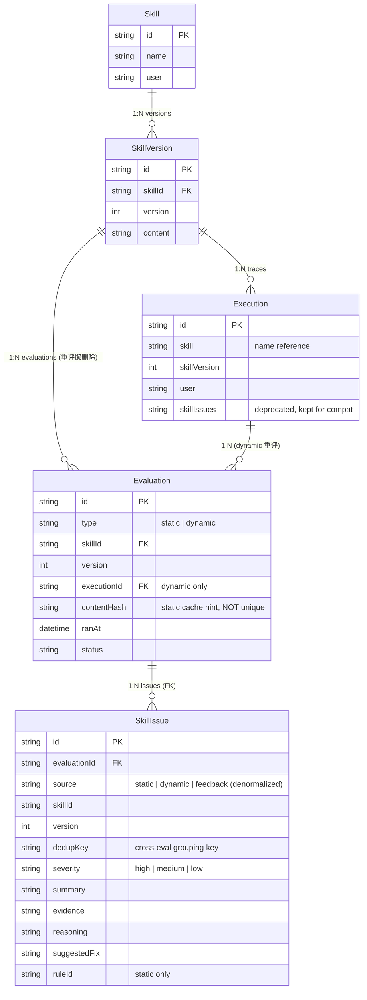

                    ┌─────────────────────┐
                    │       Skill         │
                    │  id (PK)            │
                    │  name               │
                    │  user               │
                    └──────────┬──────────┘
                               │ 1:N
                               ▼
                    ┌─────────────────────┐
                    │     SkillVersion    │
                    │  id (PK)            │
                    │  skillId (FK)       │
                    │  version            │
                    │  content            │
                    └──────────┬──────────┘
                               │
              ┌────────────────┴────────────────┐
              │ 1:N                         1:N │ 静态评估（重评懒删除）
              ▼                                 ▼
    ┌─────────────────────┐         ┌──────────────────────────┐
    │    Execution        │  1:N    │       Evaluation         │
    │    (trace 轨迹)      │ ◀─────  │       (评估结果)          │
    │                     │ 动态评估  │                          │
    │  id (PK)            │重评懒删除 │  id (PK)                 │
    │  skill (name)       │多个评估器 │  type ['static'|'dynamic']│
    │  skillVersion       │         │  skillId (FK)            │
    │  user               │         │  version                 │
    │  skillIssues        │         │  executionId (FK) ───────┼─┐ dynamic 时回指
    │  (deprecated)       │         │  contentHash             │ │ Execution
    └─────────────────────┘         │  l2ScoresJson            │◀┘
                                    │  ranAt, status, ...      │
                                    └──────────┬───────────────┘
                                               │ 1:N
                                               ▼
                                    ┌──────────────────────────┐
                                    │       SkillIssue         │
                                    │       (单个优化点)         │
                                    │                          │
                                    │  id (PK)                 │
                                    │  evaluationId (FK)       │
                                    │  source                  │
                                    │   ['static'|'dynamic'|   │
                                    │    'feedback']           │
                                    │  skillId, version        │
                                    │  user                    │
                                    │  dedupKey ←跨 eval       │
                                    │   分组键                  │
                                    │  severity                │
                                    │   [high|medium|low]      │
                                    │  summary                 │
                                    │  evidence                │
                                    │  reasoning               │
                                    │  suggestedFix            │
                                    │  ruleId (static)         │
                                    └─────────────────────────┘
                                                       
## 两条核心 invariant（其他设计都从这里推导）

> **1. 静态评估和动态评估统一到 `/evaluation/<evaluation_id>`**
>
> 一张 `Evaluation` 表承载两种类型，`type ∈ {'static', 'dynamic'}` 区分。前端跳转
> URL 不分类型，后端按 `evaluation_id` 一张表查。
>
> **2. SkillIssue 通过 FK 链接到 `evaluation_id`**
>
> 一张 `SkillIssue` 表，每行 = 一个独立优化点，`evaluationId` 字段 FK 指向产生
> 它的 Evaluation。OptIssue.id = SkillIssue.id（真主键）。

后续所有字段、索引、API 形态都是这两条的具体落地。

## 概念分层

| 层 | 实体 | 含义 | 示例 |
|---|---|---|---|
| 现象 | `Execution` (旧表) | agent 跑出来的 trace 本体 | `exec_xxx` |
| 判断 | `Evaluation` (新表) | 对某 SkillVersion 的一次评估事件 | `eval_xxx` |
| 优化点 | `SkillIssue` (新表) | 一个独立的待优化项；**也是 API 直接返回的类型** | `iss_xxx` |

**关键关系**：
- `Execution` 是"原始 trace"，**不是评估**
- 动态评估 = `Evaluation(type='dynamic', executionId=Execution.id)` 评估这条 trace（**1 trace : N evaluations**，重评懒删除）
- 静态评估 = `Evaluation(type='static', contentHash=hash(SkillVersion.content))` 评估 SKILL.md 内容（**1 version : N evaluations**，重评懒删除）
- 两种评估**都**产出多个 `SkillIssue`（FK 指回 Evaluation）
- API 返回类型 = `SkillIssue` 直接出，外加一个派生字段 `prevalenceCount`（同 dedupKey 在响应范围内被检出几次）

## 数据库 schema

### 新表 `Evaluation`

```prisma
model Evaluation {
  id             String   @id @default(cuid())     // → SkillIssue.evaluationId
  type           String                            // 'static' | 'dynamic'
  skillId        String
  version        Int
  user           String?

  // dynamic 专用：指向被评估的 trace。同一条 trace 可被多个 evaluation 引用
  // （重评懒删除：旧 evaluation 不删，多个评估器并存）
  executionId    String?
  execution      Execution? @relation(fields: [executionId], references: [id])

  // static 专用：内容 hash，作"快速查最近一次同 content 的评估"的索引线索
  // 不是 unique 约束——同 SkillVersion 允许多次重评（评估器自行决定 skip）
  contentHash    String?
  l2ScoresJson   String?  // {Role:1-5, Structure:1-5, ...}（V2 接 LLM 5D 时填）

  // 通用元数据（可留白）
  ranAt          DateTime @default(now())
  status         String   @default("ok")  // 'ok' | 'partial' | 'failed'
  errorMessage   String?
  durationMs     Int?

  Skill          Skill        @relation(fields: [skillId], references: [id], onDelete: Cascade)
  issues         SkillIssue[]

  @@index([skillId, version])
  @@index([type, ranAt])
  @@index([skillId, version, type, contentHash])  // 评估器查"最近一次同 content 评估"用；非 unique
  @@index([executionId])                          // 反查"这条 trace 被哪些 evaluation 评过"
}
```

### 新表 `SkillIssue`

```prisma
model SkillIssue {
  id             String   @id @default(cuid())     // PK；API 直接返回
  evaluationId   String                            // FK → Evaluation.id
  Evaluation     Evaluation @relation(fields: [evaluationId], references: [id], onDelete: Cascade)

  // 冗余 denormalized 字段：避免每次查 issue 都 join Evaluation
  // source 写入时从 Evaluation.type 复制；避免热路径 join
  source         String   // 'static' | 'dynamic' | 'feedback'
  skillId        String
  version        Int
  user           String?

  // 内容识别：跨 evaluation 聚合"同一 issue"的语义键
  // - static: ruleId（如 "frontmatter_missing_name"）
  // - dynamic: hash6(content + explanation)
  dedupKey       String

  // 内容字段（直接对应前端消费的字段）
  severity       String   // 'high' | 'medium' | 'low'（与前端 UI 语言一致，DB 直接用）
  summary        String
  evidence       String?
  reasoning      String?
  suggestedFix   String?

  // 静态专用元数据（API 可暴露，前端可忽略）
  ruleId         String?
  dimension      String?  // L2 评估维度，纯审计

  createdAt      DateTime @default(now())

  @@index([skillId, version, dedupKey])  // 跨 eval prevalence 聚合用
  @@index([evaluationId])
  @@index([source, severity])             // 前端按来源/严重度筛选
}
```

### 现有表 `Execution`（无 schema 变更）

`Execution.skillIssues` JSON 字段保留以兼容现有 ingestion / logs API，但**新代码不再
读它**。判定路径：
- 老代码读 `Execution.skillIssues` → 行为不变
- 新 issues API 读 `SkillIssue` 表 → 数据来自 judge.ts 改造后的双写

完全删除 `Execution.skillIssues` 字段需要单独 PR + 数据迁移，不在本期范围。

## API 返回类型 = SkillIssue + prevalenceCount

不再有独立的 `OptIssue` 类型，前端直接消费 `SkillIssue` DB 行（带一个派生字段）：

```ts
// API 返回的每个 issue（DB 行 + 一个聚合派生字段）
type IssueWithPrevalence = SkillIssue & {
  prevalenceCount: number;   // 同 dedupKey 在本次 query 范围内被检出几次
};
```

`SkillIssue.evaluationId` 统一指向 `/evaluation/<id>`：

| source | evaluationId 来源 | 前端跳转 |
|---|---|---|
| static | `Evaluation.id` (type=static) | `/evaluation/<id>` |
| dynamic | `Evaluation.id` (type=dynamic) | `/evaluation/<id>` |
| feedback | （V2 设计；当前 evaluationId 仍是必填，feedback 用一个特殊 sentinel id 或单独 Evaluation 行） | `/evaluation/<id>` |

`/evaluation/<id>` 详情页：单表 query Evaluation，按 type 渲染不同视图
（dynamic 时再 fetch 关联的 Execution 显示 trace 详情）。

## API 路径与响应

```
GET /api/skills/by-name/:name/optimization-points?version=N&user=...
```

```ts
{
  skill: string,
  version: number,
  generatedAt: string,
  generator: string,                          // "skill-issues@0.1.0"
  issues: IssueWithPrevalence[],              // severity 排序，prevalence 抬升后再排
  stats: {
    bySource: { static: number, dynamic: number, feedback: number },
    bySeverity: { high: number, medium: number, low: number },
    totalEvaluationsScanned: number,
  }
}
```

## API 实现（核心一句 SQL）

新模型让聚合逻辑塌成一句话——`source` 已 denormalize 到 SkillIssue，
仅用 Evaluation join 拿 `ranAt`（用于代表行选择 + 时间排序）：

```ts
const rows = await prismaRaw.$queryRaw`
  SELECT
    si.*,
    e.ranAt as eval_ran_at
  FROM SkillIssue si
  JOIN Evaluation e ON e.id = si.evaluationId
  WHERE si.skillId = ${skillId}
    AND si.version = ${version}
    AND (si.user = ${user} OR si.user IS NULL)
  ORDER BY si.dedupKey, e.ranAt ASC
`;

// JS 层：按 dedupKey 分组，每组第一条做代表，count 为 prevalence
const byKey = groupBy(rows, r => r.dedupKey);
const issues: IssueWithPrevalence[] = Object.values(byKey).map(group => {
  const rep = group[0];           // 最早的（dedupKey 内 ranAt ASC）
  const count = group.length;
  return {
    ...rep,                       // SkillIssue 全字段直出（含 source / severity / summary / ...）
    severity: bumpSeverityByPrevalence(rep.severity, count),
    evidence: count > 1
      ? `${rep.evidence ?? ''}\n\n（来源：${count} 次评估检出）`.trim()
      : rep.evidence,
    prevalenceCount: count,
  };
});
```

`bumpSeverityByPrevalence`：dedupKey 跨 N 次 evaluation 检出 → severity 抬升一档
（`count >= 5` `medium → high`；`count >= 10` 任何级别 → `high`）。**整条管线没有
Critical/Major/Minor 的语言**——DB 写入时就该是 `high|medium|low`。

## 数据关系图（mermaid 渲染版，与顶部 ASCII 等价）

GitHub / VS Code Mermaid Preview / mermaid.live 直接渲染。



## 写入侧数据流

```
┌─ 静态评估器（评估器开发者新建）──┐    ┌─ judge.ts（已存在，需改造）─────┐
│                                  │    │                                 │
│ 触发：手动 / SkillVersion hook    │    │ 触发：评估流程内（既有）         │
│                                  │    │                                 │
│ 读 SkillVersion.content          │    │ 读 Execution + judgmentReason   │
│ 跑 L1 (linter) [+L2 LLM]         │    │ 跑 analyzeEvaluationItems       │
│                                  │    │                                 │
│ ─── 写入两张新表 ───              │    │ ─── 写入两张新表 ───            │
│ INSERT Evaluation(               │    │ INSERT Evaluation(              │
│   type='static',                 │    │   type='dynamic',               │
│   contentHash=...                │    │   executionId=Execution.id      │
│ )                                │    │ )                               │
│ INSERT SkillIssue x N (          │    │ INSERT SkillIssue x N (         │
│   evaluationId=eval.id,          │    │   evaluationId=eval.id,         │
│   source='static',               │    │   source='dynamic',             │
│   ruleId='...',                  │    │   dedupKey=hash6(content+expl), │
│   dedupKey=ruleId,               │    │   severity ('high'|'medium'|    │
│   severity ('high'|'medium'|     │    │              'low'),            │
│              'low'),             │    │   ...                           │
│   ...                            │    │ )                               │
│ )                                │    │                                 │
│                                  │    │                                 │
│                                  │    │ 同时保留双写 Execution.skillIssues │
│                                  │    │ （兼容旧 logs/ingestion 链路）  │
└──────────────────────────────────┘    └─────────────────────────────────┘
```

## 分工

| 项 | 由谁做 | scope |
|---|---|---|
| `Evaluation` + `SkillIssue` schema 落地 | DB 开发者 | 按本文档 prisma 定义；migrate 脚本；severity 用 high/medium/low；source 在 SkillIssue 里 denormalize |
| 静态评估器实现（写两表） | 评估器开发者 | L1 linter ts port（Diagnosis.severity 自己映射成 high/med/low）；L2 LLM 评估 V2；写入用 transaction 保 source 一致 |
| judge.ts 改造（双写两表） | 评估器开发者 | 评估流程内创建 Evaluation + SkillIssue；同时保留写 `Execution.skillIssues` 字段（兼容旧路径） |
| 静态评估触发机制 | 评估器开发者 | 推荐 `POST /api/skills/:id/evaluate?version=N` |
| issues API 路由 + 聚合 | **本 PR** | 单 SQL + JS prevalence 聚合 |
| 前端 SkillIssue 接口替换 + fetch | **本 PR** | `_mock.ts` 改类型；page.tsx 替换为真接口；evaluationId 跳转链接 |
| `/evaluation/<id>` 前端详情页 | UI 开发者 | 单表 query Evaluation 渲染 |
| feedback 持久化 | V2 单独 PR | — |
| 删除 `Execution.skillIssues` 字段 | V2 单独 PR | 等所有读取方迁移完后做 |

## 改动清单（本 PR）

| 文件 | 类型 | 行数估计 |
|---|---|---|
| `src/app/api/skills/by-name/[name]/optimization-points/route.ts` | 新增 | ~80 |
| `src/lib/engine/skill-issues/index.ts` | 新增 | ~80 (聚合 + prevalence + IssueWithPrevalence 类型) |
| `src/lib/engine/skill-issues/prevalence.ts` | 新增 | ~30 (bumpSeverityByPrevalence) |
| `src/app/(main)/skill-opt/_mock.ts` | 改 | ~30 (OptIssue → SkillIssue 类型替换；MOCK_ISSUES 字段调整) |
| `src/app/(main)/skill-opt/[name]/[version]/page.tsx` | 改 | ~25 (fetch + evaluationId 跳转) |
| `src/lib/engine/general-agent/skill-opt-prompt.ts` | 改 | ~15 (suggestedFix 注入) |
| `test/skill-issues-aggregation.test.ts` | 新增 | ~150 (mock SkillIssue 数据，覆盖去重 + severity 推导 + 多租户) |

约 400 行新增 + 70 行修改，跨 7 文件。

## MVP 不做（明确 V2 路径）

| 能力 | V2 实现思路 |
|---|---|
| L2 LLM 五维评估 | 评估器加 LLM 调用，结果写到 Evaluation.l2ScoresJson + 多条 SkillIssue（dimension 字段填 Role/Structure/...） |
| feedback 持久化 | chat 路由结束时创建 Evaluation(type='dynamic' 或专设 'feedback') + SkillIssue（其 source='feedback'）；evaluationId 由 chat 流产生 |
| Issue 历史/状态 | SkillIssue 加 `status: 'open' \| 'resolved' \| 'dismissed'` + `resolvedAt` + `resolvedByEvaluationId` |
| 跨版本追同一 issue | SkillIssue 加 `globalDedupKey`（不含 version）+ 跨版本聚合 API |
| `/evaluation/<id>` 详情页 | UI 开发者另起 PR |
| 应用层缓存 | 加 in-memory LRU 或独立 Cache 表 |

## 验证方案

**单测**（`npm run test`）：
- `skill-issues-aggregation.test.ts`：mock 5 条 SkillIssue 跨 3 个 Evaluation（含 static + dynamic 混合），断言：
  - 同 dedupKey 的 issue 被聚合，prevalence count 正确
  - severity 跨 prevalence 阈值时正确抬升
  - 跨 user 数据不串

**人工**（`bash scripts/restart_dev.sh`）：
- 评估器开发者落地前：DB 没 Evaluation 行 → 接口返空 issues 数组（不挂）
- 评估器落地后：手动跑 `POST /api/skills/.../evaluate` → 接口返回 static issues
- judge.ts 改造后：跑评估 → Execution + Evaluation + SkillIssue 三表都填上 → API 返回 dynamic issues
- 同时混合：static + dynamic issues 在同一响应里，按 severity 排序
- 点 issue 列表上的「来源」链接跳 `/evaluation/<id>`（详情页 V2，本 PR 只验 URL 正确）

## 风险点

1. **judge.ts 改造的 backward-compat**：旧代码读 `Execution.skillIssues` 不能挂。
   双写策略：先写 SkillIssue（新 PK），再写 Execution.skillIssues 字段（旧 JSON）。
   失败回滚 transactional 处理。
2. **evaluator 落地前 issues 列表全空**：MVP 接受这个状态。前端不需要特殊文案。
3. **dedupKey 粗粒度**：`hash6(content + explanation)` 在 LLM 输出小波动时会被认为
   是两个 issue。MVP 接受偏差，反馈多再换 fuzzy match。
4. **跨 user 串数据**：所有查询用 `user IN (?, NULL)` 兜底，单测加 cross-user case
   防回归。
5. **重评的 dedup 责任在评估器**：DB 不做 unique 约束（同 skillId+version+contentHash
   可写多行），允许"评估器升级、模型替换、人工触发重跑"。代价：评估器自己要决定
   "什么情况下 skip"（建议：查 24h 内成功的同 contentHash + 同 evaluator 版本，命中则
   skip）。否则会出现"用户连点 5 次评估按钮，DB 里多了 5 条 Evaluation"这种浪费。
6. **denormalize 字段写入一致性**：`SkillIssue.source` 必须等于其
   `Evaluation.type`。建议评估器写入时用 transaction 包住两次 INSERT（先 Evaluation
   拿 id，再 SkillIssue 携带 source 写入），单测覆盖"两边不一致时报错"。
