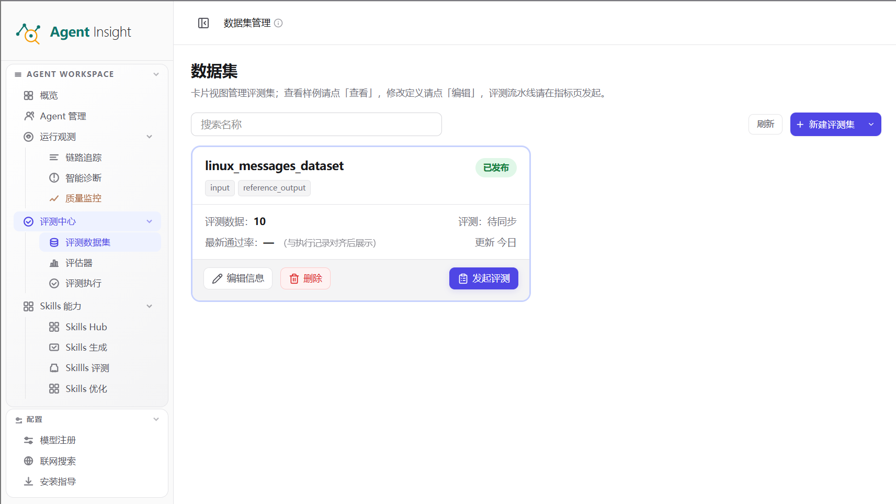
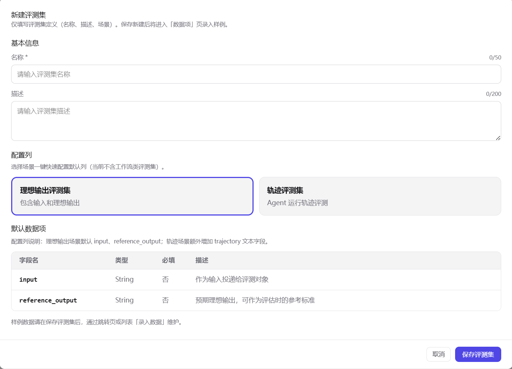
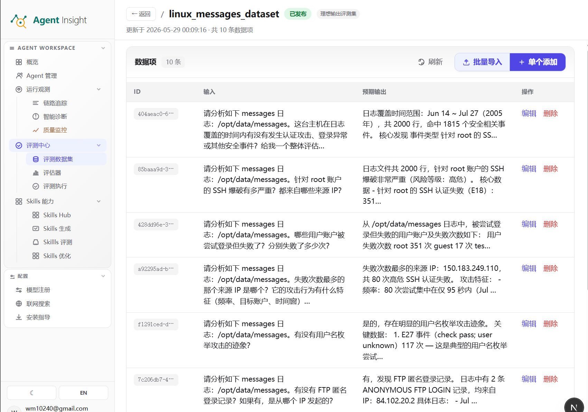
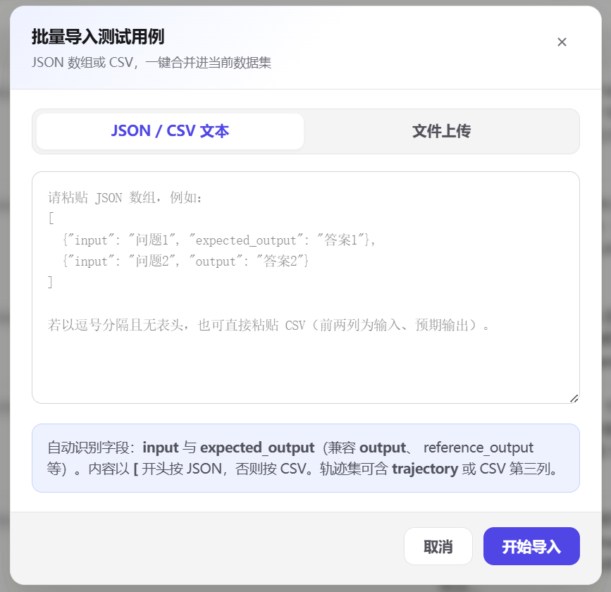

# 评测数据集

> **refactor-for-nh 演示版说明（2026-09-08）**：当前界面只展示需求中的版本化评测能力。实验已改为“实验设计 → 选择 Case → 预期答案 → 确认并执行”，四类对象和版本集中在第一步选择；下文中的原生 Trace/监听、可靠性、LLM 独立对比和标签管理入口在本演示中隐藏。以 [当前实验指南](experiments.md) 为准。数据集保留逐条草稿和统一发布版本，评估器展示版本化规则与 LLM 目录。


评测数据集用于沉淀离线评测所需的输入样本、预期结果与补充元数据，是评测执行、结果对比与版本回归的基础资产。一套结构稳定、判定标准明确的数据集，能让不同模型版本、不同提示词或不同 Agent 配置在相同输入下被横向比较，从而使评测结果可解释、可复现。

所有评测集统一显示为卡片，不再按普通、多轮拆分页面。同一评测集只显示一张卡片；具备历史版本的评测集在详情中切换版本，再查看该版本 Case。各类数据集的区别通过字段和标签表达：

- **理想输出评测集**：输出可与标准答案直接比对的场景（问答、翻译、抽取、分类等）。
- **轨迹评测集**：需要评估 Agent 执行过程的场景，在输入与预期输出之外额外记录运行轨迹。
- **可靠性评测集**：通过故障模式与子模式定义注入场景，用于验证 Agent 对故障的检测、处置与恢复能力。

> **Note**
> 评测数据集的创建分为两个阶段：**先定义评测集，再维护数据项**。系统保存评测集定义后会自动进入「数据项」页，你可在此继续录入样例。

## 创建流程概览

完整流程从定义评测集开始，到录入数据项并发起评测结束：

1. 进入 **评估与实验 → 评测数据集**。
2. 点击 **新建评测集**。
3. 填写 **名称** 与 **描述**。
4. 选择评测集类型：**理想输出评测集**、**轨迹评测集** 或 **可靠性评测集**。
5. 点击 **保存评测集**，系统自动跳转至 **数据项** 页。
6. 通过 **单个添加**、**批量导入** 或从 Trace 详情执行 **加入评测集** 录入样例。
7. 点击 **发起评测** 进入后续评测流程。

## 打开评测数据集

**数据集管理** 页是所有评测集的统一入口，集中展示已有评测集并提供检索、新建与发起评测等操作。

### 前提条件

- 已登录目标 Workspace。
- 已获得 **评估与实验** 的访问权限。

### 预期结果

- 进入 **数据集管理** 页面。
- 以卡片形式查看已有评测集，并可执行搜索、刷新、新建与发起评测等操作。

### 操作步骤

1. 在左侧导航中打开 **评估与实验**。
2. 点击 **评测数据集**，在统一卡片列表中选择对应数据集。

<p align="center">
  
</p>

### 页面功能

- **搜索名称**：按评测集名称筛选卡片，用于在大量数据集中快速定位。
- **刷新**：重新拉取最新状态与统计信息。
- **新建评测集**：打开新建面板，创建评测集定义。
- **数据集卡片**：展示名称、字段标签、状态标签、数据量、评测状态与更新时间；点击卡片进入对应的 **数据项** 页。
- **编辑信息**：修改评测集的名称、描述与类型定义。
- **删除**：仅系统内置的可靠性故障注入评测集受保护，其他评测集均可删除。普通评测集删除后不可恢复；支持版本管理的评测集删除后，所有版本退出数据集列表和新建实验选项，历史实验及其版本快照保留。版本化详情页也提供删除入口；勾选「显示已删除评测集」后，进入详情可恢复。已删除版本仅供查看，恢复后才可编辑和发布。
- **发起评测**：进入后续评测流程。**轨迹评测集** 直接进入轨迹评测入口，**理想输出评测集** 进入评估器选择入口。

数据集管理页只加载名称、字段和数据量等摘要；打开编辑或数据项页时才读取完整样本。
发起评测时只加载输入、预期输出等参考字段，不传输体积较大的轨迹内容，因此大数据集不会拖慢所有数据集操作。

## 新建评测集

新建评测集即定义一组样本的元信息与数据结构。**类型一经确定将影响可录入的字段与可用的评测方式，建议在创建前明确评测目标。**

### 前提条件

- 已进入 **数据集管理** 页面。
- 已明确评测目标、评测集名称与评测集类型。

### 预期结果

- 创建一个新的评测集定义。
- 保存完成后自动进入该评测集的 **数据项** 页。

### 操作步骤

1. 点击 **新建评测集**。
2. 在 **名称** 字段输入评测集名称。
3. 在 **描述** 字段补充评测目标与样本范围。
4. 选择 **理想输出评测集**、**轨迹评测集** 或 **可靠性评测集**。
5. 在 **默认数据项** 区域核对该类型对应的字段定义。
6. 点击 **保存评测集**。
7. 确认页面跳转至新评测集的 **数据项** 页。

<p align="center">
  
</p>

### 页面功能

- **名称**：评测集的唯一业务标识，页面提示字符上限。
- **描述**：补充评测目标、样本范围与使用场景，页面提示字符上限。
- **理想输出评测集**：默认字段为 `input` 与 `reference_output`，适用于结果可与标准答案直接比对的场景。
- **轨迹评测集**：在 `input`、`reference_output` 之外增加 `trajectory`，用于记录工具调用、决策步骤等过程信息，适用于 Agent 运行过程评测。
- **可靠性评测集**：在 `input`、`reference_output` 之外增加必填的 `fault_injection_type`，用于关联故障模式、子模式和注入方式。
- **默认数据项**：预览初始数据结构；创建后仍可在数据项页新增自定义字段。
- **保存评测集**：保存当前定义并进入数据录入流程。

> **Note**
> `reference_output` 是可选的预期输出字段。没有该字段或字段值为空不影响样本保存；只有依赖预期输出的评测指标会缺少对比基线。

## 维护数据项

数据项是评测集的实际样本。保存评测集后即停留在 **数据项** 页，你可在此持续新增、编辑、清理样例，使数据集随业务演进保持可用。

### 前提条件

- 已保存评测集定义。
- 已进入目标评测集的 **数据项** 页。

### 预期结果

- 在当前评测集中新增、编辑、删除并核对数据项。
- 在列表中确认 **输入**、**预期输出** 与可选的轨迹字段。

### 操作步骤

1. 打开目标数据集卡片，或在保存评测集后停留在跳转页。
2. 确认页面顶部显示评测集名称、状态标签与数据项数量。
3. 如需扩展数据结构，点击 **新增字段**，填写字段名称、key 和类型。
4. 点击 **单个添加** 录入单条样例。
5. 点击 **批量导入** 一次写入多条样例。
6. 点击 **编辑** 修改该条样本的任意字段值。
7. 点击 **删除** 移除无效或过期数据项。
8. 点击 **刷新** 同步最新数据项列表。

<p align="center">
  
</p>

### 页面功能

- **顶部信息区**：显示 **返回**、评测集名称、状态标签、评测集类型、更新时间与总数据项数。
- **数据项表格**：按照当前数据集字段动态展示列。
- **故障模式说明**：仅可靠性评测集显示；按当前数据集实际使用的故障模式和子模式说明注入逻辑，不展示具体触发文本等实现细节。
- **新增字段**：填写唯一的字段名称并选择文本、数字、布尔值或 JSON 类型；系统自动生成内部标识。已有样本在新字段下显示为空，可逐条补充。
- **单个添加**：逐条录入样例，适合补充关键案例或修订单条数据。
- **批量导入**：通过 JSON、CSV 文本或文件上传一次写入多条数据项。
- **编辑**：更新单条数据项的所有字段值，包括自定义字段。
- **删除**：移除错误、重复或失效的样例。
- **刷新**：重新拉取当前评测集的数据项。

### 查看可靠性故障模式说明

可靠性评测集的数据项页提供 **故障模式说明** 页签。每条可靠性数据对应一个“故障模式 × 子模式”，实验按对应注入方式制造故障，再观察 Agent 是否能够检测、处置或恢复。

表格只汇总当前数据集中实际使用的故障模式，包含 **故障模式、子模式、注入方式、说明** 四列。同一故障模式存在多个子模式时按子模式逐行展示；说明聚焦故障行为和评测目的，不展开具体触发短语、测试值或实现样例。没有显式子模式的数据项显示为 **默认**。平台可用性由已连接客户端能力决定，不在该表中逐行重复展示。

系统内置的可靠性评测集由故障目录自动同步，页面标记为 **只读**。你仍可查看数据项、故障模式说明并刷新数据，但不能新增字段、导入或添加数据，也不能编辑、删除数据项或修改数据集信息。如需维护自定义样本，请创建新的可靠性评测集。

## 批量导入数据项

当样例来自脚本输出、表格整理或历史迁移时，使用批量导入可一次写入多条数据项；导入内容会合并到当前评测集，不会覆盖已有数据。

### 前提条件

- 已进入目标评测集的 **数据项** 页。
- 已准备好 JSON 数组、CSV 文本，或 `.json` / `.csv` 文件。

### 预期结果

- 多条数据项一次性写入当前评测集。
- 列表中的数据项总数立即增加。

### 操作步骤

1. 点击 **批量导入**。
2. 选择 **JSON / CSV 文本** 或 **文件上传**。
3. 粘贴 JSON 数组或 CSV 文本，或选择本地文件。
4. 对照自动识别区，核对字段名称与列顺序。
5. 点击 **开始导入**。
6. 确认弹窗关闭，且列表中的数据项数量增加。

<p align="center">
  
</p>

### 导入格式示例

理想输出评测集（JSON）：

```json
[
  { "input": "将这句话翻译成英文：今天天气很好。", "expected_output": "The weather is nice today." },
  { "input": "请用一句话总结：评测数据集的作用是什么？", "expected_output": "为离线评测提供可复现的样本与对比基线。" }
]
```

理想输出评测集（CSV）：

```csv
input,expected_output
"将这句话翻译成英文：今天天气很好。","The weather is nice today."
"请用一句话总结：评测数据集的作用是什么？","为离线评测提供可复现的样本与对比基线。"
```

轨迹评测集在上述结构基础上增加 `trajectory` 字段，用于保存 Agent 的结构化执行记录：

```json
[
  {
    "input": "查询北京今天的天气并给出穿衣建议。",
    "expected_output": "北京今天晴，建议穿薄外套。",
    "trajectory": "<Agent 执行过程的结构化记录>"
  }
]
```

工具类评估器还需要执行任务时完整的可用 Tool/Skill 目录。JSON 样本可增加以下字段：

```json
[
  {
    "input": "读取配置文件并汇总关键项。",
    "expected_output": "输出关键配置项及风险。",
    "available_tools": [
      { "name": "read_file", "description": "读取文件" }
    ],
    "available_skills": [
      { "name": "config-review", "description": "检查配置" }
    ]
  }
]
```

`available_tools` 是必需的入口字段，`available_skills` 可省略。缺少 `available_tools` 表示系统无法确认能力目录；填写空数组表示已确认没有可用 Tool。目录不包含 Agent、子 Agent 或任务委派。对于 OpenCode/Jiuwen，`skill`、`load_skill` 等只是 Skill 加载入口，不要作为独立 Tool 写入 `available_tools`，应把实际 Skill 名称写入 `available_skills`。JSON 导入识别到这两个字段后，会自动创建对应的 JSON 数据列。导入后，在新建实验第 ③ 步点击“从数据集导入匹配”；Trace 任务输入包含数据集 input 时，系统会回填对应目录，多条命中时优先使用更长、更具体的一条。

trace 只能说明 Agent 实际调用了哪些能力，不能说明当时还有哪些能力可用。不要把 trace 中的已调用集合直接当作完整目录，否则无法判断遗漏的必要工具。需要批量填写时，请使用数据集 JSON 维护上述目录字段；当前 CSV 导入仅识别输入、预期输出（含兼容别名）和轨迹列，不会自动写入 `available_tools` / `available_skills`。CSV 导入后可在界面手动补充这两个 JSON 字段；需要程序化创建实验时，通过实验 API 的 `evaluatorContext` 提供。

### 在界面手动填写 Tool/Skill 目录

1. 打开目标评测数据集，在数据项区域点击 **新增字段**。
2. 字段名称填写 `available_tools`（或“可用 Tool”）。界面会自动识别该名称、固定为 JSON 类型，并保存为工具类评估器可读取的标准字段。
3. 如需 Skill 目录，再新增 `available_skills`（或“可用 Skill”）字段。
4. 点击 **单个添加** 或编辑某条数据，在两个 JSON 字段中分别粘贴数组，例如 `[{"name":"read_file","description":"读取文件"}]`。只确认无需 Tool 时填写 `[]`；不要用空值表示“没有工具”。

### 页面功能

- **JSON / CSV 文本**：直接粘贴结构化文本，适合从脚本、表格或日志处理中快速导入。
- **文件上传**：上传本地 `.json`、`.csv` 或 `.txt` 文件，适合批量迁移已有样例。
- **自动识别区**：提示系统支持的核心字段与兼容别名，便于在导入前校验格式。
- **开始导入**：解析输入内容并合并到当前评测集。
- **取消**：关闭弹窗，不写入任何数据。

> **Tip**
> 批量导入默认识别 `input` 与 `expected_output`，并兼容 `output`、`reference_output` 等别名；轨迹评测集额外识别 `trajectory`、`trace` 与 `agent_trace`。字段对应关系详见下方「数据项字段说明」。

## 从 Trace 回流数据项

单条回流：

1. 进入 **运行观测 → 链路追踪**，打开一条 Trace 详情。
2. 点击顶部的 **加入评测集**。
3. 若已有数据集，系统默认选择最近更新的一条；需要时可切换其他数据集或改为 **新建数据集**。没有已有数据集时，系统默认进入新建模式。
4. 配置字段及映射，然后检查最终数据预览。
5. 点击 **确认加入**。系统保存后关闭弹窗并停留在当前 Trace 页面，通过页面提示显示成功加入的 Trace 数量；失败时弹窗保留并显示错误原因。

批量回流：

1. 在 Trace 列表首列勾选需要沉淀的记录，也可以通过表头复选框选择或取消当前页；翻页或调整筛选时，已选记录会继续保留。
2. 在列表上方出现的选择操作栏中点击 **加入评测数据集**。
3. 系统并发读取所选 Trace。读取失败的记录会汇总提示且不会保存。
4. 统一配置目标数据集和字段映射；来源下拉使用 `input`、`output`、`trace`、`none`，在预览页逐条切换并修改最终字段值。较长内容在固定高度编辑框内通过右侧滚动条查看。
5. 确认后，所有准备成功的样本通过一次数据集更新写入，避免批次只写入一部分。

添加到已有数据集时，标准字段会自动映射：`input ← input`、`reference_output ← output`、`trajectory ← trace`。你仍可把原始用户输入、最终输出和原始 Trace JSON 改映射到任意现有字段，也可以在弹窗中新增字段；未映射字段写入空值。新建数据集默认使用标准字段 `input`、`reference_output`、`trajectory`，分别承接 Trace 的输入、经确认的最终输出和原始轨迹；三者均可删除、重命名或更改类型，也可以增加其他字段。同一数据集内字段名称必须唯一，内部 key 由系统维护，不需要用户填写。数据集至少保留一个字段，但不强制存在 `input` 或 `reference_output`。

原始 Trace 保存链路 Session 中、调用 `summarizeTrace` 之前的 interactions JSON 数组，包含对话、工具调用及其参数和结果等原始交互字段，不再保存步骤摘要。执行回流表示该 Trace 已被确认为好样例，因此其最终输出默认写入 `reference_output` 并作为预期输出，原始 Trace 默认写入 `trajectory`；可在字段映射步骤手动调整。字段新增与样本追加在一次数据集更新中完成。历史回流数据中的 `output` / `trace` 仍会兼容读取为预期输出和轨迹。

## 数据项字段说明

| 规范字段 | 界面列名 | 导入兼容别名 | 适用类型 | 说明 |
| --- | --- | --- | --- | --- |
| `input` | 输入 | — | 全部 | 发送给评测对象的问题、任务或请求。 |
| `reference_output` | 预期输出 | `expected_output`、`output` | 全部 | 预期结果，作为结果比对的基线。 |
| `trajectory` | 轨迹 trajectory | `trace`、`agent_trace` | 轨迹评测集 | 过程轨迹、关键步骤或结构化执行记录。 |
| `fault_injection_type` | 故障注入类型 | — | 可靠性评测集 | 故障模式 ID；页面结合数据项中的子模式快照展示完整注入类型。 |
| `available_tools` | 可用 Tool | — | 全部 | JSON 数组；工具类评估器的能力目录入口。空数组表示确认无可用 Tool。 |
| `available_skills` | 可用 Skill | — | 全部 | 可选 JSON 数组；与 `available_tools` 一起构成能力目录。 |

除上述字段外，导入前还可追加标签、评测焦点等元数据，用于后续的筛选、解释与分析。

## 设计与维护建议

- **控制初始规模**：优先维护 5 到 20 条核心样本，先建立可复现的最小闭环，再逐步扩充。
- **保持任务一致**：同一评测集只围绕相近的任务目标，避免将不同评测标准混入一组样本。
- **覆盖关键场景**：优先纳入核心业务路径、高频失败模式与边界案例。
- **固化标准答案**：为理想输出类样本提供清晰、可核对的 **预期输出**。
- **定期清理样本**：删除一次性噪声、重复样例与已失效场景，保持数据集可长期复用。

## 常见误区

- **混入多个评测目标**：同一评测集缺少统一判定标准，结果难以解读。
- **只收录简单样本**：评测结果虚高，无法暴露真实问题。
- **忽略预期输出**：结果评测失去比对基线，评分不可解释。
- **长期保留一次性故障样例**：数据集随时间逐渐失真。

## 下一步

- 从真实执行沉淀样本：参见本页 [从 Trace 回流数据项](#从-trace-回流数据项)
- 继续配置评分逻辑：[评估器](./evaluators)
- 直接运行评测任务：[实验](./experiments)
- 返回评测总览：[评估与实验](./index)

### 多轮评测集版本

版本化实验入口的“评测集版本”支持创建、复制、JSON/Excel 导入、Excel 导出和另存新版本。Excel 每行一个 Case，`tags` 与 `turns` 列使用 JSON；`turns` 包含各轮 input、expectedOutput 和 expectation。保存前可审阅结构化内容，非法规则和重复 ID 会被拒绝。

自动生成读取所选目标版本的 Prompt 与 Skill 定义，使用已配置模型生成草稿，人工审阅后才保存。新建实验只能选已有评测集版本，历史实验始终保留原版本内容。

版本化评测集支持逐轮表单：输入、语义预期、文本/正则、Skill、结束状态、必须/禁止工具、参数、顺序、JSON 字段和关键失败标记。工具要求和输出字段约束使用逐项表单：配置工具名、参数名、值类型、字段路径、数值范围、必填及允许值。复杂对象参数仍可填写 JSON。支持从现有普通评测集导入草稿、JSON/Excel 导入导出、复制、新版本、归档及恢复；故障注入集仍使用原可靠性实验。归档隐藏该评测集全部版本，不影响历史实验；恢复后可再次选用。

卡片显示最新版本和 Case 数，点击卡片进入详情，使用“评测集版本”查看不同版本 Case 与逐轮规则。逐个 Case 保存浏览器草稿后，统一发布新版本；新建实验只选择已发布版本。JSON / Excel 导出、复制和归档位于详情操作区；模型生成和导入位于详情“生成或导入数据项”。目录中打开“显示已归档版本”可进入归档评测集并恢复。新建菜单中的“配置逐轮输入与规则”用于包含多轮及工具约束的字段结构。

详情表格中的“类别”显示单轮或多轮；输入只显示用户首次输入，预期输出只显示 Agent 最终应返回的答案，逐轮内容在详细配置中查看。操作列与原评测集保持“编辑 / 删除”。

点击单条 Case 的“编辑”，配置每轮输入、预期和规则后“保存草稿”。保存不会立即生成版本；已修改条目可“撤销修改”，待删除条目可“恢复”，均回退至当前所选版本。新增 Case 也先保存草稿。全部调整完点击“发布新版本”，一次保存完整评测集，历史版本不被覆盖。没有改动或全部 Case 已删除时不能发布。

草稿按登录用户和基准版本保存在当前浏览器，刷新或切换版本后可恢复；不跨设备同步。清理浏览器存储会移除未发布草稿。导出、复制及新建实验使用已发布内容。列表支持按名称、ID、输入、预期输出搜索，每页 20 条。

### 比较两个评测集或版本

在“新建实验”第一步的实验名称下选择 **评测集对比**，然后分别选择 A/B 评测集和版本。可以选两个不同的评测集，也可以选同一评测集的两个已发布版本；不能重复选择同一个版本。第一版只支持版本化评测集，普通未登记版本的数据集和未发布草稿不会出现在该类型的 A/B 候选中。已有普通样本可先导入版本化评测集、审阅并发布，再用于比较。

第二步分别勾选 A/B 的 Case，可以有不同的 Case 数量；第三步分别查看两组预期输出和逐轮规则。实验中不编辑已发布 Case，需要修改时返回数据集详情，逐条保存草稿后发布新版本。Agent 版本、Skill 配置、模型、评估器以及并发、超时、重试等运行设置只配置一份，两组共用。开始实验后保存所选版本和 Case 内容，后续发布新版本不会改变历史实验。

详情按组显示 Case 总数、通过率和评分证据。同一评测集的版本优先按 Case ID 对应；不同评测集按各轮输入对应。输入、预期输出或规则改变的条目标记为“输入或规则已变化”；没有对应项的条目标记为“仅 A 组”或“仅 B 组”，并保留该组详情入口。只有各轮输入、预期和规则均相同且评完的 Case 才计入判定差值，不会把新增难例、删减 Case 或放宽规则带来的分数变化解释成 Agent 能力改善。
