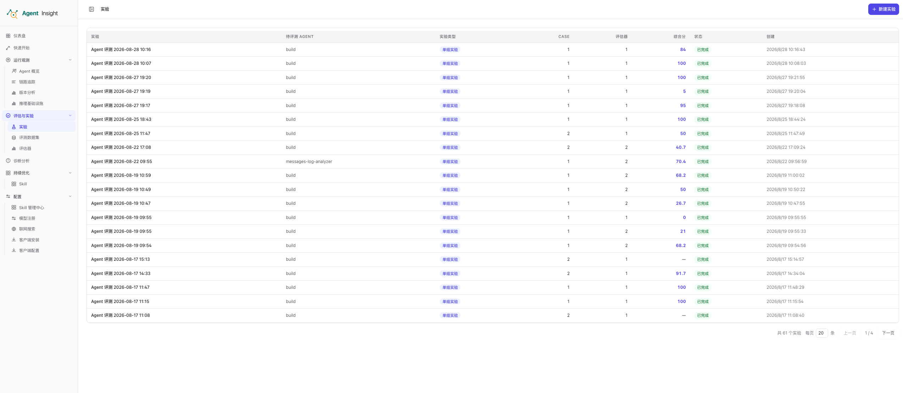
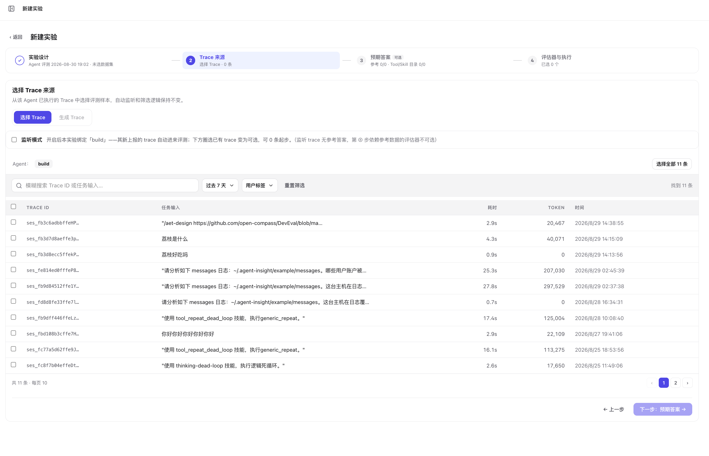
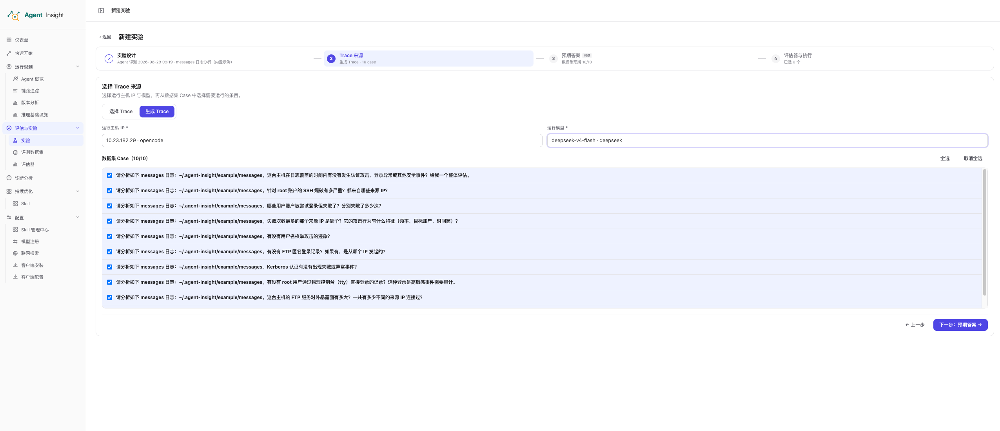
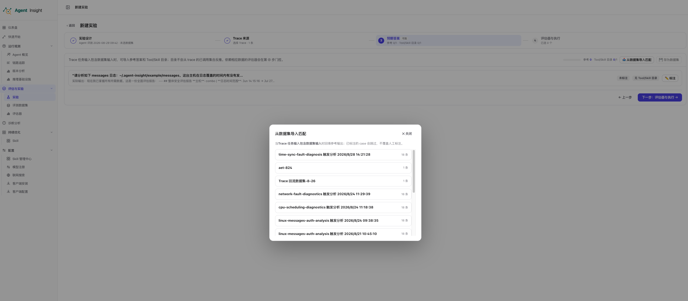
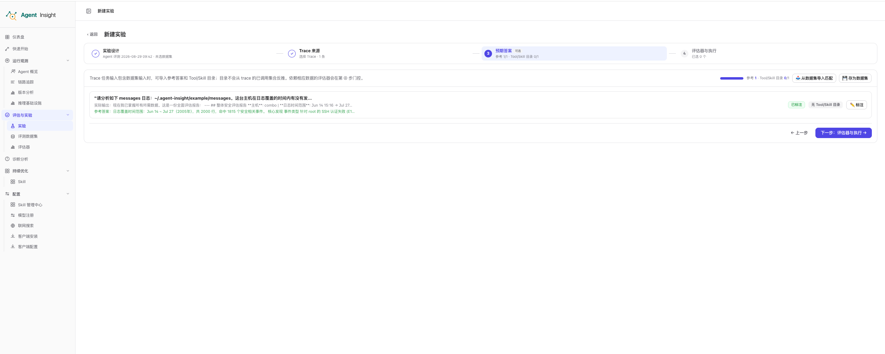
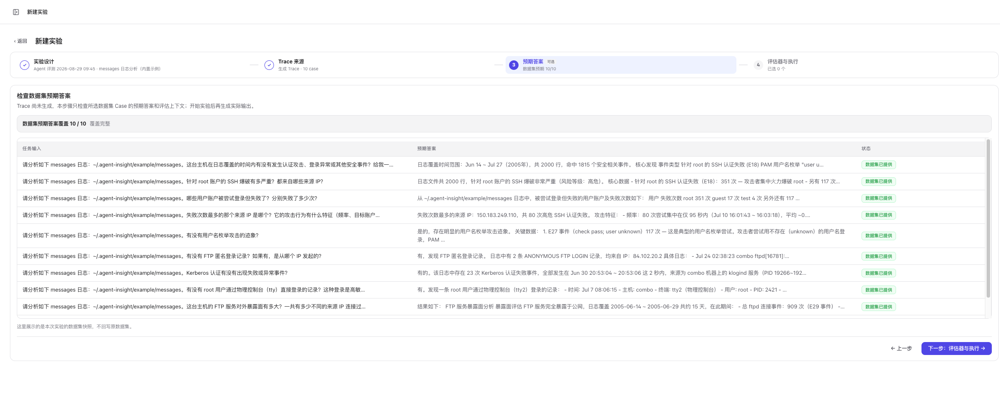
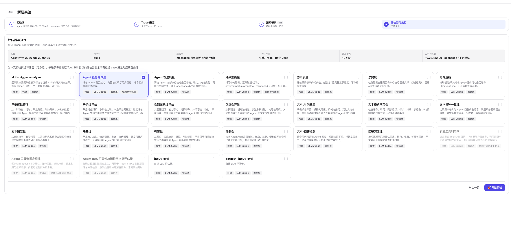
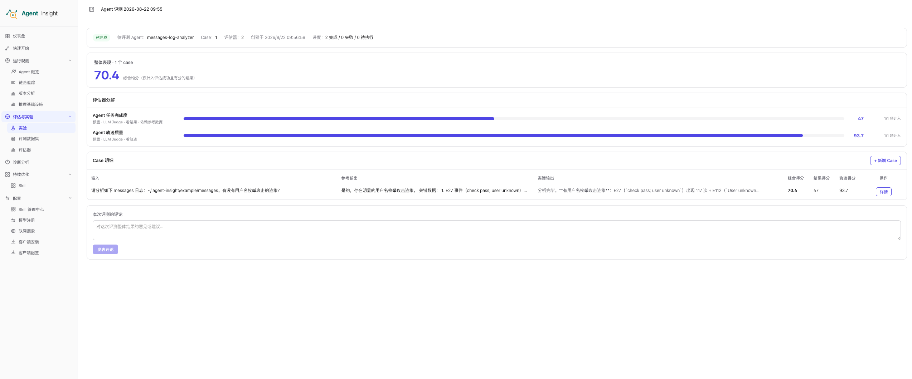
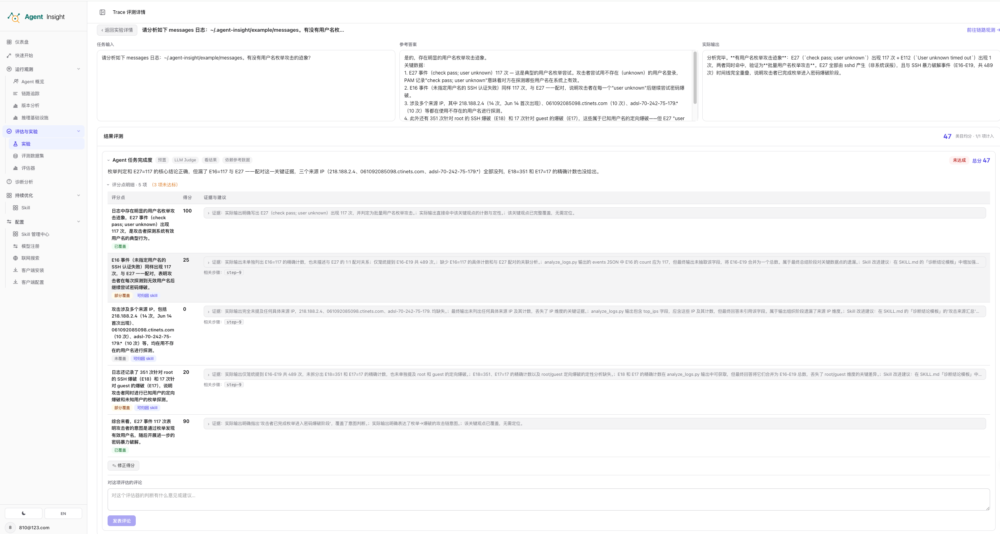

# 实验

实验用于把待评测 Agent、Case 和评估器组织成一次可追踪的质量验证。实验创建后立即开始执行，结果按实验汇总，并可继续下钻到单条 Case 的评估证据。

## 实验列表

进入 **评估与实验 → 实验**，可以查看当前账号下的实验记录。

  

列表字段说明：

| 字段 | 含义 |
| --- | --- |
| **实验** | 实验名称；点击所在行进入实验详情 |
| **待评测 Agent** | 本次实验绑定的 Agent |
| **实验类型** | 当前为单组实验或 LLM 对比实验 |
| **Case** | 纳入实验的 Case 数量 |
| **评估器** | 本次实验使用的评估器数量 |
| **综合分** | 全部有效评估结果的平均分；没有有效分数时显示 `—` |
| **状态** | 运行中、已完成或失败；监听实验还会显示监听状态 |
| **创建** | 实验创建时间 |

列表支持每页 20、50 或 100 条，并可使用上一页、下一页翻页。点击右上角 **新建实验** 进入四步向导。

## 四步创建实验

新建实验按照 **实验设计 → Trace 来源 → 预期答案 → 评估器与执行** 四步推进。步骤条会保存当前填写摘要，返回上一步不会清空已经完成的配置。

### 第一步：实验设计

在实验设计中配置：

- **实验名称**：本次验证的业务名称。
- **待执行 Agent**：候选项来自已有历史 Trace 的 Agent 与在线客户端可执行 Agent 的并集。
- **评测数据集**：可选；生成 Trace 时必须选择。
- **实验类型**：全局入口支持 **无变量 · 单组** 和 **LLM 对比**。

单组实验适合基线评测、问题复盘和回归验证。LLM 对比会按相同任务输入，从目标 Agent 已有 Trace 中自动配对 A、B 两个模型取值；只有两侧都有有效分数的 Case 才进入可比统计。

### 第二步：选择 Trace 来源

单组实验支持两种来源。

#### 选择已有 Trace

**选择 Trace** 直接评估目标 Agent 已经产生的执行记录，不会重新运行 Agent。

  

可用操作包括：

- 按 Trace ID 或任务输入模糊搜索。
- 按时间范围和用户标签筛选。
- 查看 Trace ID、任务输入、耗时、Token 和执行时间；执行过程异常请在诊断分析中查看。
- 分页浏览并跨页选择 Trace。
- 使用 **选择全部** 批量圈选当前筛选范围。
- 开启 **监听模式**，让该 Agent 后续新上报的 Trace 自动加入本实验评测。

监听模式允许不选择历史 Trace 直接创建实验。由于未来 Trace 没有逐条参考答案和 Tool/Skill 目录，依赖这些上下文的评估器在第 4 步不可选择。

#### 生成新 Trace

**生成 Trace** 使用数据集 Case 重新运行 Agent，再对新产生的 Trace 执行评估。

  

生成前需要满足：

- 第 1 步已经选择包含 Case 的数据集。
- 目标 Agent 存在在线、可执行且支持回传 Trace ID 的客户端。
- 已选择运行主机 IP 和该主机上报的可用模型。
- 至少勾选一个数据集 Case。

模型按完整的 `provider/model` 标识执行；页面在模型名旁展示 provider，避免同名模型混淆。开始实验后，系统等待新 Trace 完整入库，再运行评估器。

### 第三步：预期答案

第 3 步用于确认每条 Case 的参考答案和评估上下文。

#### 选择已有 Trace：从数据集导入匹配

选择已有 Trace 时，点击 **从数据集导入匹配**，可以从已有数据集中选择匹配来源。

  

系统使用 Trace 的任务输入与数据集 Case 的 `input` 进行匹配：只要任务输入包含数据集 `input`，就会导入对应的参考答案和 Tool/Skill 目录；多条输入同时命中时，优先选择更长、更具体的一条。已经手工标注的 Case 会被跳过，不会被导入操作覆盖。

导入后，页面顶部会统计参考答案和 Tool/Skill 目录的覆盖数量；Case 中会显示导入的参考答案及 **已标注** 状态。

  

这一条路径还可以：

- 手工填写参考答案。
- 将已经整理的参考答案和能力目录存为新数据集。

#### 生成 Trace：检查已有数据集

生成 Trace 时，数据集已经在前面的步骤选定。第 3 步不再执行输入匹配，而是展示创建实验时冻结的数据集快照，供你检查每条 Case 的任务输入、预期答案和覆盖情况。

  

这里显示的是本次实验的数据快照，不是可回写的原数据集；在实验中调整参考答案，不会修改评测数据集页面中的原始内容。

两条路径的区别是：

| Trace 来源 | 数据集的作用 | 第 3 步操作 |
| --- | --- | --- |
| 选择已有 Trace | 数据集可选，用于给已选 Trace 补充参考答案和 Tool/Skill 目录 | 选择数据集并按任务输入匹配，也可手工标注或存为数据集 |
| 生成 Trace | 数据集必选，用于提供待运行的 Case | 检查已选数据集的冻结快照和预期答案覆盖情况 |

> **Note**
> 参考答案不是所有评估器的必需项。缺少参考答案的 Case 仍可执行，但依赖参考数据的评估器会被禁用或不记分。

### 第四步：评估器与执行

最后一步展示本次实验的冻结摘要，并选择评估器。全局实验可以选择预置评估器和自建评估器。

  

摘要区用于最终核对实验名称、Agent、数据集、Trace 来源、预期答案覆盖率以及运行主机和模型。下方每张评估器卡片会标明评估方式、评估对象和数据依赖；勾选框可用时可以多选，条件不满足的评估器不可选择。

评估器会按自身要求检查全部已选 Case：

- 依赖参考答案时，全部 Case 都需要参考数据。
- 工具类评估器需要完整的 `available_tools` / `available_skills` 目录。
- 可靠性专用评估器只适用于可靠性数据集。
- 监听模式下，依赖逐条上下文的评估器不可用。

至少选择一个可用评估器后，点击 **开始实验**。服务端确认已进入执行流程后才会跳转详情；如果启动尚未被接受，临时记录会回滚并保留向导内容，便于修正后重试。

## 查看实验详情

实验详情用于查看整个实验的运行状态和聚合结果。
点击实验详情内容区域左上方的 **返回实验列表**，可以回到实验记录列表。

  

页面主要区域包括：

### 状态与进度

顶部显示实验状态、待评测 Agent、Case 数、评估器数、创建时间和完成/失败/待执行数量。生成 Trace 的实验还会单独显示 Trace 已生成、生成中和失败数量。

运行中的实验会自动刷新，不需要手工刷新页面。

### 整体表现

**综合均分**只统计状态成功且有数值分数的结果：

- 评估失败不按 0 分计算。
- 无分结果不进入分母。
- 保存人工修正后，聚合分使用人工分，机器原分仍保留展示。

### 评估器分解

每个评估器分别展示均分和计入数量。由此可以判断综合分下降来自哪个评分维度，而不是只查看一个总分。

### Case 明细

Case 表格并排展示输入、参考输出、实际输出、综合分、结果得分和轨迹得分。点击 **详情** 进入单条 Trace 评测详情。

Case 行的 **重试** 由 Trace 来源决定：

- 选择已有 Trace 的实验保留当前 Trace，只重试失败评估。
- 生成 Trace 的实验会重新执行 Agent、绑定新 Trace，再运行该 Case 的全部评估器。

点击 **新增 Case** 可以从当前实验绑定 Agent 的 Trace 中追加样本，并立即使用实验既定评估器运行。若评估器依赖参考答案，可在追加时补充标注。

### 实验级评论

评论用于记录本次实验整体结论和协作意见，不影响评分。

## 查看单条 Case 详情

Trace 评测详情把输入、输出和评分依据放在同一页，适合核查一次具体判断。

  

### 输入与输出

页面顶部并排展示：

- **任务输入**：Agent 接收到的真实输入。
- **参考答案**：数据集导入或人工填写的期望结果。
- **实际输出**：本次 Trace 的最终输出。

点击 **前往链路观测** 可以查看完整执行 Trace。

### 结果评测与轨迹评测

评估器按 **结果评测** 和 **轨迹评测** 分类展示。类目标题显示类目均分与实际计入的评估器数量。

每张评估器卡片首先展示一句话结论和总分；展开后可以查看：

- 评分点名称和单项得分。
- 证据、相关步骤与改进建议。
- 未达标评分点数量。
- 单个评估器结果的重评入口。
- 人工修正和修正理由。
- 该评估结果的评论。

评估失败时显示错误原因并提供重评，不会把失败结果按 0 分纳入均分。

### 人工修正与评论

人工修正必须填写理由。保存后，实验、类目、评估器和 Case 的聚合分都会使用人工分重新计算。

评论分为三种范围：

- 实验级评论：记录整次实验的意见。
- Case 级评论：记录当前样本的整体意见。
- 评估结果级评论：针对某一个评估器判断提出意见。

评论不会改变分数。

## 典型使用方式

### 复盘线上问题

选择已有 Trace，复用真实输入、输出和执行轨迹。按需导入参考答案后运行评估，适合确认问题究竟来自结果还是过程。

### 固定题库回归

选择数据集并使用生成 Trace。保持 Agent、数据集和评估器不变，在版本调整后重新创建实验，用于比较回归结果。

### 持续监听

在选择 Trace 模式中开启监听，只使用不依赖逐条参考上下文的评估器。后续新 Trace 会自动进入同一实验，适合持续观察稳定性。

## 下一步

- 准备和维护 Case：[评测数据集](./datasets)
- 查看评估器前置条件：[评估器](./evaluators)
- 返回总览：[评估与实验](./index)
