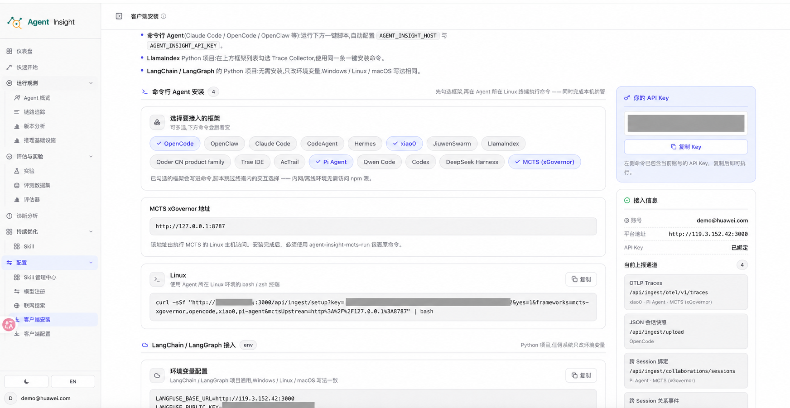
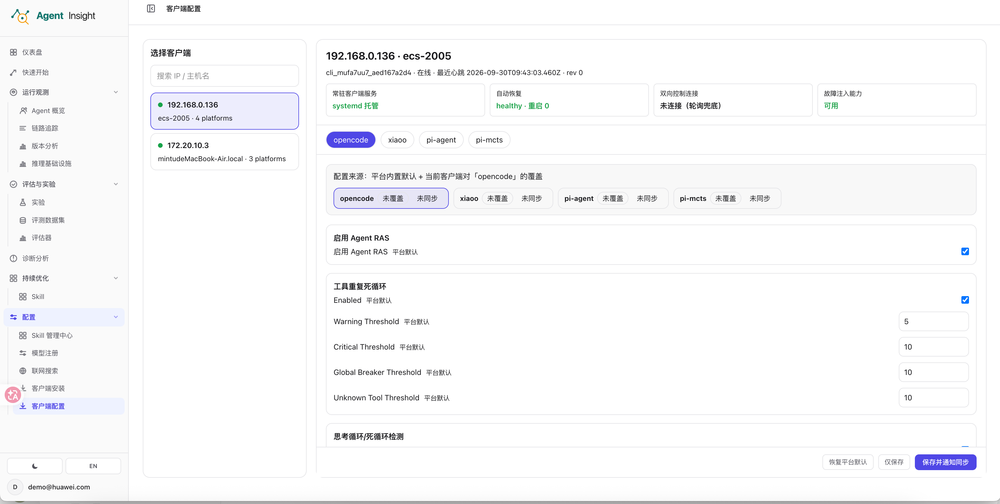
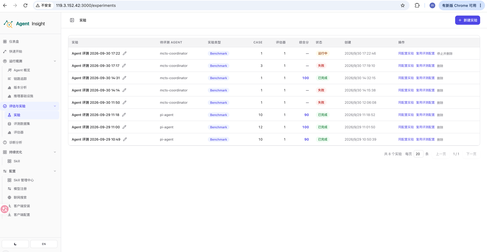
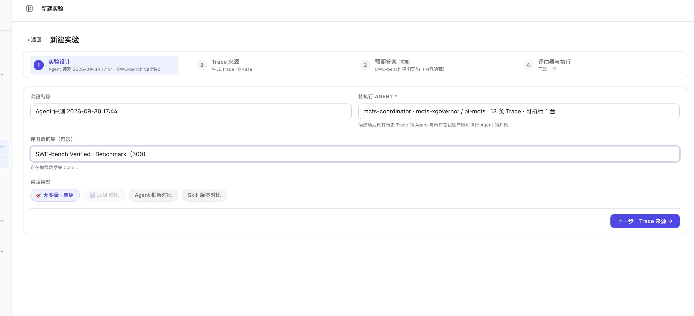
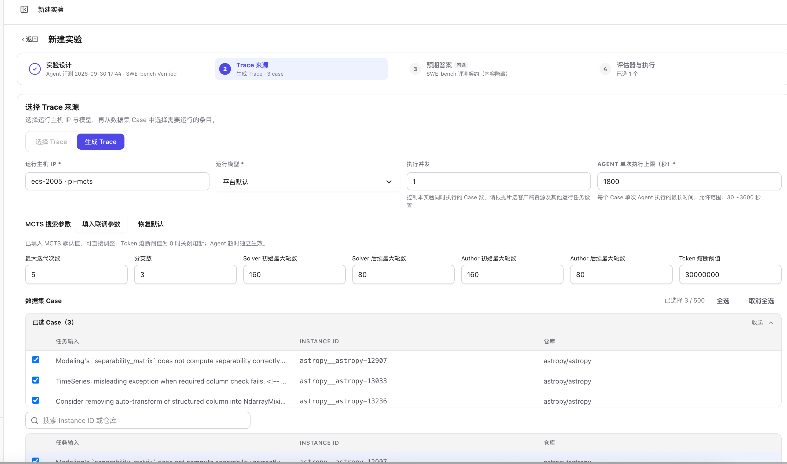
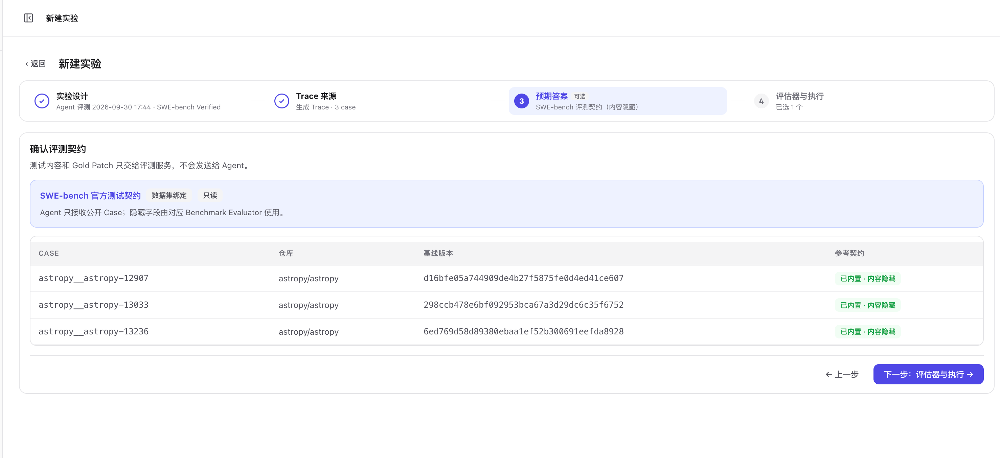
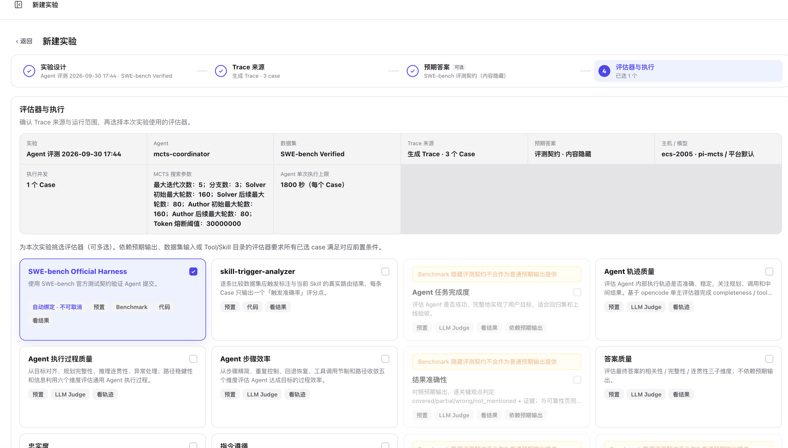
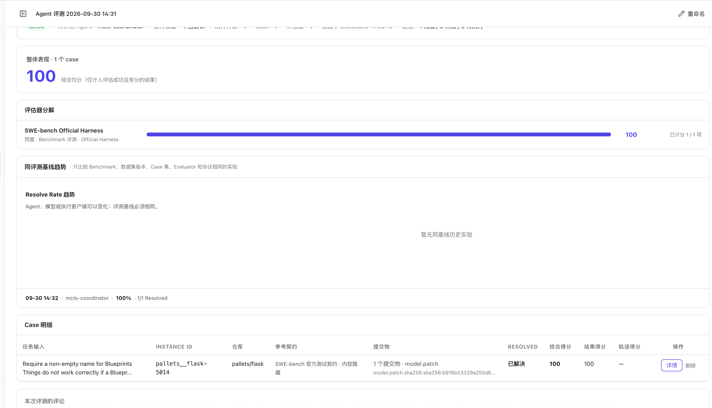
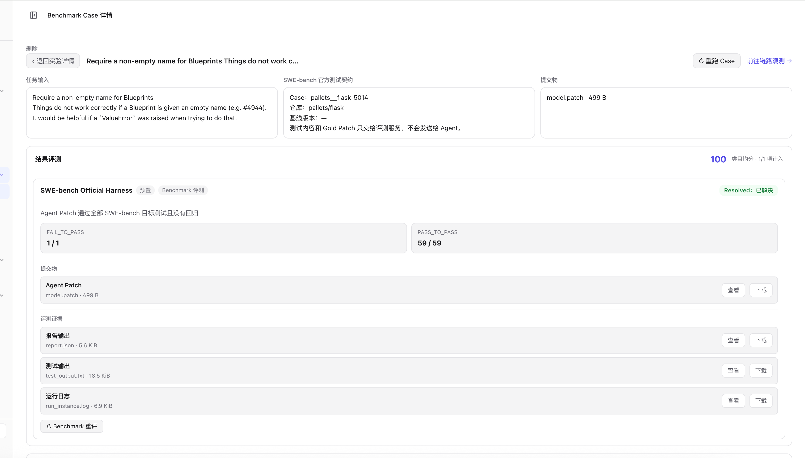
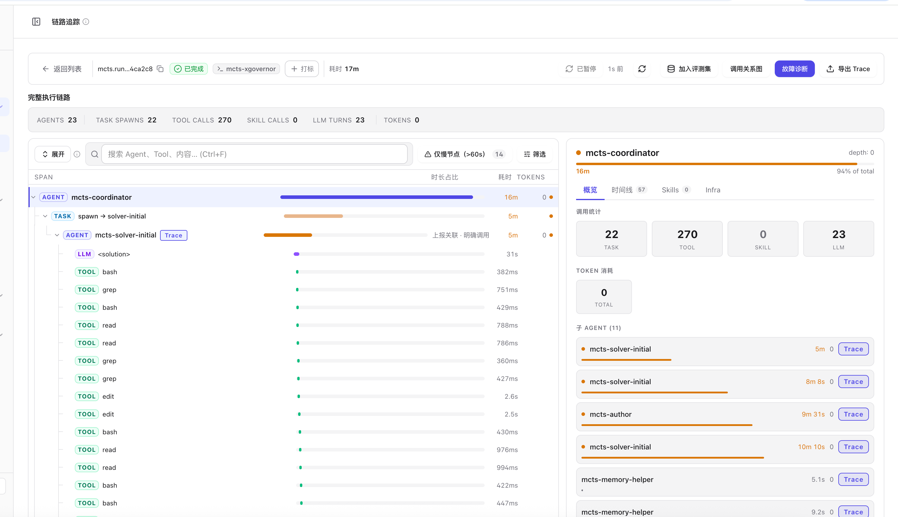

# MCTS 实验用户使用说明书

适用于已部署 MCTS 和 xGovernor 的使用者。**所有终端命令在 MCTS 执行机上执行**；文中及截图中的地址、目录和主机均为示例，请使用自己的配置。

## 1. 接入前准备

- MCTS 原始命令能够正常运行，支持输出目录隔离和中断清理。
- 执行机已安装 Git、Node.js 22.19.0+，MCTS 使用的 Python 3.11+ 环境中已安装 `datasets`。
- 平台已导入 SWE-bench Benchmark 数据集，Benchmark 评测服务可用。

确认平台地址、MCTS 仓库路径及执行机可访问的 xGovernor 地址。`127.0.0.1` 仅适用于 xGovernor 在执行机本机或已有本地转发的情况。模型和 E2B 凭据由 xGovernor 部署者配置，详见 [Benchmark 服务安装指南](../../developer-guide/benchmark/service-deployment-guide.md#72-接入-pi-mcts-执行器)。

## 2. 执行 curl 安装命令

1. 进入 **配置 → 客户端安装**，勾选 **MCTS (xGovernor)**；只接入 MCTS 时取消其他框架。
2. 填写 **MCTS xGovernor 地址**，点击 Linux 命令区域的 **复制**。
3. 在 MCTS 执行机的终端，以运行客户端的系统账户粘贴并执行整条命令，保留引号和末尾的 `| bash`。



*图 1：安装入口。截图同时勾选了其他框架；API Key 已遮挡，请复制自己页面中的命令。*

命令示例（实际使用页面复制的完整命令）：

```bash
curl -sSf "https://insight.example.com/api/ingest/setup?key=<当前账号的APIKey>&yes=1&frameworks=mcts-xgovernor&mctsUpstream=http%3A%2F%2F127.0.0.1%3A8787" | bash
```

安装器会安装 Trace 采集器并尝试注册常驻客户端，在执行机当前账户下生成 `~/.agent-insight/.env`。若提示“常驻客户端未注册”，按错误提示处理后重新安装；平台执行实验需要客户端在线。

## 3. 配置路径并重启客户端

### 3.1 配置 `.env`

打开执行机上的配置文件，保留原有内容：

```bash
vi ~/.agent-insight/.env
```

增加或更新这一行，将路径替换为自己的 MCTS 仓库目录：

```dotenv
AGENT_INSIGHT_MCTS_REPO_DIR=/opt/MCTS
```

默认使用 `<MCTS 仓库>/.venv/bin/python`，无需手动激活虚拟环境。只有使用自定义安装位置时，才需要增加：

- `AGENT_INSIGHT_MCTS_PYTHON`：仓库外的 Python 解释器绝对路径。
- `AGENT_INSIGHT_MCTS_TRACE_LAUNCHER`：自定义采集器启动文件路径；正常安装无需填写。

若设置了 `AGENT_INSIGHT_HOME`，使用该目录下的 `.env`。

### 3.2 保留采集代理地址

请 MCTS 部署者确认 `testcases_union/config.env` 允许注入代理地址，不能直接覆盖成固定 URL：

```bash
export XGOVERNOR_BASE_URL="${XGOVERNOR_BASE_URL:-http://127.0.0.1:8787}"
```

将默认地址替换为实际 xGovernor 地址，保留原有 token 等配置。

### 3.3 重启并确认在线

按安装器输出的服务方式执行。系统级服务：

```bash
sudo systemctl restart agent-insight-client.service
sudo systemctl status agent-insight-client.service --no-pager
```

用户级服务：

```bash
systemctl --user restart agent-insight-client.service
systemctl --user status agent-insight-client.service --no-pager
```

进入 **配置 → 客户端配置**，确认执行机在线、服务健康，并显示 `pi-mcts`。



*图 2：客户端在线。截图当前打开的是 `opencode` 页签，检查 MCTS 时点击 `pi-mcts`。*

## 4. 创建并执行实验

进入 **评估与实验 → 实验**，点击 **新建实验**。



*图 3：新建实验入口。*

### 4.1 实验设计

填写实验名称，选择 **`mcts-coordinator`**、**SWE-bench Benchmark 数据集**和 **无变量 · 单组**，点击 **下一步**。



*图 4：实验设计。*

### 4.2 Trace 来源与执行参数

选择 **生成 Trace**，运行主机选择配置好的 **`pi-mcts`** 执行机，模型选择 **平台默认**（沿用 xGovernor 配置），勾选要执行的 Case。

首次联调可选择一条 Case、并发设为 `1`，点击 **填入联调参数**；正式实验使用默认搜索参数或按需调整。

- **Agent 单次执行上限**按每个 Case 计时：`900` 秒为 15 分钟，`1800` 秒为 30 分钟。达到上限会中断执行。
- **执行并发**控制同时运行的 Case 数；**分支数**控制一个 Case 内的搜索。
- **Token 熔断阈值**为 `0` 时关闭 Token 熔断，执行超时仍然生效。



*图 5：截图使用默认搜索参数、1800 秒上限和三条 Case。选好后向下滚动，点击“下一步：预期答案”。*

### 4.3 预期答案

确认选中的 Case 和只读测试契约，点击 **下一步：评估器与执行**。无需填写 Gold Patch；隐藏测试与 Gold Patch 不会发送给 Agent。



*图 6：确认评测契约。*

### 4.4 评估器与执行

核对配置摘要，确认 **SWE-bench Official Harness** 已自动绑定。首次联调可只保留该评估器，向下滚动后点击 **开始实验**。



*图 7：核对配置并开始实验，按钮位于页面底部。*

## 5. 查看结果与链路

### 5.1 实验结果

打开实验详情查看进度和 Case 结果。**已完成**表示评测流程完成，是否解决任务以 **Resolved** 为准；执行失败时点击 Case 的 **详情**查看错误。



*图 8：单条 Case 通过评测的结果示例。*

### 5.2 最终 Patch 与评测证据

在 Case 明细点击 **详情**，查看或下载 **`model.patch`**、评测报告和日志。MCTS 从多个分支中选择最终 Patch，客户端自动上传，无需手工提交。



*图 9：提交物、评测证据与右上角链路入口。*

### 5.3 链路追踪

点击 Case 详情顶部的 **前往链路观测**。根 Agent 为 **`mcts-coordinator`**，展开 TASK 和子角色可查看模型、工具调用及耗时。



*图 10：MCTS 执行链路。*

有 Trace 不代表已完成提交；确认实验成功时还需检查最终 `model.patch` 和平台评测结果。

## 6. 失败处理与重新执行

| 操作或问题 | 处理方式 |
| --- | --- |
| 找不到 MCTS 执行主机 | 检查客户端在线状态、`.env` 仓库路径和重启结果 |
| `Missing datasets package` | 在 MCTS 实际使用的 Python 环境中安装 `datasets` |
| 没有 MCTS 搜索参数 | 确认选中 SWE-bench 数据集和 MCTS 主机，并更新客户端 |
| `AGENT_TIMEOUT` | 通过 **复用评测配置**增加执行上限，或减小搜索参数后创建新实验 |
| 环境修复后重新执行 | 点击 **重试 / 重跑 Case**，沿用原实验参数 |
| 已有 Patch，评测阶段失败 | 点击 **Benchmark 重评**，使用已有提交物重新评测 |
| 需要中止执行 | 使用平台停止入口；中断时尚未生成 Patch 的 Case 可能没有提交物 |

**Trace 耗时与执行上限的计时范围不同。** Trace 可能未包含首次 xGovernor 请求前的准备时间；Case 总耗时还包含工作区准备和中断清理。判断是否超时，以 Case 的错误说明和配置上限为准。

## 相关指南

- [实验功能说明](./experiments)
- [MCTS xGovernor Trace 接入指南](../observability/mcts-xgovernor)
- [Benchmark 服务安装指南](../../developer-guide/benchmark/service-deployment-guide.md)
