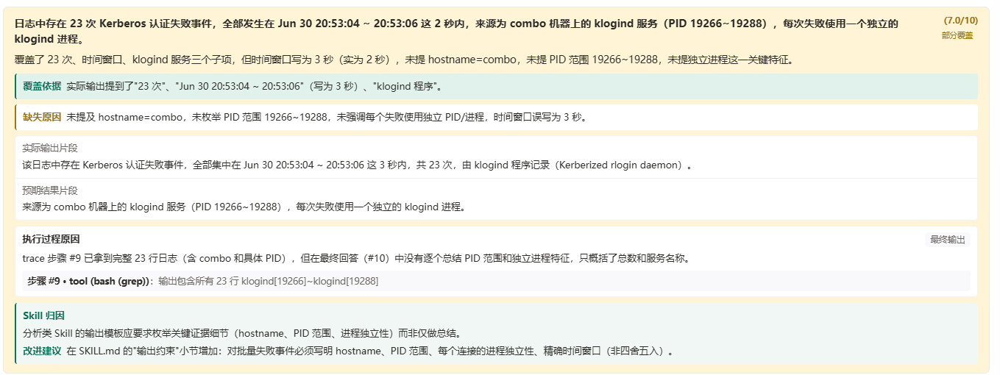
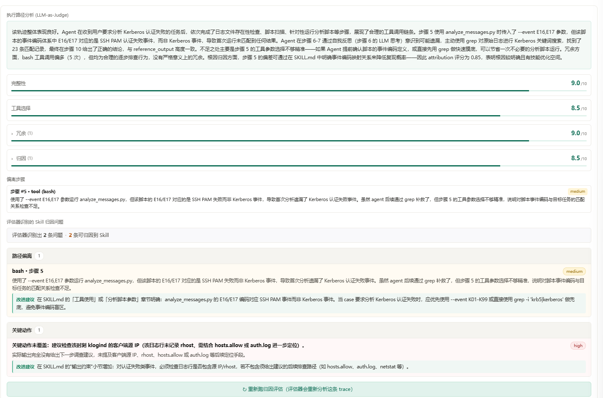

# 评测执行

评测执行页用于**真正跑起来一轮评测**：发起批次、监控进度，并在批次完成后下钻到单条样本，分别从「结果」和「过程」两个视角解读表现。

> **Note**
> 数据集定义「测什么」，评估器定义「怎么判」，评测执行页则把两者组合成一次可运行、可复现、可追溯的实验。

## 功能概览

在这一页，你可以完成评测的完整运行闭环：

- 发起新的评测批次
- 查看历史批次及其状态
- 监控当前批次的运行进度与失败情况
- 下钻到单条样本，查看**结果评测**与**链路评测**结果

当前评测执行页仅展示并调用两个预置评估器：**Agent 任务完成度** 与 **Agent 轨迹质量**。自建评估器仍可在评估器中心维护，但不在评测执行页作为可选项或结果 Tab 展示。

## 前置准备

发起评测前，确保以下三项均已就绪。任意一项缺失或定义模糊，都会导致结果难以解释。

| 准备项 | 作用 | 缺失的后果 |
| --- | --- | --- |
| 数据集 | 提供本次评测的样本 | 无法确定「测什么」 |
| 评估器集合 | 定义评分规则 | 无法确定「怎么判」 |
| 评测对象 | 指定被测的 Agent / 版本 | 无法确定「测谁」 |

## 发起评测

启动一次评测前，建议先明确本次实验的目标，再选择对应的运行方式。

### 先想清楚四个问题

1. **本次要验证什么变化**——是新版本、改了提示词，还是换了工具？
2. **样本是否代表当前问题**——样本应覆盖你真正关心的场景，而非随手抽取。
3. **本次更关注结果还是过程**——决定后续重点看结果评测还是链路评测。
4. **结果将用于什么决策**——例如是否放行发布、是否采纳某次优化。

### 选择运行场景

| 场景 | 目的 | 建议样本 |
| --- | --- | --- |
| 发布前回归 | 确认变更未引入退化 | 一组稳定的核心样本 |
| 优化前基线 | 记录修改前的水平 | 与优化后保持完全一致 |
| 版本对比 | 横向比较不同版本 | 同一数据集、同一评估器 |

## 批次管理

评测执行页以「批次」为单位组织任务。**一个批次代表一次完整实验，而非单条样本**。每个批次包含：

- 当前使用的数据集与评测对象
- 预置评估器集合
- 样本总数
- 运行中、已完成、失败的样本数量
- 当前平均分或阶段性结果

按批次理解结果，可以避免被单条样本的偶然表现误导。

## 运行监控

批次启动后，不必等全部跑完再看。运行过程中重点关注三件事。

### 状态分布

通过各状态的样本数量判断批次健康度：

- `pending`：等待执行
- `running`：正在执行
- `done`：已完成
- `failed`：执行失败

### 完成速度

如果进度长时间停滞，通常指向以下原因：

- 后台执行卡住
- 评测对象不可用
- 评估器或外部依赖异常

### 失败样本

**只要出现明显失败样本，就立即抽样排查**，不要等整批跑完。早期失败往往暴露的是数据集或评估器配置问题，越早发现越省时间。

## 解读结果：先建立整体判断

批次完成后，建议按由粗到细的顺序阅读：

1. 批次整体完成情况(完成 / 失败比例)
2. 平均分与主要失败比例
3. 得分最低的一批样本
4. 是否存在系统性失败模式(同类错误反复出现)

确认整体趋势后，再针对单条样本进入下面两个视角的详细判读。

---

## 结果评测

**结果评测**判断 Agent 的最终输出与预期结果的匹配程度，回答「结果是否覆盖了关键要求」。适用于发布前回归、版本对比和样本级复核。

  

### 卡片字段说明

| 字段 | 含义 |
| --- | --- |
| **分数** | 本次输出的总体质量分，满分 `10` 分 |
| **评级标签** | 覆盖状态，如 **完全覆盖 / 部分覆盖 / 未覆盖** |
| **覆盖依据** | 输出中已命中的关键事实，是得分来源 |
| **缺失原因** | 输出中遗漏、写错或未展开的关键点，是扣分来源 |
| **实际输出片段** | Agent 的真实输出摘录，作为评测原始依据 |
| **预期结果片段** | 标准答案摘录，与实际输出并排比对 |
| **执行过程原因** | 缺陷在执行链路中发生的环节 |
| **trace 步骤** | 关联的具体步骤编号与工具调用，用于回查证据 |
| **Skill 归因** | 仅当 trace 关联 Skill 时展示，说明缺陷是否更可能归属对应 Skill 或提示词约束 |
| **改进建议** | 仅当 trace 关联 Skill 时展示，可直接落地的修正动作，如补充 `SKILL.md` 约束 |
| **结果层问题** | 展示关键观点之外的事实错误、编造内容、冗余或格式问题；这类问题不直接参与关键观点等权算分，但可归因项会进入 Skill 优化点 |

### 推荐判读顺序

1. 看 **分数** 与 **评级标签**，建立整体印象。
2. 看 **覆盖依据**，确认哪些关键点已命中。
3. 看 **缺失原因**，定位本次扣分的主要来源。
4. 对照 **实际输出片段** 与 **预期结果片段**，核实差异是否成立。
5. 看 **执行过程原因** 与 **trace 步骤**，判断缺陷出现在检索还是输出环节。
6. 查看 **结果层问题**，确认是否存在额外事实错误、编造内容、冗余或格式偏差。
7. 如果 trace 关联了 Skill，再看 **Skill 归因** 与 **改进建议**，将问题转化为修复动作；未关联 Skill 的 trace 不展示这些字段，也不会生成 Skill 优化点。

### 结果说明什么

- 高分代表最终输出覆盖了更多关键要求。
- 低分代表输出与参考结果存在明显缺口。
- **覆盖依据 + 缺失原因** 决定结果是否**可解释**。
- trace 关联 Skill 时，**Skill 归因 + 改进建议** 决定结果是否**可转化为 Skill 修复动作**；未关联 Skill 时，结果评测只用于判断输出是否达标。

---

## 链路评测

**链路评测**判断 Agent 的执行轨迹(Trace)是否稳定、合理、可复现，回答「过程是否值得复用」。对于多步 Agent，这一视角通常比单纯的总分更适合定位系统性缺陷。

  

### 一个核心前提

**结果正确 ≠ 过程健康。** 一条 Trace 即使最终完成了任务，仍可能在工具选择、步骤安排或约束遵循上存在缺陷。链路评测的目标不是给一个总分，而是把问题定位到**具体步骤、具体判断、具体改进点**。

### 四个核心维度

| 维度 | 回答的问题 | 分值含义 |
| --- | --- | --- |
| **完整性** | 任务关键目标是否完成 | 高 = 目标大体达成 |
| **工具选择** | 工具类型、参数、调用时机是否合理 | 低 = 方法或参数选择不稳定 |
| **冗余** | 是否存在多余步骤、重复调用或无效消耗 | 高 = 浪费明显，路径不够精炼 |
| **归因** | 问题能否稳定定位到可修复的根因 | 高 = 已收敛到明确根因，适合进入修复 |

> **Warning**
> **冗余维度方向易混淆**：分值越高表示浪费越多(重复调用、无效步骤、额外 token 消耗)，应视为缺陷信号；分值越低代表路径越精炼。

### 其他卡片字段

- **轨迹路径总结**：概括本次执行链路的整体表现。
- **偏离步骤**：列出出现偏差的步骤编号、工具类型与严重级别。
- **路径偏离**：解释具体步骤为何偏离预期路径。
- **关键动作未覆盖**：指出哪些必要动作没有发生。
- **改进建议**：更适合写回 Skill 约束或执行规则的修正建议。

### attribution 数值如何理解

页面同时展示 **归因维度分值** 和 `attribution` 数值，但不展示聚合公式。建议按以下方式理解：

- **归因分值**：表示本次问题是否足够清晰地暴露了根因。
- **attribution 数值**：更适合作为归因强度 / 置信度的归一化表达。
- 分值越高，问题越容易转化为明确的修复动作。
- 分值越低，问题越可能仍停留在现象层，暂不适合直接修改 Skill。

### 推荐判读顺序

1. 看 **轨迹路径总结**，建立整体印象。
2. 看 **完整性、工具选择、冗余、归因** 四个维度分值。
3. 看 **偏离步骤** 中的严重级别，优先处理高严重项。
4. 看 **路径偏离** 与 **关键动作未覆盖**,定位具体问题步骤。
5. 确认 **改进建议** 是否已收敛到明确的 Skill 修改动作。

> **Tip**
> **链路评测** 更适合生成修复动作，**结果评测** 更适合判断输出是否达标。两者结合，既能回答「结果是否正确」，也能回答「过程是否稳定」。

---

## 典型工作流

### 发布前回归

1. 选定一组核心样本。
2. 跑一次完整批次。
3. 对比失败模式是否与历史一致。
4. 据此决定是否允许发布。

### 优化前后对比

1. 先用当前版本跑一次基线。
2. 修改评测对象(版本 / 提示词 / 工具)。
3. 用**同一数据集和评估器**重跑。
4. 对比两次结果，确认是否真实提升。

### 问题定位辅助

1. 在运行观测中找到高价值问题。
2. 将问题整理为数据集。
3. 发起评测。
4. 用结果确认问题是否能被稳定复现。

## 常见误区

- **批次一次开太大**：首轮就难以读懂，建议从小样本开始。
- **跑前没有明确目标**：导致结果无法支撑任何决策。
- **看到平均分就停**：未下钻样本，错过系统性问题。
- **失败后不回看配置**：很多失败源于数据集或评估器本身，而非被测对象。

## 下一步

- 准备更好的样本：[评测数据集](./datasets)
- 理解评分方式：[评估器](./evaluators)
- 继续阅读结果：[结果分析](./analyze-results)
- 先跑一轮最小闭环：[跑通第一次评测](./quickstart)
