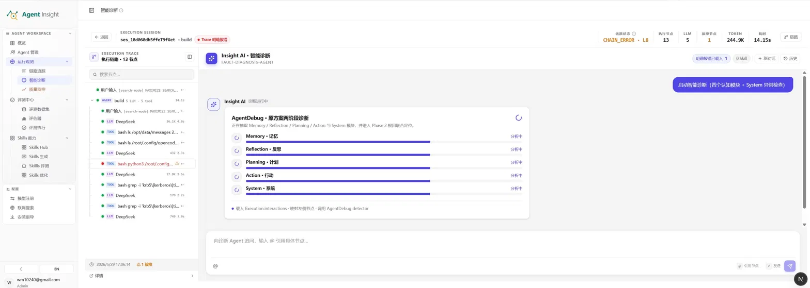
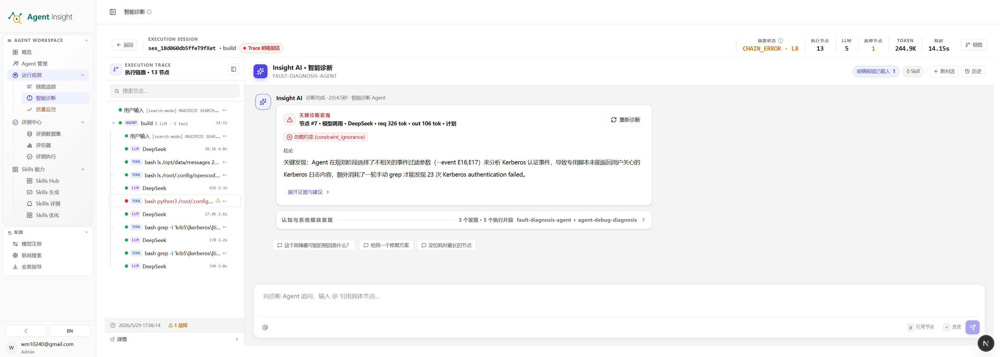

# 智能诊断

智能诊断用于对异常或可疑执行进行结构化归因分析。模块以 Trace、Span、调用链与上下文证据为输入，将"执行结果异常"进一步收敛为三个可回答的问题：问题发生在哪一层、证据来自哪里、建议如何继续处理。

> **Note**
> 智能诊断不是对报错信息的复述，而是对执行证据、问题模块与故障模式的综合判断。它的输出是"带证据的结论"，而非孤立的错误文本。

## 适用场景

智能诊断适用于以下情况：

- Trace 明确失败，但根因尚不明确
- 执行未报错，但结果明显偏离预期
- 多个 Span 同时可疑，需要快速收敛排查重点
- 需要将零散现象整理为可复盘、可流转的问题结论

定位上，智能诊断与相邻能力有明确分工：相较链路追踪，它更偏向"解释问题"而非还原过程；相较评测中心，它更偏向"理解单条执行"而非做离线回归验证。

## 模块构成

智能诊断由六个部分组成，分别承担"建立全貌、索引证据、输出结论、分层归因、核验 Skill 覆盖、沉淀事实"的职责：

- 执行摘要区
- 执行链路与节点列表
- 智能诊断结果区
- Skills 步骤核验区
- 模块级诊断卡片
- 明确报错卡片

  

上图展示了智能诊断刚进入分析阶段时的页面形态：左侧是当前 Execution Trace 的节点列表，顶部是执行摘要与链路状态，中部首先给出 `AgentDebug` 的分层诊断视图，将问题拆解到 `Memory`、`Reflection`、`Planning`、`Action`、`System` 五个诊断维度，为后续根因收敛建立分析框架。

## 三种使用方式

智能诊断共用一套诊断 Skill，但按入口和问题意图走三条路线：

- **一键诊断**：先由 AgentDebug 独立完成五模块诊断并冻结主诊断结论，再运行适用的专项诊断器。随后由同一个 AgentDebug 只判断哪些结果重复或相关；系统代码负责无损合并，主诊断中已经发现的问题不会被删除。
- **普通追问**：沿用当前对话问答，只结合已有报告、Trace 与历史上下文回答，不重新运行五模块。
- **定向查因**：当问题明确包含循环、反复调用、无进展等已注册症状时，在普通追问基础上补跑匹配的专项诊断器，不运行五模块。

重复结果会并入原有诊断卡片，其中的区间、次数、比例和证据节点仍完整保留；不重复的问题也使用同一种诊断卡片展示。页面不显示诊断器来源标签。若问题未命中任何专项诊断器，会自然回到普通追问。

## 功能说明

### 1. 执行摘要区

执行摘要区用于快速建立问题全貌，集中展示当前执行的关键指标：

- **链路状态**：当前链路的总体异常类别，例如 `CHAIN_ERROR`，用于区分质量偏差与显式故障
- **执行节点数**：本次执行涉及的节点总量，反映链路复杂度
- **LLM 轮次**：模型参与次数，用于判断是否存在多轮反复推理
- **故障节点数**：链路中已确认异常的节点数量
- **Token 消耗**：模型资源使用规模
- **总耗时**：整条执行链路的时间成本

该层用于在进入细节前先回答三个判断：当前问题更像质量偏差还是显式故障、是单点异常还是高成本长链路异常、该样本是否值得进入模块级分析。

### 2. 执行链路与节点列表

该区域展示当前 Execution Trace 的完整节点序列，覆盖 LLM、Tool、Skill 与 Agent 等节点类型，并支持：

- 标识失败节点、重试节点与关键路径节点
- 回看诊断结论所引用的原始执行步骤
- 通过搜索与定位快速收敛排查范围

它承担"证据索引"的角色：诊断结论中的每一项问题，原则上都应能回溯到此处的具体节点。

### 3. 智能诊断结果区

诊断结果区是智能诊断的核心输出区域，由诊断 Agent（Insight AI）生成，通常包含：

- **阶段结论**：说明当前正在分析的问题，或已得出的阶段性判断
- **问题卡片**：以结构化形式列出明确问题、故障模式标签（如 `tool_misuse`）、影响说明与建议动作
- **证据摘要**：说明结论所依据的 Trace 事实、工具调用或上下文片段
- **后续操作入口**：将结论转入进一步分析、沉淀或评测流程

结论以结构化卡片而非原始日志的形式呈现，因而更适合用于问题归档、跨团队协作与修复追踪。

启动智能诊断时，AgentDebug 主诊断与 Skills 步骤核验会并行运行。点击启动后，请求只负责创建后台任务并返回运行态，最终结果由页面轮询对应缓存获得。主诊断结果和 Skills 核验结果互不等待：任一分析完成后，页面会先显示对应区块；另一个区块继续保持运行态并在完成后独立刷新。分析过程中切换页面或刷新浏览器后，再次进入同一 Trace 会从缓存恢复 `running` / `done` / `failed` 状态；若本地服务进程在分析中途重启，任务不会继续执行，页面会提示失败并允许重新分析。

### 4. Skills 步骤核验区

Skills 步骤核验区用于判断当前 Trace 是否覆盖对应 Skill 的关键动作。它会展示执行路径分析总结，并将关键动作列表默认折叠；展开后可查看每个动作的覆盖状态、Trace 对比说明与改进建议。

该区块使用 AgentDebug 专用缓存。若当前 Trace 没有可用的 Skills 核验结果，系统不会读取旧诊断报告里的历史嵌入数据，而是允许重新生成。

  

上图展示了诊断进入结果输出阶段后的典型界面。页面会将问题压缩为可复用的结构化结论，包括：

- **问题标题**：对当前最关键故障点的摘要化命名
- **故障模式标签**：例如 `constant_ignorance` 等模式标签，用于标记问题所属类型
- **结论说明**：以自然语言解释问题现象、触发条件与影响范围
- **证据链提示**：指出结论来自哪些执行事实、节点行为或上下文线索
- **后续动作入口**：支持继续做分析、沉淀样本或转入其他处理流程

与初始分层视图相比，结果卡片更强调"最终输出"和"可执行结论"，适合用于问题复盘、跨角色沟通和修复跟踪。

### 5. 模块级诊断卡片

模块级诊断卡片将复杂问题拆分到不同的认知层与执行层，按以下五个维度分别给出状态判断：

- **Memory（记忆）**：上下文记忆是否被正确读取、继承与使用
- **Reflection（反思）**：执行过程中是否进行了必要的自检与纠偏
- **Planning（计划）**：任务拆解是否合理、步骤顺序是否正确
- **Action（行动）**：工具调用、执行动作与操作路径是否正确
- **System（系统）**：环境、配置、权限与平台约束是否构成问题来源

每个模块通常呈现两类状态：**OK** 表示未发现明确问题；**告警或问题计数**表示发现了可确认的问题点。

这种拆分用于回答"问题主要出在哪一层"，避免在复杂链路中只盯住最终报错，而忽略上游真正的行为偏差。关于为何选择这五个维度，详见[诊断维度设计说明](#诊断维度设计说明)。

### 6. 明确报错卡片

明确报错卡片独立沉淀那些在原始执行中已可直接确认的故障事实，例如：

- 工具调用直接报错
- 外部服务返回异常
- 查询结果为空但逻辑继续执行
- 已发生重试、超时或失败传播

该区域的核心价值在于区分两类信息：

- **明确事实**：已在 Trace 中直接出现，可被直接引用
- **智能归因**：系统基于事实做出的结构化解释

在文档撰写与问题复盘中，应优先引用明确事实，再补充智能归因结论。

## 诊断维度设计说明

智能诊断之所以从 Memory、Reflection、Planning、Action、System 五个维度展开，而不是直接定位到报错节点，源于 Agent 故障的一个基本特征：**故障暴露的位置，往往不是故障产生的位置。**

一次失败的工具调用，可能并非工具本身的问题，而是上游"计划错误"或"记忆缺失"传导到执行层后的下游表现。如果只看最终报错，得到的常常是症状，而非根因。

前四个维度共同对应了一个 Agent 的标准认知回路——感知信息、调取记忆、制定计划、执行动作、反思纠偏。它们刻画的是 Agent 的内部行为；System 维度则刻画 Agent 所依赖的外部运行环境。按这一框架拆解，可以带来三个直接收益：

- **区分行为缺陷与基础设施故障**：先判断问题是出在 Agent 的认知行为（Memory/Reflection/Planning/Action），还是出在其运行底座（System），避免将环境问题误判为模型能力问题。
- **将根因定位到责任层而非症状层**：沿认知回路逐层判断，能把"哪里报错"与"哪里出错"分开，定位到真正应当修复的环节。
- **将修复动作映射到正确的处理路径**：Planning 偏差通常指向 Skill 或提示词优化，Action 偏差指向工具与调用方式，System 异常则指向配置与运维。分层判断让结论可以直接转化为可执行的处理方向。

简言之，这五个维度不是对报错信息的分类标签，而是一套沿 Agent 认知回路与运行环境展开的归因坐标系，用于把"执行结果异常"还原为"哪一层的哪种行为导致了异常"。

## 操作流程

### 从链路追踪进入诊断

推荐使用路径如下：

1. 在 [链路追踪](./view-traces) 中选择一条失败、异常或结果偏差的 Trace
2. 进入智能诊断页面，查看顶部执行摘要，建立问题全貌
3. 回看执行链路节点列表，确认诊断样本完整且具备代表性
4. 阅读诊断结果卡片，识别问题模块、故障类型与证据摘要
5. 查看 Skills 步骤核验区，确认当前 Trace 是否遗漏关键 Skill 动作
6. 对照模块级诊断卡片，确认问题集中在哪一层
7. 必要时回到原始 Span 详情复核
8. 决定后续动作：转为评测样本、Skills 优化需求，或进一步故障分析

### 单条样本的阅读顺序

针对单条样本，建议遵循"先看结论、再回查事实"的顺序：

1. 先看链路状态、Token 与耗时，判断问题级别
2. 再看诊断结果卡片，确定系统给出的主结论
3. 再看模块级卡片，理解问题属于 Memory、Planning、Action 还是 System
4. 最后回到节点列表与明确报错卡片，核对原始证据

## 诊断结果解读

一个典型诊断结果通常包含：问题归因、故障模式、引用的证据节点、对应解释，以及后续处理建议。

阅读时，应将诊断结果视为"带证据的问题摘要"，而非最终判决。更合理的用法包括：

- 作为问题优先级排序依据
- 作为回看 Trace 的导览
- 作为修复、复盘与评测设计的输入

## 典型问题类型

### 原始错误类故障

这类问题具有明确失败信号，例如模型调用失败、工具超时、外部服务返回 5xx、权限或参数错误。此类场景下，智能诊断的主要价值是快速定位真正的失败节点，并解释失败是源头问题还是传播结果。

### 效果偏差类问题

这类问题通常没有明确报错，但表现为回答偏离预期、关键步骤遗漏、Skill 触发不稳定或工具调用顺序不合理。此类场景下，智能诊断更重要的价值在于解释"为何当前行为更像问题源头"，而不仅是指出最终结果不正确。

## 常见误区

- 跳过原始 Trace，只阅读诊断文字
- 将诊断结果当作唯一事实，不回查证据节点
- 用单条偶发样本直接下结构性结论
- 将所有问题都归因到 Skill，而忽略模型、工具或系统约束
- 只看模块状态，不结合明确报错与执行上下文

## 关键名词解释

### Execution Session

一次可诊断的执行会话，通常对应一条完整的执行链路或一次任务处理过程。

### Trace

一次执行的全链路记录，覆盖入口请求、节点调用、状态变化与结束结果。智能诊断的所有结论均建立在 Trace 事实之上。

### Span

Trace 中的单个执行节点，可能是一轮模型调用、一次工具调用、一段系统逻辑或一个子任务。

### Insight AI / 智能诊断 Agent

承担诊断分析的智能体（FAULT-DIAGNOSIS-AGENT）。其职责是读取当前 Trace、提取问题模式，并生成结构化解释。

### AgentDebug

面向问题定位的诊断视图与诊断阶段结果，从模块视角判断故障更可能发生的位置，并支持两阶段（模块抽取与根因联合定位）分析。

### Memory / Reflection / Planning / Action / System

用于分层拆解问题的五个维度，分别对应 Agent 认知回路的记忆、反思、计划、行动四个内部环节，以及运行环境层的系统约束。详见[诊断维度设计说明](#诊断维度设计说明)。

### tool_misuse

工具使用方式不当，例如参数选择错误、调用模式不匹配、读取方式不正确或结果解释错误。

### Trace 明确报错

当前执行中已可直接确认的故障事实，是最接近原始现场的证据层信息。

### CHAIN_ERROR

链路层面的异常，意味着问题并非单一输出质量波动，而是执行链中的某个环节发生了显式错误、失败传播或链路中断。

## 配图建议

文档配图建议放置于以下位置：

1. **页面总览图**：置于"模块构成"章节后，用于说明整体结构与六个功能区的关系
2. **诊断结果图**：置于"智能诊断结果区"章节后，用于说明问题卡片、故障标签与建议动作
3. **模块卡片细节图**：置于"模块级诊断卡片"章节后，用于说明 Memory / Reflection / Planning / Action / System 与明确报错卡片

## 下一步

- 查看原始执行链路：[链路追踪](./view-traces)
- 将重复问题沉淀为回归验证：[评测中心](../evaluation/index)
- 处理指向 Skill 的问题：[Skills 评测总览](../skills/evaluation/overview)
- 返回运行观测总览：[运行观测](./index)
