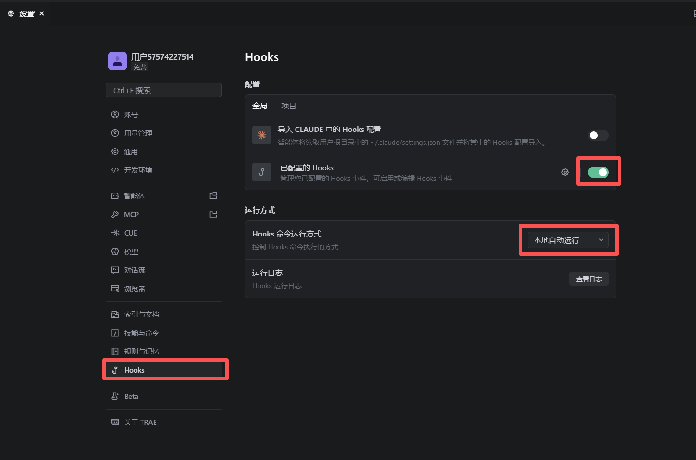
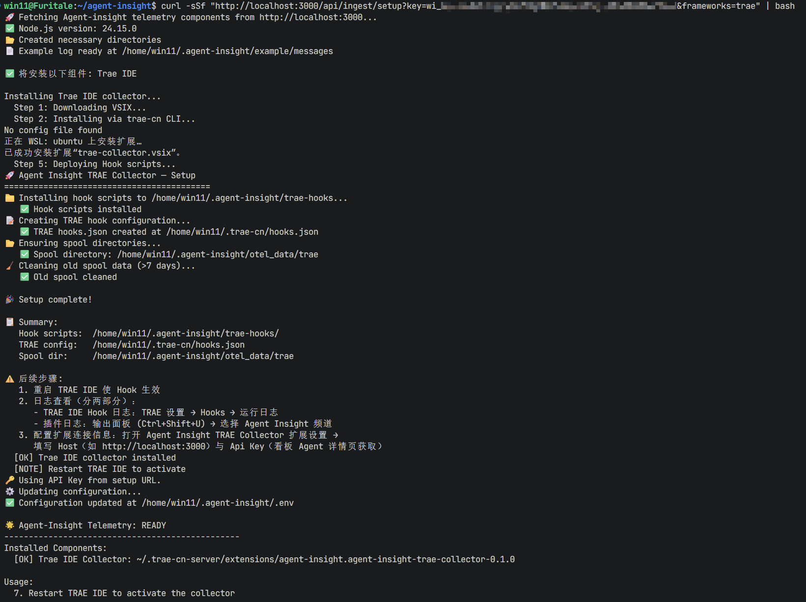
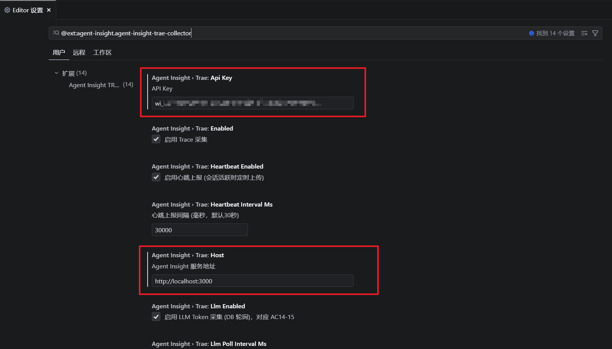
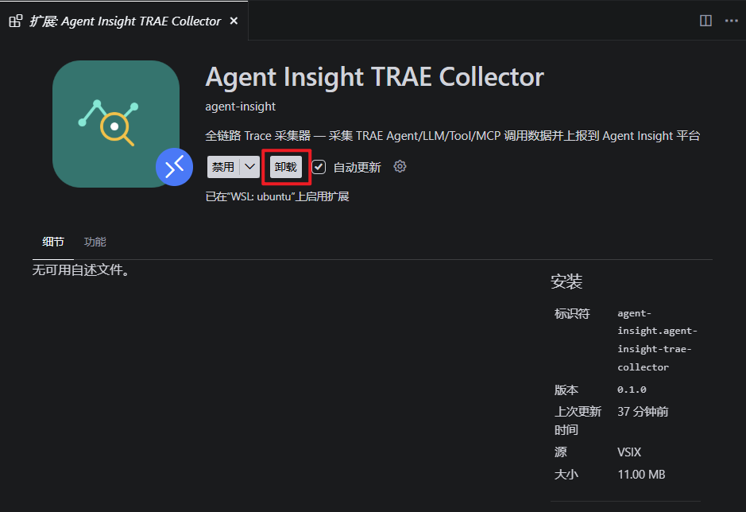

# Trae IDE 接入指南

Trae IDE 通过 VS Code 插件方式接入 Agent Insight 平台。插件安装后自动部署 Hook 脚本，监听 session-start、pre-tool-use、post-tool-use、prompt-submit、stop、subagent-detect 等生命周期事件，实时采集运行数据并上报。

## 前置条件

- 已部署并访问 Agent Insight 看板
- **Trae IDE 版本要求**：需支持 Hooks 机制的版本（TRAE 3.3.83 及以上，具体以 TRAE 官方 Hooks 功能可用为准；可在 TRAE 设置中搜索 `Hooks` 确认功能入口存在）。低于该版本无法采集数据
- 平台服务端与 Trae IDE 所在机器网络互通
- **Trae IDE 需启用全局 Hooks**：在 TRAE 设置中搜索 `Hooks` 并开启**全局 Hooks**（否则 Hook 事件不会触发，插件无法采集数据）

- **Hooks 命令运行方式需设为「本地自动运行」**：在 Hooks 设置中将命令运行环境（ExecEnv）设为 `host`（本地），确保 Hook 脚本在本地环境自动执行、可访问本机 spool 目录；若设为容器/远程环境，脚本将无法写入采集数据



## 接入步骤

Trae IDE 通过统一的 Agent Insight 安装脚本接入。脚本会自动检测操作系统、下载 VSIX 插件并完成安装。

提供**两种安装方式**，任选其一：

- **方式一：服务端安装指令**（适用于平台已部署、仅需安装采集器）
- **方式二：npx 一键部署**（适用于全新部署平台，安装平台时顺带安装采集器）

### 方式一：服务端安装指令（仅装采集器）

适用于**平台服务端已部署**、只需在 Trae IDE 机器上安装采集器的场景。

#### 1. 获取安装命令

进入 **配置 → 安装指导**，在页面上方选择目标运行时后，页面会生成平台专属的安装命令：

- **Linux / macOS**：
  ```bash
  curl -sSf "http://<host>:3000/api/ingest/setup?key=wi_xxxx" | bash
  ```
- **Windows (PowerShell)**：
  ```powershell
  irm "http://<host>:3000/api/ingest/setup?key=wi_xxxx" | iex
  ```

#### 2. 选择 Trae IDE

执行安装命令后，会进入交互式框架选择菜单。在菜单中选择 **Trae IDE**（使用方向键移动，空格选中，回车确认）：

```
Select the frameworks to install (use space to select, enter to confirm):
  [ ] OpenCode
  [ ] Claude Code
  [x] Trae IDE        ← 选中此项
  [ ] Hermes
  [ ] OpenClaw
  [ ] JiuwenSwarm
```

脚本随后会自动下载 `agent-insight-trae-collector-0.1.0.vsix` 并将其安装到 Trae IDE 中（优先使用 `trae-cn` / `trae` CLI 命令注册扩展，若无 CLI 则手动复制到扩展目录）。

终端输出界面：



### 方式二：npx 一键部署（装平台 + 采集器）

适用于**全新部署平台**的场景，通过 `npx agent-insight install` 一键完成「安装平台 → 启动服务 → 安装采集器」全流程：

```bash
npx agent-insight install
```

执行后 install 会依次完成 5 个步骤：

1. 安装 agent-insight npm 包
2. 启动平台服务（默认 3000 端口，被占用时自动切换）
3. 获取 Admin API Key
4. **交互选择安装框架组件**——勾选 **Trae IDE**（↑↓ 移动、空格选中、可多选、回车确认）
5. 添加技能

安装完成后，Trae IDE 采集器与方式一同样部署（VSIX 安装 + Hook 脚本部署），后续**配置插件**与**验证接入**步骤与方式一相同。

> **Note**
> 若平台服务端已部署、仅需补装采集器，无需重跑 install——使用**方式一**（服务端安装指令）即可。

### 3. 配置插件

插件安装完成后，需要在 Trae IDE 中配置平台连接信息：

1. 打开设置：`Ctrl+Shift+,`（macOS: `Cmd+,`）
2. 搜索 `Agent Insight`（或直接打开 **Agent Insight TRAE Collector** 扩展设置）
3. 填入以下配置项：

| 配置项 | 说明 | 示例 |
|--------|------|------|
| `Host` | 平台服务端地址 | `http://localhost:3000` |
| `Api Key` | 平台服务端提供的 API Key（服务端通过 `POST /api/auth/apikey` 签发，`wi_` 开头；本地部署时自动写入 `~/.agent-insight/.env` 的 `AGENT_INSIGHT_API_KEY`） | `wi_xxxx` |

> **Note**
> 如果未在 IDE 设置中配置 Host 和 API Key，插件会尝试从 `~/.agent-insight/.env` 文件读取
> `AGENT_INSIGHT_HOST` 和 `AGENT_INSIGHT_API_KEY` 环境变量。



### 4. 验证接入

1. 在 Trae IDE 中执行一次 Agent 任务，例如输入 `hello` 并等待回复
2. 登录 Agent Insight 看板，进入 **运行观测 → 链路追踪**
3. 确认出现新的 Trace 记录，包含 TRAE 框架标识

如果 30 秒后仍无数据，按以下顺序排查：

1. 查看状态栏中的 Agent Insight 图标是否存在
2. 检查 IDE 输出面板中的 `Agent Insight` 频道日志
3. 确认 `~/.agent-insight/trae-hooks/` 下的 Hook 脚本已正确部署
4. 确认 `~/.agent-insight/otel_data/trae/` 下有 spool 数据产生（Hook 采集成功的标志）

## Hook 事件说明

插件在 Trae IDE 内部署的 Hook 脚本监听以下生命周期事件：

| Hook 事件 | 触发时机 | 采集数据 |
|-----------|----------|----------|
| `session-start` | 新会话开始 | session ID、时间戳、环境信息 |
| `pre-tool-use` | 工具调用前 | 工具名、输入参数 |
| `post-tool-use` | 工具调用后 | 工具名、执行结果、耗时 |
| `prompt-submit` | 用户提交提示词 | 提示词内容（可脱敏） |
| `stop` | 会话结束 | 结束时间、执行摘要 |
| `subagent-detect` | 子 Agent 发起 | 子 Agent 标识、任务描述 |
| `notification` | 系统通知 | 通知内容、级别 |

## 数据局限性

TRAE 通过 Hooks 机制暴露的数据面有限，以下信息**无法从 TRAE 侧直接获取**，平台做了相应兜底处理：

| 缺失数据 | 原因 | 平台兜底 |
|----------|------|----------|
| **模型名称（model）** | TRAE 的 Hook 事件不携带模型信息 | 显示为会话 agent 名 |
| **Token 用量** | TRAE Hook 不暴露 token 计数；本地 LLM 数据库已加密，无法读取真实用量 | 使用 **js-tiktoken（gpt-4o / cl100k_base 词表）** 在插件内做 BPE 计数，上报时标记 `estimated: true` |
| **LLM 调用延迟（latencyMs）** | Hook 事件无 LLM 调用耗时信息 | 占位为 `0`，工具调用延迟（`latencyMs`）为真实值 |
| **工具调用前的中间文本** | TRAE 的 `PreToolUse` / `PostToolUse` 事件仅携带工具名、输入、输出，不含 Agent 输出说明文本 | 无——仅能采集每轮最终输出（`stop` 事件的 `last_assistant_message`） |

> **Note**
> **Token 计算口径**：输入侧包含用户 prompt、工具调用参数与工具调用结果（工具结果会回填给模型作为后续推理上下文，与 LLM API 的 input token 计费口径一致）；输出侧仅统计模型生成的最终输出文本。多轮会话按轮次分别统计，主会话的 token 总数包含其 subagent 用量（与链路追踪详情页树结构口径一致）。
>
> 上述缺失字段均不影响链路追踪的主干数据（会话、工具调用、最终输出、耗时）。

## 数据脱敏

插件内置敏感信息脱敏功能。以下路径的内容会被自动脱敏：

- API Key / Token 字段
- 包含 `password`、`secret`、`credential` 的环境变量
- 符合 AWS / GitHub Token 格式的字符串

脱敏后的内容 `input.sanitized` 会替代原始 `input` 字段上报。

> **Warning**
> 脱敏规则基于正则匹配实现，**不保证 100% 覆盖**所有敏感信息场景。
> 生产环境建议额外在服务端配置脱敏策略。

## 调试

如果遇到数据上报异常，可以使用插件内置的调试视图：

1. 打开命令面板：`Ctrl+Shift+P`（macOS: `Cmd+Shift+P`）
2. 搜索 `Agent Insight TRAE：查看日志`
3. 查看实时事件流、spool 队列状态和上传日志

插件日志输出到 IDE 的 **Agent Insight 频道**（输出面板：`Ctrl+Shift+U` → 选择 `Agent Insight TRAE`）：

> **Note**
> 当前版本日志仅输出到 IDE 输出面板，**不写入本地日志文件**。
> 若输出面板为空，检查插件是否已激活（状态栏图标存在）。

## 卸载

1. 在 Trae IDE 插件市场中找到 Agent Insight 插件
2. 点击 **卸载**
3. 重启 IDE

卸载后 Hook 脚本会被自动清理（VS Code `vscode:uninstall` 钩子执行清理脚本），`~/.agent-insight/trae-hooks/` 目录将被移除。如需完全清理（包括历史 spool 数据与 checkpoint）：

```bash
# 清理 spool 数据、checkpoint、hooks（插件源码自带卸载脚本）
bash scripts/trae-collector/uninstall.sh
# 或手动删除采集数据目录
rm -rf ~/.agent-insight/otel_data/trae ~/.agent-insight/trae_uploader_checkpoint.json
```

> **Note**
> 若在 Extensions 面板卸载后旧数据仍残留（钩子未触发），可手动执行上述清理命令。


