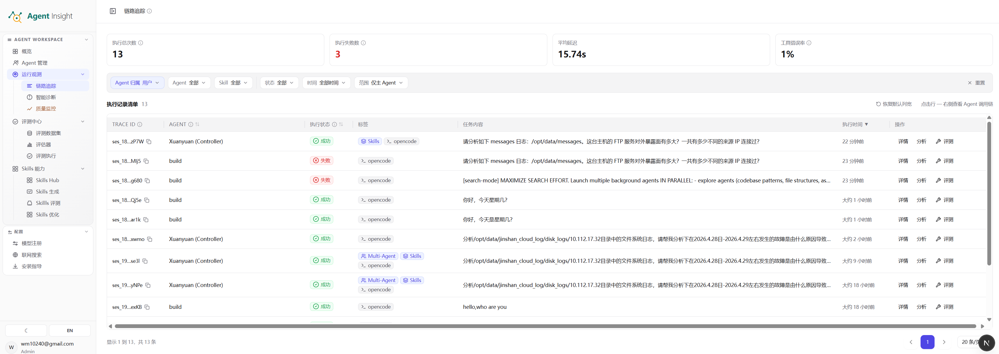
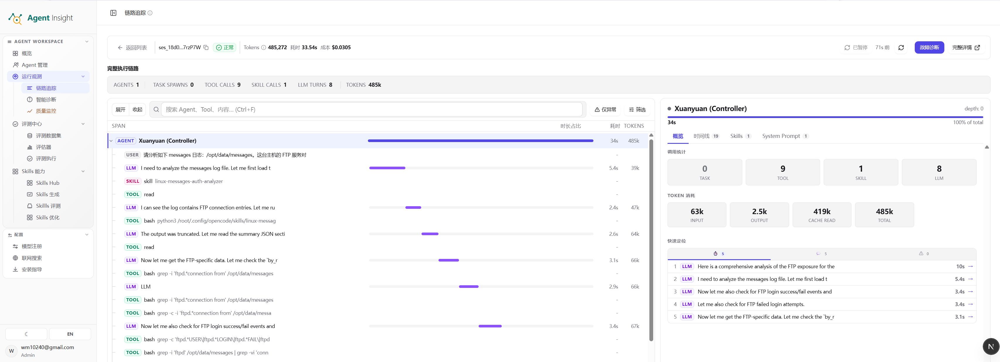

# 链路追踪

链路追踪用于还原一次真实执行从入口到结束的完整过程，是运行观测中最核心的分析入口。无论问题表现为失败、变慢、结果偏差，还是 Token 消耗异常，通常都应先回到 Trace 本身确认事实，再决定是否进入诊断、评测或优化流程。

> **Note**
> 当问题位置尚不明确，或无法判断属于偶发问题还是稳定回归时，链路追踪通常是最合适的起点。

## 这页的核心价值

- 还原一次执行到底发生了什么
- 判断问题出在入口、模型、工具、Skill 还是子 Agent
- 找到最慢、最异常、最值得复盘的关键节点
- 对高价值样本做后续诊断、评测沉淀或优化对照

## 列表页总览

列表页承担“发现样本”和“缩小范围”两类工作，适合先从大量执行记录中筛出值得进入详情的 Trace。

  

上图展示了链路追踪列表页的典型结构：顶部是聚合指标，指标下方是筛选区，中间是执行记录表格，右侧操作列用于继续进入评测、分析或详情页。

### 列表页主要区域

#### 1. 顶部指标卡

顶部指标卡通常用于快速建立整体判断，常见信息包括：

- **执行次数**：当前筛选范围内共命中的 Trace 数量
- **失败次数**：状态为失败或异常的执行数量
- **平均耗时**：筛选结果的平均执行时长
- **工具错误率**：工具调用失败在整体执行中的占比

这一区域更适合回答“最近是否整体变差”“失败是否突然增多”“问题是否集中在某一时间段”。

#### 2. 筛选区

筛选区用于快速收敛问题范围，截图中可见的筛选维度包括：

- **Agent 范围**：区分只看主 Agent、只看子 Agent，或同时查看两者
- **Agent**：按具体执行主体过滤，适合定位到某个注册 Agent
- **Skill**：按 Skill 触发情况收敛样本
- **业务标签**：按用户维护的业务标签收敛样本，例如回归测试、P0、线上复现
- **状态**：优先筛出成功、失败、异常或边界样本
- **时间等附加条件**：用于框定问题发生窗口

其中，**Agent 范围**在多 Agent 场景尤其关键：

- **仅主 Agent**：适合观察入口任务是否正常进入系统
- **仅子 Agent**：适合排查派生任务、分工任务和协作路径
- **主 Agent + 子 Agent**：适合完整回看整条协作链路

#### 3. 执行记录表格

表格是列表页的核心区域，通常包含以下字段：

- **Trace ID**：当前执行的唯一标识
- **Agent**：发起或承载该执行的 Agent
- **执行状态**：成功、失败、运行中等状态结果
- **用户标签**：用户维护的版本标签和业务标签，可在列表内直接添加或移除
- **系统标签**：系统从 Trace 派生的只读标签，例如 Multi-Agent、Skills、SUB 和框架名，默认隐藏
- **任务内容**：本次执行的任务摘要或问题内容
- **执行时间**：发生时间，用于回溯事件窗口
- **操作**：继续进入详情、分析或评测流程

其中，**执行状态**只表示 Trace 生命周期：平台收到明确完成信号后显示成功；尚未收到完成信号时显示运行中。它不等同于评测状态；部分接入会在有最终回答且能从 Trace 时间戳推断完成点时补齐完成时间，例如 Hermes 可使用根 span/交互时间，OpenCode 可使用 `session.idle`；Hermes/OpenCode 的旧记录或漏写完成信号时还会用 60 秒静默窗口兜底，但不会只凭回答文本判定完成。

可将列表页理解为一次“样本筛选台”：先判断哪些 Trace 值得看，再进入详情做证据级分析。

#### 4. 标签与列设置

Trace 列表支持两类标签列：**用户标签**默认显示，用于维护版本标签和业务标签；**系统标签**默认隐藏，只展示由数据派生的只读事实。点击用户标签列中的带加号标签入口可以打开标签编辑器，按“版本 / 业务”分组勾选已有标签，也可以在弹层中快速新建标签并立即绑定到当前 Trace；弹层右上角提供关闭按钮。

右上角的列设置菜单可以显示或隐藏 Trace ID、Agent、状态、用户标签、系统标签、任务内容、Token、时间和操作列；列显隐与列宽会保存在浏览器本地。隐藏用户标签列后，操作列不再展示标签编辑入口；需要继续打标时，请先在列设置中重新显示用户标签列。

#### 5. 版本管理与版本分析

版本标签和业务标签在「配置 / 版本管理」中维护。版本标签用于版本分析的分组维度；业务标签用于链路追踪列表筛选。两类标签都可以从 Trace 列表的用户标签列绑定到具体 Trace。编辑标签会同步影响链路追踪、版本分析和业务筛选中的展示，不会丢失已绑定 Trace；删除标签是硬删除，会移除对应 Trace 绑定，其中版本标签会影响版本分析，业务标签会影响筛选条件。

版本分析位于「观测 / 版本分析」。它只统计 root Trace，只消费版本标签；准确率来自 Execution.answerScore，运行成功率由 Trace 完成状态派生，不是独立存储的 successRate 字段。页面顶端会展示当前 Agent、框架和时间窗口下的版本总览；时间窗口是全局参数，会同时影响顶端统计、版本对比和版本详情。图表默认查看「平均 Token」，指标切换位于图表标题栏右侧；Token 会按 k/M 紧凑展示，时延会按 ms/s/m/h 展示；p95 时延表示 95% 的 Trace 耗时不超过该值，用于观察长尾慢请求。版本对比里的单问题下钻只影响对比图和对比表，不改变顶端总览。页面支持按当前筛选导出聚合数据，版本分析内按业务标签二次过滤仍作为未来优化点保留。

#### 6. 操作入口

截图右侧可见常见操作入口：

- **详情**：进入单条 Trace 的完整执行视图
- **分析**：对异常或可疑样本继续做归因分析
- **评测**：将高价值样本沉淀到后续评测流程

当目标是定位问题原因时，通常先进入 **详情**；当目标是沉淀样本或批量复盘时，再进入分析或评测更高效。

## 详情页总览

详情页承担“还原过程”和“定位原因”两类工作，适合对单条 Trace 做完整复盘。

  

上图展示了详情页的典型结构：顶部是 Trace 摘要与统计指标，中部按标签页聚合不同调用维度，左侧是 Span 列表，中央是时间轴，右侧是当前选中节点的摘要信息。

当 Trace 较长时，页面会先加载节点结构、时间和统计信息；选中具体节点后，再按需加载该节点的完整 message、reasoning、工具输入和工具输出。按需加载只改变加载时机，不会截断或丢弃 Trace 原文；保存 Trace 时仍会导出完整 Session。

任务完成度、轨迹质量等预置评估器生成的 `direct-llm` Trace，会以本次评估模型请求发出前和响应返回后的时间作为起止点。根 Agent、LLM Span、Session 和列表耗时使用同一次请求的时间窗口，因此新产生的评估 Trace 不会再因写库时间代替模型调用时间而显示为 `0ms`。修复前已经保存且缺少原始起止时间的历史 Trace 无法可靠反推真实耗时，不会自动补算。

Langfuse / LangGraph Trace 继续使用原有的 Agent Trace 界面，并把根请求中的用户问题和完整 observation 投影为其中的 USER、AGENT、CHAIN、LLM 和 TOOL 行。CHAIN 保留业务步骤的父子关系和展开层级，不再混入 TASK；点击后可在右侧查看输入和输出。子 Agent 行和右侧“子 Agent”卡片上的 **Trace** 按钮可直接进入该子 Agent 的独立执行详情；目标执行不存在时，页面会提示未找到，而不会继续停留在父 Trace 造成无响应的错觉。平台保留该 trace 中每个 span 的名称、类型、原始父节点、状态、耗时和 token；`summarizer`、业务检索等有正文的节点即使耗时为 0 也会显示。`LangGraph`、`model`、`tools` 等有子节点的重复包装层默认折叠，其可见子节点会提升到最近的业务父节点；没有子节点但包含独立 input/output 的包装节点仍会显示。该展示规则只作用于 Langfuse 数据，不改变其他框架的 Trace。

### 详情页主要区域

#### 1. 顶部摘要区

顶部摘要区通常会集中展示：

- 当前 Trace 的标识信息
- 执行状态
- 总耗时
- Token 消耗
- 成本或资源消耗估算

这一层适合先回答三个问题：

- 本次执行是否成功完成
- 代价是否异常偏高
- 是否值得继续深入查看内部节点

#### 2. 统计标签页

截图中的详情页提供了多个聚合标签页，例如：

- **AGENTS**：参与当前执行的 Agent 数量
- **TASK SPAWNS**：执行过程中派生的新任务数量
- **CHAIN SPANS**：Langfuse Trace 中保留的业务链路节点数量
- **TOOL CALLS**：工具调用次数
- **SKILL CALLS**：Skill 触发次数
- **LLM TURNS**：模型交互轮次
- **TOKENS**：累计 Token 消耗

这些统计用于快速建立问题画像。例如：

- 工具调用过多，常见于流程冗长或工具重试过频
- LLM 轮次偏多，常见于提示不收敛或任务拆分过细
- Token 异常偏高，常见于上下文过长、重复阅读或无效多轮

#### 3. Span 列表

左侧列表按时间顺序展示执行节点。每一行通常代表一个 Span，常见类型包括：

- **AGENT**：Agent 层级的总任务或子任务
- **CHAIN**：Langfuse 采集的业务步骤或链路容器，可继续展开其子节点
- **LLM**：一次模型请求或模型输出
- **TOOL**：一次工具调用
- **SKILL**：一次 Skill 触发

Span 列表适合完成三件事：

- 找到失败或耗时最长的节点
- 判断关键步骤是否按预期发生
- 识别是否出现了多余调用、重复调用或错误分支

#### 4. 时间轴

中间时间轴用于展示各个 Span 的持续时间和前后关系，是判断性能瓶颈与执行顺序的关键区域。

通过时间轴可以快速识别：

- 哪一步耗时最长
- 哪些步骤是串行发生，哪些存在并发
- 问题是从某个单点开始，还是在多处逐渐累积

性能问题通常不应只看最终总耗时，而应优先回到时间轴定位最长的那一段 Span。

#### 5. 节点详情面板

右侧详情面板展示当前选中节点的摘要和核心指标，通常包括：

- 当前节点所属 Agent
- 节点深度与占比
- 该节点下的任务数、工具数、Skill 数、LLM 数
- Token 输入、输出、缓存读取与总量
- 关键步骤摘要

这一面板适合判断当前节点是否就是问题核心，也适合在复杂 Trace 中快速理解“这个节点到底承担了什么职责”。

## 关键功能与名词解释

### Trace

Trace 表示一次完整执行的全链路记录，覆盖从请求进入到最终结束的所有关键过程。一个 Trace 内通常包含多个 Span。

### Span

Span 是 Trace 中最小的可观测执行单元，代表一段具体动作，例如一次模型调用、一次工具调用、一段业务逻辑，或一个子 Agent 任务。

### Agent

Agent 是执行任务的主体。列表和详情中既可能出现主 Agent，也可能出现派生出来的子 Agent。

### 主 Agent / 子 Agent

- **主 Agent**：接收入口请求并承担主流程编排的执行主体
- **子 Agent**：由主流程在执行过程中派生出来、负责局部任务的执行主体

在复杂协作场景中，问题可能并不出在入口主流程，而是出在某个子 Agent 的局部步骤。

### Skill Call

Skill Call 表示某个 Skill 在执行过程中被触发的记录。它反映的是 Skill 是否被调用，以及在整条链路中的位置和作用。

### Tool Call

Tool Call 表示一次外部工具或内部能力调用，例如读取文件、搜索、执行命令或访问外部服务。工具报错、超时和重试通常都应优先回看这一层。

### LLM Turn

LLM Turn 表示一次模型交互轮次，通常包含提示输入与模型输出。轮次过多时，往往意味着任务拆分不合理、决策路径反复或提示不够收敛。

### Token

Token 是模型消耗的计量单位。详情页通常会拆分为输入、输出、缓存读取和总量。高 Token 并不必然代表问题，但通常需要结合耗时、轮次和结果质量一起判断。

### Task Spawn

Task Spawn 表示当前执行过程中派生出的新任务数量。在多 Agent 或多阶段流程中，这个指标有助于识别流程是否出现过度拆分。

## 推荐使用路径

### 场景一：确认接入是否成功

建议顺序：

1. 打开链路追踪列表页
2. 将时间范围收敛到最近一段时间
3. 查看是否出现新 Trace
4. 点入任意一条执行，确认详情页可以展开 Span 和时间轴

该路径适合首次接入后确认“数据是否已进入平台”。

> **Note**
> 通过 OTel `logs` / `traces` 端点接入的数据是异步可见的：端点返回成功表示平台已受理并写入本地 spool（`traces` 支持 OTLP JSON 与 protobuf），后台消费者会在短暂 debounce 后落库，随后在会话空闲后再补充结果评估。因此刚发完上报后，列表页可能需要等待几秒才出现新 Trace，评估分数可能再稍后更新。
> Claude Code 接入需要通过安装脚本生成的 OTel wrapper 开启 `OTEL_LOG_TOOL_DETAILS=1`，并将 `OTEL_LOG_RAW_API_BODIES` 配成 `file:<dir>`。安装脚本还会注册仅供 Claude Code 使用的上下文补传器：主 Agent 每轮结束、子 Agent 结束或本轮 API 失败后会在后台补传系统提示词、hook 上下文、工具输出和子 Agent 映射，不需要执行 `/exit`；`SessionEnd` 仅作为最终兜底。系统提示词会分别归到 root 和对应子 Agent；Trace 列表使用首条真实用户输入，Claude Code 自己的标题生成、输入建议、离开摘要和 Agent 摘要不会显示为业务对话。高频 hook 会先按 Session 合并本地任务并共用一个上传 worker；这能避免 30 个 hook 事件/s 重复拉起进程，但 30 个全新完整 Session/s 是否能实时清空仍取决于网络和服务端容量，出现积压时任务会保留在本地队列等待后续重试。`OTEL_LOG_RAW_API_BODIES=1` 的 inline body 会被 Claude Code 截断到 60 KB，长会话里可能拿不到工具结果正文；`OTEL_LOG_TOOL_CONTENT=1` 只影响 tracing span events，需要启用 traces。
> CodeAgent 接入后重启终端，继续使用原来的 `codeagent` 命令即可；setup 安装的同名函数会自动为该进程注入 OTel 配置。CodeAgent Logs 异步写入 `~/.agent-insight/otel_data/codeagent` 并生成 `framework=codeagent` 的 Trace；其 Traces/Metrics 请求会收到成功响应，但平台不会保存这两类信号。

### 场景二：排查失败问题

建议顺序：

1. 先按状态筛出失败或异常执行
2. 进入详情页，先看顶部摘要区确认失败状态
3. 在 Span 列表中找到最后一个异常节点
4. 结合时间轴和父子关系回溯问题源头
5. 必要时进入 [智能诊断](./diagnosis) 做进一步归因

关键判断点不是“哪里先报错”，而是“哪里最先偏离预期”。

### 场景三：排查慢问题

建议顺序：

1. 在列表页先观察平均耗时和目标时间窗口
2. 找到耗时明显偏高的 Trace
3. 进入详情页，优先查看时间轴中最长的 Span
4. 判断瓶颈属于模型、工具、子 Agent 还是等待链路

慢问题通常不是列表页上的总耗时问题，而是详情页内部某段 Span 的结构性瓶颈。

### 场景四：排查结果偏差问题

建议顺序：

1. 找到看似成功但结果明显异常的 Trace
2. 回看关键 Skill、Tool 和 LLM 节点是否按预期触发
3. 对比输入输出是否出现遗漏、误读或错误分支
4. 再决定是否进入诊断或沉淀为评测样本

这类问题往往不会直接抛错，因此更依赖上下文与执行过程的还原。

## 哪些 Trace 值得重点沉淀

更值得沉淀和复盘的 Trace 通常包括：

- 高频失败样本
- 用户反馈明显但状态显示成功的样本
- 耗时或 Token 明显偏离常态的样本
- 效果特别好的正向样本
- 代表某类边界场景的典型样本

这些样本后续适合用于：

- 转换为评测数据集
- 进入智能诊断做归因对照
- 作为优化前后的基线样本
- 支撑 Skill、流程或提示词优化

## 常见误区

- 只看最终状态，不看中间 Span 和时间轴
- 只分析失败样本，忽略高质量正向样本的参考价值
- 在多 Agent 场景下忽略主 Agent / 子 Agent 范围
- 看到工具报错就停止分析，没有继续回看上游触发条件
- 只关注 Token 总量，不结合轮次、耗时和结果质量一起判断

## 下一步

- 想对异常执行做自动归因： [智能诊断](./diagnosis)
- 想看整体健康趋势： [质量监控](./quality-monitoring)
- 想把典型 Trace 转成数据集： [从 Trace 构建数据集](../evaluation/dataset-from-trace)
- 想回到运行观测总览： [运行观测](./index)

## Trace Bundle 导入与导出

- 在 Trace 详情页点击「导出 Trace」，下载的是版本化 Trace Bundle。即使当前打开的是子 Agent，导出范围仍是根 Trace 与全部子 Agent 节点。
- 在链路追踪列表右上角点击「导入 Trace」，选择平台导出的 JSON 文件。导入上限为 50 MB、500 个执行节点。
- 导入归属当前用户。原 Execution ID、task ID 没有冲突时保持不变；只有目标库中已存在的 ID 才会生成新 ID，并同步改写父子关系与 session 引用。OTel trace/span ID 保持原值。
- 成功弹窗会显示文件名、原 Trace ID、新 Trace ID、节点数和 ID 重映射数量，可直接打开导入后的 Trace。原、新 Trace ID 无论是否发生冲突都会显示；弹窗不展开完整 ID 重映射明细。
- Bundle 只迁移 Trace 展示所需的 Execution、Session 与 interactions；不会迁移用户标签、评测结果、智能诊断报告或基础设施关联，也不会自动触发 LLM 评测。
