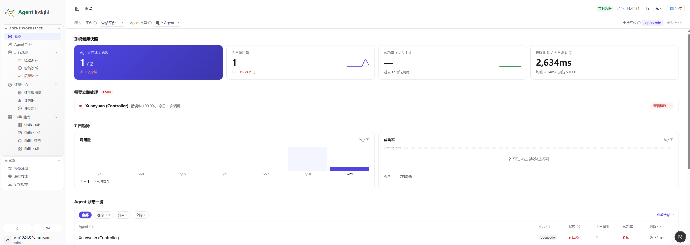
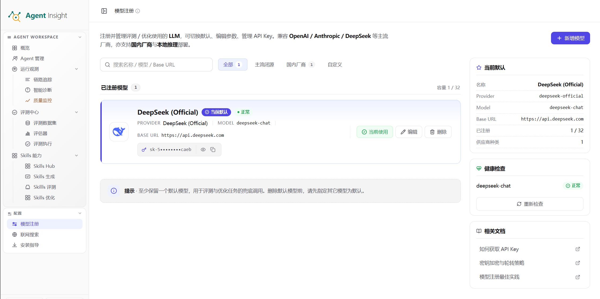
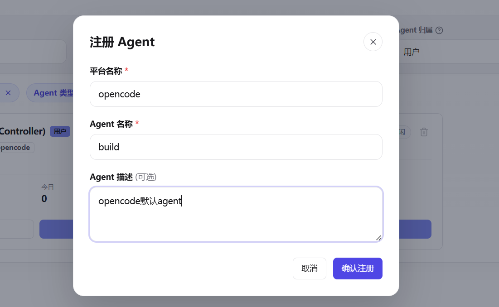
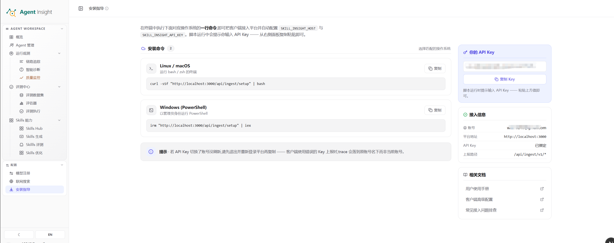
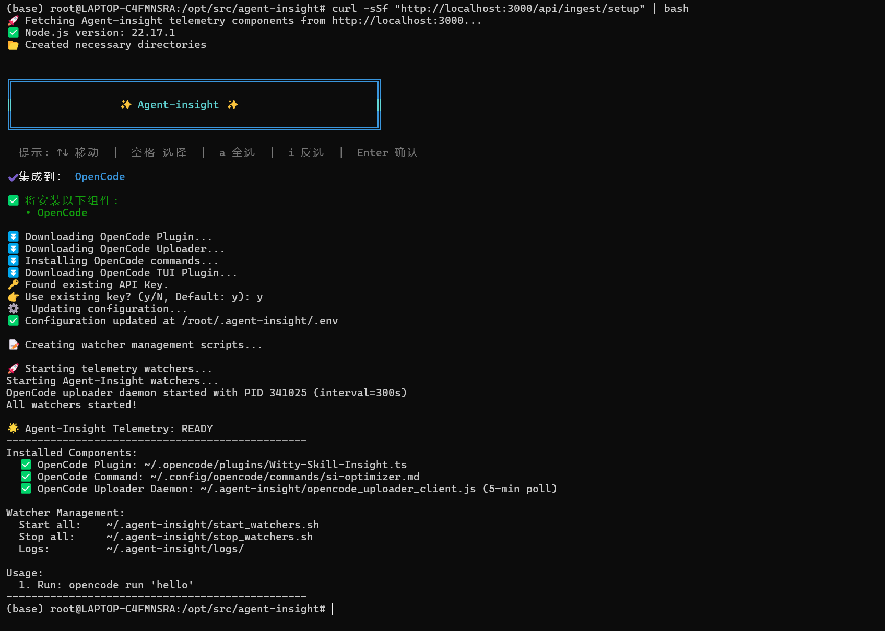
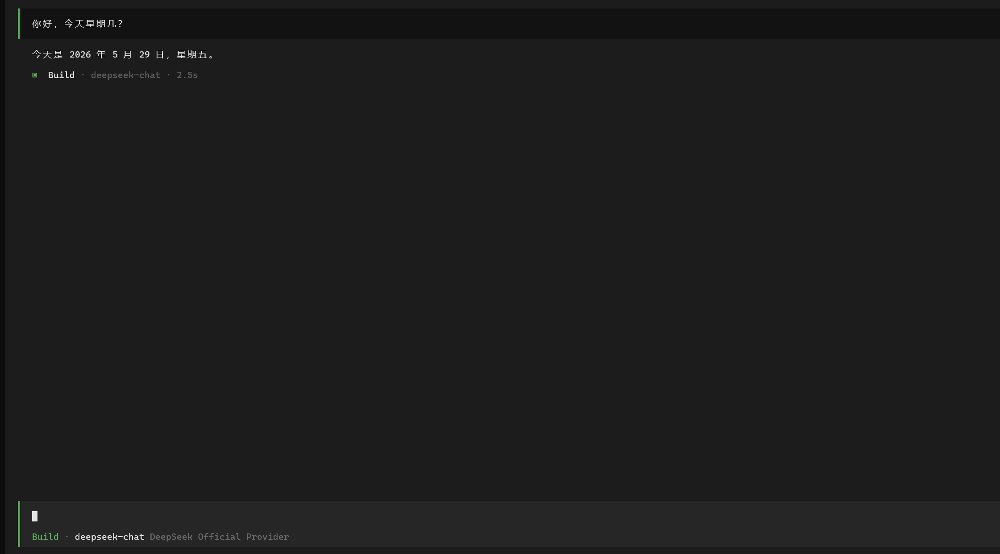
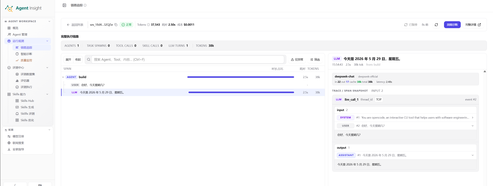

# 5 分钟上手

本指南带你用最短路径跑通 Agent Insight 的第一条完整闭环：完成基础配置、接入一个 Agent，并在平台里看到真实链路。

登录后可直接点击左侧 **快速开始**。页面按 **快速接入、运行观测、评估与实验、诊断分析、持续优化** 五个阶段汇总当前可用入口；下面的步骤是“快速接入”阶段的完整操作说明。

完成后你会得到：

- 一个已登记的 Agent
- 一份可用的模型配置
- 一条真实上报并可查看详情的 Trace

> **Note**
> 本页更贴近当前项目的真实使用流程，默认你已经部署好了 Agent Insight 服务端，
> 并可以访问看板地址，例如 `http://localhost:3000` 或你的自托管域名。

## 前置条件

- 你可以访问 Agent Insight 看板
- 你拥有一个可用的模型 API Key，例如 OpenAI、DeepSeek 或其他兼容供应商
- 你有一个准备接入的 Agent 运行环境
- 如果要走代码集成路径，准备好 Python 3.9+ 或 Node.js 18+

---

## 可选：用 Docker 部署服务端

如果你还没有部署看板，可以直接拉取已发布的 Docker 镜像。`karaggagent/agent-insight` 已发布多架构镜像，`x86_64` 服务器会自动拉取 `linux/amd64`，`aarch64` 服务器会自动拉取 `linux/arm64`。

### 用法一：在线拉取 Docker Hub 镜像

```bash
docker pull karaggagent/agent-insight:latest

mkdir -p ~/.agent-insight/data
chmod -R 777 ~/.agent-insight

docker stop agent-insight 2>/dev/null || true
docker rm agent-insight 2>/dev/null || true

docker run -d \
  --name agent-insight \
  --restart unless-stopped \
  -p 3000:3000 \
  -v ~/.agent-insight:/data/agent-insight \
  karaggagent/agent-insight:latest

curl -i http://localhost:3000/
```

这条命令会把容器内的 `/data/agent-insight` 挂到服务器宿主机当前用户的 `~/.agent-insight`。SQLite 数据库、Skill 附件、评测运行时文件都会写入该目录下的 `data/`，容器重启、删除、重拉镜像后仍可复用。默认数据库路径是：

```text
~/.agent-insight/data/witty_insight.db
```

### 用法二：离线导入 `.tar` 镜像

如果服务器无法访问 Docker Hub，可以先拿到离线镜像包，例如 `agent-insight-0.5.0-image.tar`，再导入运行：

```bash
docker load -i agent-insight-0.5.0-image.tar
docker images | grep agent-insight

mkdir -p ~/.agent-insight/data
chmod -R 777 ~/.agent-insight

docker stop agent-insight 2>/dev/null || true
docker rm agent-insight 2>/dev/null || true

docker run -d \
  --name agent-insight \
  --restart unless-stopped \
  -p 3000:3000 \
  -v ~/.agent-insight:/data/agent-insight \
  karaggagent/agent-insight:0.5.0

curl -i http://localhost:3000/
```

如果 `docker load` 输出的镜像 tag 不是 `karaggagent/agent-insight:0.5.0`，请以 `docker images | grep agent-insight` 看到的实际镜像名为准。

如果你不想直接挂宿主机目录，也可以使用 Docker volume：

```bash
docker run -d \
  --name agent-insight \
  --restart unless-stopped \
  -p 3000:3000 \
  -v agent-insight-data:/data/agent-insight \
  karaggagent/agent-insight:latest
```

如果生产环境需要锁定版本号，可以把 `latest` 换成固定版本，例如 `0.5.0`：

```bash
docker pull karaggagent/agent-insight:0.5.0
docker stop agent-insight
docker rm agent-insight
docker run -d \
  --name agent-insight \
  --restart unless-stopped \
  -p 3000:3000 \
  -v ~/.agent-insight:/data/agent-insight \
  karaggagent/agent-insight:0.5.0
```

服务器上用哪个用户运行 Docker，就会挂载哪个用户的 home 目录。升级到新版本时，保留同一个挂载目录即可，容器数据不会随镜像更新丢失。

### 用法三：挂载源码运行，代码更新后重启即可生效

适用于服务器要跟着最新代码跑的场景：不用每次改代码都重新发 npm 包、重新打镜像，`git pull` 之后重启容器即可生效。

给容器加一个 `AGENT_INSIGHT_SOURCE_DIR` 环境变量，指向挂载进来的源码目录：

```bash
git clone https://gitcode.com/openeuler/agent-insight.git /srv/agent-insight

# 数据目录要在首次启动前建好并交给容器内的 node 用户(uid 1000),否则 prisma 建表会报
# "attempt to write a readonly database"——容器自动创建的挂载目录属主是 root。
mkdir -p ~/.agent-insight/data
chown -R 1000:1000 ~/.agent-insight

docker run -d \
  --name agent-insight \
  --restart unless-stopped \
  -p 3000:3000 \
  -e AGENT_INSIGHT_SOURCE_DIR=/src \
  -v /srv/agent-insight:/src:ro \
  -v ~/.agent-insight:/data/agent-insight \
  karaggagent/agent-insight:latest
```

对应的 compose 写法（`compose.yaml`），镜像构建也可以一并交给 compose：

```yaml
services:
  agent-insight:
    image: agent-insight:src
    build:
      context: /srv/agent-insight              # 用源码仓库根目录的 Dockerfile 构建
      args:
        AGENT_INSIGHT_VERSION: "0.5.4"         # 镜像内预装依赖对应的 npm 版本
    container_name: agent-insight
    restart: unless-stopped
    ports:
      - "3000:3000"
    environment:
      AGENT_INSIGHT_SOURCE_DIR: /src
      NODE_OPTIONS: --max-old-space-size=2048  # 小内存机器上防止构建被 OOM kill
    volumes:
      - /srv/agent-insight:/src:ro             # 源码，只读
      - ${HOME}/.agent-insight:/data/agent-insight
      - agent-insight-build:/app/source        # 构建目录，让缓存跨容器重建保留

volumes:
  agent-insight-build:
```

更新代码的流程：

```bash
cd /srv/agent-insight && git pull
docker compose restart agent-insight   # 非 compose 场景：docker restart agent-insight
docker compose logs -f agent-insight   # 看到 "Building from source..." 到构建结束即可
```

注意用 `restart` 而不是 `up -d`：容器配置没变时 `up -d` 什么都不做，不会触发重新构建。只有改了 `package.json` 依赖、需要连镜像一起重建时才用 `docker compose up -d --build`。

需要了解的行为：

- **不配置 `AGENT_INSIGHT_SOURCE_DIR` 时行为与之前完全一致**，容器直接运行镜像里打好的 `agent-insight` npm 包。
- 配置之后，容器启动时会把源码复制到容器内的 `/app/source`（跳过 `node_modules`、`.next`、`.git`、`data/`、`exclude/`），再依次执行 `prisma db push`、`prisma generate`、`npm run build`，最后和默认模式一样跑 `node .next/standalone/server.js`。宿主机源码目录以只读挂载即可，不会被写入构建产物，也不需要迁就容器里 `node` 用户的属主。
- 依赖用的是镜像预装的那一份（含 `tailwindcss`、`typescript` 等构建期依赖），源码目录不需要 `npm install`。**因此源码改了 `package.json` 新增依赖时必须重新构建镜像**；启动日志会打印镜像里缺失的依赖清单作为告警。
- 首次启动是冷构建，需要几分钟；构建期间端口还没起，容器健康状态显示 `health: starting` 属正常。之后重启会保留 `.next/cache` 走增量构建；容器被删掉重建时，只有像上面那样给 `/app/source` 挂了 volume 才保得住缓存。
- 构建期间服务不可用（分钟级）。不能停机的话，先用另一个端口起一份新容器验证通过，再切端口或流量。
- 路径写错（拼错、忘了挂 volume、误填宿主机路径）时容器会**直接报错退出，不会静默回退到镜像内置版本**。配了 `restart: unless-stopped` 就表现为反复重启，`docker logs` 里第一行就是原因。校验在复制源码之前完成，失败时数据目录和上一次的构建缓存都不受影响。
- 数据目录属主必须是容器里的 uid 1000，且要在**首次启动前**准备好——目录由 Docker 自动创建时属主是 root，`prisma db push` 会报 `attempt to write a readonly database`。
- 这个变量必须通过容器环境变量传入（`-e` 或 compose `environment`），写进 `~/.agent-insight/.env` 不生效——entrypoint 在读取该文件之前就要决定跑哪份代码。

如果容器启动后访问不到 `3000`，先看容器状态和日志：

```bash
docker ps -a --filter name=agent-insight
docker logs --tail=200 agent-insight
curl -i http://127.0.0.1:3000/
```

常见的 `unable to open database file` 通常是宿主机挂载目录不存在或权限不足。确认目录已创建，并且容器内的 `node` 用户可以写入 `/data/agent-insight/data`。

如果你需要自己构建镜像，可以直接用仓库根目录的 `Dockerfile`。镜像默认从 npm 拉取 `agent-insight@latest`，不会把源码复制进镜像：

```bash
docker build --pull --no-cache -t agent-insight:npm-latest .
docker run -d --name agent-insight -p 3000:3000 -v agent-insight-data:/data/agent-insight agent-insight:npm-latest
curl -i http://localhost:3000/
```

需要固定某个 npm 版本时：

```bash
docker build --pull --build-arg AGENT_INSIGHT_VERSION=0.5.0 -t agent-insight:0.5.0 .
```

如果你只是想在服务器上快速验证本地改动，不想每次都先发布 npm 包，可以用上面的[用法三：挂载源码运行](#用法三挂载源码运行代码更新后重启即可生效)，或走“`npm pack` + 上传 `.tgz` + Docker 缓存构建”的测试流程，见 [Docker 测试构建](./docker-testing)。

容器只负责运行 Agent Insight 服务端。OpenCode、Claude Code、OpenClaw、LangChain 等框架的接入命令仍应在对应 Agent 实际运行的机器或容器里执行。当前仓库里的这份 `Dockerfile` 走 **SQLite 优先** 路线，不内置 OpenGauss 运行时依赖。

如果你要使用 `opencode-live` 触发分析、轨迹评测等会由服务端**本机拉起 opencode** 的能力，请确保当前 `Dockerfile` 构建出的镜像完整保留 npm 依赖，并让容器能够访问模型提供商网络；这些评测不会复用外部宿主机上另开的 opencode 进程。

---

## 推荐路径

对于大多数用户，建议按下面顺序操作：

1. 登录看板并进入当前 Workspace

2. 在 **模型注册** 中先配置模型
3. 在 **运行观测 → Agent 概览** 中创建一个 Agent
4. 在 **配置 → 客户端安装** 中完成接入
5. 触发一次真实执行
6. 在 **链路追踪** 中确认第一条 Trace

> **Tip**
> 如果你是开发者，且希望直接在代码里手工埋点，可以直接查看文末的
> “可选：通过 SDK 直接接入” 一节。

---

## 步骤一：登录并确认 Workspace

1. 打开你的 Agent Insight 看板地址。

   <p align="center">
     
   </p>

2. 完成登录，进入默认 Workspace。
3. 确认左侧导航中可以看到以下模块：
   - **快速开始**
   - **运行观测**
   - **Agent 概览**
   - **评估与实验**
   - **诊断分析**
   - **持续优化**
   - **配置**

> **Tip**
> 如果你同时维护开发、预发和生产环境，建议为不同环境分别创建独立 Agent，
> 后续看 Trace 和做评测时会更清晰。

---

## 步骤二：注册第一个模型

进入侧边栏 **配置 → 模型注册**，完成一个可用模型的配置：

1. 点击 **注册首个模型** 或新增模型
2. 选择模型供应商
3. 填入 API Key 与必要的 Endpoint
4. 点击 **测试连接并保存**

   <p align="center">
     
   </p>

完成后，你的 Workspace 就具备了后续执行生成、诊断、评测等能力所需的模型依赖。

> **Warning**
> 如果模型连接失败，先不要继续后续步骤。很多分析、评测和 Skill 流程都依赖模型可用。

---

## 步骤三：注册 Agent

进入侧边栏 **运行观测 → Agent 概览**：

1. 点击注册 Agent
2. 输入 Agent 名称
3. 根据页面提示填写信息
4. 保存后进入 Agent 详情页

   <p align="center">
     
   </p>

注册agent是把客户端实际使用的 Agent 注册到平台。只有注册后的 Agent，平台才会展示它的执行数据。
Agent 名称要和客户端中的实际名称一致，例如 `opencode` 默认的agent是 `plan` 和 `build`。

---

## 步骤四：通过客户端安装完成接入

进入 **配置 → 客户端安装**，按页面提示完成接入。

通常你会完成这些动作：

1. 选择当前环境对应的安装方式，例如 **Linux / macOS** 或 **Windows (PowerShell)**
2. 复制页面生成的安装命令

   <p align="center">
     
   </p>

3. 在 Agent 所在机器上执行该命令
4. 使用右侧显示的 API Key 和接入信息完成配置

   下面以 `opencode` 作为客户端为例：

   <p align="center">
     
   </p>

安装命令会自动写入当前平台地址和 API Key，比手动配置更直接。

你也可以选择 **OpenClaw**。安装脚本会生成一个同名命令包装函数，在调用原始 `openclaw` 命令时注入 OTel 环境变量；OpenClaw 仍直接访问自己的模型供应商，Agent Insight 只接收遥测数据，不代理模型请求。

如果使用 **AcTrail**，先自行完成 AcTrail 安装并启动守护进程，再在安装指导中选择 AcTrail 并于 AcTrail 所在的 Linux/WSL 环境运行 Unix 命令。脚本不会安装或包装 AcTrail，只会生成 `~/.agent-insight/actrail/otel-http.config.toml`，把平台地址和当前用户 API Key 配给 AcTrail 官方 `otel-http` 插件，并持久化加载 `agent-insight.otel-http` 实例。之后继续使用原来的 `sudo actrailctl launch --name <名称> -- <Agent 命令>`；AcTrail 会自动上报。若 AcTrail 使用非默认配置或插件目录，可在运行脚本前分别设置 `ACTRAIL_OPERATOR_CONFIG`、`ACTRAIL_PLUGIN_DIR`。

默认接入使用 OTLP/HTTP JSON：Logs 上报到 `/api/ingest/otel/v1/logs`，Traces 上报到 `/api/ingest/otel/v1/traces`。安装脚本末尾也会输出一份可手动复制的纯配置环境变量块。旧版 watcher 仅作为兼容方式保留；同一 OpenClaw 实例只能选择 OTel 或 watcher 其中一种，避免重复 Trace。


---

## 步骤五：验证生成的 Trace

完成安装或配置后，按下面两步验证是否已生成 Trace。

1. 在 `opencode` 中发送一次真实请求，例如执行一个简单任务，让 Agent 实际运行起来。

   下面以 `opencode` 为例：

   <p align="center">
     
   </p>

2. 回到平台，进入 **运行观测 → 链路追踪**，确认是否出现新的 Trace。

   <p align="center">
     
   </p>

验证时优先确认这些信息：

- 列表里出现新的 Trace 记录
- 能看到执行状态、耗时、Token 等基本指标
- 点进详情后，可以看到 Trace 树和各个 Span
- 如果流程中使用了工具或子 Agent，也能看到对应节点

第一次验证时，不需要追求数据很完整，先确认“**有数据、能展开、能看懂主要步骤**”即可。

确认生成 Trace 后，你就已经完成了平台配置、Agent 注册和接入验证。

> **Warning**
> 如果 30 秒后仍然看不到数据，按下面顺序排查：
>
> 1. 先查看客户端日志文件 `~/.agent-insight/logs/opencode_uploader.log`
> 2. 确认客户端到服务端的网络是否通顺
> 3. 是否选中了正确的 Workspace
> 4. Agent 使用的 API Key / 配置是否来自当前 Agent
>
> 仍无法解决时，可继续参考 [常见问题](./faq)。

## 继续阅读

- 想先看产品整体结构 → [Agent Insight](./home)
- 想补齐基础配置 → [模型注册](./settings/model-registry) / [客户端安装](./settings/access-control)
- 想理解平台核心名词 → [核心概念](./concepts)
- 想继续排查和分析线上执行 → [运行观测](./observability/index)
- 想建立第一套离线评测 → [评估与实验](./evaluation/index)
- 想沉淀可复用能力 → [持续优化 · Skill](./skills/index)
