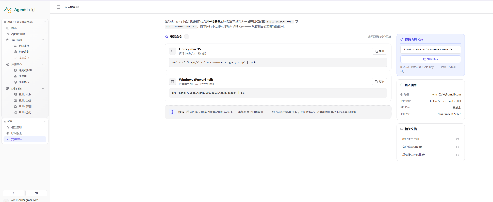

# 客户端安装

客户端安装用于生成客户端接入命令、提供当前账号的接入凭证，并明确平台地址与上报路径，是运行数据能否进入 Agent Insight 的关键配置页面。

> **Note**
> Agent 已完成登记、模型已完成注册，但链路追踪仍无数据时，通常应优先检查安装命令、API Key 归属与上报地址配置。

## 功能定位

客户端安装承担四项核心职责：

- 按目标操作系统生成可直接执行的接入命令
- 提供当前账号对应的 API Key
- 展示服务端地址与上报路径等接入参数
- 为链路采集与数据归属提供统一入口
- 选择 OpenCode 时，在 Agent 主机安装普通观测插件与同进程 Agent RAS

## 页面结构

客户端安装页面通常由四个功能区组成：

1. **常驻客户端区（Agent RAS）**
   生成带一次性令牌的安装命令，安装独立常驻客户端服务。
2. **安装命令区**
   按操作系统展示一键接入命令。
3. **凭证与接入信息区**
   展示当前 API Key、账号信息、平台地址与上报路径。
4. **相关文档区**
   提供 API Key、客户端接入与常见问题的辅助说明入口。

### 常驻客户端区（Agent RAS）

与下方的 Trace 采集器安装是两件不同的事：

| | Trace 采集器 | 常驻客户端 |
|---|---|---|
| 作用 | 上报运行数据 | 接收配置下发、执行受控任务 |
| 形态 | 随 Agent 平台运行 | 独立常驻进程 |
| 守护 | 无 | systemd / launchd 自动重启 |
| 凭证 | 账号 API Key | 设备凭证（一机一把，可单独撤销） |
| 支持平台 | 全部 | 仅 Linux 与 macOS |

点击「生成安装命令」后会得到一条带一次性令牌的命令，**令牌 10 分钟内有效且只能使用一次**；过期或已被使用时需重新生成。

> **Note**
> 安装 Trace 采集器（`/api/ingest/setup`）时会**顺带注册常驻客户端**，本机随即出现在「客户端配置」页。
> 该步骤失败只告警不中断 —— Trace 采集照常工作，只是本机暂时无法在配置页管理；
> 届时按下方命令单独安装即可。

安装完成后客户端会：

- 注册为系统服务，崩溃后由操作系统自动拉起，不随 Agent 平台启停
- 主动建立出站 WSS 控制连接（不监听任何入站端口）
- 自动发现本机 IP、Agent 平台、可用模型并上报
- **同时纳管故障注入能力** —— 本机会一并出现在「实验」与「故障注入」页面，
  无需再单独执行 FI Worker 的安装命令

> **Note**
> 该命令默认会一并安装故障注入组件。若本机没有可用的 Python 环境，安装会跳过这一步并给出提示，
> **客户端仍然正常上线**：实验页能看到本机，只是标记「FI 未就绪」并说明原因（如缺 python3）。
> 装好 Python 后重跑同一条命令即可补齐。
>
> 在 Homebrew / Debian 等「受管控 Python」环境下（PEP 668），全局安装会被系统拒绝，
> 安装器会自动改用独立虚拟环境重试，无需手工处理。

客户端只接受固定动作白名单（配置写入、运行实验 Case 等），服务端**不能**下发任意命令、任意文件路径或任意下载地址。

> **Note**
> 未安装 Python 或故障注入组件的主机同样可以正常上线，只是「故障注入能力」显示为不可用，不影响配置下发与观测。

### 安装命令区

安装命令区通常包含：

- **Linux / macOS 命令**：用于 Bash 环境的一键接入
- **Windows PowerShell 命令**：用于 PowerShell 环境的一键接入
- **Langfuse Python SDK 环境变量**：用于已经接入 Langfuse Python SDK 或 LangChain CallbackHandler 的项目
- **复制按钮**：用于复制对应平台命令
- **说明提示区**：说明命令执行后通常需要输入 API Key，并完成后续初始化

### 凭证与接入信息区

凭证与接入信息区通常包含：

- **当前 API Key 面板**：展示当前账号的接入凭证，并提供复制能力
- **接入信息面板**：展示邮箱、平台地址、API Key 状态与上报路径
- **相关文档面板**：提供 API Key、客户端配置和常见问题说明入口

  

该页面的核心目标是完成“命令生成、凭证提供、地址确认、接入执行”这一最短闭环。

## 关键配置项说明

| 配置项 | 说明 |
| --- | --- |
| **安装命令** | 按目标操作系统生成的接入脚本入口，用于初始化客户端配置。 |
| **API Key** | 当前账号的接入凭证，用于绑定上报身份与数据归属。 |
| **平台地址** | Agent Insight 服务端地址，客户端通过该地址上报执行数据。 |
| **上报路径** | 平台接收链路数据的接口路径，用于确认客户端上报目标。 |
| **当前账号** | 当前登录态对应的用户身份，用于确认数据归属是否正确。 |
| **API Key 状态** | 当前凭证的展示状态，用于辅助判断是否需要重新复制或更新。 |
| **Langfuse 环境变量** | 将已有 Langfuse 上报目标重定向到 Agent Insight；`LANGFUSE_PUBLIC_KEY` 填当前 Agent Insight 用户名，`LANGFUSE_SECRET_KEY` 填该用户的 Agent Insight API Key，二者不对应时平台会拒绝上报；`session_id` 继续按 Langfuse 原语义作为跨 trace 会话归组字段。 |

## API Key 归属机制

API Key 决定客户端上报数据的身份归属与接入上下文。错误的 API Key 或错误的登录态通常会导致：

- 数据归属到其他账号
- 当前 Workspace 无法看到对应 Trace
- 客户端执行正常，但平台侧表现为“未接入”或“无数据”

> **Warning**
> 账号切换后，应重新确认当前登录态、重新复制命令与 API Key，再执行接入流程。旧会话中的缓存信息可能导致凭证混用。

## 操作流程

### 流程一：首次接入客户端

1. 在 [Agent 概览](../agent-management) 中完成目标 Agent 登记。
2. 进入 **客户端安装** 页面。
3. 在安装命令区选择目标操作系统。
4. 复制对应的一键接入命令。
5. 在目标 Agent 所在运行环境执行该命令。
6. 脚本写入当前账号 API Key；选择 OpenCode 时同时安装普通观测插件和 Agent RAS。
7. 触发一次最小执行。
8. 在 [链路追踪](../observability/view-traces) 中确认首条 Trace 是否生成。

接入脚本会绑定生成它的 Agent Insight 服务端版本，不直接跟随 npm `latest`。因此普通
Trace 与 RAS 事件来自同一套客户端组件，并使用同一个账号 API Key。OpenCode 尚未安装时
也可以先执行接入命令；配置和插件会预先落位，之后安装 OpenCode 即可加载。之后重启
Agent Insight 只会同步平台地址；已写入的客户端 API Key 不会被内部 `admin` Key 覆盖。

OpenCode uploader 优先复用常驻客户端 `~/.agent-insight/client/config.json` 中的 `clientId`，用于把 Trace 与正式客户端关联；常驻客户端未安装成功时，才创建兼容身份 `~/.agent-insight/client.json`。Trace 同时保留产生时的 hostname、主机 IP 和服务端观察到的来源 IP。这里没有新增插件或后台进程。

### 流程二：重新部署或迁移客户端

1. 进入 **客户端安装** 页面。
2. 重新确认平台地址与上报路径。
3. 重新复制当前操作系统对应命令。
4. 在新的运行环境执行初始化命令。
5. 使用当前 API Key 完成配置。
6. 触发一次验证执行并观察链路数据是否恢复。

### 流程三：接入已有 Langfuse Python SDK 项目

适用于项目代码已经使用 Langfuse Python SDK、LangChain CallbackHandler 或兼容的 Langfuse OTLP 上报方式。

1. 进入 **客户端安装** 页面。
2. 复制 **Langfuse Python SDK** 区域中的环境变量。
3. 在目标项目运行环境中设置这些变量。
4. 重新运行一次真实 agent 请求。
5. 在 [链路追踪](../observability/view-traces) 中确认是否出现新的 Trace。

Agent Insight 会按 Langfuse traceId 生成执行记录；Langfuse `session_id` 只是跨 trace 的会话归组字段，不参与生成 Agent Insight 执行 ID。Langfuse 兼容上报会校验 `LANGFUSE_PUBLIC_KEY` / `LANGFUSE_SECRET_KEY`：public key 必须是 Agent Insight 用户名，secret key 必须是该用户的 Agent Insight API Key。

### 流程四：排查“无数据上报”

1. 回到客户端安装页确认当前账号、API Key 与平台地址。
2. 确认执行命令的机器就是目标 Agent 实际运行环境。
3. 确认客户端已完成至少一次真实执行。
4. 确认服务端地址与上报路径可达。
5. 进入链路追踪确认是否已有新 Trace 写入。

## 维护建议

### 环境隔离

开发、测试、生产环境建议分别完成独立接入，并为 Agent 使用清晰的环境命名，避免接入配置混用。

### 凭证复核

涉及账号切换、客户端重装、环境迁移时，建议重新复制 API Key，而不是复用历史命令或旧凭证。

### 接入验证最小闭环

每次接入完成后，建议立即执行一次最小请求，并在链路追踪中确认首条 Trace 是否成功生成，以缩短排障路径。

## 常见异常

### 命令执行成功，但平台中没有 Trace

常见原因包括：

- 执行环境不是目标 Agent 的实际运行环境
- API Key 错误、过期或归属错误
- 平台地址不可达
- 客户端尚未产生真实执行
- 上报路径配置异常

### 页面中的 API Key 与预期不一致

常见原因包括：

- 登录态已经切换，但页面未同步刷新
- 本地缓存保留了旧账号信息
- 当前工作会话与预期账号不一致

## 下一步

- 完成 Agent 资产登记： [Agent 概览](../agent-management)
- 验证链路是否成功上报： [链路追踪](../observability/view-traces)
- 继续完成整体接入流程： [5 分钟上手](../quickstart)
- 配置后续模型能力： [模型注册](./model-registry)
