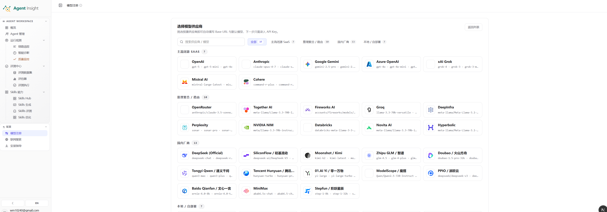
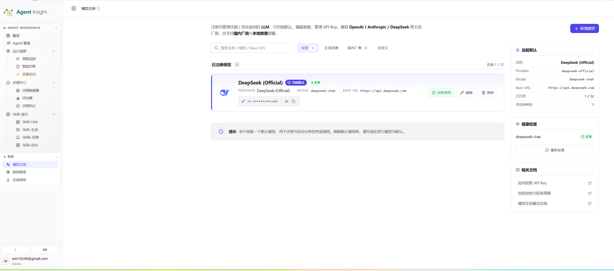

# 模型注册

模型注册用于统一管理平台依赖的外部 LLM 配置，是评测、诊断、Skill 生成与优化等能力的基础配置中心。

> **Note**
> 缺少可用模型时，相关页面虽然可以访问，但批处理评测、智能诊断、Skill 生成与优化等能力无法完成实际执行。

## 功能定位

模型注册承担四项核心职责：

- 维护平台可用的模型供应商与模型实例目录
- 保存 API Key、Base URL、模型名等连接参数
- 指定默认模型，为未显式选型的任务提供兜底配置
- 对已注册模型执行可用性检查，验证连接状态与基础调用能力

## 页面结构

模型注册页面通常分为两个工作面：

1. **模型供应商选择面**
   用于浏览可接入的供应商列表，并发起新增配置。
2. **已注册模型管理面**
   用于查看当前模型卡片、默认状态、连接健康度与相关操作。

### 模型供应商选择面

该工作面用于确定供应商来源与新增入口，通常包含：

- **搜索框**：按供应商名称或模型名称检索候选项
- **分类筛选**：按全部、主流闭源、国内厂商、自定义等类别筛选
- **供应商卡片区**：展示支持接入的供应商及其代表模型
- **近期或常用区域**：承载已接入频率较高或平台优先展示的候选项

  

该阶段的目标是明确供应商类型，并进入具体配置流程。

### 已注册模型管理面

该工作面用于查看当前已接入模型的运行状态与管理信息，通常包含：

- **模型卡片区**：展示名称、供应商、模型名、Base URL、API Key 摘要与状态标签
- **默认模型面板**：展示当前默认模型的核心字段
- **健康检查面板**：展示模型连通性或可用状态，并提供重试入口
- **操作按钮区**：提供设为默认、编辑、删除等管理动作
- **相关文档区**：提供 API Key、连接失败排查、模型注册状态说明等辅助入口

  

该阶段的目标是确认模型是否已可用、是否承担默认职责，以及是否满足后续评测与分析任务的运行要求。

## 模型配置项说明

一个模型配置通常包含以下字段：

| 字段 | 说明 |
| --- | --- |
| **名称** | 便于团队识别与区分用途的业务名称。 |
| **Provider** | 模型供应商，例如 OpenAI、Anthropic、DeepSeek 或兼容接口服务。 |
| **Model** | 实际调用的模型标识，例如 `gpt-4o`、`deepseek-chat`。 |
| **Base URL / Endpoint** | 模型服务地址，用于发送推理请求。 |
| **API Key** | 鉴权凭证，用于访问供应商接口。Local AI 与 Custom（OpenAI Compatible）可留空。 |
| **自定义请求头** | Local AI 与 Custom（OpenAI Compatible）的可选 HTTP Header，可用于 `Authorization`、`X-API-Key`、租户标识等网关鉴权。请求头值按密钥脱敏。 |
| **默认状态** | 表示该配置是否作为当前 Workspace 的默认模型。 |
| **健康状态** | 表示连接检测是否通过，用于判断当前配置是否具备执行条件。 |

## 默认模型机制

默认模型承担平台级兜底职责，通常用于：

- 评测、诊断、分析流程的默认调用
- 新任务未显式指定模型时的默认选择
- 平台自动化能力的基础模型依赖

> **Warning**
> 删除当前默认模型前，应先完成新的默认模型切换。默认模型为空时，部分批处理评测、诊断或优化流程会失去可执行基础。

## 操作流程

### 流程一：新增模型配置

1. 进入 **模型注册** 页面。
2. 在模型供应商选择面检索目标供应商。
3. 选择目标供应商卡片，进入配置流程。
4. 填写模型名称、模型标识与 Base URL。内置供应商填写 API Key；Local AI 或 Custom（OpenAI Compatible）也可以改用自定义请求头，或连接无需鉴权的本地服务。
5. 保存配置。
6. 返回已注册模型管理面，检查模型卡片与状态标签。
7. 执行健康检查，确认连接可用。

### 流程二：设置默认模型

1. 在已注册模型管理面找到目标模型卡片。
2. 确认模型配置完整且健康检查通过。
3. 执行 **设为默认**。
4. 在默认模型面板确认名称、Provider、Model 与 Base URL 已更新。

### 流程三：更新现有模型配置

1. 在模型卡片区定位目标模型。
2. 执行 **编辑**。
3. 更新模型标识、Base URL、API Key、自定义请求头或业务名称。
4. 保存后重新执行健康检查。
5. 确认状态恢复为可用。

### 流程四：删除旧模型配置

1. 确认目标模型不再承担默认模型职责。
2. 确认没有活跃流程依赖该配置。
3. 执行删除。
4. 回到模型卡片区确认条目已移除。

## 维护建议

### 命名规范

模型名称建议体现职责、来源或环境，例如：

- `openai-default`
- `deepseek-eval`
- `local-vllm-lab`

### 环境隔离

生产模型、评测模型和实验模型建议分开命名与维护，避免误切默认模型或混用凭证。

### 健康检查前置

保存成功不等于配置可用。健康检查通过后，再将该模型投入评测、分析、生成或优化流程，能够显著降低后续执行失败率。

### 默认模型最小保障

建议始终保留至少一个健康状态正常的默认模型，以保证平台关键能力具备稳定兜底配置。

## 常见异常

### 模型已保存，但任务仍无法启动

常见原因包括：

- API Key 不正确或已失效
- Base URL 不可达
- 模型标识与供应商侧实际名称不一致
- 当前任务依赖默认模型，而新配置尚未设为默认
- 健康检查尚未通过，连接仍处于不可用状态

### 默认模型存在，但部分流程调用异常

常见原因包括：

- 默认模型可见，但 API Key 权限不足
- 模型实例名称已变更，旧配置未同步更新
- 供应商接口策略变化，原有 Base URL 失效

## 下一步

- 配置外部检索能力： [联网搜索](./web-search)
- 完成 Agent 接入准备： [安装指导](./access-control)
- 使用模型完成首轮评测： [跑通第一次评测](../evaluation/quickstart)
- 返回用户指南入口： [Agent Insight](../home)
