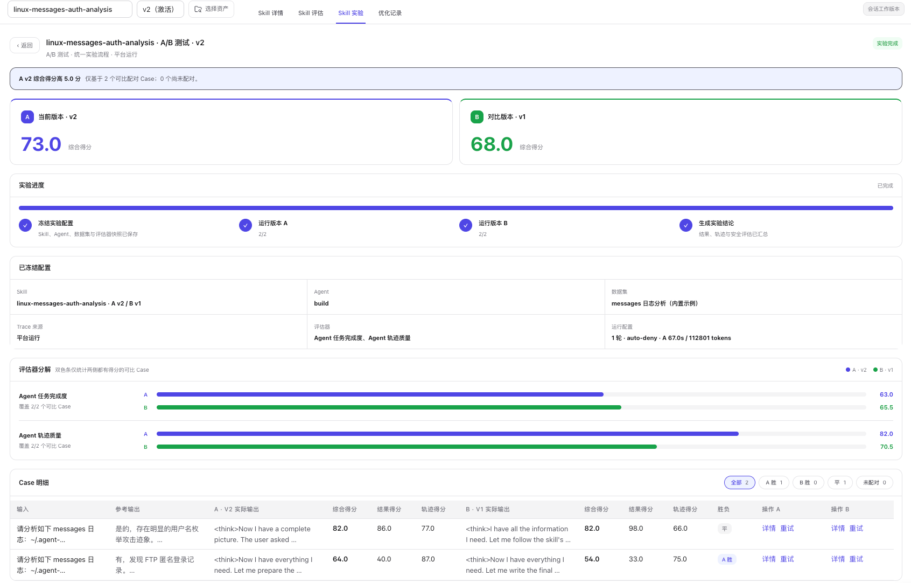

# A/B 测试

A/B 测试用于量化评估某个 Skill 是否真正改善 Agent 表现。系统在同一批样本、同一评估器、同一重复轮次与同一执行环境下，并行运行 **A 对照版本** 与 **B 实验版本**，将 Skill 版本作为实验中的唯一变量，从而把表现差异精确归因到 Skill 本身。

该模块重点回答三个问题：

- 启用 Skill 后能力是否提升
- 启用 Skill 后成本是否可接受
- 启用 Skill 后触发与结果是否稳定

> **Note**
> A/B 测试属于收益验证环节。发布判断通常需要结合 **静态合规分析**、**触发分析** 与 **用例分析**
> 一并解读，避免仅凭单次对照结果做出发布结论。

## 模块定位

A/B 测试承担“用对照实验验证真实收益、识别短板维度、形成发布结论”的职责，适用场景包括：

- 需要验证某个 Skill 版本是否优于无 Skill 基线
- 需要比较两个 Skill 版本的收益与成本差异
- 需要为灰度放量或正式发布提供量化依据
- 需要判断问题出在能力、成本还是稳定性

常见输出结论包括：

- 能力提升明显，可进入后续发布
- 成本增加过高，不适合直接放量
- 触发率不足，实验结果不具备解释性
- 命中 `hard gate`，当前版本应先修正再复测

## 核心术语

| 术语 | 含义 |
|---|---|
| **A 对照版本** | 对照侧版本，用作基线。常见配置为 **无 Skill**。 |
| **B 实验版本** | 实验侧版本，用作待验证对象。常见配置为目标 Skill 版本。 |
| **评测任务** | 当前 A/B 实验的归档容器，用于保存配置、运行记录与后续复测结果。 |
| **重复轮次** | 同一样本重复执行的次数，用于评估波动与稳定性。 |
| **输入来源** | 当前实验样本来源，在 **从数据集发起** 与 **从执行链路发起** 之间切换。 |
| **执行记录** | A 或 B 单侧执行的原始记录，包含过程数据、分数与 session id。 |
| **能力** | Skill 对任务完成质量的提升幅度。 |
| **成本** | Skill 带来的 Token、耗时与步数变化。 |
| **稳定性** | Skill 的触发率与多轮结果一致性。 |
| **综合（短板原则）** | 取 **能力**、**成本**、**稳定性** 三维中的最低分作为综合结论。 |
| **hard gate** | 硬性拒绝阈值。任一关键维度低于阈值时，当前版本直接判为打回。 |
| **可决策** | 当前样本量、执行结果与评分数据已足以输出发布结论。 |

## 页面总览

下图展示 A/B 测试页在完成一次对照实验后的典型结果界面。页面整体按 **配置 → 运行 · A/B 评测 → 测评结果** 三段结构推进。

  

图中各区域的职责如下：

- **顶部上下文区**：显示当前 **Skill**、**版本**、任务状态与阶段进度
- **配置**：设置 **A 对照版本**、**B 实验版本**、**重复轮次**、**数据集**、**评估器**、**输入来源** 与样本勾选
- **执行 A/B 测试**：并行展示 A、B 两组的执行过程数据与单侧评分
- **测评结果**：输出 **综合** 结论、**能力**、**成本**、**稳定性** 三维评分及下一步动作
- **原始数据与计算公式**：展示各维度的原始数据、关键增量与公式拆解

图中实验对象为 `linux-messages-auth-analyzer` 的 `v1`，结果状态为 **可决策**，各维度得分如下：

| 维度 | 得分 | 说明 |
|---|---|---|
| **综合** | **23 / 100** | 取三维最低分，由能力短板决定 |
| **能力** | **22.9 / 100** | 当前短板，命中 `hard gate` |
| **成本** | **69.7 / 100** | 未触发拒绝阈值，也未形成明显优势 |
| **稳定性** | **100 / 100** | 触发与多轮结果均稳定 |

据此可判断：**B 实验版本** 的评测均分低于 **A 对照版本**，即 Skill 在能力维度产生了负向收益；尽管稳定性满分，仍无法抵消能力短板，因此页面命中 `hard gate` 并给出打回结论，提示先修正后 **复测**，当前版本不应直接上线。

## 页面分区功能

### 顶部上下文区

**前提条件**

- 已进入目标 **Skill** 的 **A/B 测试**

**预期结果**

- 页面显示当前实验对象、阶段状态与任务入口

该区域包含以下功能：

- **任务名称**：标识当前 A/B 实验任务，作为配置与结果的归档单位
- **新建任务**：创建新的 A/B 实验任务，并指定任务名称与评估器
- **历史任务**：切换到既往实验任务，恢复其配置与运行记录
- **保存配置**：将当前实验参数固化到任务，避免刷新或切换后丢失
- **复测**：基于当前配置原样重新运行，用于验证修正效果或观察波动
- **A 对照版本**：选择对照侧版本作为基线，通常为 **无 Skill**
- **B 实验版本**：选择实验侧版本作为待验证对象，通常为目标 Skill 版本

### 配置

**前提条件**

- 已创建或选中一个 **评测任务**

**预期结果**

- 页面保存实验参数并进入可执行状态

该区域包含以下功能：

- **重复轮次**：设置同一样本的重复运行次数，轮次越多越能反映结果波动
- **数据集**：选择提供标准输入的实验样本集
- **评估器**：选择本次评分标准，统一 A、B 两组的裁判逻辑
- **输入来源**：在 **从数据集发起** 与 **从执行链路发起** 之间切换样本来源
- **样本列表**：勾选本轮参与对照的样本，决定实际执行规模
- **开始执行** / **重新执行**：按当前配置启动或重启实验；点击后本轮样本立即进入排队或执行状态，不沿用上一轮的成功/失败状态
- **终止**：中断正在运行的实验
- **Agent 最大并发数**：设置并行执行上限，在执行速度与资源压力之间权衡

### 执行 A/B 测试

**前提条件**

- 已完成配置并启动实验

**预期结果**

- 页面持续展示 A、B 两侧的过程数据和单侧评分

该区域包含以下功能：

- **对照组**：展示 A 侧的实时执行状态与汇总结果
- **实验组**：展示 B 侧的实时执行状态与汇总结果
- **Skill 触发**：展示单侧触发率，用于确认 Skill 是否真正参与执行
- **工具调用**：展示单侧工具调用路径，用于对比两侧的行为差异
- **答案准确性**：展示单侧结果的正确性表现
- **耗时**：展示单侧平均耗时，反映时延成本
- **TOKEN**：展示单侧 Token 消耗，反映资源成本
- **评分**：展示单侧综合得分
- **执行记录**：打开单侧原始执行记录列表，可下钻到过程数据与 session
- **评测**：仅对单侧已有执行记录重新触发评分，不会重新执行 Agent；需要完整重跑时使用上方 **重新执行**

### 测评结果

**前提条件**

- A、B 两侧已完成执行并形成评分结果

**预期结果**

- 页面输出可用于发布判断的聚合结论

该区域包含以下功能：

- **综合**：展示按短板原则得出的总判断分数
- **可决策**：标识当前样本量与评分数据是否足以输出发布结论
- **查看 Trace**：打开关键执行链路，用于定位差异来源
- **复测**：按当前配置再次运行，用于验证修正或观察波动
- **能力**：展示 B 相对 A 的结果质量提升或下降幅度
- **成本**：展示 Token、耗时与步数的增量变化
- **稳定性**：展示触发率与多轮结果的波动情况
- **原始数据与计算公式**：展开各维度的原始数据、关键增量与公式拆解

## 操作流程

### 打开 A/B 测试

**前提条件**

- 已完成目标 Skill 的创建或版本生成
- 已进入目标 **Skill** 的目标 **版本**
- 已打开 **Skills 评测总览**

**预期结果**

- 系统打开目标 Skill 的 **A/B 测试**
- 页面显示当前实验对象与版本上下文

**操作步骤**

1. 打开 **Skills 评测总览**。
2. 选择目标 **Skill**。
3. 选择目标 **版本**。
4. 打开 **A/B 测试**。
5. 核对页面顶部的 **Skill** 名称。
6. 核对页面顶部的 **版本** 标识。

**系统反馈**

- 页面标题显示 **A/B 测试**
- 页面显示 **A 对照版本** 与 **B 实验版本**
- 页面显示 **配置**、**执行 A/B 测试** 与 **测评结果**

### 创建或切换评测任务

**前提条件**

- 已进入 **A/B 测试**

**预期结果**

- 当前实验绑定到指定 **评测任务**
- 后续配置、执行记录与复测结果归档到同一任务

**操作步骤**

1. 点击 **新建任务**。
2. 输入 **任务名称**。
3. 选择 **评估器**。
4. 点击 **创建任务**。
5. 或点击 **历史任务**。
6. 选择目标历史任务。
7. 点击 **保存配置**。

**系统反馈**

- 创建成功后，页面显示新的任务名称
- 切换成功后，页面恢复该任务的历史配置
- 保存成功后，当前任务保留最新实验参数

> **Warning**
> 未创建并保存 **评测任务** 时，实验配置无法稳定归档。执行前应先完成任务创建或任务切换。

### 配置 A/B 实验

**前提条件**

- 已进入目标 **评测任务**
- 已确认对照版本与实验版本

**预期结果**

- 当前实验满足执行条件
- 页面进入 **配置完成** 状态

**操作步骤**

1. 选择 **A 对照版本**。
2. 选择 **B 实验版本**。
3. 选择 **重复轮次**。
4. 选择 **数据集**。
5. 选择 **评估器**。
6. 选择 **输入来源**。
7. 勾选目标样本。
8. 设置 **Agent 最大并发数**。
9. 点击 **保存配置**。

**系统反馈**

- 配置满足条件后，页面显示 **✓ 配置完成**
- 样本勾选区显示 **已选样本数：N 个**
- 页面底部显示 `样本数 × 2 组 × 轮次 = 总执行次数`

> **Tip**
> **重复轮次** 为 `1` 时适合快速校验配置。需要评估波动与稳定性时，应提高到多轮运行。

### 从数据集发起实验

**前提条件**

- 已完成实验配置
- **输入来源** 已切换为 **从数据集发起**
- 已勾选至少 `1` 条样本

**预期结果**

- 系统按勾选样本启动 A、B 两侧并行执行
- 页面开始生成执行记录、评分结果与决策结论

**操作步骤**

1. 切换 **输入来源** 到 **从数据集发起**。
2. 选择目标 **数据集**。
3. 勾选目标样本。
4. 点击 **开始执行**。
5. 查看总执行次数。
6. 展开 **执行 A/B 测试**。
7. 查看 A 侧状态。
8. 查看 B 侧状态。
9. 展开 **测评结果**。
10. 查看聚合结论。

**系统反馈**

- 按钮进入 **执行中**
- A、B 两侧状态显示 **执行中**、**评估中** 或 **完成**
- 页面生成单侧 **执行记录**
- 页面在评分完成后显示 **可决策** 或 **等待决策**

### 从执行链路发起实验

**前提条件**

- 已完成实验配置
- **输入来源** 已切换为 **从执行链路发起**
- 已存在可用执行链路

**预期结果**

- 系统基于已有 Trace 复用输入发起 A/B 对照
- 页面生成与真实执行场景更接近的对照结果

**操作步骤**

1. 切换 **输入来源** 到 **从执行链路发起**。
2. 选择目标链路。
3. 勾选目标样本。
4. 点击 **开始执行**。
5. 查看 A 侧执行记录。
6. 查看 B 侧执行记录。
7. 查看单侧评分。
8. 查看 **测评结果**。

**系统反馈**

- 页面按选中链路发起 A、B 两侧执行
- 单侧执行完成后显示 **评分**
- 决策完成后页面显示 **综合** 分数与三维结论

### 阅读测评结果

**前提条件**

- 已完成至少一轮 A/B 实验
- A、B 两侧均已形成评分数据

**预期结果**

- 明确当前版本的收益、成本与稳定性表现
- 明确当前版本是否适合继续发布

**操作步骤**

1. 展开 **测评结果**。
2. 查看 **综合** 分数。
3. 查看 **可决策** 状态。
4. 查看 **能力** 分数。
5. 查看 **成本** 分数。
6. 查看 **稳定性** 分数。
7. 查看 **下一步** 建议。
8. 点击 **查看 Trace**。
9. 点击 **复测**。
10. 展开 **原始数据与计算公式**。

**系统反馈**

- 满足条件后，页面显示 **✓ 可决策**
- 命中阈值时，页面显示 `hard gate`
- 数据不足时，页面提示样本量不足或等待评估完成
- 复测后，页面基于最新运行结果更新结论

## 评分体系

### 三个评分维度

| 维度 | 含义 | 关注指标 |
|---|---|---|
| **能力** | Skill 是否提升任务完成质量 | 评测均分、通过率、`Δscore` |
| **成本** | Skill 是否带来额外消耗 | Token、耗时、步数、`ΔToken` |
| **稳定性** | Skill 是否稳定触发且结果波动可控 | 触发率、方差、重复轮次 |

### 综合判定

页面中的 **综合（短板原则）** 采用以下判定逻辑：

- 综合分取 **能力**、**成本**、**稳定性** 三维中的最低分
- 任一关键维度低于 `hard gate` 阈值时，当前结果直接判为打回
- 样本量不足时，页面不输出发布结论

该机制用于保证收益验证不是单维度高分，而是整体可接受。

### 截图案例判读

回到页面总览中的案例：稳定性满分、成本居中，但能力仅 **22.9 / 100** 并命中 `hard gate`，综合分被拉至 **23 / 100** 而判为打回。这正是短板原则的体现——单一维度高分不足以通过，整体可接受才是发布前提。

这类「能稳定触发但回答质量下降」的结果通常意味着：版本逻辑虽可靠，但实际收益为负，继续放量只会扩大负向影响。下一步应先修正能力短板，再执行 **复测** 验证。

## 指标与字段说明

### 配置区字段

| 字段 | 含义 | 使用方式 |
|---|---|---|
| **A 对照版本** | 对照侧版本 | 作为基线组使用 |
| **B 实验版本** | 实验侧版本 | 作为待验证版本使用 |
| **重复轮次** | 单样本重复运行次数 | 用于观察波动与稳定性 |
| **数据集** | 当前实验样本集 | 提供标准输入 |
| **评估器** | 当前评分标准 | 统一 A、B 两组的裁判逻辑 |
| **输入来源** | 样本来源方式 | 切换数据集或执行链路 |
| **Agent 最大并发数** | 并行执行上限 | 平衡执行速度与资源压力 |

### 执行区字段

| 字段 | 含义 | 作用 |
|---|---|---|
| **Skill 触发** | 单侧触发情况 | 判断 Skill 是否真正参与实验 |
| **工具调用** | 单侧工具路径 | 判断行为差异 |
| **答案准确性** | 单侧结果正确性 | 观察回答质量 |
| **耗时** | 单侧平均耗时 | 观察时延成本 |
| **TOKEN** | 单侧 Token 消耗 | 观察资源消耗 |
| **评分** | 单侧得分 | 观察单侧总体表现 |
| **执行记录** | 单侧原始执行记录入口 | 下钻分析过程数据 |

### 结果区字段

| 字段 | 含义 | 解读方式 |
|---|---|---|
| **综合** | 当前实验总判断分数 | 用于快速判断是否达标 |
| **可决策** | 是否满足输出结论条件 | 判断结果是否具备发布参考价值 |
| **能力** | 结果质量提升程度 | 判断 Skill 是否真正有收益 |
| **成本** | 额外资源消耗水平 | 判断收益是否覆盖代价 |
| **稳定性** | 触发与波动控制情况 | 判断上线风险 |
| **原始数据与计算公式** | 三维评分的拆解细节 | 用于核对评分依据 |

## 结果解读

### 可发布结果

满足以下特征时，当前结果通常可进入后续发布动作：

- **综合** 分数较高
- **能力**、**成本**、**稳定性** 均未触发 `hard gate`
- 样本量达到可解释规模
- 页面显示 **✓ 可决策**

### 打回结果

满足以下特征时，当前结果通常应先回到优化环节：

- 任一维度命中 `hard gate`
- **能力** 明显低于基线
- **成本** 增长明显且未换来正向收益
- **稳定性** 过低或样本波动过大

### 复测闭环

当前结果需要修正时，推荐按以下顺序推进：

1. 记录短板维度。
2. 点击 **查看 Trace**。
3. 分析执行差异。
4. 修正 Skill 版本。
5. 保存新版本。
6. 返回 **A/B 测试**。
7. 点击 **复测**。
8. 对比新旧结果。

## 相关页面职责

- **Skills 评测总览**：汇总四个评测维度的状态、分数与入口
- **A/B 测试**：执行收益验证，对比 A、B 两组并输出发布结论
- **用例分析**：定位具体 case 或 Trace 的结果质量问题
- **触发分析**：验证 Skill 是否在正确场景下触发
- **静态合规分析**：检查 Skill 内容、结构与脚本质量
- **链路追踪**：查看对照组或实验组的执行链路明细
- **Skills 优化**：根据结论修正版本并重新进入复测闭环

## 下一步

- 返回评测总览： [总览](./overview)
- 回看结构问题： [静态合规分析](./static-compliance)
- 进入优化流程： [Skills 优化](../optimize)
