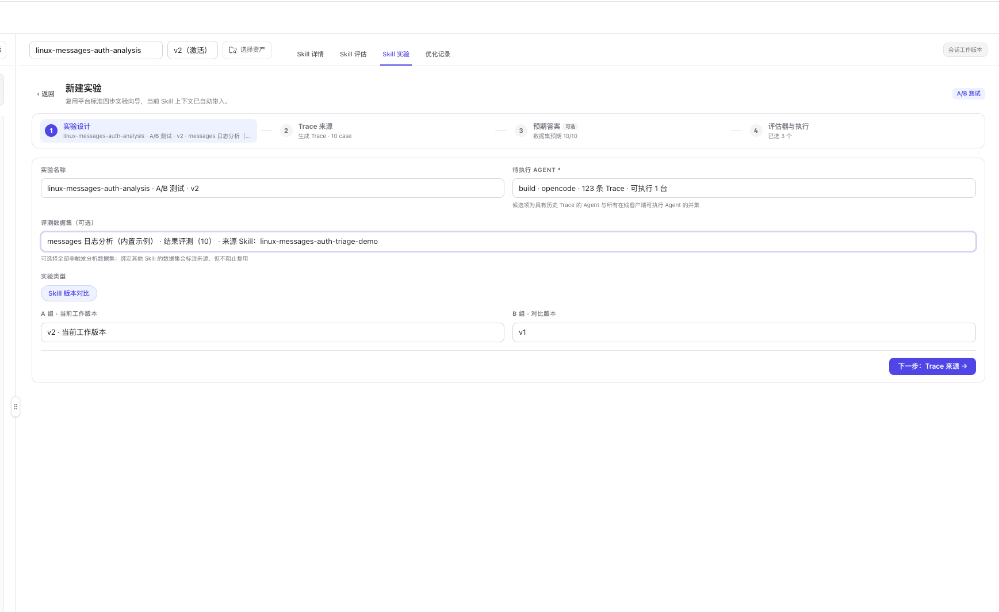

# A/B 测试

A/B 测试用于确认 Skill 版本变化是否真正改善 Agent 表现。系统对同一批 Case 分别运行 A、B 两侧，并只使用能够配对的结果计算分数、评估器差异和胜负。

## 对比对象

在新建版本实验时：

- **A 组**默认是当前工作版本，也可以选择 **无 Skill**作为基线。
- **B 组**选择同一 Skill 的另一个正式版本。
- A、B 不能是同一个版本。

顶部选择的版本决定当前实验记录归属；实验结果会保存具体的 A、B 版本快照。

## 创建版本实验

1. 在工作台顶部选择目标正式版本。
2. 打开 **Skill 实验**。
3. 点击 **新建版本实验**。
4. 选择待执行 Agent和评测数据集。
5. 确定 A 组当前版本或无 Skill基线，以及 B 组对比版本。
6. 在第 2 步选择运行主机、模型和 Case。
7. 检查数据集预期答案。
8. 确认评估器并开始实验。

  

A/B 测试默认生成新 Trace，使两侧在相同 Case 和运行配置下执行。也可以选择已有 Trace 作为输入来源；系统会冻结所选任务输入，再让两个版本分别运行，而不是直接把不同历史 Trace 当作可比结果。

## 默认评估器

版本实验默认带入常用结果与轨迹评估器：

- **Agent 任务完成度**。
- **结果准确性**。
- **Agent 轨迹质量**。

安全类评估器可按需选择。所有选中的评估器会同时作用于 A、B 两侧。

## 结果页

  

页面主要区域包括：

### 对比结论与综合分

顶部说明哪一侧得分更高，以及本次统计包含多少个可比配对 Case。A、B 卡片分别展示两个版本的综合得分。

截图示例中：

- A 为当前版本 v2，综合分 73.0。
- B 为对比版本 v1，综合分 68.0。
- A 高 5.0 分。
- 统计基于 2 个可比配对 Case，没有未配对项。

### 实验进度

依次展示：

1. 冻结实验配置。
2. 运行版本 A。
3. 运行版本 B。
4. 生成实验结论。

两侧结果没有全部完成前，不发布最终胜负。

### 已冻结配置

记录：

- A、B 两侧 Skill 版本。
- Agent 和数据集。
- Trace 来源。
- 评估器。
- 重复轮次、权限策略、耗时和 Token 等运行信息。

### 评估器分解

每个评估器使用双色条对比 A、B 均分。只有同一 Case 的两侧都完成该评估器时，才进入对应统计。

### Case 明细

每条 Case 同时展示：

- 输入和参考输出。
- A、B 实际输出。
- 两侧综合、结果和轨迹得分。
- **A 胜**、**B 胜**、**平**或**未配对**。
- 两侧独立的 **详情**和**重试**操作。

可以使用顶部筛选只查看 A 胜、B 胜、平局或未配对项。

## 可比性规则

最终统计只使用可比配对：

- A、B 来自同一个 Case。
- 两侧都形成可用执行结果。
- 所需评估器在两侧都有可用分数。

未配对项会保留在明细中，但不进入均分和胜负分母。少量可比 Case 得出的领先结论只能作为信号，不应直接当作发布结论。

## 如何判断是否值得发布

建议同时检查：

1. **综合差异**：领先幅度是否有实际意义。
2. **评估器差异**：提升来自结果还是轨迹，是否存在某一维退步。
3. **Case 胜负分布**：领先是否只由单个高分 Case 拉动。
4. **未配对数量**：数据缺口是否影响结论。
5. **运行成本**：耗时和 Token 是否出现不可接受的增长。
6. **重复验证**：在相同数据集与配置下复测是否保持方向一致。

> **Note**
> 当前统一结果页不再使用旧版“能力、成本、稳定性三维短板分”和 hard gate 结论。请以版本综合分、评估器分解、配对 Case 和冻结运行配置为准。

## 下一步

- 返回实验入口：[Skill 评估与实验](./overview)
- 先验证路由边界：[触发分析](./trigger-analysis)
- 深入查看结果与轨迹：[用例分析](./use-case-analysis)
- 根据退步 Case 优化 Skill：[Skill 优化](../optimize)
