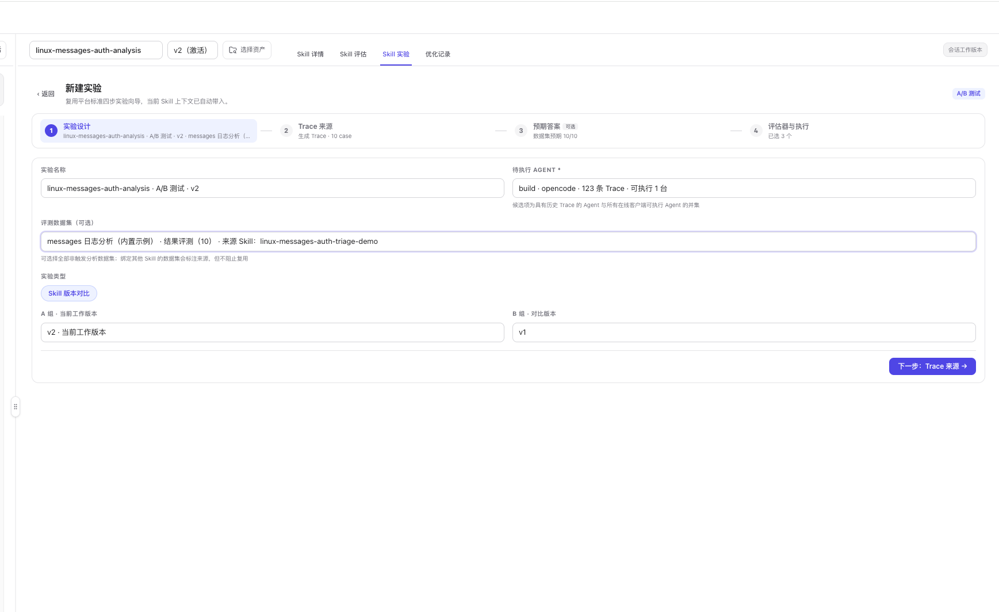
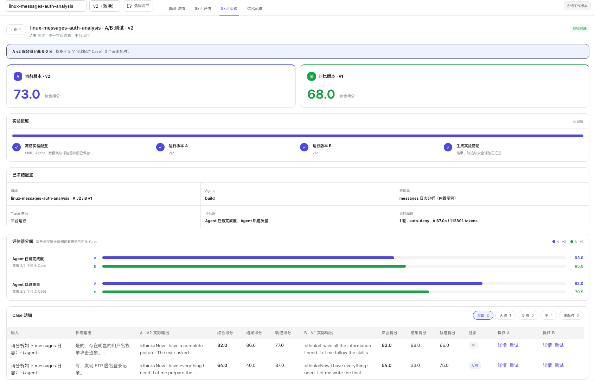

# A/B 测试

A/B 测试用于确认 Skill 版本变化是否真正改善 Agent 表现。系统对同一批 Case 分别运行 A、B 两侧，并只使用能够配对的结果计算分数、评估器差异和胜负。

## 对比对象

实验记录的删除入口位于最右侧“操作”列；结果页中，每个 Case 的删除入口位于最右侧“操作 A+B”列。任一侧仍在运行时显示“停止并删除”，两侧所有轮次结束后显示“删除”。一个 Case 的删除同时涵盖 A、B 两侧及所有重复轮次，其他 Case 继续执行；删除项不参加配对和成绩汇总。远端尚未确认退出时显示“停止待确认”。原数据集、Skill 版本与共享 Trace 保留。

更新客户端后，每侧生成 Trace 的执行状态会保存在执行机上，客户端重启时会核查并清理遗留进程；确认退出后待确认提示自动消失。升级前没有进程记录的历史任务仍须先核查执行机进程。

在新建版本实验时：

- **A 组**默认是当前工作版本，也可以选择 **无 Skill**作为基线。
- **B 组**选择同一 Skill 的另一个正式版本。
- A、B 不能是同一个版本。

顶部选择的版本决定当前实验记录归属；实验结果会保存具体的 A、B 版本快照。

## 创建版本实验

1. 在工作台顶部选择目标正式版本。
2. 打开 **Skill 实验**。
3. 点击 **新建版本实验**。
4. 选择待执行 Agent 和评测数据集。A/B 测试必须选择数据集；有可用数据集时会自动选中第一项，未选中时无法进入下一步。
5. 确定 A 组当前版本或无 Skill基线，以及 B 组对比版本。
6. 在第 2 步选择运行主机、模型和 Case，并设置 **Agent 单次执行上限**。
7. 检查数据集预期答案。
8. 确认评估器并开始实验。

  

A/B 测试默认生成新 Trace，使两侧在相同 Case 和运行配置下执行。也可以选择已有 Trace 作为输入来源；系统会冻结所选任务输入，再让两个版本分别运行，而不是直接把不同历史 Trace 当作可比结果。

两种输入来源都必须选择实际运行主机与模型。A/B 两侧使用同一客户端、Agent 和模型，只改变 Skill 版本；所选模型不可用时直接失败，不回退到服务端默认模型。当前需要支持 Skill 版本快照的新版 OpenCode 客户端，升级后需重启客户端；尚未支持该能力的平台会明确拒绝执行。

每侧、每次执行使用独立工作目录与冻结的完整 Skill 文件快照；无 Skill 对照组不安装 Skill，且禁用 Skill 工具。客户端目前只有一个 Agent 执行槽，同一主机上的两侧与各 Case 排队运行，避免并发冲突。重新执行沿用冻结的目标与快照，重新评测只复用已有 Trace。空输出、模型错误或实际模型不一致时不进行评分。

结果页只保留配置主机与运行模型，不额外展示实际运行主机、实际运行模型或评估模型卡片。后端仍校验 Trace 中的实际模型，缺失或与所选模型不一致时不进入评测。历史配置不一致会明确警告，不能作为所选模型的有效结果；缺少真实执行目标的旧实验应重新创建。

OpenCode 连接故障最多允许一次重试，再次失败或首次错误后 10 秒未恢复有效输出/工具调用就结束当前侧；鉴权/配置错误立即失败，没有明确错误信号则保留默认 90 秒首响应超时。Skill 编排不再叠加客户端执行重试预算，失败侧不会因外层自动重跑而反复等待；另一侧按自身状态正常处理。升级并重启客户端后生效，修复模型配置后可手动重跑失败侧。

每侧执行使用独立原始事件通道，临时插件直接转发当前根 Session 的重试和错误，不依赖 CLI 打印，不修改用户全局配置。OpenCode 最多有 120 秒完成插件初始化并创建根会话，首响应的 90 秒兜底从会话创建后计时；每侧配置的总执行上限仍生效。其他 Session、子 Agent 与用户输入不会被当作当前侧的失败或模型活动。

选择或更换数据集时，第 2 步默认切到 **生成 Trace**。手动切换 Trace 来源后，仅返回步骤不会覆盖该选择。

A、B 每侧的每个 Case 都使用同一个 **Agent 单次执行上限**配置，默认 600 秒，可配置为 30～3600 秒。该上限分别作用于两侧的每次 Agent 执行，不是整个实验的总时长，也不包含后续评估器的运行时间；即使选择已有 Trace 作为输入来源，A、B 仍会重新执行，因此仍需配置该项。

## 选择评估器

进入评估器步骤时默认不勾选任何评估器，请根据本次对比目标自行选择。常用的结果与轨迹评估器包括：

- **Agent 任务完成度**。
- **结果准确性**。
- **Agent 轨迹质量**。

安全类评估器也可按需选择。至少选择一个评估器后才能开始实验，所有选中的评估器会同时作用于 A、B 两侧。

## 结果页

  

页面主要区域包括：

### 对比结论与综合分

顶部说明哪一侧得分更高，以及本次统计包含多少个可比配对 Case。A、B 卡片分别展示两个版本的综合得分。

截图示例中：

- A 为当前版本 v2，综合分 73.0。
- B 为对比版本 v1，综合分 68.0。
- A 高 5.0 分。
- 统计基于 2 个可比配对 Case，没有未配对项。

### 实验进度

按 **用例执行**和**结果评测**分为两组，每组分别展示 A、B 两侧的“已结束 / 总数”。A、B 可以并行执行，不表示先运行 A 再运行 B；每侧总数包含该侧所有重复轮次。进度与汇总统计来自同一次服务端读取，多个评估器不扩大分母，仍有评估器运行的项不会提前算作结束。

100% 表示处理结束，包含失败、未评测和未计分项，不代表全部成功。失败和未计分情况在状态提示与明细中说明；两侧结果没有全部完成前，不发布最终胜负。

结果页顶部按执行项统一展示 **执行成功、执行失败、评测成功、评测失败**。一个 Case 的 A、B 两侧分别算一个执行项，每个执行项对应一个聚合评测项；多个评估器不会扩大评测项总数。执行失败导致未进入评测的项单列为 **未评测**；评估器正常结束但未返回分数的项单列为 **未计分**。明细展示错误码、失败原因或未计分说明；有失败项时，实验结束不会显示为全部成功。

### 已冻结配置

记录：

- A、B 两侧 Skill 版本。
- Agent 和数据集。
- Trace 来源。
- 评估器。
- 重复轮次、权限策略、耗时和 Token 等运行信息。

### 评估器分解

每个评估器使用双色条对比 A、B 均分。只有同一 Case 的两侧都完成该评估器时，才进入对应统计。

### Case 明细

每条 Case 同时展示：

- 输入和参考输出。
- A、B 实际输出。
- 两侧综合、结果和轨迹得分。
- **A 胜**、**B 胜**、**平**或**未配对**。
- 两侧独立的 **详情**和按失败阶段显示的 **重新评测** / **重新执行**操作，以及同时重试当前 Case 两侧的 A+B 操作。

可以使用顶部筛选只查看 A 胜、B 胜、平局或未配对项。

尚未产出得分时，A、B 两侧的得分列分别按实际阶段显示 **等待执行 → 执行中 → 待评测 → 评测中**，不会把 Agent 执行误标为评测。

每一侧都独立判断失败阶段：评估器失败且已有 Trace 时只重跑该侧失败或缺失的评估器；Agent 执行失败或 Trace 不可复用时才重跑该侧 Agent。A+B 同时重试时，A、B 可分别走不同分支，例如 A 重跑 Agent、B 只重新评测。操作涉及已经成功的一侧时会先要求确认。重试期间该 Case 暂时显示为未配对，完成后再按新结果计算胜负；提交失败原因会直接显示在当前行。

删除单个 Case 后，实验记录中的 Case 数减一；A、B 两侧及重复轮次仍统一归属于这一个 Case，原数据集中的 Case 保留。

## 可比性规则

最终统计只使用可比配对：

- A、B 来自同一个 Case。
- 两侧都形成可用执行结果。
- 所需评估器在两侧都有可用分数。

未配对项会保留在明细中，但不进入均分和胜负分母。少量可比 Case 得出的领先结论只能作为信号，不应直接当作发布结论。

## 如何判断是否值得发布

建议同时检查：

1. **综合差异**：领先幅度是否有实际意义。
2. **评估器差异**：提升来自结果还是轨迹，是否存在某一维退步。
3. **Case 胜负分布**：领先是否只由单个高分 Case 拉动。
4. **未配对数量**：数据缺口是否影响结论。
5. **运行成本**：耗时和 Token 是否出现不可接受的增长。
6. **重复验证**：在相同数据集与配置下复测是否保持方向一致。

> **Note**
> 当前统一结果页不再使用旧版“能力、成本、稳定性三维短板分”和 hard gate 结论。请以版本综合分、评估器分解、配对 Case 和冻结的主机 / 模型选择为准。

## 下一步

- 返回实验入口：[Skill 评估与实验](./overview)
- 先验证路由边界：[触发分析](./trigger-analysis)
- 深入查看结果与轨迹：[用例分析](./use-case-analysis)
- 根据退步 Case 优化 Skill：[Skill 优化](../optimize)
