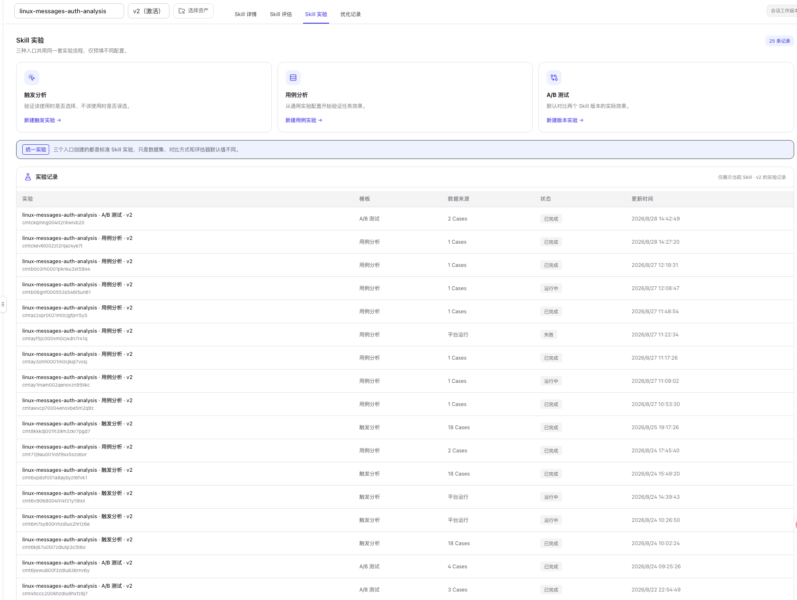

# Skill 评估与实验

Skill 工作台把质量验证分成两个页签：

- **Skill 评估**：检查当前快照或正式版本的内容质量，承担发布前静态质量门禁。
- **Skill 实验**：使用真实 Case、Trace 和评估器验证触发、任务效果以及版本差异。

两者都继承顶部选择的 Skill 和精确版本。切换版本后，结果和实验记录也随之切换。

## Skill 评估与 Skill 实验的区别

| 维度 | Skill 评估 | Skill 实验 |
| --- | --- | --- |
| 评测对象 | Skill 文件快照 | Skill 在 Agent 中的真实执行 |
| 是否需要数据集或 Trace | 不需要 | 需要数据集或已有 Trace |
| 主要结果 | 五个质量维度、问题清单、质量门禁 | 分数、触发率、误选/漏选、A/B 胜负和 Case 明细 |
| 典型用途 | 发布前检查、发现结构和安全问题 | 回归测试、效果验证、版本对比 |
| 可否用于未发布快照 | 可以 | 当前仅对正式版本开放 |

静态评估通过不代表真实效果一定提升；实验得分高也不能替代内容安全和工程健壮性检查。

## Skill 实验入口

打开目标正式版本的 **Skill 实验**页签，可以看到三种实验入口和当前版本的实验记录。

  

### 触发分析

验证当前 Skill 在应该使用时是否被选中、在不应该使用时是否被误选。入口会预置触发分析数据集和专用评估器。

### 用例分析

验证一批任务的最终结果与执行轨迹。可以选择已有 Trace，也可以从数据集 Case 重新生成 Trace，并按需选择结果或轨迹评估器。

### A/B 测试

在相同 Case 和评估器下比较两个 Skill 版本，或比较当前版本与无 Skill 基线。系统对 A、B 两侧自动配对后再统计分数与胜负。

## 统一四步向导

三个入口创建的都是标准 Skill 实验，只是默认配置不同。向导复用全局实验的四步流程：

1. **实验设计**
   - 自动带入当前 Skill 名称、版本和实验模板。
   - 选择待执行 Agent、数据集和实验类型。
   - A/B 测试还需要确定 A、B 两侧版本。
2. **Trace 来源**
   - 选择已有 Trace，或选择运行主机、模型与数据集 Case 生成新 Trace。
   - 触发分析和 A/B 测试默认生成新 Trace；用例分析默认选择已有 Trace。
3. **预期答案**
   - 已有 Trace 可以从数据集匹配参考答案和 Tool/Skill 目录。
   - 生成 Trace 时检查冻结的数据集快照。
4. **评估器与执行**
   - 查看冻结配置并选择可用评估器。
   - 触发分析固定使用 `skill-trigger-analyzer`；其他实验按模板预置常用评估器。

完整的 Trace 选择、数据集匹配和评估器门控说明见 [实验](../../evaluation/experiments)。

## 实验记录

实验记录只展示顶部当前 Skill 和精确版本的数据，包括：

- 实验名称与 ID。
- 使用的模板。
- 数据来源或 Case 数。
- 运行状态。
- 更新时间。

点击一条记录进入统一实验结果页。运行中、已完成和失败记录都会保留。

## 推荐验证顺序

1. 在 **Skill 评估**运行静态质量检查。
2. 使用 **触发分析**确认路由边界。
3. 使用 **用例分析**验证结果和轨迹。
4. 使用 **A/B 测试**确认新版本是否优于基线。
5. 把确认的问题交给 **Skill 优化**生成候选版本。
6. 发布新版本后，使用相同数据集和评估器复测。

## 下一步

- 查看静态质量与发布门禁：[Skill 评估](./static-compliance)
- 验证触发边界：[触发分析](./trigger-analysis)
- 验证任务效果：[用例分析](./use-case-analysis)
- 比较不同版本：[A/B 测试](./ab-test)
- 根据证据改进 Skill：[Skill 优化](../optimize)
