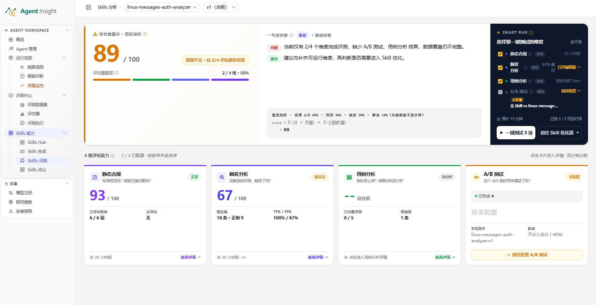

# Skills 评测总览

Skills 评测总览用于对指定 Skill 版本执行结构化评测，并汇总 **综合健康分**、**诊断结论** 与四个维度的分析结果。该模块同时承担两项职责：

- 创建评测任务
- 汇总评测结果

> **Note**
> Skills 评测总览以证据为中心组织结论。
> 页面中的分数、状态、诊断和维度卡片共同构成评测结论，不能仅凭单一分数判断 Skill 质量。

## 页面总览

下图展示 Skills 评测总览页的核心区域，包括综合健康分、诊断区、**SMART RUN** 与四个维度卡片。

  

图中各区域的职责如下：

- **综合健康分**：展示当前 Skill 版本的阶段性总分、评估覆盖度与已纳入计算的维度数量
- **一句话诊断** 与 **详细诊断**：汇总当前最重要的问题和建议，用于快速判断是否需要补数据或进入优化
- **SMART RUN**：集中勾选可运行的评测维度，并通过 **一键创建 N 项** 创建任务
- **4 维评估能力**：分别展示 **静态合规**、**触发分析**、**用例分析**、**A/B 测试** 的状态、分数和入口

## Skill 评测的创建流程

### 创建评测任务

**前提条件**

- 已进入目标 Skill 的指定版本
- 已打开 **Skills 评测总览**
- 已准备与评测维度对应的前置数据
- 已确认当前版本为待分析对象

各维度常见前置条件如下：

- **静态合规**：Skill 文件已生成，且可读取 `SKILL.md`
- **触发分析**：已准备触发评价集
- **用例分析**：已关联可用 Trace 或可评测用例
- **A/B 测试**：已准备对照版本、实验版本与实验配置

**预期结果**

- 系统创建所选评测任务
- 维度卡片更新为 **待分析**、**待扫描**、**执行中** 或 **已评测**
- 任务状态可在相关详情页或运行页继续跟踪

**操作步骤**

1. 打开 **Skills 评测总览**。
2. 选择目标 **Skill**。
3. 选择目标 **版本**。
4. 查看右侧 **SMART RUN** 区域。
5. 核对每个维度后的状态标签。
6. 勾选具备运行条件的评测维度。
7. 核对底部显示的预计耗时与可运行项数量。
8. 点击 **一键创建 N 项**。
9. 等待系统创建评测任务。
10. 查看各维度卡片的状态变化。

**系统反馈**

- 创建成功后，已选维度进入 **待分析**、**待扫描** 或 **执行中** 状态
- 不满足前置条件的维度继续显示 **未配置**
- 任务运行后，**综合健康分** 与 **评估覆盖度** 开始更新

- **提示**：优先勾选已具备前置条件的维度，有助于快速形成第一轮可解释结果。
- **警告**：在 **A/B 测试**、**触发分析** 或 **用例分析** 尚未配置完成时，综合分仅反映已运行维度，不能直接作为最终发布依据。
- **说明**：**用例分析** 维度只统计当前关联 **评测任务** 的结果；历史 Trace 上保留的旧评分不会自动计入总览综合健康分。

## 页面分工

### 综合总览

**综合总览** 用于统一查看当前 Skill 版本的评测进度与阶段性结论，核心功能包括：

- 汇总 **综合健康分** 与 **评估覆盖度**
- 显示 **一句话诊断** 与 **详细诊断**
- 通过 **SMART RUN** 快速创建评测任务
- 展示四个维度的当前状态、分数和跳转入口

该页适合完成首次判断、补齐缺失维度和确认下一步动作。

### 静态合规分析

**静态合规分析** 用于检查 Skill 内容本身是否规范，通常围绕文本扫描与规则校验展开。该页重点处理以下问题：

- `SKILL.md` 是否具备清晰的目标定义
- Skill 结构是否完整
- 指令边界是否明确
- 内容表达是否一致
- 运维约束是否充分
- 脚本与参考资料质量是否达标

该页适合在版本初稿生成后尽早执行，用于提前暴露结构性问题。

### 触发分析

**触发分析** 用于判断当前 Skill 是否在正确场景触发。该页通常包含配置、执行和结论三个阶段，重点关注：

- 触发评价集是否已配置完成
- 正样本是否被正确命中
- 负样本是否出现误触发
- 命中率与误触发率是否符合预期

当问题集中在“该触发时未触发”或“不该触发时被调用”时，应优先查看该页。

### 用例分析

**用例分析** 用于检查真实样本上的结果质量与执行轨迹。该页通常围绕用例集、评测执行和分析结论展开，重点关注：

- 最终结果是否达标
- 执行轨迹是否符合预期
- 高偏离样本是否集中在特定场景
- 当前 Trace 是否真实加载目标 Skill

当 Skill 已经被调用，但结果质量不稳定或过程偏离明显时，应优先查看该页。

### A/B 测试

**A/B 测试** 用于比较未使用 Skill 的对照版本与使用 Skill 的实验版本。该页重点回答以下问题：

- Skill 是否带来稳定收益
- 效果提升是否足以覆盖额外成本
- 差异是否来自 Skill，而不是其他变量

该页适合在已有基础结果后执行，用于确认 Skill 的真实增益。

## 四个评测维度如何协同工作

四个维度分别对应不同问题，组合后才能形成完整结论：

- **静态合规**：检查写法是否规范
- **触发分析**：检查调用时机是否正确
- **用例分析**：检查结果与过程是否可靠
- **A/B 测试**：检查 Skill 是否带来真实收益

推荐按以下顺序建立评测闭环：

1. 先执行 **静态合规**。
2. 再执行 **触发分析**。
3. 再执行 **用例分析**。
4. 最后执行 **A/B 测试**。

该顺序有助于先发现结构问题，再定位触发问题，最后验证真实收益。

## 综合健康分的解读方法

**综合健康分** 用于表达当前证据下的阶段性健康状态，而不是绝对结论。解读时应同时查看以下三项信息：

- **分数**：当前已完成维度的加权结果
- **覆盖度**：四个维度中已有多少维度完成评测
- **诊断**：系统基于当前结果给出的主要问题与建议

其中 **用例分析** 的分数来自当前关联评测任务下的结果质量分与轨迹质量分；切换或新建评测任务后，总览会随当前任务重新计算。

常见解读方法如下：

- 分数高且覆盖度高：说明当前版本整体表现稳定
- 分数高但覆盖度低：说明结论仍不充分，应继续补齐维度
- 分数低且覆盖度高：说明问题已较明确，应进入优化阶段
- 分数低且覆盖度低：说明当前更适合继续补数据，而不是直接优化

## 状态标签说明

页面中常见的状态标签包括：

- **未配置**：缺少前置数据或实验配置，当前无法运行
- **待扫描**：已满足扫描条件，但尚未开始静态合规分析
- **待分析**：已具备运行条件，但尚未产出评测结论
- **执行中**：后台任务正在运行
- **已评测**：已有可用结果，可进入详情页查看

当维度长期停留在 **未配置** 状态时，应优先补齐样本、Trace、触发集或实验参数，而不是反复重试运行。

## 分析结果如何用于下一步

### 补齐评测证据

当页面主要问题是覆盖度不足时，应优先补齐输入数据：

1. 补充 Trace 样本。
2. 补充触发评价集。
3. 配置 A/B 实验参数。
4. 重新创建缺失维度的评测任务。

**预期结果**

- 综合健康分覆盖更多维度
- 诊断结论从“数据不足”转为“问题明确”或“结果稳定”

### 进入优化闭环

当问题已经明确时，应将分析结果直接转入优化流程。常见触发条件包括：

- **触发分析** 显示命中率偏低或误触发率偏高
- **用例分析** 显示高偏离样本集中
- **静态合规** 显示结构或指令存在阻断性问题
- **A/B 测试** 显示收益不明显或成本明显上升

处理完成后，进入 [Skills 优化](../optimize) 继续迭代版本。

## 常见误区

- 只查看 **综合健康分**，忽略 **评估覆盖度**
- 将 **未配置** 误判为系统错误
- 只关注结果分数，忽略触发过程与执行轨迹
- 在证据不足时直接开始优化

## 下一步

- 返回 Skill 资产入口： [Skills 管理](../manage)
- 从需求生成新版本： [Skills 生成](../generate)
- 基于分析结果继续迭代： [Skills 优化](../optimize)
- 返回 Skills 模块总览： [Skills 能力](../index)
