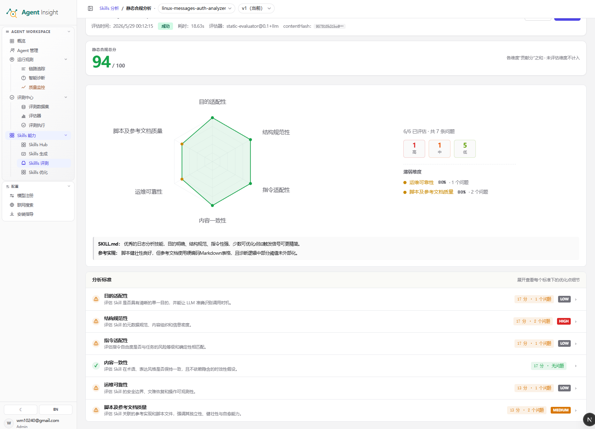

# 静态合规分析

静态合规分析用于在**不运行 Skill** 的前提下，对 Skill 主文件、脚本与关联参考资料执行结构化质量检查，输出量化分数、问题分级与可下钻的优化建议。该能力优先回答三类问题：

- Skill 的目标、结构与指令是否清晰
- 内容表达与术语是否一致
- 运维边界、脚本实现与参考资料是否可靠

<Note>
  静态合规分析属于 **Skills 评测** 的起始环节。该结果通常先于
  **触发分析**、**用例分析** 与 **A/B 测试** 生成，用于尽早暴露结构性缺陷。
</Note>

## 页面总览

下图展示静态合规分析结果页的核心区域，包括顶部筛选区、评估元数据、总分区、雷达图、问题统计、结论摘要与底部 **分析标准** 明细。

## 功能定位

静态合规分析承担“先筛查结构风险，再进入深度评测”的职责，适用场景包括：

- 新版本生成完成后，先执行首轮结构检查
- 评测结果异常前，先排除文档与脚本层面的基础问题
- 进入触发分析或用例分析前，先建立稳定的内容基线

常见输出结论包括：

- 目的定义不清晰
- 文档结构不完整
- 指令自由度与风险等级不匹配
- 术语与表达前后不一致
- 运维约束或参考资料不充分

## 创建流程

### 创建静态合规分析任务

**前提条件**

- 已完成目标 Skill 的版本生成
- 已进入目标 Skill 的目标版本
- 已打开 **Skills 评测总览**
- 已确认当前版本包含待检查的 `SKILL.md` 与关联资料

**预期结果**

- 系统创建静态合规分析任务
- **静态合规** 卡片进入 **待扫描**、**执行中** 或 **已评测** 状态
- 结果页生成总分、问题统计与分析标准明细

**操作步骤**

1. 打开 **Skills 评测总览**。
2. 选择目标 **Skill**。
3. 选择目标 **版本**。
4. 查看 **SMART RUN** 区域。
5. 勾选 **静态合规**。
6. 点击 **一键创建 N 项**。
7. 等待任务状态变更。
8. 打开 **静态合规分析** 结果页。

**系统反馈**

- 创建成功后，**静态合规** 卡片显示新状态标签
- 扫描完成后，结果页展示 **静态合规总分** 与维度分析结果
- 元数据区生成 **评估时间**、**状态**、**耗时**、**评估器** 与 **contentHash**

<Tip>
  优先执行静态合规分析，有助于在低成本阶段发现目标定义、结构组织和脚本可靠性问题。
</Tip>

<Warning>
  静态合规分析仅检查静态内容质量，不验证真实触发效果、执行轨迹与收益提升。发布判断仍需结合
  **触发分析**、**用例分析** 与 **A/B 测试**。
</Warning>

## 页面功能

### 顶部筛选区

**前提条件**

- 已存在至少一个 Skill 版本的静态合规分析结果

**预期结果**

- 页面切换到指定 Skill 与版本的分析结果

该区域包含以下功能：

- **面包屑导航**：标识当前所在模块与分析页面
- **Skill 下拉框**：切换目标 Skill
- **版本下拉框**：切换目标版本或历史结果

### 评估元数据区

**前提条件**

- 当前版本已完成至少一次静态合规分析

**预期结果**

- 页面展示本次评估的溯源信息

各字段含义如下：

| 字段 | 含义 | 作用 |
|------|------|------|
| **评估时间** | 本次任务完成的时间点 | 用于追溯结果生成时间 |
| **状态** | 本次任务是否成功完成 | 用于确认结果可用性 |
| **耗时** | 本次分析消耗的时间 | 用于观察执行效率 |
| **评估器** | 执行静态合规分析的评估器及版本 | 用于识别评分逻辑来源 |
| **contentHash** | 被分析内容的指纹哈希 | 用于判断本次结果是否对应同一份内容 |

### 静态合规总分区

**前提条件**

- 当前版本已产出完整的静态合规分析结果

**预期结果**

- 页面展示当前版本的整体静态质量水平

该区域用于汇总当前版本的总分，通常承担以下作用：

- 输出整体质量判断
- 提供首屏优先级排序依据
- 为后续维度下钻建立总览基线

### 雷达图与问题统计区

**前提条件**

- 评估器已完成各维度打分与问题聚合

**预期结果**

- 页面展示各维度强弱分布与问题严重度统计

该区域包含以下信息：

- **雷达图**：展示六个维度的得分分布，图形越饱满表示整体质量越稳定
- **维度覆盖率**：展示已评估维度数量与总维度数量
- **问题分级统计**：按高、中、低汇总问题数量
- **薄弱维度**：列出当前得分偏低或问题较集中的维度

### 结论摘要区

**前提条件**

- 大模型或规则评估器已生成自然语言总结

**预期结果**

- 页面展示适合快速决策的文字结论

该区域通常按对象拆分结论：

- **SKILL.md**：总结目标、结构、指令与表达问题
- **参考实现**：总结脚本、配置或参考资料问题

### 分析标准区

**前提条件**

- 各维度已生成得分、问题数与优化建议

**预期结果**

- 页面展示逐维度的明细结果，支持按优先级下钻

该区域逐行展示以下信息：

- 维度名称
- 评估说明
- 维度得分
- 问题数量
- 严重度标签
- 展开入口

## 评估维度与参数

### 六个评估维度

平台从以下六个角度审视 Skill：

| 维度 | 评估内容 |
|------|---------|
| **目的适配性** | 检查 Skill 是否具有清晰、单一且可识别的目标 |
| **结构规范性** | 检查元数据、章节组织与信息密度是否合理 |
| **指令适配性** | 检查指令自由度是否与任务风险、确定性和约束强度匹配 |
| **内容一致性** | 检查术语、表达方式与假设前提是否前后一致 |
| **运维可靠性** | 检查安全边界、恢复策略、可观测性与执行约束是否充分 |
| **脚本及参考文档质量** | 检查脚本、示例、参考资料是否独立、健壮、可维护 |

### 关键参数说明

| 参数 | 形式 | 说明 |
|------|------|------|
| **静态合规总分** | `0-100` | 各维度贡献分之和，用于表达整体静态质量 |
| **维度得分** | 数值 | 单个维度按权重折算后的得分 |
| **维度覆盖率** | `已评估/总数` | 表示本次实际参与评分的维度范围 |
| **问题分级** | `高 / 中 / 低` | 表示单条问题的风险等级 |
| **维度严重度标签** | `HIGH / MEDIUM / LOW / 无问题` | 表示单个维度的整体风险等级 |
| **contentHash** | 哈希字符串 | 表示被分析内容的唯一指纹 |

<Note>
  **问题分级** 与 **维度严重度标签** 属于两套标记体系。前者描述单条问题的危害程度，后者描述单个维度的整体风险水平。
</Note>

## 操作步骤

### 阅读静态合规分析结果

**前提条件**

- 已完成静态合规分析任务
- 已进入目标 Skill 与目标版本的结果页

**预期结果**

- 完成总分判断、短板定位与问题下钻
- 明确后续修改顺序与复评重点

**操作步骤**

1. 核对顶部 **Skill** 与 **版本** 选择器。
2. 查看元数据区的 **状态**。
3. 核对元数据区的 **contentHash**。
4. 查看 **静态合规总分**。
5. 观察雷达图的凹陷维度。
6. 查看右侧问题分级统计。
7. 读取 **薄弱维度** 列表。
8. 阅读结论摘要中的 **SKILL.md** 结论。
9. 阅读结论摘要中的 **参考实现** 结论。
10. 查看底部 **分析标准** 列表。
11. 展开高风险维度。
12. 记录高优先级问题。
13. 按风险等级整理修改顺序。

**系统反馈**

- 维度存在高风险问题时，页面显示 `HIGH` 标签
- 维度无问题时，页面显示 **无问题** 或同等无风险标识
- 结果页切换版本后，元数据、分数与问题明细同步刷新

## 结果解读

### 总分解读

**静态合规总分** 用于表达当前版本在静态质量维度上的整体水平，解读时应同时结合以下信息：

- **总分**：判断整体静态质量是否稳定
- **维度覆盖率**：判断结论是否完整
- **问题分级**：判断修复优先级
- **结论摘要**：判断问题集中区域

常见解读方式如下：

- 总分高且高风险问题少，说明整体基础较稳定
- 总分高但存在 `HIGH` 标签，说明局部存在阻断性缺陷
- 总分低且薄弱维度集中，说明需要先处理结构性问题
- 覆盖率不足，说明当前结果仍需结合更多维度确认

### 分级处理顺序

建议按照以下顺序处理问题：

1. 处理 `HIGH` 问题。
2. 处理 `MEDIUM` 问题。
3. 处理 `LOW` 问题。
4. 重新执行静态合规分析。
5. 对比新旧 **静态合规总分**。
6. 对比新旧 **contentHash**。

### 明细行读法

在 **分析标准** 区读取单个维度时，应综合判断以下三项信息：

- **得分**：反映当前维度的整体完成度
- **问题数**：反映当前维度的缺陷密度
- **严重度标签**：反映当前维度的风险上限

常见组合含义如下：

- 得分高且标签为 `LOW`，表示当前维度整体稳定
- 得分高但标签为 `HIGH`，表示存在少量但高危的问题
- 得分低且问题数多，表示当前维度是主要整改区域
- 显示 **无问题**，表示当前维度没有识别到显著缺陷

## 典型改进闭环

**前提条件**

- 已完成结果阅读与问题分级

**预期结果**

- 完成“定位问题、修改内容、重新验证”的闭环

**操作步骤**

1. 定位薄弱维度。
2. 展开高风险维度。
3. 提取具体优化建议。
4. 修改 `SKILL.md`。
5. 修改脚本或参考资料。
6. 保存新版本内容。
7. 重新创建静态合规分析任务。
8. 对比新旧总分。
9. 对比新旧问题分级。
10. 确认高风险问题是否消失。

## 下一步

- 返回任务创建入口： [总览](./overview)
- 继续检查触发命中质量： [触发分析](./trigger-analysis)
- 继续检查结果质量与轨迹： [用例分析](./use-case-analysis)
- 进入迭代闭环： [Skills 优化](../optimize)
