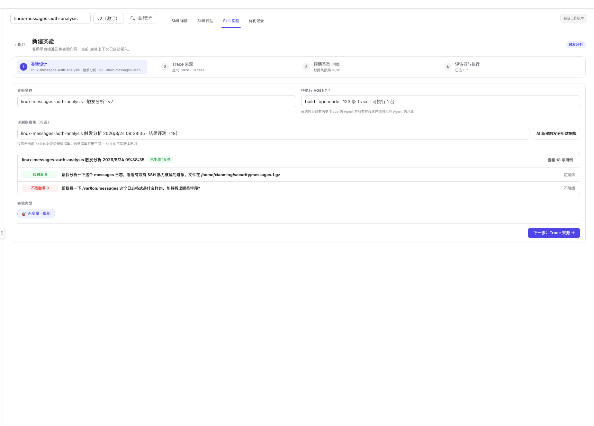

# 触发分析

触发分析验证当前 Skill 的路由边界：

- 应该使用 Skill 的输入是否正确触发。
- 不应该使用 Skill 的输入是否被误选。

它只判断 Skill 是否被正确选择，不直接评价最终答案质量。

## 创建触发实验

1. 在工作台顶部选择目标正式版本。
2. 打开 **Skill 实验**。
3. 点击 **新建触发实验**。
4. 在第 1 步选择待执行 Agent。
5. 选择当前 Skill 的触发分析数据集，或点击 **AI 新建触发分析数据集**。
6. 检查数据集同时包含 **应触发**和**不应触发**用例。
7. 展开用例后可以修改输入、切换正反类别、新增或删除用例；修改后先点击 **保存变更**。
8. 按四步向导完成运行主机、模型、Case 和评估器确认。

  

触发数据集必须满足：

- 至少包含一条有效输入。
- 同时存在应触发与不应触发样本。
- 所有编辑已经保存。

否则不能进入下一步。

## 默认实验配置

- **实验类型**：无变量、单组。
- **Trace 来源**：默认生成新 Trace。
- **数据集**：只列出当前 Skill 的触发分析数据集，可用于该 Skill 的不同版本回归。
- **评估器**：固定使用 `skill-trigger-analyzer`。

每条 Case 将数据集的 `should_trigger` 标注与真实路由结果比较：

- 判断一致：100 分。
- 判断不一致：0 分。

误选、漏选和触发准确率都由同一批路由事实汇总，不是额外评估器。

## 结果页

  

页面主要区域包括：

### 核心指标

- **执行进度**：完成 Case 数与总数。
- **触发准确率**：按正反用例统计的正确比例。
- **误选 / 漏选**：分别统计不应触发却触发、应触发却未触发的数量。
- **当前结论**：实验完成后的可用性提示。

截图示例中完成 18/18 条用例，触发准确率为 83.3%，误选 3 条、漏选 0 条。因此优先需要收紧不应触发场景，而不是扩大触发范围。

### 实验进度

统一显示：

1. 冻结实验配置。
2. 运行第一批正向用例。
3. 运行反向用例。
4. 生成实验结论。

### 已冻结配置

记录本次使用的 Skill 版本、Agent、数据集、Trace 来源、评估器和运行配置。后续修改 Skill 或数据集不会改变已经完成的实验。

### 评估器与 Case 明细

结果下半部分复用标准实验详情：

- 综合均分和评估器覆盖数。
- 每条输入、参考输出、实际输出和得分。
- **详情**用于查看单条评估证据。
- **新增 Case**可以在现有实验结果上继续补充样本。

## 结果解读

| 现象 | 可能问题 | 优化方向 |
| --- | --- | --- |
| 漏选较多 | 描述覆盖不足，触发条件过窄 | 补充适用场景、同义表达和输入特征 |
| 误选较多 | 排除条件不清楚，与其他 Skill 边界重叠 | 增加不适用条件和反例约束 |
| 正反两侧都差 | 触发描述含糊或数据集标签不稳定 | 先复核数据集，再重写触发说明 |
| 少数场景反复失败 | 特定语言、格式或业务表达未覆盖 | 将失败 Case 纳入回归集 |

不要只看综合分；应先区分误选和漏选，因为两者的修复方向相反。

## 下一步

- 返回实验入口：[Skill 评估与实验](./overview)
- 验证触发后的任务质量：[用例分析](./use-case-analysis)
- 比较修复前后版本：[A/B 测试](./ab-test)
- 根据失败 Case 优化 Skill：[Skill 优化](../optimize)
