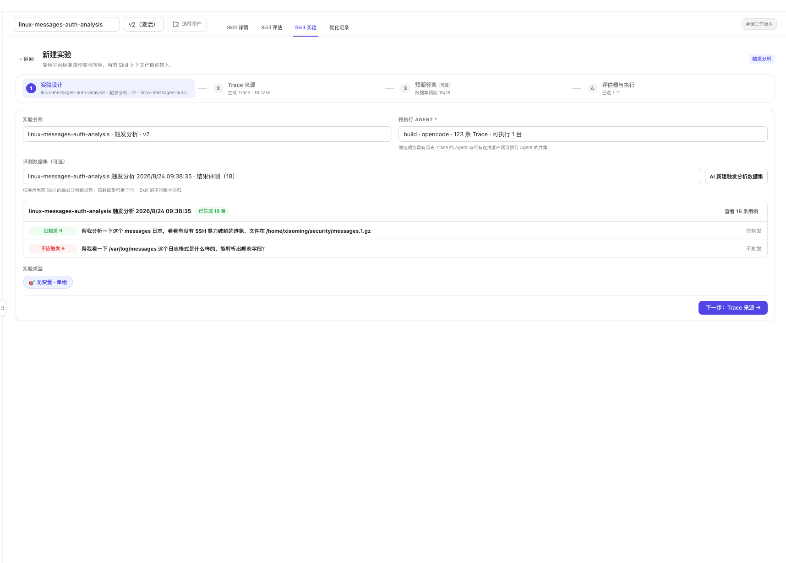
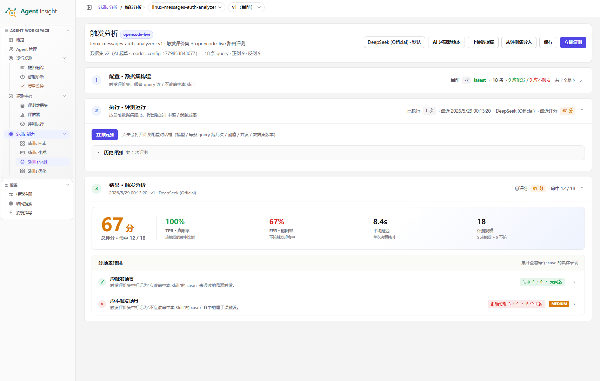

# 触发分析

触发分析验证当前 Skill 的路由边界：

- 应该使用 Skill 的输入是否正确触发。
- 不应该使用 Skill 的输入是否被误选。

它只判断 Skill 是否被正确选择，不直接评价最终答案质量。

## 创建触发实验

1. 在工作台顶部选择目标正式版本。
2. 打开 **Skill 实验**。
3. 点击 **新建触发实验**。
4. 在第 1 步选择待执行 Agent。
5. 选择当前 Skill 的触发分析数据集，或点击 **AI 新建触发分析数据集**。
6. 检查数据集同时包含 **应触发**和**不应触发**用例。
7. 展开用例后可以修改输入、切换正反类别、新增或删除用例；修改后先点击 **保存变更**。
8. 按四步向导选择支持只读触发分析的在线 OpenCode 客户端，并明确选择运行模型（不能使用“平台默认”），再确认 Case 和评估器。旧客户端需升级后才能成为可选目标。

  

触发数据集必须满足：

- 至少包含一条有效输入。
- 同时存在应触发与不应触发样本。
- 所有编辑已经保存。

否则不能进入下一步。

## 默认实验配置

- **实验类型**：无变量、单组。
- **执行来源**：默认在所选客户端运行；Trace 可随后上传用于查看，不再是触发判定的前置条件。
- **数据集**：只列出当前 Skill 的触发分析数据集，可用于该 Skill 的不同版本回归。
- **评估器**：固定使用 `skill-trigger-analyzer`。
- **执行时间**：默认 600 秒，可配置 30～3600 秒；触发分析从路由会话就绪后开始计时。OpenCode 启动准备另有 120 秒上限，不占用路由时限。

同一实验复用所选客户端的只读 Skill 工作区和已初始化依赖，每条 Case 仍创建独立进程和会话，不继承上一条对话。工作区冻结被测 Skill 版本及参与竞争的 Skill 元数据，不会强制加载被测 Skill。输入原样传递，路径开头的文本不会被解析为 Slash Command。客户端监听真实 Skill 工具调用：目标 Skill 成功加载后立即结束该 Case；未命中则等会话正常结束。服务端核对所选客户端、实际模型和模型活动证据，再将 `should_trigger` 标注与实际触发结果比较，无需等待完整 Trace 入库：

- 判断一致：100 分。
- 判断不一致：0 分。

误选、漏选和触发准确率都由同一批路由事实汇总，不是额外评估器。

模型不可用、模型/客户端不一致、监测通道未就绪、没有模型活动、超时或缺少正常结束证据时，该 Case 记为执行失败和未评测，不会被当作“未触发”计算正确率。只有模型配置/鉴权不可用、实际模型不一致或客户端身份不一致时，才停止后续 Case；单个输入或连接错误不会直接跳过整批。修复前已经产生的记录不会自动改分，请重新创建实验验证。

启动阶段超时显示“启动准备超时”，会话就绪后超时显示“路由超时”，不能仅凭未收到就绪信号断言客户端没有更新。更新平台代码后，执行客户端也需安装对应版本（触发能力版本 4）；历史失败结果保留，需手动重试或新建实验。

实验创建后会一次显示全部所选 Case，尚未执行的行显示“等待执行”。命中目标 Skill 时客户端会提前停止 Agent；未命中只有在会话正常结束并确认模型活动后才成立。Trace 是否完成上传不会推迟触发结论；执行错误或证据缺失仍显示失败，不会算作“未触发”。

## 结果页

  

页面主要区域包括：

### 核心指标

- **执行进度**：完成 Case 数与总数。
- **触发准确率**：按正反用例统计的正确比例。
- **误选 / 漏选**：分别统计不应触发却触发、应触发却未触发的数量。
- **当前结论**：实验完成后的可用性提示。

截图示例中完成 18/18 条用例，触发准确率为 83.3%，误选 3 条、漏选 0 条。因此优先需要收紧不应触发场景，而不是扩大触发范围。

### 实验进度

分别展示 **用例执行**和**触发判定**两条进度，按服务端已确认结束的用例统计“已结束 / 总数”。正向与反向用例共同计入总数，不再显示为两个先后执行的批次。

100% 表示处理结束，不代表全部成功，也不代表触发准确率为 100%。运行错误与触发判定是否正确由结果和明细区说明；配置记录继续在下方展示。

### 已冻结配置

记录本次使用的 Skill 版本、Agent、数据集、Trace 来源、评估器，以及创建时所选的执行客户端 / 模型；选择已有 Trace 时显示“—”。后续修改 Skill 或数据集不会改变已经完成的实验。

### 评估器与 Case 明细

结果下半部分复用标准实验详情：

- 综合均分和评估器覆盖数。
- 覆盖数使用整个实验的 Case 总数，例如“已计分 2 / 18 项”；均分只代表已计分项，不表示整批已完成。
- 每条输入、参考输出、实际输出和得分。
- **详情**用于查看单条评估证据。
- 已结束的单条 Case 显示“删除”，不随其他 Case 的运行状态显示“停止并删除”；执行失败但没有评测结果时明确提示“未进入评测”。
- **新增 Case**可以在现有实验结果上继续补充样本。

## 结果解读

| 现象 | 可能问题 | 优化方向 |
| --- | --- | --- |
| 漏选较多 | 描述覆盖不足，触发条件过窄 | 补充适用场景、同义表达和输入特征 |
| 误选较多 | 排除条件不清楚，与其他 Skill 边界重叠 | 增加不适用条件和反例约束 |
| 正反两侧都差 | 触发描述含糊或数据集标签不稳定 | 先复核数据集，再重写触发说明 |
| 少数场景反复失败 | 特定语言、格式或业务表达未覆盖 | 将失败 Case 纳入回归集 |

不要只看综合分；应先区分误选和漏选，因为两者的修复方向相反。

## 下一步

- 返回实验入口：[Skill 评估与实验](./overview)
- 验证触发后的任务质量：[用例分析](./use-case-analysis)
- 比较修复前后版本：[A/B 测试](./ab-test)
- 根据失败 Case 优化 Skill：[Skill 优化](../optimize)
