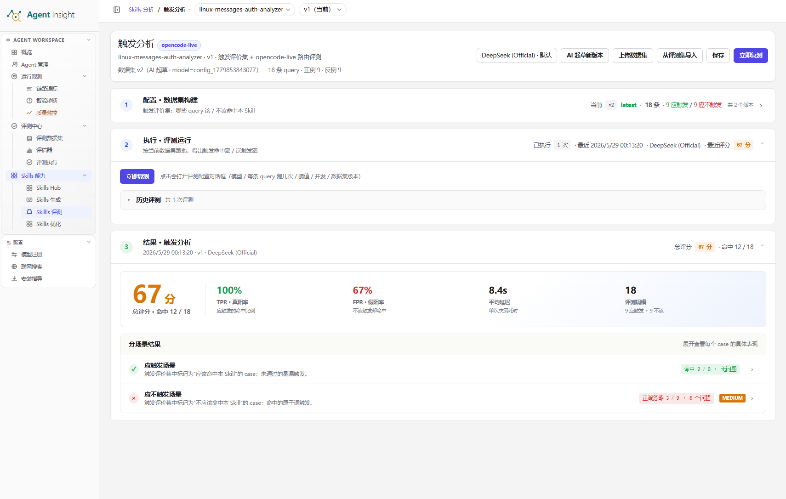

# 触发分析

触发分析用于验证当前 Skill 的触发时机是否正确。系统基于 **触发评价集**，在 `opencode-live` 路由下评测每条 query 是否命中目标 Skill，并输出 **总评分**、**TPR · 真阳率**、**FPR · 假阳率**、**平均延迟** 与 **分场景结果**。

<Note>
  触发分析关注“该不该触发”与“有没有被正确触发”，不直接判断最终输出内容质量。完整结论仍需结合
  **静态合规分析**、**用例分析** 与 **A/B 测试**。
</Note>

## 页面总览

下图展示触发分析页的核心区域，包括顶部信息与操作区、**配置 · 数据集构建**、**执行 · 评测运行** 与 **结果 · 触发分析**。

## 功能定位

触发分析承担“验证触发边界是否清晰、定位漏触发与误触发原因”的职责，适用场景包括：

- Skill 应该被调用但没有被调用
- Skill 不应该被调用却被命中
- 新版本上线前需要验证触发规则稳定性
- 多个 Skill 可能竞争同一类 query，需要确认路由边界

常见输出结论包括：

- 正例样本命中率不足
- 反例样本误触发率偏高
- 特定 query 容易被兄弟 Skill 抢路由
- 触发描述覆盖面不足或排除条件不清晰

## 创建流程

### 打开触发分析

**前提条件**

- 已完成目标 Skill 的版本生成
- 已进入目标 Skill 的目标版本
- 已打开 **Skills 评测总览**

**预期结果**

- 系统打开目标 Skill 的 **触发分析** 页面
- 页面顶部显示当前 **Skill**、**版本** 与数据集统计信息
- 页面进入可构建 **触发评价集** 的状态

**操作步骤**

1. 打开 **Skills 评测总览**。
2. 选择目标 **Skill**。
3. 选择目标 **版本**。
4. 打开 **触发分析**。
5. 核对页面顶部的 **Skill** 名称与 **版本**。

**系统反馈**

- 页面标题显示 **触发分析**
- 标题右侧显示 `opencode-live` 标识
- 顶部元信息显示 **数据集 vN**、query 数量、**正例** 数量与 **反例** 数量
- 尚未创建数据集时，页面显示 **尚未配置数据集**

### AI 起草触发评价集

**前提条件**

- 已进入目标 Skill 的 **触发分析** 页面
- 已存在可用的模型配置
- 已确认当前 Skill 的触发边界、适用场景与排除条件

**预期结果**

- 系统生成一份新的 **触发评价集** 草稿
- 页面新增一个数据集版本
- 页面顶部显示新的 **数据集 vN**

**操作步骤**

1. 选择起草模型。
2. 点击 **AI 起草** 或 **AI 起草新版本**。
3. 等待页面刷新数据集版本。
4. 检查 **应触发** 列表。
5. 检查 **不该触发** 列表。
6. 点击 **保存**。

**系统反馈**

- 起草过程中，按钮显示 **起草中...**
- 起草完成后，页面顶部显示新的数据集版本号
- **配置 · 数据集构建** 区域出现已生成的 query 条目

### 上传触发评价集

**前提条件**

- 已准备 `.json` 格式的数据文件
- 已确认数据项包含 `query` 与 `shouldTrigger`
- 已进入目标 Skill 的 **触发分析** 页面

**预期结果**

- 系统将上传内容追加为新的数据集版本
- 页面显示新增的 **数据集 vN**
- 新版本可直接用于后续触发评测

**操作步骤**

1. 点击 **上传数据集**。
2. 查看 **上传数据集 · 格式要求**。
3. 点击 **选择文件…**。
4. 选择目标 `.json` 文件。
5. 等待页面刷新数据集版本。

**系统反馈**

- 上传成功后，系统将文件内容作为新版本追加到当前数据集
- 页面顶部的 **数据集 vN** 版本号更新
- **配置 · 数据集构建** 区域显示新导入的 query 条目

<Tip>
  上传数据集支持两种顶层结构：直接传数组 `[...]`，或传对象 `{"items": [...]}`。每条数据至少包含
  `query` 与 `shouldTrigger`；`rationale` 为可选字段。
</Tip>

### 从评测集导入触发评价集

**前提条件**

- 已在 **评测中心** 创建可用的 **评测数据集**
- 已进入目标 Skill 的 **触发分析** 页面
- 已确认待导入数据适合作为 **正例（应触发）**

**预期结果**

- 系统将所选 **评测数据集** 的非空 `input` 导入当前 **触发评价集**
- 导入条目自动进入 **应触发** 列表
- 重复 query 自动跳过

**操作步骤**

1. 点击 **从评测集导入**。
2. 勾选或取消 **仅本 skill（包含未绑定的通用数据集）**。
3. 选择目标 **评测数据集**。
4. 查看右侧预览。
5. 选择 **新建一个版本** 或 **合并到当前版本**。
6. 点击 **导入 N 条**。
7. 点击 **保存**。

**系统反馈**

- 导入成功后，系统显示导入数量与跳过数量
- 选择 **新建一个版本** 时，系统直接生成新的数据集版本
- 选择 **合并到当前版本** 时，页面先更新编辑器内容，再由 **保存** 写入数据集版本

### 运行触发分析

**前提条件**

- 已完成 **触发评价集** 的构建或导入
- 已确认数据集中同时包含 **应触发** 与 **不该触发** 样本
- 已进入目标 Skill 的 **触发分析** 页面

**预期结果**

- 系统创建一次触发评测任务
- **执行 · 评测运行** 区域新增一条运行记录
- **结果 · 触发分析** 区域生成分数与分场景结论

**操作步骤**

1. 点击 **立即评测** 或 **立即复测**。
2. 选择 **数据集版本**。
3. 选择 **评测用的模型**。
4. 展开 **高级选项**。
5. 设置 **每条 query 跑几次**。
6. 设置 **触发阈值（0-1）**。
7. 设置 **单条超时（ms）**。
8. 设置 **并发数**。
9. 提交评测任务。

**系统反馈**

- 对话框标题显示 **跑触发评测**
- 执行成功后，**历史评测** 中新增一条 run 记录
- **结果 · 触发分析** 自动切换到最新评测结果

<Warning>
  历史数据集版本为只读状态。编辑或保存数据集时，需切回 `latest` 版本。
</Warning>

### 查看触发分析结果

**前提条件**

- 已完成至少一次触发评测
- 已进入目标 Skill 的 **触发分析** 页面

**预期结果**

- 页面展示本次 run 的总评分、关键指标与分场景结论
- 页面支持在最新结果与历史 run 之间切换
- 页面支持继续下钻单个 case 的具体表现

**操作步骤**

1. 展开 **结果 · 触发分析**。
2. 查看 **总评分**。
3. 查看 **TPR · 真阳率**。
4. 查看 **FPR · 假阳率**。
5. 查看 **平均延迟**。
6. 查看 **评测规模**。
7. 展开 **分场景结果**。
8. 切换到 **应触发场景** 或 **应不触发场景**。
9. 展开具体 case。

**系统反馈**

- 首屏展示 **总评分 · 命中 X / Y**
- 指标区展示 **TPR · 真阳率**、**FPR · 假阳率**、**平均延迟** 与 **评测规模**
- **分场景结果** 显示通过状态、命中数或正确忽略数

## 页面功能

### 顶部信息与操作区

该区域负责展示当前上下文并承载数据集与评测操作：

- **Skill** 与 **版本**：标识当前正在分析的对象
- **数据集 vN**：标识当前使用的 **触发评价集** 版本
- **正例 / 反例**：展示当前数据集的样本构成
- **AI 起草**、**AI 起草新版本**：自动生成触发评价集草稿
- **上传数据集**：从本地 `.json` 文件创建新版本
- **从评测集导入**：将 **评测数据集** 的 `input` 批量导入为 **正例（应触发）**
- **保存**：保存当前编辑器中的数据集改动
- **立即评测**、**立即复测**：启动触发评测任务

### 配置 · 数据集构建

该区域用于构建与维护 **触发评价集**：

- **应触发**：存放应该命中目标 Skill 的 query
- **不该触发**：存放不应该命中目标 Skill 的 query
- **+ 加正例**：新增 **应触发** 样本
- **+ 加反例**：新增 **不该触发** 样本
- **挪到反例 →**、**← 挪到正例**：在两列之间修正样本归类
- **删**：删除错误或无效样本
- **历史版本**：查看该 Skill 的历史数据集版本；历史版本仅支持只读查看

### 执行 · 评测运行

该区域用于提交评测任务并管理 run 历史：

- **立即评测**：对尚未评测的数据集启动首次评测
- **立即复测**：基于当前配置再次执行评测
- **历史评测**：列出当前 Skill 的历史 run 记录
- **评测配置对话框**：设置数据集版本、评测模型、运行次数、阈值、超时与并发

### 结果 · 触发分析

该区域用于汇总触发评测结果并支持分场景排查：

- **总评分**：展示本次 run 的综合得分与命中数
- **TPR · 真阳率**：展示 **应触发** 样本的命中比例
- **FPR · 假阳率**：展示 **不该触发** 样本被误命中的比例
- **平均延迟**：展示单次触发决策耗时
- **评测规模**：展示参与本次评测的样本总数
- **分场景结果**：按 **应触发场景** 与 **应不触发场景** 拆分结果
- **历史 run**：切换到旧结果查看阶段性变化

## 指标说明

| 指标 | 含义 | 解读方式 |
|------|------|----------|
| **总评分** | 当前 run 的综合评分 | 用于快速判断当前触发质量是否达到可接受水平 |
| **TPR · 真阳率** | **应触发** 样本的命中比例 | 数值越高，漏触发越少 |
| **FPR · 假阳率** | **不该触发** 样本被误命中的比例 | 数值越低，误触发越少 |
| **平均延迟** | 单次触发决策耗时 | 用于观察评测时的路由决策开销 |
| **评测规模** | 本次 run 的样本总数 | 用于判断当前结论的覆盖范围 |
| **应触发场景** | 正例样本的分组结果 | 重点定位漏触发问题 |
| **应不触发场景** | 反例样本的分组结果 | 重点定位误触发问题 |

## 相关页面职责

- **Skills 评测总览**：汇总展示各评测维度的状态、分数与入口
- **触发分析**：构建 **触发评价集**、执行触发评测并查看结果
- **评测数据集**：为 **从评测集导入** 提供候选 query 来源
- **用例分析**：验证 Skill 在真实样本上的结果质量与执行轨迹
- **Skills 优化**：根据触发问题、结构问题与结果问题推进版本优化

## 下一步

- 返回评测总览： [总览](./overview)
- 继续查看结果质量： [用例分析](./use-case-analysis)
- 进入优化流程： [Skills 优化](../optimize)
